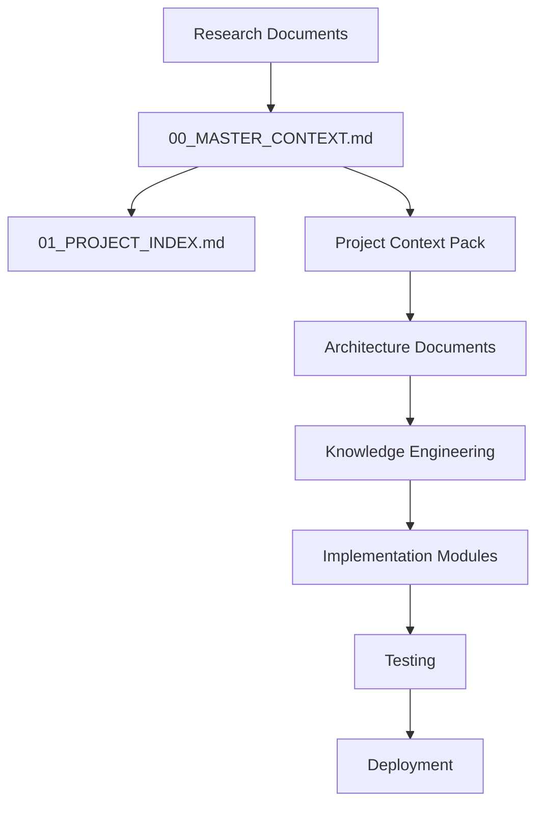

# 01_PROJECT_INDEX.md

# Dayjoy Enterprise AI Platform — Master Project Index

> **Status:** Completed / In Progress / Planned / Future  
> **Purpose:** Master navigation index and documentation map for the Dayjoy Enterprise AI Platform repository.  
> **Audience:** Executives, developers, architects, project managers, AI assistants, and documentation owners.

---

## Table of Contents

1. [Project Overview](#1-project-overview)
2. [Repository Structure](#2-repository-structure)
3. [Research Documents](#3-research-documents)
4. [Documentation Files](#4-documentation-files)
5. [Project Context Pack](#5-project-context-pack)
6. [System Architecture Documents](#6-system-architecture-documents)
7. [Implementation Modules](#7-implementation-modules)
8. [File Dependency Map](#8-file-dependency-map)
9. [Navigation Guide](#9-navigation-guide)
10. [Status Dashboard](#10-status-dashboard)
11. [Naming Standards](#11-naming-standards)
12. [Version Control](#12-version-control)
13. [Future Repository Growth](#13-future-repository-growth)
14. [Quick Links](#14-quick-links)
15. [Maintenance Guidelines](#15-maintenance-guidelines)

---

## 1. Project Overview

| Item | Description |
|---|---|
| Project Name | Dayjoy Enterprise AI Platform |
| Purpose | Build a production-ready AI platform for customers, distributors, employees, and management. |
| Current Stage | Research and documentation completed; architecture planning next. |
| Repository Purpose | Central source of truth for research, context, architecture, and implementation guidance. |

**VERIFIED:** The platform is being designed around research documents, AI opportunities, business processes, journeys, policies, and knowledge engineering outputs. [00_MASTER_CONTEXT.md][file:01_Company_Research–file:12_Research_Gap_Analysis]

---

## 2. Repository Structure

> The repository is organized by research, context, architecture, knowledge engineering, and future implementation layers.

```text
Dayjoy-Enterprise-AI/
├── 00_MASTER_CONTEXT.md
├── 01_PROJECT_INDEX.md
├── Research/
│   ├── 01_Company_Research.md
│   ├── 02_Business_Model.md
│   ├── 03_Product_Research.md
│   ├── 04_Distributor_System.md
│   ├── 05_Policies.md
│   ├── 06_FAQs.md
│   ├── 07_Customer_Journey.md
│   ├── 08_Business_Processes.md
│   ├── 09_Competitor_Analysis.md
│   ├── 10_Pain_Points.md
│   ├── 11_AI_Opportunities.md
│   └── 12_Research_Gap_Analysis.md
├── Documentation/
│   ├── 00_MASTER_CONTEXT.md
│   ├── 01_PROJECT_INDEX.md
│   └── future supporting docs
├── Knowledge/
│   ├── RAG sources
│   ├── embeddings metadata
│   └── knowledge governance docs
├── Architecture/
│   ├── system overview
│   ├── AI architecture
│   ├── API architecture
│   └── deployment architecture
├── Backend/
├── Frontend/
├── AI/
├── Integrations/
├── Deployment/
├── Testing/
├── Assets/
├── Scripts/
└── Configurations/
```

**Status Key:**
- **Completed** — already created
- **In Progress** — being developed
- **Planned** — intended next
- **Future** — later phase

---

## 3. Research Documents

| File | Purpose | Status | Related Documents |
|---|---|---|---|
| 01_Company_Research.md | Company profile, history, mission, legal details | Completed | 02, 04, 12 |
| 02_Business_Model.md | Business model, value proposition, SWOT | Completed | 01, 04, 10 |
| 03_Product_Research.md | Product categories, flagship products, product data gaps | Completed | 05, 06, 11, 12 |
| 04_Distributor_System.md | Distributor program, compensation, training, compliance | Completed | 02, 06, 08, 10, 11 |
| 05_Policies.md | Shipping, returns, refunds, privacy, terms | Completed | 06, 08, 12 |
| 06_FAQs.md | Customer, distributor, employee, policy FAQs | Completed | 05, 07, 08, 10, 11 |
| 07_Customer_Journey.md | Customer and distributor journey maps | Completed | 06, 08, 10, 11 |
| 08_Business_Processes.md | Operational process maps and workflows | Completed | 05, 07, 10, 11 |
| 09_Competitor_Analysis.md | Competitor and market comparison | Completed | 02, 10, 11 |
| 10_Pain_Points.md | Pain point analysis and AI requirements | Completed | 06, 07, 08, 11, 12 |
| 11_AI_Opportunities.md | AI strategy blueprint and capability map | Completed | 03, 04, 05, 06, 07, 08, 10, 12 |
| 12_Research_Gap_Analysis.md | Readiness, gaps, risks, client questions | Completed | All research files |

---

## 4. Documentation Files

| File | Purpose | Status | Dependencies |
|---|---|---|---|
| 00_MASTER_CONTEXT.md | Master source of truth | Completed | All research files |
| 01_PROJECT_INDEX.md | Repository navigation index | Completed | 00_MASTER_CONTEXT.md |
| 02_KNOWN_FACTS.md | Future facts registry | Planned | Research docs |
| 03_UNKNOWN_INFORMATION.md | Future unknowns tracker | Planned | Research gap analysis |
| 04_DOCUMENT_MAP.md | Document relationship map | Planned | All docs |
| 05_RESEARCH_LOG.md | Research activity log | Planned | Research updates |
| 06_DECISIONS.md | Decision register | Planned | Architecture and approvals |
| 07_NEXT_ACTIONS.md | Action tracker | Planned | Gap analysis, roadmap |

---

## 5. Project Context Pack

| File | Description | Status |
|---|---|---|
| 00_MASTER_CONTEXT.md | Top-level summary and master instructions | Completed |
| 01_PROJECT_BRIEF.md | Executive project summary | Planned |
| 02_BUSINESS_CONTEXT.md | Business background and strategic context | Planned |
| 03_PRODUCT_CONTEXT.md | Product and catalog overview | Planned |
| 04_AI_VISION.md | AI vision and principles | Planned |
| 05_PERSONAS.md | Key personas and user profiles | Planned |
| 06_FEATURE_WISHLIST.md | Desired AI features | Planned |
| 07_BUSINESS_PROCESSES.md | Business process summary | Planned |
| 08_CONSTRAINTS.md | Constraints, assumptions, dependencies | Planned |
| 09_TECH_STACK.md | Current and proposed tech stack | Planned |
| 10_CODING_STANDARDS.md | Engineering standards | Planned |
| 11_DOCUMENTATION_RULES.md | Documentation governance rules | Planned |
| 12_ARCHITECTURE_PRINCIPLES.md | Architecture principles | Planned |
| 13_AI_BEHAVIOR.md | AI response behavior and guardrails | Planned |
| 14_FUTURE_INTEGRATIONS.md | Future integrations map | Planned |
| 15_SUCCESS_METRICS.md | Success criteria and KPIs | Planned |

---

## 6. System Architecture Documents

| File | Purpose | Status |
|---|---|---|
| 00_SYSTEM_OVERVIEW.md | High-level system summary | Planned |
| 01_HIGH_LEVEL_ARCHITECTURE.md | Overall architecture diagram | Planned |
| 02_AI_ECOSYSTEM.md | AI assistants and agent ecosystem | Planned |
| 03_AGENT_ARCHITECTURE.md | Agent roles and orchestration | Planned |
| 04_KNOWLEDGE_ARCHITECTURE.md | RAG, taxonomy, retrieval design | Planned |
| 05_DATABASE_DESIGN.md | Data model and persistence design | Planned |
| 06_API_ARCHITECTURE.md | API patterns and endpoints | Planned |
| 07_TOOL_ARCHITECTURE.md | Tool/function architecture | Planned |
| 08_WORKFLOW_ARCHITECTURE.md | Workflow and automation design | Planned |
| 09_SECURITY_ARCHITECTURE.md | Security, auth, access control | Planned |
| 10_DEPLOYMENT_ARCHITECTURE.md | Environments and deployment model | Planned |
| 11_MONITORING_ARCHITECTURE.md | Logging, metrics, observability | Planned |
| 12_SCALABILITY_PLAN.md | Performance and growth plan | Planned |
| 13_TECH_STACK.md | Approved tools and frameworks | Planned |
| 14_DEVELOPMENT_ROADMAP.md | Engineering roadmap | Planned |
| 15_FOLDER_STRUCTURE.md | Final folder architecture | Planned |

---

## 7. Implementation Modules

| Module | Purpose | Status |
|---|---|---|
| Backend | APIs, business logic, integrations | Planned |
| Frontend | Web portal and dashboards | Planned |
| AI Services | Agents, RAG, orchestration | Planned |
| API Layer | Internal and external API gateway | Planned |
| Database | Operational and analytics persistence | Planned |
| Integrations | CRM, ERP, WhatsApp, Vapi, payment, email | Planned |
| n8n Workflows | Automation and approvals | Planned |
| Vapi Configuration | Voice AI call handling | Planned |
| Knowledge Base | Searchable source of truth | Planned |
| Testing | QA, validation, evals | Planned |
| Deployment | Production release and environment setup | Planned |

---

## 8. File Dependency Map



**Dependency Logic:**
- Research defines facts.
- Master context summarizes facts.
- Project context turns facts into reusable project guidance.
- Architecture translates guidance into system design.
- Knowledge engineering prepares RAG and governance.
- Implementation modules build the system.

---

## 9. Navigation Guide

### For Business Stakeholders
Read:
- `00_MASTER_CONTEXT.md`
- `10_Pain_Points.md`
- `11_AI_Opportunities.md`
- `12_Research_Gap_Analysis.md`

### For Developers
Read:
- `00_MASTER_CONTEXT.md`
- `01_PROJECT_INDEX.md`
- Architecture docs
- Knowledge architecture docs
- API/database docs

### For AI Coding Assistants
Read in this order:
1. `00_MASTER_CONTEXT.md`
2. `01_PROJECT_INDEX.md`
3. Project context pack
4. Architecture docs
5. Knowledge engineering docs
6. Implementation task docs

### For Project Managers
Read:
- `00_MASTER_CONTEXT.md`
- `12_Research_Gap_Analysis.md`
- `06_DECISIONS.md`
- `07_NEXT_ACTIONS.md`

---

## 10. Status Dashboard

| Area | Status | Completion % |
|---|---|---|
| Research | Completed | 100% |
| Documentation | Completed / In progress | 85% |
| Context Pack | Planned | 10% |
| Architecture | Planned | 5% |
| Knowledge Engineering | Planned | 10% |
| Backend | Planned | 0% |
| Frontend | Planned | 0% |
| AI | Planned | 5% |
| Integrations | Planned | 0% |
| Testing | Planned | 0% |
| Deployment | Planned | 0% |

---

## 11. Naming Standards

| Artifact Type | Convention | Example |
|---|---|---|
| Folders | `snake_case` or descriptive numbered folders | `Research/`, `Architecture/` |
| Markdown files | `NN_Descriptive_Name.md` | `00_MASTER_CONTEXT.md` |
| APIs | RESTful nouns, versioned | `/api/v1/orders` |
| Databases | Descriptive table names, lowercase snake_case | `customer_profiles` |
| Source code | Conventional language naming standards | `order_service.py` |
| AI agents | Role-based names | `customer_support_agent` |
| Workflows | Verb-noun names | `refund_approval_flow` |

---

## 12. Version Control

| Practice | Recommendation |
|---|---|
| Versioning | Use semantic versions for major docs and architecture (`v1.0`, `v1.1`). |
| Change logs | Record why changes were made and who approved them. |
| Review dates | Re-review research and policy docs on a scheduled cadence. |
| Document owners | Assign one owner per major document family. |
| Approval status | Mark docs as Draft / Reviewed / Approved. |

---

## 13. Future Repository Growth

**Guidelines:**
- Add files under the correct folder by domain.
- Keep numbered naming conventions for core navigation docs.
- Update `01_PROJECT_INDEX.md` whenever files are added, renamed, or retired.
- Link new files back to related research and context docs.
- Preserve modularity: one document, one purpose.
- Keep content RAG-friendly with clear headings and minimal duplication.

---

## 14. Quick Links

### Executives
- `00_MASTER_CONTEXT.md`
- `10_Pain_Points.md`
- `11_AI_Opportunities.md`
- `12_Research_Gap_Analysis.md`

### Developers
- `00_MASTER_CONTEXT.md`
- `01_PROJECT_INDEX.md`
- Architecture documents
- API / Database / Workflow documents

### AI Engineers
- `00_MASTER_CONTEXT.md`
- `11_AI_Opportunities.md`
- `04_KNOWLEDGE_ARCHITECTURE.md`
- `03_AGENT_ARCHITECTURE.md`

### Product Managers
- `02_Business_Model.md`
- `07_Customer_Journey.md`
- `08_Business_Processes.md`
- `10_Pain_Points.md`
- `11_AI_Opportunities.md`

### Support Teams
- `05_Policies.md`
- `06_FAQs.md`
- `08_Business_Processes.md`
- `10_Pain_Points.md`

---

## 15. Maintenance Guidelines

### Update Rules
- Update research docs when new verified information is discovered.
- Update master context and project index when any major document changes.
- Keep policy and product documents current with official Dayjoy updates.
- Revisit gap analysis before architecture or implementation milestones.

### Obsolete Files
- Do not delete without replacement or archival note.
- Mark obsolete documents as superseded and link to the updated version.

### Major Decisions
- Log all important decisions in a decision register.
- Include date, rationale, owner, and affected documents.

### Consistency
- Use the same terminology across all files.
- Maintain VERIFIED / PARTIALLY VERIFIED / UNKNOWN / REQUIRES CLIENT INPUT labels.
- Prefer summaries and references over duplication.

---

## Source References

- `00_MASTER_CONTEXT.md`  
- `01_Company_Research.md` to `12_Research_Gap_Analysis.md`  
- Official Dayjoy resources: website, FAQs, policies, compliance, downloads, product pages. [web:16][web:14][web:59][web:69][web:67][web:35]

---

**END OF DOCUMENT**