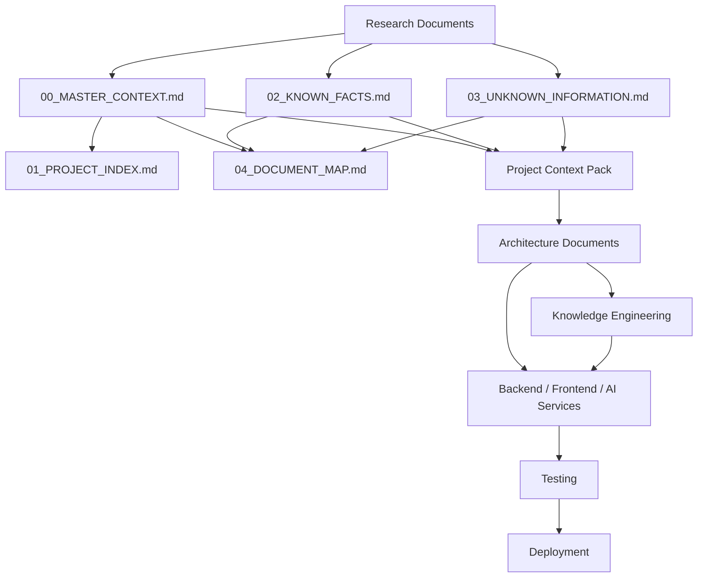
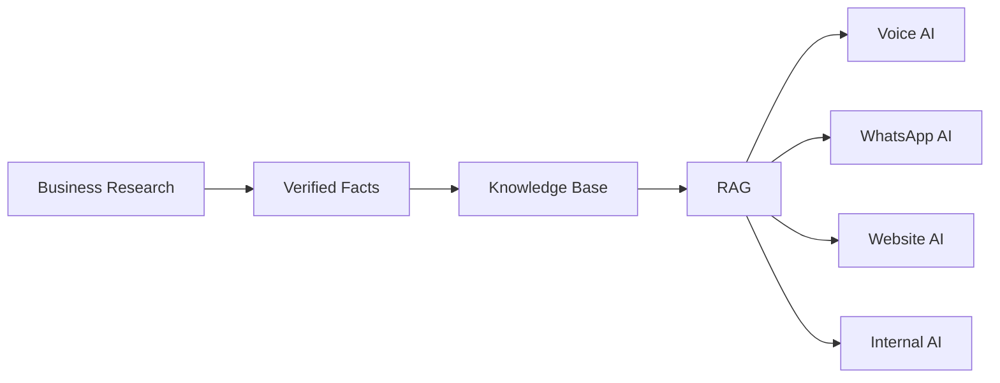

# 04_DOCUMENT_MAP.md

# Dayjoy Enterprise AI Platform — Documentation Relationship Map

> **Status:** Completed / Planned / Future  
> **Purpose:** Master dependency and navigation map for the Dayjoy Enterprise AI Platform documentation repository.  
> **Audience:** Developers, architects, project managers, AI coding assistants, and documentation owners.

---

## Table of Contents

1. [Purpose](#1-purpose)
2. [Repository Overview](#2-repository-overview)
3. [Document Dependency Graph](#3-document-dependency-graph)
4. [Research Document Relationships](#4-research-document-relationships)
5. [Documentation File Relationships](#5-documentation-file-relationships)
6. [Project Context Relationships](#6-project-context-relationships)
7. [Architecture Relationships](#7-architecture-relationships)
8. [Knowledge Flow](#8-knowledge-flow)
9. [Development Workflow](#9-development-workflow)
10. [AI Reading Order](#10-ai-reading-order)
11. [Cross-Reference Matrix](#11-cross-reference-matrix)
12. [Future Expansion Strategy](#12-future-expansion-strategy)
13. [Maintenance Guidelines](#13-maintenance-guidelines)
14. [Navigation Quick Guide](#14-navigation-quick-guide)
15. [Summary](#15-summary)

---

## 1. Purpose

### Why a document map is required

**VERIFIED:** The project contains multiple research, documentation, context, and future architecture artifacts that must remain connected and consistent. [00_MASTER_CONTEXT.md][01_PROJECT_INDEX.md][12_Research_Gap_Analysis.md]

### How it improves navigation

- Shows which document to read first.
- Clarifies which files depend on others.
- Reduces time spent searching for source information.
- Improves onboarding for humans and AI assistants.

### How AI assistants should use it

**VERIFIED:** AI assistants should use this map to understand document order, dependency flow, and where to retrieve authoritative information before generating outputs. [00_MASTER_CONTEXT.md][01_PROJECT_INDEX.md]

### How it reduces duplicate documentation

- Encourages referencing upstream documents instead of rewriting them.
- Makes each document’s role explicit.
- Prevents parallel, conflicting versions of the same knowledge.

---

## 2. Repository Overview

```text
Dayjoy-Enterprise-AI/
├── 00_MASTER_CONTEXT.md
├── 01_PROJECT_INDEX.md
├── 02_KNOWN_FACTS.md
├── 03_UNKNOWN_INFORMATION.md
├── 04_DOCUMENT_MAP.md
├── Research/
│   ├── 01_Company_Research.md
│   ├── 02_Business_Model.md
│   ├── 03_Product_Research.md
│   ├── 04_Distributor_System.md
│   ├── 05_Policies.md
│   ├── 06_FAQs.md
│   ├── 07_Customer_Journey.md
│   ├── 08_Business_Processes.md
│   ├── 09_Competitor_Analysis.md
│   ├── 10_Pain_Points.md
│   ├── 11_AI_Opportunities.md
│   └── 12_Research_Gap_Analysis.md
├── Documentation/
│   ├── 00_MASTER_CONTEXT.md
│   ├── 01_PROJECT_INDEX.md
│   ├── 02_KNOWN_FACTS.md
│   ├── 03_UNKNOWN_INFORMATION.md
│   └── 04_DOCUMENT_MAP.md
├── Project_Context/
│   └── planned context documents
├── Architecture/
│   └── planned architecture documents
├── Knowledge/
│   └── RAG, ontology, embeddings, governance
├── Backend/
├── Frontend/
├── AI/
├── Integrations/
├── Testing/
├── Deployment/
├── Operations/
├── Assets/
├── Scripts/
└── Configurations/
```

---

## 3. Document Dependency Graph



**Information Flow:** Research → Master Context → Project Documentation → Context Pack → Architecture → Knowledge Engineering → Implementation → Testing → Deployment.

---

## 4. Research Document Relationships

| Document | Depends On | Used By | Purpose |
|---|---|---|---|
| 01_Company_Research.md | Official company sources | 02, 00, 12 | Company profile, legal details, mission, leadership |
| 02_Business_Model.md | Company research, official site | 04, 07, 10, 11 | Business model, value proposition, revenue logic |
| 03_Product_Research.md | Product pages, brochure, price list | 05, 06, 08, 10, 11 | Product catalog, descriptions, pricing, gaps |
| 04_Distributor_System.md | Policies, compensation plan, downloads | 06, 07, 08, 10, 11 | Distributor rules, commission, onboarding |
| 05_Policies.md | Shipping, privacy, terms, FAQs | 06, 07, 08, 10, 11 | Operational and legal policy facts |
| 06_FAQs.md | Website FAQs, policies, product research | 07, 08, 10, 11 | FAQ knowledge base for support and AI |
| 07_Customer_Journey.md | FAQs, policies, business processes | 08, 10, 11 | Journey stages, touchpoints, AI support |
| 08_Business_Processes.md | Policies, FAQs, distributor system | 10, 11 | Workflows and operational blueprints |
| 09_Competitor_Analysis.md | Public competitor websites | 10, 11, 12 | Competitor comparison and strategic context |
| 10_Pain_Points.md | All prior research + industry refs | 11, 12 | Problem inventory and AI requirements |
| 11_AI_Opportunities.md | Research, pain points, processes, competitors | Context pack, architecture | AI strategy, roadmap, capability map |
| 12_Research_Gap_Analysis.md | All research docs | 00, 03, 11 | Readiness, blockers, client questions, risks |

---

## 5. Documentation File Relationships

| Document | Supports | Supported By | Notes |
|---|---|---|---|
| 00_MASTER_CONTEXT.md | Entire project | 01_PROJECT_INDEX, 02_KNOWN_FACTS, 03_UNKNOWN_INFORMATION | Primary narrative and instructions |
| 01_PROJECT_INDEX.md | Navigation and structure | 00_MASTER_CONTEXT | Master repository map |
| 02_KNOWN_FACTS.md | Fact-driven AI / RAG | Research docs, verified sources | Safe factual foundation |
| 03_UNKNOWN_INFORMATION.md | Discovery and blockers | Research gap analysis, planning | Prevents assumptions |
| 04_DOCUMENT_MAP.md | Relationship map | All docs | Shows dependencies and reading order |
| 05_RESEARCH_LOG.md | Research operations | Future research work | Planned |
| 06_DECISIONS.md | Decision tracking | Architecture, implementation | Planned |
| 07_NEXT_ACTIONS.md | Action tracking | Gap analysis, roadmap | Planned |

---

## 6. Project Context Relationships

> Planned files in the Project Context Pack should be fed by research and consumed by architecture and implementation.

| Planned File | Supplies Information From | Consumed By |
|---|---|---|
| 01_PROJECT_BRIEF.md | 00_MASTER_CONTEXT, 01_Company_Research, 02_Business_Model | Architecture, PM |
| 02_BUSINESS_CONTEXT.md | 02_Business_Model, 10_Pain_Points | Architecture, AI strategy |
| 03_PRODUCT_CONTEXT.md | 03_Product_Research | Knowledge engineering, product AI |
| 04_AI_VISION.md | 11_AI_Opportunities, 12_Research_Gap_Analysis | Architecture, roadmap |
| 05_PERSONAS.md | 07_Customer_Journey | Conversation design, CRM |
| 06_FEATURE_WISHLIST.md | 10_Pain_Points, 11_AI_Opportunities | Product management |
| 07_BUSINESS_PROCESSES.md | 08_Business_Processes | Workflow automation |
| 08_CONSTRAINTS.md | 12_Research_Gap_Analysis | Architecture, delivery planning |
| 09_TECH_STACK.md | 12_Research_Gap_Analysis | Engineering, integration |
| 10_CODING_STANDARDS.md | 00_MASTER_CONTEXT | Development teams |
| 11_DOCUMENTATION_RULES.md | 00_MASTER_CONTEXT, 01_PROJECT_INDEX | Documentation governance |
| 12_ARCHITECTURE_PRINCIPLES.md | 11_AI_Opportunities, 12_Research_Gap_Analysis | Architecture |
| 13_AI_BEHAVIOR.md | 05_Policies, 06_FAQs, 11_AI_Opportunities | AI assistants |
| 14_FUTURE_INTEGRATIONS.md | 12_Research_Gap_Analysis | Architects, IT |
| 15_SUCCESS_METRICS.md | 10_Pain_Points, 11_AI_Opportunities | PM, analytics |

---

## 7. Architecture Relationships

| Architecture Document | Depends On | Consumed By | Purpose |
|---|---|---|---|
| 00_SYSTEM_OVERVIEW.md | 00_MASTER_CONTEXT, 01_PROJECT_INDEX | Whole project | Single architecture summary |
| 01_HIGH_LEVEL_ARCHITECTURE.md | 11_AI_Opportunities, 12_Research_Gap_Analysis | Backend, AI, PM | Platform blueprint |
| 02_AI_ECOSYSTEM.md | 11_AI_Opportunities, 06_FAQs, 08_Business_Processes | AI services | Agent and assistant map |
| 03_AGENT_ARCHITECTURE.md | 07_Customer_Journey, 08_Business_Processes | AI engineering | Agent roles and tools |
| 04_KNOWLEDGE_ARCHITECTURE.md | 02_KNOWN_FACTS, 06_FAQs, 05_Policies | AI assistants | RAG and retrieval design |
| 05_DATABASE_DESIGN.md | 12_Research_Gap_Analysis, future APIs | Backend, integrations | Data model and persistence |
| 06_API_ARCHITECTURE.md | 12_Research_Gap_Analysis, business processes | Backend, integrations | API contracts |
| 07_TOOL_ARCHITECTURE.md | AI opportunities, workflows | AI engineering | Tool/function design |
| 08_WORKFLOW_ARCHITECTURE.md | 08_Business_Processes | n8n, backend, AI | Automation design |
| 09_SECURITY_ARCHITECTURE.md | 05_Policies, 12_Research_Gap_Analysis | All systems | Security and governance |
| 10_DEPLOYMENT_ARCHITECTURE.md | Tech stack decisions | DevOps | Environment planning |
| 11_MONITORING_ARCHITECTURE.md | Metrics, logs, workflows | Ops, management | Observability |
| 12_SCALABILITY_PLAN.md | 10_Pain_Points, 11_AI_Opportunities | Leadership | Growth planning |
| 13_TECH_STACK.md | 12_Research_Gap_Analysis | Engineering | Approved stack |
| 14_DEVELOPMENT_ROADMAP.md | 11_AI_Opportunities, 12_Research_Gap_Analysis | PM, engineering | Build plan |
| 15_FOLDER_STRUCTURE.md | 01_PROJECT_INDEX | Dev, docs | Final repository layout |

---

## 8. Knowledge Flow



**Flow Meaning:** Research becomes verified facts, verified facts power the knowledge base, the knowledge base powers retrieval, and retrieval powers AI assistants.

---

## 9. Development Workflow

**Recommended sequence:**

```text
Research
→ Documentation
→ Context
→ Architecture
→ Database
→ APIs
→ Backend
→ Frontend
→ AI
→ Integrations
→ Testing
→ Deployment
```

**Why this order matters:** It ensures the team builds from validated knowledge, then turns that knowledge into architecture, then implementation, then deployment. It reduces rework.

---

## 10. AI Reading Order

### Recommended sequence for AI coding assistants

1. `00_MASTER_CONTEXT.md`
2. `01_PROJECT_INDEX.md`
3. `02_KNOWN_FACTS.md`
4. `03_UNKNOWN_INFORMATION.md`
5. Project Context Pack
6. Architecture Documents
7. Knowledge Engineering Documents
8. Implementation tasks / coding tickets

**Why this order is important:**
- Master context gives the mission.
- Project index gives the map.
- Known facts prevent hallucinations.
- Unknown information prevents assumptions.
- Context and architecture documents provide design guidance.

---

## 11. Cross-Reference Matrix

| Document | References | Referenced By | Priority |
|---|---|---|---|
| 00_MASTER_CONTEXT.md | All research docs | 01_PROJECT_INDEX, 02_KNOWN_FACTS, 03_UNKNOWN_INFORMATION, 04_DOCUMENT_MAP | Highest |
| 01_PROJECT_INDEX.md | Master context, research docs | AI assistants, developers | Highest |
| 02_KNOWN_FACTS.md | Research docs, official sources | AI assistants, RAG, developers | Highest |
| 03_UNKNOWN_INFORMATION.md | Research docs, gap analysis | Workshops, planning | Highest |
| 04_DOCUMENT_MAP.md | All docs | AI assistants, project managers | Highest |
| 11_AI_Opportunities.md | Research, pain points, competitors | Architecture, AI roadmap | High |
| 12_Research_Gap_Analysis.md | All research docs | Planning, workshops | High |

---

## 12. Future Expansion Strategy

### Naming conventions
- Use numbered prefixes for core navigation and governance files.
- Use descriptive names for domain-specific docs.
- Keep markdown-only for planning and documentation.

### Folder placement
- Research stays in research folder or section.
- Architecture stays in architecture folder.
- Implementation modules stay in backend, frontend, AI, integrations, deployment folders.

### Cross-referencing rules
- Every new document must reference at least one upstream source.
- Every major doc should list related documents.
- Never duplicate large sections; link instead.

### Documentation update process
- Add new document.
- Update `01_PROJECT_INDEX.md`.
- Update `04_DOCUMENT_MAP.md`.
- Update `02_KNOWN_FACTS.md` or `03_UNKNOWN_INFORMATION.md` if needed.

---

## 13. Maintenance Guidelines

### Review frequency
- Review after every major research or architecture update.

### Version updates
- Track version numbers on index and map documents.

### Link validation
- Validate internal links when files are added, renamed, or removed.

### Removing obsolete documents
- Archive rather than delete when possible.
- Update map to point to replacements.

### Adding new modules
- Add to repository tree.
- Update dependency graph.
- Update context pack and architecture references.

---

## 14. Navigation Quick Guide

### Executives
Read:
- `00_MASTER_CONTEXT.md`
- `01_PROJECT_INDEX.md`
- `10_Pain_Points.md`
- `11_AI_Opportunities.md`

### Product Managers
Read:
- `02_Business_Model.md`
- `03_Product_Research.md`
- `07_Customer_Journey.md`
- `10_Pain_Points.md`

### Developers
Read:
- `00_MASTER_CONTEXT.md`
- `01_PROJECT_INDEX.md`
- `02_KNOWN_FACTS.md`
- `03_UNKNOWN_INFORMATION.md`
- architecture docs

### AI Engineers
Read:
- `00_MASTER_CONTEXT.md`
- `02_KNOWN_FACTS.md`
- `04_KNOWLEDGE_ARCHITECTURE.md`
- `03_AGENT_ARCHITECTURE.md`
- `11_AI_Opportunities.md`

### Solution Architects
Read:
- `00_MASTER_CONTEXT.md`
- `12_Research_Gap_Analysis.md`
- `11_AI_Opportunities.md`
- architecture docs

### QA Engineers
Read:
- `05_Policies.md`
- `06_FAQs.md`
- `08_Business_Processes.md`
- `12_Research_Gap_Analysis.md`

### AI Coding Assistants
Read:
- `00_MASTER_CONTEXT.md`
- `01_PROJECT_INDEX.md`
- `02_KNOWN_FACTS.md`
- `03_UNKNOWN_INFORMATION.md`
- then architecture docs and task docs

---

## 15. Summary

This document improves:
- **Project organization** through explicit dependencies.
- **Faster onboarding** through clear reading order.
- **Better AI collaboration** by controlling context flow.
- **Easier maintenance** through link and version discipline.
- **Enterprise documentation governance** by keeping the repository modular, scalable, and navigable.

---

**END OF DOCUMENT**