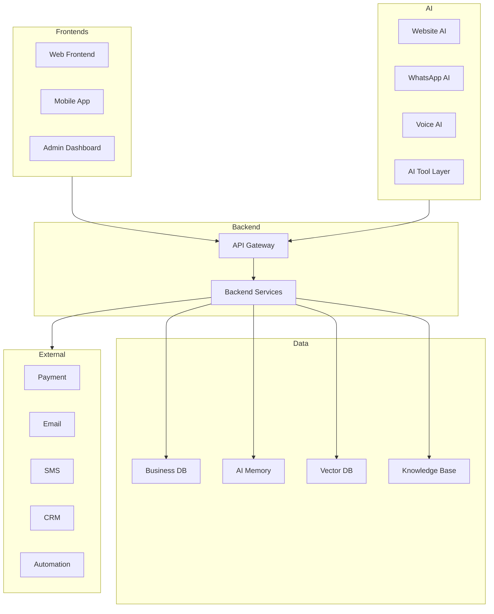
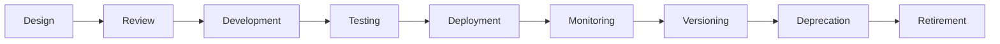
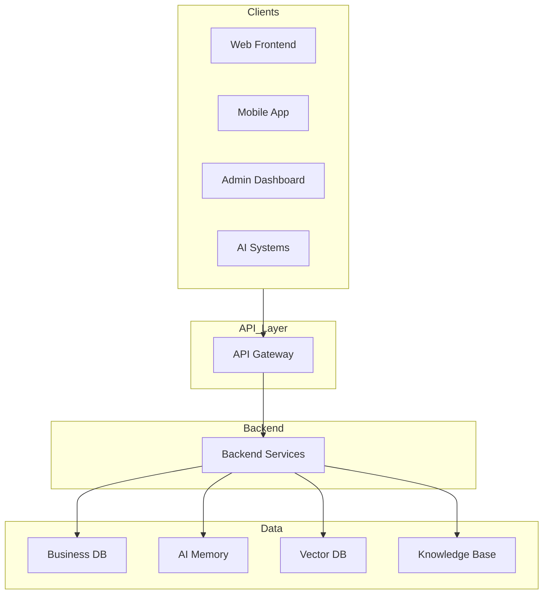
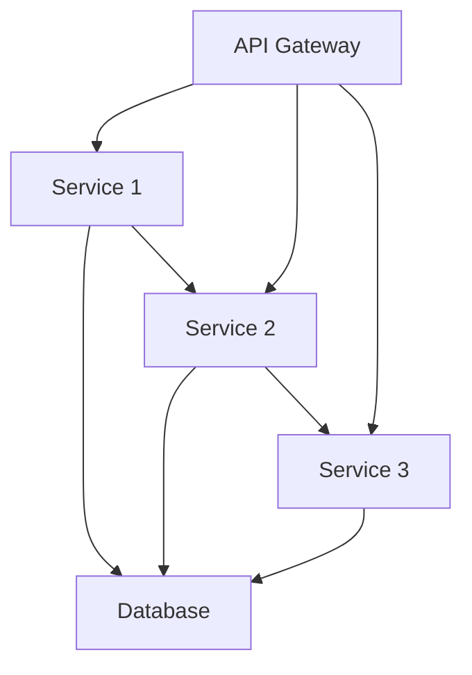
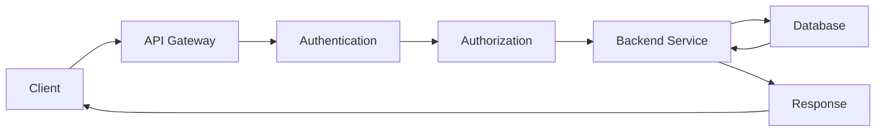
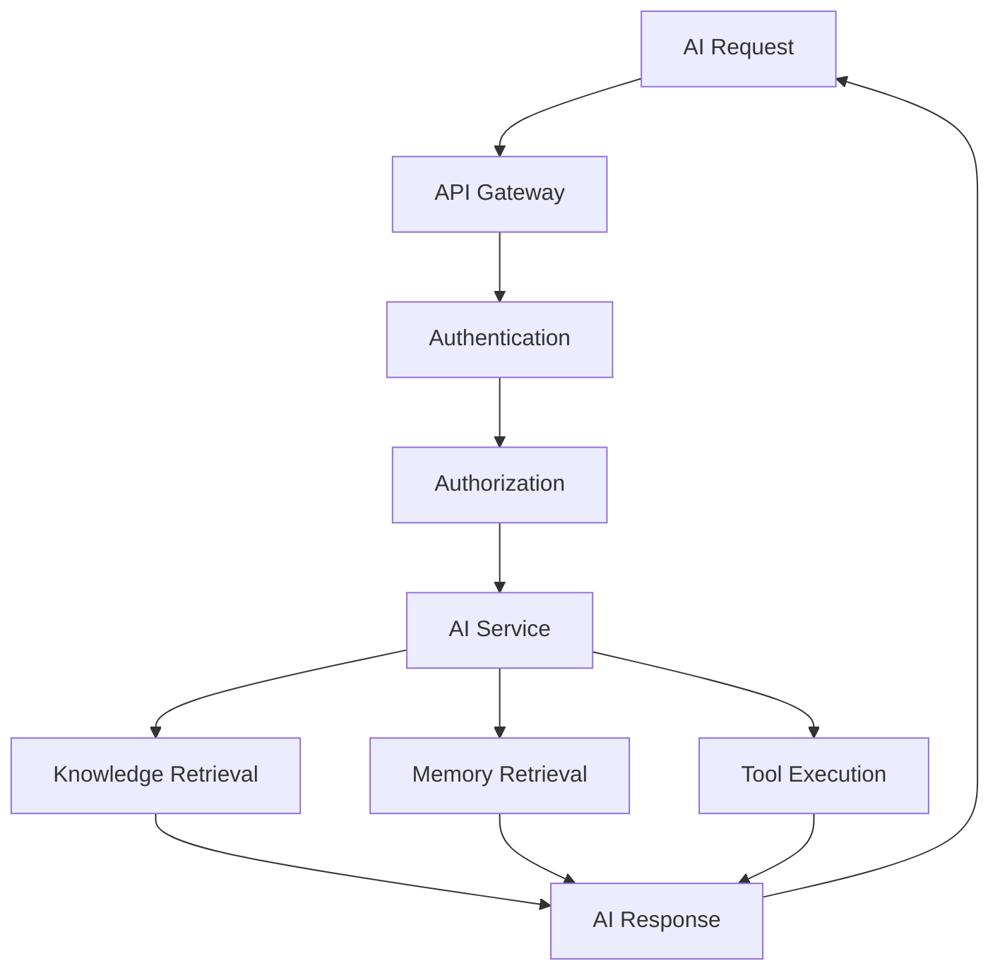
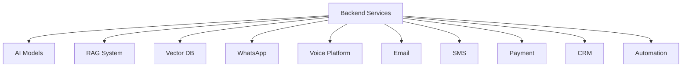
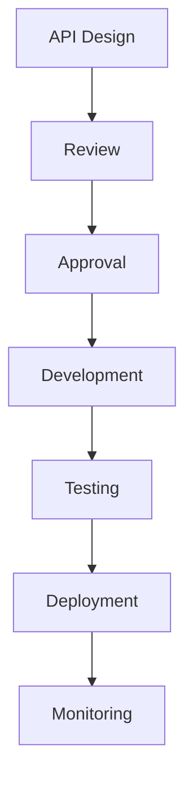

# 04_API_Backend_Architecture/00_API_OVERVIEW.md

# Dayjoy Enterprise AI Platform — API & Backend Architecture Overview

> **Purpose:** Define the master API and backend architecture for the Dayjoy Enterprise AI Platform, explaining how every frontend, AI system, backend service, automation workflow, external integration, and database communicates through a unified API architecture.
>
> **Scope:** Logical architecture only — no implementation code, OpenAPI specifications, or framework-specific examples.
>
> **Audience:** Solution architects, backend engineers, AI engineers, frontend engineers, DevOps/SRE teams, product owners, and business stakeholders.

---

## Table of Contents

1. [API Architecture Overview](#1-api-architecture-overview)
2. [Platform Communication Architecture](#2-platform-communication-architecture)
3. [API Categories](#3-api-categories)
4. [Backend Responsibilities](#4-backend-responsibilities)
5. [API Lifecycle](#5-api-lifecycle)
6. [Integration Overview](#6-integration-overview)
7. [Non-Functional Requirements](#7-non-functional-requirements)
8. [Governance](#8-governance)
9. [Future API Vision](#9-future-api-vision)
10. [Architecture Diagrams](#10-architecture-diagrams)

---

## 1. API Architecture Overview

### 1.1 Purpose of the API Layer

The API layer serves as the **unified communication backbone** for the Dayjoy Enterprise AI Platform, enabling consistent, secure, and scalable interactions between frontends, AI systems, backend services, databases, and external integrations.[02_System_Architecture/09_API_ARCHITECTURE.md][03_Database_Design/00_DATABASE_OVERVIEW.md]

### 1.2 Business Objectives

- **Unified Access:** Single, consistent interface for all clients (web, mobile, AI, partners).
- **AI Enablement:** Support AI systems with structured, governed data access.
- **Scalability:** Handle growing users, AI workloads, and integrations.
- **Security:** Enforce authentication, authorization, and audit across all access.
- **Maintainability:** Enable modular, versioned, and documented APIs.

### 1.3 API-First Architecture Philosophy

- APIs are designed first, before implementation.
- APIs are product-like assets with clear ownership and governance.
- APIs enable composability and reuse across the platform.

### 1.4 Relationship Between Frontend, Backend, AI Systems, Databases, and Integrations

- **Frontend:** Consumes APIs for data and actions.
- **Backend:** Implements business logic, validation, and data access.
- **AI Systems:** Consume APIs for knowledge, memory, and tool execution.
- **Databases:** Accessed via backend services, not directly by clients.
- **Integrations:** External services accessed via backend APIs or integration layer.

### 1.5 Enterprise Design Principles

- **Consistency:** Uniform API design and patterns.
- **Security:** Authentication, authorization, and audit by default.
- **Versioning:** Backward-compatible versioning strategy.
- **Observability:** Logging, monitoring, and tracing for all APIs.
- **Extensibility:** Modular design for future growth.

---

## 2. Platform Communication Architecture

### 2.1 High-Level Communication Architecture

The platform consists of the following communicating components:

- **Web Frontend:** Customer and distributor portals.
- **Mobile App:** Mobile applications for customers and distributors.
- **Admin Dashboard:** Internal admin interface.
- **Website AI, WhatsApp AI, Voice AI:** AI assistants for different channels.
- **AI Tool Layer:** Tools and functions available to AI agents.
- **Backend Services:** Business logic, validation, and data access.
- **Database Layer:** Business database, AI memory, vector database.
- **Analytics:** Event tracking and dashboards.
- **External Services:** Payment, email, SMS, CRM, automation, etc.

### 2.2 Communication Architecture Diagram

---

## 3. API Categories

### 3.1 API Category Catalog

| Category | Purpose | Primary Consumers | Business Value | Related Modules |
|---|---|---|---|---|
| Authentication APIs | Handle login, registration, token management | All clients | Secure access | Auth, Security |
| Customer APIs | Manage customer profiles and data | Web, Mobile, AI | Customer management | Customer, Orders |
| Distributor APIs | Manage distributor profiles, hierarchy, metrics | Web, Mobile, AI | Distributor management | Distributor, Compensation |
| Product APIs | Manage product catalog and info | Web, Mobile, AI | Product management | Product, Inventory |
| Order APIs | Manage orders and order lifecycle | Web, Mobile, AI | Order management | Order, Payment |
| Knowledge APIs | Access knowledge documents and metadata | AI, Admin | Knowledge management | Knowledge Base |
| AI APIs | AI orchestration, prompts, tool execution | AI, Admin | AI enablement | AI, RAG |
| Conversation APIs | Manage conversations and messages | AI, Admin | Conversation management | Conversations |
| AI Memory APIs | Manage AI memory and user profiles | AI | AI personalization | AI Memory |
| Notification APIs | Send and manage notifications | Backend, AI | User communication | Notifications |
| Analytics APIs | Access analytics data and dashboards | Admin, AI | Business insights | Analytics |
| Admin APIs | Admin operations and configurations | Admin | System management | Admin, Config |
| Configuration APIs | Manage system and AI configurations | Admin, Backend | Configuration management | Config |
| Automation APIs | Trigger and manage automations | Backend, AI | Workflow automation | Automation |
| Webhook APIs | Receive external webhooks | External services | Integration | Integrations |
| Integration APIs | Integrate with external systems | External services | Extended capabilities | Integrations |

---

## 4. Backend Responsibilities

### 4.1 Backend Responsibility Matrix

| Responsibility | Description | Backend | Frontend | AI |
|---|---|---|---|---|
| Business Logic | Implement business rules and workflows | ✅ | ❌ | ❌ |
| Authentication | Verify user and system identity | ✅ | ❌ | ❌ |
| Authorization | Control access to data and functions | ✅ | ❌ | ❌ |
| Validation | Validate input and business rules | ✅ | ❌ | ❌ |
| AI Orchestration | Orchestrate AI workflows and tools | ✅ | ❌ | ❌ |
| Tool Calling | Execute AI tools and functions | ✅ | ❌ | ❌ |
| Workflow Execution | Execute business workflows | ✅ | ❌ | ❌ |
| Database Access | Access and manage data | ✅ | ❌ | ❌ |
| Knowledge Retrieval | Retrieve knowledge for AI | ✅ | ❌ | ❌ |
| Logging | Log API and system events | ✅ | ❌ | ❌ |
| Monitoring | Monitor API and system health | ✅ | ❌ | ❌ |
| Notifications | Send notifications to users | ✅ | ❌ | ❌ |

---

## 5. API Lifecycle

### 5.1 API Lifecycle Stages

1. **API Design:** Design API contracts and interfaces.
2. **Review:** Review design with architects and stakeholders.
3. **Development:** Implement API and backend logic.
4. **Testing:** Test API functionality, security, and performance.
5. **Deployment:** Deploy API to production.
6. **Monitoring:** Monitor API usage, performance, and errors.
7. **Versioning:** Version APIs for backward compatibility.
8. **Deprecation:** Deprecate old API versions.
9. **Retirement:** Retire deprecated APIs.

### 5.2 API Lifecycle Diagram

---

## 6. Integration Overview

### 6.1 Backend Integrations

The backend integrates with the following systems:

- **AI Models:** LLMs and embedding models for AI functionality.
- **RAG System:** Retrieval-augmented generation for knowledge access.
- **Vector Database:** Vector search for semantic retrieval.
- **WhatsApp:** Messaging platform for WhatsApp AI.
- **Voice Platform:** Voice services for Voice AI.
- **Email Services:** Email notifications and communications.
- **SMS Services:** SMS notifications.
- **Payment Gateway:** Payment processing for orders and commissions.
- **CRM:** Customer relationship management.
- **Automation Platform:** Workflow automation and triggers.
- **Future Enterprise Integrations:** ERP, HR, marketing, etc.

---

## 7. Non-Functional Requirements

### 7.1 NFR Goals

| Requirement | Goal |
|---|---|
| Scalability | Handle growing users, AI workloads, and integrations |
| Performance | Low-latency API responses (< 200–500ms typical) |
| Reliability | Consistent API behavior under load |
| Availability | ≥ 99.9% uptime for critical APIs |
| Security | Authentication, authorization, encryption, audit |
| Maintainability | Modular, documented, and versioned APIs |
| Observability | Logging, monitoring, and tracing for all APIs |
| Extensibility | Modular design for future growth and integrations |

---

## 8. Governance

### 8.1 API Governance Framework

- **API Ownership:** Each API category has a designated owner.
- **Documentation Standards:** All APIs documented with clear contracts.
- **Naming Standards:** Consistent naming conventions for APIs.
- **Review Process:** API designs reviewed by Architecture Review Board.
- **Change Management:** Changes managed through versioning and deprecation.
- **Version Management:** Semantic versioning for APIs.

---

## 9. Future API Vision

### 9.1 Future Enhancements

| Enhancement | Description | Status |
|---|---|---|
| GraphQL Gateway | GraphQL API for flexible queries | Future |
| Event APIs | Event-driven APIs for real-time updates | Future |
| AI Agent APIs | APIs for AI agents and tools | Future |
| Public Developer APIs | Public APIs for external developers | Future |
| Partner APIs | APIs for partners and integrations | Future |
| Multi-Tenant APIs | Multi-tenant API support | Future |
| Streaming APIs | Streaming APIs for real-time data | Future |
| Edge APIs | Edge-based APIs for low-latency | Future |

All future enhancements must align with governance, security, and business objectives.

---

## 10. Architecture Diagrams

### 10.1 Overall API Architecture

### 10.2 Backend Service Communication

### 10.3 Request Flow

### 10.4 AI Request Lifecycle

### 10.5 Integration Architecture

### 10.6 API Governance Workflow

---

**END OF DOCUMENT**