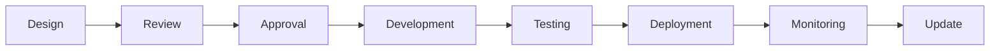
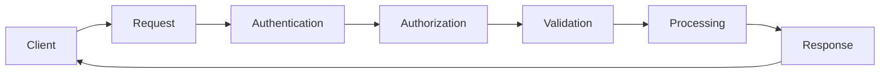
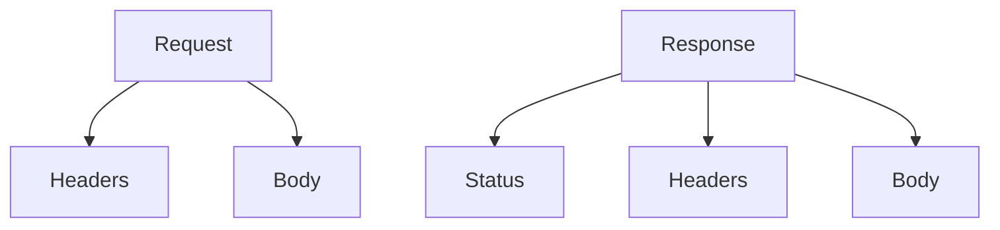
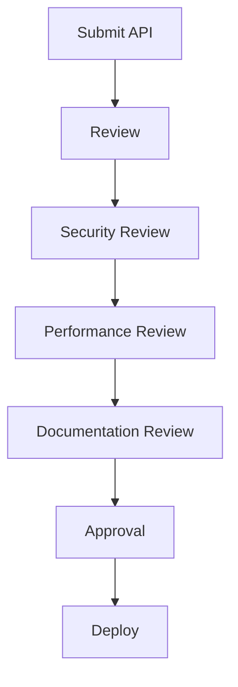
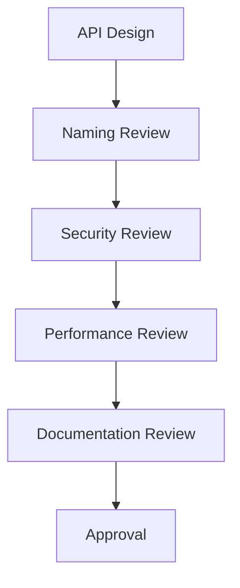
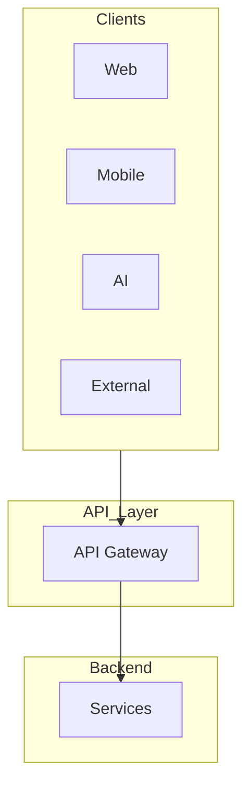

# 04_API_Backend_Architecture/01_API_STANDARDS.md

# Dayjoy Enterprise AI Platform — API Standards

> **Purpose:** Define the enterprise API standards for the Dayjoy Enterprise AI Platform, covering all standards, conventions, best practices, governance policies, and architectural guidelines that every API must follow across the platform.
>
> **Scope:** Logical standards only — no implementation code or OpenAPI specifications.
>
> **Audience:** Solution architects, backend engineers, AI engineers, frontend engineers, DevOps/SRE teams, product owners, and business stakeholders.

---

## Table of Contents

1. [API Standards Overview](#1-api-standards-overview)
2. [API Design Principles](#2-api-design-principles)
3. [Naming Standards](#3-naming-standards)
4. [HTTP Standards](#4-http-standards)
5. [Request Standards](#5-request-standards)
6. [Response Standards](#6-response-standards)
7. [Security Standards](#7-security-standards)
8. [Documentation Standards](#8-documentation-standards)
9. [API Governance](#9-api-governance)
10. [Future Standards Roadmap](#10-future-standards-roadmap)
11. [Architecture Diagrams](#11-architecture-diagrams)

---

## 1. API Standards Overview

### 1.1 Purpose of API Standards

API standards ensure that Dayjoy's APIs are **consistent, predictable, secure, and maintainable**, enabling efficient development, integration, and governance across the platform.[04_API_Backend_Architecture/00_API_OVERVIEW.md][02_System_Architecture/09_API_ARCHITECTURE.md]

### 1.2 Business Objectives

- **Consistency:** Uniform API design and behavior.
- **Efficiency:** Faster development and integration.
- **Security:** Secure by default APIs.
- **Maintainability:** Easy to understand, update, and version.
- **Scalability:** Support growing users and AI workloads.

### 1.3 API-First Philosophy

- APIs are designed before implementation.
- APIs are treated as products with clear ownership.
- APIs enable composability and reuse.

### 1.4 Benefits of Standardization

- Reduced cognitive load for developers.
- Easier onboarding and maintenance.
- Improved security and compliance.
- Better client and AI integration experience.

### 1.5 Enterprise API Governance Principles

- **Governed:** All APIs follow defined standards.
- **Reviewed:** All APIs reviewed by Architecture Review Board.
- **Documented:** All APIs fully documented.
- **Versioned:** All APIs versioned for compatibility.
- **Monitored:** All APIs monitored for usage and performance.

---

## 2. API Design Principles

### 2.1 Core Design Principles

| Principle | Description | Importance |
|---|---|---|
| Consistency | Uniform design and behavior | Reduces cognitive load |
| Simplicity | Simple, intuitive APIs | Easier to use and maintain |
| Predictability | Predictable behavior and responses | Reduces errors |
| Stateless Design | No server-side session state | Scalability and reliability |
| Idempotency | Repeated requests have same effect | Reliability and safety |
| Security by Design | Security built into every API | Protects data and users |
| Backward Compatibility | Maintain compatibility with old clients | Smooth upgrades |
| Scalability | Support growing load | Business growth |
| Version Awareness | Clear versioning strategy | Manage changes |
| AI-Friendly Design | Designed for AI consumption | AI integration |

---

## 3. Naming Standards

### 3.1 Naming Conventions

| Element | Standard | Example (Good) | Example (Bad) |
|---|---|---|---|
| Endpoints | Lowercase, hyphen-separated, resource-oriented | `/customer-orders` | `/getCustomerOrders` |
| Resources | Plural nouns, clear and descriptive | `customers`, `orders` | `cust`, `ord` |
| Parameters | Lowercase, snake_case, descriptive | `customer_id`, `order_date` | `cid`, `date` |
| Headers | Standard HTTP headers, clear custom headers | `X-Correlation-ID`, `Authorization` | `x-corr-id`, `auth` |
| Request Fields | Lowercase, snake_case, descriptive | `customer_id`, `order_total` | `custId`, `total` |
| Response Fields | Lowercase, snake_case, consistent with request | `customer_id`, `order_status` | `custId`, `status` |
| IDs | Clear, descriptive, consistent format | `customer_id`, `order_id` | `id`, `cid` |
| Actions | Use HTTP methods, avoid action verbs in URLs | `POST /orders` | `/createOrder` |
| Events | Clear, descriptive, past tense | `order.created`, `payment.completed` | `orderCreate`, `payDone` |
| Webhooks | Clear, descriptive, resource-oriented | `order.created`, `customer.updated` | `orderCreate`, `custUpd` |

---

## 4. HTTP Standards

### 4.1 Logical HTTP Standards

| Category | Usage |
|---|---|
| Request Methods | Use appropriate HTTP methods (GET, POST, PUT, PATCH, DELETE) based on operation semantics |
| Success Responses | Use success status codes for successful operations |
| Client Errors | Use client error status codes for invalid requests |
| Server Errors | Use server error status codes for server-side failures |
| Redirects | Use redirect status codes for resource relocation |
| Status Code Categories | Use standard status code categories (1xx, 2xx, 3xx, 4xx, 5xx) appropriately |

---

## 5. Request Standards

### 5.1 Request Standards

| Standard | Description |
|---|---|
| Request Structure | Consistent structure for all requests |
| Headers | Required headers (e.g., authentication, correlation ID) |
| Authentication Information | Standard authentication headers |
| Validation Rules | Clear validation rules for all inputs |
| Pagination | Standard pagination parameters |
| Filtering | Standard filtering parameters |
| Sorting | Standard sorting parameters |
| Searching | Standard search parameters |
| Localization | Standard localization headers/parameters |
| Correlation IDs | Required correlation ID for tracing |

---

## 6. Response Standards

### 6.1 Standard Response Model (Conceptual)

| Field | Description |
|---|---|
| Success Indicator | Indicates success or failure |
| Data | Response data (if successful) |
| Error Information | Error details (if failed) |
| Metadata | Response metadata (e.g., timestamp, version) |
| Pagination Information | Pagination details (if applicable) |
| Validation Messages | Validation errors (if applicable) |
| Warnings | Warnings (if applicable) |
| AI Responses | AI-specific response structure |
| Tool Results | Tool execution results (if applicable) |

---

## 7. Security Standards

### 7.1 Security Standards

| Standard | Description |
|---|---|
| Authentication | Required authentication for all APIs |
| Authorization | Required authorization based on roles/permissions |
| Token Handling | Secure token handling and storage |
| API Keys | Secure API key management |
| Rate Limiting | Rate limiting to prevent abuse |
| Input Validation | Validate all inputs |
| Output Sanitization | Sanitize all outputs |
| Audit Logging | Log all API access and actions |
| Sensitive Data Protection | Protect sensitive data in transit and at rest |

---

## 8. Documentation Standards

### 8.1 Documentation Standards

| Standard | Description |
|---|---|
| Documentation Structure | Consistent structure for all API docs |
| Required Sections | Purpose, endpoints, request/response, errors, examples |
| Example Usage | Clear examples for all endpoints |
| Change Logs | Document all changes |
| Deprecation Notices | Clear deprecation notices |
| Version History | Version history for all APIs |
| Review Process | Documentation reviewed before publication |

---

## 9. API Governance

### 9.1 API Governance Framework

- **API Ownership:** Each API has a designated owner.
- **Review Workflow:** APIs reviewed by Architecture Review Board.
- **Approval Process:** Formal approval process for all APIs.
- **Naming Review:** Naming standards reviewed.
- **Security Review:** Security standards reviewed.
- **Performance Review:** Performance standards reviewed.
- **Documentation Approval:** Documentation approved before publication.
- **Lifecycle Management:** APIs managed through lifecycle (design → retirement).

---

## 10. Future Standards Roadmap

### 10.1 Future Standards

| Standard | Description | Status |
|---|---|---|
| GraphQL Standards | Standards for GraphQL APIs | Future |
| gRPC Standards | Standards for gRPC APIs | Future |
| Event API Standards | Standards for event-driven APIs | Future |
| AI Agent Communication Standards | Standards for AI agent communication | Future |
| Streaming API Standards | Standards for streaming APIs | Future |
| Partner API Standards | Standards for partner APIs | Future |
| Public API Standards | Standards for public APIs | Future |

All future standards must align with governance, security, and business objectives.

---

## 11. Architecture Diagrams

### 11.1 API Standard Lifecycle

### 11.2 API Request Flow

### 11.3 Request & Response Model

### 11.4 API Governance Workflow

### 11.5 API Review Process

### 11.6 Enterprise API Architecture

---

**END OF DOCUMENT**