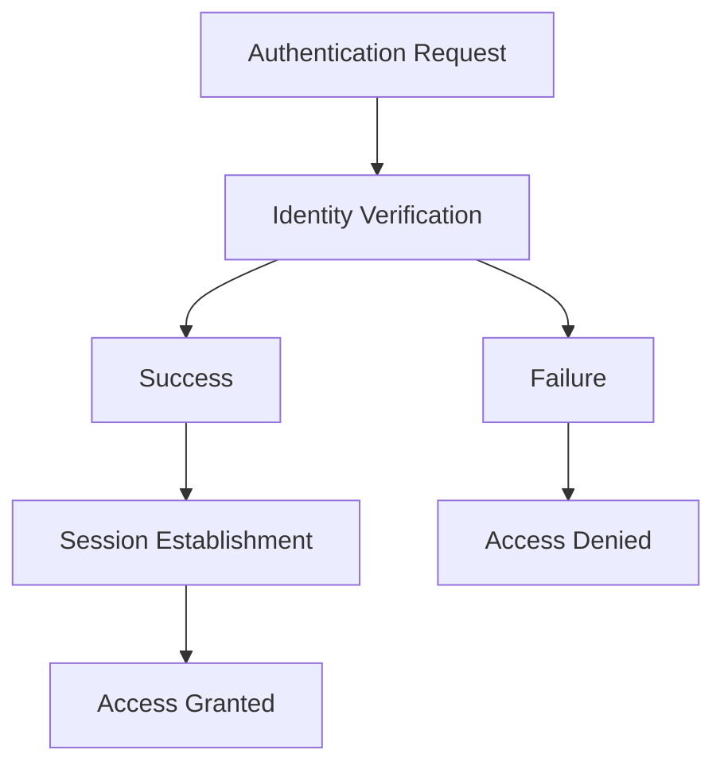
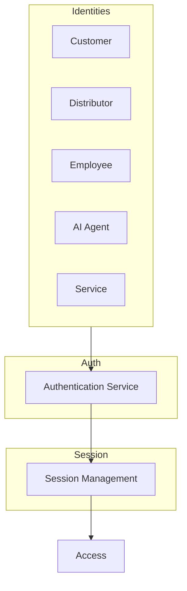
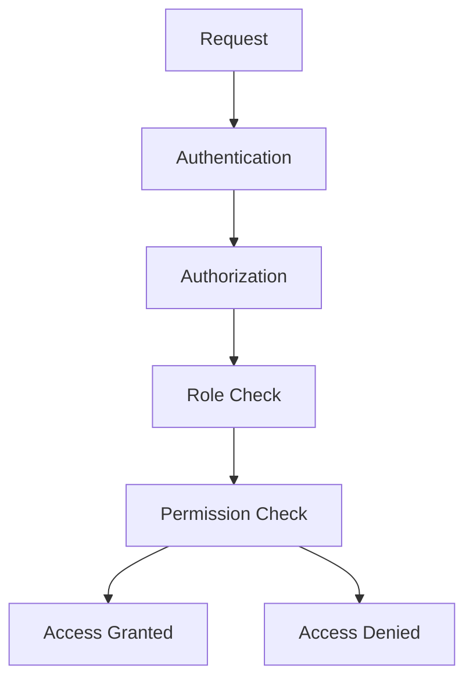
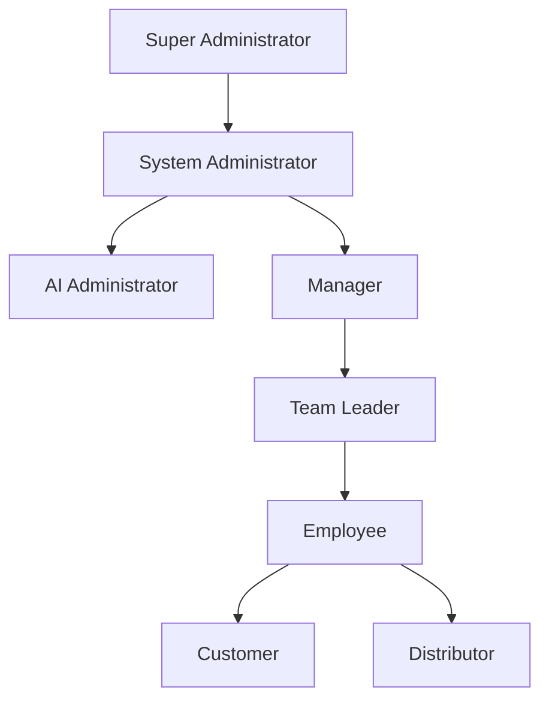
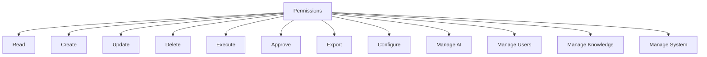
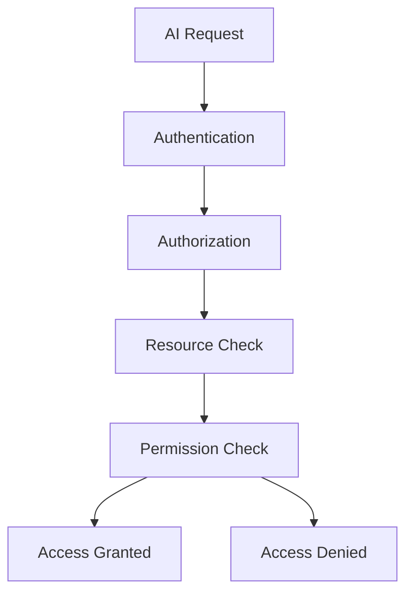
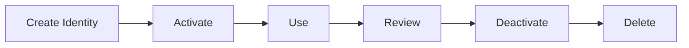
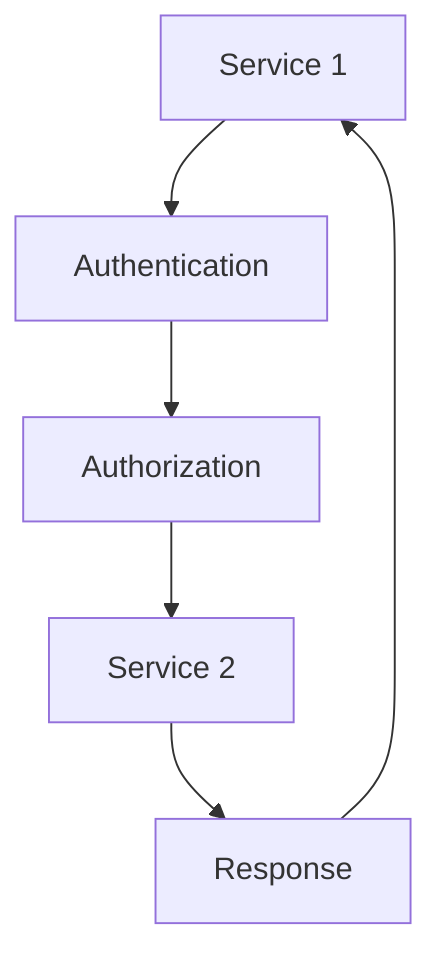

# 04_API_Backend_Architecture/02_AUTHENTICATION_AUTHORIZATION.md

# Dayjoy Enterprise AI Platform — Authentication & Authorization Architecture

> **Purpose:** Define the complete Authentication and Authorization architecture for the Dayjoy Enterprise AI Platform, covering how users, AI agents, backend services, APIs, and external integrations securely authenticate and access platform resources.
>
> **Scope:** Logical architecture only — no implementation code, JWT examples, OAuth configurations, or vendor-specific authentication settings.
>
> **Audience:** Security architects, solution architects, backend engineers, AI engineers, DevOps/SRE teams, product owners, and business stakeholders.

---

## Table of Contents

1. [Authentication & Authorization Overview](#1-authentication--authorization-overview)
2. [Identity Types](#2-identity-types)
3. [Authentication Architecture](#3-authentication-architecture)
4. [Authorization Model](#4-authorization-model)
5. [Permission Framework](#5-permission-framework)
6. [AI Authorization](#6-ai-authorization)
7. [Service-to-Service Security](#7-service-to-service-security)
8. [Session Management](#8-session-management)
9. [Security Governance](#9-security-governance)
10. [Future Identity Roadmap](#10-future-identity-roadmap)
11. [Architecture Diagrams](#11-architecture-diagrams)

---

## 1. Authentication & Authorization Overview

### 1.1 Purpose of Authentication

Authentication verifies the **identity** of users, AI agents, services, and integrations attempting to access the platform, ensuring that only legitimate identities can interact with systems and data.[02_System_Architecture/10_SECURITY_ARCHITECTURE.md][03_Database_Design/14_DATABASE_SECURITY.md]

### 1.2 Purpose of Authorization

Authorization controls **what** authenticated identities can access and do within the platform, enforcing least privilege and role-based access control to protect data and functionality.

### 1.3 Identity Management Philosophy

- Every identity is uniquely identified and managed.
- Identities are classified by type and risk level.
- Access is granted based on roles and permissions.

### 1.4 Zero Trust Principles

- **Never Trust, Always Verify:** Every request is authenticated and authorized.
- **Least Privilege:** Minimal necessary access.
- **Assume Breach:** Design for security even if perimeter is compromised.

### 1.5 Enterprise Security Goals

- **Secure Access:** Protect all access points.
- **Auditability:** All access logged and auditable.
- **Compliance:** Meet regulatory requirements.
- **Resilience:** Withstand attacks and insider threats.

---

## 2. Identity Types

### 2.1 Identity Catalog

| Identity Type | Identity ID | Description | Business Purpose | Authentication Method | Authorization Scope | Risk Level |
|---|---|---|---|---|---|---|
| Customer | CUST | End-user customers | Purchase products, access support | Email/password, OAuth | Customer data only | Low |
| Distributor | DIST | Distributors and downline | Manage sales, commissions | Email/password, OAuth | Own + downline data | Medium |
| Employee | EMP | Internal employees | Perform job functions | SSO, MFA | Departmental data | Medium |
| Administrator | ADMIN | System administrators | Manage systems | SSO, MFA | System-wide | High |
| Super Administrator | SUPER | Highest privilege admins | Full system control | SSO, MFA | Full system | Critical |
| AI Agent | AI | AI assistants and agents | Provide AI services | Service account, API key | Scoped by function | Medium |
| Backend Service | SVC | Backend services | Execute business logic | Service account, API key | Service-specific | Medium |
| Automation Workflow | AUTO | Automated workflows | Execute automations | Service account, API key | Workflow-specific | Medium |
| External Partner | PART | External partners | Partner integrations | API key, OAuth | Partner-specific | Medium |
| Third-Party Integration | INT | Third-party services | Extended capabilities | API key, OAuth | Integration-specific | Medium |

---

## 3. Authentication Architecture

### 3.1 Logical Authentication Flow

- **Identity Verification:** Verify identity credentials (e.g., username/password, token).
- **Session Establishment:** Establish session upon successful authentication.
- **Session Validation:** Validate session on each request.
- **Session Termination:** Terminate session on logout or timeout.

### 3.2 Authentication Methods by Identity

| Identity | Authentication Method |
|---|---|
| Web Login (Customer/Distributor/Employee) | Email/password, SSO, MFA |
| Mobile Login | Email/password, biometric, OAuth |
| WhatsApp Users | Phone number verification, OAuth |
| Voice AI Users | Phone number verification, voice biometrics |
| AI Agents | Service account, API key |
| Backend Services | Service account, API key |
| External APIs | API key, OAuth |
| Internal Services | Service account, mutual TLS |

### 3.3 Authentication Flow Diagram

---

## 4. Authorization Model

### 4.1 Role-Based Authorization

Authorization is based on **roles** that define access to modules and operations.

### 4.2 Role Permission Matrix

| Role | Responsibilities | Accessible Modules | Permission Scope | Restricted Operations |
|---|---|---|---|---|
| Customer | Manage own profile and orders | Customer Portal, Orders | Own data only | Admin operations |
| Distributor | Manage own and downline data | Distributor Portal, Downline | Own + downline | System config |
| Team Leader | Manage team | Team Dashboard | Team data | System config |
| Manager | Manage department | Department Dashboard | Department data | System config |
| Employee | Perform job functions | Employee Portal | Departmental data | Admin operations |
| Support Staff | Customer support | Support Portal | Customer data | Admin operations |
| Content Manager | Manage content | Content Management | Content modules | System config |
| AI Administrator | Manage AI systems | AI Admin Portal | AI modules | System config |
| System Administrator | Manage systems | Admin Portal | System-wide | Super admin operations |
| Super Administrator | Full system control | All | Full system | None |

---

## 5. Permission Framework

### 5.1 Permission Categories

| Permission | Description |
|---|---|
| Read | Read data |
| Create | Create new data |
| Update | Update existing data |
| Delete | Delete data |
| Execute | Execute actions/workflows |
| Approve | Approve requests/changes |
| Export | Export data |
| Configure | Configure settings |
| Manage AI | Manage AI systems |
| Manage Users | Manage user accounts |
| Manage Knowledge | Manage knowledge base |
| Manage System | Manage system configuration |

### 5.2 Inheritance and Permission Grouping

- Permissions are grouped into roles.
- Roles can inherit permissions from parent roles.
- Permissions are scoped by data domain (e.g., customer, distributor, system).

---

## 6. AI Authorization

### 6.1 AI Permission Matrix

| Resource | AI Access | Permission Scope | Restricted Operations |
|---|---|---|---|
| Knowledge Base | Read | Scoped by access_level, trust_level | Write, delete |
| AI Memory | Read/Write | Scoped by user_id, consent | Other users' memory |
| Conversations | Read/Write | Scoped by conversation_id | Other conversations |
| Customer Data | Read | Scoped by user_id, consent | Write, delete |
| Distributor Data | Read | Scoped by distributor_id | Write, delete |
| Analytics | Read | Aggregated, anonymized | Raw data |
| Tools | Execute | Scoped by tool_name, user/distributor | Admin tools |
| External APIs | Execute | Scoped by API, user/distributor | Admin APIs |
| System Configuration | None | None | All |

---

## 7. Service-to-Service Security

### 7.1 Trust Boundaries and Communication Principles

| Communication | Authentication | Trust Boundary |
|---|---|---|
| Frontend → Backend | Token-based | External |
| Backend → Database | Service account | Internal |
| Backend → AI Models | Service account, API key | Internal/External |
| Backend → Vector Database | Service account | Internal |
| Backend → Automation Platform | Service account, API key | Internal |
| Backend → Third-Party APIs | API key, OAuth | External |

- All service-to-service communication is authenticated and authorized.
- Trust boundaries are enforced between internal and external services.

---

## 8. Session Management

### 8.1 Session Management Framework

| Aspect | Description |
|---|---|
| Session Lifecycle | Session established on auth, terminated on logout/timeout |
| Session Timeout | Sessions expire after inactivity |
| Multi-Device Sessions | Users can have multiple active sessions |
| Session Revocation | Sessions can be revoked by user or admin |
| Idle Session Handling | Idle sessions are terminated |
| Concurrent Session Rules | Limits on concurrent sessions |
| Logout Strategy | Logout terminates session and invalidates tokens |

---

## 9. Security Governance

### 9.1 Governance Model

- **Identity Owner:** Each identity type has an owner.
- **Access Review Process:** Regular access reviews.
- **Role Management:** Roles managed by security team.
- **Permission Approval:** Permissions approved by governance board.
- **Privileged Access Review:** Regular review of privileged access.
- **Audit Logging:** All access logged and auditable.
- **Compliance Requirements:** Compliance with regulations.

---

## 10. Future Identity Roadmap

### 10.1 Future Capabilities

| Capability | Description | Status |
|---|---|---|
| Single Sign-On (SSO) | Unified login across systems | Future |
| Multi-Factor Authentication (MFA) | Additional authentication factor | Future |
| Passwordless Authentication | No password required | Future |
| Biometric Authentication | Biometric verification | Future |
| Adaptive Authentication | Risk-based authentication | Future |
| Risk-Based Access Control | Access based on risk | Future |
| Attribute-Based Access Control (ABAC) | Access based on attributes | Future |
| Identity Federation | Federated identity management | Future |

All future capabilities must align with governance, security, and business objectives.

---

## 11. Architecture Diagrams

### 11.1 Authentication Architecture

### 11.2 Authorization Flow

### 11.3 Role Hierarchy

### 11.4 Permission Model

### 11.5 AI Authorization Flow

### 11.6 Identity Lifecycle

### 11.7 Service-to-Service Authentication

---

**END OF DOCUMENT**