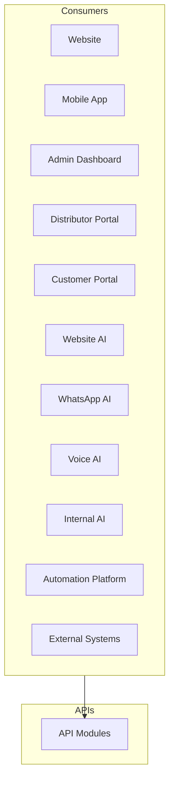
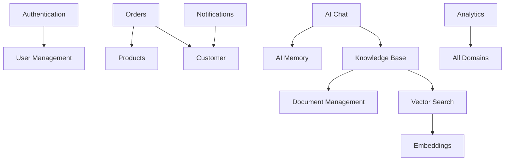
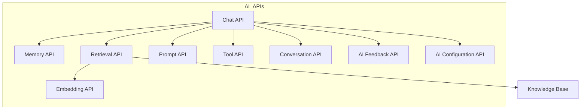
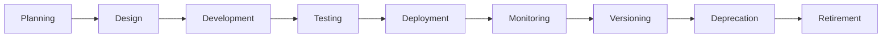

# 04_API_Backend_Architecture/03_API_CATALOG.md

# Dayjoy Enterprise AI Platform — API Catalog

> **Purpose:** Define the complete API Catalog for the Dayjoy Enterprise AI Platform, identifying every logical API module, its business purpose, ownership, consumers, dependencies, and lifecycle.
>
> **Scope:** High-level catalog only — no endpoint URLs, request bodies, response schemas, OpenAPI specifications, or implementation details.
>
> **Audience:** Solution architects, backend engineers, AI engineers, frontend engineers, product owners, and business stakeholders.

---

## Table of Contents

1. [API Catalog Overview](#1-api-catalog-overview)
2. [API Domain Organization](#2-api-domain-organization)
3. [API Module Details](#3-api-module-details)
4. [Consumer Mapping](#4-consumer-mapping)
5. [Service Dependencies](#5-service-dependencies)
6. [AI API Catalog](#6-ai-api-catalog)
7. [Lifecycle Management](#7-lifecycle-management)
8. [Governance](#8-governance)
9. [Future API Catalog](#9-future-api-catalog)
10. [Architecture Diagrams](#10-architecture-diagrams)

---

## 1. API Catalog Overview

### 1.1 Purpose of an API Catalog

The API Catalog serves as the **master inventory** of all API modules across the Dayjoy platform, providing a unified view of business capabilities, ownership, consumers, and dependencies.[04_API_Backend_Architecture/00_API_OVERVIEW.md][02_System_Architecture/09_API_ARCHITECTURE.md]

### 1.2 Business Objectives

- **Visibility:** Clear understanding of all API modules.
- **Ownership:** Defined ownership for every API.
- **Consistency:** Standardized API design and documentation.
- **Governance:** Controlled API lifecycle and changes.
- **Reusability:** Enable API reuse across the platform.

### 1.3 API-First Architecture Philosophy

- APIs are designed before implementation.
- APIs are treated as products with clear ownership.
- APIs enable composability and reuse.

### 1.4 Relationship Between APIs, Backend Services, AI Systems, Databases, and Integrations

- **APIs:** Expose business capabilities to clients.
- **Backend Services:** Implement business logic and data access.
- **AI Systems:** Consume and expose AI-specific APIs.
- **Databases:** Accessed via backend services, not directly by clients.
- **Integrations:** External services accessed via backend APIs or integration layer.

### 1.5 Enterprise API Organization Principles

- **Domain-Aligned:** APIs organized by business domains.
- **Modular:** Each API module is a cohesive unit.
- **Documented:** All APIs fully documented.
- **Versioned:** All APIs versioned for compatibility.
- **Governed:** All APIs follow governance and standards.

---

## 2. API Domain Organization

### 2.1 Logical Business Domains

| Domain | Description |
|---|---|
| Core Platform | Authentication, user management, roles, configuration, health |
| Customer | Customer management, profile, preferences |
| Distributor | Distributor management, team, commission, wallet |
| Products | Product management, categories, pricing, inventory (future) |
| Orders | Order management, payments, shipment tracking |
| AI Platform | AI chat, memory, prompts, tools, agents, feedback |
| Knowledge | Knowledge base, documents, vector search, embeddings, metadata |
| Conversations | Chat sessions, messages, history, summaries |
| Notifications | Email, SMS, WhatsApp, push notifications |
| Analytics | Reports, dashboards, events, metrics |
| Administration | Audit logs, system monitoring, feature flags, workflow management |

---

## 3. API Module Details

### 3.1 API Module Catalog

| Module ID | Module Name | Business Purpose | Business Domain | Primary Consumers | Dependencies | Data Sources | Related Services | AI Usage | Priority |
|---|---|---|---|---|---|---|---|---|---|
| CORE-AUTH-001 | Authentication | Handle login, registration, tokens | Core Platform | All | User Management | User DB | User Mgmt | None | Critical |
| CORE-USER-001 | User Management | Manage user accounts | Core Platform | Admin, All | Authentication | User DB | Auth | None | Critical |
| CORE-ROLE-001 | Role & Permission | Manage roles and permissions | Core Platform | Admin | User Management | User DB | User Mgmt | None | High |
| CORE-CONF-001 | Configuration | Manage system configuration | Core Platform | Admin | None | Config DB | None | None | High |
| CORE-HLTH-001 | Health & Status | System health and status | Core Platform | Admin, Monitoring | None | System | None | None | High |
| CUST-MGMT-001 | Customer Management | Manage customer accounts | Customer | Admin, All | User Management | Customer DB | User Mgmt | None | Critical |
| CUST-PROF-001 | Customer Profile | Manage customer profiles | Customer | Customer, AI | Customer Management | Customer DB | Customer Mgmt | Read | High |
| CUST-PREF-001 | Customer Preferences | Manage customer preferences | Customer | Customer, AI | Customer Management | Customer DB | Customer Mgmt | Read | Medium |
| DIST-MGMT-001 | Distributor Management | Manage distributor accounts | Distributor | Admin, Distributor | User Management | Distributor DB | User Mgmt | None | Critical |
| DIST-TEAM-001 | Team Management | Manage distributor teams | Distributor | Distributor, Admin | Distributor Management | Distributor DB | Distributor Mgmt | Read | High |
| DIST-COMM-001 | Commission | Manage commissions | Distributor | Distributor, Admin | Distributor Management | Commission DB | Distributor Mgmt | None | High |
| DIST-WALL-001 | Wallet | Manage distributor wallets | Distributor | Distributor, Admin | Distributor Management | Wallet DB | Distributor Mgmt | None | High |
| PROD-MGMT-001 | Product Management | Manage product catalog | Products | All | None | Product DB | None | Read | Critical |
| PROD-CAT-001 | Categories | Manage product categories | Products | All | Product Management | Product DB | Product Mgmt | Read | High |
| PROD-PRIC-001 | Pricing | Manage product pricing | Products | All | Product Management | Product DB | Product Mgmt | Read | High |
| PROD-INV-001 | Inventory (future) | Manage inventory | Products | All | Product Management | Inventory DB | Product Mgmt | None | Medium |
| ORD-MGMT-001 | Order Management | Manage orders | Orders | All | Customer, Products | Order DB | Customer Mgmt, Product Mgmt | None | Critical |
| ORD-PAY-001 | Payments | Manage payments | Orders | All | Order Management | Payment DB | Order Mgmt | None | Critical |
| ORD-SHIP-001 | Shipment Tracking | Track shipments | Orders | All | Order Management | Shipment DB | Order Mgmt | None | Medium |
| AI-CHAT-001 | AI Chat | AI chat functionality | AI Platform | All | AI Memory, Knowledge | Conversation DB | AI Memory, Knowledge | Core | Critical |
| AI-MEM-001 | AI Memory | Manage AI memory | AI Platform | AI Chat | None | AI Memory DB | None | Core | High |
| AI-PROMPT-001 | Prompt Management | Manage AI prompts | AI Platform | AI Chat, Admin | None | Prompt DB | None | Core | High |
| AI-TOOL-001 | Tool Execution | Execute AI tools | AI Platform | AI Chat | None | Tool DB | None | Core | High |
| AI-AGENT-001 | AI Agents | Manage AI agents | AI Platform | Admin | AI Chat, AI Memory | Agent DB | AI Chat, AI Memory | Core | Medium |
| AI-FB-001 | AI Feedback | Manage AI feedback | AI Platform | All | AI Chat | Feedback DB | AI Chat | Core | Medium |
| KB-MGMT-001 | Knowledge Base | Manage knowledge documents | Knowledge | AI, Admin | Document Management | Knowledge DB | Doc Mgmt | Core | Critical |
| KB-DOC-001 | Document Management | Manage documents | Knowledge | KB-MGMT | None | Document DB | KB-MGMT | Read | High |
| KB-VEC-001 | Vector Search | Vector search | Knowledge | AI Chat, KB-MGMT | Embeddings | Vector DB | Embeddings | Core | High |
| KB-EMB-001 | Embeddings | Manage embeddings | Knowledge | KB-VEC | None | Vector DB | KB-VEC | Core | High |
| KB-META-001 | Metadata | Manage metadata | Knowledge | KB-MGMT, AI | None | Metadata DB | KB-MGMT | Read | High |
| CONV-SESS-001 | Chat Sessions | Manage chat sessions | Conversations | AI Chat | None | Conversation DB | AI Chat | Core | High |
| CONV-MSG-001 | Messages | Manage messages | Conversations | AI Chat | Chat Sessions | Conversation DB | Chat Sessions | Core | High |
| CONV-HIST-001 | Conversation History | Manage conversation history | Conversations | AI Chat, Admin | Messages | Conversation DB | Messages | Read | High |
| CONV-SUM-001 | Summaries | Manage conversation summaries | Conversations | AI Chat | Conversation History | Conversation DB | Conv History | Read | Medium |
| NOTIF-EMAIL-001 | Email | Send email notifications | Notifications | All | Customer | Email DB | Customer Mgmt | None | High |
| NOTIF-SMS-001 | SMS | Send SMS notifications | Notifications | All | Customer | SMS DB | Customer Mgmt | None | High |
| NOTIF-WA-001 | WhatsApp | Send WhatsApp notifications | Notifications | All | Customer | WhatsApp DB | Customer Mgmt | None | High |
| NOTIF-PUSH-001 | Push Notifications | Send push notifications | Notifications | All | Customer | Push DB | Customer Mgmt | None | High |
| ANL-REP-001 | Reports | Generate reports | Analytics | Admin | All Domains | Analytics DB | All | Read | High |
| ANL-DASH-001 | Dashboards | Generate dashboards | Analytics | Admin | Reports | Analytics DB | Reports | Read | High |
| ANL-EVT-001 | Events | Track events | Analytics | All | None | Event DB | None | None | High |
| ANL-MET-001 | Metrics | Track metrics | Analytics | Admin | Events | Metrics DB | Events | Read | High |
| ADM-AUD-001 | Audit Logs | Manage audit logs | Administration | Admin | All | Audit DB | All | None | Critical |
| ADM-MON-001 | System Monitoring | Monitor system | Administration | Admin | All | Monitoring DB | All | None | Critical |
| ADM-FLAG-001 | Feature Flags | Manage feature flags | Administration | Admin | None | Config DB | None | None | High |
| ADM-WF-001 | Workflow Management | Manage workflows | Administration | Admin | None | Workflow DB | None | None | High |

---

## 4. Consumer Mapping

### 4.1 API Consumer Matrix

| Consumer | Core Platform | Customer | Distributor | Products | Orders | AI Platform | Knowledge | Conversations | Notifications | Analytics | Administration |
|---|---|---|---|---|---|---|---|---|---|---|---|
| Website | ✅ | ✅ | ✅ | ✅ | ✅ | ✅ | ✅ | ✅ | ✅ | ✅ | ✅ |
| Mobile App | ✅ | ✅ | ✅ | ✅ | ✅ | ✅ | ✅ | ✅ | ✅ | ✅ | ✅ |
| Admin Dashboard | ✅ | ✅ | ✅ | ✅ | ✅ | ✅ | ✅ | ✅ | ✅ | ✅ | ✅ |
| Distributor Portal | ✅ | ✅ | ✅ | ✅ | ✅ | ✅ | ✅ | ✅ | ✅ | ✅ | ✅ |
| Customer Portal | ✅ | ✅ | ✅ | ✅ | ✅ | ✅ | ✅ | ✅ | ✅ | ✅ | ✅ |
| Website AI | ✅ | ✅ | ✅ | ✅ | ✅ | ✅ | ✅ | ✅ | ✅ | ✅ | ✅ |
| WhatsApp AI | ✅ | ✅ | ✅ | ✅ | ✅ | ✅ | ✅ | ✅ | ✅ | ✅ | ✅ |
| Voice AI | ✅ | ✅ | ✅ | ✅ | ✅ | ✅ | ✅ | ✅ | ✅ | ✅ | ✅ |
| Internal AI | ✅ | ✅ | ✅ | ✅ | ✅ | ✅ | ✅ | ✅ | ✅ | ✅ | ✅ |
| Automation Platform | ✅ | ✅ | ✅ | ✅ | ✅ | ✅ | ✅ | ✅ | ✅ | ✅ | ✅ |
| External Systems | ✅ | ✅ | ✅ | ✅ | ✅ | ✅ | ✅ | ✅ | ✅ | ✅ | ✅ |

---

## 5. Service Dependencies

### 5.1 Dependency Matrix

| API Module | Depends On |
|---|---|
| Authentication | User Management |
| Orders | Products, Customer |
| AI Chat | AI Memory, Knowledge Base |
| Knowledge Base | Document Management, Vector Search |
| Vector Search | Embeddings |
| Notifications | Customer |
| Analytics | All Domains |
| Audit Logs | All Domains |
| System Monitoring | All Domains |

---

## 6. AI API Catalog

### 6.1 AI API Modules

| API Module | Purpose |
|---|---|
| Chat API | Provide AI chat functionality |
| Memory API | Manage AI memory and user profiles |
| Retrieval API | Retrieve knowledge for AI |
| Prompt API | Manage AI prompts and versions |
| Tool API | Execute AI tools and functions |
| Embedding API | Generate and manage embeddings |
| Conversation API | Manage conversations and messages |
| AI Feedback API | Manage AI feedback and ratings |
| AI Configuration API | Manage AI configuration and settings |

---

## 7. Lifecycle Management

### 7.1 API Module Lifecycle

| Stage | Description |
|---|---|
| Planning | Identify need for API module |
| Design | Design API module |
| Development | Implement API module |
| Testing | Test API module |
| Deployment | Deploy API module |
| Monitoring | Monitor API module usage and performance |
| Versioning | Version API module |
| Deprecation | Deprecate old API module versions |
| Retirement | Retire deprecated API modules |

---

## 8. Governance

### 8.1 Governance Framework

- **Module Owner:** Each API module has a designated owner.
- **Business Owner:** Business owner for each domain.
- **Documentation Owner:** Documentation owner for each module.
- **Review Frequency:** Regular review of API modules.
- **Approval Workflow:** Approval process for API changes.
- **Change Management:** Change management process.
- **Naming Standards:** Naming standards for API modules.

---

## 9. Future API Catalog

### 9.1 Future API Modules

| Module Name | Business Purpose | Status |
|---|---|---|
| Recommendation Engine | Provide product recommendations | Future |
| Inventory Management | Manage inventory | Future |
| Manufacturing | Manage manufacturing | Future |
| HR | Manage HR | Future |
| Finance | Manage finance | Future |
| Loyalty Program | Manage loyalty program | Future |
| Marketplace | Manage marketplace | Future |
| Public Developer APIs | Public APIs for developers | Future |
| Partner APIs | Partner APIs | Future |
| AI Orchestration APIs | Orchestrate AI workflows | Future |

All future modules must align with governance, security, and business objectives.

---

## 10. Architecture Diagrams

### 10.1 API Domain Map

```mermaid
flowchart TB
    subgraph Core
        CORE[Core Platform]
    end

    subgraph Customer
        CUST[Customer]
    end

    subgraph Distributor
        DIST[Distributor]
    end

    subgraph Products
        PROD[Products]
    end

    subgraph Orders
        ORD[Orders]
    end

    subgraph AI
        AI[AI Platform]
    end

    subgraph Knowledge
        KB[Knowledge]
    end

    subgraph Conversations
        CONV[Conversations]
    end

    subgraph Notifications
        NOTIF[Notifications]
    end

    subgraph Analytics
        ANL[Analytics]
    end

    subgraph Admin
        ADM[Administration]
    end
```

### 10.2 API Consumer Architecture



### 10.3 API Dependency Graph



### 10.4 AI API Ecosystem



### 10.5 Backend Module Architecture

```mermaid
flowchart TB
    subgraph Core
        CORE[Core Platform]
    end

    subgraph Business
        CUST[Customer]
        DIST[Distributor]
        PROD[Products]
        ORD[Orders]
    end

    subgraph AI
        AI[AI Platform]
        KB[Knowledge]
        CONV[Conversations]
    end

    subgraph Support
        NOTIF[Notifications]
        ANL[Analytics]
        ADM[Administration]
    end
```

### 10.6 API Lifecycle Workflow



---

**END OF DOCUMENT**