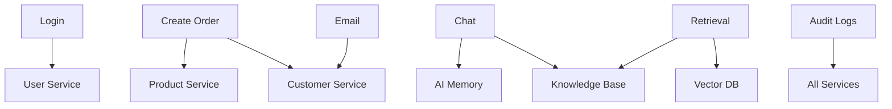
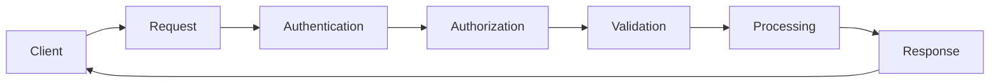
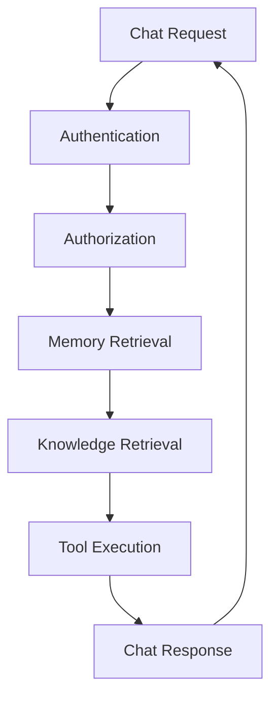
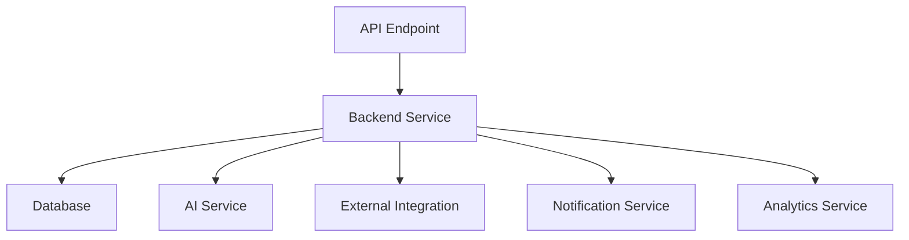
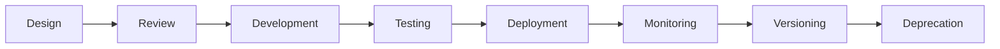

# 04_API_Backend_Architecture/04_ENDPOINT_SPECIFICATIONS.md

# Dayjoy Enterprise AI Platform — Endpoint Specifications

> **Purpose:** Define the complete logical endpoint specifications for the Dayjoy Enterprise AI Platform, covering every API endpoint required across all platform modules, including business purpose, ownership, request flow, permissions, dependencies, and expected behavior.
>
> **Scope:** Logical API design only — no implementation code, OpenAPI/Swagger specifications, or framework-specific examples.
>
> **Audience:** Solution architects, backend engineers, AI engineers, frontend engineers, product owners, and business stakeholders.

---

## Table of Contents

1. [Endpoint Specification Overview](#1-endpoint-specification-overview)
2. [Endpoint Organization](#2-endpoint-organization)
3. [Endpoint Template](#3-endpoint-template)
4. [Endpoint Classification](#4-endpoint-classification)
5. [Endpoint Security](#5-endpoint-security)
6. [Endpoint Dependencies](#6-endpoint-dependencies)
7. [AI Endpoint Design](#7-ai-endpoint-design)
8. [Lifecycle Management](#8-lifecycle-management)
9. [Governance](#9-governance)
10. [Future Endpoint Roadmap](#10-future-endpoint-roadmap)
11. [Architecture Diagrams](#11-architecture-diagrams)

---

## 1. Endpoint Specification Overview

### 1.1 Purpose of Endpoint Specifications

Endpoint specifications provide **detailed, consistent definitions** for every API endpoint across the Dayjoy platform, ensuring clarity on business purpose, ownership, request flow, permissions, dependencies, and behavior.[04_API_Backend_Architecture/03_API_CATALOG.md][04_API_Backend_Architecture/01_API_STANDARDS.md]

### 1.2 Relationship with the API Catalog

- The API Catalog defines API modules at a high level.
- Endpoint Specifications define individual endpoints within each module.

### 1.3 Endpoint Design Philosophy

- Endpoints are resource-oriented and RESTful.
- Endpoints are designed for clarity, consistency, and ease of use.
- Endpoints are secure by default.

### 1.4 RESTful Design Principles

- **Resource-Oriented:** Endpoints represent resources.
- **HTTP Methods:** Use appropriate HTTP methods (GET, POST, PUT, PATCH, DELETE).
- **Stateless:** No server-side session state.
- **Consistent:** Uniform design and behavior.

### 1.5 Enterprise Consistency Guidelines

- All endpoints follow naming and design standards.
- All endpoints are documented and versioned.
- All endpoints are secured and auditable.

---

## 2. Endpoint Organization

### 2.1 Endpoint Modules

Endpoints are organized by module:

| Module | Endpoints |
|---|---|
| Authentication | Login, Logout, Refresh Session, Forgot Password, Reset Password, Verify Identity |
| Users | Create User, Get User, Update User, Delete User, List Users |
| Customers | Customer Profile, Customer Preferences, Customer History |
| Distributors | Distributor Profile, Team Management, Commission, Wallet |
| Products | Products, Categories, Search Products |
| Orders | Create Order, Order History, Order Details, Order Tracking |
| AI | Chat, AI Memory, Prompt Management, Tool Execution, Feedback |
| Knowledge | Documents, Search, Retrieval, Embeddings |
| Conversations | Sessions, Messages, Conversation Summary |
| Notifications | Email, SMS, WhatsApp, Push |
| Analytics | Reports, Dashboard, Events |
| Administration | Audit Logs, Configuration, Monitoring |

---

## 3. Endpoint Template

### 3.1 Logical Endpoint Template

For every endpoint, the following logical template is used:

| Field | Description |
|---|---|
| Endpoint ID | Unique identifier for the endpoint |
| Endpoint Name | Descriptive name |
| Business Purpose | Business purpose of the endpoint |
| Module | API module |
| Consumer(s) | Primary consumers |
| HTTP Method (logical only) | GET, POST, PUT, PATCH, DELETE |
| Resource | Resource being accessed |
| Authentication Required | Yes/No |
| Authorization Role(s) | Required roles |
| Request Description | Description of request |
| Response Description | Description of response |
| Business Rules | Business rules enforced |
| Dependencies | Dependencies |
| AI Usage | AI usage (if any) |
| Related Workflows | Related workflows |

---

## 4. Endpoint Classification

### 4.1 Endpoint Classification Matrix

| Classification | Description | Why Used |
|---|---|---|
| CRUD | Create, Read, Update, Delete operations | Standard data operations |
| Search | Search and filter operations | Enable discovery |
| Authentication | Login, logout, token management | Secure access |
| AI | AI-specific operations | AI functionality |
| Reporting | Reports and dashboards | Business insights |
| Configuration | System configuration | Configure system |
| Webhook | Webhook endpoints | External integrations |
| Integration | Integration endpoints | External systems |
| Analytics | Analytics and events | Track usage |
| Administration | Admin operations | System management |

---

## 5. Endpoint Security

### 5.1 Security Matrix

| Endpoint | Authentication Required | Authorization Scope | Sensitive Data Handling | Audit Logging | Rate Limiting | AI Access Policy |
|---|---|---|---|---|---|---|
| Login | Yes | None | Encrypted | Yes | High | None |
| Get User | Yes | Own/Admin | Encrypted | Yes | Medium | Read |
| Create Order | Yes | Customer | Encrypted | Yes | Medium | None |
| AI Chat | Yes | User | Encrypted | Yes | High | Core |
| Knowledge Retrieval | Yes | AI/User | Encrypted | Yes | High | Core |
| Audit Logs | Yes | Admin | Encrypted | Yes | Low | None |

---

## 6. Endpoint Dependencies

### 6.1 Dependency Matrix

| Endpoint | Backend Services | Database | Vector DB | AI Memory | Knowledge Base | External Integrations | Notifications | Analytics |
|---|---|---|---|---|---|---|---|---|
| Login | Auth Service | User DB | No | No | No | No | No | No |
| Get User | User Service | User DB | No | No | No | No | No | No |
| Create Order | Order Service | Order DB | No | No | No | Payment Gateway | Yes | Yes |
| AI Chat | AI Service | Conversation DB | No | Yes | Yes | No | No | No |
| Knowledge Retrieval | AI Service | Knowledge DB | Yes | No | Yes | No | No | No |
| Audit Logs | Audit Service | Audit DB | No | No | No | No | No | No |

---

## 7. AI Endpoint Design

### 7.1 AI Endpoint Catalog

| Endpoint | Logical Behavior |
|---|---|
| Chat | Provide AI chat functionality, including context and memory |
| Memory | Manage AI memory (read/write) for user profiles and context |
| Retrieval | Retrieve knowledge for AI (semantic search) |
| Tool Calling | Execute AI tools and functions |
| Prompt Management | Manage AI prompts and versions |
| AI Feedback | Manage AI feedback and ratings |
| Context Management | Manage AI context for conversations |
| Conversation Summary | Summarize conversations for AI |

---

## 8. Lifecycle Management

### 8.1 Endpoint Lifecycle

| Stage | Description |
|---|---|
| Design | Design endpoint |
| Review | Review endpoint design |
| Development | Implement endpoint |
| Testing | Test endpoint |
| Deployment | Deploy endpoint |
| Monitoring | Monitor endpoint usage and performance |
| Versioning | Version endpoint |
| Deprecation | Deprecate endpoint |

---

## 9. Governance

### 9.1 Governance Framework

- **Endpoint Owner:** Each endpoint has a designated owner.
- **Business Owner:** Business owner for each module.
- **Review Frequency:** Regular review of endpoints.
- **Documentation Requirements:** All endpoints documented.
- **Approval Workflow:** Approval process for endpoint changes.
- **Change Management:** Change management process.

---

## 10. Future Endpoint Roadmap

### 10.1 Future Endpoints

| Endpoint | Business Purpose | Status |
|---|---|---|
| AI Agents | Manage AI agents | Future |
| Recommendation Engine | Provide recommendations | Future |
| Inventory | Manage inventory | Future |
| Finance | Manage finance | Future |
| HR | Manage HR | Future |
| Marketplace | Manage marketplace | Future |
| Public APIs | Public APIs for developers | Future |
| Partner APIs | Partner APIs | Future |
| Streaming APIs | Streaming APIs | Future |
| Event APIs | Event-driven APIs | Future |

All future endpoints must align with governance, security, and business objectives.

---

## 11. Architecture Diagrams

### 11.1 API Endpoint Hierarchy

```mermaid
flowchart TB
    subgraph Auth
        LOGIN[Login]
        LOGOUT[Logout]
        REFRESH[Refresh Session]
    end

    subgraph Users
        CREATE_USER[Create User]
        GET_USER[Get User]
        UPDATE_USER[Update User]
        DELETE_USER[Delete User]
        LIST_USERS[List Users]
    end

    subgraph Customers
        CUST_PROF[Customer Profile]
        CUST_PREF[Customer Preferences]
        CUST_HIST[Customer History]
    end

    subgraph Distributors
        DIST_PROF[Distributor Profile]
        TEAM[Team Management]
        COMM[Commission]
        WALL[Wallet]
    end

    subgraph Products
        PROD[Products]
        CAT[Categories]
        SEARCH[Search Products]
    end

    subgraph Orders
        CREATE_ORD[Create Order]
        ORD_HIST[Order History]
        ORD_DET[Order Details]
        ORD_TRACK[Order Tracking]
    end

    subgraph AI
        CHAT[Chat]
        MEM[AI Memory]
        PROMPT[Prompt Management]
        TOOL[Tool Execution]
        FB[Feedback]
    end

    subgraph Knowledge
        DOC[Documents]
        SEARCH_KB[Search]
        RET[Retrieval]
        EMB[Embeddings]
    end

    subgraph Conversations
        SESS[Sessions]
        MSG[Messages]
        SUM[Conversation Summary]
    end

    subgraph Notifications
        EMAIL[Email]
        SMS[SMS]
        WA[WhatsApp]
        PUSH[Push]
    end

    subgraph Analytics
        REP[Reports]
        DASH[Dashboard]
        EVT[Events]
    end

    subgraph Admin
        AUD[Audit Logs]
        CONF[Configuration]
        MON[Monitoring]
    end
```

### 11.2 Endpoint Dependency Graph

### 11.3 Request Flow

### 11.4 AI Endpoint Workflow

### 11.5 Backend Communication Flow

### 11.6 Endpoint Lifecycle

---

**END OF DOCUMENT**