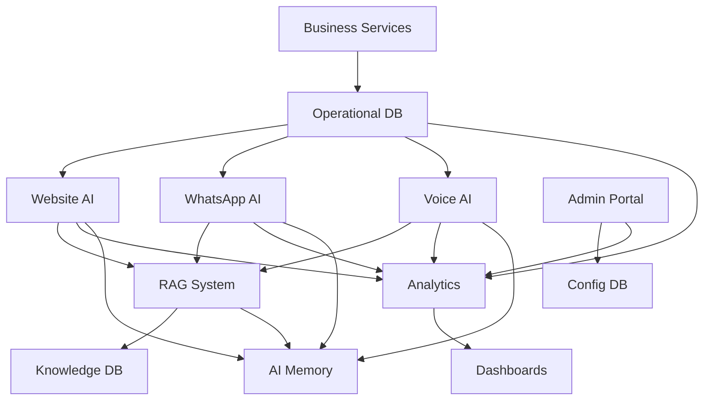
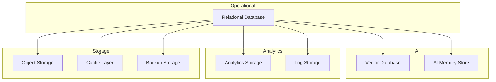
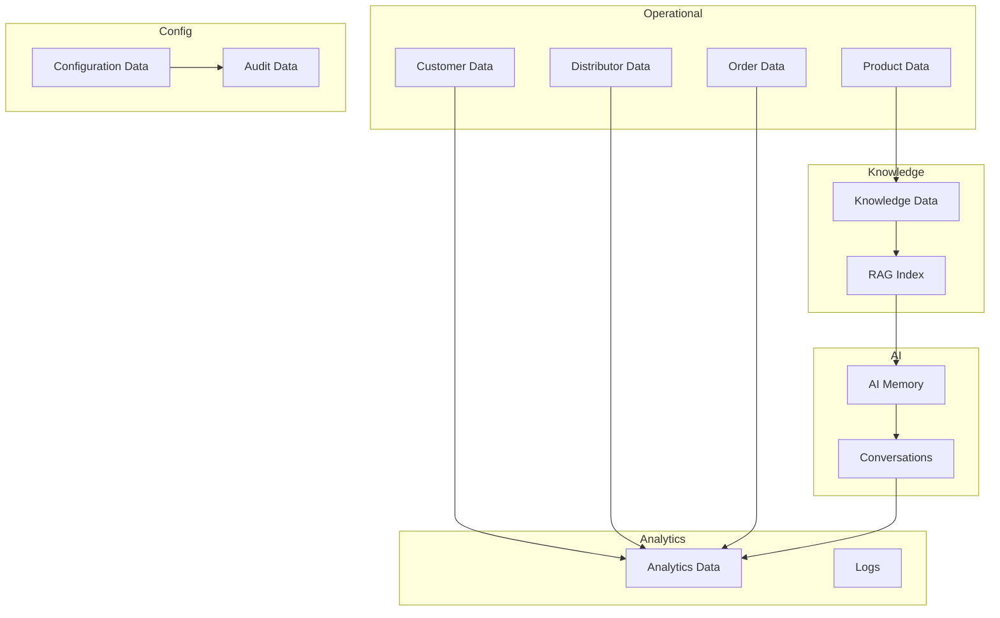
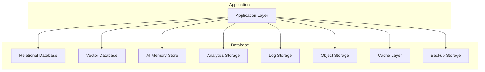

# 03_Database_Design/00_DATABASE_OVERVIEW.md

# Dayjoy Enterprise AI Platform — Database Overview

> **Purpose:** Define the master database overview for the Dayjoy Enterprise AI Platform, covering database strategy, logical data architecture, database ecosystem, storage philosophy, and governance principles.
>
> **Scope:** High-level database architecture and strategy only — no SQL schemas, table definitions, or implementation-specific details.
>
> **Audience:** Data architects, solution architects, backend engineers, AI engineers, DevOps, security teams, and business stakeholders.

---

## Table of Contents

1. [Database Overview](#1-database-overview)
2. [Database Ecosystem](#2-database-ecosystem)
3. [Database Design Principles](#3-database-design-principles)
4. [Logical Data Architecture](#4-logical-data-architecture)
5. [Database Responsibilities](#5-database-responsibilities)
6. [Data Classification](#6-data-classification)
7. [Data Lifecycle Overview](#7-data-lifecycle-overview)
8. [Database Governance](#8-database-governance)
9. [Cross-System Data Flow](#9-cross-system-data-flow)
10. [Non-Functional Requirements](#10-non-functional-requirements)
11. [Future Database Vision](#11-future-database-vision)
12. [Architecture Diagrams](#12-architecture-diagrams)

---

## 1. Database Overview

### 1.1 Purpose of the Database Architecture

The database architecture provides a **structured, secure, and scalable foundation** for all Dayjoy business operations and AI systems. It ensures data consistency, integrity, and accessibility while supporting AI-driven interactions across Website, WhatsApp, Voice, and internal channels.[02_System_Architecture/00_SYSTEM_OVERVIEW.md][02_System_Architecture/01_HIGH_LEVEL_ARCHITECTURE.md][02_System_Architecture/08_DATABASE_ARCHITECTURE.md]

### 1.2 Business Objectives

- **Single Source of Truth:** Clear ownership and authoritative sources for each data domain.
- **AI-Ready Data:** Structured, validated data for RAG, analytics, and AI reasoning.[02_System_Architecture/03_AI_ARCHITECTURE.md][02_System_Architecture/04_RAG_ARCHITECTURE.md]
- **Operational Efficiency:** Support for orders, distributors, products, customers, and support workflows.[04_Distributor_System.md][05_Policies.md]
- **Governance & Compliance:** Audit trails, access control, and data lifecycle management.
- **Scalability:** Support growing users, AI interactions, and data volumes.

### 1.3 Database Design Philosophy

- **Domain-Driven Design:** Data organized by business domains (Customer, Distributor, Product, Orders, etc.).
- **Separation of Concerns:** Operational data vs. analytical data vs. AI memory.
- **Security by Design:** RBAC, encryption, and audit logging at all layers.
- **Modularity & Extensibility:** Easy to add new domains and data types.
- **Auditability:** All changes tracked for compliance and debugging.

### 1.4 Data-Driven AI Strategy

- AI agents rely on **verified, structured data** for reasoning and responses.
- RAG uses **knowledge data** (docs, policies, FAQs) for grounded answers.
- AI memory stores **session and preference data** for context.
- Analytics uses **aggregated data** for insights and dashboards.[02_System_Architecture/13_MONITORING_ARCHITECTURE.md]

### 1.5 Enterprise Data Management Goals

- **Data Quality:** Accurate, complete, consistent, timely data.
- **Data Security:** Protected data with RBAC and encryption.
- **Data Availability:** High availability for critical data.
- **Data Lifecycle:** Managed creation, usage, archival, and deletion.
- **Data Governance:** Clear ownership, stewardship, and standards.

---

## 2. Database Ecosystem

### 2.1 Logical Data Store Catalog

| Database ID | Data Store Name | Purpose | Business Owner | Stored Information | Related Platform Modules |
|---|---|---|---|---|---|
| DB-REL-001 | Relational Database | Core business data | Data Architect / Domain Owners | Customers, Distributors, Products, Orders, Users, Roles | Customer, Distributor, Product, Order, Auth Services |
| DB-VEC-001 | Vector Database | Semantic search and RAG | Knowledge Team / AI Team | Embeddings, metadata for knowledge chunks | RAG Service, Knowledge Service, AI Agents |
| DB-MEM-001 | AI Memory Store | AI session and preference memory | AI Team | Session context, preferences, feedback | AI Agents, Memory Service |
| DB-CACHE-001 | Cache Layer | Fast access to frequently used data | DevOps / Engineering | Sessions, hot data, computed results | All Services, AI Agents |
| DB-OBJ-001 | Object Storage | Documents and media | Knowledge Team / Operations | Knowledge docs, recordings, images, backups | Knowledge Service, AI Agents, Backup |
| DB-ANL-001 | Analytics Storage | Aggregated metrics and insights | Analytics Team | KPIs, dashboards, reports | Analytics Service, Dashboards |
| DB-LOG-001 | Log Storage | System and AI logs | DevOps / Security | Logs, events, audit trails | Monitoring, Security, All Services |
| DB-BKP-001 | Backup Storage | Disaster recovery | DevOps / Security | Backups, archives | Backup Service, DR Environment |

---

## 3. Database Design Principles

### 3.1 Principle Catalog

| Principle ID | Principle Name | Description | Why Important |
|---|---|---|---|
| PRINC-DB-001 | Single Source of Truth | Each data domain has one authoritative source. | Prevents inconsistencies and conflicts. |
| PRINC-DB-002 | Data Integrity | Data must be accurate, complete, and consistent. | Ensures trust in data and AI responses. |
| PRINC-DB-003 | Normalization Strategy | Data normalized to reduce redundancy. | Improves data quality and maintainability. |
| PRINC-DB-004 | Scalability | Database must scale with data growth. | Supports business growth and AI usage. |
| PRINC-DB-005 | High Availability | Critical data must be highly available. | Ensures business continuity. |
| PRINC-DB-006 | Security by Design | Security integrated into all data layers. | Protects sensitive data and complies with regulations. |
| PRINC-DB-007 | Modularity | Data organized by domains and modules. | Easier to maintain and extend. |
| PRINC-DB-008 | Extensibility | Easy to add new data types and domains. | Supports future business needs. |
| PRINC-DB-009 | Auditability | All changes tracked and auditable. | Compliance and debugging. |
| PRINC-DB-010 | AI Readiness | Data structured for AI and RAG usage. | Enables accurate AI responses and insights. |

---

## 4. Logical Data Architecture

### 4.1 Logical Data Flow

- **Operational Data:**
  - Customer, distributor, product, order data.
  - Used by business services and AI agents.

- **Knowledge Data:**
  - Policies, FAQs, SOPs, product docs.
  - Used by RAG and AI agents for grounded answers.

- **AI Memory:**
  - Session context, preferences, feedback.
  - Used by AI agents for personalized interactions.

- **Conversations:**
  - Conversation transcripts and metadata.
  - Used for analytics, support, and compliance.

- **Analytics:**
  - Aggregated metrics and KPIs.
  - Used for dashboards and insights.

- **Configuration:**
  - System and AI configuration.
  - Used by all services for runtime behavior.

- **Audit Data:**
  - Audit trails for all changes.
  - Used for compliance and security.

---

## 5. Database Responsibilities

### 5.1 Database Layer Responsibilities

- **Data Storage:**
  - Store and retrieve data efficiently and securely.

- **Data Integrity:**
  - Enforce constraints and validation rules.

- **Data Security:**
  - Encrypt data at rest and in transit.
  - Enforce RBAC and access control.

- **Data Availability:**
  - Ensure high availability and disaster recovery.

- **Auditability:**
  - Track all changes for audit and compliance.

### 5.2 Application Layer Responsibilities

- **Business Logic:**
  - Implement business rules and workflows.

- **Data Validation:**
  - Validate data before storing.

- **Data Transformation:**
  - Transform data for AI, analytics, and UI.

- **Data Access:**
  - Access data via APIs and services, not directly.

### 5.3 Architectural Boundaries

- **Database Layer:**
  - Focus on storage, integrity, security, availability.

- **Application Layer:**
  - Focus on business logic, validation, transformation.

- **AI Layer:**
  - Focus on reasoning, retrieval, and response generation.

---

## 6. Data Classification

### 6.1 Data Classification Model

| Data Class | Description | Owner | Criticality | Update Frequency |
|---|---|---|---|---|
| Master Data | Core business entities (customers, distributors, products) | Domain Owners | Critical | Low |
| Transactional Data | Business transactions (orders, payments) | Operations | Critical | High |
| Reference Data | Static reference data (categories, statuses) | Data Team | Medium | Low |
| Knowledge Data | Policies, FAQs, SOPs, product docs | Knowledge Team | High | Medium |
| AI Data | AI memory, prompts, feedback | AI Team | High | High |
| Configuration Data | System and AI configuration | Admin / IT | High | Medium |
| Operational Data | Operational metrics and logs | Operations / DevOps | Medium | High |
| Security Data | Auth, RBAC, audit logs | Security Team | Critical | High |
| Audit Data | Audit trails for all changes | Security / Compliance | Critical | High |
| Analytical Data | Aggregated metrics and KPIs | Analytics Team | Medium | Medium |

---

## 7. Data Lifecycle Overview

### 7.1 Lifecycle Stages

1. **Creation:**
   - Data created via validated forms, APIs, or imports.

2. **Validation:**
   - Data validated against business rules and schemas.

3. **Storage:**
   - Data stored in appropriate data stores.

4. **Retrieval:**
   - Data accessed by authorized users and AI agents.

5. **Update:**
   - Controlled updates with versioning where applicable.

6. **Archival:**
   - Inactive data archived based on retention policy.

7. **Deletion:**
   - Data deleted per compliance and retention rules.

8. **Recovery:**
   - Data recovered from backups if needed.

### 7.2 Data Lifecycle Diagram

---

## 8. Database Governance

### 8.1 Governance Framework

- **Data Ownership:**
  - Each data domain has a clear business owner.

- **Stewardship:**
  - Data stewards responsible for data quality and standards.

- **Quality Standards:**
  - Accuracy, completeness, consistency, timeliness.

- **Naming Standards:**
  - Consistent naming for all data entities.

- **Version Management:**
  - Versioned data for knowledge, prompts, and configurations.

- **Documentation Standards:**
  - All data entities documented with metadata.

- **Change Management:**
  - All changes via controlled processes.

- **Review Process:**
  - Regular reviews of data quality and standards.

---

## 9. Cross-System Data Flow

### 9.1 High-Level Data Flow

- **Website AI:**
  - User → Website AI → RAG → Knowledge DB → Response → Analytics.

- **WhatsApp AI:**
  - User → WhatsApp AI → RAG → Knowledge DB → Response → Notifications.

- **Voice AI:**
  - User → Voice AI → RAG → Knowledge DB → Response → Recording/Logs.

- **Admin Portal:**
  - Admin → Admin Portal → Config DB → System Config → All Services.

- **RAG System:**
  - AI Query → RAG → Knowledge DB → Snippets → AI Response.

- **AI Memory:**
  - AI Agent → Memory DB → Session/Preference Data → AI Context.

- **Analytics:**
  - Logs/Events → Analytics DB → Dashboards → Management.

- **Business Services:**
  - Services → Operational DB → Business Data → AI/Analytics.

### 9.2 Cross-System Data Flow Diagram

---

## 10. Non-Functional Requirements

### 10.1 NFR Catalog

| NFR ID | Requirement | Target |
|---|---|---|
| NFR-SCAL-001 | Scalability | Support exponential data growth |
| NFR-REL-001 | Reliability | 99.9%+ availability for critical data |
| NFR-PERF-001 | Performance | < 100ms for most queries |
| NFR-AVAIL-001 | Availability | 99.9%+ for critical data stores |
| NFR-MAIN-001 | Maintainability | Easy to add new domains and data types |
| NFR-SEC-001 | Security | RBAC, encryption, audit logging |
| NFR-COMP-001 | Compliance | GDPR, local privacy laws |
| NFR-DR-001 | Disaster Recovery | RTO < 4 hours, RPO < 1 hour |
| NFR-OBS-001 | Observability | Metrics, logs, traces for all data stores |

---

## 11. Future Database Vision

### 11.1 Future Recommendations

| Capability | Purpose | Status |
|---|---|---|
| Multi-tenant Architecture | Support multiple organizations | Future |
| Global Data Distribution | Global availability and low latency | Future |
| Knowledge Graph | Structured knowledge for AI | Future |
| Data Lake | Centralized data for analytics | Future |
| AI Learning Dataset | Dataset for AI training and improvement | Future |
| Real-Time Analytics | Real-time insights and dashboards | Future |
| Event Streaming | Real-time event streaming | Future |
| Cross-Region Replication | Global data replication | Future |

All future capabilities must integrate with existing governance, security, and scalability models.

---

## 12. Architecture Diagrams

### 12.1 Database Ecosystem

### 12.2 Logical Data Architecture

### 12.3 Cross-System Data Flow

### 12.4 Data Lifecycle

### 12.5 Database Layer Overview

---

**END OF DOCUMENT**