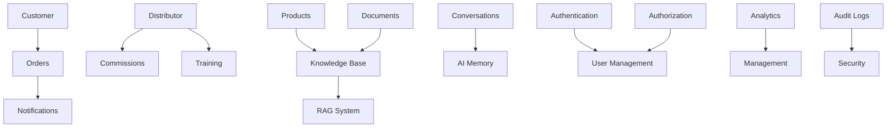
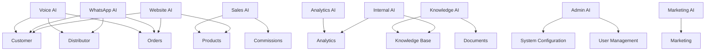
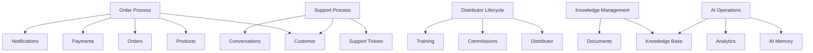

# 03_Database_Design/01_DATA_DOMAINS.md

# Dayjoy Enterprise AI Platform — Data Domains

> **Purpose:** Identify, classify, and document every logical business data domain within the Dayjoy Enterprise AI Platform, defining ownership, responsibilities, relationships, governance, and AI usage.
>
> **Scope:** Logical data domains only — no database tables, SQL structures, or implementation-specific details.
>
> **Audience:** Data architects, solution architects, backend engineers, AI engineers, DevOps, security teams, product owners, and business stakeholders.

---

## Table of Contents

1. [Data Domain Overview](#1-data-domain-overview)
2. [Master Data Domain Catalog](#2-master-data-domain-catalog)
3. [Domain Responsibilities](#3-domain-responsibilities)
4. [Domain Relationships](#4-domain-relationships)
5. [Domain Classification](#5-domain-classification)
6. [Domain Lifecycle](#6-domain-lifecycle)
7. [AI Usage by Domain](#7-ai-usage-by-domain)
8. [Security & Access Classification](#8-security--access-classification)
9. [Domain Governance](#9-domain-governance)
10. [Future Domain Expansion](#10-future-domain-expansion)
11. [Architecture Diagrams](#11-architecture-diagrams)

---

## 1. Data Domain Overview

### 1.1 Purpose of Data Domains

Data domains group related business information into logical areas (e.g., Customer, Distributor, Products, Orders), reflecting Dayjoy’s core business functions.[02_System_Architecture/08_DATABASE_ARCHITECTURE.md][02_System_Architecture/00_SYSTEM_OVERVIEW.md]

They help:

- Align data structures with business processes.
- Clarify ownership, responsibilities, and governance.
- Support scalable, modular database and API design.

### 1.2 Domain-Driven Data Modeling

Dayjoy uses domain-driven data modeling to:

- Mirror business domains in data architecture.
- Enable modular services and clear boundaries.
- Simplify AI knowledge organization and RAG usage.[02_System_Architecture/02_COMPONENT_ARCHITECTURE.md][02_System_Architecture/03_AI_ARCHITECTURE.md]

### 1.3 Relationship Between Business Domains and Database Design

- Each business domain maps to one or more logical data domains.
- Data domains drive entity modeling, schema design, and APIs.
- AI, RAG, and analytics use domain definitions to organize queries and knowledge.

### 1.4 How Domains Support AI, RAG, APIs, Analytics, and Operations

- **AI:** Uses domain-defined APIs and knowledge for reasoning and tool calls.[02_System_Architecture/07_AGENT_ARCHITECTURE.md]
- **RAG:** Organizes knowledge by domain for retrieval.[02_System_Architecture/04_RAG_ARCHITECTURE.md]
- **APIs:** Expose domain-based endpoints (Customer, Distributor, Product, Order, etc.).[02_System_Architecture/09_API_ARCHITECTURE.md]
- **Analytics:** Aggregates metrics by domain (orders, distributors, AI usage).[02_System_Architecture/13_MONITORING_ARCHITECTURE.md]
- **Operations:** Uses domains to manage processes and responsibilities.[Project_Context/07_BUSINESS_PROCESSES.md]

---

## 2. Master Data Domain Catalog

### 2.1 Domain Catalog Table

| Domain ID | Domain Name | Description | Business Purpose | Business Owner | Primary Users | Related Platform Modules | Criticality Level | Priority |
|---|---|---|---|---|---|---|---|---|
| DOM-CUST-001 | Customer | Customer profiles and interactions | Manage customer data and support | CX / Customer Management | Customers, Support, AI | Customer Service, Orders, Notifications, Analytics | Critical | High |
| DOM-DIST-001 | Distributor | Distributor profiles, teams, metrics | Manage distributor business and hierarchy | Distributor Management | Distributors, Management, AI | Distributor Service, Compensation, Training, Analytics | Critical | High |
| DOM-PROD-001 | Products | Product catalog and attributes | Manage product information | Product Team | Customers, Distributors, AI | Product Service, Knowledge, Marketing, RAG | Critical | High |
| DOM-ORD-001 | Orders | Order lifecycle and transactions | Manage orders, payments, fulfillment | Operations / Order Management | Customers, Distributors, Support, AI | Order Service, Notifications, Analytics | Critical | High |
| DOM-INV-001 | Inventory | Inventory levels and movements | Manage stock and availability | Operations / Inventory | Operations, Management | Inventory Service (future), Orders | High | Medium |
| DOM-PAY-001 | Payments | Payment records and statuses | Track payments and billing | Finance | Customers, Distributors, Finance | Payment Gateway Integration, Orders | High | High |
| DOM-COMM-001 | Commissions | Distributor commissions and earnings | Manage distributor incentives | Finance / Distributor Mgmt | Distributors, Management, AI | Compensation Service, Analytics | Critical | High |
| DOM-KB-001 | Knowledge Base | Enterprise knowledge content | Store policies, FAQs, SOPs, guides | Knowledge Team | All users, AI | Knowledge Service, RAG, AI Agents | Critical | High |
| DOM-AIMEM-001 | AI Memory | AI session and preference memory | Store AI context and preferences | AI Team | AI Agents | Memory Service, AI Agents | High | Medium |
| DOM-CONV-001 | Conversations | Conversation transcripts and metadata | Store interaction history | AI / CX | Support, AI Team, Analytics | Conversation Store, Analytics | High | Medium |
| DOM-MKT-001 | Marketing | Campaigns, content, templates | Manage marketing activities | Marketing Team | Marketing, Management, AI | Marketing Service, Notifications | Medium | Medium |
| DOM-NOTIF-001 | Notifications | Notification records and status | Manage multi-channel notifications | Operations / CX | CX, AI Agents | Notification Service | Critical | High |
| DOM-AUTH-001 | Authentication | User identities and credentials | Authenticate all users | Security / IT | All users | Auth Service | Critical | High |
| DOM-AUTHZ-001 | Authorization | Roles, permissions, policies | Authorize actions and data access | Security / IT | Admins, AI, Services | RBAC/Policy Engine | Critical | High |
| DOM-USER-001 | User Management | User profiles and preferences | Manage users across roles | Admin / IT | Admins, Support, AI | User Management Service | High | Medium |
| DOM-ANL-001 | Analytics | KPIs, metrics, dashboards | Monitor performance and success | Analytics Team | Management, Operations, AI | Analytics Service | Critical | High |
| DOM-AUDIT-001 | Audit Logs | Audit trails for changes | Ensure compliance and traceability | Security / Compliance | Security, Management | Audit Logging Service | Critical | High |
| DOM-DOC-001 | Documents | Structured and unstructured docs | Store documents and files | Knowledge / Operations | All users, AI | Document Repository, Knowledge, RAG | High | High |
| DOM-CONF-001 | System Configuration | System and AI configuration | Control platform behavior | Admin / IT | Admins, DevOps, AI Team | Config Service, Admin Portal | Critical | High |
| DOM-AUTO-001 | Automation | Automation rules and workflows | Orchestrate business workflows | Operations / IT | Operations, AI, Integrations | Automation Engine | High | Medium |
| DOM-REPORT-001 | Reports | Generated reports and exports | Provide reports to stakeholders | Analytics / Management | Management, Operations | Reporting Service | Medium | Medium |
| DOM-TRAIN-001 | Training | Training content and progress | Manage distributor training | Training / Distributor Mgmt | Distributors, Training Team | Training Service (future), Knowledge | Medium | Medium |
| DOM-SUPPORT-001 | Support Tickets | Support cases and complaints | Manage customer/distributor support | Support / CX | Support, CX, AI | Ticketing Service | Critical | High |

---

## 3. Domain Responsibilities

### 3.1 Domain Responsibility Examples

Below are representative responsibilities; each domain should be further detailed in domain-specific documents.

#### DOM-CUST-001 – Customer

- **Business Responsibilities:**
  - Maintain customer profiles and preferences.
  - Support customer-related processes (orders, support).
- **Data Ownership:** CX / Customer Management.
- **Supported Processes:** Registration, profile updates, customer support.
- **Data Consumers:** Customer Service, Orders, Notifications, AI Agents, Analytics.
- **Data Producers:** Website, WhatsApp AI, Voice AI, Admin Portal, Support.
- **AI Usage:** Read-only for profile and preferences, tool execution for customer queries, analytics for satisfaction.
- **Related APIs:** Customer APIs (get/update profile, search customers).[02_System_Architecture/09_API_ARCHITECTURE.md]
- **Boundaries:** Does not manage distributor data or commissions.

#### DOM-DIST-001 – Distributor

- **Business Responsibilities:**
  - Manage distributor profiles, hierarchy, and business metrics.
- **Data Ownership:** Distributor Management.
- **Supported Processes:** Registration, KYC, performance tracking, commissions.
- **Data Consumers:** Distributor Service, Compensation, Training, AI Agents, Analytics.
- **Data Producers:** Distributor Portal, Admin Portal, WhatsApp/Voice AI.
- **AI Usage:** Read-only for distributor info, tool execution for business support, analytics for performance.
- **Related APIs:** Distributor APIs (profile, team, metrics).[04_Distributor_System.md]
- **Boundaries:** Does not directly manage AI prompts or product data.

#### DOM-PROD-001 – Products

- **Business Responsibilities:**
  - Maintain product catalog, attributes, and relationships.
- **Data Ownership:** Product Team.
- **Supported Processes:** Product listing, search, recommendations.
- **Data Consumers:** Website, AI Agents, Orders, Knowledge, Marketing.
- **Data Producers:** Admin Portal, Product Team.
- **AI Usage:** Retrieval for product info and recommendations.
- **Related APIs:** Product APIs (details, search).[03_Product_Research.md]
- **Boundaries:** Does not manage orders or pricing rules beyond catalog.

*(Other domains follow similar patterns.)*

---

## 4. Domain Relationships

### 4.1 Relationship Examples

- **Customer ↔ Orders:** Customer places orders; orders reference customers.
- **Distributor ↔ Commissions:** Distributor earns commissions; commissions reference distributors.
- **Product ↔ Knowledge Base:** Product docs and FAQs are linked to products.
- **Conversation ↔ AI Memory:** Conversations use and update AI memory.
- **Documents ↔ RAG:** Documents serve as knowledge sources for RAG.
- **Analytics ↔ All Business Domains:** Analytics aggregates metrics across domains.

### 4.2 Domain Relationship Matrix (Simplified)

| From Domain | To Domain | Relationship Description |
|---|---|---|
| Customer | Orders | Customer has many orders |
| Distributor | Commissions | Distributor has many commissions |
| Distributor | Training | Distributor participates in training |
| Products | Knowledge Base | Product docs stored in KB |
| Documents | Knowledge Base | Documents ingested into KB |
| Knowledge Base | RAG | KB content indexed in RAG |
| Conversations | AI Memory | Conversations reference memory |
| Notifications | Customer/Distributor | Notifications sent to users |
| Authentication | User Management | Auth references user records |
| Analytics | All Domains | Analytics aggregates data from all |
| Audit Logs | All Domains | Audit logs capture changes to all |

---

## 5. Domain Classification

### 5.1 Classification Categories

| Domain | Classification | Explanation |
|---|---|---|
| Customer | Master Data | Core entities with long-lived identity. |
| Distributor | Master Data | Core entities with business hierarchy. |
| Products | Master Data | Core catalog entities. |
| Orders | Transactional Data | High-volume business transactions. |
| Inventory | Operational Data | Operational stock and availability. |
| Payments | Transactional Data | Financial transactions and records. |
| Commissions | Transactional/Analytical Data | Earnings transactions used for analytics. |
| Knowledge Base | Knowledge Data | Documents and content for RAG. |
| AI Memory | AI Data | AI-specific contextual data. |
| Conversations | AI/Operational Data | Interaction history for AI and support. |
| Marketing | Operational Data | Campaign and content data. |
| Notifications | Operational Data | Notification events and status. |
| Authentication | Security Data | Identity and credentials. |
| Authorization | Security Data | Roles and permissions. |
| User Management | Master/Operational Data | User profiles across roles. |
| Analytics | Analytical Data | Aggregated metrics and KPIs. |
| Audit Logs | Audit Data | Audit trails of changes and actions. |
| Documents | Knowledge/Operational Data | Docs used for knowledge and operations. |
| System Configuration | Configuration Data | Config and feature flags. |
| Automation | Operational/Configuration Data | Workflow definitions and states. |
| Reports | Analytical Data | Generated reports and exports. |
| Training | Knowledge/Operational Data | Training content and progress. |
| Support Tickets | Operational/Transactional Data | Support case records. |

---

## 6. Domain Lifecycle

### 6.1 Lifecycle Stages (Per Domain)

For each domain, lifecycle follows similar stages conceptually:

- **Creation:**
  - Data created via forms, APIs, imports, or system events.

- **Validation:**
  - Domain-specific validation (e.g., KYC for Distributor, address for Customer).

- **Usage:**
  - Data used by services, AI, and analytics.

- **Updates:**
  - Controlled updates with audit logging.

- **Archiving:**
  - Inactive or historical data archived per policy.

- **Deletion:**
  - Data removed per retention and compliance rules.

- **Ownership Transfer (if applicable):**
  - Ownership changes (e.g., account reassignment) managed via domain processes.

---

## 7. AI Usage by Domain

### 7.1 AI Access Matrix

| Domain | Website AI | WhatsApp AI | Voice AI | Internal AI | Admin AI | Sales AI | Marketing AI | Analytics AI | Knowledge AI |
|---|---|---|---|---|---|---|---|---|---|
| Customer | Read, Tools | Read, Tools | Read, Tools | Read | Read | Read | Read | Aggregates | Context |
| Distributor | Read, Tools | Read, Tools | Read, Tools | Read | Read | Read | Read | Aggregates | Context |
| Products | Read, RAG Context | Read, RAG Context | Read, RAG Context | Read | Read | Recommendations | Content | Aggregates | RAG Source |
| Orders | Read, Tools | Read, Tools | Read, Tools | Read | Read | Read | Read | Aggregates | Context |
| Inventory | Read | Read | Read | Read | Read | Read | Read | Aggregates | Context |
| Payments | Read, Tools | Read, Tools | Read, Tools | Read | Read | Read | Read | Aggregates | Context |
| Commissions | Read, Tools | Read, Tools | Read, Tools | Read | Read | Read | Read | Aggregates | Context |
| Knowledge Base | RAG Retrieval | RAG Retrieval | RAG Retrieval | RAG | RAG | RAG | RAG | Aggregates | Core |
| AI Memory | Memory Updates | Memory Updates | Memory Updates | Memory | Memory | Memory | Memory | Aggregates | Context |
| Conversations | Read | Read | Read | Read | Read | Read | Read | Aggregates | Context |
| Marketing | Read | Read | Read | Read | Read | Read | Content | Aggregates | Context |
| Notifications | Tools | Tools | Tools | Tools | Tools | Tools | Tools | Aggregates | Context |
| Authentication | Tools | Tools | Tools | Tools | Tools | Tools | Tools | Aggregates | Context |
| Authorization | Tools | Tools | Tools | Tools | Tools | Tools | Tools | Aggregates | Context |
| User Management | Tools | Tools | Tools | Tools | Tools | Tools | Tools | Aggregates | Context |
| Analytics | Read | Read | Read | Read | Read | Read | Read | Core | Context |
| Audit Logs | Read | Read | Read | Read | Read | Read | Read | Core | Context |
| Documents | RAG Source | RAG Source | RAG Source | RAG | RAG | RAG | RAG | Aggregates | Core |
| System Configuration | Read | Read | Read | Read | Read/Tools | Read | Read | Aggregates | Context |
| Automation | Tools | Tools | Tools | Tools | Tools | Tools | Tools | Aggregates | Context |
| Reports | Read | Read | Read | Read | Read | Read | Read | Core | Context |
| Training | Read | Read | Read | Read | Read | Read | Read | Aggregates | RAG Source |
| Support Tickets | Read, Tools | Read, Tools | Read, Tools | Read, Tools | Read | Read | Read | Aggregates | Context |

---

## 8. Security & Access Classification

### 8.1 Security Classification Matrix

| Domain | Classification | Read Access | Write Access | Approval Requirements | Audit Requirements |
|---|---|---|---|---|---|
| Customer | Confidential | Customer, CX, AI | CX, Admin | Sensitive updates require approval | All changes logged |
| Distributor | Confidential | Distributor, Mgmt, AI | Distributor Mgmt, Admin | KYC and status changes require approval | All changes logged |
| Products | Internal/Public | All users, AI | Product Team, Admin | Major changes require review | Changes logged |
| Orders | Confidential | Customer, Distributor, CX, AI | Order Mgmt, System | Refunds/changes require approval | All changes logged |
| Inventory | Internal | Ops, Mgmt | Ops | Large adjustments require approval | Changes logged |
| Payments | Sensitive | Finance, Ops, AI | Finance, System | Refunds require approval | All changes logged |
| Commissions | Sensitive | Distributor, Mgmt, AI | Finance, Distributor Mgmt | Adjustments require approval | All changes logged |
| Knowledge Base | Internal/Public | All users, AI | Knowledge Team | Approval for Published docs | Changes logged |
| AI Memory | Internal | AI Team, AI | AI System | Policy-based | Access logged |
| Conversations | Confidential | Support, AI Team | System | Policy-based | Access logged |
| Marketing | Internal/Public | Marketing, Mgmt | Marketing | Campaign approvals | Changes logged |
| Notifications | Internal | Ops, CX, AI | Notification Service | Bulk sends require approval | Changes logged |
| Authentication | Sensitive | Security, Auth Service | Auth Service | Policy-based | Access logged |
| Authorization | Sensitive | Security, Admin | Security, Admin | Role changes require approval | Changes logged |
| User Management | Confidential | Admin, CX | Admin, System | Role changes require approval | Changes logged |
| Analytics | Internal | Mgmt, Ops, AI | Analytics | KPI changes require review | Changes logged |
| Audit Logs | Restricted | Security, Compliance | System | Policy-based | Core audit |
| Documents | Confidential/Internal/Public | Based on doc metadata | Knowledge, Ops | Publication approvals | Changes logged |
| System Configuration | Restricted | Admin, DevOps, AI | Admin, DevOps | Config changes require approval | Changes logged |
| Automation | Internal | Ops, AI | Ops, IT | Workflow changes require approval | Changes logged |
| Reports | Internal | Mgmt, Ops | Analytics | Report definition changes require review | Changes logged |
| Training | Internal | Distributors, Training | Training | Content approvals | Changes logged |
| Support Tickets | Confidential | Support, CX, AI | Support, System | Closures/escalations per policy | Changes logged |

---

## 9. Domain Governance

### 9.1 Governance Framework

For each domain:

- **Domain Owner:** Business lead responsible for domain.
- **Steward:** Data steward for quality and standards.
- **Review Frequency:** Regular reviews (e.g., quarterly).
- **Quality Standards:** Accuracy, completeness, consistency, timeliness.
- **Versioning:** Version management for critical data (knowledge, config).
- **Documentation Requirements:** Domain documentation, data dictionary.
- **Change Approval Process:** Approval required for schema and process changes.

---

## 10. Future Domain Expansion

### 10.1 Future Domains

| Domain Name | Description | Priority | Business Value | Dependencies |
|---|---|---|---|---|
| International Operations | Country-specific operations and data | High | Global expansion | Customer, Distributor, Orders |
| Finance | Financial planning and accounting | Medium | Strategic financial insights | Payments, Commissions |
| HR | Employee data and HR processes | Medium | Internal operations | User Management |
| Manufacturing | Production and quality data | Medium | Product and supply chain | Inventory |
| Supply Chain | Logistics and supplier data | Medium | Delivery and operations | Orders, Inventory |
| Predictive Analytics | Predictive models and results | High | Strategic insights | Analytics, AI Data |
| AI Training Data | Datasets for AI training | High | AI improvement | Conversations, Knowledge |
| IoT Integration | Sensor and device data | Low | Future product integration | Inventory, Manufacturing |

All future domains must integrate with existing governance, security, and data architecture.

---

## 11. Architecture Diagrams

### 11.1 Domain Hierarchy

```mermaid
flowchart TB
    ROOT[Dayjoy Data Domains] --> CUST[Customer]
    ROOT --> DIST[Distributor]
    ROOT --> PROD[Products]
    ROOT --> ORD[Orders]
    ROOT --> INV[Inventory]
    ROOT --> PAY[Payments]
    ROOT --> COMM[Commissions]
    ROOT --> KB[Knowledge Base]
    ROOT --> AIMEM[AI Memory]
    ROOT --> CONV[Conversations]
    ROOT --> MKT[Marketing]
    ROOT --> NOTIF[Notifications]
    ROOT --> AUTH[Authentication]
    ROOT --> AUTHZ[Authorization]
    ROOT --> USER[User Management]
    ROOT --> ANL[Analytics]
    ROOT --> AUDIT[Audit Logs]
    ROOT --> DOC[Documents]
    ROOT --> CONF[System Configuration]
    ROOT --> AUTO[Automation]
    ROOT --> REPORT[Reports]
    ROOT --> TRAIN[Training]
    ROOT --> SUPPORT[Support Tickets]
```

### 11.2 Domain Relationships

### 11.3 Domain Ownership

```mermaid
flowchart TB
    CX[CX / Customer Mgmt] --> CUST[Customer]
    DISTOWN[Distributor Mgmt] --> DIST[Distributor]
    PRODOWN[Product Team] --> PROD[Products]
    OPS[Operations] --> ORD[Orders]
    FIN[Finance] --> PAY[Payments]
    FIN --> COMM[Commissions]
    KNOW[Knowledge Team] --> KB[Knowledge Base]
    AITEAM[AI Team] --> AIMEM[AI Memory]
    CX --> CONV[Conversations]
    MKTTEAM[Marketing] --> MKT[Marketing]
    OPS --> NOTIF[Notifications]
    SEC[Security] --> AUTH[Authentication]
    SEC --> AUTHZ[Authorization]
    ADMIN[Admin / IT] --> USER[User Management]
    ANLTEAM[Analytics] --> ANL[Analytics]
    COMPLIANCE[Compliance] --> AUDIT[Audit Logs]
    OPS --> DOC[Documents]
    ADMIN --> CONF[System Configuration]
    OPS --> AUTO[Automation]
    ANLTEAM --> REPORT[Reports]
    TRAINTEAM[Training] --> TRAIN[Training]
    SUPPORTTEAM[Support] --> SUPPORT[Support Tickets]
```

### 11.4 AI Access by Domain

### 11.5 Business Process to Domain Mapping

---

**END OF DOCUMENT**