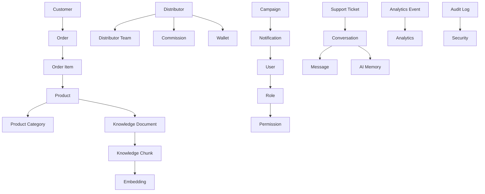
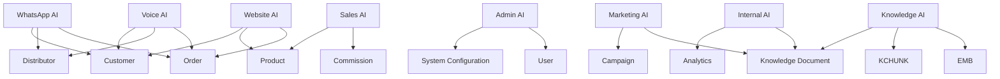

# 03_Database_Design/02_ENTITY_MODEL.md

# Dayjoy Enterprise AI Platform — Entity Model

> **Purpose:** Define the complete logical entity model for the Dayjoy Enterprise AI Platform by identifying core business entities, their purpose, business rules, ownership, lifecycle, relationships, and AI interactions.
>
> **Scope:** Logical business entities only — no SQL schemas, table definitions, or implementation-specific structures.
>
> **Audience:** Data architects, solution architects, backend engineers, AI engineers, DevOps, security teams, product owners, business stakeholders, and AI assistants.

---

## Table of Contents

1. [Entity Model Overview](#1-entity-model-overview)
2. [Master Entity Catalog](#2-master-entity-catalog)
3. [Entity Attributes](#3-entity-attributes)
4. [Entity Responsibilities](#4-entity-responsibilities)
5. [Entity Relationships](#5-entity-relationships)
6. [Entity Lifecycle](#6-entity-lifecycle)
7. [AI Interaction Model](#7-ai-interaction-model)
8. [Security Classification](#8-security-classification)
9. [Governance](#9-governance)
10. [Future Entity Expansion](#10-future-entity-expansion)
11. [Architecture Diagrams](#11-architecture-diagrams)

---

## 1. Entity Model Overview

### 1.1 Purpose of Entity Modeling

Entity modeling defines **business-centric concepts** (e.g., Customer, Distributor, Product, Order) and their relationships independently of physical database structures.[03_Database_Design/00_DATABASE_OVERVIEW.md][03_Database_Design/01_DATA_DOMAINS.md]

It helps:

- Align data with business processes and responsibilities.
- Provide a shared language for architects, engineers, AI, and business stakeholders.
- Guide database schema design, APIs, and AI knowledge organization.

### 1.2 Business Entities vs. Database Tables

- **Business Entities:** Conceptual objects representing real-world business concepts (e.g., `Customer`, `Order`, `Product`).
- **Database Tables:** Physical storage structures that implement entities and relationships.

Entities may map to one or more tables, views, or data structures, but this document focuses only on **logical entity definitions**.

### 1.3 Role of Entities in APIs, AI, RAG, Analytics, and Automation

- **APIs:** Entities define resources exposed via APIs (e.g., `/customers`, `/orders`).[02_System_Architecture/09_API_ARCHITECTURE.md]
- **AI Systems:** Entities shape AI reasoning, tool calls, and memory structures.[02_System_Architecture/03_AI_ARCHITECTURE.md][02_System_Architecture/07_AGENT_ARCHITECTURE.md]
- **RAG:** Entities organize knowledge and metadata (e.g., product docs linked to `Product`).[02_System_Architecture/04_RAG_ARCHITECTURE.md]
- **Analytics:** Metrics and KPIs are calculated per entity (e.g., order volume, distributor performance).[02_System_Architecture/13_MONITORING_ARCHITECTURE.md]
- **Automation:** Workflows operate on entities (e.g., order status changes, distributor onboarding).[02_System_Architecture/02_COMPONENT_ARCHITECTURE.md]

### 1.4 Entity Modeling Principles

- **Business-Driven:** Entities reflect Dayjoy’s business concepts and processes.
- **Domain-Aligned:** Entities align with data domains (Customer, Distributor, Product, etc.).[03_Database_Design/01_DATA_DOMAINS.md]
- **Stable Concepts:** Entities are designed to be stable over time, even as implementations change.
- **Explicit Relationships:** Relationships are defined clearly (e.g., `Customer` → `Order`).
- **AI-Ready:** Entities include attributes and relationships relevant for AI, RAG, analytics, and automation.

---

## 2. Master Entity Catalog

### 2.1 Entity Catalog Table

| Entity ID | Entity Name | Description | Business Purpose | Business Owner | Primary Users | Lifecycle Status | Criticality | Related Domains |
|---|---|---|---|---|---|---|---|---|
| ENT-CUST-001 | Customer | Individual or organization purchasing Dayjoy products | Manage customer relationships and interactions | CX / Customer Mgmt | Customers, Support, AI, Analytics | Active | Critical | Customer, Orders, Notifications, Analytics |
| ENT-DIST-001 | Distributor | Individual enrolled as Dayjoy distributor | Manage distributor business, hierarchy, and performance | Distributor Mgmt | Distributors, Mgmt, AI, Analytics | Active | Critical | Distributor, Commissions, Training, Support |
| ENT-DTEAM-001 | Distributor Team | Hierarchical team structure under a distributor | Represent downline structure and team performance | Distributor Mgmt | Distributors, Mgmt, AI | Active | High | Distributor, Analytics |
| ENT-PROD-001 | Product | Dayjoy product offering | Manage product catalog and attributes | Product Team | Customers, Distributors, AI, Marketing | Active | Critical | Products, Knowledge Base, Marketing |
| ENT-PCAT-001 | Product Category | Logical grouping of products | Organize products for search and reporting | Product Team | Product Team, Marketing, AI | Active | High | Products, Analytics |
| ENT-ORD-001 | Order | Customer or distributor order | Manage order lifecycle and fulfillment | Order Mgmt | Customers, Distributors, Support, AI | Active | Critical | Orders, Payments, Notifications |
| ENT-ORDITEM-001 | Order Item | Line item within an order | Represent specific products in an order | Order Mgmt | Customers, Distributors, Analytics | Active | High | Orders, Products |
| ENT-PAY-001 | Payment | Payment transaction | Track payments, refunds, status | Finance | Customers, Distributors, Finance, AI | Active | Critical | Payments, Orders, Analytics |
| ENT-COMM-001 | Commission | Distributor earnings record | Manage commissions and incentives | Finance / Distributor Mgmt | Distributors, Mgmt, AI, Analytics | Active | Critical | Commissions, Distributor |
| ENT-WALLET-001 | Wallet | Distributor financial wallet | Track available earnings and balances | Finance / Distributor Mgmt | Distributors, Finance | Active | High | Commissions, Payments |
| ENT-NOTIF-001 | Notification | Notification event and status | Manage notifications sent to users | Operations / CX | CX, AI Agents, Analytics | Active | Critical | Notifications, Customer, Distributor |
| ENT-CAMP-001 | Campaign | Marketing campaign | Manage marketing activities and content | Marketing | Marketing, Mgmt, AI | Active | Medium | Marketing, Notifications |
| ENT-KDOC-001 | Knowledge Document | Source document for knowledge (policy, SOP, guide) | Store enterprise knowledge | Knowledge Team | All users, AI | Active | Critical | Knowledge Base, Documents |
| ENT-KCHUNK-001 | Knowledge Chunk | Chunked portion of a knowledge document | Support granular RAG retrieval | Knowledge Team / AI Team | AI, Knowledge Team | Active | High | Knowledge Base, RAG |
| ENT-EMB-001 | Embedding | Vector representation of a knowledge chunk | Support semantic retrieval | AI Team | AI, RAG Service | Active | High | RAG, Vector DB |
| ENT-CONV-001 | Conversation | Multi-turn interaction session | Track user-AI interactions | AI / CX | Support, AI Team, Analytics | Active | High | Conversations, AI Memory |
| ENT-MSG-001 | Message | Individual message within a conversation | Represent user or AI utterances | AI / CX | Support, AI Team | Active | High | Conversations, AI Memory |
| ENT-AGENT-001 | AI Agent | Logical AI agent (Website, WhatsApp, Voice, etc.) | Represent AI capabilities and configuration | AI Team | AI Team, Admin | Active | High | AI Memory, Prompts, Tools |
| ENT-AIMEM-001 | AI Memory | Session or user-specific memory | Store AI context and preferences | AI Team | AI Agents | Active | High | AI Memory, Conversations |
| ENT-PROMPT-001 | Prompt | AI prompt template and configuration | Define AI behavior and context | AI Governance | AI Team, Admin | Active | Critical | Prompts, AI Agents |
| ENT-TOOL-001 | Tool | Logical tool/function AI can call | Execute business operations | Engineering / AI Team | AI Team, Services | Active | High | APIs, Automation |
| ENT-WF-001 | Workflow | Business process workflow | Orchestrate multi-step processes | Operations / IT | Ops, AI, Integrations | Active | Medium | Automation, Notifications |
| ENT-AUTO-001 | Automation | Automation rule or instance | Represent automated actions | Operations / IT | Ops, AI | Active | Medium | Automation, Workflow |
| ENT-USER-001 | User | Platform user (customer, distributor, employee, admin) | Manage user identity and profile | Admin / IT | All users, Support, AI | Active | Critical | Authentication, Authorization, User Mgmt |
| ENT-ROLE-001 | Role | Role definition | Group permissions and access rights | Security / IT | Admin, Security | Active | Critical | Authorization, User Mgmt |
| ENT-PERM-001 | Permission | Fine-grained permission | Control access to actions and data | Security / IT | Security, Admin | Active | Critical | Authorization |
| ENT-AUDIT-001 | Audit Log | Audit event record | Track changes and sensitive actions | Security / Compliance | Security, Compliance, Mgmt | Active | Critical | Audit Logs |
| ENT-ANLEVT-001 | Analytics Event | Event used for analytics | Capture metrics and usage | Analytics Team | Analytics, Mgmt | Active | High | Analytics |
| ENT-TICKET-001 | Support Ticket | Support case or complaint | Manage support process | Support / CX | Support, CX, AI | Active | Critical | Support Tickets, Conversations |
| ENT-FAQ-001 | FAQ | Frequently asked question item | Provide quick answers | Knowledge / CX | Customers, Distributors, AI | Active | High | Knowledge Base, RAG |
| ENT-POLICY-001 | Policy | Policy definition (returns, compensation) | Define official rules | Legal / Compliance | All users, AI | Active | Critical | Knowledge Base, RAG |
| ENT-TRAINMAT-001 | Training Material | Training content | Support distributor training | Training / Distributor Mgmt | Distributors, Training Team | Active | Medium | Training, Knowledge Base |
| ENT-CONF-001 | System Configuration | System and AI config entry | Control platform behavior | Admin / IT | Admins, DevOps, AI Team | Active | Critical | System Configuration |

---

## 3. Entity Attributes

### 3.1 Conceptual Attribute Examples

Below are conceptual attributes for representative entities; detailed attributes will be refined in domain-specific design.

#### ENT-CUST-001 – Customer

- **Core Business Attributes:**
  - Customer ID (unique business identifier).
  - Name, contact details (phone, email).
  - Address, region.
  - Customer type (retail, distributor-associated).
  - Registration date.
- **Required Information:**
  - Unique identifier, name, contact, minimal address.
- **Optional Information:**
  - Preferences, additional contact methods.
- **Unique Business Identifier:**
  - Customer ID, possibly email/phone for uniqueness.
- **Validation Rules:**
  - Valid email format, phone format, required fields.
- **Business Constraints:**
  - Unique contact info per active customer; compliance with privacy policies.

#### ENT-DIST-001 – Distributor

- **Core Business Attributes:**
  - Distributor ID (unique business identifier).
  - Name, contact details.
  - KYC details (e.g., PAN, address).
  - Rank, BV/PV metrics.
  - Joining date, status (active, inactive, suspended).
- **Required Information:**
  - Unique ID, name, core KYC data.
- **Optional Information:**
  - Training status, preferences.
- **Unique Business Identifier:**
  - Distributor ID; KYC identifiers must be unique.[04_Distributor_System.md]
- **Validation Rules:**
  - KYC rules, uniqueness checks, status transitions.
- **Business Constraints:**
  - One distributor per KYC identifier; rank rules per policy.

#### ENT-PROD-001 – Product

- **Core Business Attributes:**
  - Product ID.
  - Name, category.
  - Description, benefits.
  - Price, BV/PV attribution.
- **Required Information:**
  - ID, name, category, base attributes.
- **Optional Information:**
  - Detailed descriptions, marketing content.
- **Unique Business Identifier:**
  - Product ID.
- **Validation Rules:**
  - Valid category, non-negative price.
- **Business Constraints:**
  - Product must belong to a category; BV/PV rules per compensation plan.[03_Product_Research.md]

*(Other entities follow similar conceptual attribute definitions.)*

---

## 4. Entity Responsibilities

### 4.1 Representative Responsibilities

#### ENT-ORD-001 – Order

- **Business Responsibilities:**
  - Represent a purchase transaction.
  - Track order status from creation to fulfillment.
- **Supported Business Processes:**
  - Order placement, payment, fulfillment, returns.
- **AI Usage:**
  - Order status queries, recommendations, support workflows.
- **Reporting Usage:**
  - Sales reports, order volume, fulfillment performance.
- **Integration Usage:**
  - Payment gateway, logistics, notifications.
- **Ownership:**
  - Order Management / Operations.

#### ENT-COMM-001 – Commission

- **Business Responsibilities:**
  - Represent distributor earnings per period or event.
- **Supported Business Processes:**
  - Compensation calculation, payout.
- **AI Usage:**
  - Explaining commissions to distributors, coaching.[04_Distributor_System.md]
- **Reporting Usage:**
  - Compensation reports, distributor performance.
- **Integration Usage:**
  - Finance systems, payouts.
- **Ownership:**
  - Finance / Distributor Management.

#### ENT-KDOC-001 – Knowledge Document

- **Business Responsibilities:**
  - Represent official knowledge (policies, SOPs, guides).
- **Supported Business Processes:**
  - Knowledge management, documentation governance.[Project_Context/11_DOCUMENTATION_RULES.md]
- **AI Usage:**
  - RAG retrieval, citations.
- **Reporting Usage:**
  - Knowledge coverage and usage.
- **Integration Usage:**
  - Git-based knowledge repository, object storage.
- **Ownership:**
  - Knowledge Team.

---

## 5. Entity Relationships

### 5.1 Key Relationships

- **Customer → Orders:** One `Customer` can have many `Order` entities.
- **Orders → Order Items:** One `Order` has many `Order Item` entities.
- **Product → Order Items:** `Order Item` references `Product`.
- **Product → Product Category:** Each `Product` belongs to a `Product Category`.
- **Product → Knowledge Document:** Knowledge docs linked to products.
- **Distributor → Distributor Team:** Distributor has a team structure (`Distributor Team`).
- **Distributor → Commission:** Distributor has many `Commission` records.
- **Distributor → Wallet:** Distributor has one `Wallet`.
- **User → Roles:** `User` assigned to one or more `Role` entities.
- **Role → Permissions:** `Role` references many `Permission` entities.
- **Conversation → Messages:** One `Conversation` has many `Message` entities.
- **Conversation → AI Memory:** Conversation uses and updates `AI Memory`.
- **Knowledge Document → Knowledge Chunk:** One `Knowledge Document` has many `Knowledge Chunk` entities.
- **Knowledge Chunk → Embedding:** Each `Knowledge Chunk` has one or more `Embedding` entities.
- **Support Ticket → Conversation:** Support tickets may be linked to conversations.

### 5.2 Entity Relationship Matrix (Simplified)

| From Entity | To Entity | Relationship Type | Description |
|---|---|---|---|
| Customer | Order | One-to-Many | Customer places orders |
| Order | Order Item | One-to-Many | Order contains items |
| Order Item | Product | Many-to-One | Item references product |
| Product | Product Category | Many-to-One | Product belongs to category |
| Product | Knowledge Document | One-to-Many | Product has docs |
| Distributor | Distributor Team | One-to-Many | Distributor leads team |
| Distributor | Commission | One-to-Many | Distributor earns commissions |
| Distributor | Wallet | One-to-One | Distributor has wallet |
| User | Role | Many-to-Many | User assigned roles |
| Role | Permission | Many-to-Many | Role composed of permissions |
| Conversation | Message | One-to-Many | Conversation has messages |
| Conversation | AI Memory | Many-to-One | Conversation uses memory |
| Knowledge Document | Knowledge Chunk | One-to-Many | Doc split into chunks |
| Knowledge Chunk | Embedding | One-to-One/Many | Chunk has embeddings |
| Support Ticket | Conversation | Many-to-One | Ticket linked to conversation |
| Notification | User | Many-to-One | Notification sent to user |
| Campaign | Notification | One-to-Many | Campaign generates notifications |

---

## 6. Entity Lifecycle

### 6.1 Generic Lifecycle Stages

For each entity, lifecycle stages are similar conceptually:

- **Creation:**
  - Entity instantiated via forms, APIs, imports, or system processes.

- **Validation:**
  - Business rules and constraints applied.

- **Updates:**
  - Controlled modifications with audit logging.

- **Business Usage:**
  - Entity participates in processes, AI reasoning, and reporting.

- **Archiving:**
  - Entity marked as historical/inactive per retention policy.

- **Deletion:**
  - Entity removed or logically deleted per compliance rules.

- **Recovery:**
  - Entity restored from backups or logs if needed.

---

## 7. AI Interaction Model

### 7.1 AI × Entity Interaction Matrix (Simplified)

| Entity | Website AI | WhatsApp AI | Voice AI | Internal AI | Admin AI | Sales AI | Marketing AI | Analytics AI | Knowledge AI |
|---|---|---|---|---|---|---|---|---|---|
| Customer | Read, Tools | Read, Tools | Read, Tools | Read | Read | Read | Read | Aggregates | Context |
| Distributor | Read, Tools | Read, Tools | Read, Tools | Read | Read | Read | Read | Aggregates | Context |
| Distributor Team | Read | Read | Read | Read | Read | Read | Read | Aggregates | Context |
| Product | Read, RAG | Read, RAG | Read, RAG | Read | Read | Recommendations | Content | Aggregates | RAG Source |
| Product Category | Read | Read | Read | Read | Read | Recommendations | Content | Aggregates | Context |
| Order | Read, Tools | Read, Tools | Read, Tools | Read | Read | Read | Read | Aggregates | Context |
| Order Item | Read | Read | Read | Read | Read | Read | Read | Aggregates | Context |
| Payment | Read, Tools | Read, Tools | Read, Tools | Read | Read | Read | Read | Aggregates | Context |
| Commission | Read, Tools | Read, Tools | Read, Tools | Read | Read | Read | Read | Aggregates | Context |
| Wallet | Read | Read | Read | Read | Read | Read | Read | Aggregates | Context |
| Notification | Tools | Tools | Tools | Tools | Tools | Tools | Tools | Aggregates | Context |
| Campaign | Read | Read | Read | Read | Read | Read | Content | Aggregates | Context |
| Knowledge Document | RAG Source | RAG Source | RAG Source | RAG | RAG | RAG | RAG | Aggregates | Core |
| Knowledge Chunk | RAG Source | RAG Source | RAG Source | RAG | RAG | RAG | RAG | Aggregates | Core |
| Embedding | RAG | RAG | RAG | RAG | RAG | RAG | RAG | Aggregates | Core |
| Conversation | Read | Read | Read | Read | Read | Read | Read | Aggregates | Context |
| Message | Read | Read | Read | Read | Read | Read | Read | Aggregates | Context |
| AI Agent | Read | Read | Read | Read | Read | Read | Read | Aggregates | Context |
| AI Memory | Updates | Updates | Updates | Memory | Memory | Memory | Memory | Aggregates | Context |
| Prompt | Read | Read | Read | Read | Read/Write | Read | Read | Aggregates | Core |
| Tool | Tools | Tools | Tools | Tools | Tools | Tools | Tools | Aggregates | Context |
| Workflow | Tools | Tools | Tools | Tools | Tools | Tools | Tools | Aggregates | Context |
| Automation | Tools | Tools | Tools | Tools | Tools | Tools | Tools | Aggregates | Context |
| User | Read, Tools | Read, Tools | Read, Tools | Read | Read | Read | Read | Aggregates | Context |
| Role | Read | Read | Read | Read | Read/Write | Read | Read | Aggregates | Context |
| Permission | Read | Read | Read | Read | Read/Write | Read | Read | Aggregates | Context |
| Audit Log | Read | Read | Read | Read | Read | Read | Read | Core | Context |
| Analytics Event | Read | Read | Read | Read | Read | Read | Read | Core | Context |
| Support Ticket | Read, Tools | Read, Tools | Read, Tools | Read, Tools | Read | Read | Read | Aggregates | Context |
| FAQ | RAG Source | RAG Source | RAG Source | RAG | RAG | RAG | RAG | Aggregates | Core |
| Policy | RAG Source | RAG Source | RAG Source | RAG | RAG | RAG | RAG | Aggregates | Core |
| Training Material | RAG Source | RAG Source | RAG Source | RAG | RAG | RAG | Content | Aggregates | Core |
| System Configuration | Read | Read | Read | Read | Read/Write | Read | Read | Aggregates | Context |

---

## 8. Security Classification

### 8.1 Security Classification Matrix (Simplified)

| Entity | Classification | Sensitivity | Access Restrictions | Approval Requirements | Audit Requirements |
|---|---|---|---|---|---|
| Customer | Confidential | High | RBAC, limited to CX and AI | Sensitive updates require approval | All changes logged |
| Distributor | Confidential | High | RBAC, limited to Distributor Mgmt and AI | KYC/status changes require approval | All changes logged |
| Distributor Team | Internal | Medium | Limited to Distributor Mgmt | Structural changes require approval | Changes logged |
| Product | Internal/Public | Medium | Read widely, write limited to Product Team | Major changes require review | Changes logged |
| Order | Confidential | High | Limited to CX, Ops, AI | Refunds/changes require approval | All changes logged |
| Order Item | Confidential | Medium | Linked to Orders | Follow Order rules | Logged via Orders |
| Payment | Sensitive | High | Limited to Finance and System | Refunds require approval | All changes logged |
| Commission | Sensitive | High | Limited to Finance, Distributor Mgmt, AI | Adjustments require approval | All changes logged |
| Wallet | Sensitive | High | Limited to Finance, Distributor Mgmt | Payout changes require approval | All changes logged |
| Notification | Internal | Medium | Ops, CX, AI | Bulk sends require approval | Changes logged |
| Campaign | Internal/Public | Medium | Marketing only writes | Campaign approvals required | Changes logged |
| Knowledge Document | Internal/Public | Medium | Knowledge Team writes | Publication approvals required | Changes logged |
| Knowledge Chunk | Internal | Medium | System-managed | Governance via Knowledge | Logged via Knowledge |
| Embedding | Internal | Low | AI-only | System-managed | Logged via RAG |
| Conversation | Confidential | High | Support, AI Team | Access per policy | Access logged |
| Message | Confidential | High | Support, AI Team | Access per policy | Access logged |
| AI Agent | Internal | Medium | AI Team, Admin | Config changes require approval | Changes logged |
| AI Memory | Internal | Medium | AI-only | Policy-based | Access logged |
| Prompt | Restricted | High | AI Governance, Admin | Changes require governance approval | All changes logged |
| Tool | Internal | Medium | AI Team, Engineering | Tool changes require review | Changes logged |
| Workflow | Internal | Medium | Ops, IT | Workflow changes require approval | Changes logged |
| Automation | Internal | Medium | Ops, IT | Automation changes require approval | Changes logged |
| User | Confidential | High | Admin, CX | Role changes require approval | All changes logged |
| Role | Sensitive | High | Security, Admin | Role changes require approval | All changes logged |
| Permission | Sensitive | High | Security, Admin | Permission changes require approval | All changes logged |
| Audit Log | Restricted | High | Security, Compliance | Policy-based | Core audit |
| Analytics Event | Internal | Medium | Analytics, Mgmt | KPI changes require review | Changes logged |
| Support Ticket | Confidential | High | Support, CX, AI | Closures/escalations per policy | Changes logged |
| FAQ | Internal/Public | Medium | Knowledge/CX writes | Publication approvals | Changes logged |
| Policy | Restricted/Public | High | Legal/Compliance writes | Policy changes require approval | All changes logged |
| Training Material | Internal | Medium | Training writes | Content approvals | Changes logged |
| System Configuration | Restricted | High | Admin, DevOps | Config changes require approval | All changes logged |

---

## 9. Governance

### 9.1 Governance Framework

For each entity:

- **Entity Owner:** Business lead responsible for the entity.
- **Data Steward:** Person responsible for data quality and standards.
- **Review Frequency:** Regular reviews (e.g., quarterly) for critical entities.
- **Version Management:** Versioning for critical entities (knowledge, config, prompts).
- **Documentation Standards:** Entity definitions documented in domain/entity catalogs.
- **Change Approval Process:** Changes to entity definitions or behavior require approval from owner and Architecture Review Board for major changes.[02_System_Architecture/15_ARCHITECTURE_DECISIONS.md]

---

## 10. Future Entity Expansion

### 10.1 Future Entities

| Entity Name | Description | Priority | Business Value | Dependencies |
|---|---|---|---|---|
| Inventory | Detailed inventory entity beyond current operational data | High | Better stock control | Orders, Products |
| Supplier | Supplier entity for raw materials/products | Medium | Supply chain visibility | Inventory |
| Manufacturing | Production batch and quality entities | Medium | Manufacturing integration | Inventory |
| Finance | Financial account/entity structures | Medium | Financial reporting | Payments, Commissions |
| HR | Employee and HR-related entities | Medium | Internal operations | User |
| International Operations | Country-specific entities (tax, regulation) | High | Global expansion | Customer, Distributor, Orders |
| AI Training Dataset | Entity representing curated AI training sets | High | AI improvement | Conversations, Knowledge |
| IoT Devices | Device entity for future IoT-based products | Low | Future product integration | Inventory, Manufacturing |
| BI Metric | Business intelligence metric entity | Medium | Advanced analytics | Analytics Event |

All future entities must align with existing data domains, governance, and security principles.

---

## 11. Architecture Diagrams

### 11.1 Complete Entity Relationship Overview

### 11.2 Entity Hierarchy

```mermaid
flowchart TB
    ROOT[Business Entities] --> CUST[Customer]
    ROOT --> DIST[Distributor]
    ROOT --> PROD[Product]
    ROOT --> ORD[Order]
    ROOT --> PAY[Payment]
    ROOT --> COMM[Commission]
    ROOT --> WALLET[Wallet]
    ROOT --> CONV[Conversation]
    ROOT --> MSG[Message]
    ROOT --> KDOC[Knowledge Document]
    ROOT --> KCHUNK[Knowledge Chunk]
    ROOT --> EMB[Embedding]
    ROOT --> FAQ[FAQ]
    ROOT --> POLICY[Policy]
    ROOT --> TRAINMAT[Training Material]
    ROOT --> USER[User]
    ROOT --> ROLE[Role]
    ROOT --> PERM[Permission]
    ROOT --> AUDIT[Audit Log]
    ROOT --> ANLEVT[Analytics Event]
    ROOT --> TICKET[Support Ticket]
    ROOT --> CONF[System Configuration]
    ROOT --> AGENT[AI Agent]
    ROOT --> PROMPT[Prompt]
    ROOT --> TOOL[Tool]
    ROOT --> WF[Workflow]
    ROOT --> AUTO[Automation]
```

### 11.3 Business Entity Map

```mermaid
flowchart TB
    PROC-ORD[Order Process] --> CUST[Customer]
    PROC-ORD --> PROD[Product]
    PROC-ORD --> ORD[Order]
    PROC-ORD --> PAY[Payment]
    PROC-ORD --> NOTIF[Notification]

    PROC-DIST[Distributor Lifecycle] --> DIST[Distributor]
    PROC-DIST --> DTEAM[Distributor Team]
    PROC-DIST --> COMM[Commission]
    PROC-DIST --> WALLET[Wallet]

    PROC-SUPPORT[Support Process] --> CUST
    PROC-SUPPORT --> TICKET[Support Ticket]
    PROC-SUPPORT --> CONV[Conversation]

    PROC-KNOW[Knowledge Management] --> KDOC[Knowledge Document]
    PROC-KNOW --> KCHUNK[Knowledge Chunk]
    PROC-KNOW --> EMB[Embedding]

    PROC-AI[AI Operations] --> AGENT[AI Agent]
    PROC-AI --> AIMEM[AI Memory]
    PROC-AI --> PROMPT[Prompt]
    PROC-AI --> TOOL[Tool]
    PROC-AI --> WF[Workflow]
```

### 11.4 AI Interaction Map

### 11.5 Entity Lifecycle

### 11.6 Domain-to-Entity Mapping

```mermaid
flowchart TB
    DOM-CUST[Customer Domain] --> CUST[Customer]
    DOM-CUST --> USER[User]

    DOM-DIST[Distributor Domain] --> DIST[Distributor]
    DOM-DIST --> DTEAM[Distributor Team]
    DOM-DIST --> COMM[Commission]
    DOM-DIST --> WALLET[Wallet]

    DOM-PROD[Product Domain] --> PROD[Product]
    DOM-PROD --> PCAT[Product Category]

    DOM-ORD[Orders Domain] --> ORD[Order]
    DOM-ORD --> ORDITEM[Order Item]

    DOM-KB[Knowledge Base Domain] --> KDOC[Knowledge Document]
    DOM-KB --> KCHUNK[Knowledge Chunk]
    DOM-KB --> FAQ[FAQ]
    DOM-KB --> POLICY[Policy]

    DOM-AIMEM[AI Memory Domain] --> AIMEM[AI Memory]
    DOM-CONV[Conversations Domain] --> CONV[Conversation]
    DOM-CONV --> MSG[Message]

    DOM-AUTH[Authentication Domain] --> USER[User]
    DOM-AUTHZ[Authorization Domain] --> ROLE[Role]
    DOM-AUTHZ --> PERM[Permission]

    DOM-ANL[Analytics Domain] --> ANLEVT[Analytics Event]

    DOM-AUDIT[Audit Logs Domain] --> AUDIT[Audit Log]

    DOM-CONF[Config Domain] --> CONF[System Configuration]

    DOM-AUTO[Automation Domain] --> WF[Workflow]
    DOM-AUTO --> AUTO[Automation]

    DOM-SUPPORT[Support Tickets Domain] --> TICKET[Support Ticket]
```

---

**END OF DOCUMENT**