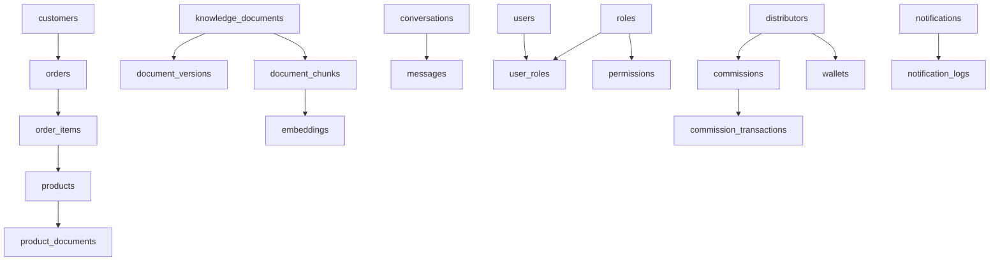

# 03_Database_Design/03_TABLE_CATALOG.md

# Dayjoy Enterprise AI Platform — Logical Table Catalog

> **Purpose:** Define the complete logical table catalog for the Dayjoy Enterprise AI Platform, identifying all logical tables, their business purpose, ownership, relationships, expected growth, usage patterns, AI usage, and security classification.
>
> **Scope:** Logical tables only — no SQL CREATE TABLE statements, database-specific syntax, columns, indexes, or implementation code.
>
> **Audience:** Data architects, solution architects, backend engineers, AI engineers, DevOps, security teams, and business stakeholders.

---

## Table of Contents

1. [Table Catalog Overview](#1-table-catalog-overview)
2. [Master Table Catalog](#2-master-table-catalog)
3. [Table Details](#3-table-details)
4. [Table Classification](#4-table-classification)
5. [Table Relationships](#5-table-relationships)
6. [Data Ownership](#6-data-ownership)
7. [AI Usage](#7-ai-usage)
8. [Lifecycle & Retention](#8-lifecycle--retention)
9. [Security Classification](#9-security-classification)
10. [Future Table Expansion](#10-future-table-expansion)
11. [Architecture Diagrams](#11-architecture-diagrams)

---

## 1. Table Catalog Overview

### 1.1 Purpose of the Table Catalog

The logical table catalog defines **all conceptual tables** needed to implement Dayjoy’s data domains and entities in relational and supporting data stores.[03_Database_Design/00_DATABASE_OVERVIEW.md][03_Database_Design/01_DATA_DOMAINS.md][03_Database_Design/02_ENTITY_MODEL.md]

It helps:

- Align physical storage design with business entities and domains.
- Clarify ownership and responsibilities per data set.
- Guide schema design, API design, and AI/RAG integration.

### 1.2 Relationship Between Entities and Tables

- **Entities** represent business concepts (e.g., `Customer`, `Order`).
- **Tables** are logical storage constructs that persist these entities and their relationships.

An entity may map to one or more tables (e.g., `Customer` → `customers`, `customer_profiles`, `customer_addresses`), and some tables support multiple entities or cross-cutting concerns (e.g., `audit_logs`).

### 1.3 Database Organization Philosophy

- **Domain-Based Grouping:** Tables grouped by domain (Customer, Distributor, Product, Orders, Knowledge, AI, User & Security, Notifications, Analytics, System).
- **Separation of Concerns:** Operational vs. analytical vs. AI vs. configuration data.
- **Normalization:** Logical structures avoid redundancy while supporting performance.
- **Extensibility:** New tables can be added per domain without disrupting others.

### 1.4 Naming Conventions

- Lowercase, snake_case names (e.g., `customers`, `order_items`).
- Domain-specific prefixes when helpful (e.g., `kb_` for knowledge base tables).
- Singular vs. plural: tables generally use plural (e.g., `orders`).

### 1.5 Table Categorization Strategy

Tables categorized by:

- **Domain:** Customer, Distributor, Product, Orders, Knowledge, AI, User & Security, Notifications, Analytics, System.
- **Classification:** Master, Transactional, Reference, AI, Knowledge, Configuration, Security, Audit, Analytics, Operational.

---

## 2. Master Table Catalog

### 2.1 Customer Domain

- `customers`
- `customer_profiles`
- `customer_addresses`

### 2.2 Distributor Domain

- `distributors`
- `distributor_levels`
- `distributor_teams`
- `commissions`
- `commission_transactions`
- `wallets`

### 2.3 Product Domain

- `products`
- `product_categories`
- `product_images`
- `product_documents`
- `product_pricing`

### 2.4 Order Domain

- `orders`
- `order_items`
- `order_status_history`
- `shipments`

### 2.5 Knowledge Domain

- `knowledge_documents`
- `document_versions`
- `document_chunks`
- `embeddings`
- `metadata`

### 2.6 AI Domain

- `conversations`
- `messages`
- `ai_memory`
- `prompts`
- `prompt_versions`
- `agents`
- `tools`
- `tool_executions`
- `ai_feedback`

### 2.7 User & Security Domain

- `users`
- `roles`
- `permissions`
- `user_roles`
- `audit_logs`
- `login_history`

### 2.8 Notification Domain

- `notifications`
- `notification_templates`
- `notification_logs`

### 2.9 Analytics Domain

- `analytics_events`
- `dashboards`
- `reports`

### 2.10 System Domain

- `configurations`
- `feature_flags`
- `workflows`
- `scheduled_jobs`

---

## 3. Table Details

### 3.1 Representative Table Details

Below are representative details; each table should be further elaborated in domain-specific design.

#### Customer Domain

**Table ID:** TBL-CUST-001

**Table Name:** `customers`

**Business Purpose:** Store core customer identity records.

**Parent Domain:** Customer.

**Related Entity:** `Customer` (ENT-CUST-001).

**Business Owner:** CX / Customer Management.

**Primary Users:** CX teams, support, AI agents, analytics.

**Expected Growth Rate:** High (every new customer).

**Update Frequency:** Low–Medium (profile updates).

**Read Frequency:** High (AI, support, services).

**Criticality:** Critical.

---

**Table ID:** TBL-CUST-002

**Table Name:** `customer_profiles`

**Business Purpose:** Store extended profile information (preferences, additional details).

**Parent Domain:** Customer.

**Related Entity:** `Customer`.

**Business Owner:** CX / Customer Management.

**Primary Users:** CX, AI agents.

**Expected Growth Rate:** High.

**Update Frequency:** Medium.

**Read Frequency:** Medium–High.

**Criticality:** High.

---

**Table ID:** TBL-CUST-003

**Table Name:** `customer_addresses`

**Business Purpose:** Store customer addresses.

**Parent Domain:** Customer.

**Related Entity:** `Customer`.

**Business Owner:** CX / Customer Management.

**Primary Users:** CX, Orders, logistics, AI.

**Expected Growth Rate:** High.

**Update Frequency:** Medium.

**Read Frequency:** Medium.

**Criticality:** High.

---

#### Distributor Domain

**Table ID:** TBL-DIST-001

**Table Name:** `distributors`

**Business Purpose:** Store distributor identities and KYC details.

**Parent Domain:** Distributor.

**Related Entity:** `Distributor` (ENT-DIST-001).

**Business Owner:** Distributor Management.

**Primary Users:** Distributor Mgmt, Finance, AI, analytics.

**Expected Growth Rate:** High.

**Update Frequency:** Medium.

**Read Frequency:** High.

**Criticality:** Critical.

---

**Table ID:** TBL-DIST-002

**Table Name:** `distributor_levels`

**Business Purpose:** Store distributor ranks/levels.

**Parent Domain:** Distributor.

**Related Entity:** `Distributor`, `Distributor Team`.

**Business Owner:** Distributor Mgmt.

**Primary Users:** Distributor Mgmt, AI, analytics.

**Expected Growth Rate:** Medium.

**Update Frequency:** Medium.

**Read Frequency:** Medium.

**Criticality:** High.

---

**Table ID:** TBL-DIST-003

**Table Name:** `distributor_teams`

**Business Purpose:** Store team hierarchy and relationships.

**Parent Domain:** Distributor.

**Related Entity:** `Distributor Team`.

**Business Owner:** Distributor Mgmt.

**Primary Users:** Distributor Mgmt, AI, analytics.

**Expected Growth Rate:** High.

**Update Frequency:** Medium.

**Read Frequency:** Medium.

**Criticality:** High.

---

*(Similar details apply for commissions, commission_transactions, wallets, products, orders, etc., in domain-specific documents.)*

---

## 4. Table Classification

### 4.1 Classification Matrix

| Table Name | Domain | Classification | Explanation |
|---|---|---|---|
| `customers` | Customer | Master Data | Core customer identities. |
| `customer_profiles` | Customer | Master/Operational | Extended profiles for operations and AI. |
| `customer_addresses` | Customer | Master/Operational | Addresses for orders and logistics. |
| `distributors` | Distributor | Master Data | Core distributor identities. |
| `distributor_levels` | Distributor | Reference | Rank definitions. |
| `distributor_teams` | Distributor | Operational | Team structure. |
| `commissions` | Distributor | Transactional/Analytical | Commission records. |
| `commission_transactions` | Distributor | Transactional | Detailed commission transactions. |
| `wallets` | Distributor | Operational/Sensitive | Wallet balances. |
| `products` | Product | Master Data | Product catalog. |
| `product_categories` | Product | Reference | Product categories. |
| `product_images` | Product | Operational | Images for products. |
| `product_documents` | Product | Knowledge | Docs linked to products. |
| `product_pricing` | Product | Reference/Transactional | Pricing and BV/PV rules. |
| `orders` | Order | Transactional | Order headers. |
| `order_items` | Order | Transactional | Line items. |
| `order_status_history` | Order | Operational | Status change history. |
| `shipments` | Order | Operational | Shipment records. |
| `knowledge_documents` | Knowledge | Knowledge | Source docs. |
| `document_versions` | Knowledge | Knowledge | Versioned docs. |
| `document_chunks` | Knowledge | AI/Knowledge | RAG chunks. |
| `embeddings` | Knowledge/AI | AI | Vector embeddings. |
| `metadata` | Knowledge | Knowledge | Metadata for docs/chunks. |
| `conversations` | AI | AI/Operational | Conversation sessions. |
| `messages` | AI | AI/Operational | Conversation messages. |
| `ai_memory` | AI | AI | Memory store. |
| `prompts` | AI | Configuration/AI | Prompt definitions. |
| `prompt_versions` | AI | Configuration/AI | Prompt versions. |
| `agents` | AI | Configuration/AI | AI agents configs. |
| `tools` | AI | Configuration/Operational | Tool definitions. |
| `tool_executions` | AI | Operational/Analytics | Tool call logs. |
| `ai_feedback` | AI | AI/Analytics | Feedback on AI responses. |
| `users` | User & Security | Master/Security | User identities. |
| `roles` | User & Security | Security | Role definitions. |
| `permissions` | User & Security | Security | Permission definitions. |
| `user_roles` | User & Security | Security | User-role mapping. |
| `audit_logs` | User & Security | Audit | Audit trails. |
| `login_history` | User & Security | Security/Audit | Login events. |
| `notifications` | Notification | Operational | Notification records. |
| `notification_templates` | Notification | Configuration | Templates. |
| `notification_logs` | Notification | Operational/Audit | Delivery logs. |
| `analytics_events` | Analytics | Analytics | Raw events. |
| `dashboards` | Analytics | Configuration | Dashboard definitions. |
| `reports` | Analytics | Analytics | Report definitions and outputs. |
| `configurations` | System | Configuration | System configuration. |
| `feature_flags` | System | Configuration | Feature toggles. |
| `workflows` | System | Configuration/Operational | Workflow definitions. |
| `scheduled_jobs` | System | Operational | Job schedules. |

---

## 5. Table Relationships

### 5.1 Relationship Examples

- `customers` → `orders`: `orders` reference `customers` as the buyer.
- `orders` → `order_items`: `order_items` reference `orders`.
- `products` → `order_items`: `order_items` reference `products`.
- `products` → `product_documents`: `product_documents` reference `products`.
- `knowledge_documents` → `document_versions`: versions linked to docs.
- `knowledge_documents` → `document_chunks`: chunks linked to docs.
- `document_chunks` → `embeddings`: embeddings linked to chunks.
- `conversations` → `messages`: messages linked to conversations.
- `users` → `user_roles`: mapping between users and roles.
- `roles` → `user_roles`: mapping between roles and users.
- `roles` → `permissions`: role-permission associations.

### 5.2 Logical Table Relationship Matrix (Simplified)

| From Table | To Table | Relationship Type | Description |
|---|---|---|---|
| `customers` | `orders` | One-to-Many | Customer places many orders |
| `orders` | `order_items` | One-to-Many | Order has many items |
| `order_items` | `products` | Many-to-One | Item references product |
| `products` | `product_documents` | One-to-Many | Product has docs |
| `knowledge_documents` | `document_versions` | One-to-Many | Doc has versions |
| `knowledge_documents` | `document_chunks` | One-to-Many | Doc split into chunks |
| `document_chunks` | `embeddings` | One-to-One/Many | Chunk has embeddings |
| `conversations` | `messages` | One-to-Many | Conversation has messages |
| `users` | `user_roles` | One-to-Many | User has role mappings |
| `roles` | `user_roles` | One-to-Many | Role related to many users |
| `roles` | `permissions` | Many-to-Many (via join) | Role has permissions |
| `distributors` | `commissions` | One-to-Many | Distributor has commissions |
| `commissions` | `commission_transactions` | One-to-Many | Commission has transactions |
| `distributors` | `wallets` | One-to-One | Distributor has wallet |
| `notifications` | `notification_logs` | One-to-Many | Notification has logs |

---

## 6. Data Ownership

### 6.1 Data Ownership Matrix (Simplified)

| Table Name | Business Owner | Data Steward | Source of Truth | Read Access | Write Access | Update Responsibility |
|---|---|---|---|---|---|---|
| `customers` | CX / Customer Mgmt | CX Data Steward | Customer DB | CX, Support, AI, Services | CX, Admin, System | CX / System Processes |
| `distributors` | Distributor Mgmt | Distributor Data Steward | Distributor DB | Distributor Mgmt, Finance, AI | Distributor Mgmt, Admin, System | Distributor Mgmt / System |
| `products` | Product Team | Product Data Steward | Product DB | All users, AI, Services | Product Team, Admin | Product Team |
| `orders` | Order Mgmt / Operations | Order Data Steward | Order DB | CX, Distributors, AI, Services | Order Mgmt, System | Order Mgmt / System |
| `knowledge_documents` | Knowledge Team | Knowledge Steward | Knowledge Repo/DB | All users, AI | Knowledge Team | Knowledge Team |
| `document_chunks` | Knowledge Team / AI Team | Knowledge Steward | Knowledge DB | AI, RAG Service | System | System |
| `embeddings` | AI Team | AI Data Steward | Vector DB | AI, RAG Service | System | System |
| `conversations` | AI / CX | AI Data Steward | Conversation DB | Support, AI, Analytics | System | System |
| `ai_memory` | AI Team | AI Data Steward | Memory DB | AI | System | System |
| `users` | Admin / IT | User Data Steward | Auth/User DB | Admin, CX, AI | Admin, System | Admin / System |
| `roles` | Security / IT | Security Steward | AuthZ DB | Admin, Security | Security, Admin | Security |
| `permissions` | Security / IT | Security Steward | AuthZ DB | Security, Admin | Security, Admin | Security |
| `audit_logs` | Security / Compliance | Security Steward | Audit DB | Security, Compliance | System | System |
| `analytics_events` | Analytics Team | Analytics Steward | Analytics DB | Analytics, Mgmt | System | System |
| `configurations` | Admin / IT | Config Steward | Config DB | Admin, DevOps, AI | Admin, System | Admin / DevOps |

---

## 7. AI Usage

### 7.1 AI × Table Usage Matrix (Simplified)

| Table Name | Website AI | WhatsApp AI | Voice AI | Internal AI | Admin AI | Sales AI | Marketing AI | Analytics AI | Knowledge AI |
|---|---|---|---|---|---|---|---|---|---|
| `customers` | Read, Tool | Read, Tool | Read, Tool | Read | Read | Read | Read | Aggregates | Context |
| `distributors` | Read, Tool | Read, Tool | Read, Tool | Read | Read | Read | Read | Aggregates | Context |
| `products` | Read, RAG | Read, RAG | Read, RAG | Read | Read | Recommendations | Content | Aggregates | RAG Source |
| `orders` | Read, Tool | Read, Tool | Read, Tool | Read | Read | Read | Read | Aggregates | Context |
| `order_items` | Read | Read | Read | Read | Read | Read | Read | Aggregates | Context |
| `knowledge_documents` | RAG Source | RAG Source | RAG Source | RAG | RAG | RAG | RAG | Aggregates | Core |
| `document_chunks` | RAG Source | RAG Source | RAG Source | RAG | RAG | RAG | RAG | Aggregates | Core |
| `embeddings` | RAG | RAG | RAG | RAG | RAG | RAG | RAG | Aggregates | Core |
| `conversations` | Read | Read | Read | Read | Read | Read | Read | Aggregates | Context |
| `messages` | Read | Read | Read | Read | Read | Read | Read | Aggregates | Context |
| `ai_memory` | Updates | Updates | Updates | Memory | Memory | Memory | Memory | Aggregates | Context |
| `prompts` | Read | Read | Read | Read | Read/Write | Read | Read | Aggregates | Core |
| `agents` | Read | Read | Read | Read | Read | Read | Read | Aggregates | Context |
| `tools` | Tools | Tools | Tools | Tools | Tools | Tools | Tools | Aggregates | Context |
| `tool_executions` | Aggregates | Aggregates | Aggregates | Aggregates | Aggregates | Aggregates | Aggregates | Core | Context |
| `ai_feedback` | Aggregates | Aggregates | Aggregates | Aggregates | Aggregates | Aggregates | Aggregates | Core | Context |
| `users` | Read, Tool | Read, Tool | Read, Tool | Read | Read | Read | Read | Aggregates | Context |
| `roles` | Read | Read | Read | Read | Read/Write | Read | Read | Aggregates | Context |
| `permissions` | Read | Read | Read | Read | Read/Write | Read | Read | Aggregates | Context |
| `audit_logs` | Read | Read | Read | Read | Read | Read | Read | Core | Context |
| `analytics_events` | Read | Read | Read | Read | Read | Read | Read | Core | Context |
| `notifications` | Tools | Tools | Tools | Tools | Tools | Tools | Tools | Aggregates | Context |
| `notification_templates` | Read | Read | Read | Read | Read | Read | Read | Aggregates | Context |
| `notification_logs` | Aggregates | Aggregates | Aggregates | Aggregates | Aggregates | Aggregates | Aggregates | Core | Context |
| `configurations` | Read | Read | Read | Read | Read/Write | Read | Read | Aggregates | Context |
| `feature_flags` | Read | Read | Read | Read | Read/Write | Read | Read | Aggregates | Context |
| `workflows` | Tools | Tools | Tools | Tools | Tools | Tools | Tools | Aggregates | Context |
| `scheduled_jobs` | Read | Read | Read | Read | Read | Read | Read | Aggregates | Context |

---

## 8. Lifecycle & Retention

### 8.1 Lifecycle & Retention (Examples)

| Table Name | Creation | Active Usage | Archive Policy | Deletion Policy | Recovery Requirements |
|---|---|---|---|---|---|
| `customers` | On registration/import | Ongoing | Archive inactive after X years | Delete per compliance | Recover via backups |
| `orders` | On order placement | Until fulfillment and reporting | Archive after retention (e.g., 7 years) | Delete per compliance | Recover via backups |
| `knowledge_documents` | On document creation | Ongoing | Archive obsolete versions | Delete per governance | Recover via backups |
| `conversations` | On interaction start | For support and analytics | Archive older than X months | Delete per policy | Recover via backups |
| `audit_logs` | On each change | For audit and compliance | Retain long-term (e.g., 7+ years) | No deletion except policy | Recover via backups |
| `analytics_events` | On events | For analytics | Aggregate and compress after X period | Delete raw after aggregated | Recover via backups |
| `configurations` | On config changes | Ongoing | Archive old versions | Delete per policy | Recover via backups |

---

## 9. Security Classification

### 9.1 Security Classification Matrix (Simplified)

| Table Name | Classification | Sensitive | Encryption Requirement | Audit Requirement | Compliance Notes |
|---|---|---|---|---|---|
| `customers` | Confidential | High | Encrypt at rest and in transit | All changes logged | Privacy, data protection |
| `distributors` | Confidential | High | Encrypt at rest and in transit | All changes logged | KYC, data protection |
| `orders` | Confidential | High | Encrypt at rest and in transit | All changes logged | Financial and personal data |
| `payments` | Sensitive | High | Strong encryption | All changes logged | PCI-like practices |
| `commissions` | Sensitive | High | Encrypt at rest | All changes logged | Compensation privacy |
| `wallets` | Sensitive | High | Encrypt at rest | All changes logged | Financial balances |
| `knowledge_documents` | Internal/Public | Medium | Encrypt internal docs | Changes logged | Policy docs may be public |
| `conversations` | Confidential | High | Encrypt at rest | Access logged | Customer/distributor conversations |
| `ai_memory` | Internal | Medium | Encrypt at rest | Access logged | AI context data |
| `users` | Confidential | High | Encrypt at rest | All changes logged | Identity data |
| `roles` | Sensitive | High | Encrypt at rest | Changes logged | Authorization |
| `permissions` | Sensitive | High | Encrypt at rest | Changes logged | Authorization |
| `audit_logs` | Restricted | High | Encrypt at rest | Core audit | Compliance-critical |
| `analytics_events` | Internal | Medium | Encrypt at rest | Changes logged | Aggregate metrics |
| `notifications` | Internal | Medium | Encrypt at rest | Changes logged | Message content |
| `configurations` | Restricted | High | Encrypt at rest | Changes logged | System behavior |
| `feature_flags` | Internal | Medium | Encrypt at rest | Changes logged | Feature control |

---

## 10. Future Table Expansion

### 10.1 Future Tables

| Table Name | Domain | Description | Priority | Business Value |
|---|---|---|---|---|
| `inventory` | Inventory | Stock levels and movements | High | Better supply chain control |
| `suppliers` | Inventory/Supply Chain | Supplier records | Medium | Supplier management |
| `manufacturing_batches` | Manufacturing | Production batch info | Medium | Quality and traceability |
| `hr_employees` | HR | Employee records | Medium | Internal operations |
| `finance_accounts` | Finance | Financial accounts and ledgers | Medium | Financial reporting |
| `intl_settings` | International Operations | Country-specific configs | High | Global expansion |
| `ai_training_data` | AI Learning | Curated training datasets | High | AI improvement |
| `recommendations` | Recommendation Engine | Stored recommendations | High | Personalized experiences |
| `iot_devices` | IoT | Device records | Low | Future IoT integration |

All future tables must align with existing domains, governance, security, and data architecture.

---

## 11. Architecture Diagrams

### 11.1 Logical Table Catalog

```mermaid
flowchart TB
    ROOT[Logical Tables] --> CUST[Customer Domain]
    ROOT --> DIST[Distributor Domain]
    ROOT --> PROD[Product Domain]
    ROOT --> ORD[Order Domain]
    ROOT --> KB[Knowledge Domain]
    ROOT --> AI[AI Domain]
    ROOT --> USERSEC[User & Security]
    ROOT --> NOTIF[Notification Domain]
    ROOT --> ANL[Analytics Domain]
    ROOT --> SYS[System Domain]

    CUST --> customers
    CUST --> customer_profiles
    CUST --> customer_addresses

    DIST --> distributors
    DIST --> distributor_levels
    DIST --> distributor_teams
    DIST --> commissions
    DIST --> commission_transactions
    DIST --> wallets

    PROD --> products
    PROD --> product_categories
    PROD --> product_images
    PROD --> product_documents
    PROD --> product_pricing

    ORD --> orders
    ORD --> order_items
    ORD --> order_status_history
    ORD --> shipments

    KB --> knowledge_documents
    KB --> document_versions
    KB --> document_chunks
    KB --> embeddings
    KB --> metadata

    AI --> conversations
    AI --> messages
    AI --> ai_memory
    AI --> prompts
    AI --> prompt_versions
    AI --> agents
    AI --> tools
    AI --> tool_executions
    AI --> ai_feedback

    USERSEC --> users
    USERSEC --> roles
    USERSEC --> permissions
    USERSEC --> user_roles
    USERSEC --> audit_logs
    USERSEC --> login_history

    NOTIF --> notifications
    NOTIF --> notification_templates
    NOTIF --> notification_logs

    ANL --> analytics_events
    ANL --> dashboards
    ANL --> reports

    SYS --> configurations
    SYS --> feature_flags
    SYS --> workflows
    SYS --> scheduled_jobs
```

### 11.2 Table Relationship Overview

### 11.3 Domain-to-Table Mapping

```mermaid
flowchart TB
    DOM-CUST[Customer Domain] --> customers
    DOM-CUST --> customer_profiles
    DOM-CUST --> customer_addresses

    DOM-DIST[Distributor Domain] --> distributors
    DOM-DIST --> distributor_levels
    DOM-DIST --> distributor_teams
    DOM-DIST --> commissions
    DOM-DIST --> commission_transactions
    DOM-DIST --> wallets

    DOM-PROD[Product Domain] --> products
    DOM-PROD --> product_categories
    DOM-PROD --> product_images
    DOM-PROD --> product_documents
    DOM-PROD --> product_pricing

    DOM-ORD[Order Domain] --> orders
    DOM-ORD --> order_items
    DOM-ORD --> order_status_history
    DOM-ORD --> shipments

    DOM-KB[Knowledge Domain] --> knowledge_documents
    DOM-KB --> document_versions
    DOM-KB --> document_chunks
    DOM-KB --> embeddings
    DOM-KB --> metadata

    DOM-AI[AI Domain] --> conversations
    DOM-AI --> messages
    DOM-AI --> ai_memory
    DOM-AI --> prompts
    DOM-AI --> prompt_versions
    DOM-AI --> agents
    DOM-AI --> tools
    DOM-AI --> tool_executions
    DOM-AI --> ai_feedback

    DOM-USERSEC[User & Security Domain] --> users
    DOM-USERSEC --> roles
    DOM-USERSEC --> permissions
    DOM-USERSEC --> user_roles
    DOM-USERSEC --> audit_logs
    DOM-USERSEC --> login_history

    DOM-NOTIF[Notification Domain] --> notifications
    DOM-NOTIF --> notification_templates
    DOM-NOTIF --> notification_logs

    DOM-ANL[Analytics Domain] --> analytics_events
    DOM-ANL --> dashboards
    DOM-ANL --> reports

    DOM-SYS[System Domain] --> configurations
    DOM-SYS --> feature_flags
    DOM-SYS --> workflows
    DOM-SYS --> scheduled_jobs
```

### 11.4 AI-to-Table Interaction

```mermaid
flowchart TB
    WEB_AI[Website AI] --> customers
    WEB_AI --> orders
    WEB_AI --> products

    WA_AI[WhatsApp AI] --> customers
    WA_AI --> distributors
    WA_AI --> orders

    VOICE_AI[Voice AI] --> customers
    VOICE_AI --> distributors
    VOICE_AI --> orders

    INT_AI[Internal AI] --> analytics_events
    INT_AI --> dashboards
    INT_AI --> reports

    ADMIN_AI[Admin AI] --> configurations
    ADMIN_AI --> feature_flags
    ADMIN_AI --> users
    ADMIN_AI --> roles

    KAI[Knowledge AI] --> knowledge_documents
    KAI --> document_chunks
    KAI --> embeddings

    SAI[Sales AI] --> products
    SAI --> commissions

    MKT_AI[Marketing AI] --> product_documents
    MKT_AI --> campaigns

    ANL_AI[Analytics AI] --> analytics_events
    ANL_AI --> dashboards
    ANL_AI --> reports
```

### 11.5 Table Classification Hierarchy

```mermaid
flowchart TB
    ROOT[Table Classifications] --> MASTER[Master Data]
    ROOT --> TRANS[Transactional]
    ROOT --> REF[Reference]
    ROOT --> AI_CLASS[AI]
    ROOT --> KNOW[Knowledge]
    ROOT --> CONF[Configuration]
    ROOT --> SEC[Security]
    ROOT --> AUD[Audit]
    ROOT --> ANALYTICS[Analytics]
    ROOT --> OPS[Operational]

    MASTER --> customers
    MASTER --> distributors
    MASTER --> products

    TRANS --> orders
    TRANS --> order_items
    TRANS --> payments
    TRANS --> commission_transactions

    REF --> product_categories
    REF --> distributor_levels

    AI_CLASS --> ai_memory
    AI_CLASS --> embeddings
    AI_CLASS --> prompts

    KNOW --> knowledge_documents
    KNOW --> document_chunks
    KNOW --> metadata

    CONF --> configurations
    CONF --> feature_flags
    CONF --> agents

    SEC --> users
    SEC --> roles
    SEC --> permissions

    AUD --> audit_logs
    AUD --> login_history

    ANALYTICS --> analytics_events
    ANALYTICS --> dashboards
    ANALYTICS --> reports

    OPS --> notifications
    OPS --> notification_logs
    OPS --> workflows
    OPS --> scheduled_jobs
```

---

**END OF DOCUMENT**