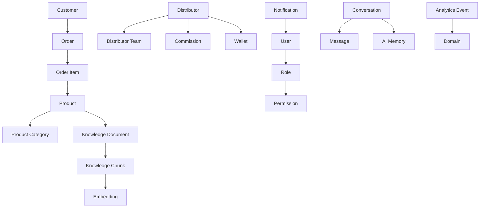
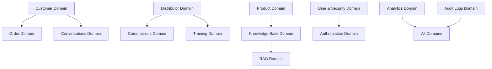
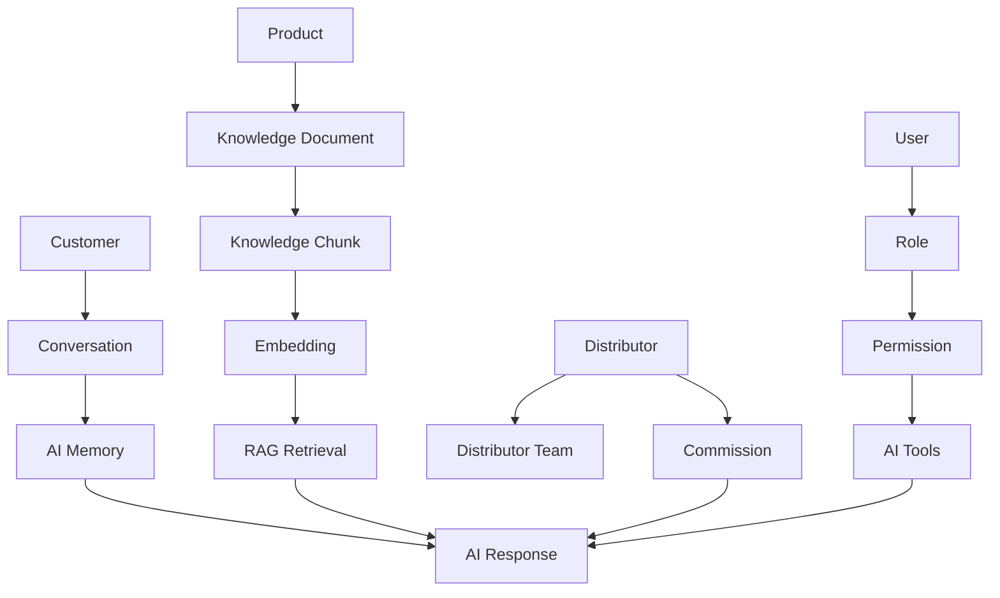
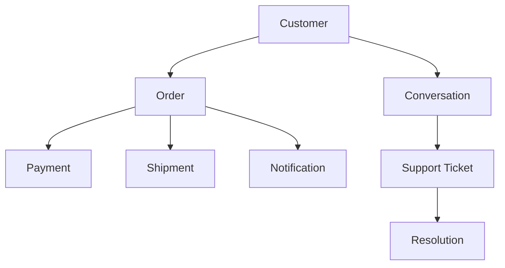
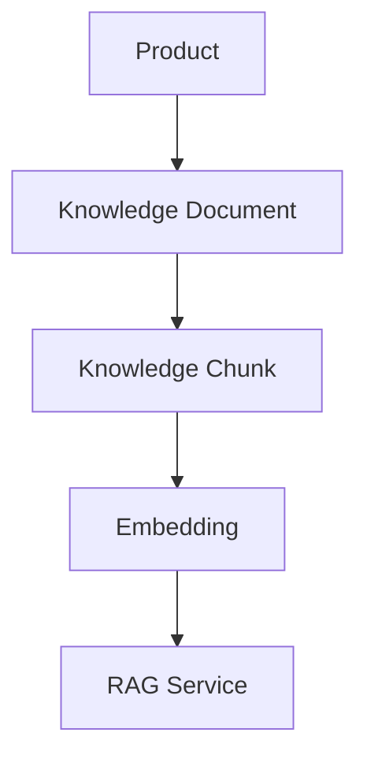
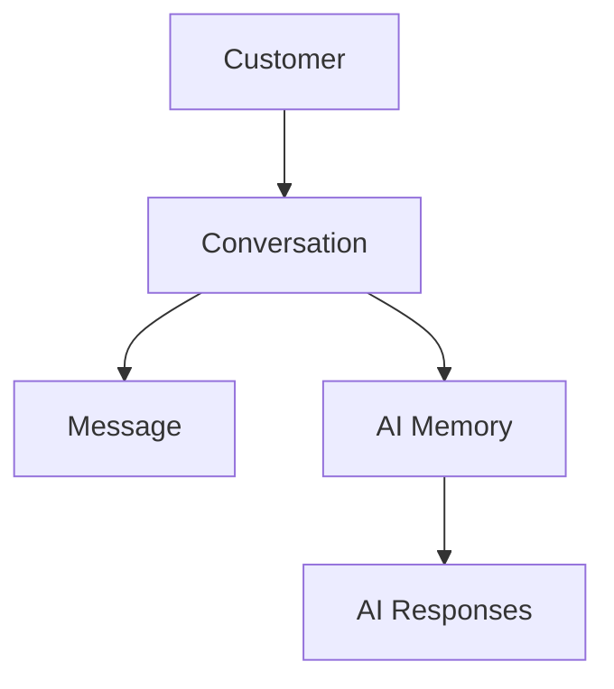
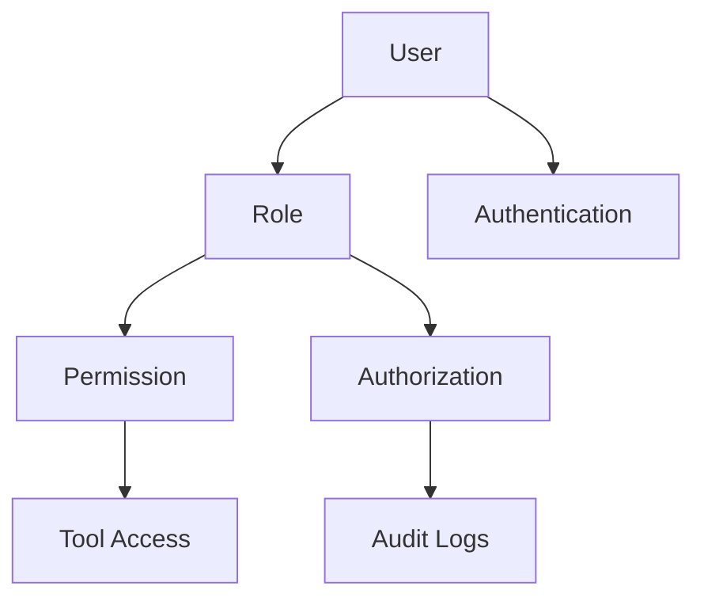

# 03_Database_Design/04_RELATIONSHIP_MODEL.md

# Dayjoy Enterprise AI Platform — Relationship Model

> **Purpose:** Define the complete logical relationship model for the Dayjoy Enterprise AI Platform by documenting how business entities and logical tables are interconnected, including business relationships, data dependencies, cardinality, ownership, lifecycle dependencies, and AI interaction paths.
>
> **Scope:** Logical relationships only — no SQL foreign keys, database constraints, or implementation code.
>
> **Audience:** Data architects, solution architects, backend engineers, AI engineers, DevOps, security teams, product owners, business stakeholders, and AI assistants.

---

## Table of Contents

1. [Relationship Model Overview](#1-relationship-model-overview)
2. [Relationship Principles](#2-relationship-principles)
3. [Master Relationship Catalog](#3-master-relationship-catalog)
4. [Cardinality Model](#4-cardinality-model)
5. [Relationship Dependency Analysis](#5-relationship-dependency-analysis)
6. [AI Relationship Model](#6-ai-relationship-model)
7. [Data Flow Relationships](#7-data-flow-relationships)
8. [Relationship Governance](#8-relationship-governance)
9. [Relationship Risk Analysis](#9-relationship-risk-analysis)
10. [Future Relationship Expansion](#10-future-relationship-expansion)
11. [Architecture Diagrams](#11-architecture-diagrams)

---

## 1. Relationship Model Overview

### 1.1 Purpose of Relationship Modeling

Relationship modeling defines **how business entities and data structures relate to each other** conceptually (e.g., `Customer` → `Order`, `Product` → `Knowledge Document`).[03_Database_Design/02_ENTITY_MODEL.md][03_Database_Design/03_TABLE_CATALOG.md]

It helps:

- Understand data dependencies and business flows.
- Guide database design, API design, and AI tool integration.
- Ensure data consistency and integrity across the platform.

### 1.2 Importance of Data Relationships

- **Business Consistency:** Relationships reflect real-world connections (customer orders, distributor teams).
- **Operational Flows:** Workflows depend on related data (order status, commissions).
- **AI Reasoning:** AI navigates relationships for context (customer → conversations → memory).[02_System_Architecture/03_AI_ARCHITECTURE.md]
- **RAG:** Knowledge relationships (doc → chunk → embedding) support retrieval.[02_System_Architecture/04_RAG_ARCHITECTURE.md]
- **Analytics:** Metrics depend on relationships (orders per customer, commissions per distributor).[02_System_Architecture/13_MONITORING_ARCHITECTURE.md]

### 1.3 Logical Relationships vs. Physical Foreign Keys

- **Logical Relationships:** Conceptual links between entities and tables, defined by business rules (e.g., `Customer` has many `Order`).
- **Physical Foreign Keys:** Database-level constraints implementing relationships.

This document focuses on **logical relationships**, independent of specific database implementations.

---

## 2. Relationship Principles

### 2.1 Principle Catalog

| Principle ID | Principle Name | Description | Why Important |
|---|---|---|---|
| REL-PR-001 | One Source of Truth | Each relationship is anchored in a single authoritative domain. | Prevents conflicting relationships and ambiguity. |
| REL-PR-002 | Loose Coupling | Relationships designed to minimize tight cross-domain dependencies. | Improves scalability, maintainability, and flexibility. |
| REL-PR-003 | Referential Integrity | Relationships must reflect valid references (no orphan records conceptually). | Ensures data consistency and trust. |
| REL-PR-004 | Data Consistency | Relationships must not contradict business rules. | Maintains accurate business state and AI reasoning. |
| REL-PR-005 | Domain Ownership | Each relationship belongs to clear domain owners. | Clarifies responsibility and governance. |
| REL-PR-006 | Scalability | Relationships designed to support high volume and growth. | Avoids bottlenecks and performance issues. |
| REL-PR-007 | AI-Friendly Design | Relationships modeled to support AI traversal and RAG. | Enables rich context and accurate AI responses. |
| REL-PR-008 | Auditability | Relationship changes tracked for audit. | Supports compliance and root-cause analysis. |

---

## 3. Master Relationship Catalog

### 3.1 Relationship Catalog Table

| Relationship ID | Source Entity | Target Entity | Business Purpose | Relationship Type | Business Rules | Owner |
|---|---|---|---|---|---|---|
| REL-CUST-ORD-001 | Customer | Order | Link customers to their orders | One-to-Many | A customer can place many orders; each order belongs to one customer. | CX / Order Mgmt |
| REL-CUST-CONV-001 | Customer | Conversation | Link customers to conversations | One-to-Many | A customer can have many conversations; each conversation belongs to one customer context. | CX / AI Team |
| REL-DIST-DTEAM-001 | Distributor | Distributor Team | Represent distributor downline structure | One-to-Many | A distributor can lead many team members; team structure must follow business rules. | Distributor Mgmt |
| REL-DIST-COMM-001 | Distributor | Commission | Link distributor to commission records | One-to-Many | A distributor can have many commissions; each commission belongs to one distributor. | Finance / Distributor Mgmt |
| REL-PROD-PCAT-001 | Product | Product Category | Link products to categories | Many-to-One | Each product belongs to one category; categories group products. | Product Team |
| REL-PROD-KDOC-001 | Product | Knowledge Document | Link products to docs | One-to-Many | A product can have many docs (policies, guides); docs reference products. | Knowledge Team / Product Team |
| REL-KDOC-KCHUNK-001 | Knowledge Document | Knowledge Chunk | Represent doc chunking | One-to-Many | A document is split into many chunks for RAG retrieval. | Knowledge Team |
| REL-KCHUNK-EMB-001 | Knowledge Chunk | Embedding | Represent semantic embedding | One-to-One/Many | Each chunk has one or more embeddings; embeddings must reference valid chunks. | AI Team |
| REL-CONV-MSG-001 | Conversation | Message | Represent conversation messages | One-to-Many | A conversation has many messages; messages belong to one conversation. | AI Team / CX |
| REL-CONV-AIMEM-001 | Conversation | AI Memory | Link conversations to memory | Many-to-One | Many conversations may use a shared memory record; memory updated per conversation. | AI Team |
| REL-AGENT-TOOL-001 | AI Agent | Tool | Link agents to tools they can call | Many-to-Many | Agents can call multiple tools; tools can be used by multiple agents. | AI Team / Engineering |
| REL-USER-ROLE-001 | User | Role | Link users to roles | Many-to-Many | Users can have multiple roles; roles can apply to many users. | Security / IT |
| REL-ROLE-PERM-001 | Role | Permission | Link roles to permissions | Many-to-Many | Roles group permissions; permissions reused across roles. | Security / IT |
| REL-NOTIF-USER-001 | Notification | User | Link notifications to recipients | Many-to-One | Many notifications can be sent to a user; each notification targets one user or channel. | Operations / CX |
| REL-ANLEVT-DOM-001 | Analytics Event | Domain (logical) | Link events to domains | Many-to-One | Analytics events tagged with domain (orders, distributors, AI). | Analytics Team |

---

## 4. Cardinality Model

### 4.1 Cardinality Definitions

- **One-to-One:** Each source references at most one target, and vice versa.
- **One-to-Many:** One source references many targets; each target references one source.
- **Many-to-One:** Many sources reference one target.
- **Many-to-Many:** Many sources reference many targets via join/mapping structures.

### 4.2 Cardinality Matrix (Simplified)

| Relationship ID | Source Entity | Target Entity | Cardinality | Business Justification |
|---|---|---|---|---|
| REL-CUST-ORD-001 | Customer | Order | One-to-Many | Customers can place multiple orders over time. |
| REL-CUST-CONV-001 | Customer | Conversation | One-to-Many | Customers can have multiple conversations (support, AI). |
| REL-DIST-DTEAM-001 | Distributor | Distributor Team | One-to-Many | Distributors can lead multiple downline members. |
| REL-DIST-COMM-001 | Distributor | Commission | One-to-Many | Distributors receive multiple commissions per period. |
| REL-PROD-PCAT-001 | Product | Product Category | Many-to-One | Each product belongs to one category for reporting and search. |
| REL-PROD-KDOC-001 | Product | Knowledge Document | One-to-Many | Products can have multiple docs (guides, FAQs). |
| REL-KDOC-KCHUNK-001 | Knowledge Document | Knowledge Chunk | One-to-Many | Docs split into multiple chunks to support RAG. |
| REL-KCHUNK-EMB-001 | Knowledge Chunk | Embedding | One-to-One/Many | Each chunk must have at least one embedding. |
| REL-CONV-MSG-001 | Conversation | Message | One-to-Many | Conversations consist of multiple messages. |
| REL-CONV-AIMEM-001 | Conversation | AI Memory | Many-to-One | Many conversations can share memory per user/session. |
| REL-AGENT-TOOL-001 | AI Agent | Tool | Many-to-Many | Agents can call multiple tools; tools can be reused across agents. |
| REL-USER-ROLE-001 | User | Role | Many-to-Many | Users can have multiple roles; roles can apply to many users. |
| REL-ROLE-PERM-001 | Role | Permission | Many-to-Many | Roles group multiple permissions; permissions can belong to multiple roles. |
| REL-NOTIF-USER-001 | Notification | User | Many-to-One | Many notifications can be sent to one user. |

---

## 5. Relationship Dependency Analysis

### 5.1 Parent and Child Relationships

- **Parent Entities:**
  - `Customer`, `Distributor`, `Product`, `Knowledge Document`, `User`.
- **Child Entities:**
  - `Order`, `Order Item`, `Commission`, `Wallet`, `Knowledge Chunk`, `Embedding`, `Conversation`, `Message`, `Notification`.

### 5.2 Independent vs. Dependent Entities

- **Independent Entities:**
  - `Customer`, `Distributor`, `Product`, `User`, `Role`, `Permission`, `AI Agent`, `Policy`.
- **Dependent Entities:**
  - `Order` (depends on Customer, Product),
  - `Commission` (depends on Distributor and Orders),
  - `Knowledge Chunk` (depends on Knowledge Document),
  - `Embedding` (depends on Knowledge Chunk),
  - `Conversation` (depends on Customer/Distributor context),
  - `Message` (depends on Conversation).

### 5.3 Mandatory vs. Optional Relationships

- **Mandatory:**
  - `Order` must have a `Customer`.
  - `Order Item` must reference a `Product` and `Order`.
  - `Knowledge Chunk` must reference a `Knowledge Document`.
  - `Embedding` must reference a `Knowledge Chunk`.

- **Optional:**
  - `Conversation` may have a link to `Support Ticket`.
  - `Product` may have related `Knowledge Document` (early MVP may use fewer docs).
  - `Distributor` may have an associated `Wallet` or `Commission` records depending on activity.

### 5.4 Critical Dependencies

- **Customer–Order–Payment:** Critical for revenue recognition.
- **Distributor–Commission–Wallet:** Critical for distributor trust and payouts.[04_Distributor_System.md]
- **Product–Knowledge Document–Chunk–Embedding:** Critical for AI/RAG quality.
- **User–Role–Permission:** Critical for security and RBAC.[02_System_Architecture/10_SECURITY_ARCHITECTURE.md]

---

## 6. AI Relationship Model

### 6.1 AI Relationship Flows

- **Customer → Conversation → AI Memory:**
  - AI uses customer context to retrieve past conversations and memory to personalize responses.

- **Product → Knowledge → Embedding → RAG:**
  - AI queries products, retrieves linked knowledge docs, chunks, and embeddings via RAG.[02_System_Architecture/04_RAG_ARCHITECTURE.md]

- **Distributor → Team → Commission:**
  - AI explains distributor performance and commissions using team and commission relationships.[04_Distributor_System.md]

- **User → Permissions → AI Tool Access:**
  - AI checks user roles/permissions before executing tools (e.g., refunds, admin actions).[02_System_Architecture/07_AGENT_ARCHITECTURE.md]

### 6.2 AI Relationship Matrix (Simplified)

| AI Flow ID | Source | Path | Destination | Purpose |
|---|---|---|---|---|
| AI-REL-001 | Customer | Customer → Conversation → AI Memory | AI Response | Personalized support and history-based answers. |
| AI-REL-002 | Product | Product → Knowledge Document → Chunk → Embedding → RAG | AI Response | Product info grounded in verified docs. |
| AI-REL-003 | Distributor | Distributor → Distributor Team → Commission | AI Response | Explain team performance and commissions. |
| AI-REL-004 | User | User → Role → Permission → Tool | AI Tool Execution | Ensure authorized tool usage. |
| AI-REL-005 | Conversation | Conversation → Messages → AI Feedback | Analytics | Evaluate AI performance and conversation quality. |

---

## 7. Data Flow Relationships

### 7.1 Voice AI

- **Flow:**
  - Caller → Voice AI → `Customer`/`Distributor` → `Orders` → `Conversations` → `AI Memory` → `Notifications`.

### 7.2 WhatsApp AI

- **Flow:**
  - User → WhatsApp AI → `Customer`/`Distributor` → `Orders`/`Support Ticket` → `Conversations` → `AI Memory` → `Notifications`.

### 7.3 Website AI

- **Flow:**
  - User → Website AI → `Customer`/`Distributor` → `Products`/`Orders` → `Knowledge Document`/RAG → `Conversations` → `AI Memory`.

### 7.4 Admin Dashboard

- **Flow:**
  - Admin → Admin Portal → `User`/`Role`/`Permission` → `System Configuration` → `Audit Log`.

### 7.5 Knowledge Retrieval

- **Flow:**
  - AI Query → `Product`/`Policy`/`FAQ` context → `Knowledge Document` → `Chunk` → `Embedding` → RAG → AI Response.

### 7.6 Analytics

- **Flow:**
  - `Orders`/`Commissions`/`Conversations`/`AI Feedback` → `Analytics Event` → Dashboards/Reports.

### 7.7 Notifications

- **Flow:**
  - Trigger (Order, Support Ticket, Campaign) → `Notification` → `Notification Logs` → User Channel.

---

## 8. Relationship Governance

### 8.1 Governance Framework

For each major relationship:

- **Business Owner:** Domain owner responsible for business correctness.
- **Data Steward:** Ensures relationship data quality and consistency.
- **Validation Rules:** Business rules enforced at application and data levels.
- **Review Frequency:** Regular review (e.g., annually or after major incidents).
- **Change Approval Process:** Relationship changes approved by Architecture Review Board for major changes.[02_System_Architecture/15_ARCHITECTURE_DECISIONS.md]
- **Documentation Requirements:** Relationships documented in entity, table, and domain models.

---

## 9. Relationship Risk Analysis

### 9.1 Key Risks

| Risk ID | Description | Risk Level | Business Impact | Mitigation Strategy |
|---|---|---|---|---|
| REL-RISK-001 | Circular dependencies between entities | Medium | Complex flows, potential deadlocks | Clear domain boundaries, avoid unnecessary cycles |
| REL-RISK-002 | Orphan records (e.g., orders without customers) | High | Data integrity issues, reporting errors | Referential integrity enforcement in applications and DB |
| REL-RISK-003 | Duplicate relationships (e.g., multiple redundant links) | Medium | Confusing and inconsistent data paths | Consolidate and standardize relationships |
| REL-RISK-004 | Broken business flows due to missing links | High | Incomplete processes, failed AI responses | Relationship validation and error monitoring |
| REL-RISK-005 | Data integrity risks across domains (e.g., inconsistent distributor-team links) | High | Incorrect commissions, lost trust | Data validation, domain governance, audits |

---

## 10. Future Relationship Expansion

### 10.1 Future Relationships

| Relationship | Description | Status |
|---|---|---|
| Finance ↔ Orders/Payments | Link finance entities to orders and payments | Future |
| Inventory ↔ Products/Orders | Link inventory to products and order fulfillment | Future |
| Manufacturing ↔ Products/Inventory | Link production batches to products and inventory | Future |
| HR ↔ User/Role | Link employees to system users/roles | Future |
| Supplier ↔ Inventory/Manufacturing | Link suppliers to inventory and manufacturing | Future |
| International Operations ↔ Customer/Distributor/Orders | Country-specific relationships | Future |
| AI Learning Dataset ↔ Conversations/Knowledge | Link AI training data to source entities | Future |
| Recommendation Engine ↔ Customer/Product/Order | Link recommended items and users | Future |

All future relationships must align with existing principles, governance, and security.

---

## 11. Architecture Diagrams

### 11.1 Complete Entity Relationship Diagram (ERD)

### 11.2 Domain Relationship Map

### 11.3 AI Relationship Flow

### 11.4 Customer Journey Relationships

### 11.5 Product Knowledge Relationships

### 11.6 Conversation & Memory Relationships

### 11.7 Security Relationship Model

---

**END OF DOCUMENT**