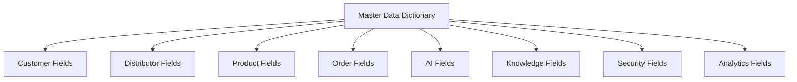
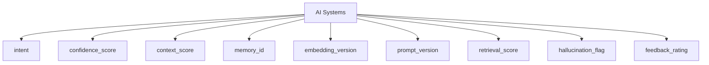
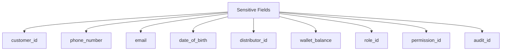
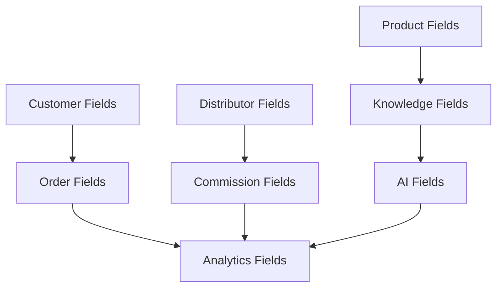

# 03_Database_Design/05_DATA_DICTIONARY.md

# Dayjoy Enterprise AI Platform — Master Data Dictionary

> **Purpose:** Provide the enterprise master data dictionary for the Dayjoy Enterprise AI Platform, documenting standardized field definitions, business meaning, validation rules, ownership, and usage across all domains.
>
> **Scope:** Business-level data dictionary only — no SQL data types, database constraints, or implementation-specific structures.
>
> **Audience:** Data architects, solution architects, backend engineers, AI engineers, DevOps, security teams, product owners, business stakeholders, and AI assistants.

---

## Table of Contents

1. [Data Dictionary Overview](#1-data-dictionary-overview)
2. [Field Naming Standards](#2-field-naming-standards)
3. [Master Field Catalog](#3-master-field-catalog)
4. [Field Definition Template](#4-field-definition-template)
5. [Common Enumerations](#5-common-enumerations)
6. [Sensitive Field Classification](#6-sensitive-field-classification)
7. [AI Data Dictionary](#7-ai-data-dictionary)
8. [Governance](#8-governance)
9. [Future Dictionary Expansion](#9-future-dictionary-expansion)
10. [Architecture Diagrams](#10-architecture-diagrams)

---

## 1. Data Dictionary Overview

### 1.1 Purpose of a Data Dictionary

The data dictionary defines **standardized business fields** used across the Dayjoy Enterprise AI Platform, ensuring a common understanding of data semantics.[03_Database_Design/00_DATABASE_OVERVIEW.md][03_Database_Design/01_DATA_DOMAINS.md]

It helps:

- Align data usage across APIs, AI, RAG, analytics, and databases.
- Reduce ambiguity and duplication in field definitions.
- Enable consistent validation, governance, and documentation.

### 1.2 Importance of Standardized Field Definitions

- **Consistency:** Same field has the same meaning across systems.
- **Governance:** Easier to manage data quality and compliance.
- **AI Accuracy:** Clear semantics improve AI reasoning and RAG mapping.[02_System_Architecture/03_AI_ARCHITECTURE.md][02_System_Architecture/04_RAG_ARCHITECTURE.md]
- **Integration:** Simplifies integration with external systems.

### 1.3 Relationship to APIs, AI, Analytics, RAG, and Database Design

- **APIs:** Field names and semantics drive API request/response bodies.[02_System_Architecture/09_API_ARCHITECTURE.md]
- **AI:** Fields shape AI context, tool arguments, memory, and metrics.[02_System_Architecture/07_AGENT_ARCHITECTURE.md]
- **RAG:** Metadata fields (source, tags, version) support retrieval and ranking.[02_System_Architecture/04_RAG_ARCHITECTURE.md]
- **Analytics:** Event fields (event_id, event_type, session_id) power KPIs.[02_System_Architecture/13_MONITORING_ARCHITECTURE.md]
- **Database Design:** Logical fields inform entity and table design.[03_Database_Design/02_ENTITY_MODEL.md][03_Database_Design/03_TABLE_CATALOG.md]

### 1.4 Naming Philosophy

- **Readable:** Names are descriptive and self-explanatory.
- **Consistent:** Use consistent prefixes/suffixes (e.g., `_id`, `_status`).
- **Domain-Aware:** Names reflect domain context (e.g., `order_status`, `distributor_id`).
- **AI-Friendly:** Names are easy for AI and tools to understand.

---

## 2. Field Naming Standards

### 2.1 IDs

- Convention: `<entity>_id` (e.g., `customer_id`, `order_id`, `distributor_id`).
- Must uniquely identify the entity within its domain.
- Examples:
  - `customer_id`, `distributor_id`, `product_id`, `order_id`, `document_id`.

### 2.2 Names

- Convention: `<entity>_name` (e.g., `customer_name`, `product_name`).
- Represents human-readable names.

### 2.3 Status Fields

- Convention: `<entity>_status` (e.g., `order_status`, `payment_status`, `delivery_status`).
- Use controlled enumerations.

### 2.4 Boolean Fields

- Convention: `is_<condition>` or `<condition>_flag` (e.g., `is_active`, `is_deleted`, `hallucination_flag`).

### 2.5 Dates

- Convention: `<event>_date` (e.g., `order_date`, `joining_date`, `date_of_birth`).

### 2.6 Timestamps

- Convention: `<event>_timestamp` or `<event>_at` (e.g., `created_at`, `updated_at`, `login_time`).

### 2.7 Enumerations

- Convention: Fields ending with `_status`, `_type`, `_level`, `_rank`.
- Values defined in enumeration catalog.

### 2.8 Metadata Fields

- Convention: `source`, `tags`, `version`, `created_by`, `updated_by`.

### 2.9 AI-Related Fields

- Convention:
  - `intent`, `confidence_score`, `context_score`, `memory_id`, `embedding_id`, `prompt_id`, `tool_name`, `response_time`, `retrieval_score`, `hallucination_flag`, `feedback_rating`.

---

## 3. Master Field Catalog

### 3.1 Customer Fields

| Field ID | Field Name | Business Description | Business Purpose | Related Domain | Related Entity |
|---|---|---|---|---|---|
| FLD-CUST-001 | customer_id | Unique identifier for a customer | Identify and link customer records | Customer | Customer |
| FLD-CUST-002 | customer_name | Full name of the customer | Display and personalize interactions | Customer | Customer |
| FLD-CUST-003 | phone_number | Customer phone number | Contact and authentication | Customer | Customer |
| FLD-CUST-004 | email | Customer email address | Contact, login, notifications | Customer | Customer |
| FLD-CUST-005 | date_of_birth | Customer date of birth | Age-related rules and personalization | Customer | Customer |
| FLD-CUST-006 | address | Primary address (line) | Shipping and contact | Customer | Customer |
| FLD-CUST-007 | city | City of residence | Regional reporting and logistics | Customer | Customer |
| FLD-CUST-008 | state | State/region of residence | Regional reporting and compliance | Customer | Customer |
| FLD-CUST-009 | country | Country of residence | International operations and compliance | Customer | Customer |

### 3.2 Distributor Fields

| Field ID | Field Name | Business Description | Business Purpose | Related Domain | Related Entity |
|---|---|---|---|---|---|
| FLD-DIST-001 | distributor_id | Unique identifier for a distributor | Identify and link distributor records | Distributor | Distributor |
| FLD-DIST-002 | sponsor_id | ID of sponsor/upline distributor | Represent hierarchy and team structure | Distributor | Distributor |
| FLD-DIST-003 | rank | Current rank of distributor | Determine benefits and recognition | Distributor | Distributor |
| FLD-DIST-004 | level | Level/depth in hierarchy | Analytics on team structure | Distributor | Distributor Team |
| FLD-DIST-005 | joining_date | Date distributor joined | Tenure, eligibility calculations | Distributor | Distributor |
| FLD-DIST-006 | wallet_balance | Current wallet balance | Display earnings available for payout | Distributor | Wallet |

### 3.3 Product Fields

| Field ID | Field Name | Business Description | Business Purpose | Related Domain | Related Entity |
|---|---|---|---|---|---|
| FLD-PROD-001 | product_id | Unique identifier for a product | Identify and link product records | Products | Product |
| FLD-PROD-002 | product_name | Name of the product | Display in catalog and interactions | Products | Product |
| FLD-PROD-003 | sku | Stock keeping unit | Inventory tracking and logistics | Products | Product |
| FLD-PROD-004 | category | Category of product | Search, filtering, reporting | Products | Product Category |
| FLD-PROD-005 | mrp | Maximum retail price | Price display and compliance | Products | Product |
| FLD-PROD-006 | price | Effective selling price | Revenue calculations and invoices | Products | Product |
| FLD-PROD-007 | stock_status | Availability status | Inform orders and AI recommendations | Products | Product |

### 3.4 Order Fields

| Field ID | Field Name | Business Description | Business Purpose | Related Domain | Related Entity |
|---|---|---|---|---|---|
| FLD-ORD-001 | order_id | Unique identifier for an order | Identify and track order lifecycle | Orders | Order |
| FLD-ORD-002 | order_status | Current status of order | Track progress (placed, shipped, delivered) | Orders | Order |
| FLD-ORD-003 | order_date | Date order was placed | Reporting and timelines | Orders | Order |
| FLD-ORD-004 | payment_status | Current payment status | Track payment (pending, paid, failed) | Orders | Payment |
| FLD-ORD-005 | delivery_status | Current delivery status | Track fulfillment (in transit, delivered) | Orders | Shipment |

### 3.5 AI Fields

| Field ID | Field Name | Business Description | Business Purpose | Related Domain | Related Entity |
|---|---|---|---|---|---|
| FLD-AI-001 | conversation_id | Unique identifier for a conversation | Group messages and context | AI | Conversation |
| FLD-AI-002 | message_id | Unique identifier for a message | Track individual utterances | AI | Message |
| FLD-AI-003 | prompt_id | Unique identifier for a prompt | Manage AI prompt definitions | AI | Prompt |
| FLD-AI-004 | agent_id | Unique identifier for an AI agent | Represent logical AI components | AI | AI Agent |
| FLD-AI-005 | memory_id | Unique identifier for memory record | Link sessions to memory | AI | AI Memory |
| FLD-AI-006 | confidence_score | Confidence level of AI response | Decide clarifications/escalations | AI | AI Response |
| FLD-AI-007 | tool_name | Name of tool/function called by AI | Track tool usage | AI | Tool Execution |
| FLD-AI-008 | response_time | Time taken to respond | Performance monitoring | AI | AI Response |

### 3.6 Knowledge Fields

| Field ID | Field Name | Business Description | Business Purpose | Related Domain | Related Entity |
|---|---|---|---|---|---|
| FLD-KB-001 | document_id | Unique identifier for a knowledge document | Identify knowledge content | Knowledge Base | Knowledge Document |
| FLD-KB-002 | chunk_id | Unique identifier for a document chunk | RAG retrieval unit | Knowledge Base | Knowledge Chunk |
| FLD-KB-003 | embedding_id | Unique identifier for an embedding | Link chunk to embeddings | Knowledge/AI | Embedding |
| FLD-KB-004 | source | Source system or repository | Track origin of knowledge | Knowledge Base | Knowledge Document |
| FLD-KB-005 | tags | Tags/keywords for document/chunk | Filter and search content | Knowledge Base | Knowledge Document/Chunk |
| FLD-KB-006 | version | Version of document or prompt | Manage updates and governance | Knowledge / AI | Knowledge Document/Prompt |

### 3.7 Security Fields

| Field ID | Field Name | Business Description | Business Purpose | Related Domain | Related Entity |
|---|---|---|---|---|---|
| FLD-SEC-001 | role_id | Unique identifier for role | Represent roles in RBAC | Authorization | Role |
| FLD-SEC-002 | permission_id | Unique identifier for permission | Represent fine-grained permissions | Authorization | Permission |
| FLD-SEC-003 | login_time | Timestamp of login | Track login events | Authentication | Login History |
| FLD-SEC-004 | audit_id | Unique identifier for audit event | Track sensitive changes | Audit Logs | Audit Log |

### 3.8 Analytics Fields

| Field ID | Field Name | Business Description | Business Purpose | Related Domain | Related Entity |
|---|---|---|---|---|---|
| FLD-ANL-001 | event_id | Unique identifier for analytics event | Track events for analytics | Analytics | Analytics Event |
| FLD-ANL-002 | event_type | Type/category of event | Segment events (order_placed, ai_response) | Analytics | Analytics Event |
| FLD-ANL-003 | session_id | Unique identifier for user session | Group events per session | Analytics | Analytics Event |

*(Additional fields exist per domain; this catalog shows representative core fields.)*

---

## 4. Field Definition Template

### 4.1 Template

For each field, use the following structure in domain-specific catalogs:

- **Field ID:** Unique identifier for the field.
- **Field Name:** Canonical field name.
- **Business Description:** Human-readable explanation.
- **Business Purpose:** Why the field exists and what it supports.
- **Related Domain:** Data domain (Customer, Distributor, etc.).
- **Related Entity:** Entity to which the field belongs.
- **Example Value:** Example to illustrate usage.
- **Required or Optional:** Business requirement.
- **Validation Rules:** Business and format rules (e.g., must be unique, must be a valid email).
- **Allowed Values (if applicable):** Enumerations or ranges.
- **Default Behavior:** Default value or behavior if not provided.
- **Business Owner:** Domain owner responsible for this field.
- **AI Usage:** How AI uses this field (context, retrieval, tool arg).
- **API Usage:** Where the field appears in APIs.

---

## 5. Common Enumerations

### 5.1 Order Status

Values:

- `PENDING`: Order created but not confirmed.
- `CONFIRMED`: Order confirmed.
- `SHIPPED`: Order shipped.
- `DELIVERED`: Order delivered.
- `CANCELLED`: Order cancelled.
- `RETURN_REQUESTED`: Return requested.
- `RETURNED`: Order returned.

### 5.2 Payment Status

Values:

- `PENDING`: Payment not yet completed.
- `PAID`: Payment completed.
- `FAILED`: Payment failed.
- `REFUNDED`: Amount refunded.

### 5.3 Delivery Status

Values:

- `PENDING`: Delivery not started.
- `IN_TRANSIT`: Order in transit.
- `DELIVERED`: Order delivered.
- `DELAYED`: Delivery delayed.

### 5.4 User Status

Values:

- `ACTIVE`: User can access services.
- `INACTIVE`: User account exists but not active.
- `SUSPENDED`: User temporarily blocked.

### 5.5 Distributor Rank

Values (example):

- `NEW`: Newly joined distributor.
- `BRONZE`, `SILVER`, `GOLD`, `PLATINUM`: Hierarchical ranks.

### 5.6 AI Confidence Level

Values:

- `LOW`: Confidence below threshold.
- `MEDIUM`: Moderate confidence.
- `HIGH`: High confidence.

### 5.7 Notification Status

Values:

- `QUEUED`: Notification queued.
- `SENT`: Notification sent.
- `DELIVERED`: Delivered to user.
- `FAILED`: Delivery failed.

### 5.8 Ticket Status

Values:

- `OPEN`: Ticket created.
- `IN_PROGRESS`: Under investigation.
- `RESOLVED`: Issue resolved.
- `CLOSED`: Ticket closed.
- `ESCALATED`: Escalated to higher support.

### 5.9 Document Status

Values:

- `DRAFT`: Not yet approved.
- `REVIEW`: Under review.
- `APPROVED`: Approved.
- `PUBLISHED`: Available for RAG/AI.
- `ARCHIVED`: No longer active.

---

## 6. Sensitive Field Classification

### 6.1 Sensitive Fields Matrix (Examples)

| Field Name | Sensitivity Level | Encryption Requirement | Masking Requirement | Audit Requirement | Access Restrictions | Retention Requirement |
|---|---|---|---|---|---|---|
| customer_id | High | Encrypt at rest | Mask in non-prod | All changes logged | CX, Support, AI | Retain per policy |
| phone_number | High | Encrypt at rest | Mask in UI logs | Access logged | CX, Support, AI | Retain per policy |
| email | High | Encrypt at rest | Mask in UI/logs | Access logged | CX, Support, AI | Retain per policy |
| date_of_birth | High | Encrypt at rest | Mask where not needed | Access logged | CX, AI | Retain per policy |
| distributor_id | High | Encrypt at rest | Mask in non-prod | All changes logged | Distributor Mgmt, Finance, AI | Retain per policy |
| wallet_balance | High | Encrypt at rest | Mask in UI logs | Changes logged | Finance, Distributor Mgmt | Retain per financial policy |
| payment_status | High | Encrypt at rest | No masking for internal dashboards | Changes logged | Finance, Ops | Retain per financial policy |
| role_id | High | Encrypt at rest | No masking | Changes logged | Admin, Security | Retain per security policy |
| permission_id | High | Encrypt at rest | No masking | Changes logged | Admin, Security | Retain per security policy |
| login_time | Medium | Encrypt logs at rest | No masking | Access logged | Security, Admin | Retain per audit policy |
| audit_id | High | Encrypt at rest | No masking | Core audit | Security, Compliance | Long-term retention |

---

## 7. AI Data Dictionary

### 7.1 AI-Specific Fields

| Field Name | Business Description | Business Purpose | AI Usage |
|---|---|---|---|
| intent | Detected user intent category | Drive AI decision-making and routing | Used to select workflows and tools |
| confidence_score | AI confidence in response or intent | Decide whether to clarify or escalate | Used for thresholds and monitoring |
| context_score | Score indicating relevance of context | Assess quality of retrieved context | Used to adjust retrieval and reasoning |
| memory_weight | Influence of memory vs. current input | Control personalization strength | Used in AI memory algorithms |
| embedding_version | Version of embedding model | Track changes in retrieval quality | Used for RAG metrics and debugging |
| prompt_version | Version of prompt used | Govern AI behavior updates | Used in prompt management and audit |
| retrieval_score | Quality score of retrieved docs/chunks | Evaluate RAG performance | Used for AI evaluation and tuning |
| hallucination_flag | Indicator of suspected hallucination | Flag responses needing review | Used in AI safety and feedback loops |
| feedback_rating | User rating of AI response | Measure satisfaction and guide improvements | Used for AI training and tuning |

### 7.2 How AI Systems Use These Fields

- **Intent:** Drives routing to appropriate agents and tools.[02_System_Architecture/07_AGENT_ARCHITECTURE.md]
- **Confidence Score:** Determines clarifications and escalation.[02_System_Architecture/03_AI_ARCHITECTURE.md]
- **Context Score & Retrieval Score:** Evaluate and tune RAG quality.[02_System_Architecture/04_RAG_ARCHITECTURE.md]
- **Memory Weight & Memory ID:** Govern personalization and continuity.
- **Prompt Version & Embedding Version:** Support governance, rollback, and analysis.
- **Hallucination Flag & Feedback Rating:** Support AI evaluation, safety, and continuous improvement.[02_System_Architecture/13_MONITORING_ARCHITECTURE.md]

---

## 8. Governance

### 8.1 Governance Framework

For each field:

- **Field Ownership:** Domain owner responsible for semantics and usage.
- **Review Frequency:** Regular review (e.g., annually or when domain changes).
- **Version Management:** Versioning for critical fields (especially AI and knowledge-related).
- **Change Approval Process:** Changes to field definitions require approval from domain owner and Architecture Review Board for major changes.[02_System_Architecture/15_ARCHITECTURE_DECISIONS.md]
- **Documentation Standards:** All fields documented in this dictionary and domain-specific docs.
- **Deprecation Policy:** Deprecated fields marked clearly and phased out with migration plans.

---

## 9. Future Dictionary Expansion

### 9.1 Future Field Categories

| Category | Description | Status |
|---|---|---|
| Finance | Fields for financial accounts, ledgers, tax data | Future |
| Inventory | Fields for stock levels, reorder points, locations | Future |
| Manufacturing | Fields for batch IDs, quality metrics, production steps | Future |
| HR | Fields for employee profiles, roles, performance | Future |
| International Business | Fields for country-specific rules (VAT, GST, regional codes) | Future |
| AI Training Data | Fields for labeling, dataset versioning, training metadata | Future |
| IoT Devices | Fields for device IDs, sensor readings, statuses | Future |
| Predictive Analytics | Fields for predictions, confidence, model IDs | Future |

All future fields must align with existing naming standards, governance, and security.

---

## 10. Architecture Diagrams

### 10.1 Data Dictionary Organization

### 10.2 Domain-to-Field Mapping

```mermaid
flowchart TB
    DOM-CUST[Customer Domain] --> customer_id
    DOM-CUST --> customer_name
    DOM-CUST --> phone_number
    DOM-CUST --> email

    DOM-DIST[Distributor Domain] --> distributor_id
    DOM-DIST --> sponsor_id
    DOM-DIST --> rank
    DOM-DIST --> level
    DOM-DIST --> wallet_balance

    DOM-PROD[Product Domain] --> product_id
    DOM-PROD --> product_name
    DOM-PROD --> sku
    DOM-PROD --> category

    DOM-ORD[Orders Domain] --> order_id
    DOM-ORD --> order_status
    DOM-ORD --> order_date
    DOM-ORD --> payment_status

    DOM-AI[AI Domain] --> conversation_id
    DOM-AI --> message_id
    DOM-AI --> prompt_id
    DOM-AI --> agent_id
    DOM-AI --> memory_id

    DOM-KB[Knowledge Domain] --> document_id
    DOM-KB --> chunk_id
    DOM-KB --> embedding_id

    DOM-SEC[Security Domain] --> role_id
    DOM-SEC --> permission_id
    DOM-SEC --> login_time

    DOM-ANL[Analytics Domain] --> event_id
    DOM-ANL --> event_type
    DOM-ANL --> session_id
```

### 10.3 AI Field Usage

### 10.4 Sensitive Data Classification

### 10.5 Business Data Flow

---

**END OF DOCUMENT**