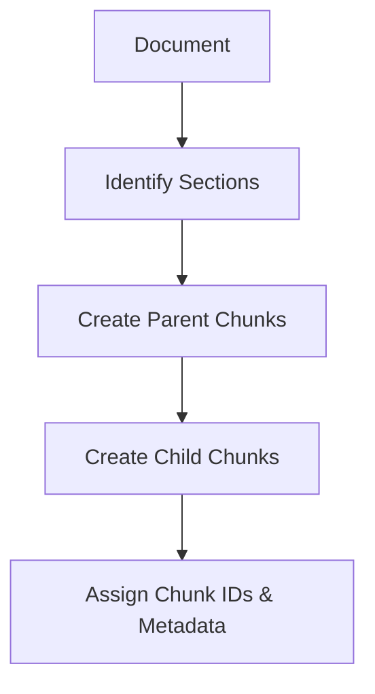
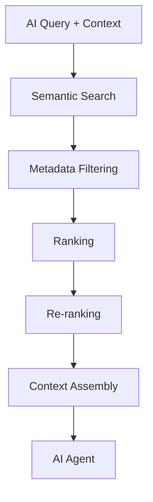
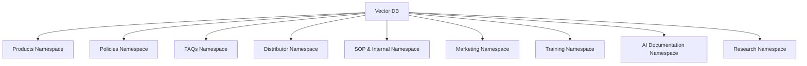
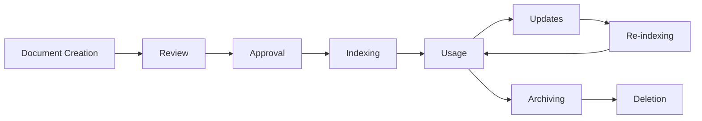
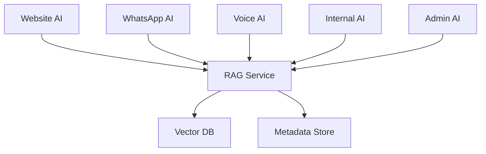

# 03_Database_Design/06_VECTOR_DATABASE_DESIGN.md

# Dayjoy Enterprise AI Platform — Vector Database Design

> **Purpose:** Define the complete vector database architecture for the Dayjoy Enterprise AI Platform, describing how business knowledge is transformed into embeddings, organized, stored, retrieved, maintained, and used by all AI systems.
>
> **Scope:** Logical architecture and governance only — no implementation code, SQL, or vendor-specific configuration.
>
> **Audience:** AI architects, knowledge engineers, data architects, backend engineers, DevOps, security teams, and business stakeholders.

---

## Table of Contents

1. [Vector Database Overview](#1-vector-database-overview)
2. [Knowledge Sources](#2-knowledge-sources)
3. [Document Ingestion Pipeline](#3-document-ingestion-pipeline)
4. [Chunking Strategy](#4-chunking-strategy)
5. [Embedding Strategy](#5-embedding-strategy)
6. [Metadata Design](#6-metadata-design)
7. [Namespace & Collection Strategy](#7-namespace--collection-strategy)
8. [Retrieval Architecture](#8-retrieval-architecture)
9. [Knowledge Lifecycle](#9-knowledge-lifecycle)
10. [Security & Governance](#10-security--governance)
11. [Performance & Scalability](#11-performance--scalability)
12. [Future Vector Database Roadmap](#12-future-vector-database-roadmap)
13. [Architecture Diagrams](#13-architecture-diagrams)

---

## 1. Vector Database Overview

### 1.1 Purpose of a Vector Database

The vector database stores **semantic embeddings** of Dayjoy’s knowledge, enabling AI systems to perform similarity search and retrieve relevant content for RAG (Retrieval-Augmented Generation).[02_System_Architecture/04_RAG_ARCHITECTURE.md]

It powers:

- Dayjoy GPT.
- Website AI Assistant.
- WhatsApp AI Assistant.
- Voice AI Assistant.
- Internal AI Tools.
- Future AI agents.

### 1.2 Why RAG is Required

- **Accuracy:** Ground AI responses in verified Dayjoy knowledge (policies, product docs, distributor rules).[Project_Context/11_DOCUMENTATION_RULES.md]
- **Consistency:** Ensure answers reflect official documents and business decisions.[05_Policies.md][04_Distributor_System.md][03_Product_Research.md]
- **Coverage:** Support multi-domain knowledge across products, distributors, SOPs, and internal processes.

### 1.3 Relationship Between Knowledge Base and AI Systems

- Knowledge Base (KB) stores validated documents and metadata.[02_System_Architecture/04_RAG_ARCHITECTURE.md]
- Vector DB stores embeddings and metadata derived from KB.
- AI systems call RAG Service to query vector DB and retrieve relevant chunks.

### 1.4 Business Objectives

- **Reduce Hallucinations:** Ensure AI uses grounded information.[02_System_Architecture/03_AI_ARCHITECTURE.md]
- **Improve Response Quality:** Provide precise, context-rich answers.
- **Enable Governance:** Track sources, versions, and trust levels.
- **Support Scalability:** Handle growing document sets and domains.

### 1.5 High-Level Architecture

- Knowledge Base → Ingestion Pipeline → Chunking → Embedding → Vector Database → RAG Service → AI Systems.[02_System_Architecture/04_RAG_ARCHITECTURE.md]

---

## 2. Knowledge Sources

### 2.1 Knowledge Source Catalog

| Source ID | Description | Business Owner | Update Frequency | Priority | Trust Level |
|---|---|---|---|---|---|
| KS-PROD-001 | Product Catalogs (structured product info) | Product Team | As products change | High | High (Verified) |
| KS-PROD-002 | Product Brochures and marketing collateral | Marketing / Product | As campaigns/products change | High | Medium–High |
| KS-COMP-001 | Compensation Plans and distributor earnings rules | Legal/Compliance / Distributor Mgmt | Controlled changes | High | Very High (Official) |
| KS-POL-001 | Customer Policies (orders, returns, refunds, shipping) | Legal/Compliance / CX | Controlled policy changes | High | Very High (Official) |
| KS-POL-002 | Distributor Policies and system rules | Legal/Compliance / Distributor Mgmt | Controlled | High | Very High |
| KS-FAQ-001 | FAQs (customer, distributor, support) | CX / Support / Distributor Mgmt | Regular updates | High | High |
| KS-TRAIN-001 | Training Manuals and learning content | Training / Distributor Mgmt | Training cycles | Medium–High | High |
| KS-SOP-001 | SOP Documents (support, operations) | Operations / Support | Process changes | High | High |
| KS-MKT-001 | Marketing Materials (campaign briefs, brand guidelines) | Marketing / Brand | Controlled | Medium | High |
| KS-DIST-001 | Distributor Guides and playbooks | Distributor Mgmt / Training | Regular | High | High |
| KS-WEB-001 | Website Content (help center, product pages) | Web / CX / Marketing | Frequent | Medium | Medium–High |
| KS-INT-001 | Internal Documents (SOPs, playbooks, runbooks) | Operations / IT / Support | As processes evolve | Medium | High |
| KS-RES-001 | Research Reports (product and market research) | Product / Research | As available | Medium | Medium |
| KS-VID-001 | Videos (transcripts of training/marketing) | Training / Marketing | As new videos created | Medium | Medium |
| KS-AUD-001 | Audio (transcripts of calls/trainings) | Support / Training | As recorded | Medium | Medium |
| KS-PDF-001 | PDFs (policies, brochures, guides) | Multiple owners | As updated | High | Varies |
| KS-IMG-001 | Images (OCR for text content) | Marketing / Product | As required | Low–Medium | Medium |
| KS-FUT-001 | Future Documents (new domains, international ops) | TBD | TBD | TBD | TBD |

---

## 3. Document Ingestion Pipeline

### 3.1 Ingestion Workflow Stages

1. **Document Upload:** Documents added from repositories (Git, object storage, CMS).
2. **Validation:** Owners validate content for accuracy and compliance.[Project_Context/11_DOCUMENTATION_RULES.md]
3. **Classification:** Assign domain, category, and type (policy, FAQ, product, SOP).
4. **Metadata Extraction:** Extract titles, product references, tags, source, version.
5. **OCR (if required):** OCR applied to images/PDFs where text is needed.
6. **Cleaning:** Remove noise, duplicates, and irrelevant sections.
7. **Normalization:** Standardize formatting (headings, lists, tables).
8. **Chunk Preparation:** Identify logical sections for chunking.
9. **Embedding Generation:** Compute embeddings for chunks.
10. **Storage:** Store chunks, embeddings, and metadata in vector DB.
11. **Indexing:** Build indices for semantic and metadata search.
12. **Quality Validation:** Evaluate retrieval quality and coverage.

### 3.2 Ingestion Workflow Diagram

```mermaid
flowchart TB
    UPLOAD[Document Upload] --> VALID[Validation]
    VALID --> CLASS[Classification]
    CLASS --> META[Metadata Extraction]
    META --> OCR[OCR (if needed)]
    OCR --> CLEAN[Cleaning]
    CLEAN --> NORM[Normalization]
    NORM --> CHUNK[Chunk Preparation]
    CHUNK --> EMBED[Embedding Generation]
    EMBED --> STORE[Storage in Vector DB]
    STORE --> INDEX[Indexing]
    INDEX --> QUALITY[Quality Validation]
```

---

## 4. Chunking Strategy

### 4.1 Chunking Objectives

- Create **semantically coherent units** of knowledge.
- Support accurate retrieval and efficient context assembly.
- Maintain traceability to original documents.

### 4.2 Chunk Boundaries

- Based on logical sections (headings, sub-headings, paragraphs).
- Avoid splitting sentences or tightly coupled content.

### 4.3 Semantic Chunking

- Group content by topic or question.
- Use headings and semantic cues to define boundaries.

### 4.4 Hierarchical Chunking

- Multi-level chunks:
  - **Parent Chunk:** High-level section (e.g., "Return Policy Overview").
  - **Child Chunks:** Detailed subsections (e.g., "Return Window", "Refund Process", "Exceptions").

### 4.5 Parent-Child Chunk Relationships

- Each child chunk references a parent chunk.
- Parent chunks may aggregate children for high-level responses.

### 4.6 Chunk Size Guidelines

- Target size: 200–500 words per chunk (adjust by document type).
- Avoid overly long chunks that reduce retrieval precision.

### 4.7 Overlap Strategy

- Minimal overlap for context continuity (e.g., last sentence of previous chunk in next chunk).
- Overlap more cautiously for highly interconnected policies.

### 4.8 Version Handling

- Chunks linked to document versions.
- Old chunks archived or marked as superseded.

### 4.9 Chunk Identifiers

- Unique `chunk_id` per chunk.
- Include document ID, section, and version in metadata.

### 4.10 Advantages and Trade-offs

- **Semantic/Hierarchical Chunking Advantages:**
  - Better contextual responses.
  - Easier aggregation of related chunks.

- **Trade-offs:**
  - More complex ingestion and retrieval.
  - Requires robust metadata management.

---

## 5. Embedding Strategy

### 5.1 Embedding Objectives

- Represent chunks as vectors to support semantic similarity search.
- Support multi-domain retrieval (products, policies, SOPs, FAQs).

### 5.2 Embedding Lifecycle

- **Creation:** Embeddings generated during ingestion.
- **Usage:** Used for retrieval and ranking.
- **Update:** Regenerated when content or embedding model changes.

### 5.3 Embedding Versioning

- `embedding_version` recorded in metadata.
- Parallel support for multiple versions if needed (e.g., `v1`, `v2`).

### 5.4 Regeneration Policy

- Regenerate embeddings when:
  - Document content changes.
  - Embedding model is upgraded.

### 5.5 Similarity Search Principles

- Use vector similarity (e.g., cosine or dot-product) to retrieve nearest chunks.
- Combine with metadata filters for domain, product, policy type.

### 5.6 Embedding Quality Validation

- Evaluate retrieval relevance using test queries.
- Track metrics such as retrieval precision, recall, and RAG quality scores.[02_System_Architecture/13_MONITORING_ARCHITECTURE.md]

### 5.7 Multilingual Considerations

- Include `language` metadata for each chunk.
- Use language-aware embedding models and retrieval filters.

---

## 6. Metadata Design

### 6.1 Metadata Catalog

| Metadata Field | Description |
|---|---|
| `document_id` | Unique identifier of the source document |
| `chunk_id` | Unique identifier of the chunk |
| `title` | Title of the document or section |
| `product` | Associated product or product ID (if applicable) |
| `category` | Category (product, policy, SOP, FAQ, training, marketing) |
| `department` | Owning department (Product, CX, Distributor Mgmt, Marketing, AI, Operations) |
| `language` | Language code (`en`, `hi`, etc.) |
| `tags` | Tags/keywords for search and filtering |
| `source` | Source system (Git repo, website, CMS) |
| `version` | Document version (e.g., `1.0.0`) |
| `author` | Author or content owner |
| `approval_status` | Status (`DRAFT`, `REVIEW`, `APPROVED`, `PUBLISHED`, `ARCHIVED`) |
| `created_date` | Document or chunk creation date |
| `updated_date` | Last updated date |
| `expiry_date` | Optional expiry date for time-sensitive content |
| `access_level` | Access level (`Public`, `Customer`, `Distributor`, `Internal`, `Admin`) |
| `trust_level` | Trust indicator (`Official`, `Verified`, `Partially Verified`, `Unknown`) |
| `confidence_score` | Confidence in chunk relevance or retrieval |

---

## 7. Namespace & Collection Strategy

### 7.1 Namespace Catalog

| Namespace ID | Namespace Name | Purpose | Included Documents | Access Rules | AI Consumers |
|---|---|---|---|---|---|
| NS-PROD-001 | Products | Product-specific docs and content | Product docs, brochures, website product pages | Public/Customer/Distributor as per access_level | Website AI, WhatsApp AI, Voice AI, Sales AI |
| NS-POL-001 | Policies | Customer and distributor policies | Policy docs, terms & conditions | Customer/Distributor/Internal/Admin | All AI agents needing policy info |
| NS-FAQ-001 | FAQs | Common questions and answers | Customer and distributor FAQs | Public/Customer/Distributor/Internal | Website AI, WhatsApp AI, Voice AI |
| NS-DIST-001 | Distributor System | Distributor guides and compensation docs | Guides, compensation plans, training content | Distributor/Internal | Distributor Support AI, WhatsApp/Voice AI |
| NS-SOP-001 | SOP & Internal | SOPs, internal runbooks | SOP docs, internal guides | Internal/Admin | Internal AI, Support AI |
| NS-MKT-001 | Marketing | Marketing content and brand guidelines | Campaign briefs, brand rules | Internal | Marketing AI |
| NS-TRAIN-001 | Training | Training materials | Training manuals, video transcripts | Distributor/Internal | Training AI (future), Distributor AI |
| NS-AI-001 | AI Documentation | AI behavior, prompts, guardrails | AI docs, prompt specs | Internal/Admin | Admin AI, AI Governance Tools |
| NS-RES-001 | Research | Product and market research docs | Research reports | Internal | Internal AI, Product AI |

### 7.2 Namespace Rules

- Each namespace has distinct access rules and AI consumers.
- Namespaces can share underlying vector DB, but retrieval filters by namespace + metadata.

---

## 8. Retrieval Architecture

### 8.1 Retrieval Stages

1. **Query Processing:**
   - AI agent sends query with context (intent, domain hints, user role, language).

2. **Semantic Search:**
   - Vector DB performs similarity search on embeddings.

3. **Metadata Filtering:**
   - Apply filters by namespace, category, language, access_level, trust_level.

4. **Ranking:**
   - Rank chunks by similarity, trust_level, freshness, and access.

5. **Re-ranking (Optional):**
   - Further refine ranking using contextual signals (intent, conversation history).

6. **Context Assembly:**
   - Assemble top-N chunks into coherent context.

7. **Response Preparation:**
   - RAG Service returns context to AI agent.

8. **AI Consumption:**
   - AI agent uses context to generate grounded response.

### 8.2 Retrieval Pipeline Diagram

```mermaid
flowchart TB
    Q[AI Query + Context] --> SEM[Semantic Search]
    SEM --> FILTER[Metadata Filtering]
    FILTER --> RANK[Ranking]
    RANK --> RERANK[Re-ranking (optional)]
    RERANK --> CTX[Context Assembly]
    CTX --> AI[AI Agent]
```

---

## 9. Knowledge Lifecycle

### 9.1 Lifecycle Stages

1. **Document Creation:**
   - Content created by domain owners.

2. **Review:**
   - Domain experts review content for accuracy and clarity.

3. **Approval:**
   - Governance approves content (approval_status updated).[Project_Context/11_DOCUMENTATION_RULES.md]

4. **Indexing:**
   - Ingestion pipeline chunks and embeds content.

5. **Updates:**
   - Content updated; version incremented.

6. **Re-indexing:**
   - Chunks and embeddings regenerated.

7. **Archiving:**
   - Obsolete content archived and excluded from default retrieval.

8. **Deletion:**
   - Content removed per governance and compliance.

### 9.2 Ownership and Review Responsibilities

- **Domain Owner:** Responsible for content and lifecycle.
- **Knowledge Team:** Manages ingestion, chunking, and indexing.
- **AI Team:** Oversees embedding models and retrieval quality.
- **Governance Board:** Oversees approval and policy compliance.

---

## 10. Security & Governance

### 10.1 Access Control

- Access controlled via `access_level` and RBAC.
- AI agents must respect access_level when retrieving content.

### 10.2 Namespace Permissions

- Namespaces configured with role-based access.
- E.g., NS-POL-001 accessible to Customer/Distributor/Internal; NS-AI-001 restricted to internal AI governance.

### 10.3 Sensitive Documents

- Tagged with higher `trust_level` and restricted `access_level`.
- E.g., compensation plans, internal SOPs.

### 10.4 Audit Logging

- Log document ingestion, updates, and retrieval events for sensitive content.

### 10.5 Version Control

- Version metadata supports rollback and traceability.

### 10.6 Knowledge Ownership

- Each document linked to `department`, `author`, and `domain owner`.

### 10.7 Review Process

- Regular reviews of content and retrieval quality.

### 10.8 Compliance Requirements

- Policies must comply with legal/regulatory guidelines.
- Access to sensitive docs audited.[02_System_Architecture/10_SECURITY_ARCHITECTURE.md]

---

## 11. Performance & Scalability

### 11.1 Search Performance Goals

- **Retrieval Latency:**
  - Target: < 300–500ms for typical RAG queries.

### 11.2 Collection Growth Strategy

- Support growing document sets across multiple namespaces.
- Periodic analysis of index size and performance.

### 11.3 Index Maintenance

- Regular re-indexing for updated content.
- Removal/archiving of outdated embeddings.

### 11.4 Storage Optimization

- Efficient representation of embeddings and metadata.
- Compression and sharding strategies.

### 11.5 Scalability Planning

- Horizontal scaling of vector DB.
- Partitioning by namespace or domain.

---

## 12. Future Vector Database Roadmap

### 12.1 Future Capabilities

| Capability | Description | Status |
|---|---|---|
| Hybrid Search | Combine semantic and keyword search | Future |
| Knowledge Graph Integration | Link entities and relationships | Future |
| Multi-modal Embeddings | Support text, image, audio, video | Future |
| Image Retrieval | Retrieve images via embeddings | Future |
| Audio Retrieval | Retrieve audio via embeddings | Future |
| Video Retrieval | Retrieve video snippets via embeddings | Future |
| Personalized Retrieval | Tailor results based on user history | Future |
| Federated Knowledge Search | Search across multiple knowledge stores | Future |
| Cross-language Retrieval | Retrieve relevant content across languages | Future |

All future capabilities must integrate with existing governance, security, and performance models.

---

## 13. Architecture Diagrams

### 13.1 Vector Database Architecture

```mermaid
flowchart TB
    subgraph KB
        DOCS[Knowledge Documents]
    end

    subgraph Ingestion
        PIPELINE[Ingestion Pipeline]
        CHUNK[Chunking]
        EMBED[Embedding]
    end

    subgraph VectorDB
        VEC[Vector Database]
        META[Metadata Store]
    end

    subgraph RAG
        RAG[RAG Service]
    end

    subgraph AI
        WEB_AI[Website AI]
        WA_AI[WhatsApp AI]
        VOICE_AI[Voice AI]
        INT_AI[Internal AI]
        ADMIN_AI[Admin AI]
    end

    DOCS --> PIPELINE
    PIPELINE --> CHUNK
    CHUNK --> EMBED
    EMBED --> VEC
    CHUNK --> META

    AI --> RAG
    RAG --> VEC
    RAG --> META
```

### 13.2 Knowledge Ingestion Pipeline

```mermaid
flowchart TB
    UPLOAD[Document Upload] --> VALID[Validation]
    VALID --> CLASS[Classification]
    CLASS --> META[Metadata Extraction]
    META --> OCR[OCR (if needed)]
    OCR --> CLEAN[Cleaning]
    CLEAN --> NORM[Normalization]
    NORM --> CHUNK[Chunk Preparation]
    CHUNK --> EMBED[Embedding Generation]
    EMBED --> STORE[Storage in Vector DB]
    STORE --> INDEX[Indexing]
    INDEX --> QUALITY[Quality Validation]
```

### 13.3 Chunking Workflow



### 13.4 Retrieval Pipeline



### 13.5 Namespace Organization



### 13.6 Knowledge Lifecycle



### 13.7 AI-to-Vector Database Interaction



---

**END OF DOCUMENT**