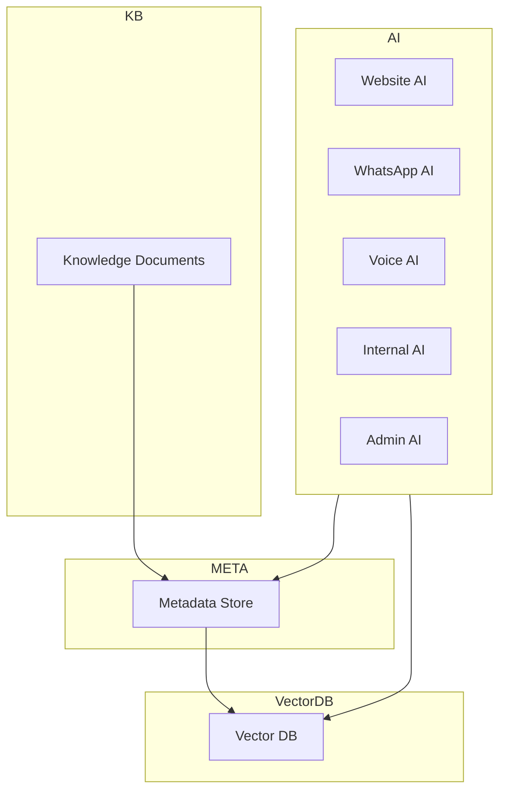
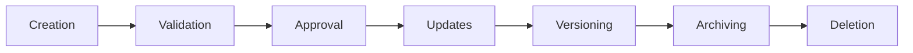
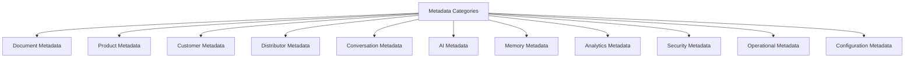
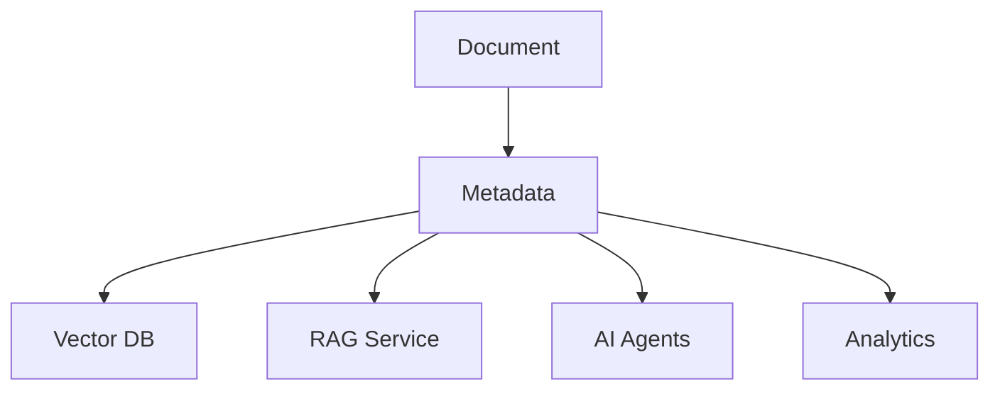
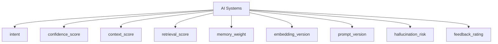
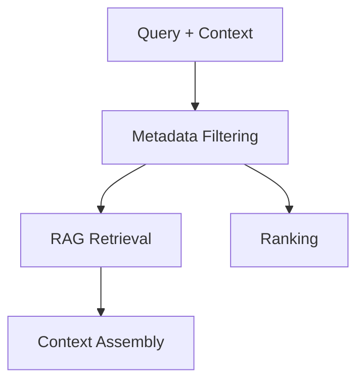

# 03_Database_Design/07_METADATA_SCHEMA.md

# Dayjoy Enterprise AI Platform — Metadata Schema

> **Purpose:** Define the enterprise-wide metadata schema for the Dayjoy Enterprise AI Platform, describing how metadata is structured, standardized, validated, governed, and utilized across RAG, AI memory, Knowledge Base, APIs, analytics, automation, documents, conversations, and system configuration.
>
> **Scope:** Logical metadata architecture only — no SQL schemas, implementation code, or vendor-specific configuration.
>
> **Audience:** Data architects, AI architects, knowledge engineers, backend engineers, DevOps, security teams, product owners, business stakeholders, and AI assistants.

---

## Table of Contents

1. [Metadata Overview](#1-metadata-overview)
2. [Metadata Categories](#2-metadata-categories)
3. [Enterprise Metadata Catalog](#3-enterprise-metadata-catalog)
4. [Metadata Standards](#4-metadata-standards)
5. [Metadata Lifecycle](#5-metadata-lifecycle)
6. [Metadata Usage](#6-metadata-usage)
7. [AI Metadata Model](#7-ai-metadata-model)
8. [Security & Governance](#8-security--governance)
9. [Metadata Quality Framework](#9-metadata-quality-framework)
10. [Future Metadata Roadmap](#10-future-metadata-roadmap)
11. [Architecture Diagrams](#11-architecture-diagrams)

---

## 1. Metadata Overview

### 1.1 Purpose of Metadata

Metadata provides **structured descriptive information** about Dayjoy’s business data and knowledge assets — documents, products, customers, distributors, conversations, AI interactions, configuration entries, and events.[03_Database_Design/00_DATABASE_OVERVIEW.md][03_Database_Design/01_DATA_DOMAINS.md]

It enables:

- Efficient search, filtering, and retrieval.
- Clear ownership and governance.
- Rich AI context and RAG relevance.
- Accurate analytics and reporting.

### 1.2 Business Objectives

- **Findability:** Make relevant information easy to find for AI, users, and analytics.
- **Governance:** Track ownership, access, and lifecycle for all knowledge assets.[02_System_Architecture/10_SECURITY_ARCHITECTURE.md]
- **AI Quality:** Provide AI with rich context (tags, source, version, trust level).
- **Compliance:** Support audit, retention, and access control.

### 1.3 Metadata Design Philosophy

- **Domain-Aware:** Metadata aligns with business domains (Product, Distributor, Policy, SOP, etc.).
- **Standardized:** Common metadata fields reused across domains.
- **Extensible:** New metadata fields can be added for future needs.
- **AI-Centric:** Designed to support RAG, AI memory, and AI evaluation.[02_System_Architecture/03_AI_ARCHITECTURE.md][02_System_Architecture/04_RAG_ARCHITECTURE.md]

### 1.4 Importance for AI and RAG

- **RAG:** Metadata (tags, category, language, access_level, trust_level) guides retrieval, filtering, and ranking.[03_Database_Design/06_VECTOR_DATABASE_DESIGN.md]
- **AI Memory:** Metadata (memory_id, context_score, memory_weight) shapes personalization.
- **AI Evaluation:** Metadata (confidence_score, retrieval_score, feedback_rating) supports monitoring.

### 1.5 Relationship with Knowledge Base and AI Systems

- Knowledge Base stores documents and core metadata.[02_System_Architecture/04_RAG_ARCHITECTURE.md]
- Vector DB stores embeddings and metadata for retrieval.[03_Database_Design/06_VECTOR_DATABASE_DESIGN.md]
- AI agents consume metadata to understand context, constraints, and relevance.

---

## 2. Metadata Categories

### 2.1 Category Catalog

| Category ID | Category Name | Purpose | Scope | Owner | Related Systems |
|---|---|---|---|---|---|
| META-DOC-001 | Document Metadata | Describe documents and content | Knowledge docs, policies, FAQs, SOPs | Knowledge Team | Knowledge Service, RAG, AI Agents |
| META-PROD-001 | Product Metadata | Describe products and catalog structure | Products, categories, relationships | Product Team | Product Service, RAG, Website AI |
| META-CUST-001 | Customer Metadata | Describe customer attributes and segments | Customer profiles, preferences | CX / Customer Mgmt | Customer Service, Analytics, AI |
| META-DIST-001 | Distributor Metadata | Describe distributor attributes and hierarchy | Distributor profiles, ranks, teams | Distributor Mgmt | Distributor Service, Compensation, AI |
| META-CONV-001 | Conversation Metadata | Describe interaction sessions | Conversations, channels, outcomes | AI / CX | AI Agents, Support, Analytics |
| META-AI-001 | AI Metadata | Describe AI operations and evaluations | AI responses, prompts, tools, metrics | AI Team | AI Orchestrator, Monitoring |
| META-MEM-001 | Memory Metadata | Describe AI memory and context | Memory records, weights, scopes | AI Team | Memory Service, AI Agents |
| META-ANL-001 | Analytics Metadata | Describe events and KPIs | Analytics events, dashboards, reports | Analytics Team | Analytics Service, BI |
| META-SEC-001 | Security Metadata | Describe security and access | Roles, permissions, access levels | Security / IT | Auth, RBAC, Audit Logs |
| META-OPS-001 | Operational Metadata | Describe operational states | Workflows, jobs, notifications | Operations / DevOps | Automation Engine, Monitoring |
| META-CONF-001 | Configuration Metadata | Describe configuration items | System and AI configuration | Admin / IT | Config Service, Admin Portal |

---

## 3. Enterprise Metadata Catalog

### 3.1 Core Metadata Fields

| Field Name | Business Description | Business Purpose | Example Value | Validation Rules | Required? | Related Domain | AI Usage |
|---|---|---|---|---|---|---|---|
| metadata_id | Unique identifier for a metadata record | Trace metadata records | `META-12345` | Unique per record | Required | All | Internal reference |
| document_id | Unique ID of source document | Link metadata to document | `DOC-POL-001` | Must reference valid document | Required for doc/chunk | Knowledge | RAG source mapping |
| source | Source system or repository | Trace origin of content | `GitHub`, `Website`, `CMS` | Must be from allowed list | Required | Knowledge, AI | RAG filtering, trust assessment |
| category | High-level category of content | Group docs by type/domain | `policy`, `faq`, `product`, `sop` | Must be from enumeration | Required | Knowledge, Product | Retrieval filtering |
| subcategory | Sub-category or topic | Finer grouping | `returns`, `shipping`, `compensation` | Must be from controlled vocab | Optional | Knowledge | Retrieval refinement |
| department | Owning department | Governance and routing | `CX`, `Product`, `Distributor Mgmt` | Must be from department list | Required | All | Ownership and access control |
| product | Associated product ID/name | Link content to products | `PROD-001`, `Pain Relief Oil` | Must match product catalog | Optional | Product, Knowledge | Product-specific RAG |
| language | Language code | Language-specific retrieval | `en`, `hi` | Must be valid ISO code | Required | Knowledge, AI | Language-aware retrieval |
| country | Country or region | Regional relevance | `IN`, `US` | Must be valid country code | Optional | International ops | Regional filtering |
| audience | Intended audience | Target persona | `customer`, `distributor`, `employee`, `admin` | Must be from enumeration | Required | Knowledge, AI | AI persona alignment |
| author | Author of content | Trace authorship | `Jane Doe` | Non-empty for docs | Required for docs | Knowledge | Governance and review |
| owner | Business owner | Domain-level ownership | `CX`, `Distributor Mgmt` | Must match domain owner | Required | All | Governance, approvals |
| tags | Tags/keywords | Search and filtering | `returns`, `BV`, `training` | Follow tagging standards | Optional | Knowledge, AI, Analytics | Retrieval and analytics |
| keywords | Explicit keywords | Search optimization | `refund`, `delivery` | Controlled vocabulary or free-form | Optional | Knowledge, AI | Search ranking |
| confidence_score | Confidence in relevance | Evaluate retrieval and AI | `0.85` | Range [0,1] | Optional | AI, RAG | Ranking, AI evaluation |
| quality_score | Quality metric for doc/chunk | Content quality assessment | `4.7` (1–5 scale) | Range [1,5] | Optional | Knowledge | Continuous improvement |
| approval_status | Governance status | Track approval workflow | `DRAFT`, `REVIEW`, `APPROVED`, `PUBLISHED`, `ARCHIVED` | Must be from enumeration | Required | Knowledge, Config | RAG eligibility |
| review_status | Last review state | Track review progress | `PENDING`, `IN_REVIEW`, `COMPLETED` | Must be from enumeration | Optional | Knowledge | Governance |
| version | Version identifier | Manage changes over time | `1.0.0` | Semantic versioning | Required | Knowledge, AI | Version control |
| created_at | Creation timestamp | Track creation time | `2026-08-05T10:00:00Z` | Valid timestamp | Required | All | Auditing, freshness |
| updated_at | Last updated timestamp | Track changes | `2026-08-10T15:00:00Z` | Valid timestamp | Optional | All | Auditing, freshness |
| expiry_date | Expiry date for content | Manage time-sensitive docs | `2027-01-01` | Valid date or null | Optional | Policies, campaigns | Retrieval filtering |
| access_level | Access classification | Control content visibility | `Public`, `Customer`, `Distributor`, `Internal`, `Admin` | Must be from enumeration | Required | Security | RBAC + RAG filtering |
| retention_policy | Retention rule | Manage archival/deletion | `7_years`, `indefinite` | Must be from policy list | Optional | Knowledge, Audit | Compliance |
| embedding_version | Embedding model version | Track embedding changes | `v1`, `v2` | Must be from version list | Required for embeddings | AI, RAG | RAG evaluation |
| ai_visibility | AI access scope | Control AI access to content | `all_agents`, `web_only`, `internal_only` | Must be from enumeration | Optional | AI | AI routing and filtering |

---

## 4. Metadata Standards

### 4.1 Naming Conventions

- Use lowercase snake_case (e.g., `document_id`, `approval_status`).
- Metadata fields shared across domains use consistent names.

### 4.2 Versioning

- Use semantic versioning for `version` (e.g., `1.0.0`).
- `embedding_version` and `prompt_version` reflect model and prompt changes.[03_Database_Design/06_VECTOR_DATABASE_DESIGN.md]

### 4.3 Required vs. Optional Metadata

- **Required:** `metadata_id`, `document_id` (for docs/chunks), `category`, `department`, `language`, `owner`, `approval_status`, `access_level`, `version`, `created_at`.
- **Optional:** `subcategory`, `product`, `country`, `tags`, `keywords`, `quality_score`, `expiry_date`, `retention_policy`, `confidence_score`, `ai_visibility`.

### 4.4 Multi-Language Support

- `language` and `country` fields must be maintained.
- Content may have multiple language versions with distinct metadata.

### 4.5 Tagging Standards

- Tags should be:
  - Business-relevant.
  - Consistent across domains.
  - Defined via controlled vocabularies where necessary.

### 4.6 Keyword Strategy

- Keywords focus on search phrases users and AI would use.
- Support synonyms via tag/keyword mapping.

### 4.7 Classification Rules

- `category`, `subcategory`, `audience`, `access_level`, and `trust_level` must follow defined enumerations.

---

## 5. Metadata Lifecycle

### 5.1 Lifecycle Stages

1. **Creation:**
   - Metadata created during document upload or entity creation.

2. **Validation:**
   - Validate required fields and enumerations.

3. **Approval:**
   - `approval_status` and `review_status` updated via governance workflow.[Project_Context/11_DOCUMENTATION_RULES.md]

4. **Updates:**
   - Metadata updated when content or ownership changes.

5. **Versioning:**
   - `version` increments; previous versions retained.

6. **Archiving:**
   - Content marked `ARCHIVED` and excluded from default retrieval.

7. **Deletion:**
   - Metadata and content deleted per retention policy.

### 5.2 Ownership and Responsibilities

- **Domain Owner:** Responsible for metadata correctness and relevance.
- **Data Steward:** Ensures metadata quality and adherence to standards.
- **Knowledge Team / AI Team:** Manage ingestion, embedding, and RAG metadata.

---

## 6. Metadata Usage

### 6.1 Usage Scenarios

- **Semantic Search:**
  - `tags`, `keywords`, `category`, `product`, `language` support search.

- **RAG Retrieval:**
  - `document_id`, `chunk_id`, `category`, `tags`, `trust_level`, `access_level` guide retrieval and filtering.[02_System_Architecture/04_RAG_ARCHITECTURE.md]

- **AI Context Building:**
  - `audience`, `department`, `source`, `version`, `ai_visibility` inform context.

- **Document Filtering:**
  - `category`, `subcategory`, `approval_status`, `expiry_date` filter docs.

- **Access Control:**
  - `access_level` and `department` enforce access rules.[02_System_Architecture/10_SECURITY_ARCHITECTURE.md]

- **Recommendations:**
  - `tags`, `product`, `audience` support recommendation logic.

- **Analytics & Reporting:**
  - `source`, `category`, `department`, `approval_status` support metadata-based reporting.

- **Automation:**
  - `approval_status`, `review_status`, `expiry_date` trigger workflows.

### 6.2 Metadata Usage Matrix (Simplified)

| Metadata Field | Semantic Search | RAG Retrieval | AI Context | Filtering | Access Control | Recommendations | Analytics | Automation |
|---|---|---|---|---|---|---|---|---|
| `document_id` | No | Yes | Yes | Yes | No | No | Yes | No |
| `category` | Yes | Yes | Yes | Yes | No | Yes | Yes | No |
| `subcategory` | Yes | Yes | Yes | Yes | No | Yes | Yes | No |
| `department` | No | Yes | Yes | Yes | Yes | No | Yes | Yes |
| `product` | Yes | Yes | Yes | Yes | No | Yes | Yes | No |
| `language` | Yes | Yes | Yes | Yes | No | No | Yes | No |
| `tags` | Yes | Yes | Yes | Yes | No | Yes | Yes | No |
| `keywords` | Yes | Yes | Yes | Yes | No | Yes | Yes | No |
| `approval_status` | No | Yes | Yes | Yes | No | No | Yes | Yes |
| `trust_level` | No | Yes | Yes | No | No | No | Yes | No |
| `access_level` | No | Yes | Yes | Yes | Yes | No | Yes | No |
| `expiry_date` | No | Yes | Yes | Yes | No | No | Yes | Yes |
| `version` | No | Yes | Yes | Yes | No | No | Yes | No |
| `embedding_version` | No | Yes | Yes | No | No | No | Yes | No |
| `ai_visibility` | No | Yes | Yes | Yes | Yes | No | No | Yes |

---

## 7. AI Metadata Model

### 7.1 AI-Specific Metadata Fields

| Field Name | Business Description | Business Purpose | AI Usage |
|---|---|---|---|
| `prompt_version` | Version of prompt used | Track and govern prompt changes | Analyze behavior and rollback if needed |
| `embedding_version` | Version of embedding model | Track retrieval quality and changes | Compare retrieval performance across versions |
| `context_score` | Score indicating relevance of context | Evaluate assembled context quality | Adjust retrieval and context assembly |
| `retrieval_score` | Quality score of retrieved chunks | Evaluate RAG performance | Improve retrieval strategies |
| `confidence_score` | Confidence in AI response or intent | Decide clarifications/escalations | Apply thresholds and logging |
| `hallucination_risk` | Estimated risk of hallucination | Flag responses needing review | Guide guardrails and human oversight |
| `memory_weight` | Influence of memory vs. current input | Control personalization vs. current query | Tune memory strategies per channel |
| `intent_category` | Categorized intent | Route to appropriate agents/tools | Support analytics and reporting |
| `ai_agent` | Identifier of AI agent | Trace which agent produced response | Support agent-specific monitoring |
| `response_quality` | Measured quality of response | Evaluate AI performance | Use in feedback loops and training |

### 7.2 AI Usage

- AI systems attach AI metadata to interactions, enabling:
  - Per-agent evaluation and tuning.
  - RAG quality monitoring.
  - Safety checks (hallucination_risk).
  - Governance of prompt and embedding updates.[02_System_Architecture/13_MONITORING_ARCHITECTURE.md]

---

## 8. Security & Governance

### 8.1 Metadata Ownership

- Each metadata category has a domain owner (e.g., Knowledge Team for document metadata).

### 8.2 Access Permissions

- Metadata reads/writes governed by RBAC.
- Certain metadata (e.g., `access_level`, `trust_level`) editable only by governance roles.

### 8.3 Sensitive Metadata

- Fields such as `access_level`, `trust_level`, `retention_policy` considered sensitive for governance.

### 8.4 Audit Logging

- Changes to critical metadata fields logged in audit logs.

### 8.5 Change Tracking

- Metadata changes tracked via `version`, `updated_at`, and audit logs.

### 8.6 Review Frequency

- Regular reviews of metadata standards (e.g., annually).

### 8.7 Compliance Requirements

- Metadata must support data privacy, retention, and policy compliance.[02_System_Architecture/10_SECURITY_ARCHITECTURE.md]

---

## 9. Metadata Quality Framework

### 9.1 Quality Metrics

| Metric | Description | Measurement Method | Target | Owner |
|---|---|---|---|---|
| Completeness | % of required metadata fields populated | Check required fields per record | ≥ 95% | Data Stewards |
| Accuracy | Correctness of metadata values | Sample audits, automated checks | ≥ 95% | Domain Owners |
| Consistency | Consistent use of values and enums | Compare across records and domains | ≥ 95% | Data Stewards |
| Freshness | Metadata updated in timely fashion | Age of `updated_at` vs. policy | ≥ 80% within freshness window | Domain Owners |
| Uniqueness | No duplicate metadata IDs or conflicting records | Check uniqueness constraints | 100% unique IDs | Data Architects |
| Traceability | Ability to trace metadata to documents/entities | Check presence of `document_id`, `owner`, `source` | ≥ 95% | Knowledge Team |

---

## 10. Future Metadata Roadmap

### 10.1 Future Capabilities

| Capability | Description | Status |
|---|---|---|
| AI-generated Metadata | Automatically infer tags, categories, quality scores using AI | Future |
| Automatic Tagging | Use AI to generate tags/keywords | Future |
| Knowledge Graph Metadata | Represent relationships in graph form | Future |
| Ontology Support | Use ontologies for domain concepts | Future |
| Semantic Classification | AI-based classification of content | Future |
| Personalized Metadata | Per-user metadata overlays | Future |
| Cross-language Metadata | Link metadata across languages | Future |
| Multi-modal Metadata | Metadata for images, audio, video | Future |

All future capabilities must align with existing governance, security, and performance models.

---

## 11. Architecture Diagrams

### 11.1 Metadata Architecture

### 11.2 Metadata Lifecycle

### 11.3 Metadata Classification

### 11.4 Metadata Flow

### 11.5 AI Metadata Usage

### 11.6 RAG Metadata Filtering

---

**END OF DOCUMENT**