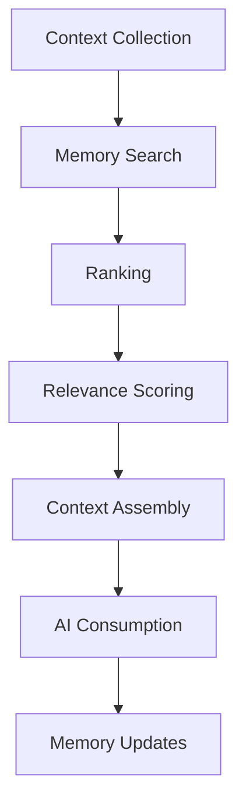
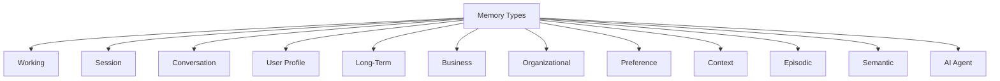
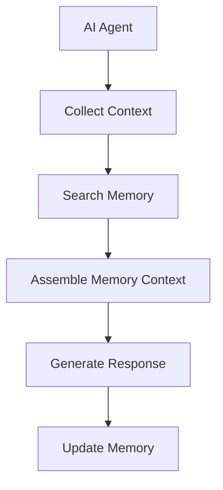
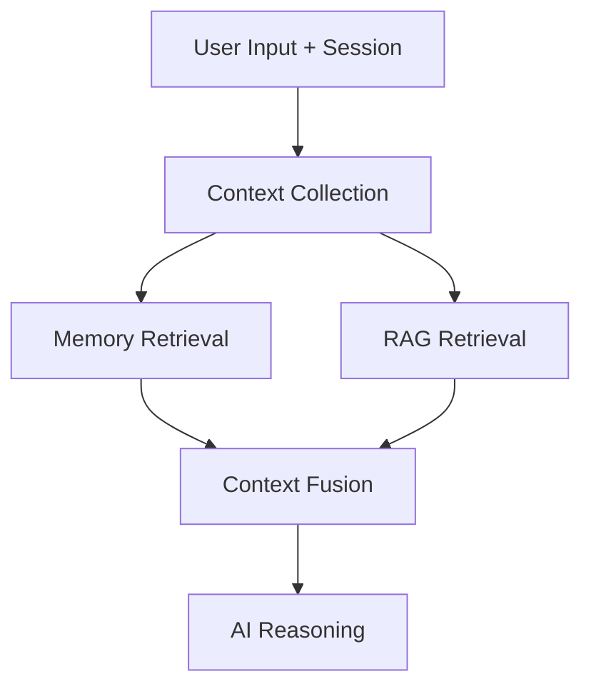
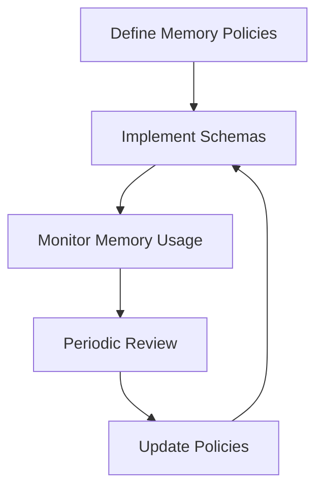

# 03_Database_Design/08_AI_MEMORY_SCHEMA.md

# Dayjoy Enterprise AI Platform — AI Memory Schema & Architecture

> **Purpose:** Define the AI Memory Architecture and logical Memory Schema for the Dayjoy Enterprise AI Platform, covering how AI systems store, organize, retrieve, update, summarize, secure, and manage memory across all interactions.
>
> **Scope:** Logical memory architecture only — no SQL schemas, implementation code, or vendor-specific solutions.
>
> **Audience:** AI architects, knowledge engineers, data architects, backend engineers, DevOps, security teams, product owners, business stakeholders, and AI assistants.

---

## Table of Contents

1. [AI Memory Overview](#1-ai-memory-overview)
2. [Memory Types](#2-memory-types)
3. [Memory Objects](#3-memory-objects)
4. [Memory Lifecycle](#4-memory-lifecycle)
5. [Memory Retrieval Strategy](#5-memory-retrieval-strategy)
6. [Memory Prioritization](#6-memory-prioritization)
7. [Memory Governance](#7-memory-governance)
8. [Security & Privacy](#8-security--privacy)
9. [AI Memory Usage](#9-ai-memory-usage)
10. [Performance & Scalability](#10-performance--scalability)
11. [Future Memory Roadmap](#11-future-memory-roadmap)
12. [Architecture Diagrams](#12-architecture-diagrams)

---

## 1. AI Memory Overview

### 1.1 Purpose of AI Memory

AI memory stores **contextual information** about interactions, preferences, and business state to enable personalized, coherent, and efficient AI behavior across channels.[02_System_Architecture/03_AI_ARCHITECTURE.md][02_System_Architecture/07_AGENT_ARCHITECTURE.md]

Memory enables:

- Personalized responses for customers, distributors, and employees.
- Context continuity across conversations and channels.
- Efficient reuse of past information (summaries, preferences).

### 1.2 Business Objectives

- **Better Experience:** Provide tailored, less repetitive interactions.
- **Distributor & Customer Support:** Remember past issues, preferences, and goals.
- **Operational Efficiency:** Reduce repeated questions and manual lookups.
- **AI Performance:** Improve AI decision-making with rich context.

### 1.3 Memory vs. Knowledge Base

- **Knowledge Base:** Stores static or slowly changing facts and documents (policies, SOPs, product docs).[02_System_Architecture/04_RAG_ARCHITECTURE.md][03_Database_Design/06_VECTOR_DATABASE_DESIGN.md]
- **AI Memory:** Stores dynamic, user- and session-specific information (preferences, summaries, history).

Knowledge answers "**What is true in general?**"; memory answers "**What is true for this user/session/business context right now?**".

### 1.4 Relationship Between RAG and AI Memory

- RAG retrieves **general knowledge**.
- AI memory provides **personal and contextual overlays** (e.g., preferred language, last order summary).
- AI combines RAG context + memory context for grounded and personalized responses.

### 1.5 Memory Design Principles

- **Privacy-First:** Respect user consent and data protection.[02_System_Architecture/10_SECURITY_ARCHITECTURE.md]
- **Minimal & Purposeful:** Store only what is necessary for business value.
- **Scoped & Isolated:** Clear boundaries per user, distributor, agent, and domain.
- **Summarized & Compressed:** Consolidate long histories into manageable summaries.
- **AI-Friendly:** Structured for efficient search, ranking, and context assembly.

---

## 2. Memory Types

### 2.1 Memory Type Catalog

| Memory ID | Memory Type | Description | Business Purpose | Lifetime | Owner | Access Rules | AI Consumers |
|---|---|---|---|---|---|---|---|
| MEM-WORK-001 | Working Memory | Short-lived context within a single turn or small set of turns | Support immediate reasoning and tool calls | Very short (per turn) | AI Team | Internal to AI; no long-term storage | All AI agents |
| MEM-SESSION-001 | Session Memory | Context for a single session across turns | Maintain continuity within a session | Short (session duration) | AI Team | Scoped to session and channel | Website AI, WhatsApp AI, Voice AI, Internal AI |
| MEM-CONV-001 | Conversation Memory | Structured record of past conversations | Provide history and summaries for recurring interactions | Medium (weeks–months) | AI Team / CX | Scoped to user + channel; RBAC enforced | All AI agents, Support AI |
| MEM-UPROF-001 | User Profile Memory | Persistent preferences and attributes | Support personalization and preferences | Long-term (months–years, per policy) | CX / Admin | Scoped to user; consent-based | Website AI, WhatsApp AI, Voice AI, Internal AI |
| MEM-LT-001 | Long-Term Memory | Persistent key facts and summaries | Retain important long-term context | Long-term | AI Team / Business Owners | Scoped to user/distributor; policy-based | All AI agents |
| MEM-BIZ-001 | Business Memory | Summaries of business metrics and states | Support AI explanations (e.g., distributor performance) | Medium–long-term | Distributor Mgmt / Operations | Scoped per business unit; role-based | Distributor Support AI, Internal AI |
| MEM-ORG-001 | Organizational Memory | Shared knowledge about processes and decisions | Support internal AI and admin queries | Long-term | Operations / IT / Management | Internal-only; RBAC enforced | Internal AI, Admin AI |
| MEM-PREF-001 | Preference Memory | Specific user/distributor preferences (language, channel) | Drive personalization and channel choices | Medium–long-term | CX / Distributor Mgmt | Scoped to user/distributor; consent-based | All channel AIs |
| MEM-CTX-001 | Context Memory | Short-term contextual variables (current task, filters) | Support ongoing workflows | Session-level | AI Team | Scoped to workflow; internal to AI | All AI agents |
| MEM-EPI-001 | Episodic Memory | Detailed records of notable episodes (e.g., major complaints) | Support high-impact interactions and escalations | Long-term | Support / CX | Scoped to user; policy-based | Support AI, Internal AI |
| MEM-SEM-001 | Semantic Memory | Generalized conceptual summaries (e.g., "user often asks about returns") | Support pattern recognition and recommendations | Long-term | AI Team / Analytics | Internal to AI; anonymized where needed | All AI agents |
| MEM-AGENT-001 | AI Agent Memory | Per-agent configuration and learned patterns | Support agent-specific behavior and tuning | Long-term | AI Team | Internal to AI; admin-only | All AI agents |

---

## 3. Memory Objects

### 3.1 Memory Object Catalog

| Object Name | Description | Importance | Update Frequency | Expiration Policy | Related Domains |
|---|---|---|---|---|---|
| Customer Preferences | Preferred language, channel, communication style | High | Medium | Expire after X months of inactivity | Customer, Preference Memory |
| Distributor Preferences | Preferred communication, reporting, coaching style | High | Medium | Expire after X months of inactivity | Distributor, Preference Memory |
| Frequently Asked Questions | User-specific frequent topics | Medium | High | Summarize and refresh; expire after X months | Customer, Distributor, AI Memory |
| Purchase History Summary | Summarized past orders and interests | High | Medium | Update on new orders; expire after Y months | Customer, Orders, Business Memory |
| Previous Conversations | References to past interactions | High | High | Summarize older conversations; expire per policy | Conversations, Conversation Memory |
| Product Interests | Preferred product categories and items | High | Medium | Update with user actions; expire after Y months | Products, Preference Memory |
| Language Preference | Preferred language for interactions | High | Low | Persist until changed; no frequent expiry | Customer/Distributor, User Profile Memory |
| Communication Style | Formal/informal tone preference | Medium | Low | Persist until changed | Preference Memory |
| Support History | Summary of past support issues and resolutions | High | Medium | Retain per support policy; archive older details | Support Tickets, Episodic Memory |
| AI Feedback | Explicit feedback on AI responses | High | High | Aggregate and analyze; expiry per analytics policy | AI, Analytics, AI Memory |
| Business Relationships | Key relationships (e.g., spouse distributor, team structure summary) | Medium | Low–Medium | Update when structure changes; expire per policy | Distributor, Business Memory |
| Pending Tasks | Outstanding actions (forms to submit, docs to review) | High | Medium–High | Expire when completed or after timeout | Automation, Workflow Memory |
| User Goals | Long-term goals (e.g., "reach rank Silver", "reduce returns") | High | Low–Medium | Review periodically; expire when achieved or outdated | Distributor, Customer, Long-Term Memory |

---

## 4. Memory Lifecycle

### 4.1 Lifecycle Stages

1. **Memory Creation:**
   - AI creates memory objects from interactions, events, or explicit user input.

2. **Validation:**
   - Validate memory (e.g., confirm preferences, ensure data quality).

3. **Importance Scoring:**
   - Assign importance based on business impact, user relevance, and AI signals.

4. **Storage:**
   - Store memory in appropriate memory type (session, long-term, preference).

5. **Retrieval:**
   - Retrieve memory for context when needed.

6. **Update:**
   - Update memory based on new interactions or corrections.

7. **Consolidation:**
   - Merge similar memory objects (e.g., consolidate purchase history).

8. **Summarization:**
   - Summarize long conversation histories and events.

9. **Expiration:**
   - Mark memory as expired according to policy.

10. **Archiving:**
   - Move expired memory to archive storage.

11. **Deletion:**
   - Delete memory per retention and "right to be forgotten".

### 4.2 Memory Lifecycle Diagram

---

## 5. Memory Retrieval Strategy

### 5.1 Retrieval Stages

1. **Context Collection:**
   - AI gathers current query, session info, user/distributor profile, channel, and intent.

2. **Memory Search:**
   - Search memory store by user/distributor ID, session ID, and relevant object types.

3. **Ranking:**
   - Rank memory objects by recency, frequency, importance score, and context match.

4. **Relevance Scoring:**
   - Compute `context_score` for each memory candidate.

5. **Context Assembly:**
   - Assemble top-N memory items into a structured context (e.g., preferences, last order summary, last conversation summary).

6. **AI Consumption:**
   - AI uses memory context to personalize responses and decisions.

7. **Memory Updates:**
   - Update or create new memory objects after the interaction.

---

## 6. Memory Prioritization

### 6.1 Priority Factors

- **Recency:** More recent memory typically has higher priority.
- **Frequency:** Frequently referenced memory indicates stronger relevance.
- **Business Importance:** Critical business items (support issues, commissions) prioritized.
- **User Preference:** Explicit user-stated preferences prioritized.
- **Conversation Context:** Memory closely related to current intent prioritized.
- **Confidence:** Higher confidence in memory quality (validated vs inferred) prioritized.
- **AI Feedback:** Positive feedback increases priority; negative feedback may decrease.
- **Manual Pinning:** Admins/support can pin important memory items.

### 6.2 Impact on Retrieval

- Priority factors influence ranking and inclusion in context assembly.
- Low-priority memory may be excluded or down-weighted.

---

## 7. Memory Governance

### 7.1 Governance Framework

- **Memory Ownership:**
  - Domain owners (CX, Distributor Mgmt, AI Team) own specific memory types.

- **Update Rules:**
  - Only AI processes or authorized systems may update memory.
  - Some memory (e.g., preferences) may be user-editable.

- **Validation:**
  - Memory objects validated periodically or upon use.

- **Versioning:**
  - Important memory summaries may be versioned.

- **Review Process:**
  - Periodic review of memory usage, quality, and policies.

- **Approval Workflow:**
  - Changes to memory schemas or policies approved by Architecture Review Board.[02_System_Architecture/15_ARCHITECTURE_DECISIONS.md]

- **Memory Quality Standards:**
  - Accuracy, relevance, freshness, and privacy compliance.

---

## 8. Security & Privacy

### 8.1 Access Control

- Memory access governed by RBAC and user context.
- AI agents only access memory relevant to current user/distributor and role.

### 8.2 Memory Isolation

- Per-user and per-distributor memory isolated logically.
- Cross-user aggregation anonymized where needed.

### 8.3 User Consent

- Preferences and long-term memory require user consent per policy.

### 8.4 Sensitive Information Handling

- Sensitive memory (support history, complaints) treated as confidential.

### 8.5 Encryption

- Memory data encrypted at rest and in transit.

### 8.6 Audit Logging

- Memory creation, updates, and deletion logged in audit logs.[02_System_Architecture/10_SECURITY_ARCHITECTURE.md]

### 8.7 Retention Policy

- Memory retention aligned with business and legal requirements.

### 8.8 Right to Delete

- Users may request deletion of memory per privacy and data protection laws.

---

## 9. AI Memory Usage

### 9.1 AI × Memory Usage Matrix (Simplified)

| Memory Type | Dayjoy GPT | Website AI | WhatsApp AI | Voice AI | Internal AI | Admin AI | Future Agents |
|---|---|---|---|---|---|---|---|
| Working Memory | Yes | Yes | Yes | Yes | Yes | Yes | Yes |
| Session Memory | Yes | Yes | Yes | Yes | Yes | Yes | Yes |
| Conversation Memory | Yes | Yes | Yes | Yes | Yes | Yes | Yes |
| User Profile Memory | Yes | Yes | Yes | Yes | Yes | Yes | Yes |
| Long-Term Memory | Yes | Yes | Yes | Yes | Yes | Yes | Yes |
| Business Memory | Yes | Limited | Limited | Limited | Yes | Yes | Yes |
| Organizational Memory | Limited | No | No | No | Yes | Yes | Yes |
| Preference Memory | Yes | Yes | Yes | Yes | Yes | Yes | Yes |
| Context Memory | Yes | Yes | Yes | Yes | Yes | Yes | Yes |
| Episodic Memory | Yes | Limited | Limited | Limited | Yes | Yes | Yes |
| Semantic Memory | Yes | Yes | Yes | Yes | Yes | Yes | Yes |
| AI Agent Memory | Yes | Yes | Yes | Yes | Yes | Yes | Yes |

### 9.2 Usage Examples

- **Personalized Responses:**
  - Preference and profile memory used to choose language, tone, and channel.

- **Context Continuity:**
  - Session and conversation memory used to avoid repeating questions.

- **Distributor Support:**
  - Business and episodic memory used for coaching and support.

- **Customer Support:**
  - Support history and previous conversations used to resolve issues faster.

- **Voice & WhatsApp AI:**
  - Session and preference memory used to adapt flows.

- **Workflow Automation:**
  - Pending tasks stored in memory to trigger reminders and automation.

- **Recommendations:**
  - Product interests and purchase history summaries used for suggestions.

- **Analytics:**
  - Memory usage patterns analyzed for AI improvements.

---

## 10. Performance & Scalability

### 10.1 Retrieval Performance Goals

- Target retrieval latency: < 200–300ms for memory queries.

### 10.2 Memory Size Strategy

- Use summarization to compress long histories.
- Limit per-user memory size according to policy.

### 10.3 Summarization Policy

- Summarize conversations after N messages or after closure of support tickets.
- Summaries include key points, decisions, and actions.

### 10.4 Storage Optimization

- Separate high-frequency session memory from long-term memory.
- Use appropriate storage tiers for hot vs cold memory.

### 10.5 Cleanup Strategy

- Regular cleanup of expired or low-importance memory.

### 10.6 Scalability Planning

- Partition memory by user/distributor ID.
- Horizontally scale memory services.

---

## 11. Future Memory Roadmap

### 11.1 Future Capabilities

| Capability | Description | Status |
|---|---|---|
| Cross-Agent Shared Memory | Shared memory across agents where safe | Future |
| Federated Memory | Memory across multiple systems/platforms | Future |
| Knowledge Graph Memory | Graph-based memory of entities and relations | Future |
| Emotional Context Memory | Capture sentiment and emotional cues | Future |
| Predictive Memory | Store predictions for future behavior | Future |
| Team Memory | Shared memory for teams (e.g., distributor teams) | Future |
| Multi-Modal Memory | Memory for images, audio, and video context | Future |
| Continuous Learning Memory | Memory that drives ongoing AI learning | Future |

All future capabilities must align with privacy, security, and governance requirements.

---

## 12. Architecture Diagrams

### 12.1 AI Memory Architecture

```mermaid
flowchart TB
    subgraph AI
        WEB_AI[Website AI]
        WA_AI[WhatsApp AI]
        VOICE_AI[Voice AI]
        INT_AI[Internal AI]
        ADMIN_AI[Admin AI]
        GPT[Dayjoy GPT]
    end

    subgraph Memory
        WORK[Working Memory]
        SESSION[Session Memory]
        CONV[Conversation Memory]
        UPROF[User Profile Memory]
        LT[Long-Term Memory]
        BIZ[Business Memory]
        ORG[Organizational Memory]
        PREF[Preference Memory]
        CTX[Context Memory]
        EPI[Episodic Memory]
        SEM[Semantic Memory]
        AGMEM[AI Agent Memory]
    end

    WEB_AI --> SESSION
    WEB_AI --> PREF
    WA_AI --> SESSION
    WA_AI --> PREF
    VOICE_AI --> SESSION
    VOICE_AI --> PREF
    GPT --> LT
    GPT --> SEM
    INT_AI --> ORG
    INT_AI --> BIZ
    ADMIN_AI --> AGMEM

    CONV --> LT
    CONV --> EPI
```

### 12.2 Memory Lifecycle

### 12.3 Memory Retrieval Flow

### 12.4 Memory Classification

### 12.5 AI Memory Interaction

### 12.6 Context Assembly Pipeline

### 12.7 Memory Governance Workflow

---

**END OF DOCUMENT**