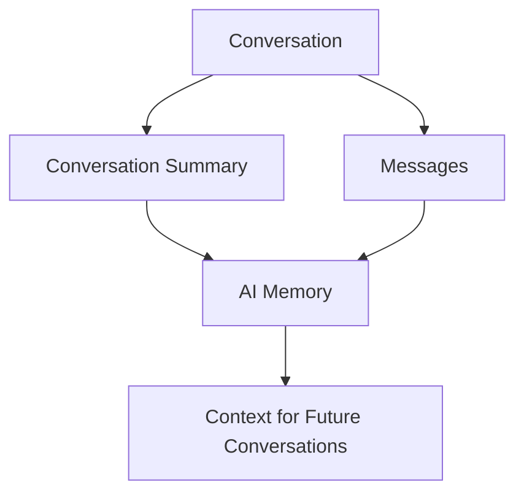
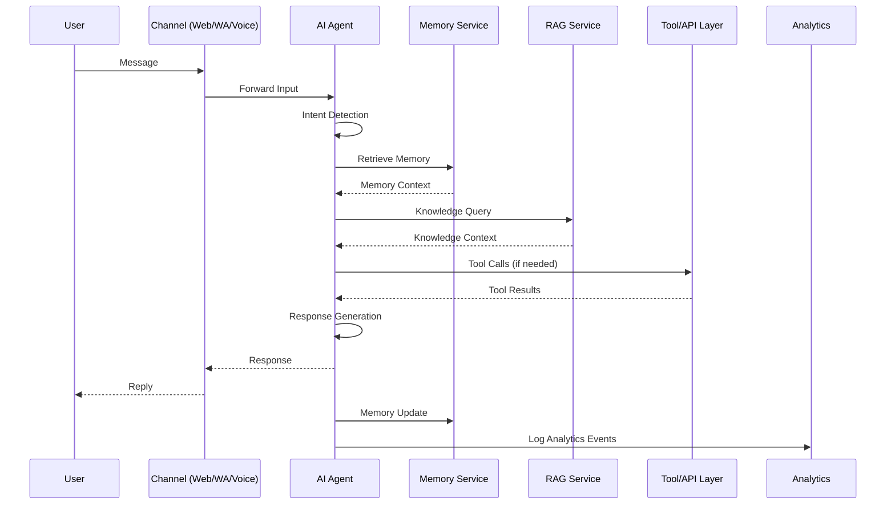
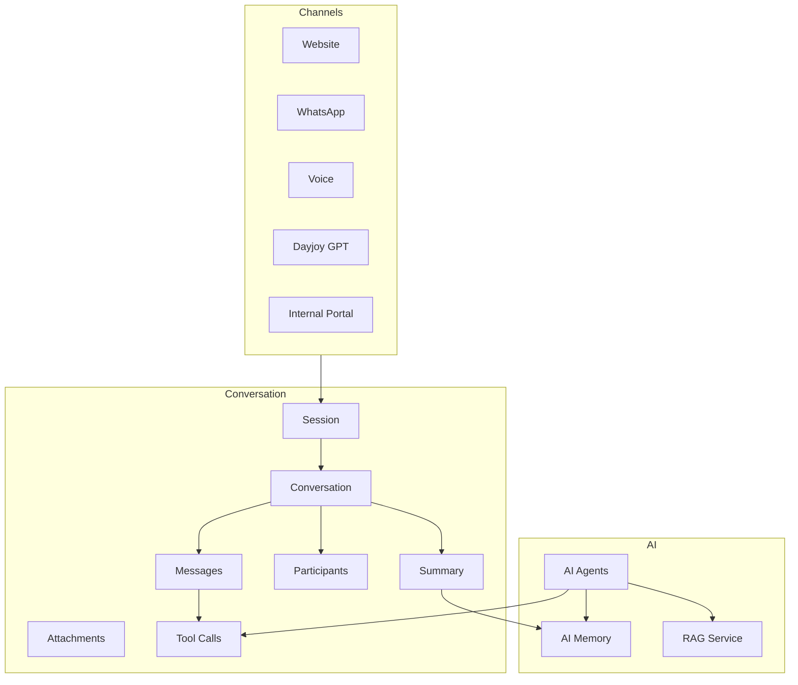
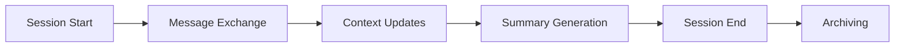
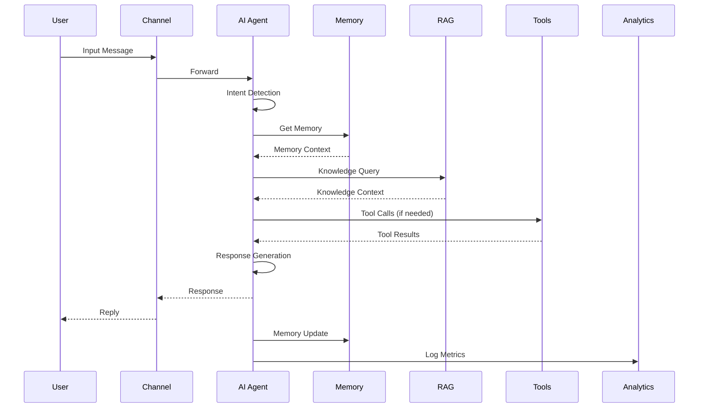
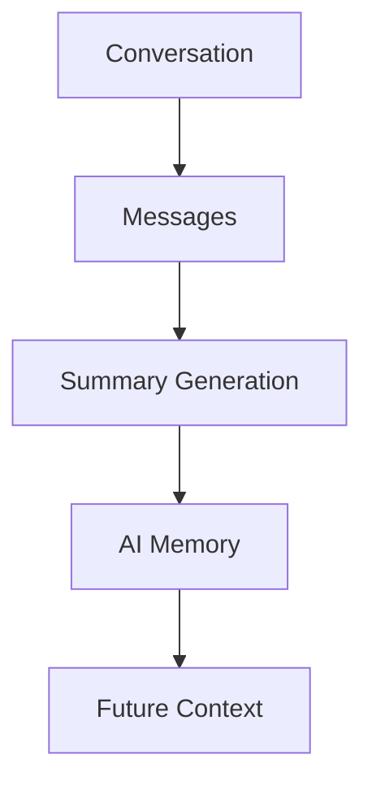
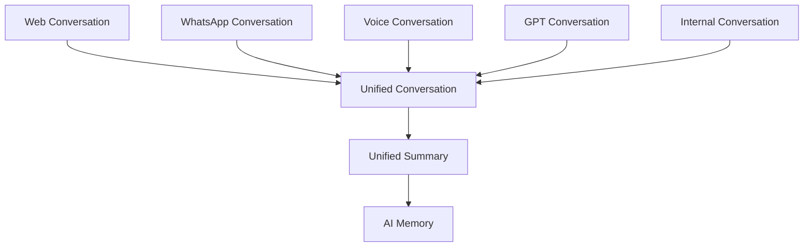
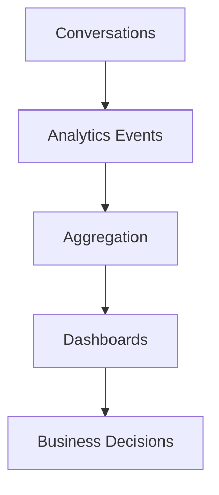

# 03_Database_Design/09_CONVERSATION_SCHEMA.md

# Dayjoy Enterprise AI Platform — Conversation Schema & Architecture

> **Purpose:** Define the complete logical conversation schema and architecture for the Dayjoy Enterprise AI Platform, covering how conversations are created, structured, stored, retrieved, summarized, linked to AI memory, analyzed, and governed across all communication channels.
>
> **Scope:** Logical architecture only — no SQL schemas, implementation code, or vendor-specific solutions.
>
> **Audience:** AI architects, data architects, backend engineers, AI engineers, DevOps, security teams, product owners, business stakeholders, and AI assistants.

---

## Table of Contents

1. [Conversation Overview](#1-conversation-overview)
2. [Conversation Types](#2-conversation-types)
3. [Conversation Structure](#3-conversation-structure)
4. [Conversation Lifecycle](#4-conversation-lifecycle)
5. [Message Model](#5-message-model)
6. [Context & Memory Integration](#6-context--memory-integration)
7. [AI Processing Flow](#7-ai-processing-flow)
8. [Security & Privacy](#8-security--privacy)
9. [Analytics & Monitoring](#9-analytics--monitoring)
10. [Governance](#10-governance)
11. [Future Conversation Roadmap](#11-future-conversation-roadmap)
12. [Architecture Diagrams](#12-architecture-diagrams)

---

## 1. Conversation Overview

### 1.1 Purpose of Conversation Storage

Conversation storage captures **structured interaction history** across Website, WhatsApp, Voice, Dayjoy GPT, internal tools, and future channels.[02_System_Architecture/03_AI_ARCHITECTURE.md][02_System_Architecture/05_VOICE_AI_ARCHITECTURE.md][02_System_Architecture/06_WHATSAPP_AI_ARCHITECTURE.md]

It enables:

- Context continuity for AI agents.
- Support history for customer and distributor support.
- Analysis of AI performance and user satisfaction.
- Compliance and audit of interactions.

### 1.2 Business Objectives

- **Improved Support:** Faster resolution using past conversation context.
- **Personalization:** Tailored responses based on history and preferences.
- **Quality Control:** Monitor AI and human performance.[02_System_Architecture/13_MONITORING_ARCHITECTURE.md]
- **Compliance:** Maintain records for regulatory and internal audits.

### 1.3 Relationship Between Conversations, AI Memory, and Knowledge Retrieval

- **Conversations:** Store interaction content and structure.
- **AI Memory:** Store summarised and long-term context derived from conversations.[03_Database_Design/08_AI_MEMORY_SCHEMA.md]
- **Knowledge Retrieval (RAG):** Uses conversation context and memory to query knowledge and provide grounded answers.[02_System_Architecture/04_RAG_ARCHITECTURE.md]

### 1.4 Conversation Architecture Principles

- **Channel-Agnostic Structure:** Same schema across web, WhatsApp, voice, internal.
- **Privacy-First:** Respect consent and PII protection.[02_System_Architecture/10_SECURITY_ARCHITECTURE.md]
- **Summarized & Scalable:** Summaries keep history manageable.
- **AI-Ready:** Fields designed for intent, sentiment, confidence, and context.

---

## 2. Conversation Types

### 2.1 Conversation Type Catalog

| Conversation Type ID | Type Name | Description | Primary Users | AI Consumers | Business Importance |
|---|---|---|---|---|---|
| CONV-CUST-SUP-001 | Customer Support | Support conversations with customers about orders, returns, issues | Customers, Support | Website AI, WhatsApp AI, Voice AI, Dayjoy GPT | Critical |
| CONV-DIST-SUP-001 | Distributor Support | Support conversations with distributors about business, commissions, policies | Distributors, Support | WhatsApp AI, Voice AI, Internal AI | Critical |
| CONV-PROD-001 | Product Inquiry | Conversations about product info and usage | Customers, Distributors | Website AI, WhatsApp AI, Dayjoy GPT | High |
| CONV-ORD-001 | Order Inquiry | Conversations about order status and tracking | Customers, Distributors | Website AI, WhatsApp AI, Voice AI | Critical |
| CONV-COMP-001 | Complaint Resolution | Escalated complaint conversations | Customers, Distributors, Support | All AI agents (as assistants) | Critical |
| CONV-SALES-001 | Sales Assistance | Conversations focused on recommendations and sales | Customers, Distributors, Sales | Website AI, WhatsApp AI, Dayjoy GPT, Sales AI | High |
| CONV-TRAIN-001 | Training | Conversations related to training content and progress | Distributors, Training Team | WhatsApp AI, Internal AI, future Training AI | High |
| CONV-INT-EMP-001 | Internal Employee | Conversations with internal staff (IT, Ops, Management) | Employees | Internal AI, Admin AI | High |
| CONV-VOICE-001 | Voice Calls | Voice-based interactions via telephony | Customers, Distributors | Voice AI | Critical |
| CONV-WA-001 | WhatsApp Chats | WhatsApp-based interactions | Customers, Distributors | WhatsApp AI | Critical |
| CONV-WEB-001 | Website Chats | Web chat interactions | Customers, Distributors | Website AI | High |
| CONV-ADM-001 | Admin Conversations | Admin interactions with AI and systems | Admins | Admin AI | High |

---

## 3. Conversation Structure

### 3.1 Core Objects

- **Conversation:**
  - Logical container for a related set of messages and context.

- **Session:**
  - Channel-specific instance of interaction, potentially mapped to a conversation.[03_Database_Design/08_AI_MEMORY_SCHEMA.md]

- **Message:**
  - Individual input or output within a conversation.

- **Participant:**
  - Entities involved (user, distributor, employee, AI agent, human agent).

- **Channel:**
  - Channel type (Website, WhatsApp, Voice, Internal, Admin).

- **Attachments:**
  - Files or media associated with messages (documents, images, audio).

- **Tool Calls:**
  - Records of AI tool executions during conversation (e.g., `get_order_status`).

- **AI Responses:**
  - Messages generated by AI agents.

- **Human Responses:**
  - Messages generated by human support or admin.

- **Conversation Summary:**
  - Generated summary capturing key points, decisions, and outcomes.

- **Tags:**
  - Tags describing topics, intents, and outcomes.

- **Status:**
  - Conversation state (e.g., `OPEN`, `IN_PROGRESS`, `RESOLVED`, `CLOSED`).

### 3.2 Purpose of Each Object

- Conversation: Provide a coherent unit for analysis, referencing, and summarization.
- Session: Support technical grouping by channel and timeframe.
- Message: Represent granular content for AI processing and analysis.
- Participant: Track who said what and who is involved.
- Channel: Enable cross-channel analysis and routing.
- Attachments: Provide additional content for RAG or support.
- Tool Calls: Track business actions triggered by AI.
- AI/Human Responses: Distinguish automated vs human messages.
- Summary: Provide compressed memory of conversation.
- Tags and Status: Support filtering, reporting, and workflows.

---

## 4. Conversation Lifecycle

### 4.1 Lifecycle Stages

1. **Conversation Creation:**
   - Initiated when first message arrives on a channel (or via Dayjoy GPT).

2. **Session Start:**
   - Session ID assigned; channel-specific context created.

3. **Message Exchange:**
   - Messages recorded with metadata (sender, timestamp, content).

4. **AI Processing:**
   - AI agents detect intent, retrieve context, call tools, generate responses.

5. **Tool Execution:**
   - Tool calls executed and results logged.

6. **Context Updates:**
   - AI memory and conversation context updated.[03_Database_Design/08_AI_MEMORY_SCHEMA.md]

7. **Summary Generation:**
   - Summaries periodically or at session end.

8. **Session End:**
   - Session closed; conversation may remain open or closed.

9. **Archiving:**
   - Older conversations archived per policy.

10. **Deletion:**
   - Conversations deleted per retention and privacy requirements.

### 4.2 Conversation Lifecycle Diagram

```mermaid
flowchart LR
    CREATE[Conversation Creation] --> SESSION_START[Session Start]
    SESSION_START --> MSG_EXCHANGE[Message Exchange]
    MSG_EXCHANGE --> AI_PROC[AI Processing]
    AI_PROC --> TOOL_EXEC[Tool Execution]
    TOOL_EXEC --> CTX_UPDATE[Context Updates]
    CTX_UPDATE --> SUM_GEN[Summary Generation]
    SUM_GEN --> SESSION_END[Session End]
    SESSION_END --> ARCHIVE[Archiving]
    ARCHIVE --> DELETE[Deletion]
```

---

## 5. Message Model

### 5.1 Logical Message Fields

For each message:

- **Message ID:** Unique identifier for the message.
- **Sender Type:** Type of sender (`customer`, `distributor`, `employee`, `ai_agent`, `human_agent`, `system`).
- **Receiver Type:** Recipient type (user, AI, human agent, system).
- **Timestamp:** When the message was sent/received.
- **Content Type:** Type (`text`, `image`, `document`, `audio`, `video`, `structured`).
- **Language:** Language of content (e.g., `en`, `hi`).
- **Intent:** Detected intent category (e.g., `order_status`, `refund_request`, `product_info`).
- **Sentiment:** Sentiment or emotional tone (`positive`, `neutral`, `negative`).
- **Confidence:** AI confidence in intent/sentiment.
- **Related Memory:** Memory IDs linked to message context.
- **Related Knowledge:** Document/chunk IDs retrieved during processing.
- **Processing Status:** Status (`processed`, `pending`, `failed`), indicating AI handling.

### 5.2 Business Meaning

- Message metadata supports AI reasoning, analysis, and quality control.
- Intent and sentiment fields enable better routing and escalation.
- Related memory and knowledge fields enable traceability for RAG and memory usage.

---

## 6. Context & Memory Integration

### 6.1 Integration Concepts

- **Session Context:**
  - Current conversation state (channel, user role, ongoing task).

- **Previous Conversation Retrieval:**
  - Pull relevant past conversations for context.

- **Long-Term Memory Retrieval:**
  - Retrieve preferences, summaries, and goals from memory.[03_Database_Design/08_AI_MEMORY_SCHEMA.md]

- **Context Window Assembly:**
  - Combine recent messages, summaries, memory, and RAG content.

- **Memory Updates:**
  - Update preferences, summaries, and episodic memory after interactions.

- **Conversation Summarization:**
  - Generate summary objects stored in memory and conversation schema.

### 6.2 Conversation-to-Memory Interaction Diagram

---

## 7. AI Processing Flow

### 7.1 Processing Stages

1. **User Input:**
   - User sends a message via Website, WhatsApp, Voice, Dayjoy GPT, or internal tools.

2. **Intent Detection:**
   - AI agent classifies intent.[02_System_Architecture/03_AI_ARCHITECTURE.md]

3. **Context Retrieval:**
   - Retrieve session context, conversation history, and memory.[03_Database_Design/08_AI_MEMORY_SCHEMA.md]

4. **RAG Search:**
   - Query RAG Service for relevant knowledge.[02_System_Architecture/04_RAG_ARCHITECTURE.md]

5. **Memory Retrieval:**
   - Retrieve relevant memory objects.

6. **Tool Calling:**
   - Call tools/APIs for business operations (orders, returns, commissions).

7. **Response Generation:**
   - AI composes response using context, knowledge, and tool results.

8. **Memory Update:**
   - Update memory with new preferences, summaries, and outcomes.

9. **Analytics Logging:**
   - Log events for monitoring and evaluation.

### 7.2 AI Processing Flow Diagram

---

## 8. Security & Privacy

### 8.1 Conversation Ownership

- Ownership determined by domain (CX for customer support, Distributor Mgmt for distributor support, HR for internal conversations).

### 8.2 Access Control

- RBAC and domain rules govern access to conversations.
- AI agents access conversations only within allowed scopes.

### 8.3 Encryption

- Conversations encrypted at rest and in transit.

### 8.4 PII Protection

- PII fields (names, contact details, IDs) masked in non-prod environments.

### 8.5 Retention Policy

- Retention varies by conversation type (e.g., support vs internal), aligned with compliance.

### 8.6 Audit Logging

- Access and changes to conversations logged in audit logs.[02_System_Architecture/10_SECURITY_ARCHITECTURE.md]

### 8.7 Consent Management

- Users informed of AI conversation storage and purposes.

### 8.8 Right to Delete

- Support deletion/anonymization of conversations per privacy laws.

---

## 9. Analytics & Monitoring

### 9.1 Conversation Metrics

- **Total Conversations:** Number of conversations per channel/type.
- **Resolution Rate:** % of conversations resolved by AI vs human.
- **Average Response Time:** Time between user messages and replies.
- **Session Duration:** Length of sessions.
- **AI Confidence:** Average confidence scores.
- **Escalation Rate:** % of conversations escalated to human.
- **User Satisfaction:** Ratings/feedback derived from conversations.
- **Knowledge Usage:** Frequency and distribution of RAG usage.
- **Tool Usage:** Frequency of tool calls during conversations.

### 9.2 Business Decisions Supported

- Staffing and training for support.
- AI tuning and improvement priorities.
- Knowledge gaps for documentation updates.
- Process redesign for recurring issues.

---

## 10. Governance

### 10.1 Governance Framework

- **Conversation Owner:** Domain owner for each conversation type.
- **Data Steward:** Responsible for conversation data quality and standards.
- **Review Frequency:** Regular reviews of conversation samples (e.g., quarterly).
- **Documentation Standards:** Clear documentation of conversation types and fields.
- **Version Control:** Governance for changes in conversation schema.
- **Change Management:** Approved by Architecture Review Board for major changes.[02_System_Architecture/15_ARCHITECTURE_DECISIONS.md]
- **Quality Standards:** Accuracy, completeness, relevance, privacy compliance.

---

## 11. Future Conversation Roadmap

### 11.1 Future Capabilities

| Capability | Description | Status |
|---|---|---|
| Multi-Agent Conversations | Multiple AI agents collaborating in one conversation | Future |
| Multi-Language Sessions | Conversations seamlessly switching languages | Future |
| Voice Transcription History | Advanced management of voice transcripts | Future |
| Video Conversations | Support for video-based interactions | Future |
| Cross-Channel Conversation Continuity | Persistent conversations across Web, WhatsApp, Voice | Future |
| Team Collaboration | Conversations involving multiple human/AI participants | Future |
| Real-Time Translation | Live translation within conversations | Future |
| Conversation Intelligence | Deeper analytics (topics, trends, root causes) | Future |

All future capabilities must align with existing security, privacy, and governance models.

---

## 12. Architecture Diagrams

### 12.1 Conversation Architecture

### 12.2 Session Lifecycle

### 12.3 AI Processing Flow

### 12.4 Conversation-to-Memory Flow

### 12.5 Cross-Channel Conversation Flow

### 12.6 Conversation Analytics Pipeline

---

**END OF DOCUMENT**