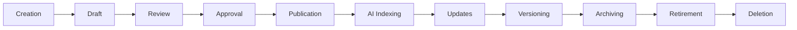
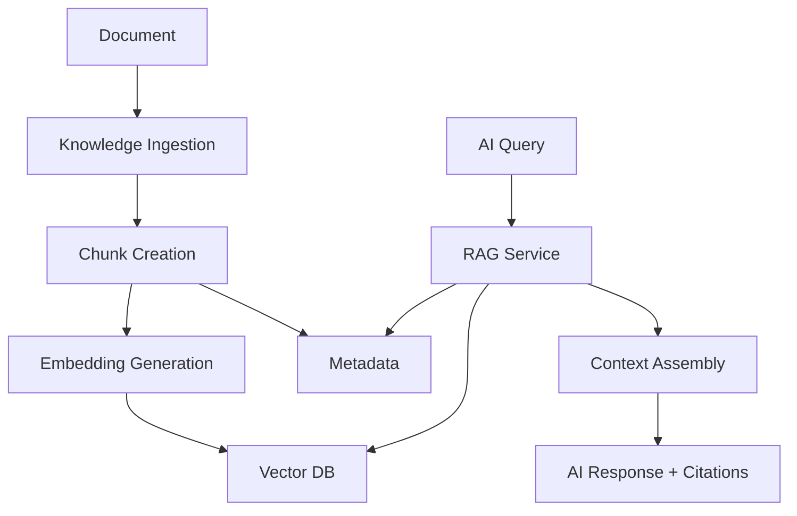
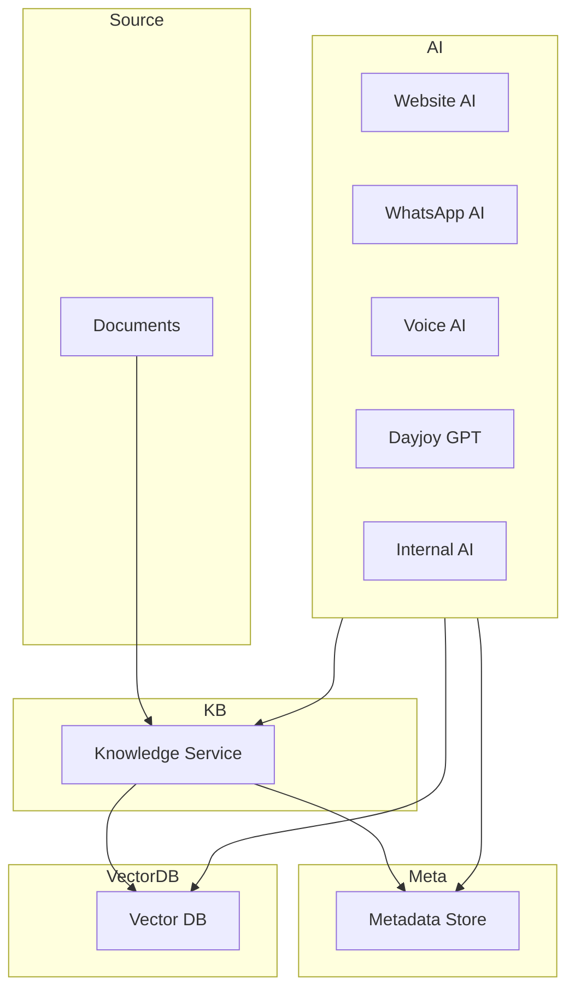
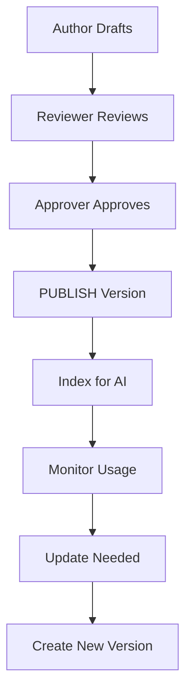
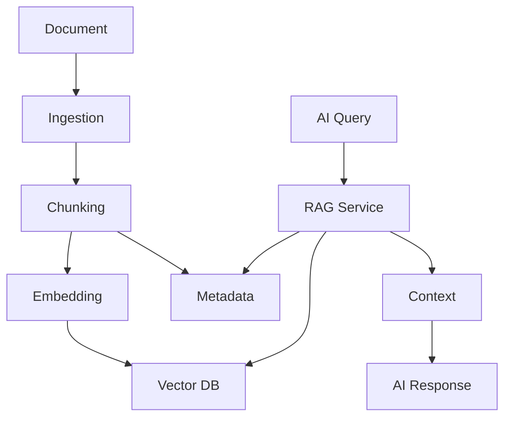
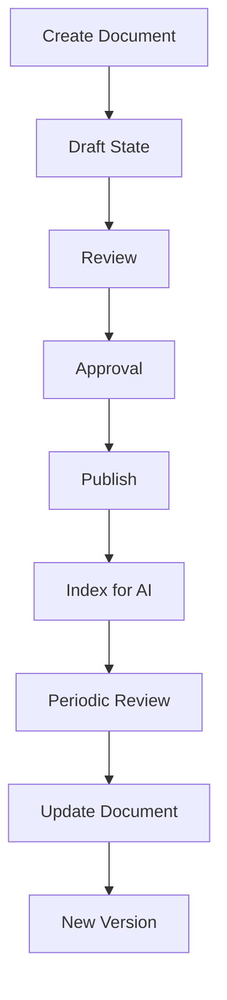

# 03_Database_Design/10_DOCUMENT_SCHEMA.md

# Dayjoy Enterprise AI Platform — Document Schema & Architecture

> **Purpose:** Define the complete logical document schema for the Dayjoy Enterprise AI Platform, describing how business documents are organized, classified, versioned, approved, secured, retrieved, and managed before being processed by the RAG pipeline and AI systems.
>
> **Scope:** Logical document architecture only — no SQL schemas, implementation code, or vendor-specific configuration.
>
> **Audience:** Knowledge engineers, AI architects, data architects, backend engineers, DevOps, security teams, product owners, and business stakeholders.

---

## Table of Contents

1. [Document Schema Overview](#1-document-schema-overview)
2. [Document Categories](#2-document-categories)
3. [Document Structure](#3-document-structure)
4. [Document Lifecycle](#4-document-lifecycle)
5. [Document Metadata Model](#5-document-metadata-model)
6. [Version Management](#6-version-management)
7. [AI Integration](#7-ai-integration)
8. [Security & Access Control](#8-security--access-control)
9. [Governance](#9-governance)
10. [Performance & Scalability](#10-performance--scalability)
11. [Future Document Roadmap](#11-future-document-roadmap)
12. [Architecture Diagrams](#12-architecture-diagrams)

---

## 1. Document Schema Overview

### 1.1 Purpose of Document Management

Document management ensures **enterprise knowledge** (policies, SOPs, guides, research, marketing, technical docs) is structured, governed, and accessible for humans and AI.[03_Database_Design/06_VECTOR_DATABASE_DESIGN.md][02_System_Architecture/04_RAG_ARCHITECTURE.md]

It enables:

- Reliable RAG retrieval for Dayjoy GPT and all AI assistants.
- Consistent communication of official policies and product information.[05_Policies.md][03_Product_Research.md]
- Effective training and support for distributors and employees.

### 1.2 Business Objectives

- **Single Source of Truth:** Centralized, validated documents per domain.
- **Governed Knowledge:** Clear ownership, approval, and review processes.[Project_Context/11_DOCUMENTATION_RULES.md]
- **AI Readiness:** Documents structured for chunking, embedding, and retrieval.
- **Compliance:** Proper handling of legal and compliance documents.

### 1.3 Relationship Between Documents, Metadata, Vector Database, and AI Systems

- **Documents:** Primary knowledge units (policies, FAQs, SOPs, etc.).
- **Metadata:** Descriptive fields for classification, governance, and retrieval.[03_Database_Design/07_METADATA_SCHEMA.md]
- **Vector Database:** Stores embeddings of document chunks for semantic search.[03_Database_Design/06_VECTOR_DATABASE_DESIGN.md]
- **AI Systems:** Use RAG to retrieve chunks and metadata, then generate grounded responses.[02_System_Architecture/03_AI_ARCHITECTURE.md]

### 1.4 Enterprise Document Architecture Principles

- **Domain-Aligned:** Documents organized by business domain (Products, Policies, Distributor System, SOPs, etc.).[03_Database_Design/01_DATA_DOMAINS.md]
- **Versioned & Audited:** Changes tracked and versioned with approvals.[02_System_Architecture/15_ARCHITECTURE_DECISIONS.md]
- **Validated & Trusted:** Trust levels and approvals enforced.
- **AI-Centric:** Structured for RAG and AI consumption (sections, chunks, metadata).

---

## 2. Document Categories

### 2.1 Document Category Catalog

| Category ID | Category Name | Description | Business Purpose | Owner | Update Frequency | AI Consumers | Retention Requirement |
|---|---|---|---|---|---|---|---|
| DOC-PROD-001 | Product Brochures | Marketing brochures for products | Communicate product benefits and usage | Marketing / Product | As campaigns/products change | Website AI, WhatsApp AI, Sales AI | Per marketing/compliance policy |
| DOC-PROD-002 | Product Catalogs | Structured product listings | Provide detailed product information | Product Team | As products change | All AI agents | Long-term (until product retired) |
| DOC-FAQ-001 | FAQs | Frequently asked questions | Provide quick answers | CX / Distributor Mgmt | Regular updates | All AI agents | Medium-term |
| DOC-POL-001 | Policies | Customer policies (orders, returns, refunds, shipping) | Define official rules | Legal/Compliance / CX | Controlled changes | All AI agents | Long-term (per legal policy) |
| DOC-POL-002 | Compensation Plans | Distributor compensation rules | Define earnings and incentives | Legal/Compliance / Distributor Mgmt | Controlled changes | Distributor Support AI, WhatsApp/Voice AI | Long-term |
| DOC-SOP-001 | SOPs | Standard Operating Procedures | Guide internal and support processes | Operations / Support | As processes change | Internal AI, Support AI | Long-term |
| DOC-TRAIN-001 | Training Manuals | Training content for distributors/employees | Support learning and development | Training / Distributor Mgmt | Training cycles | Training AI (future), Distributor AI | Medium–long-term |
| DOC-MKT-001 | Marketing Materials | Campaign briefs, brand guidelines | Control marketing messaging | Marketing / Brand | Controlled | Marketing AI, Website AI | Medium–long-term |
| DOC-DIST-001 | Distributor Guides | Distributor playbooks and system guides | Support distributor success | Distributor Mgmt / Training | Regular | Distributor Support AI | Long-term |
| DOC-RES-001 | Research Documents | Product and market research | Support strategic decisions | Product / Research | As available | Internal AI | Medium–long-term |
| DOC-LEG-001 | Legal Documents | Contracts, terms, legal agreements | Support legal protection | Legal | Controlled | Internal AI, Admin AI | Long-term |
| DOC-COMP-001 | Compliance Documents | Regulatory and compliance docs | Ensure regulatory alignment | Compliance | Controlled | Internal AI, Admin AI | Long-term |
| DOC-INT-001 | Internal Documentation | Internal process docs, runbooks | Support internal operations | Operations / IT / Support | As processes evolve | Internal AI | Medium–long-term |
| DOC-TECH-001 | Technical Documentation | Architecture, technical specs | Support engineering and AI assistants | Engineering / Architecture | As systems evolve | Internal AI, Admin AI | Long-term |
| DOC-AI-001 | AI Documentation | AI behavior, prompts, guardrails | Govern AI behavior | AI Governance | Controlled | All AI-related tools, Admin AI | Long-term |
| DOC-REP-001 | Reports | Generated reports and summaries | Communicate metrics and insights | Analytics / Management | As generated | Analytics AI | Medium–long-term |
| DOC-PRES-001 | Presentations | Slides and decks | Communicate plans and training | Various owners | As created | Internal AI | Medium-term |
| DOC-IMG-001 | Images (OCR) | Images with text extracted | Support OCR-based knowledge | Marketing / Product | As needed | RAG, Marketing AI | Medium-term |
| DOC-AUD-001 | Audio Transcripts | Transcripts of audio content | Capture spoken knowledge | Support / Training | As recorded | Voice AI, Training AI | Medium-term |
| DOC-VID-001 | Video Transcripts | Transcripts of video content | Capture visual/spoken knowledge | Training / Marketing | As videos created | Website AI, Training AI | Medium-term |

---

## 3. Document Structure

### 3.1 Logical Document Objects

- **Document:**
  - The primary knowledge unit (e.g., a policy PDF, SOP, guide).

- **Version:**
  - Specific iteration of a document (e.g., v1.0, v1.1).

- **Section:**
  - Logical part of a document (e.g., chapter, heading).

- **Page:**
  - Physical or logical page representation (especially for PDFs).

- **Attachment:**
  - Linked resources (images, tables, appendices).

- **Metadata:**
  - Descriptive fields (category, tags, owner, access_level).[03_Database_Design/07_METADATA_SCHEMA.md]

- **Approval Record:**
  - Record of who approved which version and when.

- **Review Record:**
  - Record of reviews, feedback, and changes.

- **Tags:**
  - Keywords/topics for search and retrieval.

- **References:**
  - Links to other documents or external resources.

- **Related Documents:**
  - Links to related docs (e.g., product doc linked to policy doc).

### 3.2 Role of Objects

- Document/Version: Provide canonical, versioned knowledge.
- Sections/Pages: Support chunking and navigation.
- Attachments: Extend document content (images, tables).
- Metadata: Enable classification, filtering, and governance.
- Approval/Review Records: Support governance and audit.
- Tags/References/Related Docs: Improve retrieval and relationships.

---

## 4. Document Lifecycle

### 4.1 Lifecycle Stages

1. **Creation:**
   - Author drafts new content.

2. **Draft:**
   - Document exists in draft state.

3. **Review:**
   - Reviewers provide feedback and request changes.

4. **Approval:**
   - Approver validates content and moves to approved state.

5. **Publication:**
   - Document published to Knowledge Base and RAG-eligible.

6. **AI Indexing:**
   - Document ingested, chunked, embedded, and indexed.[03_Database_Design/06_VECTOR_DATABASE_DESIGN.md]

7. **Updates:**
   - Document updated; new draft created.

8. **Versioning:**
   - Version number incremented; old version archived or retained.

9. **Archiving:**
   - Document marked archived; excluded from default retrieval.

10. **Retirement:**
   - Document retired; replaced or superseded.

11. **Deletion:**
   - Document deleted per retention/compliance.

### 4.2 Document Lifecycle Diagram

---

## 5. Document Metadata Model

### 5.1 Logical Metadata Fields

For each document:

- **Document ID:** Unique identifier (`document_id`).
- **Title:** Document title.
- **Category:** Category (product, policy, SOP, FAQ, training, etc.).
- **Department:** Owning department.
- **Product:** Associated product (if applicable).
- **Language:** Language of content.
- **Author:** Content author.
- **Owner:** Business owner (domain owner).
- **Version:** Document version (semantic).
- **Approval Status:** `DRAFT`, `REVIEW`, `APPROVED`, `PUBLISHED`, `ARCHIVED`.
- **Review Date:** Last review date.
- **Expiry Date:** Optional expiry for time-sensitive docs.
- **Tags:** Keywords/topics.
- **Keywords:** Search-oriented terms.
- **Source:** Source system (Git repo, CMS, website).
- **Access Level:** Access classification (`Public`, `Customer`, `Distributor`, `Internal`, `Admin`).
- **AI Visibility:** AI access scope (`all_agents`, `web_only`, `internal_only`).

### 5.2 Business Purpose of Metadata Fields

- Document ID: Trace and link docs across systems.
- Title: Human-readable identification.
- Category/Department: Domain classification and governance.
- Product: Product-specific relevance.
- Language: Language-aware retrieval.
- Author/Owner: Accountability and governance.
- Version: Manage changes and compatibility.
- Approval Status/Review Date: Control RAG eligibility and content freshness.
- Expiry Date: Handle time-sensitive campaigns/policies.
- Tags/Keywords: Improve search and retrieval.
- Source: Origin tracking.
- Access Level/AI Visibility: Enforce access control and AI routing.

---

## 6. Version Management

### 6.1 Version Numbering Strategy

- Semantic versioning (e.g., `1.0.0`, `1.1.0`, `2.0.0`).

### 6.2 Draft vs Published Versions

- Draft versions not RAG-eligible.
- Only `APPROVED`/`PUBLISHED` versions used for RAG.

### 6.3 Revision History

- Maintain history of changes (who, when, what).

### 6.4 Approval Workflow

- Author → Reviewer → Approver.
- Approval required before publication and indexing.[Project_Context/11_DOCUMENTATION_RULES.md]

### 6.5 Rollback Strategy

- Ability to revert to previous approved version if new version problematic.

### 6.6 Change Tracking

- Use metadata and audit logs to track changes.[03_Database_Design/07_METADATA_SCHEMA.md]

---

## 7. AI Integration

### 7.1 AI Document Processing Flow

1. **Knowledge Ingestion:**
   - RAG pipeline ingests approved/published documents.[02_System_Architecture/04_RAG_ARCHITECTURE.md]

2. **Chunk Creation:**
   - Documents split into chunks based on sections.[03_Database_Design/06_VECTOR_DATABASE_DESIGN.md]

3. **Embedding Generation:**
   - Embeddings generated for each chunk.

4. **Metadata Filtering:**
   - Metadata stored alongside chunks for retrieval.

5. **Retrieval:**
   - AI queries RAG; vector DB returns relevant chunks.

6. **Context Assembly:**
   - RAG service assembles chunks into context.

7. **Citation Support:**
   - AI attaches citations to responses (document IDs, sections).

8. **Re-indexing:**
   - When documents change, chunks and embeddings regenerated.

### 7.2 AI Document Processing Diagram

---

## 8. Security & Access Control

### 8.1 Document Ownership

- Each document linked to a domain owner and department.

### 8.2 Access Levels

- `Public`: Accessible externally.
- `Customer`: Visible to customers.
- `Distributor`: Visible to distributors.
- `Internal`: Internal staff.
- `Admin`: Restricted to admin roles.

### 8.3 Department Restrictions

- Some docs restricted by department (e.g., legal, HR).

### 8.4 Confidential Documents

- Legal and compliance docs marked as confidential.

### 8.5 Encryption Requirements

- Documents stored encrypted at rest; access via secure channels.

### 8.6 Audit Logging

- Access and changes logged; especially for sensitive docs.[02_System_Architecture/10_SECURITY_ARCHITECTURE.md]

### 8.7 Approval Permissions

- Only authorized approvers can change `approval_status`.

---

## 9. Governance

### 9.1 Governance Roles

- **Document Owner:** Domain lead responsible for content.
- **Reviewer:** Subject-matter expert.
- **Approver:** Governance authority (e.g., Legal, Compliance, Management).

### 9.2 Documentation Standards

- Clear titles, categories, and metadata.
- Consistent structure and formatting.

### 9.3 Naming Standards

- Use descriptive, domain-consistent names.

### 9.4 Review Frequency

- Policies, compensation plans: at least annually.
- FAQs, SOPs: quarterly or per change.

### 9.5 Quality Standards

- Accuracy, clarity, completeness, relevance.

### 9.6 Compliance Requirements

- Legal and compliance docs must meet regulatory standards.

---

## 10. Performance & Scalability

### 10.1 Document Growth Strategy

- Plan for increasing volumes across domains.

### 10.2 Storage Organization

- Store docs by domain, category, and department.

### 10.3 Retrieval Optimization

- Use metadata and indexes to optimize retrieval.

### 10.4 Archive Strategy

- Archive old versions and obsolete docs.

### 10.5 Version Storage

- Store versions efficiently with diffs or full copies depending on policy.

### 10.6 Large Document Handling

- Use chunking and pagination for large docs.

---

## 11. Future Document Roadmap

### 11.1 Future Capabilities

| Capability | Description | Status |
|---|---|---|
| AI-Generated Documentation | AI assistance in drafting and updating docs | Future |
| Automatic Classification | AI-based category and tag assignment | Future |
| Semantic Linking | Automatic linking of related docs | Future |
| Knowledge Graph Integration | Graph-based representation of docs and entities | Future |
| Multi-language Documentation | Managed multiple language versions | Future |
| Document Intelligence | Advanced analysis (topics, gaps, sentiment) | Future |
| Image Understanding | Extract knowledge from images | Future |
| Video Knowledge Extraction | Extract structured knowledge from videos | Future |
| Cross-Repository Search | Search across multiple repositories | Future |

All future capabilities must align with governance, security, and performance models.

---

## 12. Architecture Diagrams

### 12.1 Document Architecture

### 12.2 Document Lifecycle

### 12.3 Version Management Workflow

### 12.4 AI Document Processing Pipeline

### 12.5 Document Classification Hierarchy

```mermaid
flowchart TB
    ROOT[Document Categories] --> PROD[Product Docs]
    ROOT --> POL[Policies]
    ROOT --> FAQ[FAQs]
    ROOT --> COMP[Compensation]
    ROOT --> SOP[SOPs]
    ROOT --> TRAIN[Training]
    ROOT --> MKT[Marketing]
    ROOT --> DIST[Distributor Guides]
    ROOT --> RES[Research]
    ROOT --> LEG[Legal]
    ROOT --> COMP_DOCS[Compliance]
    ROOT --> INT_DOCS[Internal]
    ROOT --> TECH[Technical]
    ROOT --> AI_DOCS[AI Docs]
    ROOT --> REP[Reports]
    ROOT --> PRES[Presentations]
    ROOT --> IMG[Images]
    ROOT --> AUD[Audio Transcripts]
    ROOT --> VID[Video Transcripts]
```

### 12.6 Document Governance Workflow

---

**END OF DOCUMENT**