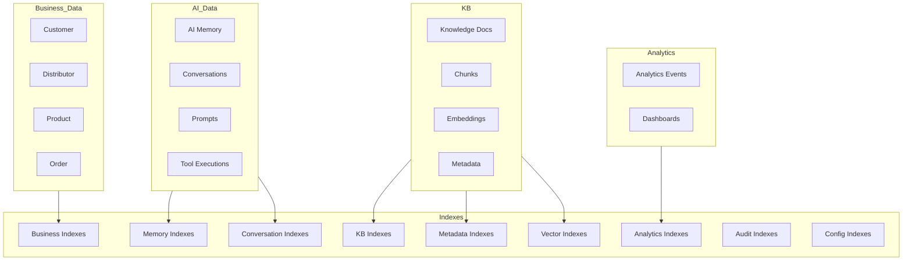
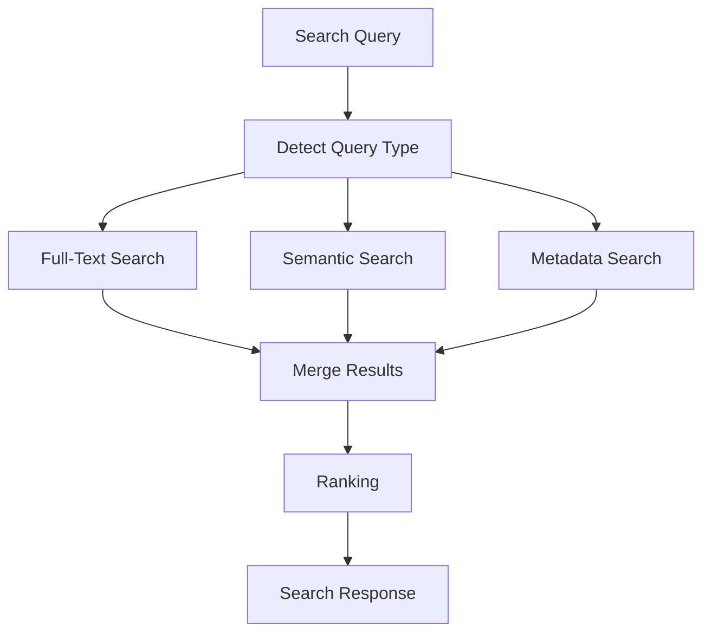
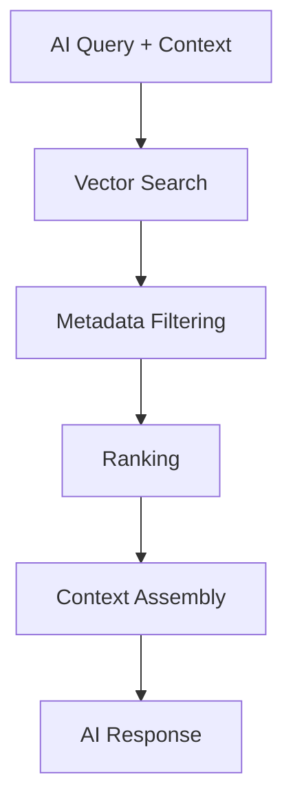
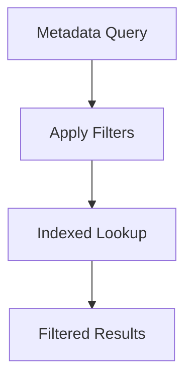
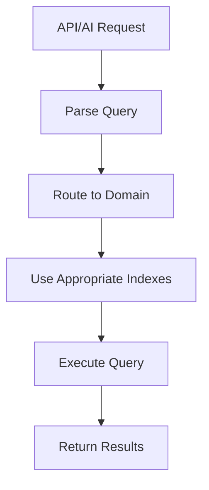
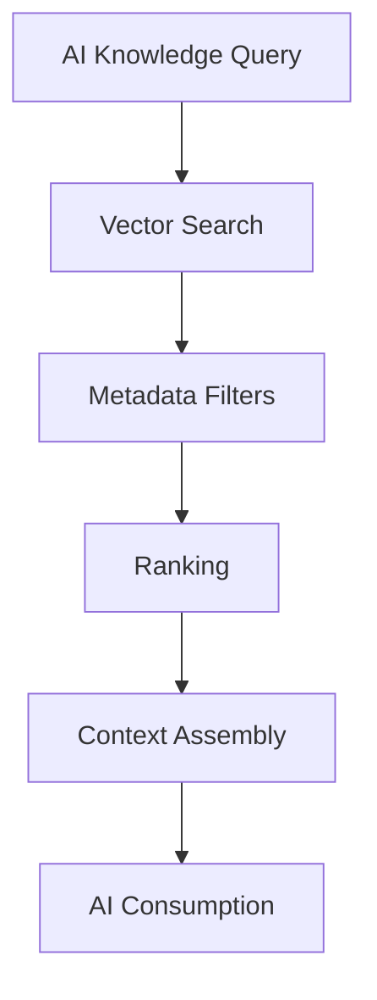

# 03_Database_Design/11_INDEXING_STRATEGY.md

# Dayjoy Enterprise AI Platform — Logical Indexing Strategy

> **Purpose:** Define the complete logical indexing strategy for the Dayjoy Enterprise AI Platform, covering how business data, AI memory, knowledge documents, metadata, conversations, analytics, and vector embeddings are indexed to provide high-performance retrieval, scalability, efficient querying, and enterprise-grade search capabilities.
>
> **Scope:** Logical indexing architecture only — no SQL INDEX statements, implementation code, or vendor-specific configuration.
>
> **Audience:** Data architects, solution architects, backend engineers, AI engineers, DevOps, security teams, and business stakeholders.

---

## Table of Contents

1. [Indexing Strategy Overview](#1-indexing-strategy-overview)
2. [Index Categories](#2-index-categories)
3. [Business Data Indexing](#3-business-data-indexing)
4. [AI & RAG Indexing](#4-ai--rag-indexing)
5. [Search Optimization](#5-search-optimization)
6. [Query Optimization](#6-query-optimization)
7. [Performance Strategy](#7-performance-strategy)
8. [Governance](#8-governance)
9. [Monitoring & Maintenance](#9-monitoring--maintenance)
10. [Future Indexing Roadmap](#10-future-indexing-roadmap)
11. [Architecture Diagrams](#11-architecture-diagrams)

---

## 1. Indexing Strategy Overview

### 1.1 Purpose of Indexing

Indexing provides **fast, efficient access** to Dayjoy’s data and knowledge across business domains, AI memory, conversations, analytics, and vector embeddings.[03_Database_Design/00_DATABASE_OVERVIEW.md][02_System_Architecture/08_DATABASE_ARCHITECTURE.md]

It enables:

- Low-latency search and retrieval for AI and APIs.
- Efficient filtering, sorting, and reporting.
- Scalable performance as data volumes grow.

### 1.2 Business Objectives

- **High-Performance AI:** Ensure AI retrieval and response generation is fast and reliable.[02_System_Architecture/03_AI_ARCHITECTURE.md]
- **Operational Efficiency:** Support fast access to orders, customers, distributors, and notifications.
- **Business Visibility:** Enable interactive dashboards and analytics.[02_System_Architecture/13_MONITORING_ARCHITECTURE.md]
- **Governed Search:** Provide consistent, auditable search behavior.

### 1.3 Performance Goals

- Sub-second search response time for typical API and AI queries.
- Efficient support for high QPS (queries per second) on read-heavy workloads.

### 1.4 Relationship Between Indexing, Search, APIs, AI, and Analytics

- APIs rely on indexes for filtering and sorting (customers, orders, distributors).[02_System_Architecture/09_API_ARCHITECTURE.md]
- AI systems rely on vector and metadata indexes for RAG and memory retrieval.[02_System_Architecture/04_RAG_ARCHITECTURE.md][03_Database_Design/06_VECTOR_DATABASE_DESIGN.md][03_Database_Design/08_AI_MEMORY_SCHEMA.md]
- Analytics relies on indexes for aggregations, dashboards, and reporting.

### 1.5 Enterprise Indexing Principles

- **Domain-Driven:** Indexes aligned with data domains and usage patterns.[03_Database_Design/01_DATA_DOMAINS.md]
- **Read-Optimized:** Focus on read performance for AI and APIs, with balanced write costs.
- **Minimal & Targeted:** Only index fields that materially improve performance.
- **Observable:** Index usage monitored and tuned.
- **Scalable:** Indexes designed for growth and partitioning.

---

## 2. Index Categories

### 2.1 Index Category Catalog

| Category ID | Category Name | Purpose | Business Value | Related Domains | Priority |
|---|---|---|---|---|---|
| IDX-BIZ-PRI-001 | Primary Business Indexes | Support primary entity lookups (by ID) | Fast access to core entities | Customer, Distributor, Product, Order, User | Critical |
| IDX-BIZ-LU-001 | Lookup Indexes | Support lookups by alternative keys (email, phone, SKU) | Improve UX and support workflows | Customer, Distributor, Product | High |
| IDX-BIZ-SRCH-001 | Search Indexes | Support search by names, titles, descriptions | Enable search in UIs and APIs | Customer, Distributor, Product, Knowledge | High |
| IDX-META-001 | Metadata Indexes | Support filtering by category, tags, department, access_level | Enable metadata-based RAG and governance | Knowledge, AI, Security | Critical |
| IDX-MEM-001 | AI Memory Indexes | Support memory retrieval by user, session, type | Enable fast AI context retrieval | AI Memory | Critical |
| IDX-CONV-001 | Conversation Indexes | Support retrieval by user, type, status, time | Enable conversation search and analytics | Conversations | High |
| IDX-KB-001 | Knowledge Base Indexes | Support document lookup and filtering | Enable KB search and routing | Knowledge Base | High |
| IDX-VEC-001 | Vector Search Indexes | Support semantic search on embeddings | Enable RAG retrieval | RAG / Vector DB | Critical |
| IDX-ANL-001 | Analytics Indexes | Support event aggregations and dashboard queries | Enable analytics performance | Analytics | High |
| IDX-AUD-001 | Audit Log Indexes | Support audit log search by user, action, time | Support compliance and security | Audit Logs | Critical |
| IDX-CONF-001 | Configuration Indexes | Support lookup by key, environment, feature | Enable config-driven behavior | System Configuration | High |

---

## 3. Business Data Indexing

### 3.1 Customer Indexing

- **Frequently Searched Fields:**
  - `customer_id`, `email`, `phone_number`, `name`, `city`, `state`, `country`.
- **Common Filters:**
  - Status, region, registration date.
- **Sorting Requirements:**
  - By registration date, last activity.
- **Search Frequency:**
  - High (support, AI, reporting).
- **Business Importance:**
  - Critical for support, personalization, and analytics.

### 3.2 Distributor Indexing

- **Frequently Searched Fields:**
  - `distributor_id`, `sponsor_id`, `rank`, `level`, `city`, `state`, `country`.
- **Common Filters:**
  - Rank, activity level, region, joining_date.
- **Sorting Requirements:**
  - By rank, performance metrics.
- **Search Frequency:**
  - High (Distributor Mgmt, AI coaching, reporting).
- **Business Importance:**
  - Critical for distributor management and compensation.

### 3.3 Product Indexing

- **Frequently Searched Fields:**
  - `product_id`, `product_name`, `sku`, `category`, `stock_status`.
- **Common Filters:**
  - Category, stock_status, price range.
- **Sorting Requirements:**
  - By name, price, popularity.
- **Search Frequency:**
  - High (Website, AI recommendations, marketing).
- **Business Importance:**
  - Critical for product discovery and sales.

### 3.4 Order Indexing

- **Frequently Searched Fields:**
  - `order_id`, `customer_id`, `distributor_id`, `order_status`, `order_date`, `payment_status`, `delivery_status`.
- **Common Filters:**
  - Status, date range, customer/distributor, payment_status.
- **Sorting Requirements:**
  - By order_date, status, amount.
- **Search Frequency:**
  - High (support, AI, operations, analytics).
- **Business Importance:**
  - Critical for operations and support.

### 3.5 Payment & Notification Indexing

- **Payments:**
  - Fields: `payment_status`, `payment_date`, `order_id`, `distributor_id`.

- **Notifications:**
  - Fields: `notification_status`, `user_id`, `channel`, `sent_at`.

### 3.6 Report Indexing

- **Reports:**
  - Fields: report type, period, owner, domain.

---

## 4. AI & RAG Indexing

### 4.1 Knowledge Documents & Chunks

- **Documents:**
  - Index by `document_id`, `title`, `category`, `department`, `product`, `language`, `access_level`, `approval_status`, `tags`.

- **Chunks:**
  - Index by `chunk_id`, `document_id`, `section`, `tags`, `category`, `language`, `access_level`, `trust_level`.

### 4.2 Embeddings & Vector Search

- Embeddings indexed in vector DB for similarity search.
- Metadata indexes support filtering by namespace, category, product, language, access_level, trust_level.[03_Database_Design/06_VECTOR_DATABASE_DESIGN.md]

### 4.3 AI Memory Indexes

- Memory indexed by `user_id`, `session_id`, `memory_type`, `importance_score`, `last_updated`.[03_Database_Design/08_AI_MEMORY_SCHEMA.md]

### 4.4 Prompts & Conversations

- **Prompts:**
  - Index by `prompt_id`, `prompt_version`, `agent_id`, `category`, `status`.

- **Conversations:**
  - Index by `conversation_id`, `user_id`, `distributor_id`, `channel`, `type`, `status`, `start_time`, `end_time`.

### 4.5 Tool Usage & AI Feedback

- **Tool Executions:**
  - Index by `tool_name`, `agent_id`, `user_id`, `distributor_id`, `timestamp`, `status`.

- **AI Feedback:**
  - Index by `conversation_id`, `message_id`, `feedback_rating`, `agent_id`, `timestamp`.

### 4.6 Indexing Support for AI & RAG

- **Semantic Search:** Vector indexes on embeddings.
- **Metadata Filtering:** Metadata indexes for category, tags, access_level, trust_level.
- **Context & Memory Retrieval:** Memory and conversation indexes for fast lookup.
- **Hybrid Search:** Combine semantic and keyword/metadata search.

---

## 5. Search Optimization

### 5.1 Full-Text Search

- Used for:
  - Searching document content, FAQs, product descriptions.
- Optimization:
  - Index text fields with full-text search structures.

### 5.2 Semantic Search

- Used for:
  - RAG retrieval and AI knowledge queries.
- Optimization:
  - Vector search indexes on embeddings.

### 5.3 Keyword & Metadata Search

- Used for:
  - Filtering by tags, categories, product, department, access_level.
- Optimization:
  - Index metadata fields used in filters.

### 5.4 Tag-Based & Category Search

- Used for:
  - Browsing FAQs, policies, training content.

### 5.5 Hybrid Retrieval

- Combine semantic + keyword + metadata search to improve relevance.

---

## 6. Query Optimization

### 6.1 Frequently Accessed Data

- Customers, distributors, products, orders, conversations.
- Optimization:
  - Index primary keys and common lookup fields.

### 6.2 High-Traffic Queries

- AI RAG queries, order status checks, distributor performance.
- Optimization:
  - Precompute or cache common results; appropriate indexing.

### 6.3 Dashboard & Reporting Queries

- Aggregations for analytics (orders per day, commissions per rank).
- Optimization:
  - Index time fields, domain keys; use analytical storage.[02_System_Architecture/13_MONITORING_ARCHITECTURE.md]

### 6.4 AI Retrieval & Analytics

- Optimization:
  - Ensure RAG and memory queries use appropriate vector and metadata indexes.

### 6.5 Pagination & Sorting

- Use indexes on sort keys and pagination fields.

---

## 7. Performance Strategy

### 7.1 Search Response Time

- Target: < 200–500ms for typical RAG and API queries.

### 7.2 Query Performance

- Monitor latency and optimize indexes for high-traffic queries.

### 7.3 Index Maintenance

- Regular review and adjustment of indexes based on usage.

### 7.4 Scalability

- Plan for index partitioning and horizontal scaling.

### 7.5 Storage Efficiency

- Balance index count vs storage and write overhead.

### 7.6 Growth Management

- Monitor index size and performance as data grows.

### 7.7 Read/Write Balance

- Ensure indexing strategy does not overly degrade write performance.

---

## 8. Governance

### 8.1 Index Ownership

- Each domain’s indexes owned by corresponding domain owner (e.g., CX for customer indexes).

### 8.2 Naming Standards

- Logical index names aligned with table/entity and fields.

### 8.3 Review Frequency

- Regular review (e.g., quarterly) of index usage and performance.

### 8.4 Maintenance Responsibilities

- DevOps/Data teams responsible for index maintenance and tuning.

### 8.5 Documentation Standards

- Indexes documented in domain and schema design docs.

### 8.6 Change Approval Process

- Changes to indexing strategy approved by Architecture Review Board for major changes.[02_System_Architecture/15_ARCHITECTURE_DECISIONS.md]

---

## 9. Monitoring & Maintenance

### 9.1 Monitoring Metrics

- **Index Usage:** Frequency of index use per query type.
- **Query Performance:** Latency, throughput, error rates.
- **Search Accuracy:** Relevance scores and user feedback.
- **AI Retrieval Performance:** RAG and memory retrieval metrics.
- **Storage Growth:** Index size over time.
- **Fragmentation (Logical):** Effect of growth and churn on performance.

### 9.2 Recommended KPIs

- Query latency percentiles (P50, P95, P99).
- Index hit rates for key queries.
- RAG retrieval quality (precision/recall).
- AI response time distribution.
- Index growth vs data growth.

### 9.3 Maintenance Schedule

- Periodic index review and tuning.
- Re-indexing for major schema changes.

---

## 10. Future Indexing Roadmap

### 10.1 Future Capabilities

| Capability | Description | Status |
|---|---|---|
| AI-Driven Query Optimization | Use AI to suggest query and index optimization | Future |
| Intelligent Index Recommendations | Automated suggestions for new or adjusted indexes | Future |
| Adaptive Indexing | Dynamic index creation/removal based on usage | Future |
| Knowledge Graph Indexes | Index relationships in a graph for retrieval | Future |
| Cross-Language Search | Index per-language and cross-language mappings | Future |
| Multi-Modal Search | Index for text, image, audio, video | Future |
| Personalized Search | Index user-specific preferences | Future |
| Federated Search | Index integration across multiple data stores | Future |
| Real-Time Index Updates | Stream-based indexing for near real-time search | Future |

Future capabilities must integrate with existing governance, security, and performance frameworks.

---

## 11. Architecture Diagrams

### 11.1 Indexing Architecture

### 11.2 Search Pipeline

### 11.3 AI Retrieval Pipeline

### 11.4 Metadata Filtering Flow

### 11.5 Query Processing Workflow

### 11.6 Knowledge Search Architecture

---

**END OF DOCUMENT**