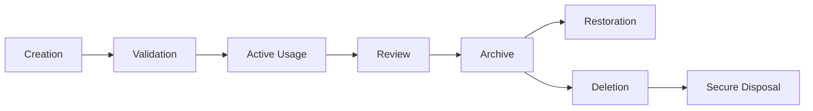
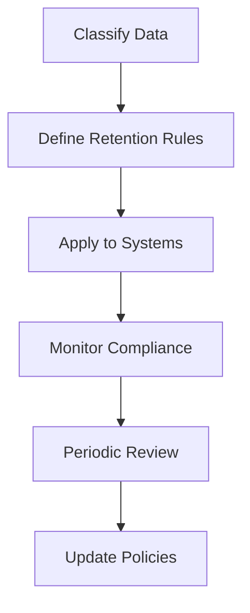
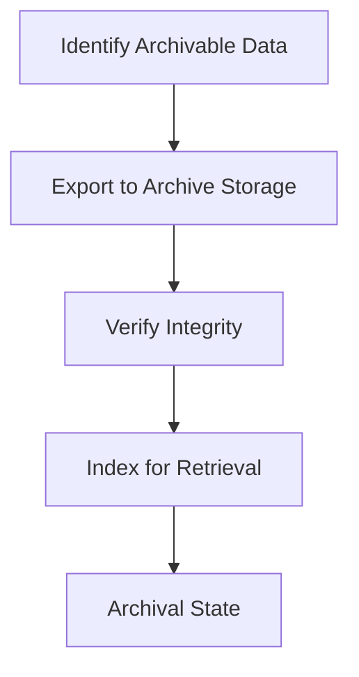
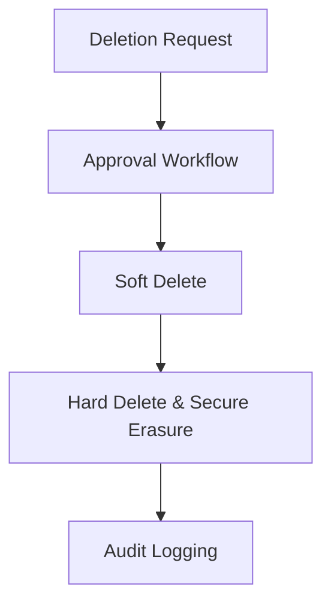
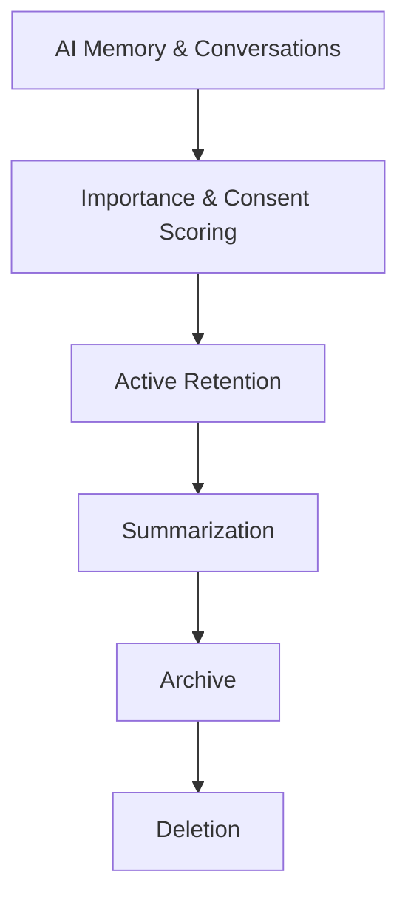
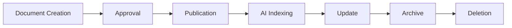

# 03_Database_Design/12_DATA_RETENTION_POLICY.md

# Dayjoy Enterprise AI Platform — Data Retention Policy & Lifecycle

> **Purpose:** Define the enterprise-wide Data Retention Policy for the Dayjoy Enterprise AI Platform, covering how business, operational, AI, knowledge, security, and analytics data is retained, archived, restored, and permanently deleted throughout its lifecycle.
>
> **Scope:** Logical policy and governance only — no implementation code, database-specific configurations, or vendor-specific solutions.
>
> **Audience:** Data architects, AI architects, security and compliance teams, DevOps, backend engineers, product owners, business stakeholders, and AI assistants.

---

## Table of Contents

1. [Data Retention Policy Overview](#1-data-retention-policy-overview)
2. [Data Classification](#2-data-classification)
3. [Retention Schedule](#3-retention-schedule)
4. [Data Lifecycle](#4-data-lifecycle)
5. [AI & Knowledge Retention](#5-ai--knowledge-retention)
6. [Archiving Strategy](#6-archiving-strategy)
7. [Secure Deletion Policy](#7-secure-deletion-policy)
8. [Compliance & Governance](#8-compliance--governance)
9. [Risk Assessment](#9-risk-assessment)
10. [Future Retention Roadmap](#10-future-retention-roadmap)
11. [Architecture Diagrams](#11-architecture-diagrams)

---

## 1. Data Retention Policy Overview

### 1.1 Purpose of Data Retention

Data retention ensures that Dayjoy retains data **only as long as necessary** to support business value, AI needs, legal obligations, and operational requirements, while minimizing risk and storage costs.[02_System_Architecture/10_SECURITY_ARCHITECTURE.md][02_System_Architecture/14_DISASTER_RECOVERY.md]

### 1.2 Business Objectives

- **Business Continuity:** Keep essential data available for operations and support.
- **AI Effectiveness:** Retain AI-relevant data for context and learning.
- **Compliance:** Meet regulatory and internal retention requirements.
- **Security & Privacy:** Protect users and distributors by avoiding over-retention.
- **Cost Management:** Optimize storage and infrastructure costs.

### 1.3 Relationship with AI Memory, RAG, Security, Compliance, and Governance

- **AI Memory:** Retention policies govern how long AI keeps memory and conversation context.[03_Database_Design/08_AI_MEMORY_SCHEMA.md]
- **RAG:** Retention and archival policies shape which knowledge documents remain RAG-eligible.[03_Database_Design/06_VECTOR_DATABASE_DESIGN.md][03_Database_Design/10_DOCUMENT_SCHEMA.md]
- **Security:** Retention supports security practices, including encryption and audit.[02_System_Architecture/10_SECURITY_ARCHITECTURE.md]
- **Compliance:** Policies must align with legal and regulatory obligations (e.g., financial record retention).
- **Governance:** Architecture decisions and governance structures enforce retention across domains.[02_System_Architecture/15_ARCHITECTURE_DECISIONS.md]

### 1.4 Enterprise Retention Principles

- **Minimum Necessary:** Retain only data necessary for defined purposes.
- **Purpose-Bound:** Retention tied to specific business and AI usage.
- **Risk-Aware:** Balance value vs. risk of storing data.
- **Transparent:** Clear policies documented and communicated.
- **Reviewable:** Policies regularly reviewed and updated.

---

## 2. Data Classification

### 2.1 Data Classification Matrix

| Category ID | Data Category | Description | Business Owner | Criticality | AI Importance |
|---|---|---|---|---|---|
| DC-MASTER-001 | Master Data | Core entities (customers, distributors, products) | Domain Owners (CX, Distributor Mgmt, Product) | Critical | High |
| DC-CUST-001 | Customer Data | Customer profiles and related info | CX / Customer Mgmt | Critical | High |
| DC-DIST-001 | Distributor Data | Distributor profiles, hierarchy, metrics | Distributor Mgmt | Critical | High |
| DC-PROD-001 | Product Data | Product catalog and attributes | Product Team | Critical | High |
| DC-ORD-001 | Order Data | Orders and line items | Order Mgmt / Operations | Critical | High |
| DC-FIN-001 | Financial Data | Payments, commissions, wallets | Finance / Distributor Mgmt | Critical | Medium–High |
| DC-CONV-001 | Conversation Data | Conversations, messages, transcripts | CX / AI Team | High | High |
| DC-AIMEM-001 | AI Memory | AI session, profile, long-term memory | AI Team | High | High |
| DC-KB-001 | Knowledge Documents | Policies, SOPs, FAQs, guides | Knowledge Team | Critical | High |
| DC-EMB-001 | Embeddings | Vector representations of knowledge | AI Team | High | High |
| DC-META-001 | Metadata | Document and knowledge metadata | Knowledge / AI Team | High | High |
| DC-ANL-001 | Analytics Data | Events, KPIs, dashboards | Analytics Team | High | Medium–High |
| DC-AUD-001 | Audit Logs | Audit trails for changes and actions | Security / Compliance | Critical | Low (but important for evaluation) |
| DC-LOG-001 | System Logs | Infrastructure and app logs | DevOps / Security | High | Medium |
| DC-NOTIF-001 | Notifications | Notification records and logs | Operations / CX | Medium | Medium |
| DC-CONF-001 | Configuration Data | System and AI configuration | Admin / IT | Critical | Medium |
| DC-BKP-001 | Backups | Backup copies of critical data | DevOps / Security | Critical | Indirect (for recovery) |

---

## 3. Retention Schedule

### 3.1 Master Retention Schedule

> Note: Actual retention durations must be validated with legal/compliance teams and may vary by region.

| Data Type | Category ID | Active Retention Period | Archive Period | Permanent Deletion Criteria | Review Frequency | Recovery Window | Business Justification |
|---|---|---|---|---|---|---|---|
| Customer Data | DC-CUST-001 | 5 years after last activity | Additional 2 years archived | No activity + retention expired | Annual | 7 years | Support, legal, and analytics needs |
| Distributor Data | DC-DIST-001 | 7 years after last activity | Additional 3 years archived | Distributor inactive + retention expired | Annual | 10 years | Compensation, compliance, and audits |
| Product Data | DC-PROD-001 | Active while product live | 3 years after product retirement archived | Product retired + archive period expired | Annual | 3 years | Historical references and reporting |
| Order Data | DC-ORD-001 | 7 years active | Additional 3 years archived | Legal/financial retention met | Annual | 10 years | Financial reporting and compliance |
| Financial Data (Payments, Commissions) | DC-FIN-001 | 7 years active | Additional 3 years archived | Legal retention met | Annual | 10 years | Regulatory and financial audits |
| Conversation Data (Support, AI) | DC-CONV-001 | 1–3 years active (depending on type) | Additional 2 years archived | Policy-defined retention met or user-requested deletion | Annual | 3–5 years | Support history, AI improvement, compliance |
| AI Memory (User Profile, Long-Term) | DC-AIMEM-001 | 1–3 years, subject to consent | Optional archival for summary | User inactive + retention expired or deletion request | Annual | 1–3 years | Personalization and AI performance |
| Knowledge Documents | DC-KB-001 | Active while valid | Archived when superseded | Superseded + retention expired | Annual | 3–7 years | Reference and legal alignment |
| Embeddings | DC-EMB-001 | Active while underlying document valid | Archived with document | Document archived/retired | Annual | 3–7 years | RAG performance and reproducibility |
| Metadata | DC-META-001 | Active while content exists | Archived with content | Content deleted | Annual | 3–7 years | Governance and traceability |
| Analytics Data | DC-ANL-001 | 2–5 years active | Optional archival | Aggregate KPIs retained, raw events deleted | Annual | 2–5 years | Trend analysis and strategy |
| Audit Logs | DC-AUD-001 | 7+ years active | Archival as needed | Regulatory guidance | Annual | 7+ years | Compliance and security |
| System Logs | DC-LOG-001 | 30–180 days active | Optional archival for debugging | No longer needed | Quarterly | 30–180 days | Operational debugging |
| Notifications | DC-NOTIF-001 | 1–2 years active | Optional archival | No longer needed | Annual | 1–2 years | Audit of communications |
| Configuration Data | DC-CONF-001 | Active as long as config valid | Archived on change | Config superseded | Annual | 3–5 years | Rollback and audit |
| Backups | DC-BKP-001 | Based on retention of underlying data | N/A | Backups deleted when retention met | Annual | Aligned with DR requirements | Disaster recovery |

---

## 4. Data Lifecycle

### 4.1 Lifecycle Stages

1. **Creation:** Data created via forms, APIs, imports, or system processes.
2. **Validation:** Data validated against business rules and schemas.
3. **Active Usage:** Data actively used by services, AI, and analytics.
4. **Review:** Data periodically reviewed for relevance and compliance.
5. **Archive:** Data moved to archive storage when no longer actively needed.
6. **Restoration:** Archived data restored if required for business or legal reasons.
7. **Deletion:** Data deleted per retention and legal requirements.
8. **Secure Disposal:** Data securely erased to prevent recovery.

### 4.2 Data Lifecycle Diagram

---

## 5. AI & Knowledge Retention

### 5.1 AI Memory

- **Short-Term (Session/Working Memory):**
  - Retained only for session duration; no long-term storage.

- **Long-Term Memory & Preferences:**
  - Retained 1–3 years subject to consent and policy.
  - Summarized periodically; expired when user inactive or upon request.[03_Database_Design/08_AI_MEMORY_SCHEMA.md]

### 5.2 Conversation History

- Retained longer for support and AI improvement (1–3 years).
- Summaries kept longer; raw transcripts may be archived and eventually deleted.

### 5.3 User Preferences

- Retained while user active and consent granted.
- Deleted or anonymized when user requests or becomes inactive.

### 5.4 Knowledge Documents, Chunks, Embeddings

- **Documents:**
  - Retained while valid; archived when superseded.

- **Chunks & Embeddings:**
  - Retained in sync with document lifecycle; re-embedded when versions change.[03_Database_Design/06_VECTOR_DATABASE_DESIGN.md]

### 5.5 Prompts & AI Feedback

- **Prompts:**
  - Retained with version history; older versions archived for audit.

- **AI Feedback & Retrieval Logs:**
  - Retained 1–3 years for evaluation; aggregated metrics kept longer.

---

## 6. Archiving Strategy

### 6.1 Archive Objectives

- Reduce load on active storage.
- Preserve important historical data for reference and compliance.

### 6.2 Archive Criteria

- Data no longer needed for daily operations.
- Data past active retention but not yet eligible for deletion.

### 6.3 Archive Frequency

- Periodic (e.g., monthly or quarterly) for major domains.

### 6.4 Storage Tiers

- **Hot:** Active data for daily operations.
- **Warm:** Recently archived data for occasional access.
- **Cold:** Long-term archive for rare access.

### 6.5 Retrieval Process

- Archived data must remain retrievable within defined recovery windows.

### 6.6 Archive Validation

- Archived data checked for integrity and completeness.

### 6.7 Archive Ownership

- Domain owners and DevOps/Security responsible for archive governance.

---

## 7. Secure Deletion Policy

### 7.1 Deletion Approval Process

- Deletion of critical data (e.g., financial, audit) requires approval from domain owner and compliance.

### 7.2 Soft Delete vs Hard Delete

- **Soft Delete:** Mark records as deleted but retain for limited time.
- **Hard Delete:** Permanently erase records after soft delete and retention.

### 7.3 Secure Erasure & Data Sanitization

- Use secure erasure practices to prevent recovery.

### 7.4 Audit Logging

- All deletion actions logged in audit logs.[02_System_Architecture/10_SECURITY_ARCHITECTURE.md]

### 7.5 User-Initiated Deletion

- Users can request deletion of certain data (e.g., AI memory, conversations) per privacy laws.

### 7.6 Legal Hold Exceptions

- Data under legal hold exempt from deletion until resolved.

---

## 8. Compliance & Governance

### 8.1 Data Ownership

- Each data category has a defined business owner.

### 8.2 Review Responsibilities

- Domain owners and data stewards review retention compliance.

### 8.3 Compliance Requirements

- Retention aligned with legal/regulatory requirements (e.g., financial record retention).

### 8.4 Audit Requirements

- Retention activities (archiving, deletion) auditable.

### 8.5 Retention Exceptions

- Defined for legal holds or specific business cases.

### 8.6 Documentation Standards

- Retention policies documented and accessible.

### 8.7 Policy Review Process

- Regular review (e.g., annually) by governance and compliance teams.

---

## 9. Risk Assessment

### 9.1 Risks and Mitigation

| Risk ID | Description | Risk Level | Business Impact | Mitigation Strategy |
|---|---|---|---|---|
| DRP-RISK-001 | Over-Retention | Medium | Increased risk, cost, compliance issues | Regular review; enforce policies; monitor storage |
| DRP-RISK-002 | Premature Deletion | High | Loss of critical data, legal issues | Approval workflows; legal review; retention checks |
| DRP-RISK-003 | Compliance Violations | High | Fines, reputational damage | Align policies with regulations; audits |
| DRP-RISK-004 | Storage Growth | Medium | Increased costs; performance issues | Archive strategy; storage tiering; predictive planning |
| DRP-RISK-005 | AI Context Loss | Medium | Reduced AI personalization and performance | Summarization before deletion; configurable retention |
| DRP-RISK-006 | Business Data Loss | High | Operational disruption | Backup and DR strategy; careful deletion processes |

---

## 10. Future Retention Roadmap

### 10.1 Future Improvements

| Capability | Description | Status |
|---|---|---|
| Intelligent Lifecycle Management | Automated lifecycle decisions based on usage and risk | Future |
| AI-Based Archive Optimization | AI recommendations for archive vs delete | Future |
| Automated Retention Enforcement | Automated enforcement of policies | Future |
| Predictive Storage Planning | Forecast storage needs | Future |
| Multi-Region Archive Strategy | Geo-distributed archives | Future |
| Tiered Knowledge Storage | Different tiers for high/low usage knowledge | Future |
| Adaptive AI Memory Retention | Dynamic retention based on AI performance and consent | Future |

All future improvements must align with governance, security, and compliance frameworks.

---

## 11. Architecture Diagrams

### 11.1 Data Lifecycle

### 11.2 Retention Workflow

### 11.3 Archive Workflow

### 11.4 Secure Deletion Process

### 11.5 AI Data Retention Flow

### 11.6 Knowledge Lifecycle

---

**END OF DOCUMENT**