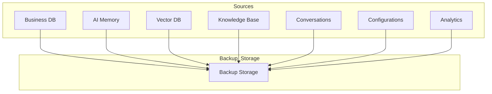
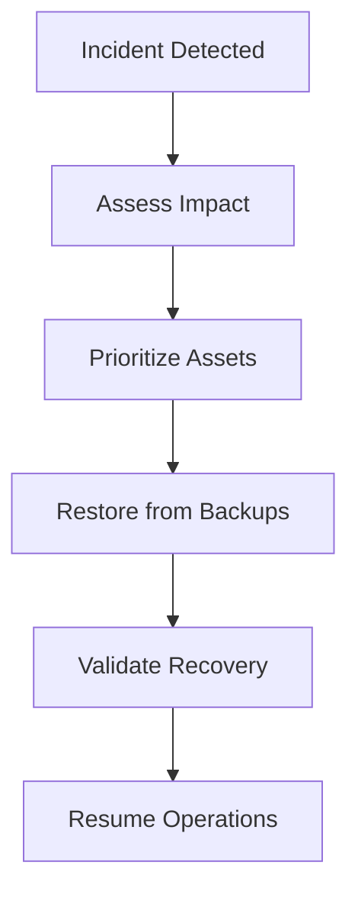
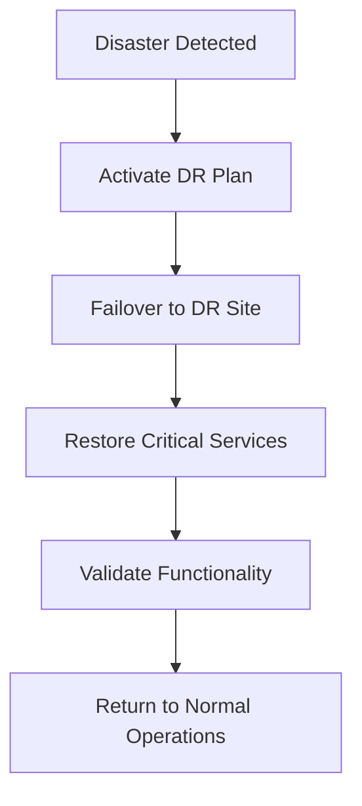
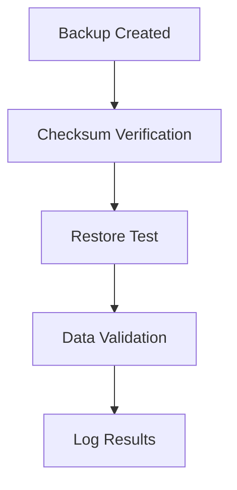
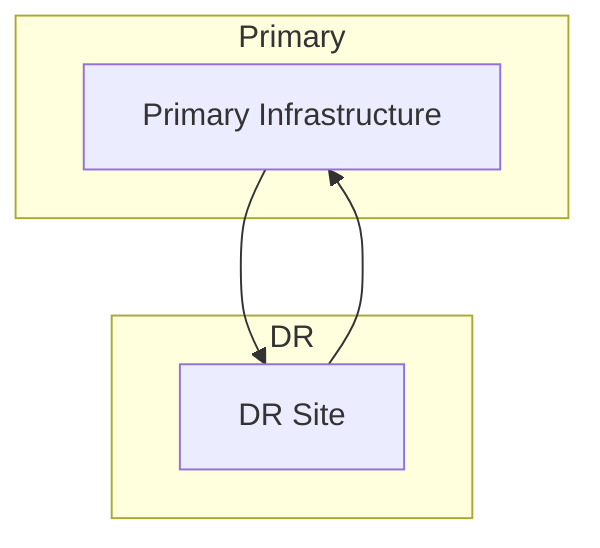

# 03_Database_Design/13_BACKUP_AND_RECOVERY.md

# Dayjoy Enterprise AI Platform — Backup and Recovery Strategy

> **Purpose:** Define the complete enterprise Backup and Recovery Strategy for the Dayjoy Enterprise AI Platform, covering how business data, AI memory, knowledge base, conversations, metadata, vector database, analytics, configurations, and system components are protected, backed up, restored, and recovered during failures or disasters.
>
> **Scope:** Logical architecture, governance, and operational strategy only — no implementation code or vendor-specific configurations.
>
> **Audience:** Data architects, DevOps/SRE teams, security and compliance teams, AI engineers, backend engineers, product owners, and business stakeholders.

---

## Table of Contents

1. [Backup & Recovery Overview](#1-backup--recovery-overview)
2. [Backup Scope](#2-backup-scope)
3. [Backup Classification](#3-backup-classification)
4. [Backup Strategy](#4-backup-strategy)
5. [Recovery Strategy](#5-recovery-strategy)
6. [Disaster Recovery](#6-disaster-recovery)
7. [Recovery Objectives](#7-recovery-objectives)
8. [Backup Governance](#8-backup-governance)
9. [Backup Validation & Testing](#9-backup-validation--testing)
10. [Future Backup Roadmap](#10-future-backup-roadmap)
11. [Architecture Diagrams](#11-architecture-diagrams)

---

## 1. Backup & Recovery Overview

### 1.1 Purpose of Backup and Recovery

Backup and recovery ensures that Dayjoy can **protect, restore, and recover** critical business data, AI memory, knowledge, and system components in the event of failures, data loss, or disasters.[02_System_Architecture/14_DISASTER_RECOVERY.md][03_Database_Design/00_DATABASE_OVERVIEW.md]

### 1.2 Business Objectives

- **Business Continuity:** Maintain operations during and after incidents.
- **Data Protection:** Prevent permanent loss of critical data.
- **AI Resilience:** Protect AI memory, RAG knowledge, and conversation context.
- **Compliance & Security:** Meet regulatory and internal requirements.
- **Operational Efficiency:** Enable rapid, reliable recovery.

### 1.3 Relationship with Business Continuity

- Backup and recovery is a core component of business continuity and disaster recovery (BC/DR) strategies.[02_System_Architecture/14_DISASTER_RECOVERY.md]
- Ensures critical services (orders, distributors, AI assistants) can be restored quickly.

### 1.4 Recovery Principles

- **Rapid Recovery:** Minimize downtime and data loss.
- **Prioritized Recovery:** Restore critical assets first.
- **Validated Recovery:** Ensure restored data integrity and functionality.
- **Documented Recovery:** Clear, repeatable procedures.

### 1.5 Enterprise Resiliency Goals

- Maintain service availability and data integrity during incidents.
- Support recovery across regions and infrastructure components.

---

## 2. Backup Scope

### 2.1 Backup Asset Catalog

| Asset ID | Asset Name | Description | Business Owner | Criticality | Recovery Priority |
|---|---|---|---|---|---|
| ASSET-DB-001 | Business Database | Core business data (customers, distributors, products, orders) | Domain Owners (CX, Distributor Mgmt, Product, Ops) | Critical | Critical |
| ASSET-AIMEM-001 | AI Memory | AI session, profile, and long-term memory | AI Team | High | High |
| ASSET-VEC-001 | Vector Database | Embeddings and vector indexes for RAG | AI Team | Critical | Critical |
| ASSET-KB-001 | Knowledge Documents | Policies, SOPs, FAQs, guides | Knowledge Team | Critical | Critical |
| ASSET-META-001 | Metadata | Document and knowledge metadata | Knowledge / AI Team | High | High |
| ASSET-CONV-001 | Conversations | Conversation history and transcripts | CX / AI Team | High | High |
| ASSET-USER-001 | User Data | User profiles and preferences | CX / IT | High | High |
| ASSET-DIST-001 | Distributor Data | Distributor profiles, hierarchy, metrics | Distributor Mgmt | Critical | Critical |
| ASSET-PROD-001 | Product Data | Product catalog and attributes | Product Team | Critical | Critical |
| ASSET-ORD-001 | Orders | Order data and line items | Order Mgmt / Ops | Critical | Critical |
| ASSET-ANL-001 | Analytics | Analytics events and dashboards | Analytics Team | High | High |
| ASSET-AUD-001 | Audit Logs | Audit trails for changes and actions | Security / Compliance | Critical | Critical |
| ASSET-CONF-001 | System Configuration | System and AI configuration | Admin / IT | Critical | Critical |
| ASSET-PROMPT-001 | AI Prompts | AI prompt templates and versions | AI Team | High | High |
| ASSET-AUTO-001 | Automation Workflows | Automation and workflow definitions | Ops / IT | High | High |
| ASSET-API-001 | API Configurations | API configurations and routes | API / IT Team | High | High |
| ASSET-DOC-001 | Documentation | Technical and business documentation | Knowledge / AI Team | Medium | Medium |

---

## 3. Backup Classification

### 3.1 Backup Categories

| Category | Business Impact | Backup Frequency | Recovery Priority | Validation Requirements |
|---|---|---|---|---|
| Critical | Severe business disruption if lost | Frequent (e.g., continuous or hourly) | Restore first | Full integrity checks, restore tests |
| High Priority | Significant disruption | Frequent (e.g., daily or more) | Restore early | Periodic integrity checks, restore tests |
| Medium Priority | Moderate disruption | Regular (e.g., daily or weekly) | Restore after critical/high | Periodic validation |
| Low Priority | Minor disruption | Periodic (e.g., weekly or monthly) | Restore last | Basic validation |

### 3.2 Mapping to Assets

- **Critical:** Business Database, Vector Database, Knowledge Documents, Distributor Data, Product Data, Orders, Audit Logs, System Configuration.
- **High Priority:** AI Memory, Metadata, Conversations, User Data, Analytics, AI Prompts, Automation Workflows, API Configurations.
- **Medium Priority:** Documentation.
- **Low Priority:** Non-essential logs and temporary data.

---

## 4. Backup Strategy

### 4.1 Logical Backup Strategies

- **Full Backups:**
  - Complete copy of all data.
  - Used: Periodically (e.g., weekly or monthly) for baseline.

- **Incremental Backups:**
  - Only data changed since last backup.
  - Used: Frequently (e.g., daily or hourly) to reduce storage and time.

- **Differential Backups:**
  - Data changed since last full backup.
  - Used: Between full backups to simplify restore.

- **Snapshot Backups:**
  - Point-in-time snapshot of system or storage.
  - Used: For critical systems and databases.

- **Versioned Backups:**
  - Maintain multiple versions of files/configs.
  - Used: For configuration, prompts, and code-related assets.

- **Archive Backups:**
  - Long-term retention backups.
  - Used: For compliance and historical data.

---

## 5. Recovery Strategy

### 5.1 Recovery Strategy Matrix

| Component | Recovery Objective | Dependencies | Validation Steps | Success Criteria |
|---|---|---|---|---|
| Business Database | Restore to latest consistent state | Backup storage, DB engine | Integrity checks, sample queries | Data integrity verified |
| AI Memory | Restore memory for active users | AI Memory storage, AI services | Spot-check memory retrieval | Memory retrieval functional |
| Vector Database | Restore embeddings and indexes | Vector DB, backup storage | Query known vectors | RAG retrieval functional |
| Knowledge Base | Restore documents and metadata | Document storage, KB service | Sample document retrieval | Documents accessible |
| Conversations | Restore conversation history | Conversation storage, AI services | Sample conversation retrieval | Conversations accessible |
| Configuration | Restore system and AI config | Config storage, deployment pipelines | Config validation | System operational with correct config |
| Analytics | Restore analytics data and dashboards | Analytics storage, BI tools | Dashboard load checks | Dashboards functional |
| Complete Platform | Restore all critical components | All above + infrastructure | End-to-end testing | Platform operational |

---

## 6. Disaster Recovery

### 6.1 Disaster Recovery Framework

| Scenario | Business Impact | Recovery Approach | Priority | Escalation Process |
|---|---|---|---|---|
| Hardware Failure | Service disruption | Replace hardware, restore from backups | Critical | DevOps → Infra Lead → CTO |
| Software Failure | Service degradation | Rollback, patch, restore | Critical | DevOps → Engineering Lead |
| Database Corruption | Data loss risk | Restore from latest good backup | Critical | DBA → Security → CTO |
| Human Error | Data/configuration loss | Restore affected assets | High | Team Lead → DevOps |
| Security Incident | Data breach risk | Isolate, forensics, restore clean | Critical | Security → CTO → Legal |
| Cloud Service Outage | Regional outage | Failover to secondary region | Critical | DevOps → Cloud Provider → CTO |
| Network Failure | Service unavailability | Restore network, failover | Critical | Network Team → Infra Lead |
| Complete Infrastructure Failure | Full outage | Full DR activation | Critical | Incident Commander → CTO → Execs |

---

## 7. Recovery Objectives

### 7.1 Recovery Time Objective (RTO)

- **Critical Systems:** < 4 hours.
- **High Priority Systems:** < 8 hours.
- **Medium/Low Priority Systems:** < 24 hours.

### 7.2 Recovery Point Objective (RPO)

- **Critical Systems:** < 1 hour data loss.
- **High Priority Systems:** < 4 hours data loss.
- **Medium/Low Priority Systems:** < 24 hours data loss.

### 7.3 Service Availability

- Target: ≥ 99.9% uptime for critical services.

### 7.4 Maximum Acceptable Data Loss

- Defined by RPO per system.

### 7.5 Business Continuity Goals

- Ensure critical services (orders, distributors, AI assistants) remain available or recover quickly.
- Maintain data integrity and compliance.

---

## 8. Backup Governance

### 8.1 Backup Ownership

- Each asset has a designated backup owner (e.g., DevOps for databases, AI Team for AI memory).

### 8.2 Recovery Ownership

- Recovery procedures owned by DevOps/SRE and domain teams.

### 8.3 Approval Process

- Backup and recovery changes require approval from Architecture Review Board for major changes.

### 8.4 Testing Schedule

- Regular DR drills (e.g., quarterly or semi-annually).

### 8.5 Documentation Standards

- All procedures documented and versioned.

### 8.6 Review Frequency

- Backup and recovery strategy reviewed annually or after major incidents.

### 8.7 Audit Requirements

- Backup and recovery activities auditable for compliance.

---

## 9. Backup Validation & Testing

### 9.1 Backup Verification

- Automated checks for backup completeness and integrity.

### 9.2 Restore Testing

- Periodic restore tests for critical assets.

### 9.3 Disaster Recovery Drills

- Simulated failures and recovery exercises.

### 9.4 Integrity Checks

- Checksums and validation for backup files.

### 9.5 Recovery Validation

- Validate restored systems function correctly.

### 9.6 Test Documentation

- Document all test results and lessons learned.

### 9.7 Continuous Improvement Process

- Use test results to improve backup and recovery procedures.

---

## 10. Future Backup Roadmap

### 10.1 Future Capabilities

| Capability | Description | Status |
|---|---|---|
| Automated Disaster Recovery | Automated failover and recovery | Future |
| Cross-Region Replication | Replicate data across regions | Future |
| Immutable Backups | Write-once, read-many backups | Future |
| AI-Assisted Recovery | AI-driven recovery recommendations | Future |
| Continuous Data Protection | Near real-time backup | Future |
| Self-Healing Recovery | Automated recovery from failures | Future |
| Multi-Cloud Backup | Backup across multiple cloud providers | Future |
| Intelligent Recovery Prioritization | AI-driven prioritization of recovery | Future |

All future capabilities must align with governance, security, and compliance frameworks.

---

## 11. Architecture Diagrams

### 11.1 Backup Architecture

### 11.2 Backup Lifecycle

### 11.3 Recovery Workflow

### 11.4 Disaster Recovery Process

### 11.5 Backup Validation Flow

### 11.6 Business Continuity Architecture

---

**END OF DOCUMENT**