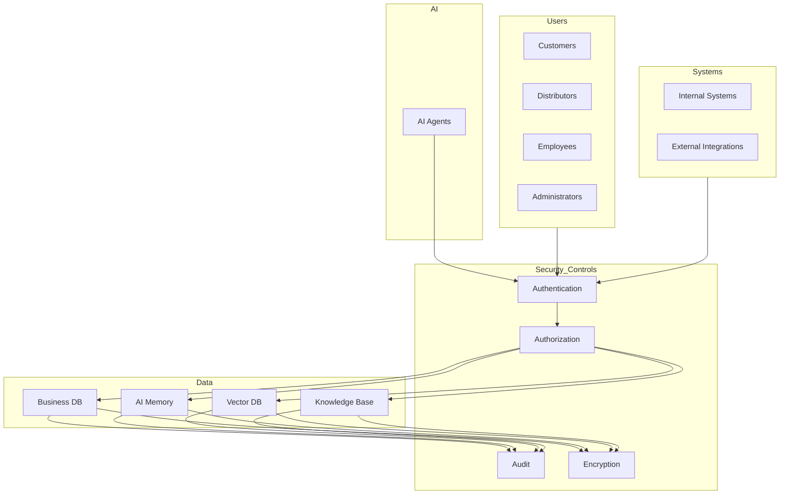
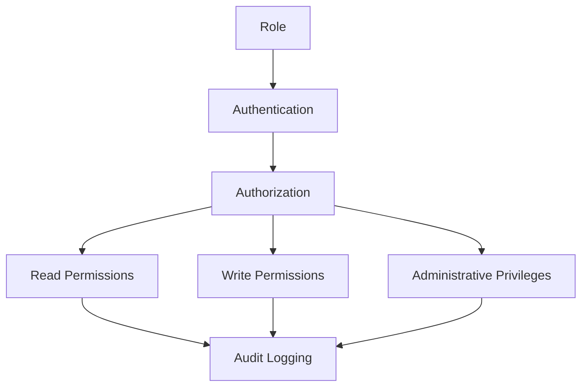
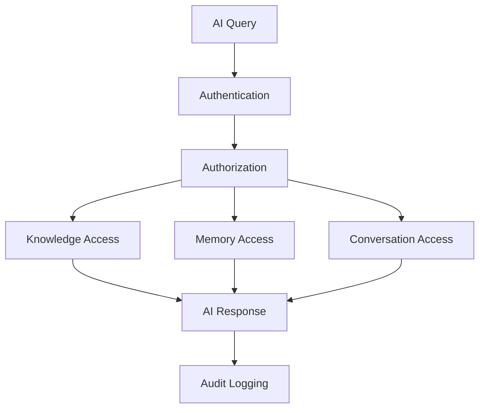
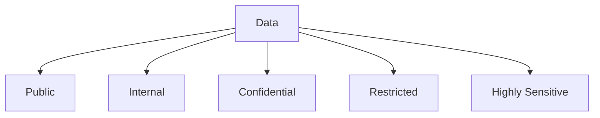
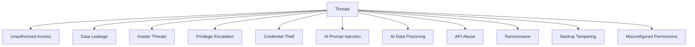
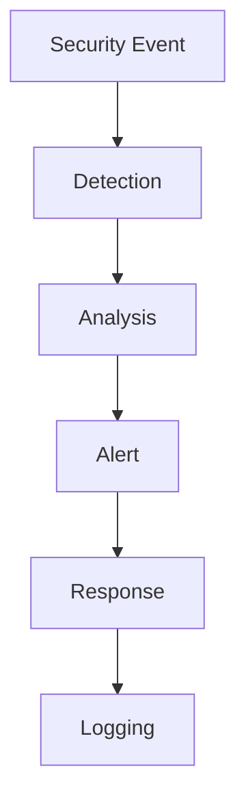
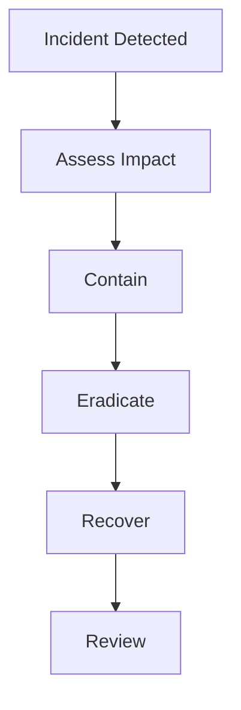

# 03_Database_Design/14_DATABASE_SECURITY.md

# Dayjoy Enterprise AI Platform — Database Security Architecture

> **Purpose:** Define the complete logical database security architecture for the Dayjoy Enterprise AI Platform, covering how business data, customer information, distributor records, AI memory, conversations, vector database, documents, metadata, analytics, and system configurations are protected against unauthorized access, data leakage, cyber threats, insider risks, and operational failures.
>
> **Scope:** Logical security architecture and governance only — no SQL permissions, implementation code, or vendor-specific configurations.
>
> **Audience:** Security architects, data architects, AI architects, DevOps/SRE teams, backend engineers, compliance teams, and business stakeholders.

---

## Table of Contents

1. [Database Security Overview](#1-database-security-overview)
2. [Security Objectives](#2-security-objectives)
3. [Data Classification & Protection](#3-data-classification--protection)
4. [Access Control Model](#4-access-control-model)
5. [AI Security Model](#5-ai-security-model)
6. [Data Protection Strategy](#6-data-protection-strategy)
7. [Threat Model](#7-threat-model)
8. [Monitoring & Auditing](#8-monitoring--auditing)
9. [Governance & Compliance](#9-governance--compliance)
10. [Future Security Roadmap](#10-future-security-roadmap)
11. [Architecture Diagrams](#11-architecture-diagrams)

---

## 1. Database Security Overview

### 1.1 Purpose of Database Security

Database security ensures that Dayjoy's data assets are **protected, controlled, and audited** to prevent unauthorized access, data leakage, cyber threats, insider risks, and operational failures.[02_System_Architecture/10_SECURITY_ARCHITECTURE.md][03_Database_Design/00_DATABASE_OVERVIEW.md]

### 1.2 Business Objectives

- **Protect Sensitive Data:** Safeguard customer, distributor, financial, and AI data.
- **Enable AI Safely:** Allow AI systems to access knowledge and memory securely.
- **Maintain Trust:** Ensure stakeholders trust the platform with their data.
- **Compliance:** Meet regulatory and internal requirements.
- **Resilience:** Withstand attacks and operational failures.

### 1.3 Security Architecture Principles

- **Least Privilege:** Minimal necessary access.
- **Defense in Depth:** Multiple layers of security controls.
- **Zero Trust:** Verify every access request.
- **Separation of Duties:** Clear boundaries between roles.
- **Auditability:** All access and changes logged.

### 1.4 Relationship with AI Systems, APIs, and Business Operations

- **AI Systems:** Access knowledge, memory, and conversations under strict controls.
- **APIs:** Enforce access control and auditing for all data access.
- **Business Operations:** Support operational needs while protecting sensitive data.

### 1.5 Enterprise Security Philosophy

- Security is a business enabler, not a blocker.
- Security is integrated into every layer of the platform.
- Security is continuously monitored and improved.

---

## 2. Security Objectives

### 2.1 Core Security Objectives

| Objective | Description | Business Importance |
|---|---|---|
| Confidentiality | Prevent unauthorized data access | Protect sensitive data and privacy |
| Integrity | Ensure data accuracy and consistency | Prevent tampering and corruption |
| Availability | Ensure data is accessible when needed | Support business continuity |
| Authentication | Verify user and system identity | Prevent unauthorized access |
| Authorization | Control access to data and functions | Enforce least privilege |
| Accountability | Track and attribute actions | Support audits and investigations |
| Privacy | Protect personal data | Comply with regulations and user trust |
| Compliance | Meet legal and regulatory requirements | Avoid penalties and reputational damage |
| Auditability | Log and review access and changes | Support security and compliance |
| Resilience | Withstand and recover from attacks | Ensure business continuity |

---

## 3. Data Classification & Protection

### 3.1 Data Classification Matrix

| Classification | Description | Business Examples | Access Requirements | Encryption Requirement | AI Access Policy | Retention Considerations |
|---|---|---|---|---|---|---|
| Public | Data intended for public access | Marketing content, public product info | No authentication required | Optional | Allowed | As per retention policy |
| Internal | Data for internal use only | Internal docs, system configs | Employee authentication | Recommended | Restricted | Standard retention |
| Confidential | Sensitive business data | Customer data, distributor data | Authenticated + authorized | Required | Restricted with controls | Standard retention |
| Restricted | Highly sensitive data | Financial data, compensation plans | Authenticated + authorized + audit | Required | Highly restricted or denied | Extended retention for compliance |
| Highly Sensitive | Critical security or legal data | Security credentials, legal docs | Strictly controlled + audit | Required | Denied | Extended retention for compliance |

---

## 4. Access Control Model

### 4.1 Access Control Matrix

| Role | Authentication Method | Authorization Scope | Read Permissions | Write Permissions | Administrative Privileges | Audit Requirements |
|---|---|---|---|---|---|---|
| Customer | Email/password, OAuth | Own data only | Own profile, orders | Own profile updates | None | All access logged |
| Distributor | Email/password, OAuth | Own data + downline | Own profile, downline metrics | Own profile, some downline | Limited (downline) | All access logged |
| Employee | SSO, MFA | Departmental data | Departmental data | Departmental data | None | All access logged |
| Administrator | SSO, MFA | System-wide | All data | All data | Full | All access logged + audit |
| AI Agent | Service account, API key | Scoped by function | Knowledge, memory (scoped) | Memory updates (scoped) | None | All AI actions logged |
| Internal Systems | Service account, API key | System-specific | System data | System data | Limited | All actions logged |
| External Integrations | API key, OAuth | Integration-specific | Integration data | Integration data | None | All actions logged |

---

## 5. AI Security Model

### 5.1 AI Security Matrix

| Aspect | Description | Security Controls |
|---|---|---|
| Knowledge Base Access | AI access to documents and chunks | Scoped by access_level, trust_level, category |
| AI Memory Access | AI access to user memory | Scoped by user_id, consent, importance |
| Conversation Access | AI access to conversation history | Scoped by conversation_id, user consent |
| Prompt Protection | Protect prompt templates and versions | Versioned, access-controlled, audit logged |
| Tool Authorization | AI tool execution controls | Scoped by tool_name, user/distributor, status |
| Context Isolation | Isolate AI context per user/session | Session-scoped context |
| Memory Isolation | Isolate AI memory per user | User-scoped memory |
| Sensitive Data Handling | Handle sensitive data securely | Redact or mask sensitive fields |
| AI Permission Boundaries | Define AI access limits | Explicit allow/deny per data type |

---

## 6. Data Protection Strategy

### 6.1 Protection Goals by Data Category

| Data Category | Protection Goals |
|---|---|
| Customer Data | Confidentiality, integrity, privacy, access control |
| Distributor Data | Confidentiality, integrity, access control, audit |
| Product Information | Integrity, availability, access control |
| Orders | Confidentiality, integrity, availability, audit |
| AI Memory | Confidentiality, integrity, user consent, isolation |
| Conversations | Confidentiality, integrity, access control, audit |
| Documents | Integrity, availability, access control, versioning |
| Metadata | Integrity, availability, access control |
| Analytics | Confidentiality, integrity, access control |
| Audit Logs | Integrity, availability, immutability, audit |
| System Configuration | Confidentiality, integrity, access control, versioning |

---

## 7. Threat Model

### 7.1 Threat Assessment Framework

| Threat ID | Threat Description | Business Impact | Risk Level | Recommended Mitigation |
|---|---|---|---|---|
| THR-001 | Unauthorized Access | Data breach, compliance violations | High | Strong authentication, least privilege, access control |
| THR-002 | Data Leakage | Sensitive data exposure | High | Encryption, access control, DLP |
| THR-003 | Insider Threats | Data theft, sabotage | High | Access control, audit, separation of duties |
| THR-004 | Privilege Escalation | Unauthorized elevated access | High | Least privilege, audit, monitoring |
| THR-005 | Credential Theft | Account compromise | High | MFA, secure credential storage |
| THR-006 | AI Prompt Injection | AI manipulation, data leakage | Medium | Prompt validation, input sanitization |
| THR-007 | AI Data Poisoning | Corrupted AI behavior | Medium | Data validation, trust levels |
| THR-008 | API Abuse | Service disruption, data leakage | Medium | Rate limiting, API authentication |
| THR-009 | Ransomware | Data encryption, service disruption | High | Backups, disaster recovery |
| THR-010 | Backup Tampering | Data loss, recovery failure | High | Secure backups, immutable backups |
| THR-011 | Misconfigured Permissions | Unauthorized access | Medium | Regular access reviews, audits |

---

## 8. Monitoring & Auditing

### 8.1 Security Monitoring Metrics

| Metric | Description | Target |
|---|---|---|
| Login Events | Successful logins | Monitor for anomalies |
| Failed Authentication | Failed login attempts | Alert on high volume |
| Privilege Changes | Changes to user roles/permissions | Audit all changes |
| Data Access | Access to sensitive data | Monitor and audit |
| Sensitive Queries | Queries on sensitive data | Audit and alert |
| AI Activity | AI actions and tool usage | Monitor and audit |
| Administrative Actions | Admin actions | Audit all actions |
| Backup Events | Backup creation, restoration | Monitor and audit |
| Security Alerts | Security incidents | Immediate response |

### 8.2 Recommended Audit Reports

- Access logs for sensitive data.
- Privilege change logs.
- AI activity logs.
- Backup and recovery logs.
- Security incident reports.

---

## 9. Governance & Compliance

### 9.1 Security Ownership

- Each data domain has a security owner responsible for access control and compliance.

### 9.2 Security Review Process

- Regular security reviews (e.g., quarterly) of access control, threats, and incidents.

### 9.3 Access Review Frequency

- Regular access reviews (e.g., quarterly) to ensure least privilege.

### 9.4 Incident Response Responsibilities

- Security team leads incident response; domain owners assist.

### 9.5 Documentation Standards

- All security policies, procedures, and incidents documented.

### 9.6 Compliance Considerations

- Policies aligned with applicable regulations (e.g., GDPR, CCPA, financial regulations).

### 9.7 Change Approval Process

- Security changes require approval from Security and Architecture Review Boards.

---

## 10. Future Security Roadmap

### 10.1 Future Capabilities

| Capability | Description | Status |
|---|---|---|
| Zero Trust Architecture | Verify every access request | Future |
| Attribute-Based Access Control (ABAC) | Access based on attributes | Future |
| AI Risk Monitoring | Monitor AI for security risks | Future |
| Behavioral Analytics | Detect anomalous behavior | Future |
| Continuous Threat Detection | Continuous monitoring for threats | Future |
| Automated Security Audits | Automated access and config audits | Future |
| Data Loss Prevention (DLP) | Prevent data leakage | Future |
| Confidential Computing | Secure computation on encrypted data | Future |
| Security Operations Dashboard | Centralized security monitoring | Future |

All future capabilities must align with governance, security, and compliance frameworks.

---

## 11. Architecture Diagrams

### 11.1 Database Security Architecture

### 11.2 Access Control Model

### 11.3 AI Security Flow

### 11.4 Data Classification Model

### 11.5 Threat Model

### 11.6 Security Monitoring Workflow

### 11.7 Incident Response Process

---

**END OF DOCUMENT**