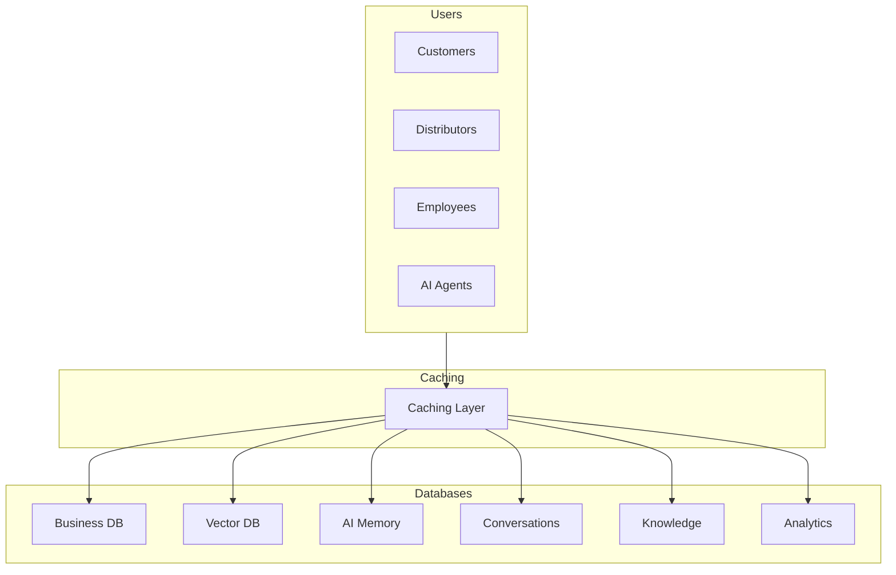
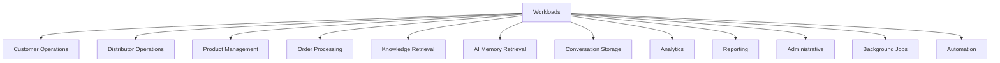
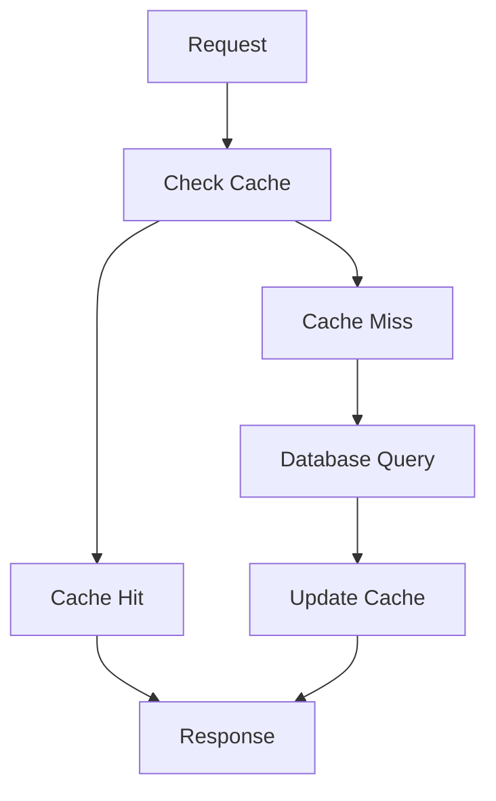
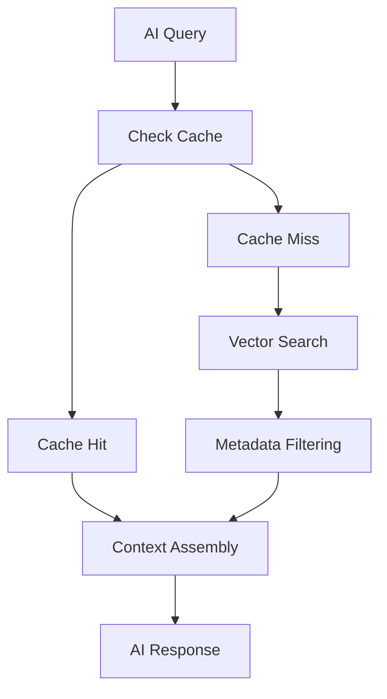
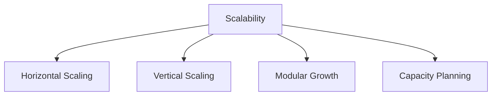
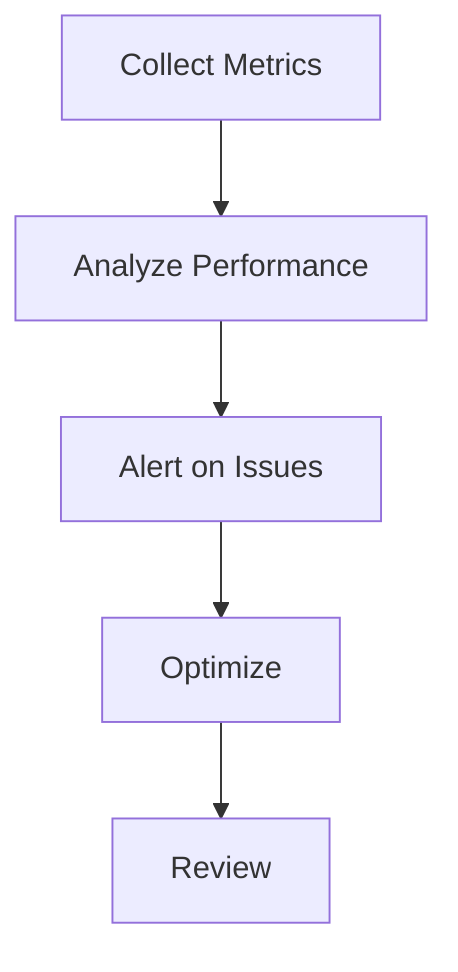

# 03_Database_Design/15_DATABASE_PERFORMANCE.md

# Dayjoy Enterprise AI Platform — Database Performance Architecture

> **Purpose:** Define the complete logical database performance architecture for the Dayjoy Enterprise AI Platform, covering how the database ecosystem will achieve high performance, scalability, low latency, reliability, and efficient resource utilization while supporting business growth, AI workloads, RAG retrieval, analytics, and real-time user interactions.
>
> **Scope:** Logical architecture and performance strategy only — no SQL optimization scripts, vendor-specific tuning parameters, or implementation code.
>
> **Audience:** Data architects, solution architects, backend engineers, AI engineers, DevOps/SRE teams, product owners, and business stakeholders.

---

## Table of Contents

1. [Performance Architecture Overview](#1-performance-architecture-overview)
2. [Performance Objectives](#2-performance-objectives)
3. [Workload Analysis](#3-workload-analysis)
4. [Scalability Strategy](#4-scalability-strategy)
5. [Query Performance Strategy](#5-query-performance-strategy)
6. [Caching Strategy](#6-caching-strategy)
7. [AI Performance](#7-ai-performance)
8. [Performance Monitoring](#8-performance-monitoring)
9. [Capacity Planning](#9-capacity-planning)
10. [Governance](#10-governance)
11. [Future Performance Roadmap](#11-future-performance-roadmap)
12. [Architecture Diagrams](#12-architecture-diagrams)

---

## 1. Performance Architecture Overview

### 1.1 Purpose of Database Performance Planning

Database performance planning ensures that Dayjoy's data systems deliver **fast, reliable, and scalable** responses for business operations, AI systems, and user interactions.[03_Database_Design/00_DATABASE_OVERVIEW.md][02_System_Architecture/08_DATABASE_ARCHITECTURE.md]

### 1.2 Business Objectives

- **Fast User Experience:** Low-latency responses for customers and distributors.
- **AI Performance:** Fast RAG retrieval and AI response generation.
- **Scalability:** Support growing users, data, and AI workloads.
- **Reliability:** Consistent performance under load.
- **Cost Efficiency:** Optimize resource usage and infrastructure costs.

### 1.3 Performance Design Philosophy

- Design for performance from the start.
- Optimize for common workloads.
- Use caching and indexing strategically.
- Monitor and tune continuously.

### 1.4 Relationship Between Performance, Scalability, AI Systems, and User Experience

- Performance and scalability directly impact user satisfaction and AI effectiveness.
- Fast AI retrieval and response generation improve user trust and engagement.
- Efficient data access supports real-time interactions and analytics.

### 1.5 Enterprise Performance Principles

- **User-Centric:** Optimize for end-user and AI experience.
- **Data-Driven:** Use metrics to guide optimization.
- **Scalable:** Design for growth.
- **Efficient:** Minimize resource waste.
- **Resilient:** Maintain performance under load.

---

## 2. Performance Objectives

### 2.1 Performance Objectives Matrix

| Objective | Description | Business Value | Success Criteria |
|---|---|---|---|
| Low Response Time | Fast query and API responses | Improved user experience | < 200–500ms for typical queries |
| High Throughput | Handle many concurrent requests | Support growth and peak loads | High QPS without degradation |
| Scalability | Grow capacity with demand | Support business expansion | Linear or near-linear scaling |
| High Availability | Minimize downtime | Business continuity | ≥ 99.9% uptime |
| Reliability | Consistent performance | Trust and predictability | Stable latency and throughput |
| Efficient Resource Usage | Optimize CPU, memory, storage | Cost efficiency | High utilization without bottlenecks |
| Fast AI Retrieval | Quick RAG and memory access | Effective AI responses | < 500ms AI retrieval |
| Business Continuity | Maintain operations during incidents | Resilience | Quick recovery, minimal data loss |

---

## 3. Workload Analysis

### 3.1 Workload Categories

| Workload | Read Pattern | Write Pattern | Peak Usage | Performance Priority |
|---|---|---|---|---|
| Customer Operations | Frequent reads (profiles, orders) | Moderate writes (updates, new orders) | High (campaigns, promotions) | High |
| Distributor Operations | Frequent reads (downline, metrics) | Moderate writes (updates, enrollments) | High (payout cycles) | High |
| Product Management | Frequent reads (catalog) | Moderate writes (updates, new products) | Medium | High |
| Order Processing | Frequent reads/writes (orders, status) | High writes (new orders, updates) | High (sales events) | Critical |
| Knowledge Retrieval | Frequent reads (documents, chunks) | Low writes (updates, new docs) | Medium–High | High |
| AI Memory Retrieval | Frequent reads (user memory) | Moderate writes (updates) | Medium–High | High |
| Conversation Storage | Frequent reads/writes (messages) | High writes (new messages) | High | High |
| Analytics | Frequent reads (dashboards, reports) | Moderate writes (events) | Medium | Medium–High |
| Reporting | Frequent reads (aggregations) | Low writes | Medium | Medium |
| Administrative Operations | Frequent reads/writes (configs, users) | Moderate writes | Low–Medium | Medium |
| Background Jobs | Batch reads/writes | High writes (processing) | Off-peak | Medium |
| Automation | Frequent reads/writes (triggers, actions) | Moderate–High writes | Medium | High |

---

## 4. Scalability Strategy

### 4.1 Logical Scalability by Component

| Component | Horizontal Scaling | Vertical Scaling | Modular Growth | Capacity Planning |
|---|---|---|---|---|
| Business Database | Read replicas, sharding by domain | Increase CPU/memory | Domain-based modules | Growth-based milestones |
| Vector Database | Sharding, distributed nodes | Increase resources | Namespace-based | AI usage growth |
| AI Memory | Partition by user/session | Increase resources | User-based partitions | User/AI growth |
| Conversation Storage | Partition by user/channel | Increase resources | Channel-based | Conversation growth |
| Knowledge Repository | Partition by category/domain | Increase resources | Domain-based | Document growth |
| Metadata | Partition by domain | Increase resources | Domain-based | Metadata growth |
| Analytics | Distributed processing | Increase resources | Event-based | Analytics growth |
| Logging | Distributed logging | Increase resources | Service-based | Log volume growth |

### 4.2 Capacity Planning Principles

- Plan for growth based on user, data, and AI usage projections.
- Define scaling milestones (e.g., users, orders, documents thresholds).

---

## 5. Query Performance Strategy

### 5.1 Optimization Principles

- **Business Queries:**
  - Optimize for common filters and sorts (e.g., orders by date, distributors by rank).

- **AI Retrieval:**
  - Optimize vector and metadata queries for RAG.

- **Search Operations:**
  - Optimize full-text and semantic search.

- **Dashboard Queries:**
  - Optimize aggregations and time-series queries.

- **Reports:**
  - Optimize batch and summary queries.

- **Bulk Operations:**
  - Use batch processing for large operations.

- **Pagination:**
  - Optimize for efficient page retrieval.

- **Filtering & Sorting:**
  - Index common filter and sort fields.

---

## 6. Caching Strategy

### 6.1 Logical Caching Architecture

| Cache Type | Purpose | Refresh Strategy | Invalidation Strategy | Business Benefits |
|---|---|---|---|---|
| Business Data Cache | Cache frequently accessed business data | Periodic refresh | On data change | Faster API responses |
| AI Context Cache | Cache AI context and memory | Session-based | On session end | Faster AI responses |
| Knowledge Cache | Cache popular knowledge documents | Periodic refresh | On document update | Faster RAG retrieval |
| Metadata Cache | Cache metadata for filtering | Periodic refresh | On metadata change | Faster filtering |
| Search Cache | Cache common search results | Periodic refresh | On data change | Faster search |
| Session Cache | Cache user session data | Session-based | On session end | Faster session access |
| API Cache | Cache API responses | Periodic refresh | On data change | Faster API responses |
| Analytics Cache | Cache analytics aggregations | Periodic refresh | On data change | Faster dashboards |

---

## 7. AI Performance

### 7.1 AI Performance Framework

| Component | Optimization Goals |
|---|---|
| RAG Retrieval | < 500ms retrieval time |
| Embedding Search | Fast vector similarity search |
| Memory Retrieval | Fast user/memory lookup |
| Context Assembly | Efficient context construction |
| Prompt Processing | Minimal prompt overhead |
| Tool Execution | Fast tool response times |
| AI Response Generation | Low-latency AI responses |

---

## 8. Performance Monitoring

### 8.1 Performance Monitoring Metrics

| Metric | Description | Target |
|---|---|---|
| Query Response Time | Time to execute queries | < 200–500ms |
| AI Retrieval Time | Time for AI to retrieve context | < 500ms |
| Search Latency | Time for search results | < 500ms |
| Cache Effectiveness | Cache hit rate | High hit rate |
| Storage Growth | Data growth over time | Monitor trends |
| Throughput | Queries/operations per second | High QPS |
| Concurrent Users | Active users | Monitor peaks |
| System Utilization | CPU, memory, storage usage | Optimal utilization |
| Error Rates | Query/API errors | Low error rate |

### 8.2 Recommended KPIs

- P50, P95, P99 latency for queries and AI retrieval.
- Cache hit rates for business data, AI context, knowledge.
- Throughput (QPS) for critical endpoints.
- Error rates for queries and APIs.
- Storage growth trends.

---

## 9. Capacity Planning

### 9.1 Capacity Planning Model

| Dimension | Planning Considerations | Scaling Milestones |
|---|---|---|
| Data Growth | Project data volume growth | Scale at thresholds |
| User Growth | Project user growth | Scale at user thresholds |
| AI Usage Growth | Project AI queries and memory | Scale at AI usage thresholds |
| Document Growth | Project knowledge document growth | Scale at document thresholds |
| Conversation Growth | Project conversation volume | Scale at conversation thresholds |
| Knowledge Expansion | Project new knowledge domains | Scale as domains added |
| Future Services | Plan for new services | Scale as services launched |

---

## 10. Governance

### 10.1 Performance Ownership

- Each domain has a performance owner responsible for monitoring and optimization.

### 10.2 Monitoring Responsibilities

- DevOps/SRE teams monitor system performance; domain teams optimize queries and data access.

### 10.3 Review Frequency

- Regular performance reviews (e.g., quarterly).

### 10.4 Capacity Reviews

- Regular capacity planning reviews (e.g., quarterly).

### 10.5 Documentation Standards

- All performance metrics, optimizations, and capacity plans documented.

### 10.6 Continuous Improvement Process

- Use monitoring data to drive continuous performance improvements.

---

## 11. Future Performance Roadmap

### 11.1 Future Enhancements

| Enhancement | Description | Status |
|---|---|---|
| Distributed Databases | Scale across multiple nodes/regions | Future |
| Intelligent Query Optimization | AI-driven query optimization | Future |
| AI-Based Performance Monitoring | AI-driven performance insights | Future |
| Adaptive Caching | Dynamic cache management | Future |
| Edge Data Processing | Process data closer to users | Future |
| Global Read Replicas | Read replicas across regions | Future |
| Event-Driven Data Processing | Real-time data processing | Future |
| Predictive Capacity Planning | AI-driven capacity forecasting | Future |
| Autonomous Database Optimization | Self-tuning databases | Future |

All future enhancements must align with governance, security, and business objectives.

---

## 12. Architecture Diagrams

### 12.1 Performance Architecture

### 12.2 Workload Distribution

### 12.3 Caching Architecture

### 12.4 AI Retrieval Performance Flow

### 12.5 Scalability Model

### 12.6 Performance Monitoring Workflow

### 12.7 Capacity Growth Roadmap

---

**END OF DOCUMENT**