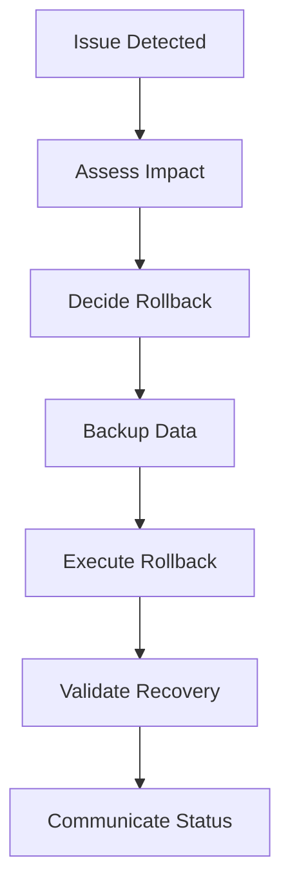
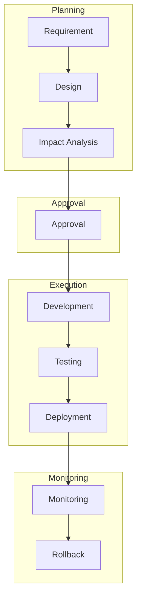
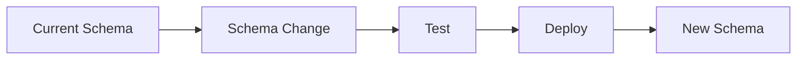
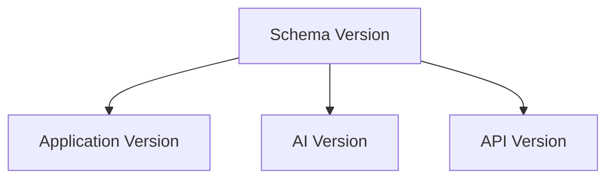
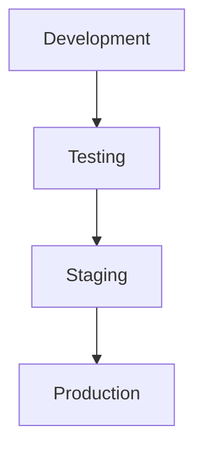
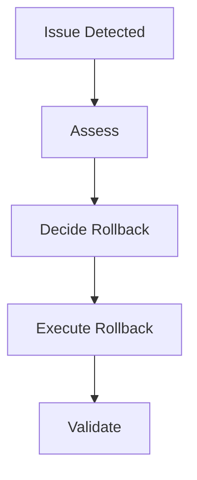
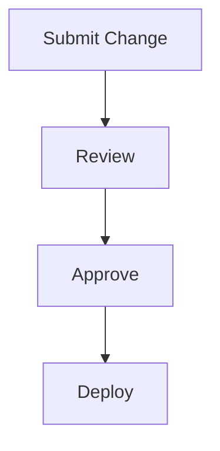
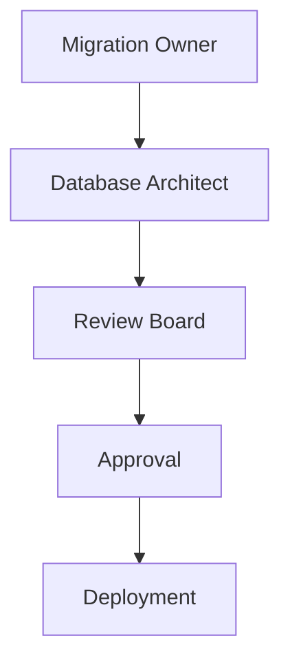

# 03_Database_Design/16_DATABASE_MIGRATION.md

# Dayjoy Enterprise AI Platform — Database Migration & Schema Evolution Strategy

> **Purpose:** Define the complete database migration and schema evolution strategy for the Dayjoy Enterprise AI Platform, covering how database changes are planned, versioned, reviewed, tested, deployed, validated, rolled back, documented, and governed throughout the platform's lifecycle.
>
> **Scope:** Logical migration architecture and governance only — no SQL migration scripts or vendor-specific migration commands.
>
> **Audience:** Data architects, solution architects, backend engineers, DevOps/SRE teams, AI engineers, product owners, and business stakeholders.

---

## Table of Contents

1. [Migration Strategy Overview](#1-migration-strategy-overview)
2. [Schema Evolution Principles](#2-schema-evolution-principles)
3. [Migration Categories](#3-migration-categories)
4. [Migration Lifecycle](#4-migration-lifecycle)
5. [Version Management](#5-version-management)
6. [Impact Analysis](#6-impact-analysis)
7. [Testing & Validation](#7-testing--validation)
8. [Rollback Strategy](#8-rollback-strategy)
9. [Governance](#9-governance)
10. [Risk Assessment](#10-risk-assessment)
11. [Future Migration Roadmap](#11-future-migration-roadmap)
12. [Architecture Diagrams](#12-architecture-diagrams)

---

## 1. Migration Strategy Overview

### 1.1 Purpose of Database Migrations

Database migrations ensure that Dayjoy's data schema evolves **safely, consistently, and continuously** to support business growth, AI advancements, and operational needs without disrupting services or compromising data integrity.[03_Database_Design/00_DATABASE_OVERVIEW.md][02_System_Architecture/08_DATABASE_ARCHITECTURE.md]

### 1.2 Business Objectives

- **Business Continuity:** Avoid downtime during schema changes.
- **AI Stability:** Ensure AI systems remain compatible with schema changes.
- **Data Integrity:** Maintain data accuracy and consistency.
- **Backward Compatibility:** Support existing clients and integrations.
- **Continuous Delivery:** Enable rapid, safe deployment of changes.

### 1.3 Schema Evolution Philosophy

- Schema changes are inevitable and should be managed systematically.
- Changes should be incremental, tested, and reversible.
- Compatibility with existing systems and data is paramount.

### 1.4 Continuous Delivery Considerations

- Migrations must support frequent, automated deployments.
- Changes should be backward compatible to avoid breaking existing clients.

### 1.5 Enterprise Migration Principles

- **Planned:** All changes are planned and reviewed.
- **Tested:** All changes are thoroughly tested.
- **Reversible:** All changes can be rolled back safely.
- **Documented:** All changes are documented and versioned.
- **Governed:** All changes follow governance and approval processes.

---

## 2. Schema Evolution Principles

### 2.1 Core Principles

| Principle | Description | Importance |
|---|---|---|
| Backward Compatibility | New schema supports old clients | Prevents breaking existing systems |
| Forward Compatibility | Old schema can tolerate new data | Supports gradual rollouts |
| Incremental Changes | Small, manageable changes | Reduces risk and complexity |
| Safe Rollback | All changes can be reversed | Ensures business continuity |
| Zero Data Loss | No data is lost during migrations | Protects business value |
| Version Control | All schema changes are versioned | Enables tracking and reproducibility |
| Change Isolation | Changes are isolated and tested | Prevents unintended side effects |
| AI Compatibility | AI systems remain functional | Ensures AI stability |
| Auditability | All changes are logged and auditable | Supports compliance and troubleshooting |

---

## 3. Migration Categories

### 3.1 Migration Category Catalog

| Category ID | Category | Description | Business Impact | Risk Level | Approval Requirements |
|---|---|---|---|---|---|
| MIG-NEW-TBL-001 | New Tables | Add new tables | Low–Medium | Low | Domain owner + DBA |
| MIG-NEW-FLD-001 | New Fields | Add new fields | Low | Low | Domain owner |
| MIG-MOD-FLD-001 | Modified Fields | Change field types/constraints | Medium–High | Medium–High | Domain owner + DBA + Architecture Review |
| MIG-DEP-FLD-001 | Deprecated Fields | Remove or deprecate fields | Medium | Medium | Domain owner + DBA + Architecture Review |
| MIG-REL-001 | Relationship Changes | Add/modify relationships | Medium | Medium | Domain owner + DBA |
| MIG-META-001 | Metadata Updates | Update metadata schemas | Low | Low | Knowledge/AI team |
| MIG-AIMEM-001 | AI Memory Changes | Modify AI memory schema | Medium | Medium | AI team + DBA |
| MIG-VEC-001 | Vector Database Changes | Modify vector schema/indexes | Medium | Medium | AI team + DBA |
| MIG-SEC-001 | Security Updates | Update security-related schema | High | High | Security + DBA + Architecture Review |
| MIG-CONF-001 | Configuration Changes | Update configuration schema | Low–Medium | Low | Admin/IT + DBA |
| MIG-PERF-001 | Performance Improvements | Indexes, partitioning, etc. | Medium | Medium | DBA + Domain owner |
| MIG-DATA-001 | Data Corrections | Fix data issues | Medium–High | Medium | Domain owner + DBA |

---

## 4. Migration Lifecycle

### 4.1 Lifecycle Stages

1. **Requirement Identification:** Identify need for schema change.
2. **Design Review:** Review design with architects and domain owners.
3. **Impact Analysis:** Assess impact on business, AI, and systems.
4. **Approval:** Obtain approval from governance board.
5. **Development:** Develop migration scripts and tests.
6. **Testing:** Test migration in staging environment.
7. **Validation:** Validate migration results and data integrity.
8. **Deployment:** Deploy migration to production.
9. **Monitoring:** Monitor post-deployment for issues.
10. **Rollback (if required):** Rollback if issues detected.
11. **Documentation Update:** Update documentation and versioning.

### 4.2 Migration Lifecycle Diagram

```mermaid
flowchart LR
    REQ[Requirement] --> DESIGN[Design Review]
    DESIGN --> IMPACT[Impact Analysis]
    IMPACT --> APPROVE[Approval]
    APPROVE --> DEV[Development]
    DEV --> TEST[Testing]
    TEST --> VAL[Validation]
    VAL --> DEPLOY[Deployment]
    DEPLOY --> MON[Monitoring]
    MON --> ROLLBACK[Rollback if needed]
    ROLLBACK --> DOC[Documentation Update]
```

---

## 5. Version Management

### 5.1 Schema Versioning Strategy

- Use semantic versioning for schema changes (e.g., `1.0.0`, `1.1.0`, `2.0.0`).

### 5.2 Migration Numbering Convention

- Migrations numbered sequentially (e.g., `001_add_users_table`, `002_add_email_index`).

### 5.3 Release Version Mapping

- Map schema versions to application/AI release versions.

### 5.4 AI Knowledge Version Compatibility

- Ensure AI systems are compatible with schema versions.

### 5.5 Metadata & Document Version Synchronization

- Synchronize metadata and document versions with schema changes.

### 5.6 Version Consistency

- All components (APIs, AI, services) must be version-aligned to avoid incompatibilities.

---

## 6. Impact Analysis

### 6.1 Impact Assessment Matrix

| Migration Type | Business Operations | Customer Data | Distributor Data | Orders | AI Memory | Conversations | Knowledge Base | Vector DB | APIs | Analytics | Automation |
|---|---|---|---|---|---|---|---|---|---|---|---|
| New Tables | Low | None | None | None | None | None | None | None | Low | None | Low |
| New Fields | Low | Low | Low | Low | Low | Low | Low | Low | Low | Low | Low |
| Modified Fields | Medium | Medium | Medium | Medium | Medium | Medium | Medium | Medium | Medium | Medium | Medium |
| Deprecated Fields | Medium | Medium | Medium | Medium | Medium | Medium | Medium | Medium | Medium | Medium | Medium |
| Relationship Changes | Medium | Medium | Medium | Medium | Medium | Medium | Medium | Medium | Medium | Medium | Medium |
| Metadata Updates | Low | Low | Low | Low | Low | Low | Medium | Low | Low | Low | Low |
| AI Memory Changes | Medium | Low | Low | Low | High | Medium | Low | Medium | Medium | Low | Medium |
| Vector DB Changes | Low | Low | Low | Low | Medium | Low | Medium | High | Medium | Low | Low |
| Security Updates | Medium | High | High | High | High | High | High | High | High | Medium | High |
| Configuration Changes | Low | Low | Low | Low | Low | Low | Low | Low | Low | Low | Low |
| Performance Improvements | Low | Low | Low | Low | Low | Low | Low | Medium | Low | Low | Low |
| Data Corrections | Medium | High | High | High | Medium | Medium | Medium | Medium | Medium | Medium | Medium |

---

## 7. Testing & Validation

### 7.1 Testing & Validation Framework

| Validation Type | Description | Success Criteria |
|---|---|---|
| Schema Validation | Verify schema changes | Schema matches design |
| Data Integrity | Verify data is intact | No data loss or corruption |
| Business Rule Validation | Verify business rules | Business rules enforced |
| AI Retrieval Validation | Verify AI retrieval | AI retrieves correct data |
| RAG Validation | Verify RAG functionality | RAG works as expected |
| Performance Testing | Verify performance | No performance regression |
| Regression Testing | Verify existing functionality | No regressions |
| Security Validation | Verify security controls | Security maintained |
| User Acceptance Testing | Verify user requirements | Users approve changes |

---

## 8. Rollback Strategy

### 8.1 Rollback Planning

- **Rollback Triggers:**
  - Data corruption, performance issues, service failures.

- **Rollback Decision Process:**
  - Assess impact, decide rollback if critical.

- **Data Protection Measures:**
  - Backup data before rollback.

- **Partial vs Full Rollback:**
  - Partial for localized issues; full for critical failures.

- **Recovery Validation:**
  - Validate data and functionality after rollback.

- **Communication Process:**
  - Notify stakeholders of rollback.

### 8.2 Rollback Workflow Diagram

---

## 9. Governance

### 9.1 Migration Governance Model

- **Migration Owner:** Domain owner responsible for migration.
- **Database Architect Responsibilities:** Design and review migrations.
- **Review Board:** Architecture Review Board approves major changes.
- **Approval Workflow:** Defined approval process for migrations.
- **Documentation Standards:** All migrations documented and versioned.
- **Change Management Process:** Formal change management process.
- **Audit Requirements:** All migrations auditable.

---

## 10. Risk Assessment

### 10.1 Risk Assessment Matrix

| Risk ID | Risk | Risk Level | Business Impact | Preventive Measures | Recovery Plan |
|---|---|---|---|---|---|
| RISK-001 | Data Loss | High | Severe | Backups, testing | Restore from backup |
| RISK-002 | Downtime | High | Severe | Zero-downtime migrations | Rollback, failover |
| RISK-003 | Schema Conflicts | Medium | Moderate | Version control, testing | Resolve conflicts, rollback |
| RISK-004 | AI Compatibility Issues | Medium | Moderate | AI testing, versioning | Rollback, AI updates |
| RISK-005 | API Breakage | High | Severe | Backward compatibility | Rollback, API updates |
| RISK-006 | Performance Regression | Medium | Moderate | Performance testing | Optimize, rollback |
| RISK-007 | Migration Failure | High | Severe | Testing, dry runs | Rollback, recovery |
| RISK-008 | Incomplete Rollback | Medium | Moderate | Rollback testing | Complete rollback, recovery |

---

## 11. Future Migration Roadmap

### 11.1 Future Capabilities

| Capability | Description | Status |
|---|---|---|
| Automated Schema Evolution | Automated migration generation | Future |
| AI-Assisted Migration Planning | AI-driven migration recommendations | Future |
| Continuous Database Validation | Continuous validation of schema | Future |
| Intelligent Rollback Prediction | AI-driven rollback decisions | Future |
| Blue-Green Database Deployments | Zero-downtime deployments | Future |
| Multi-Region Migration Coordination | Coordinated multi-region migrations | Future |
| Zero-Downtime Migration Automation | Automated zero-downtime migrations | Future |
| Self-Healing Migration Pipelines | Self-healing migration processes | Future |

All future capabilities must align with governance, security, and business objectives.

---

## 12. Architecture Diagrams

### 12.1 Migration Architecture

### 12.2 Schema Evolution Workflow

### 12.3 Version Management Flow

### 12.4 Deployment Pipeline

### 12.5 Rollback Workflow

### 12.6 Change Approval Process

### 12.7 Migration Governance Model

---

**END OF DOCUMENT**