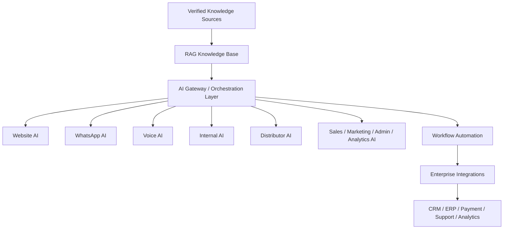
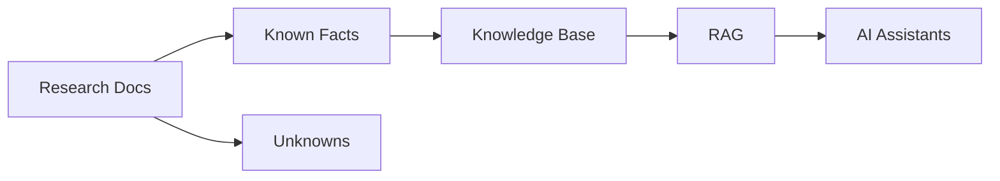

# Project_Context/00_MASTER_CONTEXT.md

# Dayjoy Enterprise AI Platform — Master Engineering Context

> **Audience:** Every AI assistant, developer, architect, product manager, and documentation agent working on the Dayjoy Enterprise AI Platform.
>
> **Purpose:** Permanent engineering context for the entire project. Read this first.
>
> **Rule:** This document synthesizes, does not duplicate, the established research and governance documents.

---

## Table of Contents

1. [Executive Summary](#1-executive-summary)
2. [Problem Statement](#2-problem-statement)
3. [Solution Overview](#3-solution-overview)
4. [Platform Vision](#4-platform-vision)
5. [Business Objectives](#5-business-objectives)
6. [Scope](#6-scope)
7. [AI Ecosystem](#7-ai-ecosystem)
8. [Users](#8-users)
9. [Engineering Philosophy](#9-engineering-philosophy)
10. [AI Collaboration Rules](#10-ai-collaboration-rules)
11. [Knowledge Strategy](#11-knowledge-strategy)
12. [Technical Direction](#12-technical-direction)
13. [Development Principles](#13-development-principles)
14. [Success Definition](#14-success-definition)
15. [Current Project Status](#15-current-project-status)
16. [Instructions for Every AI Assistant](#16-instructions-for-every-ai-assistant)
17. [Reference Map](#17-reference-map)

---

## 1. Executive Summary

**Project Name:** Dayjoy Enterprise AI Platform. [00_MASTER_CONTEXT.md][01_PROJECT_INDEX.md]

**Vision:** Build a production-ready, enterprise-grade AI ecosystem that improves Dayjoy’s customer experience, distributor experience, employee productivity, operational efficiency, and management visibility. [11_AI_Opportunities.md][12_Research_Gap_Analysis.md]

**Mission:** Turn verified business knowledge, policies, workflows, and opportunities into secure, modular, and scalable AI systems. [02_KNOWN_FACTS.md][11_AI_Opportunities.md]

**Business Purpose:** Support Dayjoy’s wellness direct selling business by making product guidance, order support, policy answers, distributor training, and internal operations more efficient and consistent. [01_Company_Research.md][02_Business_Model.md][04_Distributor_System.md][05_Policies.md][06_FAQs.md]

**Technical Purpose:** Provide the architecture and operating context for Voice AI, WhatsApp AI, Website AI, Internal AI, Distributor AI, Sales AI, Marketing AI, Admin AI, Analytics AI, Knowledge Base (RAG), workflow automation, and enterprise integrations. [11_AI_Opportunities.md][08_Business_Processes.md]

**Long-Term Goal:** Create a maintainable AI platform that can scale from research-backed MVPs to production services and future autonomous workflows.

> [!IMPORTANT]
> This document is the first context file any AI assistant should read before contributing to code, architecture, documentation, or workflow design.

---

## 2. Problem Statement

The platform exists because Dayjoy’s business has multiple audiences, complex policies, a broad product catalog, distributor-specific compensation logic, and many repeated questions that are difficult to serve consistently using manual processes alone. [10_Pain_Points.md][04_Distributor_System.md][05_Policies.md][06_FAQs.md]

### Customer
- Needs clearer product discovery, product education, order status, shipping, returns, refunds, and complaint support. [06_FAQs.md][05_Policies.md][07_Customer_Journey.md]

### Distributor
- Needs clearer onboarding, compensation explanation, training, product knowledge, sales support, and business growth guidance. [04_Distributor_System.md][10_Pain_Points.md]

### Employee
- Needs faster access to policies, products, processes, and internal answers. [06_FAQs.md][08_Business_Processes.md]

### Operations
- Needs better workflow coordination, approvals, shipping visibility, and exception handling. [08_Business_Processes.md][10_Pain_Points.md]

### Sales
- Needs lead qualification, follow-up, product recommendation, and conversion support. [10_Pain_Points.md][11_AI_Opportunities.md]

### Marketing
- Needs compliant content generation, campaign support, and distributor marketing enablement. [09_Competitor_Analysis.md][11_AI_Opportunities.md]

### Management
- Needs visibility into KPIs, risks, and performance across the business. [10_Pain_Points.md][12_Research_Gap_Analysis.md]

---

## 3. Solution Overview

The Dayjoy Enterprise AI Platform is a unified AI ecosystem built around a central knowledge base, process-aware assistants, and future enterprise integrations.

### High-Level Architecture

**VERIFIED:** The project has already documented the source knowledge needed for this ecosystem: company facts, business model, products, distributor system, policies, FAQs, journeys, processes, competitors, pain points, AI opportunities, and research gaps. [01_Company_Research.md–12_Research_Gap_Analysis.md]

**Design Principle:** The platform is not a single chatbot; it is an AI-enabled enterprise operating layer.

---

## 4. Platform Vision

### Scalability
Build once, reuse across channels and roles.

### Modularity
Each AI capability should be separable by function, channel, and permission.

### Security
All sensitive data must be role-based, auditable, and privacy-aware.

### AI-First Design
AI should be embedded in support, knowledge, workflow, and analytics from the start.

### Automation-First Philosophy
Automate repetitive, safe, and rule-based work before introducing more advanced intelligence.

### Enterprise Readiness
Design for governance, maintainability, auditability, and future expansion.

---

## 5. Business Objectives

| Objective Type | Objective |
|---|---|
| Business | Improve revenue efficiency, reduce service cost, and improve conversion. |
| Customer Experience | Provide faster, clearer, more consistent answers. |
| Distributor Experience | Improve onboarding, product understanding, and business growth support. |
| Employee Productivity | Reduce manual searching and repetitive explanation work. |
| Operations | Improve workflow visibility and reduce delays. |
| AI Transformation | Make knowledge, support, and process automation AI-native. |

---

## 6. Scope

### In Scope
- Research-driven documentation.
- Master context and knowledge governance.
- RAG knowledge base design.
- Customer, distributor, employee, and management AI use cases.
- Workflow and integration planning.

### Out of Scope
- Unverified business claims.
- Assumptions about unknown systems.
- Production implementation without architecture approval.

### Future Scope
- Advanced forecasting.
- Multilingual AI.
- Voice biometrics.
- AI vision.
- Autonomous workflow orchestration.

---

## 7. AI Ecosystem

| AI System | Purpose | Primary Users | Inputs | Outputs | Expected Benefits |
|---|---|---|---|---|---|
| Voice AI | Phone-based support and guidance | Customers, distributors | Voice queries, knowledge base, tools | Spoken answers, tickets, routing | Faster support, call deflection |
| WhatsApp AI | Chat-based support and quick answers | Customers, distributors | WhatsApp messages, FAQ, policies | Chat responses, links, workflows | 24/7 convenience |
| Website AI | Self-service product and policy assistant | Customers, prospects | Site queries, product data, FAQs | Answers, recommendations | Better conversion |
| Knowledge AI | Retrieval-backed factual assistant | All internal/external AI | Verified docs, metadata | Grounded answers | Accuracy and consistency |
| Sales AI | Lead and follow-up support | Sales, distributors | Lead data, journey info | Scoring, follow-up guidance | More conversions |
| Marketing AI | Content and campaign support | Marketing, distributors | Brand rules, product data | Drafts, campaign suggestions | Faster campaigns |
| HR AI | Internal people/process support | Employees | Policies, SOPs | Answers, summaries | Better productivity |
| Admin AI | Operational assistance | Admins, managers | Internal records, KPIs | Dashboards, summaries | Better oversight |
| Analytics AI | KPI and insight support | Management | Business data, reports | Trends, forecasts, alerts | Better decisions |

---

## 8. Users

| User Type | Goals | Permissions | AI Interactions |
|---|---|---|---|
| Customer | Buy products and get support | Public and account-level access | Web, WhatsApp, Voice AI |
| Distributor | Build business and support customers | Distributor-level access | Distributor AI, Sales AI |
| Employee | Support operations and knowledge work | Internal role-based access | Internal AI, Admin AI |
| Admin | Manage systems and content | Elevated access | Admin AI, workflow tools |
| Sales | Qualify leads and convert | Sales records and tools | Sales AI |
| Marketing | Create and manage campaigns | Brand content and analytics | Marketing AI |
| Management | Monitor business and make decisions | Reports, dashboards, approvals | Analytics AI |

---

## 9. Engineering Philosophy

> [!IMPORTANT]
> Simplicity, modularity, and verifiability come before feature breadth.

- Simplicity over unnecessary complexity.
- Modular architecture over monoliths.
- Reusable components over duplicated logic.
- API-first design for interoperability.
- Security by default.
- Documentation-first development.
- Testability and maintainability.
- Scalability for enterprise growth.

---

## 10. AI Collaboration Rules

1. Read this document first.
2. Use research documents as the primary source of truth.
3. Never invent business facts.
4. Mark assumptions clearly.
5. Reference existing documentation instead of repeating it.
6. Reuse existing modules and terminology.
7. Prefer maintainable solutions over clever but brittle ones.
8. Escalate unclear requirements to the gap repository.
9. Keep outputs RAG-friendly.
10. Document major decisions and dependencies.

---

## 11. Knowledge Strategy

**VERIFIED:** The project already separates verified facts, unknowns, and decisions into dedicated governance documents. [02_KNOWN_FACTS.md][03_UNKNOWN_INFORMATION.md][06_DECISIONS.md]

### Knowledge Management Principles
- Central knowledge repository.
- RAG compatibility.
- Structured metadata.
- Version control.
- Validation and review.
- Continuous updates after new evidence.

### Knowledge Flow

---

## 12. Technical Direction

| Area | Status | Direction |
|---|---|---|
| Frontend | Recommended | Web app / dashboard / role-based interfaces |
| Backend | Recommended | API-first services |
| APIs | Recommended | REST-style, versioned |
| AI | Recommended | LLM + RAG + tools + workflows |
| Voice | Recommended | Voice AI platform integration |
| Database | Recommended | Relational operational database |
| Authentication | Recommended | Role-based access control |
| Automation | Recommended | Workflow engine / n8n-style orchestration |
| Monitoring | Recommended | Logging, metrics, alerting |

**Confirmed:** Only high-level needs are confirmed; exact tools and vendors remain subject to client approval and technical validation. [12_Research_Gap_Analysis.md][03_UNKNOWN_INFORMATION.md]

---

## 13. Development Principles

- Documentation before implementation.
- Architecture before coding.
- Small iterative modules.
- Version control for all important artifacts.
- Code review for all changes.
- Security review for sensitive modules.
- Testing strategy defined before release.
- Keep changes traceable to decisions and facts.

---

## 14. Success Definition

| Dimension | Success Indicator |
|---|---|
| Business | Better conversion, lower cost, improved efficiency |
| Users | Better satisfaction, faster resolution |
| AI Quality | Accurate, grounded, low-hallucination responses |
| Performance | Fast response times and stable service |
| Reliability | Minimal errors and predictable uptime |
| Scalability | Can grow across roles and channels |
| Maintainability | Easy to update, test, and govern |

---

## 15. Current Project Status

| Status Area | State |
|---|---|
| Completed | Research and governance documentation |
| In Progress | Context and project governance files |
| Planned | Architecture, knowledge engineering, implementation |
| Blocked | Final tech stack, APIs, and data access decisions |

**Overall completion estimate:** Research foundation is complete; execution readiness remains limited until technology and integration decisions are finalized.

---

## 16. Instructions for Every AI Assistant

> [!CAUTION]
> Do not contradict verified documents. Do not guess missing information.

- Read this document before working.
- Follow project terminology exactly.
- Use verified research as the truth layer.
- Treat unknowns as blockers, not facts.
- Keep architecture modular and reusable.
- Preserve consistency across all documents.
- Document every major decision.
- Design for enterprise scale and long-term maintenance.
- Use RAG-friendly structure.
- Think in systems, not isolated tasks.

---

## 17. Reference Map

| Document | Role |
|---|---|
| 01_Company_Research.md | Company facts |
| 02_Business_Model.md | Business model context |
| 03_Product_Research.md | Product knowledge |
| 04_Distributor_System.md | Distributor rules and compensation |
| 05_Policies.md | Policy and compliance facts |
| 06_FAQs.md | FAQ knowledge |
| 07_Customer_Journey.md | Journey mapping |
| 08_Business_Processes.md | Process mapping |
| 09_Competitor_Analysis.md | Competitive context |
| 10_Pain_Points.md | Pain point inventory |
| 11_AI_Opportunities.md | AI roadmap |
| 12_Research_Gap_Analysis.md | Readiness and blockers |
| 00_MASTER_CONTEXT.md | Master project context |
| 01_PROJECT_INDEX.md | Documentation index |
| 02_KNOWN_FACTS.md | Verified facts repository |
| 03_UNKNOWN_INFORMATION.md | Unknowns and client inputs |
| 04_DOCUMENT_MAP.md | Dependency map |
| 05_RESEARCH_LOG.md | Research audit trail |
| 06_DECISIONS.md | Decision register |
| 07_NEXT_ACTIONS.md | Execution roadmap |

---

**END OF DOCUMENT**