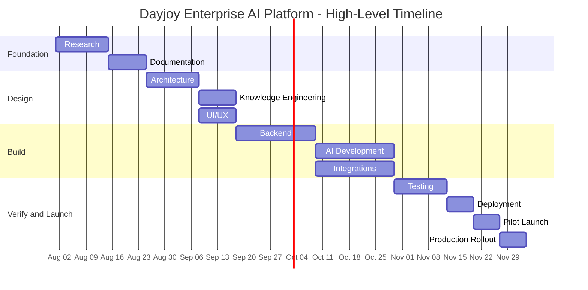

# Project_Context/01_PROJECT_BRIEF.md

# Dayjoy Enterprise AI Platform — Project Brief

> **Audience:** Executives, product managers, developers, AI engineers, designers, QA engineers, AI coding assistants, and future contributors.  
> **Purpose:** A concise enterprise-grade brief explaining what is being built, why it exists, who it serves, and how success will be measured.

---

## Table of Contents

1. [Executive Summary](#1-executive-summary)
2. [Business Background](#2-business-background)
3. [Project Objectives](#3-project-objectives)
4. [Project Scope](#4-project-scope)
5. [Stakeholders](#5-stakeholders)
6. [High-Level Solution](#6-high-level-solution)
7. [Expected Deliverables](#7-expected-deliverables)
8. [Assumptions](#8-assumptions)
9. [Constraints](#9-constraints)
10. [Risks](#10-risks)
11. [Success Criteria](#11-success-criteria)
12. [High-Level Timeline](#12-high-level-timeline)
13. [Dependencies](#13-dependencies)
14. [Project Governance](#14-project-governance)
15. [Executive Summary for AI Assistants](#15-executive-summary-for-ai-assistants)

---

## 1. Executive Summary

| Item | Summary |
|---|---|
| Project Name | Dayjoy Enterprise AI Platform |
| Short Description | A production-ready AI ecosystem for customers, distributors, employees, and management. |
| Vision | Make Dayjoy AI-first across customer experience, distributor experience, operations, and internal knowledge work. |
| Mission | Turn Dayjoy’s verified business knowledge, processes, and policies into scalable AI systems. |
| Business Value | Faster support, better conversions, lower manual effort, improved distributor productivity, stronger management visibility. |
| Technical Value | Modular, API-first, RAG-enabled platform supporting multiple AI agents and workflows. |

**VERIFIED:** The project is based on the documented Dayjoy research program and enterprise documentation pack. [00_MASTER_CONTEXT.md][01_PROJECT_INDEX.md][11_AI_Opportunities.md]

---

## 2. Business Background

### Company overview

**VERIFIED:** Dayjoy Marketing Private Limited is a direct selling wellness company with product categories spanning health care, personal care, home care, agriculture & veterinary, food products, and more. [01_Company_Research.md][02_Business_Model.md][03_Product_Research.md]

### Existing challenges

- Customers need clearer product guidance, shipping updates, return/refund support, and complaint handling. [06_FAQs.md][05_Policies.md][10_Pain_Points.md]
- Distributors need simpler onboarding, compensation understanding, training, and business support. [04_Distributor_System.md][10_Pain_Points.md]
- Employees need faster access to policies, products, and internal answers. [06_FAQs.md][08_Business_Processes.md]
- Management needs more visibility into performance, workflows, and risks. [10_Pain_Points.md][12_Research_Gap_Analysis.md]

### Why digital transformation is needed

**VERIFIED:** Current knowledge and workflows are spread across research docs, policies, FAQs, product pages, and process documents. AI can consolidate and operationalize this knowledge. [04_DOCUMENT_MAP.md][02_KNOWN_FACTS.md][03_UNKNOWN_INFORMATION.md]

### Why AI is important for Dayjoy

**VERIFIED:** AI is the best fit for Dayjoy’s repeated queries, multi-channel support needs, distributor guidance, and knowledge retrieval requirements. [11_AI_Opportunities.md][10_Pain_Points.md]

---

## 3. Project Objectives

### Business Objectives
- Improve revenue efficiency.
- Reduce support cost.
- Improve conversion and repeat purchase.
- Improve distributor retention and productivity.

### Technical Objectives
- Build a modular, maintainable AI platform.
- Create a reliable RAG knowledge foundation.
- Enable API-first integrations and automation.

### Customer Objectives
- Faster answers.
- Better product discovery.
- Easier ordering, shipping, and support.

### Distributor Objectives
- Easier onboarding.
- Easier compensation and business understanding.
- Better training and sales support.

### Employee Objectives
- Faster policy lookup.
- Better internal search.
- Reduced manual effort.

---

## 4. Project Scope

### In Scope
- Research-backed documentation.
- Master context and project governance.
- AI strategy and capability mapping.
- Knowledge base design.
- Architecture design.
- Future implementation planning.

### Out of Scope
- Production code until architecture and decisions are approved.
- Assumptions about unknown systems.
- Unverified claims or undocumented capabilities.

### Future Scope
- Advanced analytics.
- Multilingual support.
- Voice biometrics.
- Vision workflows.
- Autonomous workflow orchestration.

---

## 5. Stakeholders

| Stakeholder | Responsibilities | Expected Benefits | AI Interaction |
|---|---|---|---|
| Customers | Purchase products and request support | Faster service and better guidance | Website / WhatsApp / Voice AI |
| Distributors | Sell products and build business | Better onboarding and income clarity | Distributor AI |
| Employees | Support operations and knowledge work | Better productivity | Internal AI |
| Sales Team | Convert leads and support distributors | Better lead support | Sales AI |
| Marketing Team | Create campaigns and content | Faster content production | Marketing AI |
| Customer Support | Resolve issues and escalate cases | Reduced workload | Support AI |
| Management | Monitor business and make decisions | Better insights | Analytics AI |
| IT Team | Maintain systems and integrations | Clear architecture and governance | Admin / integration tools |
| AI Development Team | Build and maintain AI services | Clear context and requirements | All AI modules |

---

## 6. High-Level Solution

The Dayjoy Enterprise AI Platform is a unified ecosystem of AI modules sharing a central knowledge base and common governance.

| Module | Purpose |
|---|---|
| Voice AI | Phone-based customer and distributor assistance |
| Website AI | Self-service support and product discovery |
| WhatsApp AI | Chat-based support and quick responses |
| Knowledge Base | Trusted source of verified Dayjoy information |
| AI Agents | Specialized assistants by function |
| Analytics | KPI tracking and executive insight |
| Admin Dashboard | Operational visibility and control |
| Automation | Workflow orchestration and repetitive task handling |
| Integrations | CRM, ERP, payment, messaging, and other system connections |

**Note:** This section is intentionally high-level and avoids implementation details. Detailed design belongs in architecture documents.

---

## 7. Expected Deliverables

| Deliverable Category | Deliverables |
|---|---|
| Documentation | Master context, project index, facts, unknowns, decision register, execution roadmap |
| Architecture | System overview, AI ecosystem, knowledge architecture, API architecture, security architecture |
| Knowledge Base | RAG-ready content corpus and governance |
| Backend | API services, business logic, data models |
| Frontend | Web interfaces and dashboards |
| AI Services | Voice AI, WhatsApp AI, Website AI, internal AI agents |
| Integrations | CRM, ERP, payment, messaging, automation tools |
| Testing | Unit, integration, AI eval, UAT plans |
| Deployment | Docker, CI/CD, hosting, monitoring, backups |
| Training Material | User guides, support scripts, internal enablement materials |

---

## 8. Assumptions

> [!NOTE]
> Assumptions are not facts. They must be validated before implementation.

| Assumption | Reason | Status |
|---|---|---|
| The project will use a phased rollout approach. | Minimizes risk and enables validation. | Assumed |
| The final tech stack is not yet fixed. | Not enough evidence in research. | Assumed |
| Dayjoy will approve the AI governance and access rules. | Required for safe implementation. | Assumed |
| The AI platform will initially focus on support and knowledge use cases. | Highest documented need. | Assumed |

---

## 9. Constraints

| Constraint Type | Description |
|---|---|
| Budget | Not yet confirmed; must be validated with Dayjoy. |
| Timeline | Production schedule depends on approvals and system access. |
| Technical Limitations | CRM, ERP, API, and inventory details are unknown. |
| Third-Party APIs | Availability and sandbox access must be confirmed. |
| Business Dependencies | Dayjoy leadership approval required for scope and priorities. |
| Resource Availability | Internal Dayjoy stakeholders must be available for workshops and validation. |

---

## 10. Risks

| Risk Type | Risk | Mitigation |
|---|---|---|
| Business Risks | Misaligned scope or priorities | Use research and decision register |
| Technical Risks | Unknown systems and APIs | Conduct discovery workshops |
| AI Risks | Hallucinations or policy mistakes | Use RAG + guardrails + human review |
| Security Risks | Unauthorized data access | Role-based access and audit logs |
| Data Risks | Incomplete or outdated information | Maintain known facts and gap repositories |
| Adoption Risks | Low usage by staff or distributors | Start with high-value, simple workflows |

---

## 11. Success Criteria

| Metric Area | Success Indicator |
|---|---|
| Customer Experience | Faster answers and higher satisfaction |
| Distributor Satisfaction | Better onboarding and business clarity |
| Employee Productivity | Reduced manual searching and repetitive work |
| AI Response Quality | Accurate, grounded, policy-compliant answers |
| System Uptime | Stable and reliable service |
| Automation Efficiency | Reduced manual effort on repetitive workflows |
| Business Growth | Better lead conversion and improved retention |

---

## 12. High-Level Timeline

| Phase | Focus | Output |
|---|---|---|
| Research | Complete evidence gathering | Research mission docs |
| Documentation | Governance and navigation | Master context and index docs |
| Architecture | System design | Architecture pack |
| Knowledge Engineering | RAG and content readiness | Knowledge architecture |
| UI/UX | Experience design | Wireframes and flows |
| Backend | API and business logic | Core services |
| AI Development | Assistants and orchestration | AI services |
| Integrations | CRM/ERP/messaging/automation | System connections |
| Testing | QA and evaluation | Test results |
| Deployment | Production readiness | Release candidate |
| Pilot Launch | Internal demo and feedback | Pilot report |
| Production Rollout | Controlled go-live | Production system |

---

## 13. Dependencies

| Dependency | Why It Matters |
|---|---|
| Knowledge Base | Foundation for accurate AI responses |
| APIs | Required for live data and automation |
| Third-party services | Needed for messaging, voice, and payments |
| Vapi | Voice AI runtime |
| WhatsApp Business API | Chat automation |
| CRM | Customer and distributor records |
| Database | Data persistence |
| Authentication | Secure access control |
| Cloud infrastructure | Hosting and scaling |

---

## 14. Project Governance

| Governance Area | Rule |
|---|---|
| Decision-making | Major decisions must be recorded in the decision register. |
| Documentation standards | Use numbered Markdown documents and consistent terminology. |
| Version control | Track versions and change history on major documents. |
| Review process | Review research, facts, and unknowns before implementation. |
| Approval workflow | Architecture and scope require stakeholder approval. |
| Change management | Update downstream docs when a decision changes. |

---

## 15. Executive Summary for AI Assistants

**What this project is:** A production-ready AI platform for Dayjoy that unifies customer, distributor, employee, and management support across multiple channels. [00_MASTER_CONTEXT.md][11_AI_Opportunities.md]

**What the AI assistant should optimize for:** Accuracy, traceability, modularity, compliance, and maintainability.

**What documents must be read before coding:**
- `00_MASTER_CONTEXT.md`
- `01_PROJECT_INDEX.md`
- `02_KNOWN_FACTS.md`
- `03_UNKNOWN_INFORMATION.md`
- `04_DOCUMENT_MAP.md`
- `06_DECISIONS.md`
- `07_NEXT_ACTIONS.md`

**Principles to always follow:**
- Never invent facts.
- Prefer verified sources.
- Use modular design.
- Keep outputs RAG-friendly.
- Reference related documents instead of duplicating content.

---

## Reference Map

| Document | Role |
|---|---|
| 00_MASTER_CONTEXT.md | Master engineering context |
| 01_PROJECT_INDEX.md | Repository navigation |
| 02_KNOWN_FACTS.md | Verified facts |
| 03_UNKNOWN_INFORMATION.md | Unknowns and blockers |
| 04_DOCUMENT_MAP.md | Dependency map |
| 05_RESEARCH_LOG.md | Research audit trail |
| 06_DECISIONS.md | Decision register |
| 07_NEXT_ACTIONS.md | Execution roadmap |
| 01_Company_Research.md–12_Research_Gap_Analysis.md | Research sources |

---

**END OF DOCUMENT**