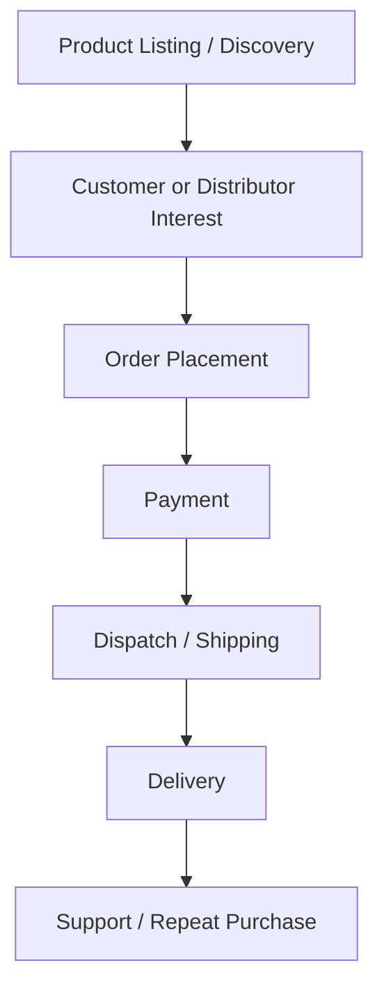
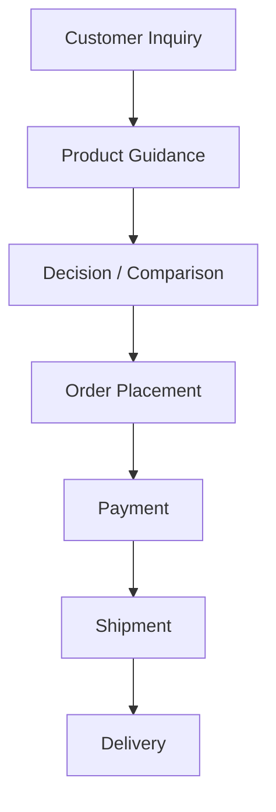
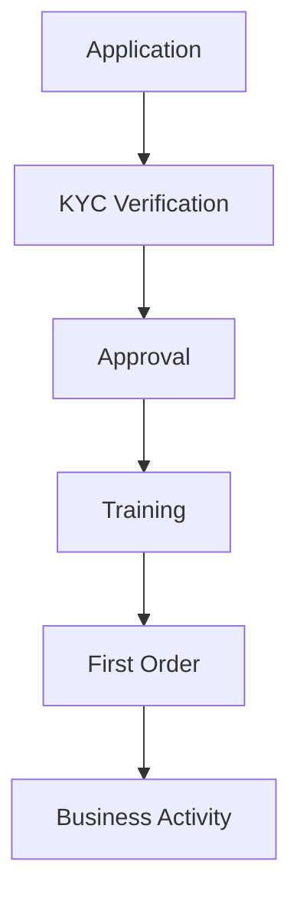

# Project_Context/02_BUSINESS_CONTEXT.md

# Dayjoy Enterprise AI Platform — Business Context

> **Audience:** Executives, engineers, architects, product managers, and AI assistants.  
> **Purpose:** Explain how Dayjoy works as a business so all technical decisions align with the real operating model.

---

## Table of Contents

1. [Executive Business Overview](#1-executive-business-overview)
2. [Business Model](#2-business-model)
3. [Organizational Context](#3-organizational-context)
4. [Customer Context](#4-customer-context)
5. [Distributor Context](#5-distributor-context)
6. [Product Business Context](#6-product-business-context)
7. [Core Business Processes](#7-core-business-processes)
8. [Business Rules](#8-business-rules)
9. [Business Pain Points](#9-business-pain-points)
10. [AI Business Opportunities](#10-ai-business-opportunities)
11. [Business KPIs](#11-business-kpis)
12. [Business Constraints](#12-business-constraints)
13. [Business Glossary](#13-business-glossary)
14. [Business Context for AI](#14-business-context-for-ai)
15. [Summary](#15-summary)

---

## 1. Executive Business Overview

| Item | Summary |
|---|---|
| Company Purpose | Deliver wellness and lifestyle products through a direct selling business model. |
| Business Domain | Direct selling, wellness, personal care, agriculture & veterinary, and related consumer products. |
| Target Market | Customers, distributor prospects, and active distributors. |
| Value Proposition | Products plus distributor opportunity, supported by training, support, and policy structure. |
| Strategic Positioning | A product-led direct selling brand with enterprise AI potential. |

**VERIFIED:** Dayjoy is positioned as a wellness direct selling company with a broad consumer product portfolio and a distributor-led sales model. [01_Company_Research.md][02_Business_Model.md][03_Product_Research.md][04_Distributor_System.md]

---

## 2. Business Model

### Revenue Sources
- Product sales to end customers.
- Distributor-led product sales.
- Direct online sales and offline/order-assisted sales. [02_Business_Model.md][04_Distributor_System.md][05_Policies.md]

### Distributor Model
- Independent distributors may register for free.
- Distributors earn through retail margin and incentive structures.
- Business activity is governed by eligibility, compliance, and compensation rules. [04_Distributor_System.md]

### Customer Acquisition
- Website discovery.
- Distributor referrals.
- WhatsApp and phone support.
- Word-of-mouth and marketing campaigns. [07_Customer_Journey.md][06_FAQs.md]

### Sales Channels
- Website.
- Distributors.
- Office / franchisee pickup and order support.
- Support-assisted ordering. [05_Policies.md][06_FAQs.md]

### Product Distribution Flow

**VERIFIED:** Ordering, shipping, and support processes are documented in policies and FAQs. [05_Policies.md][06_FAQs.md][08_Business_Processes.md]

---

## 3. Organizational Context

> [!NOTE]
> The full org chart is not publicly documented. The departments below are business-relevant functional areas inferred from the research and support structure.

| Department | Responsibilities | Inputs | Outputs | Systems Used | AI Opportunities |
|---|---|---|---|---|---|
| Sales | Acquire customers, support distributors, convert leads | Leads, product info, pricing | Sales conversions, distributor activity | Website, distributor communication | Sales AI, lead scoring |
| Marketing | Campaigns, content, distributor marketing support | Brand rules, product info | Campaigns, content, leads | Website, social, messaging | Marketing AI, content generation |
| Customer Support | Resolve queries and complaints | Support tickets, policies, order data | Answers, escalations, closures | Phone, WhatsApp, email | Support AI, Voice AI |
| Operations | Process orders, manage returns/refunds | Orders, policies, inventory | Shipment, returns, refunds | Order systems, logistics | Workflow automation |
| Logistics | Shipping and delivery coordination | Dispatch requests, address data | Delivered shipments | Courier / shipping process | Tracking AI |
| Finance | Payments, refunds, payout handling | Payment data, claims | Payment reconciliation, refunds | Payment systems | Finance automation |
| IT | Systems, integrations, access, monitoring | Technical requirements | Working platforms | Web/app/backend systems | AI platform support |
| Product Management | Product catalog and data | Product research, brochures | Product data, updates | Content/product repository | Product AI support |
| Leadership | Business direction, approvals, governance | Reports, risks, decisions | Decisions, priorities | Dashboards, docs | Analytics AI |

**VERIFIED:** Public support and policy material confirms the presence of customer care, business support, grievance handling, downloads, and distributor-facing documentation. [03_Company_Research.md][05_Policies.md][06_FAQs.md][04_Distributor_System.md]

---

## 4. Customer Context

### Customer Types
- New customers.
- Returning customers.
- Prospects evaluating the brand.
- Customers who rely on distributor guidance. [07_Customer_Journey.md][06_FAQs.md]

### Customer Goals
- Find the right product.
- Understand product benefits and usage.
- Place and receive orders.
- Resolve support issues quickly.

### Customer Journey

### Purchase Lifecycle
- Research.
- Compare.
- Buy.
- Receive.
- Use.
- Reorder.

### Support Lifecycle
- Ask a question.
- Receive answer.
- Escalate if needed.
- Resolve.
- Close.

### Retention Strategy
- Support quality.
- Product trust.
- Repeat ordering convenience.
- Distributor relationship support. [07_Customer_Journey.md][10_Pain_Points.md]

---

## 5. Distributor Context

### Distributor Lifecycle

### Registration
- Free registration.
- Eligibility and KYC rules apply.
- PAN and address proof are required. [04_Distributor_System.md]

### Onboarding
- Application and verification.
- Training and business guidance.
- First-order support. [04_Distributor_System.md][05_Policies.md]

### Product Ordering
- Distributors use order forms and company processes.
- Orders are linked to distributor pricing and business logic. [04_Distributor_System.md][06_FAQs.md]

### Incentives
- Retail profit.
- Performance incentives.
- Loyalty and reward mechanisms. [04_Distributor_System.md]

### Training
- Product modules.
- Business workshops.
- Opportunity programs. [05_Policies.md][04_Distributor_System.md]

### Performance Tracking
- Based on BV/PV and rank structure.
- Detailed calculations exist in compensation documentation. [04_Distributor_System.md]

### Support
- Business support.
- Customer support.
- Grievance escalation. [04_Distributor_System.md][05_Policies.md]

---

## 6. Product Business Context

### Product Categories
- Health Care.
- Personal Care.
- Agriculture & Veterinary.
- Food Products.
- Home Care.
- Skin Care.
- Other lifestyle categories. [03_Product_Research.md][01_Company_Research.md]

### Business Purpose of Products
Products are the core revenue engine and the primary reason customers and distributors engage with the Dayjoy business. [02_Business_Model.md]

### Product Lifecycle
- Discover.
- Evaluate.
- Purchase.
- Use.
- Support.
- Reorder.

### Pricing Strategy
**VERIFIED:** Some product prices are publicly visible; pricing details are not complete for every SKU and should be treated as partially documented. [03_Product_Research.md][12_Research_Gap_Analysis.md]

### Cross-Selling Opportunities
- Health products with complementary health products.
- Personal care bundles.
- Distributor-led product recommendations. [03_Product_Research.md][11_AI_Opportunities.md]

### Product Support Requirements
- Usage guidance.
- Safety information.
- Pricing clarity.
- Availability information.
- Product-specific FAQs. [03_Product_Research.md][06_FAQs.md]

---

## 7. Core Business Processes

### Major Workflows
- Customer inquiry.
- Product recommendation.
- Order placement.
- Payment.
- Shipping.
- Delivery.
- Returns.
- Refunds.
- Complaint handling.
- Distributor onboarding. [08_Business_Processes.md]

### Customer Inquiry to Order Flow

### Distributor Onboarding Flow

**VERIFIED:** Policies and processes for shipping, returns, refunds, and complaints are publicly documented. [05_Policies.md][08_Business_Processes.md]

---

## 8. Business Rules

### Verified Rules
| Rule | Meaning | Source |
|---|---|---|
| Distributor registration is free | No registration cost for independent distributors | 04_Distributor_System.md |
| Age eligibility | Distributors must be 18+ | 04_Distributor_System.md |
| KYC / PAN required | Identity and address proof required | 04_Distributor_System.md |
| 30-day cooling period | Return-related policy window | 05_Policies.md |
| Refund timeline | Refunds processed within 15 business days | 05_Policies.md |
| Support contacts public | Customer care, WhatsApp, grievance officer | 05_Policies.md |

### Assumed Rules
- AI systems should follow policy-first response logic.
- AI should ask for missing context before answering when required.  
**Status:** Assumed; derived from project design, not a business fact.

### Rules Requiring Client Confirmation
- Exact support SLA by channel.
- Exact product pricing across all SKUs.
- Exact inventory and order routing rules.
- Exact internal approval matrix. [12_Research_Gap_Analysis.md]

---

## 9. Business Pain Points

| Group | Key Pain Points | Reference |
|---|---|---|
| Customer | Product discovery, shipping, returns, refund clarity, support speed | 10_Pain_Points.md |
| Distributor | Onboarding, compensation clarity, product knowledge, business growth | 10_Pain_Points.md |
| Employee | Finding policies, product info, process guidance | 10_Pain_Points.md |
| Operations | Workflow delays, visibility, approvals | 10_Pain_Points.md |
| Management | Reporting, KPI visibility, coordination | 10_Pain_Points.md |

**VERIFIED:** These pain points are explicitly documented in the pain-point research mission. [10_Pain_Points.md]

---

## 10. AI Business Opportunities

### Sales
- Lead qualification.
- Product recommendation.
- Follow-up support.

### Customer Support
- FAQ automation.
- Order status assistance.
- Complaint triage.

### Distributor Support
- Onboarding assistant.
- Compensation explainer.
- Training assistant.

### Marketing
- Content generation.
- Campaign assistance.
- Distributor marketing support.

### Analytics
- KPI dashboards.
- Trend summaries.
- Decision support.

### Operations
- Workflow automation.
- Exception routing.
- Approval assistance.

### Internal Productivity
- Policy search.
- Product search.
- Process search.

**Priority:** High business-value opportunities should be addressed first. [11_AI_Opportunities.md]

---

## 11. Business KPIs

### Verified / Documented KPI Areas
- Customer satisfaction.
- Distributor growth.
- Conversion rate.
- Order completion.
- Support resolution time.
- AI automation rate.
- Revenue impact.

### Proposed KPIs
| KPI | Status | Notes |
|---|---|---|
| CSAT | Proposed | To be defined with Dayjoy |
| Distributor onboarding completion | Proposed | Useful for distributor AI |
| AI deflection rate | Proposed | Needed for support AI |
| Order completion rate | Proposed | Useful for website AI |
| Repeat purchase rate | Proposed | Useful for retention strategy |

**PARTIALLY VERIFIED:** The exact KPI baselines are not yet known and must be confirmed during discovery. [12_Research_Gap_Analysis.md]

---

## 12. Business Constraints

| Constraint Type | Description | Effect on Design |
|---|---|---|
| Operational | Policies and workflows must be respected | AI must be policy-aware |
| Legal | Direct selling and privacy rules apply | Content guardrails required |
| Policy | Refunds, returns, and claims have rules | AI must not contradict policy |
| Technology | CRM/ERP/APIs are not yet confirmed | Architecture must stay flexible |
| Resource | Stakeholder time and approvals are limited | Phased approach required |

---

## 13. Business Glossary

| Term | Meaning |
|---|---|
| Distributor | A registered independent sales participant |
| BV | Business Volume used in compensation |
| PV | Point Value used in incentive calculation |
| Cooling Period | Time window for returns/refunds |
| Grievance Officer | Named escalation contact for complaints |
| RAG | Retrieval-augmented generation |
| SOP | Standard operating procedure |
| KPI | Key performance indicator |
| CRM | Customer relationship management |
| ERP | Enterprise resource planning |

---

## 14. Business Context for AI

> [!IMPORTANT]
> AI assistants must optimize for business value, policy compliance, and clarity—not for novelty.

- Interpret business requirements through Dayjoy’s verified facts.
- Avoid assumptions when a rule or value is unknown.
- Prioritize customer and distributor value where documented.
- Keep language consistent with policies, FAQs, and compensation docs.
- Reference facts rather than re-inventing business logic.

---

## 15. Summary

This document explains how Dayjoy works as a business: a direct selling wellness company with multiple customer and distributor touchpoints, a documented policy environment, a structured compensation model, and operational workflows that can benefit from AI support. [01_Company_Research.md][02_Business_Model.md][04_Distributor_System.md][05_Policies.md][06_FAQs.md][08_Business_Processes.md][10_Pain_Points.md][11_AI_Opportunities.md]

**Business architecture:** product-led, distributor-enabled, policy-driven.  
**Operational model:** multi-channel, support-heavy, workflow-dependent.  
**AI transformation goals:** improve clarity, speed, automation, and scalability.  
**Long-term vision:** an AI-enabled enterprise operating model that remains compliant, maintainable, and knowledge-driven.

---

**END OF DOCUMENT**