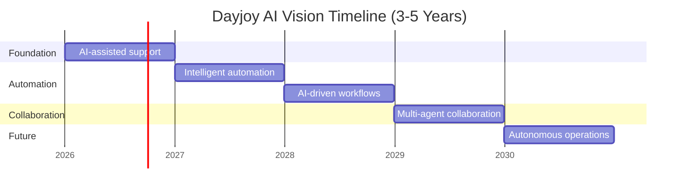

# Project_Context/04_AI_VISION.md

# Dayjoy Enterprise AI Platform — AI Vision

> **Purpose:** Long-term AI strategy for the next 3–5 years. This document defines vision, not implementation.  
> **Audience:** Executives, architects, product managers, AI engineers, and future AI assistants.

---

## Table of Contents

1. [Executive AI Vision](#1-executive-ai-vision)
2. [Why AI?](#2-why-ai)
3. [AI Transformation Roadmap](#3-ai-transformation-roadmap)
4. [AI Ecosystem Vision](#4-ai-ecosystem-vision)
5. [AI Agent Philosophy](#5-ai-agent-philosophy)
6. [Enterprise AI Principles](#6-enterprise-ai-principles)
7. [Knowledge Vision](#7-knowledge-vision)
8. [Voice AI Vision](#8-voice-ai-vision)
9. [WhatsApp AI Vision](#9-whatsapp-ai-vision)
10. [Website AI Vision](#10-website-ai-vision)
11. [Internal AI Vision](#11-internal-ai-vision)
12. [Future AI Capabilities](#12-future-ai-capabilities)
13. [AI Governance](#13-ai-governance)
14. [Success Metrics](#14-success-metrics)
15. [Vision Timeline](#15-vision-timeline)
16. [AI Vision for Every Future Contributor](#16-ai-vision-for-every-future-contributor)

---

## 1. Executive AI Vision

### AI Vision Statement

Dayjoy will evolve into an AI-enabled enterprise where customers, distributors, employees, and management receive accurate, fast, compliant, and context-aware support across every channel. [11_AI_Opportunities.md][00_MASTER_CONTEXT.md]

### AI Mission

Use trusted Dayjoy knowledge, policies, and business workflows to deliver consistent AI experiences that improve service quality, productivity, and growth. [02_KNOWN_FACTS.md][05_Policies.md][06_FAQs.md][08_Business_Processes.md]

### Strategic Purpose

- Reduce friction in the customer and distributor journey.
- Increase operational efficiency.
- Improve decision-making through AI-assisted insights.
- Create a reusable AI platform that can grow with the business.

### Business Impact

- Better customer satisfaction.
- Better distributor enablement.
- Lower cost-to-serve.
- Faster responses and less manual work.

### Customer Impact

- Faster answers.
- Better product understanding.
- Clearer order, shipping, and refund support.

### Long-Term Transformation Goals

- AI-assisted enterprise operations.
- AI-guided customer and distributor engagement.
- AI-first knowledge access.
- Scalable multi-agent support across business functions.

---

## 2. Why AI?

**VERIFIED:** Dayjoy already has clear research-backed needs for product education, support, distributor onboarding, policy clarity, workflow visibility, and management insight. [10_Pain_Points.md][12_Research_Gap_Analysis.md]

### Why AI is essential

| Area | Why AI Matters |
|---|---|
| Customer expectations | Customers expect faster, simpler, always-available support. |
| Distributor enablement | Distributors need better training, explanation, and coaching. |
| Employee productivity | Employees should not spend time searching scattered documents. |
| Operational efficiency | Repetitive workflows should be automated or assisted. |
| Marketing | AI can accelerate compliant content and campaign support. |
| Sales | AI can improve lead qualification and recommendation quality. |
| Decision support | Management benefits from summaries, alerts, and trend analysis. |
| Competitive advantage | AI can differentiate Dayjoy from traditional direct selling operations. |

---

## 3. AI Transformation Roadmap

### Stages of Maturity

1. **AI-assisted support** — AI helps humans answer questions faster.
2. **Intelligent automation** — AI handles routine tasks with human review.
3. **AI-driven business workflows** — AI is embedded into business processes.
4. **Multi-agent collaboration** — multiple AI agents work together by function.
5. **Autonomous enterprise operations** — limited, governed autonomy for safe workflows.

**VERIFIED:** This roadmap aligns with the documented AI opportunities and the phased implementation guidance in the project roadmap. [11_AI_Opportunities.md][07_NEXT_ACTIONS.md]

---

## 4. AI Ecosystem Vision

> [!NOTE]
> These are strategic system roles. They describe what each AI system should become over time.

| AI System | Purpose | Primary Users | Inputs | Outputs | Business Value | Future Evolution |
|---|---|---|---|---|---|---|
| Voice AI | Voice-based support and guidance | Customers, distributors | Calls, knowledge, tools | Spoken answers, routing, escalation | Faster support | More conversational, multilingual, more contextual |
| WhatsApp AI | Chat-based support and assistance | Customers, distributors | WhatsApp messages, knowledge, events | Replies, order help, notifications | Convenience and scale | Richer personalization and proactive messaging |
| Website AI | Self-service discovery and support | Customers, prospects | Site queries, products, FAQs | Answers, recommendations, leads | Better conversion | Guided buying and conversational commerce |
| Internal AI | Employee knowledge and productivity | Employees, managers | Policies, SOPs, docs | Answers, summaries, guidance | Less manual work | Deeper internal workflows and assistant workflows |
| Distributor AI | Business coaching and support | Distributors | Compensation, product, training data | Guidance, explanations, next steps | Better distributor success | Rank coaching, productivity support, personalized learning |
| Sales AI | Lead and conversion assistance | Sales, distributors | Leads, journey, product data | Qualification, follow-up, recommendations | Higher conversion | Assisted selling and predictive coaching |
| Marketing AI | Content and campaign support | Marketing, distributors | Brand rules, product data | Drafts, campaign ideas, copy | Faster marketing | Personalization and campaign optimization |
| Analytics AI | Summaries and insights | Management | KPIs, reports, trends | Summaries, alerts, forecasts | Better decisions | Predictive and prescriptive insights |
| Admin AI | Operational administration support | Admins, managers | Internal records, actions | Dashboards, task support | Better oversight | More autonomous back-office assistance |
| Knowledge AI | Grounded answers from trusted docs | All AI systems | Verified documents | Retrieved context, citations | Accuracy and consistency | Continuous knowledge synchronization |

### Collaboration Model
AI systems should not operate as isolated bots. They should share a common knowledge layer and consistent business rules so that customer, distributor, and employee experiences remain aligned. [02_KNOWN_FACTS.md][04_DOCUMENT_MAP.md][11_AI_Opportunities.md]

---

## 5. AI Agent Philosophy

All AI agents for Dayjoy should be:

- Helpful.
- Accurate.
- Transparent.
- Context-aware.
- Modular.
- Secure.
- Scalable.
- Human-in-the-loop when appropriate.

### Expected behaviors
- Answer from verified knowledge when possible.
- Ask clarifying questions when needed.
- Escalate sensitive or uncertain cases.
- Respect policies and permissions.
- Avoid speculation and unsupported claims.

---

## 6. Enterprise AI Principles

| Principle | Meaning |
|---|---|
| AI augments humans | AI should support, not casually replace, human judgment. |
| Business-first | AI must serve a real Dayjoy business use case. |
| Privacy by design | Personal data must be protected. |
| Security by default | Access and actions should be controlled. |
| Explainable AI | Answers should be traceable to sources. |
| Continuous learning | Knowledge must improve through governance. |
| Reusable architecture | Build once and reuse across channels. |
| Modular AI services | Keep capabilities separable and maintainable. |

---

## 7. Knowledge Vision

**VERIFIED:** The project already uses a facts repository, unknowns repository, decision register, and document map to control knowledge quality. [02_KNOWN_FACTS.md][03_UNKNOWN_INFORMATION.md][04_DOCUMENT_MAP.md][06_DECISIONS.md]

### Future knowledge system goals
- Central knowledge repository.
- Retrieval-Augmented Generation (RAG).
- Structured metadata.
- Document ingestion and versioning.
- Validation and approval.
- Continuous synchronization with source documents.
- Knowledge governance and ownership.

**Vision outcome:** Any AI assistant should be able to retrieve the correct Dayjoy answer with traceable source grounding.

---

## 8. Voice AI Vision

Voice AI should become a trusted phone-based Dayjoy assistant that can:
- Support customers.
- Support distributors.
- Assist with sales questions.
- Route and escalate complex issues.
- Handle multilingual conversations over time.
- Support order tracking and common support queries.

**Strategic direction:** Voice AI should start simple and become more conversational and context-aware over time.

---

## 9. WhatsApp AI Vision

WhatsApp AI should evolve into the primary conversational convenience layer for Dayjoy.

It should support:
- Customer support.
- Distributor onboarding.
- Product recommendations.
- Order updates.
- Notifications.
- Marketing communication.
- Personalized assistance.

**Strategic direction:** WhatsApp AI should become the daily, low-friction support and communication channel.

---

## 10. Website AI Vision

The website should become an intelligent self-service and discovery surface.

It should support:
- Conversational search.
- Product discovery.
- Personalized recommendations.
- Lead qualification.
- Guided purchasing.
- Self-service support.

**Strategic direction:** The website should move from static information to guided, conversational commerce.

---

## 11. Internal AI Vision

Internal AI should become the employee productivity layer for Dayjoy.

It should support:
- Knowledge lookup.
- HR support.
- Sales support.
- Marketing support.
- Analytics summaries.
- Operations guidance.
- Training assistance.

**Strategic direction:** Employees should spend less time searching and more time executing.

---

## 12. Future AI Capabilities

### Planned future capabilities
- Predictive analytics.
- Recommendation engines.
- AI-generated reports.
- Demand forecasting.
- Intelligent workflow automation.
- Agent-to-agent collaboration.
- Personalized learning.

### Long-term possibilities
- Computer vision.
- IoT integration.
- Voice biometrics.
- Autonomous orchestration across business functions.

**Note:** Long-term possibilities are strategic ideas, not current commitments.

---

## 13. AI Governance

| Governance Area | Principle |
|---|---|
| Ethical AI | Avoid misleading or harmful outputs. |
| Responsible AI | Humans remain accountable for critical decisions. |
| Privacy | Protect personal and business data. |
| Security | Restrict access and protect secrets. |
| Human oversight | Escalate sensitive cases appropriately. |
| Model evaluation | Continuously check answer quality. |
| Prompt governance | Maintain approved prompting standards. |
| Auditability | Keep traceable records. |
| Compliance | Align with policies and legal constraints. |

---

## 14. Success Metrics

### Current KPI areas
- AI adoption.
- User satisfaction.
- Response accuracy.
- Automation rate.
- Resolution time.
- Employee productivity.
- Distributor engagement.
- Customer retention.

### Future aspirational goals
- High-quality AI deflection of routine questions.
- Reduced manual support load.
- Strong AI-driven business insight generation.
- Improved conversion through guided digital journeys.

---

## 15. Vision Timeline

### Maturity Path
- Year 1: Knowledge and support foundation.
- Year 2: Workflow automation and deeper channel coverage.
- Year 3: Multi-agent collaboration and analytics.
- Year 4–5: Expanded autonomy and advanced intelligence.

---

## 16. AI Vision for Every Future Contributor

> [!IMPORTANT]
> This vision is a standing instruction for all future contributors.

- Build reusable AI components.
- Prioritize business value.
- Design for scalability.
- Keep systems modular.
- Document every major AI capability.
- Preserve consistency across all AI products.
- Never sacrifice security for convenience.
- Always design with future expansion in mind.
- Prefer grounded, source-backed answers.
- Keep the enterprise context aligned with the research and decision documents.

---

## Reference Map

| Document | Role |
|---|---|
| 00_MASTER_CONTEXT.md | Permanent engineering context |
| 01_PROJECT_BRIEF.md | Project brief |
| 02_BUSINESS_CONTEXT.md | Business operating context |
| 03_PRODUCT_CONTEXT.md | Product context |
| 02_KNOWN_FACTS.md | Verified facts |
| 03_UNKNOWN_INFORMATION.md | Open gaps |
| 04_DOCUMENT_MAP.md | Dependency map |
| 06_DECISIONS.md | Decisions and constraints |
| 07_NEXT_ACTIONS.md | Roadmap |
| 11_AI_Opportunities.md | AI strategy source |
| 12_Research_Gap_Analysis.md | Readiness and blockers |

---

**END OF DOCUMENT**