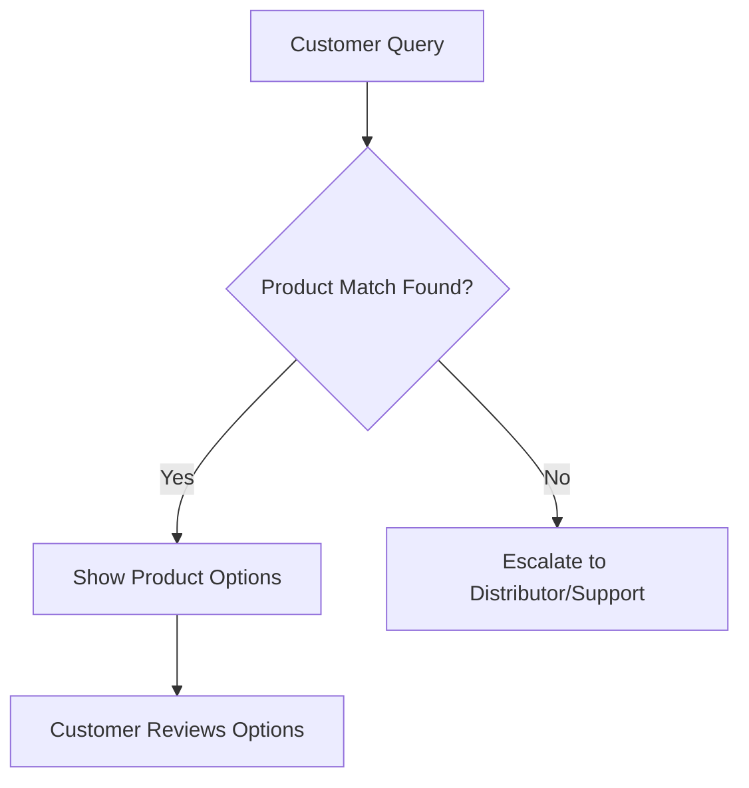
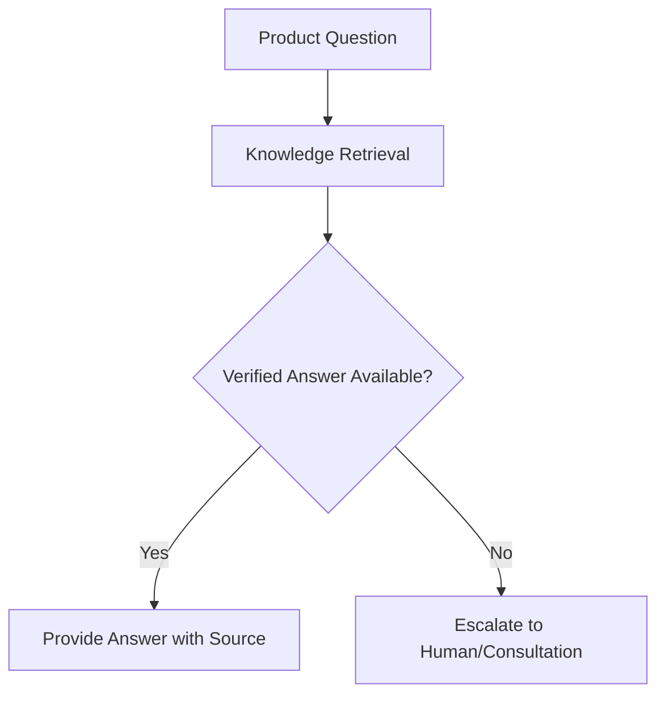
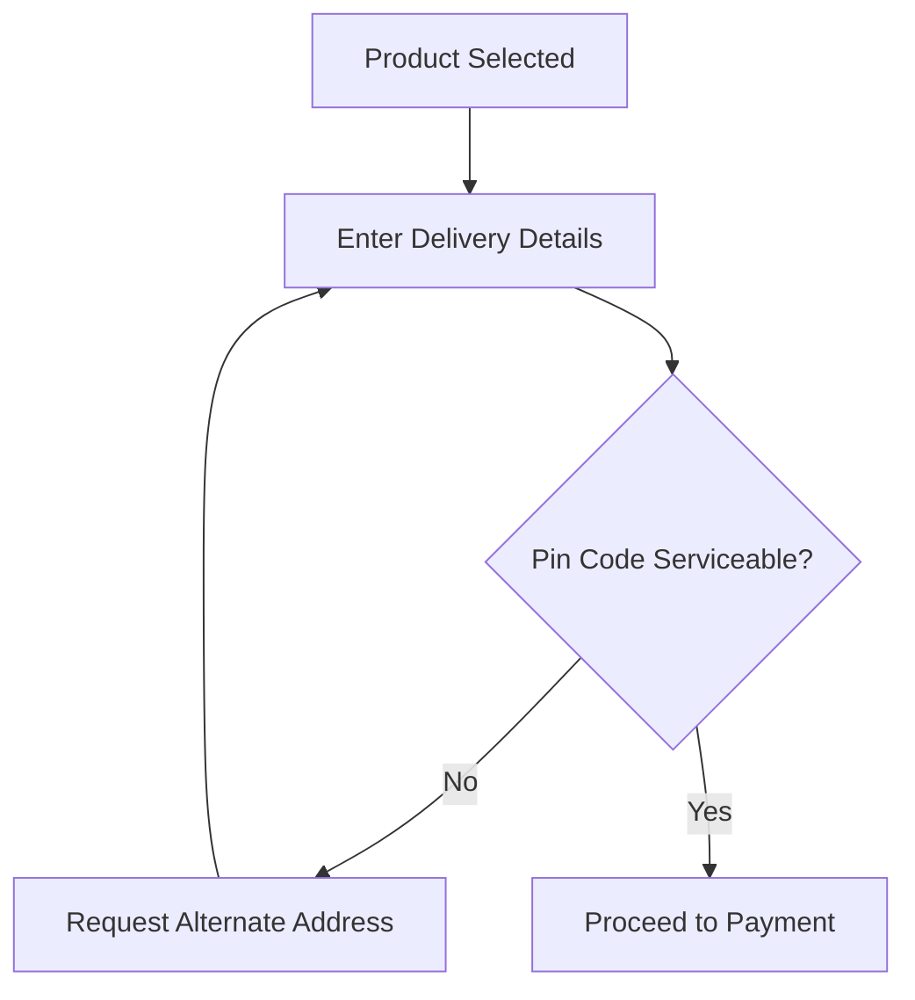
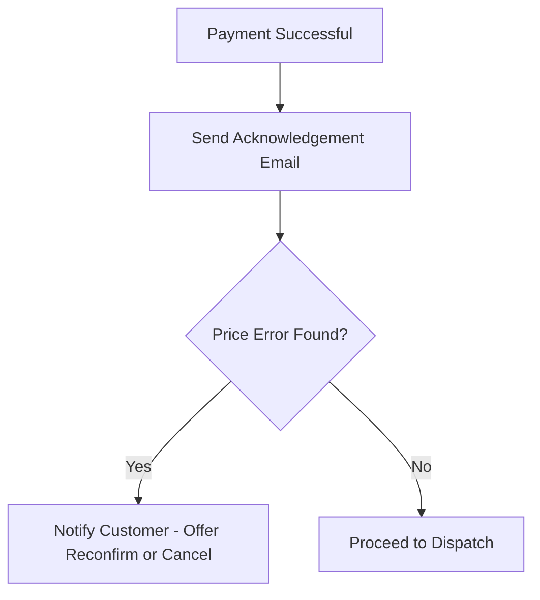
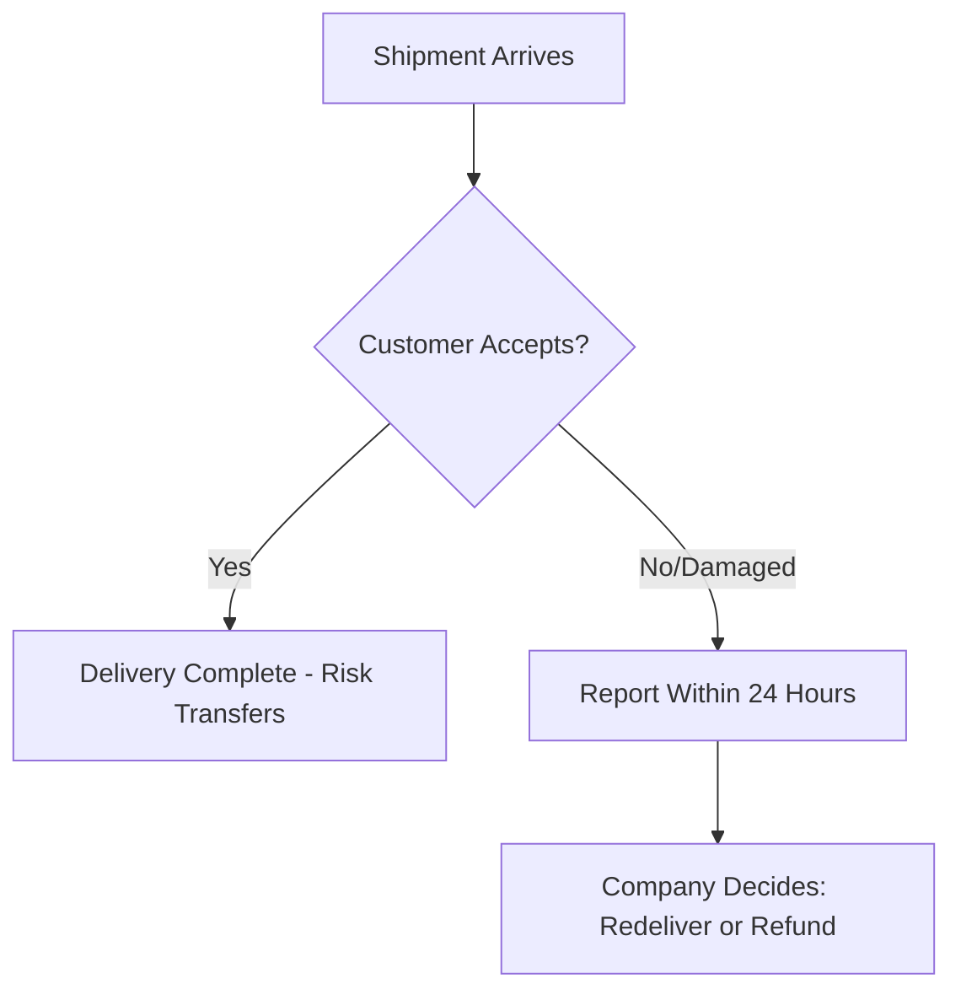
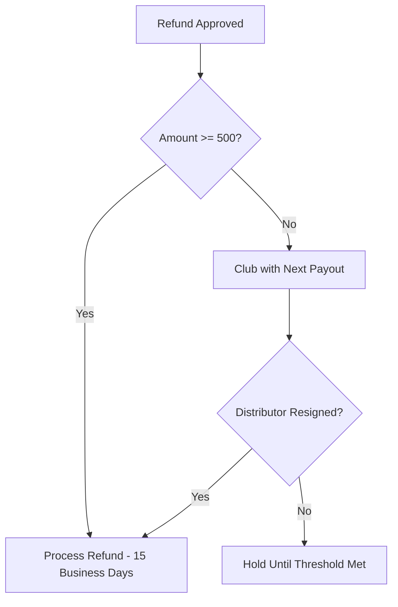
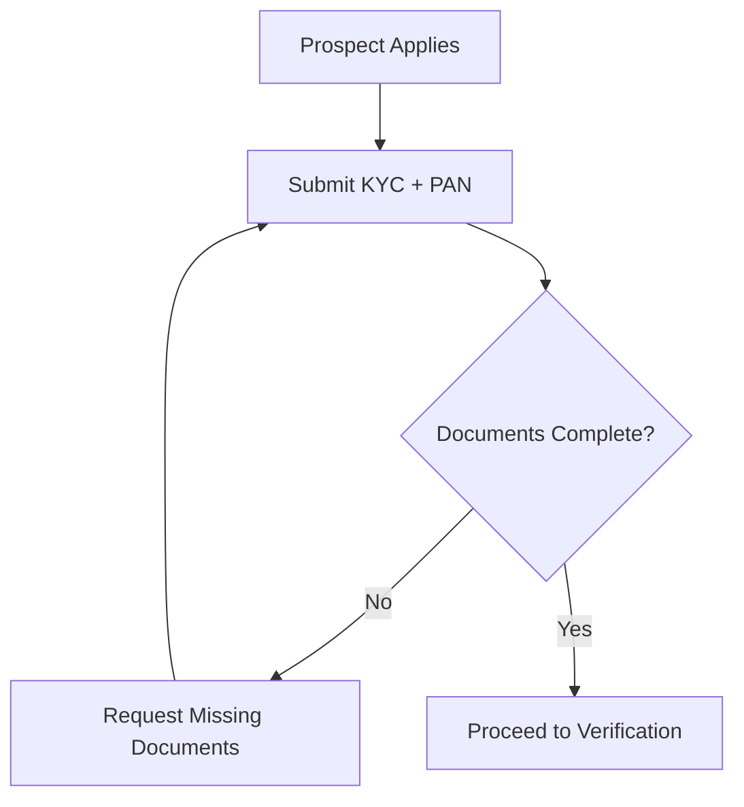
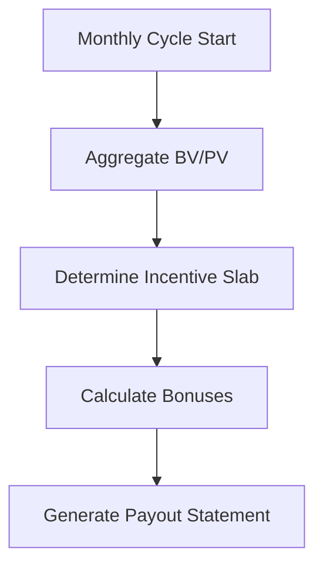

# Project_Context/07_BUSINESS_PROCESSES.md

# Dayjoy Enterprise AI Platform — Business Process Reference

> **Purpose:** Model how Dayjoy operates as a business (not how software is coded). This is the reference for workflow automation, AI agents, backend APIs, database design, and process optimization.
>
> **Source of truth:** 03_Product_Research.md, 04_Distributor_System.md, 05_Policies.md, 06_FAQs.md, 07_Customer_Journey.md, 08_Business_Processes.md, 10_Pain_Points.md, 11_AI_Opportunities.md

---

## Table of Contents

1. [How to Use This Document](#1-how-to-use-this-document)
2. [Customer Processes](#2-customer-processes)
3. [Distributor Processes](#3-distributor-processes)
4. [Employee Processes](#4-employee-processes)
5. [Administrative Processes](#5-administrative-processes)
6. [AI Processes](#6-ai-processes)
7. [Process Dependency Matrix](#7-process-dependency-matrix)
8. [AI Automation Opportunities Summary](#8-ai-automation-opportunities-summary)
9. [Process Optimization Recommendations](#9-process-optimization-recommendations)
10. [Process Prioritization](#10-process-prioritization)

---

## 1. How to Use This Document

Each process entry follows a consistent template: **Process ID, Purpose, Trigger, Preconditions, Workflow, Decision Points, Inputs, Outputs, Systems, Users, AI Involvement, Business Rules, Exceptions, Success Criteria, KPIs, Future Automation.**

**VERIFIED:** Process content is grounded in Dayjoy's documented policies, FAQs, distributor system, and prior business process research. [05_Policies.md][06_FAQs.md][04_Distributor_System.md][08_Business_Processes.md]

**PARTIALLY VERIFIED / ASSUMED:** Some internal steps (exact system names, approver identities, exact SLAs) are not publicly documented and are marked accordingly.

---

## 2. Customer Processes

### CP-01: Product Discovery

| Field | Detail |
|---|---|
| Purpose | Help customer find relevant products |
| Trigger | Customer visits website/WhatsApp or asks a distributor |
| Preconditions | Product catalog is available |
| Inputs | Customer query, health/lifestyle need |
| Outputs | List of relevant products |
| Systems | Website, WhatsApp, product catalog |
| Users | Customer, Distributor |
| AI Involvement | Website AI, WhatsApp AI, Knowledge AI |
| Business Rules | Only show verified, in-catalog products [03_Product_Research.md] |
| Exceptions | No matching product found → escalate to human/distributor |
| Success Criteria | Customer finds a relevant product |
| KPIs | Search success rate, time-to-find |
| Future Automation | Full AI-driven personalized discovery |

---

### CP-02: Product Inquiry

| Field | Detail |
|---|---|
| Purpose | Answer detailed product questions (benefits, usage, safety) |
| Trigger | Customer asks about a specific product |
| Preconditions | Product data exists in knowledge base |
| Inputs | Product name, specific question |
| Outputs | Verified answer or escalation |
| Systems | Knowledge base, product catalog |
| Users | Customer |
| AI Involvement | Knowledge AI, Website AI, WhatsApp AI, Voice AI |
| Business Rules | Never answer safety questions without verified data [10_Pain_Points.md] |
| Exceptions | Missing ingredient/safety data → escalate |
| Success Criteria | Accurate, sourced answer given |
| KPIs | Answer accuracy, escalation rate |
| Future Automation | Automated ingredient/safety lookup with citations |

---

### CP-03: AI Recommendation

| Field | Detail |
|---|---|
| Purpose | Recommend products based on stated need |
| Trigger | Customer describes a goal/symptom |
| Preconditions | Recommendation logic/mapping exists |
| Inputs | Symptom/goal, customer profile (if available) |
| Outputs | Ranked product suggestions |
| Systems | Knowledge base, recommendation logic |
| Users | Customer, Distributor |
| AI Involvement | Website AI, Sales AI, Knowledge AI |
| Business Rules | Do not make medical claims beyond verified product data [05_Policies.md] |
| Exceptions | Serious health condition → recommend consultation (48-hr TAT) [06_FAQs.md] |
| Success Criteria | Relevant recommendation accepted |
| KPIs | Recommendation acceptance rate, conversion |
| Future Automation | Personalized recommendation engine |

---

### CP-04: Order Placement

| Field | Detail |
|---|---|
| Purpose | Capture and create a customer order |
| Trigger | Customer decides to buy |
| Preconditions | Product in stock, customer/distributor identified |
| Inputs | Product selection, quantity, delivery address |
| Outputs | Order record |
| Systems | Website, office/franchise order system, distributor order system |
| Users | Customer, Distributor, Order processing staff |
| AI Involvement | Website AI (guided ordering), Order Assistant |
| Business Rules | Orders online, at office/franchise, or via distributor [05_Policies.md] |
| Exceptions | Pin code not serviceable → alternate address required [05_Policies.md] |
| Success Criteria | Order successfully created |
| KPIs | Order completion rate, cart abandonment |
| Future Automation | Fully automated guided ordering with AI assistant |

---

### CP-05: Payment

| Field | Detail |
|---|---|
| Purpose | Process payment for the order |
| Trigger | Customer proceeds to pay |
| Preconditions | Valid order and payment method |
| Inputs | Payment method, amount |
| Outputs | Payment confirmation or failure |
| Systems | Payment gateway, POS (office) |
| Users | Customer |
| AI Involvement | Payment assistant (guidance only, not processing) |
| Business Rules | Cash, DD, Credit/Debit Card, Net Banking, Payment Gateway accepted [05_Policies.md] |
| Exceptions | Payment failure → retry or alternate method |
| Success Criteria | Payment successfully captured |
| KPIs | Payment success rate |
| Future Automation | Automated retry and failure recovery flows |

---

### CP-06: Order Confirmation

| Field | Detail |
|---|---|
| Purpose | Confirm the order to the customer |
| Trigger | Payment successful |
| Preconditions | Payment confirmed |
| Inputs | Order and payment data |
| Outputs | Acknowledgement email/confirmation |
| Systems | Email/SMS system |
| Users | Customer |
| AI Involvement | Automated notification |
| Business Rules | Acknowledgement ≠ acceptance; confirmation email on dispatch = contract formed [05_Policies.md] |
| Exceptions | Price discrepancy found → customer notified, given option to cancel [05_Policies.md] |
| Success Criteria | Customer receives confirmation |
| KPIs | Confirmation delivery rate |
| Future Automation | Real-time order status portal |

---

### CP-07: Shipping

| Field | Detail |
|---|---|
| Purpose | Dispatch and transport the order |
| Trigger | Order confirmed |
| Preconditions | Stock available, address valid |
| Inputs | Order details, shipping address |
| Outputs | Shipment in transit |
| Systems | Logistics/courier system |
| Users | Operations, Logistics |
| AI Involvement | Tracking AI (future), delay alerts |
| Business Rules | Dispatch typically next business day; no delivery on Sundays/holidays [05_Policies.md] |
| Exceptions | Non-serviceable address, courier delay |
| Success Criteria | Package dispatched and in transit |
| KPIs | Dispatch time, average delivery time (2-7 days) |
| Future Automation | Real-time tracking integration |

---

### CP-08: Delivery

| Field | Detail |
|---|---|
| Purpose | Deliver product to customer |
| Trigger | Shipment reaches destination |
| Preconditions | Valid delivery address, customer available |
| Inputs | Shipment, delivery note |
| Outputs | Delivered order or failed delivery |
| Systems | Courier delivery system |
| Users | Customer, Courier |
| AI Involvement | Delivery status assistant |
| Business Rules | Risk transfers to customer/distributor after delivery; hidden damage must be reported within 24 hours [05_Policies.md] |
| Exceptions | Customer unavailable/refuses → company evaluates, decides redeliver or refund [05_Policies.md] |
| Success Criteria | Successful delivery and acceptance |
| KPIs | On-time delivery rate, failed delivery rate |
| Future Automation | Proactive delivery notifications |

---

### CP-09: Return Request

| Field | Detail |
|---|---|
| Purpose | Process a customer return |
| Trigger | Customer requests return |
| Preconditions | Within 30-day cooling period, product eligible |
| Inputs | Order details, reason for return |
| Outputs | Return approved/rejected |
| Systems | Returns/refunds workflow |
| Users | Customer, Support |
| AI Involvement | Return eligibility checker (rules-based) |
| Business Rules | 30-day cooling-off; GST-billed stock not returnable [05_Policies.md] |
| Exceptions | Ineligible product/timeframe → rejected with explanation |
| Success Criteria | Correct approval/rejection decision |
| KPIs | Return approval rate, processing time |
| Future Automation | Automated eligibility determination |

---

### CP-10: Refund Request

| Field | Detail |
|---|---|
| Purpose | Process financial refund |
| Trigger | Approved return/cancellation |
| Preconditions | Refund eligibility confirmed |
| Inputs | Order/payment reference |
| Outputs | Refund processed |
| Systems | Payment gateway, finance system |
| Users | Finance, Customer |
| AI Involvement | Refund calculator, refund status tracker |
| Business Rules | 15 business days processing; 65% refund for cooling-period returns; ₹500 minimum payout threshold [05_Policies.md] |
| Exceptions | Amount below ₹500 clubbed with next payout (unless resignation) [04_Distributor_System.md] |
| Success Criteria | Refund credited within SLA |
| KPIs | Refund processing time, accuracy |
| Future Automation | Automated refund calculation and disbursement |

---

### CP-11: Complaint Resolution

| Field | Detail |
|---|---|
| Purpose | Resolve customer complaints |
| Trigger | Customer files complaint |
| Preconditions | Valid complaint channel used |
| Inputs | Complaint details, evidence |
| Outputs | Resolution or escalation |
| Systems | Support ticketing (assumed) |
| Users | Support, Grievance Officer, Customer |
| AI Involvement | Complaint triage AI, sentiment analysis |
| Business Rules | Grievance Officer: Gaurav Sharma; 24-hr call back, 2-3 day email TAT [05_Policies.md] |
| Exceptions | Serious/false-language complaints → action within 24 hours [06_FAQs.md] |
| Success Criteria | Complaint resolved within SLA |
| KPIs | Resolution time, escalation rate, CSAT |
| Future Automation | AI-driven triage and auto-routing |

---

### CP-12: Customer Support (General)

| Field | Detail |
|---|---|
| Purpose | Handle general support queries |
| Trigger | Customer contacts support |
| Preconditions | Support channel available |
| Inputs | Query via phone/WhatsApp/email/web |
| Outputs | Answer or ticket |
| Systems | Phone, WhatsApp, email, website |
| Users | Support agents, Customer |
| AI Involvement | Website AI, WhatsApp AI, Voice AI, Knowledge AI |
| Business Rules | Multi-channel support with defined TATs [05_Policies.md] |
| Exceptions | Complex/legal/compliance issues → human escalation |
| Success Criteria | Query resolved satisfactorily |
| KPIs | FCR, CSAT, response time |
| Future Automation | Full Tier-1 automation with human-in-the-loop for Tier-2 |

---

## 3. Distributor Processes

### DP-01: Registration

| Field | Detail |
|---|---|
| Purpose | Register a new independent distributor |
| Trigger | Prospect applies |
| Preconditions | Age 18+, sound mind, no criminal conviction |
| Inputs | Application form, KYC documents, PAN |
| Outputs | Submitted application |
| Systems | Application form (web/offline) |
| Users | Distributor prospect |
| AI Involvement | Onboarding assistant guiding form completion |
| Business Rules | Registration is free; single PAN per Business Centre [04_Distributor_System.md] |
| Exceptions | Incomplete documents → request resubmission |
| Success Criteria | Complete application submitted |
| KPIs | Application completion rate |
| Future Automation | AI-guided document checklist and validation |

---

### DP-02: Verification / KYC

| Field | Detail |
|---|---|
| Purpose | Verify identity and eligibility |
| Trigger | Application submitted |
| Preconditions | Documents received |
| Inputs | ID proof, address proof, PAN |
| Outputs | Verified or rejected status |
| Systems | KYC verification process (assumed manual) |
| Users | Compliance/Back office staff |
| AI Involvement | Document validation assistant (OCR-based, future) |
| Business Rules | PAN must be unique to one Business Centre [04_Distributor_System.md] |
| Exceptions | Duplicate PAN → reject |
| Success Criteria | Accurate verification decision |
| KPIs | Verification turnaround time, error rate |
| Future Automation | Automated OCR + database duplicate check |

---

### DP-03: Approval

| Field | Detail |
|---|---|
| Purpose | Approve or reject distributor application |
| Trigger | KYC verification complete |
| Preconditions | Verification passed |
| Inputs | Verified application |
| Outputs | Distributor ID and Business Centre issued |
| Systems | Distributor management system (assumed) |
| Users | Company (approval authority) |
| AI Involvement | Approval workflow notification |
| Business Rules | Company reserves right to accept/reject at its discretion [04_Distributor_System.md] |
| Exceptions | Rejection → notify applicant with reason |
| Success Criteria | Correct approval decision issued |
| KPIs | Approval rate, time-to-approve |
| Future Automation | Automated approval for standard cases |

---

### DP-04: Product Purchase (Distributor Ordering)

| Field | Detail |
|---|---|
| Purpose | Distributor purchases products at Distributor Price (DP) |
| Trigger | Distributor places order |
| Preconditions | Active distributor status |
| Inputs | Distributor Order Form, product selection |
| Outputs | Order at DP, BV/PV generated |
| Systems | Distributor order system |
| Users | Distributor |
| AI Involvement | Order assistant, DP/MRP calculator |
| Business Rules | No bulk purchases allowed [04_Distributor_System.md] |
| Exceptions | Bulk order attempt → rejected |
| Success Criteria | Order placed and BV/PV credited |
| KPIs | Order frequency, average order value |
| Future Automation | Automated BV/PV crediting |

---

### DP-05: Team Building

| Field | Detail |
|---|---|
| Purpose | Recruit and build a distributor network |
| Trigger | Distributor recruits new members |
| Preconditions | Distributor is active |
| Inputs | Prospect referrals |
| Outputs | New team members registered |
| Systems | Distributor referral tracking |
| Users | Distributor, new recruits |
| AI Involvement | Distributor AI coaching on recruitment best practices |
| Business Rules | Must follow compliant recruitment/marketing rules [05_Policies.md] |
| Exceptions | Non-compliant recruitment tactics → policy violation |
| Success Criteria | Team grows sustainably |
| KPIs | Team size, retention rate |
| Future Automation | AI-guided recruitment scripts (compliance-checked) |

---

### DP-06: Commission Calculation

| Field | Detail |
|---|---|
| Purpose | Calculate distributor earnings |
| Trigger | Monthly/weekly calculation cycle |
| Preconditions | BV/PV data available |
| Inputs | ABV, team BV, rank |
| Outputs | Performance Incentive, bonuses |
| Systems | Compensation calculation engine |
| Users | Finance, Distributor |
| AI Involvement | Commission calculator/explainer |
| Business Rules | Incentive slabs 5%-21% based on ABV; multiple bonus types [04_Distributor_System.md] |
| Exceptions | Data discrepancy → manual reconciliation |
| Success Criteria | Accurate commission calculated |
| KPIs | Calculation accuracy, dispute rate |
| Future Automation | Fully automated real-time BV/PV tracking |

---

### DP-07: Incentive Distribution

| Field | Detail |
|---|---|
| Purpose | Disburse earned incentives to distributors |
| Trigger | Commission calculation complete |
| Preconditions | Payout amount confirmed |
| Inputs | Calculated commission |
| Outputs | Funds transferred |
| Systems | Payment/payout system |
| Users | Finance, Distributor |
| AI Involvement | Payout status tracker |
| Business Rules | Performance Incentive paid before 10th day of month; ₹500 minimum threshold [04_Distributor_System.md] |
| Exceptions | Below-threshold amounts clubbed with next cycle |
| Success Criteria | Timely, accurate disbursement |
| KPIs | On-time payout rate |
| Future Automation | Automated scheduled disbursement |

---

### DP-08: Training

| Field | Detail |
|---|---|
| Purpose | Educate distributors on products and business |
| Trigger | New registration or ongoing development need |
| Preconditions | Training materials available |
| Inputs | Product training modules, workshops |
| Outputs | Trained distributor |
| Systems | Downloads/training portal |
| Users | Distributor, Trainers |
| AI Involvement | Training assistant, personalized learning paths |
| Business Rules | Only company-approved training materials used [04_Distributor_System.md] |
| Exceptions | Use of unapproved materials → policy violation |
| Success Criteria | Distributor demonstrates product/business knowledge |
| KPIs | Training completion rate |
| Future Automation | AI-adaptive learning modules |

---

### DP-09: Performance Tracking

| Field | Detail |
|---|---|
| Purpose | Monitor distributor rank and activity |
| Trigger | Ongoing/periodic review |
| Preconditions | Distributor active |
| Inputs | BV/PV history, rank data |
| Outputs | Performance report |
| Systems | Distributor dashboard (planned) |
| Users | Distributor, Management |
| AI Involvement | Analytics AI, performance summaries |
| Business Rules | Rank thresholds (e.g., Silver Executive: 500 BV) [04_Distributor_System.md] |
| Exceptions | Non-performance for 2 years → termination notice [04_Distributor_System.md] |
| Success Criteria | Accurate performance visibility |
| KPIs | Rank progression rate, active distributor % |
| Future Automation | Real-time performance dashboards |

---

### DP-10: Distributor Support

| Field | Detail |
|---|---|
| Purpose | Provide business and technical support to distributors |
| Trigger | Distributor requests help |
| Preconditions | Support channel available |
| Inputs | Query type (product/business/technical) |
| Outputs | Resolution or escalation |
| Systems | Business Support line, WhatsApp |
| Users | Support, Distributor |
| AI Involvement | Distributor AI assistant |
| Business Rules | Business Support: +91-7412034392; Franchise Manager available [05_Policies.md] |
| Exceptions | Complex disputes → human escalation |
| Success Criteria | Issue resolved satisfactorily |
| KPIs | Response time, resolution rate |
| Future Automation | AI-first distributor support with human backup |

---

## 4. Employee Processes

### EP-01: Customer Support (Internal Workflow)

| Field | Detail |
|---|---|
| Purpose | Internal handling of customer support tickets |
| Trigger | Ticket created |
| Preconditions | Ticketing system access |
| Inputs | Customer query/complaint |
| Outputs | Resolved ticket |
| Systems | Ticketing system (assumed) |
| Users | Support agents |
| AI Involvement | Internal AI for answer suggestions |
| Business Rules | Follow defined TATs and escalation rules [05_Policies.md] |
| Exceptions | Sensitive cases → Grievance Officer |
| Success Criteria | Ticket closed within SLA |
| KPIs | Average handling time, backlog size |
| Future Automation | AI-drafted responses for agent review |

---

### EP-02: Sales Follow-up

| Field | Detail |
|---|---|
| Purpose | Follow up with leads and prospects |
| Trigger | New lead captured |
| Preconditions | Lead contact information available |
| Inputs | Lead data, prior interactions |
| Outputs | Follow-up action / conversion |
| Systems | CRM (assumed) |
| Users | Sales team |
| AI Involvement | Sales AI for follow-up drafting and reminders |
| Business Rules | Follow compliant, non-misleading messaging [05_Policies.md] |
| Exceptions | No response after N attempts → mark cold |
| Success Criteria | Lead converted or properly nurtured |
| KPIs | Conversion rate, follow-up SLA adherence |
| Future Automation | Automated sequencing and reminders |

---

### EP-03: Marketing Campaign Creation

| Field | Detail |
|---|---|
| Purpose | Plan and launch marketing campaigns |
| Trigger | Campaign need identified |
| Preconditions | Brand guidelines available |
| Inputs | Product/theme, target audience |
| Outputs | Published campaign |
| Systems | CMS/social tools (assumed) |
| Users | Marketing team |
| AI Involvement | Marketing AI (content generation) |
| Business Rules | Must comply with approved messaging and no misleading claims [05_Policies.md] |
| Exceptions | Non-compliant content → legal/compliance review |
| Success Criteria | Campaign launched successfully |
| KPIs | Engagement, lead generation, compliance pass rate |
| Future Automation | AI-generated, compliance-checked content pipelines |

---

### EP-04: Knowledge Base Update

| Field | Detail |
|---|---|
| Purpose | Keep knowledge base accurate and current |
| Trigger | New information or policy change |
| Preconditions | Content owner identified |
| Inputs | Updated source documents |
| Outputs | Updated knowledge base entries |
| Systems | Knowledge management system (planned) |
| Users | Knowledge owners |
| AI Involvement | Knowledge AI for chunking/indexing |
| Business Rules | Only verified content should be published [02_KNOWN_FACTS.md] |
| Exceptions | Unverifiable claims → mark as unknown, do not publish |
| Success Criteria | Knowledge base reflects current truth |
| KPIs | Update frequency, error rate |
| Future Automation | Automated ingestion pipelines with validation gates |

---

### EP-05: Product Information Update

| Field | Detail |
|---|---|
| Purpose | Update product catalog data |
| Trigger | New product or data correction |
| Preconditions | Product data available |
| Inputs | Product specs, pricing, certifications |
| Outputs | Updated product record |
| Systems | Product catalog / CMS |
| Users | Product team |
| AI Involvement | Product Description Generator |
| Business Rules | Only verified product claims published [03_Product_Research.md] |
| Exceptions | Missing safety data → hold publication |
| Success Criteria | Accurate, complete product listing |
| KPIs | Catalog completeness, error rate |
| Future Automation | Automated catalog sync from source systems |

---

### EP-06: Complaint Escalation

| Field | Detail |
|---|---|
| Purpose | Escalate unresolved or sensitive complaints |
| Trigger | Tier-1 resolution fails or complaint is sensitive |
| Preconditions | Complaint logged |
| Inputs | Complaint history |
| Outputs | Escalated case with resolution |
| Systems | Ticketing + Grievance process |
| Users | Support agent, Grievance Officer |
| AI Involvement | Escalation trigger detection |
| Business Rules | Grievance Officer: Gaurav Sharma; action within 24 hours for serious issues [05_Policies.md] |
| Exceptions | Legal disputes → arbitration process [05_Policies.md] |
| Success Criteria | Fair and timely resolution |
| KPIs | Escalation resolution time |
| Future Automation | AI-based severity scoring for auto-routing |

---

### EP-07: Internal Approvals

| Field | Detail |
|---|---|
| Purpose | Approve exceptions, refunds, policy deviations |
| Trigger | Exception request raised |
| Preconditions | Approval authority defined |
| Inputs | Request details, justification |
| Outputs | Approved/rejected decision |
| Systems | Approval workflow (planned) |
| Users | Managers, Finance, Compliance |
| AI Involvement | Approval routing assistant |
| Business Rules | Company discretion for policy exceptions [05_Policies.md] |
| Exceptions | High-value or legal cases → senior management |
| Success Criteria | Timely, well-documented decisions |
| KPIs | Approval turnaround time |
| Future Automation | Rules-based auto-approval for standard cases |

---

## 5. Administrative Processes

### AD-01: User Management

| Field | Detail |
|---|---|
| Purpose | Create, modify, deactivate platform users |
| Trigger | New hire, role change, offboarding |
| Preconditions | Admin access available |
| Inputs | User details, role |
| Outputs | Active/inactive user account |
| Systems | Identity/auth system |
| Users | Administrators |
| AI Involvement | Admin AI (assist, not decide) |
| Business Rules | RBAC principles apply [06_DECISIONS.md] |
| Exceptions | Unauthorized request → rejected |
| Success Criteria | Correct access provisioned |
| KPIs | Provisioning time, access errors |
| Future Automation | Automated onboarding/offboarding workflows |

---

### AD-02: Role Management

| Field | Detail |
|---|---|
| Purpose | Define and assign roles and permissions |
| Trigger | New role needed or permission change |
| Preconditions | Role taxonomy defined |
| Inputs | Role definitions |
| Outputs | Updated permission sets |
| Systems | RBAC system |
| Users | Administrators |
| AI Involvement | Admin AI (suggestions only) |
| Business Rules | Least-privilege access principle [06_DECISIONS.md] |
| Exceptions | Role conflict → escalate to security lead |
| Success Criteria | Clear, non-conflicting role structure |
| KPIs | Role audit pass rate |
| Future Automation | Automated role recommendation engine |

---

### AD-03: Knowledge Management (Governance)

| Field | Detail |
|---|---|
| Purpose | Govern content quality in the knowledge base |
| Trigger | New content submission or scheduled review |
| Preconditions | Governance rules defined |
| Inputs | Draft content |
| Outputs | Approved/rejected content |
| Systems | Knowledge management system |
| Users | Knowledge owners, Admins |
| AI Involvement | Knowledge AI for consistency checks |
| Business Rules | VERIFIED/UNKNOWN labeling required [02_KNOWN_FACTS.md][03_UNKNOWN_INFORMATION.md] |
| Exceptions | Conflicting facts → flag for resolution |
| Success Criteria | Accurate, current knowledge base |
| KPIs | Content freshness, error rate |
| Future Automation | Automated conflict detection |

---

### AD-04: Prompt Management

| Field | Detail |
|---|---|
| Purpose | Manage and version AI prompts/instructions |
| Trigger | New AI feature or prompt update |
| Preconditions | Prompt library exists |
| Inputs | Draft prompt, test cases |
| Outputs | Approved production prompt |
| Systems | Prompt management tool (planned) |
| Users | AI engineers, Admins |
| AI Involvement | Self-referential (AI behavior governance) |
| Business Rules | Must align with AI Behavior guidelines [Project_Context/04_AI_VISION.md] |
| Exceptions | Prompt causes unsafe output → rollback |
| Success Criteria | Consistent, safe AI behavior |
| KPIs | Prompt version stability, incident rate |
| Future Automation | Automated prompt testing pipelines |

---

### AD-05: AI Configuration

| Field | Detail |
|---|---|
| Purpose | Configure AI system parameters and access |
| Trigger | New AI deployment or tuning need |
| Preconditions | Architecture approved |
| Inputs | Configuration parameters |
| Outputs | Updated AI configuration |
| Systems | Admin dashboard (planned) |
| Users | AI admins |
| AI Involvement | Self-configuring suggestions |
| Business Rules | Changes require review [06_DECISIONS.md] |
| Exceptions | Misconfiguration → rollback procedure |
| Success Criteria | Stable, correct AI behavior |
| KPIs | Configuration error rate |
| Future Automation | Automated config validation |

---

### AD-06: Analytics Review

| Field | Detail |
|---|---|
| Purpose | Review business and AI performance data |
| Trigger | Scheduled review or anomaly detected |
| Preconditions | Data pipelines operational |
| Inputs | KPI data, logs |
| Outputs | Insights, action items |
| Systems | Analytics dashboard (planned) |
| Users | Management, Admins |
| AI Involvement | Analytics AI for summaries |
| Business Rules | Use approved KPI definitions [11_AI_Opportunities.md] |
| Exceptions | Data anomaly → investigate before reporting |
| Success Criteria | Accurate, actionable insights |
| KPIs | Report accuracy, decision impact |
| Future Automation | Automated anomaly detection and alerts |

---

### AD-07: Audit Log Review

| Field | Detail |
|---|---|
| Purpose | Review system and AI action logs for compliance |
| Trigger | Scheduled audit or incident |
| Preconditions | Logging enabled |
| Inputs | Audit logs |
| Outputs | Audit report |
| Systems | Logging/monitoring system |
| Users | Security/Compliance, Admins |
| AI Involvement | AI-assisted anomaly flagging |
| Business Rules | Logs must be tamper-resistant [06_DECISIONS.md] |
| Exceptions | Suspicious activity → escalate to security |
| Success Criteria | Complete, accurate audit trail |
| KPIs | Audit coverage, incident detection rate |
| Future Automation | Automated compliance reporting |

---

### AD-08: System Monitoring

| Field | Detail |
|---|---|
| Purpose | Monitor platform health and performance |
| Trigger | Continuous / scheduled |
| Preconditions | Monitoring tools deployed |
| Inputs | System metrics |
| Outputs | Health status, alerts |
| Systems | Monitoring stack (planned) |
| Users | IT, Admins |
| AI Involvement | Anomaly detection |
| Business Rules | Uptime and performance targets [Project_Context/00_MASTER_CONTEXT.md] |
| Exceptions | Outage → incident response process |
| Success Criteria | High uptime, fast incident response |
| KPIs | Uptime %, mean time to resolution |
| Future Automation | Predictive maintenance alerts |

---

## 6. AI Processes

### AI-01: Voice Call Handling

| Field | Detail |
|---|---|
| Purpose | Handle inbound/outbound calls via Voice AI |
| Trigger | Incoming call or scheduled outbound call |
| Preconditions | Voice AI platform configured |
| Inputs | Caller speech, intent |
| Outputs | Resolved query or routed call |
| Systems | Voice AI platform (e.g., Vapi) |
| Users | Customer, Distributor |
| AI Involvement | Voice AI (primary) |
| Business Rules | Escalate sensitive/legal/refund exceptions [05_Policies.md] |
| Exceptions | Low confidence → human handoff |
| Success Criteria | Call resolved or correctly routed |
| KPIs | Call resolution rate, average handle time |
| Future Automation | Multilingual, sentiment-aware routing |

---

### AI-02: WhatsApp Conversation

| Field | Detail |
|---|---|
| Purpose | Handle chat conversations via WhatsApp AI |
| Trigger | Customer/distributor sends message |
| Preconditions | WhatsApp Business API configured |
| Inputs | Message text, conversation history |
| Outputs | Response, action, or escalation |
| Systems | WhatsApp Business API |
| Users | Customer, Distributor |
| AI Involvement | WhatsApp AI (primary) |
| Business Rules | No unapproved promotional messaging [04_Distributor_System.md] |
| Exceptions | Complaint/sensitive topic → escalate |
| Success Criteria | Query resolved via chat |
| KPIs | Resolution rate, response time |
| Future Automation | Proactive notifications and broadcasts |

---

### AI-03: Website Chat Session

| Field | Detail |
|---|---|
| Purpose | Handle chat sessions on the website |
| Trigger | Visitor opens chat widget |
| Preconditions | Website AI deployed |
| Inputs | Visitor query |
| Outputs | Answer, lead capture, or escalation |
| Systems | Website, Knowledge base |
| Users | Customer, Prospect |
| AI Involvement | Website AI |
| Business Rules | Follow FAQ and policy content [06_FAQs.md][05_Policies.md] |
| Exceptions | Unresolvable query → capture lead and escalate |
| Success Criteria | Visitor question answered or routed |
| KPIs | Session resolution rate, lead capture rate |
| Future Automation | Personalized product guidance |

---

### AI-04: Knowledge Retrieval (RAG)

| Field | Detail |
|---|---|
| Purpose | Retrieve verified information to ground AI answers |
| Trigger | Any AI query requiring factual grounding |
| Preconditions | Knowledge base indexed |
| Inputs | User query, embeddings |
| Outputs | Relevant document chunks with citations |
| Systems | Vector database, knowledge base |
| Users | All AI systems |
| AI Involvement | Knowledge AI (core function) |
| Business Rules | Only retrieve from verified/approved sources [02_KNOWN_FACTS.md] |
| Exceptions | No relevant match → flag as unknown |
| Success Criteria | Accurate, grounded retrieval |
| KPIs | Retrieval precision, hallucination rate |
| Future Automation | Continuous re-indexing on content updates |

---

### AI-05: Tool Calling

| Field | Detail |
|---|---|
| Purpose | Allow AI to invoke external tools/functions |
| Trigger | AI determines a tool is needed |
| Preconditions | Tool registered and authorized |
| Inputs | Structured tool request |
| Outputs | Tool execution result |
| Systems | Tool/function registry |
| Users | AI systems (on behalf of users) |
| AI Involvement | Orchestration layer |
| Business Rules | Tool access governed by permissions [06_DECISIONS.md] |
| Exceptions | Tool failure → fallback response |
| Success Criteria | Correct tool executed with valid result |
| KPIs | Tool call success rate |
| Future Automation | Expanded tool library over time |

---

### AI-06: Function Calling

| Field | Detail |
|---|---|
| Purpose | Execute specific backend functions from AI requests |
| Trigger | AI needs structured data/action (e.g., order lookup) |
| Preconditions | Function API available |
| Inputs | Structured parameters |
| Outputs | Function result |
| Systems | Backend APIs |
| Users | AI systems |
| AI Involvement | Function invocation layer |
| Business Rules | Only authorized functions callable per role [06_DECISIONS.md] |
| Exceptions | Invalid parameters → error handling |
| Success Criteria | Correct data/action returned |
| KPIs | Function call latency, error rate |
| Future Automation | Expanded function catalog |

---

### AI-07: Human Escalation

| Field | Detail |
|---|---|
| Purpose | Transfer conversation/task to a human |
| Trigger | Low confidence, sensitive topic, policy requirement |
| Preconditions | Escalation path defined |
| Inputs | Conversation context, reason for escalation |
| Outputs | Human-handled resolution |
| Systems | Support ticketing, live agent routing |
| Users | Support agents, Grievance Officer |
| AI Involvement | Escalation detection and handoff |
| Business Rules | Escalate money-back claims, disputes, misconduct, legal issues [05_Policies.md][10_Pain_Points.md] |
| Exceptions | No human available → queue with notification |
| Success Criteria | Smooth, context-preserving handoff |
| KPIs | Escalation rate, handoff satisfaction |
| Future Automation | Smarter pre-escalation context summarization |

---

### AI-08: Conversation Memory

| Field | Detail |
|---|---|
| Purpose | Maintain context across a conversation/session |
| Trigger | Ongoing conversation |
| Preconditions | Session management enabled |
| Inputs | Conversation history |
| Outputs | Context-aware responses |
| Systems | Session/memory store |
| Users | All AI systems |
| AI Involvement | Memory management layer |
| Business Rules | Respect data privacy and retention rules [05_Policies.md] |
| Exceptions | Session expiry → context reset with notice |
| Success Criteria | Coherent multi-turn conversations |
| KPIs | Context retention accuracy |
| Future Automation | Cross-channel memory continuity |

---

### AI-09: Feedback Collection

| Field | Detail |
|---|---|
| Purpose | Collect user feedback on AI interactions |
| Trigger | End of conversation/session |
| Preconditions | Feedback mechanism enabled |
| Inputs | User rating/comments |
| Outputs | Feedback record |
| Systems | Feedback store, analytics |
| Users | Customer, Distributor, Employee |
| AI Involvement | Feedback prompt generation |
| Business Rules | Feedback used for continuous improvement only [Project_Context/04_AI_VISION.md] |
| Exceptions | Negative feedback → flag for review |
| Success Criteria | Representative feedback collected |
| KPIs | Feedback response rate, satisfaction trend |
| Future Automation | Automated feedback-driven prompt tuning |

---

## 7. Process Dependency Matrix

| Process | Depends On | Triggers | Related APIs | Related AI |
|---|---|---|---|---|
| CP-01 Product Discovery | Product catalog | CP-02, CP-03 | Product API | Website AI, Knowledge AI |
| CP-02 Product Inquiry | Knowledge base | CP-03, CP-04 | Knowledge API | Knowledge AI, Website AI |
| CP-04 Order Placement | CP-01/CP-03, Inventory | CP-05 | Order API | Website AI |
| CP-05 Payment | CP-04 | CP-06 | Payment API | Payment assistant |
| CP-06 Order Confirmation | CP-05 | CP-07 | Notification API | Automation |
| CP-07 Shipping | CP-06, Inventory | CP-08 | Logistics API | Tracking AI |
| CP-08 Delivery | CP-07 | CP-09 (if issue), CP-12 | Logistics API | Delivery assistant |
| CP-09 Return Request | CP-08 | CP-10 | Returns API | Return eligibility AI |
| CP-10 Refund Request | CP-09 or CP-04 (cancel) | — | Payment API | Refund calculator |
| CP-11 Complaint Resolution | CP-08/CP-09/CP-10 | EP-06 | Ticketing API | Complaint triage AI |
| DP-01 Registration | — | DP-02 | Registration API | Onboarding assistant |
| DP-02 Verification/KYC | DP-01 | DP-03 | KYC API | Document validator |
| DP-03 Approval | DP-02 | DP-04, DP-08 | Distributor API | Approval notifier |
| DP-04 Product Purchase | DP-03 | DP-06 | Order API | Order assistant |
| DP-06 Commission Calculation | DP-04, DP-05 | DP-07 | Compensation API | Commission calculator |
| DP-07 Incentive Distribution | DP-06 | — | Payment API | Payout tracker |
| AI-04 Knowledge Retrieval | Knowledge base | AI-01, AI-02, AI-03 | Vector search API | Knowledge AI |
| AI-07 Human Escalation | AI-01/AI-02/AI-03 | EP-01, EP-06 | Ticketing API | Escalation detector |

---

## 8. AI Automation Opportunities Summary

| Process Group | Manual Steps | AI-Assisted Steps | Fully Automated Steps | Human Approval Points | Estimated Time Savings | Business Value |
|---|---|---|---|---|---|---|
| Customer Processes | Complaint investigation | Product Q&A, order status, return eligibility | FAQ answering, notifications | Refund exceptions, complaint resolution | High | Very High |
| Distributor Processes | KYC document review | Comp explanation, training recommendations | BV/PV calculation, payout scheduling | Distributor approval, policy exceptions | High | Very High |
| Employee Processes | Complex complaint escalation | Ticket drafting, content generation | Notification routing | Legal/compliance decisions | Medium | High |
| Administrative Processes | Role design, audits | Anomaly flagging, report summarization | Log collection | Access grants, config changes | Medium | High |
| AI Processes | N/A (AI-native) | All conversation handling | Retrieval, tool/function calls | Escalation decisions | Very High | Very High |

---

## 9. Process Optimization Recommendations

| Process | Bottleneck | Recommended Improvement |
|---|---|---|
| CP-04 Order Placement | Manual serviceability checks | Real-time pin code API integration |
| CP-09/CP-10 Returns/Refunds | Manual eligibility and refund calc | Automated rules engine + calculator |
| CP-11 Complaint Resolution | Manual triage | AI severity scoring and auto-routing |
| DP-02 KYC Verification | Manual document review | OCR + automated duplicate PAN check |
| DP-06 Commission Calculation | Periodic manual reconciliation | Real-time BV/PV ledger |
| EP-01 Customer Support | High repetitive query volume | Tier-1 AI deflection with RAG |
| EP-03 Marketing Campaign Creation | Manual content drafting | AI content generation with compliance guardrails |
| AD-06 Analytics Review | Manual report compilation | Automated dashboards with anomaly alerts |

**Risk reduction:** Prioritize automation for high-volume, low-risk steps first (FAQs, tracking, notifications) before automating decisions with legal/financial consequences (refund exceptions, distributor termination).

---

## 10. Process Prioritization

### MVP
- CP-01 Product Discovery
- CP-02 Product Inquiry
- CP-04 Order Placement (guided)
- CP-11 Complaint Resolution (triage only)
- CP-12 Customer Support
- DP-01 Registration
- DP-02 Verification/KYC (guided)
- DP-06 Commission Calculation (explainer)
- AI-01 to AI-09 (core AI processes)
- EP-01 Customer Support (internal)
- AD-01/AD-02 User & Role Management (baseline security)

**Why:** These processes address the highest-volume, highest-impact pain points (product discovery, support, onboarding) and establish the foundational AI/knowledge infrastructure needed for everything else.

### Phase 2
- CP-05 Payment (automation)
- CP-07/CP-08 Shipping/Delivery tracking
- CP-09/CP-10 Returns/Refunds (automated eligibility)
- DP-03 Approval (semi-automated)
- DP-04 Product Purchase (full distributor ordering)
- DP-07 Incentive Distribution (automated)
- EP-02 Sales Follow-up
- EP-04 Knowledge Base Update (governance workflows)
- AD-06 Analytics Review

**Why:** These require deeper system integration (payment gateway, logistics, ERP) that depends on Phase 1 infrastructure and pending technical decisions.

### Phase 3
- DP-05 Team Building (AI coaching)
- DP-08 Training (adaptive learning)
- DP-09 Performance Tracking (dashboards)
- DP-10 Distributor Support (AI-first)
- EP-03 Marketing Campaign Creation
- EP-05 Product Information Update (automated sync)
- EP-06/EP-07 Complaint Escalation/Internal Approvals (automated routing)
- AD-03/AD-04/AD-05 Knowledge/Prompt/AI Configuration governance

**Why:** These enhance and scale the platform after core operations are stable and reliable.

### Future Expansion
- AD-07/AD-08 Advanced audit and predictive monitoring
- Cross-process AI-to-AI collaboration
- Predictive commission forecasting
- Autonomous approval workflows for low-risk cases

**Why:** These require platform maturity, historical data, and proven trust in AI decision-making before expanding autonomy.

---

## Related Documents

- `00_MASTER_CONTEXT.md`
- `02_KNOWN_FACTS.md`
- `03_UNKNOWN_INFORMATION.md`
- `06_DECISIONS.md`
- `03_Product_Research.md`
- `04_Distributor_System.md`
- `05_Policies.md`
- `06_FAQs.md`
- `07_Customer_Journey.md`
- `08_Business_Processes.md`
- `10_Pain_Points.md`
- `11_AI_Opportunities.md`
- `Project_Context/04_AI_VISION.md`
- `Project_Context/05_PERSONAS.md`
- `Project_Context/06_FEATURE_WISHLIST.md`

---

**END OF DOCUMENT**