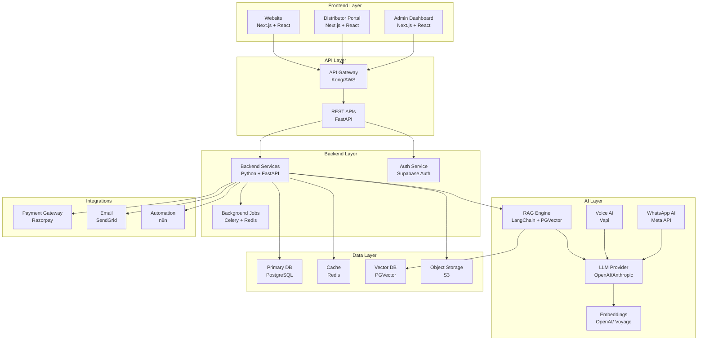
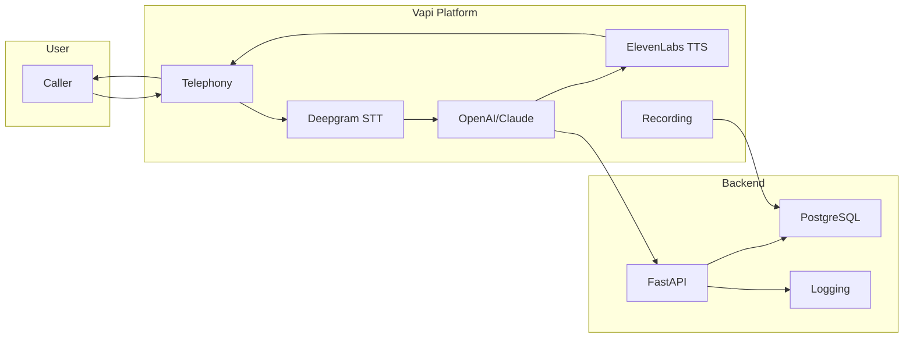
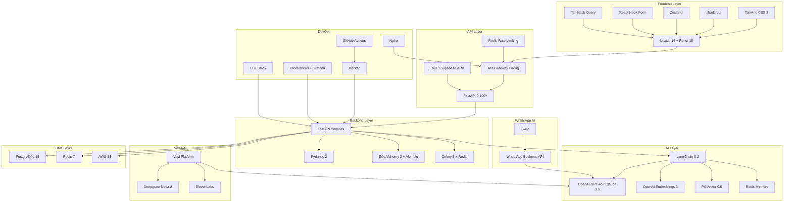

# Project_Context/09_TECH_STACK.md

# Dayjoy Enterprise AI Platform — Technology Stack

> **Purpose:** Official technical blueprint defining every technology, framework, service, language, SDK, infrastructure component, and third-party platform used in the project.
>
> **Audience:** Architects, developers, DevOps engineers, AI engineers, security reviewers, and future AI assistants.
>
> **Status:** This is the technical standard for the Dayjoy Enterprise AI Platform.

---

## Table of Contents

1. [Architecture Overview](#1-architecture-overview)
2. [Programming Languages](#2-programming-languages)
3. [Frontend Stack](#3-frontend-stack)
4. [Backend Stack](#4-backend-stack)
5. [Database Layer](#5-database-layer)
6. [AI Layer](#6-ai-layer)
7. [Voice AI Stack](#7-voice-ai-stack)
8. [WhatsApp AI Stack](#8-whatsapp-ai-stack)
9. [Automation Stack](#9-automation-stack)
10. [API Layer](#10-api-layer)
11. [Security Stack](#11-security-stack)
12. [DevOps Stack](#12-devops-stack)
13. [Development Tools](#13-development-tools)
14. [Testing Stack](#14-testing-stack)
15. [Technology Dependency Diagram](#15-technology-dependency-diagram)
16. [Technology Comparison Tables](#16-technology-comparison-tables)
17. [Version Policy](#17-version-policy)
18. [Architecture Principles](#18-architecture-principles)
19. [Future Technology Roadmap](#19-future-technology-roadmap)

---

## 1. Architecture Overview

### High-Level Architecture

### Design Rationale

- **Monorepo-first:** Single repository for code, docs, and configs to maintain consistency.
- **API-first:** All services expose RESTful APIs for AI tool calling and frontend integration.
- **RAG-first AI:** All factual AI queries use RAG for grounding and citation.
- **Cloud-native:** Designed for cloud deployment with auto-scaling and managed services.
- **Security by design:** Authentication, authorization, encryption, and audit logging from day one.

---

## 2. Programming Languages

| Tech ID | Name | Category | Purpose | Why Selected | Project Modules | Alternatives | Advantages | Limitations | Learning Curve | Licensing | Future Scalability | Status |
|---|---|---|---|---|---|---|---|---|---|---|---|---|
| LANG-001 | Python 3.11+ | Language | Backend services, AI/ML, automation | Rich AI/ML ecosystem, FastAPI, LangChain, Celery support | Backend, AI Layer, Automation | Node.js, Go | Excellent AI libraries, rapid development, readable | Slower than compiled languages | Low | PSF License | High | Confirmed |
| LANG-002 | TypeScript 5+ | Language | Frontend, API contracts, shared types | Type safety, excellent React/Next.js support, single language across stack | Frontend, API Layer | JavaScript | Type safety, better IDE support, fewer runtime errors | Build step required | Low | MIT | High | Confirmed |
| LANG-003 | SQL | Language | Database queries, data analysis | Standard for relational databases, PostgreSQL support | Database Layer | — | Mature, powerful, widely supported | Database-specific | Low | — | High | Confirmed |
| LANG-004 | JavaScript (ES2022+) | Language | Frontend runtime, simple scripts | Browser compatibility, Next.js support | Frontend | — | Universal browser support | Dynamic typing pitfalls | Low | — | High | Confirmed |
| LANG-005 | Bash | Language | Scripts, DevOps automation | Shell scripting for deployment, CI/CD | DevOps | Python | Simple, available everywhere | Not cross-platform | Low | — | Medium | Recommended |

---

## 3. Frontend Stack

### 3.1 Website

| Tech ID | Name | Category | Purpose | Why Selected | Alternatives | Advantages | Limitations | Learning Curve | Licensing | Status |
|---|---|---|---|---|---|---|---|---|---|---|
| FE-001 | Next.js 14+ | Framework | Website, SSR, routing | React framework with SSR, excellent SEO, API routes, App Router | Remix, Gatsby | Performance, SEO, developer experience, Vercel integration | Opinionated structure | Low | MIT | Confirmed |
| FE-002 | React 18+ | UI Library | Component-based UI | Component reusability, large ecosystem, Next.js native | Vue, Svelte | Mature, component model, hooks | Boilerplate | Low | MIT | Confirmed |
| FE-003 | Tailwind CSS 3+ | Styling | Utility-first CSS | Rapid styling, consistent design system, mobile-first | Bootstrap, Chakra UI | Fast development, small bundle, customizable | Utility class verbosity | Low | MIT | Confirmed |
| FE-004 | shadcn/ui | UI Library | Pre-built components | Beautiful, accessible, Tailwind-based, customizable | Material UI, Chakra | Modern design, accessible, no runtime dependency | Manual setup | Low | MIT | Confirmed |
| FE-005 | Zustand | State Management | Global state | Simple, minimal boilerplate, TypeScript support | Redux, Jotai | Lightweight, easy to learn | Less features than Redux | Low | MIT | Confirmed |
| FE-006 | React Hook Form | Form Handling | Form validation | Performance, easy validation, TypeScript support | Formik | Less re-render, simple API | Smaller ecosystem | Low | MIT | Confirmed |
| FE-007 | TanStack Query | Data Fetching | Server state, caching | Automatic caching, background refetch, optimistic updates | SWR, Redux Query | Excellent DX, caching, retries | Learning curve for advanced features | Low | MIT | Confirmed |
| FE-008 | Recharts | Charts | Data visualization | React-based, composable, good documentation | Chart.js, D3 | Easy to use, declarative | Limited customization vs D3 | Low | MIT | Confirmed |
| FE-009 | TanStack Table | Tables | Data tables | Headless, flexible, sorting, pagination, filtering | Material Table | Lightweight, customizable | More setup than opinionated tables | Low | MIT | Confirmed |
| FE-010 | Lucide React | Icons | Icon library | Beautiful, consistent, tree-shakeable | Heroicons, FontAwesome | Modern design, lightweight | Smaller icon set | Low | ISC | Confirmed |

### 3.2 Admin Dashboard

Same as Website (FE-001 to FE-010) with additional:

| Tech ID | Name | Category | Purpose | Why Selected | Alternatives | Advantages | Limitations | Learning Curve | Licensing | Status |
|---|---|---|---|---|---|---|---|---|---|---|
| FE-011 | Next.js App Router | Routing | Admin routing | Server components, layouts, nested routing | Pages Router | Better performance, layouts | Newer, less tutorials | Low | MIT | Confirmed |

### 3.3 Distributor Portal

Same as Website (FE-001 to FE-010).

### 3.4 Internal Dashboard

Same as Admin Dashboard (FE-001 to FE-011).

---

## 4. Backend Stack

| Tech ID | Name | Category | Purpose | Why Selected | Project Modules | Alternatives | Advantages | Limitations | Learning Curve | Licensing | Future Scalability | Status |
|---|---|---|---|---|---|---|---|---|---|---|---|---|
| BE-001 | FastAPI 0.100+ | Framework | REST APIs, async support | Fast, async, automatic OpenAPI docs, Pydantic validation | Flask, Django, Express | Performance, auto docs, type safety | Newer than Flask/Django | Low | MIT | High | Confirmed |
| BE-002 | Pydantic 2+ | Validation | Data validation, settings | Type validation, settings management, FastAPI integration | Marshmallow | Type safety, auto docs, settings | Verbose for complex schemas | Low | MIT | High | Confirmed |
| BE-003 | SQLAlchemy 2+ | ORM | Database operations | Async support, relationship management, migration support | Peewee, Tortoise | Mature, powerful, async | Verbose | Medium | MIT | High | Confirmed |
| BE-004 | Alembic | Migrations | Database schema migrations | SQLAlchemy integration, version control | Manual SQL | Automated, versioned | Learning curve | Low | MIT | High | Confirmed |
| BE-005 | FastAPI + OpenAPI | API Documentation | Auto-generated API docs | Automatic from code, Swagger UI, ReDoc | Manual docs | Always up-to-date, interactive | — | Low | MIT | High | Confirmed |
| BE-006 | Celery 5+ | Background Jobs | Task queue, scheduled jobs | Distributed task queue, Redis broker, scheduling | RQ, Dramatiq | Mature, scalable, scheduling | Complex setup | Medium | BSD | High | Confirmed |
| BE-007 | Redis 7+ | Cache | Caching, Celery broker, rate limiting | In-memory, fast, pub/sub, Celery support | Memcached | Versatile, fast, persistent options | Memory usage | Low | BSD | High | Confirmed |
| BE-008 | HTTPX | HTTP Client | Async HTTP requests | Async support, FastAPI integration | Requests, aiohttp | Async, type hints | Newer | Low | BSD | High | Confirmed |
| BE-009 | Pytest 7+ | Testing | Backend testing | Fixtures, plugins, async support | Unittest | Powerful, ecosystem | Learning curve | Medium | MIT | High | Confirmed |
| BE-010 | Uvicorn | ASGI Server | ASGI server for FastAPI | Fast, async, production-ready | Gunicorn | Performance, async | — | Low | BSD | High | Confirmed |
| BE-011 | Gunicorn | Process Manager | WSGI/ASGI process manager | Process management, worker scaling | — | Mature, stable | — | Low | MIT | High | Confirmed |

---

## 5. Database Layer

| Tech ID | Name | Category | Purpose | Why Selected | Alternatives | Advantages | Limitations | Learning Curve | Licensing | Future Scalability | Status |
|---|---|---|---|---|---|---|---|---|---|---|---|
| DB-001 | PostgreSQL 15+ | Primary Database | Relational data, transactions | ACID compliance, JSON support, PGVector extension, mature | MySQL, MongoDB | Reliable, powerful, extensions | More resource-intensive | Low | PostgreSQL License | High | Confirmed |
| DB-002 | PGVector 0.5+ | Vector Database | Embedding storage, RAG | PostgreSQL extension, no separate DB, cosine similarity | Pinecone, Weaviate | Integrated, no extra infra, ACID | Less scalable than dedicated | Low | MIT | Medium | Confirmed |
| DB-003 | Redis 7+ | Cache | Caching, session, rate limiting | In-memory, fast, pub/sub, Celery support | Memcached | Versatile, persistent options | Memory usage | Low | BSD | High | Confirmed |
| DB-004 | AWS S3 | Object Storage | Documents, media, backups | Scalable, durable, versioning, lifecycle | GCS, Azure Blob | Mature, cheap, reliable | Vendor lock-in | Low | Proprietary | High | Confirmed |
| DB-005 | Supabase (Optional) | Managed PostgreSQL | Managed DB, Auth, Storage | Reduces DevOps, integrated Auth, Storage | Self-hosted PG | Faster setup, managed | Less control, vendor lock-in | Low | MIT + Proprietary | High | Future Consideration |
| DB-006 | AWS RDS | Managed PostgreSQL | Managed database | Automated backups, scaling, patching | Self-hosted | Less DevOps | Cost, vendor lock-in | Low | Proprietary | High | Future Consideration |

---

## 6. AI Layer

| Tech ID | Name | Category | Purpose | Why Selected | Project Modules | Alternatives | Advantages | Limitations | Learning Curve | Licensing | Future Scalability | Status |
|---|---|---|---|---|---|---|---|---|---|---|---|---|
| AI-001 | OpenAI GPT-4o/4o-mini | LLM Provider | Text generation, reasoning | High quality, tool calling, function support, embeddings | Anthropic, Cohere | Reliable, excellent tool calling | Cost, API dependency | Low | Proprietary | High | Confirmed |
| AI-002 | Anthropic Claude 3.5 Sonnet | LLM Provider | Complex reasoning, long context | Long context (200K), excellent reasoning | OpenAI | Better reasoning, long context | Higher cost for some use cases | Low | Proprietary | High | Confirmed |
| AI-003 | OpenAI Text Embeddings 3 | Embedding Model | Document embeddings | High quality, multiple dimensions, cost-effective | Voyage, Cohere | Good quality, cheap | API dependency | Low | Proprietary | High | Confirmed |
| AI-004 | Voyage AI embeddings | Embedding Model | Alternative embeddings | Specialized for RAG, high quality | OpenAI | Better for some domains | Additional vendor | Low | Proprietary | High | Recommended |
| AI-005 | LangChain 0.2+ | RAG Framework | RAG pipeline, tool orchestration | Modular, LCEL, many integrations, Python | LlamaIndex | Mature, extensive integrations | Verbose, can be overkill | Medium | MIT | High | Confirmed |
| AI-006 | LlamaIndex | RAG Framework | Alternative RAG | Specialized for RAG, indexing strategies | LangChain | RAG-first, better indexing | Smaller ecosystem | Medium | MIT | High | Future Consideration |
| AI-007 | LangChain LCEL | Prompt Management | Prompt chains, LCEL syntax | Declarative, composable, easy debugging | Manual prompts | Maintainable, testable | Learning curve | Medium | MIT | High | Confirmed |
| AI-008 | Redis | Memory Strategy | Session memory, conversation history | Fast, pub/sub, TTL support | PostgreSQL | Speed, TTL | Memory cost | Low | BSD | High | Confirmed |
| AI-009 | RAGAS | AI Evaluation | RAG evaluation, hallucination detection | Metrics for RAG quality | Custom eval | Standardized metrics | Learning curve | Medium | MIT | High | Recommended |
| AI-010 | LangSmith | AI Monitoring | Tracing, monitoring, debugging | Observability for LLM apps | Custom logging | Excellent DX, tracing | Cost | Low | Proprietary | High | Recommended |
| AI-011 | Guardrails AI | Guardrails | Output validation, structured output | Structured output, validation | Manual parsing | Type safety, validation | Additional dependency | Medium | MIT | High | Recommended |
| AI-012 | Instructor | Structured Output | Pydantic-based LLM output | Type-safe LLM output, validation | Manual parsing | Excellent DX, type safety | Additional dependency | Low | MIT | High | Recommended |

---

## 7. Voice AI Stack

| Tech ID | Name | Category | Purpose | Why Selected | Alternatives | Advantages | Limitations | Learning Curve | Licensing | Future Scalability | Status |
|---|---|---|---|---|---|---|---|---|---|---|---|
| VA-001 | Vapi | Voice AI Platform | Voice assistant orchestration | Handles STT, TTS, LLM, telephony, latency optimization | Twilio + Custom | All-in-one, low latency, easy setup | Vendor lock-in, cost | Low | Proprietary | High | Confirmed |
| VA-002 | Deepgram Nova-2 | STT | Speech-to-text | Fast, accurate, streaming | Google Speech, Whisper | Low latency, accurate | Cost | Low | Proprietary | High | Confirmed |
| VA-003 | ElevenLabs | TTS | Text-to-speech | Natural voice, multilingual | Google TTS, AWS Polly | High quality, natural | Cost | Low | Proprietary | High | Confirmed |
| VA-004 | Vapi Telephony | Telephony | Phone number, call routing | Integrated with Vapi, easy setup | Twilio | Integrated, simple | Vendor lock-in | Low | Proprietary | High | Confirmed |
| VA-005 | Vapi SIP | SIP | SIP trunking (future) | For custom telephony integration | Twilio | Flexibility | Complex | Medium | Proprietary | High | Future Consideration |
| VA-006 | Vapi Call Recording | Call Recording | Record calls for quality | Built-in Vapi feature | Custom | Integrated, easy | Storage cost | Low | Proprietary | High | Confirmed |
| VA-007 | Vapi Analytics | Voice Analytics | Call analytics, sentiment | Built-in Vapi feature | Custom | Integrated | Limited customization | Low | Proprietary | High | Recommended |

### Voice AI Integration Architecture

---

## 8. WhatsApp AI Stack

| Tech ID | Name | Category | Purpose | Why Selected | Alternatives | Advantages | Limitations | Learning Curve | Licensing | Future Scalability | Status |
|---|---|---|---|---|---|---|---|---|---|---|---|
| WA-001 | Meta WhatsApp Business API | Messaging API | WhatsApp messaging | Official API, template support, high deliverability | Twilio WhatsApp API | Official, reliable | Approval process, template rules | Medium | Proprietary | High | Confirmed |
| WA-002 | Twilio WhatsApp API | WhatsApp Provider | WhatsApp API integration | Managed API, easier onboarding | Direct Meta API | Easier setup, support | Additional cost, vendor | Low | Proprietary | High | Confirmed |
| WA-003 | FastAPI Webhooks | Webhooks | Receive WhatsApp messages | FastAPI webhook endpoints | Flask | Async, type safety | — | Low | MIT | High | Confirmed |
| WA-004 | Media Storage (S3) | Media Handling | Store/send media | S3 for images, documents | Local storage | Scalable, durable | Cost | Low | Proprietary | High | Confirmed |
| WA-005 | Template Management | Templates | Pre-approved message templates | Required for outbound messages | — | High deliverability | Approval required | Medium | Proprietary | High | Confirmed |
| WA-006 | Celery | Automation | Scheduled messages, notifications | Celery tasks for automation | Cron | Distributed, scalable | Complexity | Medium | BSD | High | Confirmed |
| WA-007 | FastAPI Notifications | Notifications | Transactional notifications | Webhook-based notifications | Email | High open rate | Template approval | Medium | Proprietary | High | Confirmed |

---

## 9. Automation Stack

| Tech ID | Name | Category | Purpose | Why Selected | Alternatives | Advantages | Limitations | Learning Curve | Licensing | Future Scalability | Status |
|---|---|---|---|---|---|---|---|---|---|---|---|
| AUT-001 | n8n 1.0+ | Workflow Engine | Workflow automation, integrations | Visual workflow builder, 200+ integrations, self-hostable | Zapier, Make | Open-source, self-hostable, flexible | Self-hosting maintenance | Low | Apache 2.0 | High | Confirmed |
| AUT-002 | Celery Beat | Scheduling | Scheduled tasks, cron jobs | Celery scheduler, distributed | Cron | Distributed, scalable | Complex setup | Medium | BSD | High | Confirmed |
| AUT-003 | FastAPI Webhooks | Event Processing | Event-driven automation | Async webhook handling | Flask | Type safety, async | — | Low | MIT | High | Confirmed |
| AUT-004 | Redis Pub/Sub | Event Processing | Real-time event processing | Pub/sub for events | Kafka (overkill) | Simple, fast | Not persistent | Low | BSD | Medium | Confirmed |
| AUT-005 | n8n Webhooks | Webhooks | n8n webhook triggers | Native n8n integration | Custom | Visual, easy | n8n dependency | Low | Apache 2.0 | High | Confirmed |

---

## 10. API Layer

| Tech ID | Name | Category | Purpose | Why Selected | Alternatives | Advantages | Limitations | Learning Curve | Licensing | Future Scalability | Status |
|---|---|---|---|---|---|---|---|---|---|---|---|
| API-001 | FastAPI + OpenAPI | REST APIs | RESTful API design | Auto OpenAPI docs, type safety, async | Flask, Express | Fast, auto docs, type safety | Newer | Low | MIT | High | Confirmed |
| API-002 | Supabase Auth / JWT | Authentication | JWT-based auth | Integrated auth, JWT tokens | Auth0, Firebase | Easy, integrated | Vendor lock-in | Low | MIT + Proprietary | High | Confirmed |
| API-003 | API Versioning (URL) | Versioning | API versioning | URL versioning (/api/v1) | Header versioning | Simple, clear | URL pollution | Low | — | High | Confirmed |
| API-004 | Kong / AWS API Gateway | API Gateway | API gateway, rate limiting | Centralized gateway, auth, rate limiting | Nginx | Managed, scalable | Cost (AWS) | Medium | Apache 2.0 / Proprietary | High | Confirmed |
| API-005 | Redis Rate Limiting | Rate Limiting | Rate limiting per user/IP | Redis-based rate limiting | API Gateway | Fast, flexible | Redis dependency | Low | BSD | High | Confirmed |
| API-006 | Pydantic Error Handling | Error Handling | Consistent error responses | Structured error schemas | Manual | Type safety, consistent | — | Low | MIT | High | Confirmed |

---

## 11. Security Stack

| Tech ID | Name | Category | Purpose | Why Selected | Alternatives | Advantages | Limitations | Learning Curve | Licensing | Future Scalability | Status |
|---|---|---|---|---|---|---|---|---|---|---|---|
| SEC-001 | JWT | JWT | Token-based authentication | Stateless, widely supported | Session-based | Scalable, simple | Token management | Low | — | High | Confirmed |
| SEC-002 | Supabase Auth / OAuth 2.0 | OAuth | OAuth2 authentication | Integrated, easy setup | Auth0, Firebase | Easy, integrated | Vendor lock-in | Low | MIT + Proprietary | High | Confirmed |
| SEC-003 | AWS Secrets Manager / Environment Variables | Secret Management | Store secrets securely | Managed secrets, encryption | Dotenv files | Secure, managed | Cost (AWS) | Low | Proprietary | High | Confirmed |
| SEC-004 | TLS/SSL | Encryption | Encrypt data in transit | HTTPS, secure communication | — | Standard, essential | Certificate management | Low | — | High | Confirmed |
| SEC-005 | AES-256 | Encryption | Encrypt data at rest | Industry standard, strong encryption | — | Secure, standard | — | Low | — | High | Confirmed |
| SEC-006 | Structured Logging (JSON) | Logging | Audit trails, debugging | Machine-parseable logs | Plain text | Queryable, structured | Larger size | Low | — | High | Confirmed |
| SEC-007 | Prometheus + Grafana | Monitoring | System monitoring, metrics | Open-source, powerful | Datadog, New Relic | Open-source, customizable | Self-hosting | Medium | Apache 2.0 | High | Confirmed |
| SEC-008 | AWS WAF | WAF | Web application firewall | DDoS protection, rule-based | Cloudflare | Integrated with AWS | Cost | Low | Proprietary | High | Confirmed |
| SEC-009 | PostgreSQL Audit Logging | Audit Trails | Database audit logs | Track all DB changes | Manual logging | Built-in, reliable | Performance impact | Low | PostgreSQL License | High | Confirmed |

---

## 12. DevOps Stack

| Tech ID | Name | Category | Purpose | Why Selected | Alternatives | Advantages | Limitations | Learning Curve | Licensing | Future Scalability | Status |
|---|---|---|---|---|---|---|---|---|---|---|---|
| DEV-001 | Docker | Containerization | Containerize applications | Consistent environments, deployment | Podman | Standard, mature | Learning curve | Low | Apache 2.0 | High | Confirmed |
| DEV-002 | Nginx | Reverse Proxy | Reverse proxy, load balancing | Mature, performant, flexible | Traefik, Caddy | Stable, powerful | Configuration | Medium | BSD | High | Confirmed |
| DEV-003 | GitHub Actions | CI/CD | CI/CD pipelines | Integrated with GitHub, easy setup | GitLab CI, Jenkins | Easy, free for public | Vendor lock-in | Low | Proprietary | High | Confirmed |
| DEV-004 | Docker Compose | Environment Management | Local development environments | Multi-container orchestration | Manual | Easy, reproducible | Not for production | Low | Apache 2.0 | Medium | Confirmed |
| DEV-005 | Prometheus + Grafana | Monitoring | Metrics, dashboards | Open-source, powerful | Datadog | Customizable, free | Self-hosting | Medium | Apache 2.0 | High | Confirmed |
| DEV-006 | ELK Stack (Elasticsearch, Logstash, Kibana) | Logging | Centralized logging | Searchable logs, dashboards | Loki, Splunk | Powerful, searchable | Resource-intensive | Medium | Apache 2.0 | High | Confirmed |
| DEV-007 | AWS S3 + RDS Snapshots | Backup | Automated backups | Managed, reliable | Manual | Automated, durable | Cost | Low | Proprietary | High | Confirmed |
| DEV-008 | Kubernetes (K8s) | Scaling | Container orchestration (future) | Auto-scaling, self-healing | Docker Swarm | Scalable, resilient | Complex | High | Apache 2.0 | Very High | Future Consideration |
| DEV-009 | AWS ECS / Fargate | Scaling | Managed container orchestration | Less complex than K8s | K8s | Managed, simpler | Less flexible | Medium | Proprietary | High | Future Consideration |

---

## 13. Development Tools

| Tech ID | Name | Category | Purpose | Why Selected | Alternatives | Advantages | Limitations | Learning Curve | Licensing | Status |
|---|---|---|---|---|---|---|---|---|---|---|
| DEV-TOOL-001 | VS Code | IDE | Code editor | Excellent Python/TypeScript support, AI extensions | PyCharm, WebStorm | Free, extensions, AI integration | — | Low | Proprietary | Confirmed |
| DEV-TOOL-002 | Cursor / GitHub Copilot | AI Coding Assistant | AI-assisted coding | Code generation, autocomplete | Tabnine | Productivity boost | Cost, privacy | Low | Proprietary | Confirmed |
| DEV-TOOL-003 | Git | Version Control | Source code management | Standard, distributed | SVN | Mature, distributed | Learning curve | Low | GPL | Confirmed |
| DEV-TOOL-004 | GitHub | Repository | Code hosting, collaboration | Integrated with Actions, Issues | GitLab, Bitbucket | Easy, free for public | Vendor lock-in | Low | Proprietary | Confirmed |
| DEV-TOOL-005 | MkDocs / Docusaurus | Documentation | Documentation generation | Markdown-based, easy | Notion, Confluence | Versioned, searchable | Setup | Low | MIT | Confirmed |
| DEV-TOOL-006 | Postman / Insomnia | API Testing | API testing | GUI, collections, environments | curl | Easy, collaborative | Cost (Postman) | Low | Proprietary | Confirmed |
| DEV-TOOL-007 | Supabase Studio / pgAdmin | Database Management | Database GUI | Visual DB management | DBeaver | Easy, integrated | Vendor (Supabase) | Low | MIT | Confirmed |
| DEV-TOOL-008 | Figma | Design | UI/UX design | Collaborative, component-based | Sketch, Adobe XD | Real-time, free tier | Learning curve | Medium | Proprietary | Confirmed |
| DEV-TOOL-009 | Linear / GitHub Projects | Project Management | Task tracking | Integrated with GitHub | Jira, Trello | Simple, fast | Limited features (GitHub) | Low | Proprietary | Confirmed |

---

## 14. Testing Stack

| Tech ID | Name | Category | Purpose | Why Selected | Alternatives | Advantages | Limitations | Learning Curve | Licensing | Future Scalability | Status |
|---|---|---|---|---|---|---|---|---|---|---|---|
| TEST-001 | Pytest 7+ | Unit Testing | Python unit testing | Fixtures, plugins, async support | Unittest | Powerful, ecosystem | Learning curve | Medium | MIT | High | Confirmed |
| TEST-002 | Jest | Unit Testing | TypeScript/JavaScript testing | Fast, snapshot testing, React support | Mocha, Vitest | Mature, React integration | JavaScript-only | Low | MIT | High | Confirmed |
| TEST-003 | Playwright | Integration Testing | End-to-end browser testing | Cross-browser, reliable, auto-wait | Selenium, Cypress | Reliable, fast | Resource-intensive | Medium | Apache 2.0 | High | Confirmed |
| TEST-004 | Pytest + HTTPX | API Testing | Backend API testing | Async support, fixtures | Postman | Code-based, repeatable | Learning curve | Medium | MIT | High | Confirmed |
| TEST-005 | RAGAS | AI Evaluation | RAG quality evaluation | Hallucination detection, faithfulness | Custom eval | Standardized metrics | Learning curve | Medium | MIT | High | Recommended |
| TEST-006 | LangSmith Evaluations | AI Evaluation | LLM app evaluation | Integrated with LangChain, tracing | Custom | Easy setup, tracing | Cost | Low | Proprietary | High | Recommended |
| TEST-007 | Locust | Load Testing | Load testing, performance | Python-based, distributed | JMeter | Code-based, scalable | Learning curve | Medium | MIT | High | Recommended |
| TEST-008 | OWASP ZAP | Security Testing | Security scanning | Automated security testing | Burp Suite | Free, automated | False positives | Medium | Apache 2.0 | High | Recommended |

---

## 15. Technology Dependency Diagram

---

## 16. Technology Comparison Tables

### Frontend Framework Comparison

| Technology | Why Selected | Alternative | Reason Not Selected |
|---|---|---|---|
| Next.js 14 | SSR, SEO, App Router, API routes | Remix | Next.js has larger ecosystem, Vercel integration |
| Next.js 14 | SSR, performance | Gatsby | Gatsby is more static-focused, less flexible |
| React 18 | Component model, hooks, ecosystem | Vue 3 | React has larger ecosystem, more hiring pool |
| React 18 | Component reusability | Svelte | Svelte is newer, smaller ecosystem |
| Tailwind CSS 3 | Utility-first, fast, customizable | Bootstrap | Tailwind is more modern, smaller bundle |
| Tailwind CSS 3 | Mobile-first | Chakra UI | Tailwind is more flexible, no runtime |

### Backend Framework Comparison

| Technology | Why Selected | Alternative | Reason Not Selected |
|---|---|---|---|
| FastAPI 0.100+ | Fast, async, auto docs, type safety | Flask | Flask is synchronous, slower |
| FastAPI 0.100+ | Modern Python | Django | Django is heavier, more opinionated |
| FastAPI 0.100+ | Async support | Express (Node.js) | Python has better AI/ML ecosystem |
| SQLAlchemy 2 | Async, powerful ORM | Peewee | Peewee is simpler, less features |
| SQLAlchemy 2 | Mature, relationships | Tortoise ORM | Tortoise is newer, less mature |
| Celery 5 | Distributed, mature, scheduling | RQ | RQ is simpler, less scalable |
| Celery 5 | Feature-rich | Dramatiq | Dramatiq is newer, smaller ecosystem |

### Database Comparison

| Technology | Why Selected | Alternative | Reason Not Selected |
|---|---|---|---|
| PostgreSQL 15 | ACID, JSON, PGVector, mature | MySQL | PostgreSQL has better JSON, extensions |
| PostgreSQL 15 | Extensions (PGVector) | MongoDB | MongoDB lacks ACID, not ideal for RAG |
| PGVector 0.5 | Integrated, no separate DB | Pinecone | Pinecone is managed but extra cost |
| PGVector 0.5 | ACID, PostgreSQL extension | Weaviate | Weaviate is separate service |
| Redis 7 | Versatile (cache, Celery, pub/sub) | Memcached | Memcached is cache-only |
| AWS S3 | Scalable, durable, versioning | GCS | S3 is more mature, cheaper |
| AWS S3 | Reliable | Azure Blob | S3 has larger ecosystem |

### AI Stack Comparison

| Technology | Why Selected | Alternative | Reason Not Selected |
|---|---|---|---|
| OpenAI GPT-4o | Quality, tool calling, embeddings | Anthropic Claude | OpenAI has better tool calling |
| OpenAI GPT-4o | Reliable | Cohere | Cohere is less mature |
| Claude 3.5 Sonnet | Long context, reasoning | OpenAI | Claude has better long-context reasoning |
| LangChain 0.2 | Modular, many integrations | LlamaIndex | LlamaIndex is RAG-focused, smaller ecosystem |
| LangChain 0.2 | LCEL, mature | Custom | Custom is more work, less tested |
| OpenAI Embeddings 3 | Quality, cost-effective | Voyage AI | Voyage is specialized but extra vendor |
| RAGAS | Standardized RAG metrics | Custom eval | Custom is less standardized |
| LangSmith | Tracing, monitoring | Custom logging | Custom is more work |

### Voice AI Comparison

| Technology | Why Selected | Alternative | Reason Not Selected |
|---|---|---|---|
| Vapi | All-in-one, low latency | Twilio + Custom | Twilio requires more setup |
| Vapi | Integrated STT/TTS/LLM | Custom | Custom is complex, higher latency |
| Deepgram Nova-2 | Fast, accurate, streaming | Google Speech | Deepgram is faster for streaming |
| Deepgram Nova-2 | Low latency | Whisper | Whisper is slower, not streaming |
| ElevenLabs | Natural voice quality | Google TTS | ElevenLabs is more natural |
| ElevenLabs | Multilingual | AWS Polly | ElevenLabs is higher quality |

---

## 17. Version Policy

### Versioning Strategy

| Component | Versioning Strategy | Rationale |
|---|---|---|
| Python Packages | Pin major.minor (e.g., `fastapi==0.100.*`) | Stability with security patches |
| Node.js Packages | Pin major (e.g., `next@14`) | Major version stability |
| Docker Images | Pin specific version (e.g., `python:3.11-slim`) | Reproducible builds |
| Database | PostgreSQL 15+ | Long-term support version |
| APIs | URL versioning (`/api/v1/`) | Clear, cacheable, simple |

### Upgrade Strategy

| Component | Upgrade Frequency | Process |
|---|---|---|
| Python Packages | Monthly | Review changelogs, test in staging, deploy |
| Node.js Packages | Monthly | Automated (Dependabot), test, deploy |
| Docker Images | Quarterly | Review CVEs, test, update |
| LLM Providers | As needed | Monitor provider updates, test new models |
| Database | Annually | Review PostgreSQL releases, test migrations |
| LLM Providers | As needed | Monitor new model releases, evaluate |

### Dependency Management

| Tool | Purpose | Configuration |
|---|---|---|
| pip + requirements.txt | Python dependencies | Pin versions, use `pip-tools` |
| npm / pnpm | Node.js dependencies | Use `package.json` with locked versions |
| Docker | Container dependencies | Use specific base image versions |
| Dependabot | Automated dependency updates | Enable for GitHub repository |
| Poetry (Optional) | Python dependency management | Alternative to pip-tools |

### Long-Term Maintenance

| Component | LTS Version | Support Period |
|---|---|---|
| Python | 3.11+ | Until 2027+ |
| Node.js | 20+ LTS | Until 2026+ |
| PostgreSQL | 15+ | 5+ years |
| Next.js | 14+ | Follow Next.js LTS |
| React | 18+ | Long-term support |
| Docker | Latest stable | Continuous |

---

## 18. Architecture Principles

### Scalability

The chosen stack supports scalability through:

- **Horizontal scaling:** FastAPI + Uvicorn + Gunicorn can scale horizontally.
- **Async support:** FastAPI and Celery support async operations for high concurrency.
- **Database scaling:** PostgreSQL with read replicas, PGVector for vector search.
- **Caching:** Redis for caching, session management, and rate limiting.
- **Cloud-native:** Designed for AWS/GCP/Azure with auto-scaling and managed services.
- **Container orchestration:** Docker + Kubernetes (future) for container orchestration.

### Reliability

- **ACID compliance:** PostgreSQL ensures data integrity.
- **Retry logic:** Celery for background jobs with retry support.
- **Health checks:** FastAPI health endpoints, Kubernetes probes (future).
- **Monitoring:** Prometheus + Grafana for metrics, ELK for logging.
- **Backups:** Automated S3 + RDS snapshots for disaster recovery.

### Maintainability

- **Type safety:** TypeScript + Pydantic for type safety across stack.
- **Modular design:** LangChain LCEL for composable AI pipelines.
- **Documentation:** Auto-generated OpenAPI docs, MkDocs for project docs.
- **Testing:** Pytest, Jest, Playwright for comprehensive test coverage.
- **CI/CD:** GitHub Actions for automated testing and deployment.

### Security

- **Authentication:** JWT + Supabase Auth for secure authentication.
- **Authorization:** RBAC via Supabase Auth + custom middleware.
- **Encryption:** TLS for data in transit, AES-256 for data at rest.
- **Secret management:** AWS Secrets Manager or environment variables.
- **Audit logging:** PostgreSQL audit logging, structured JSON logs.
- **WAF:** AWS WAF for DDoS protection and rule-based filtering.

### Cost Optimization

- **Open-source:** Most technologies are open-source (FastAPI, LangChain, PostgreSQL, Redis).
- **Managed services:** Use managed services (Supabase, AWS S3, RDS) to reduce DevOps overhead.
- **Serverless:** Consider serverless (AWS Lambda, Vercel) for cost-effective scaling.
- **Caching:** Redis caching to reduce database load.
- **Vector DB:** PGVector (integrated) instead of separate vector DB (cost savings).

### AI Extensibility

- **Modular AI:** LangChain LCEL for composable AI pipelines.
- **Tool calling:** FastAPI + LangChain for AI tool/function calling.
- **RAG-first:** PGVector + LangChain for RAG-based AI.
- **Multi-LLM:** Support for OpenAI, Anthropic, and future providers.
- **Evaluation:** RAGAS + LangSmith for AI quality monitoring.
- **Guardrails:** Guardrails AI + Instructor for structured, validated output.

---

## 19. Future Technology Roadmap

### Technologies to Consider (12-24 months)

| Technology | Category | Purpose | When to Adopt | Rationale |
|---|---|---|---|---|
| Kubernetes | Container Orchestration | Auto-scaling, self-healing | After 10K+ daily users | Better scalability, resilience |
| AWS Fargate | Container Orchestration | Managed containers | Alternative to K8s | Less complex than K8s |
| Kafka | Event Streaming | Event-driven architecture | After high event volume | Better than Redis Pub/Sub for persistence |
| LangSmith | AI Observability | Tracing, monitoring, eval | After MVP | Better AI debugging and monitoring |
| Neo4j | Graph Database | Relationship queries | For complex distributor networks | Better for graph-like queries |
| Cloudflare | CDN + WAF | Global CDN, WAF | For international expansion | Better global performance |
| Multi-region Deployment | Infrastructure | Geo-distributed deployment | After international expansion | Lower latency, redundancy |
| Edge AI | AI Deployment | Deploy AI at edge | For low-latency requirements | Reduce latency, cost |
| Ray | Distributed AI | Scale AI workloads | For large-scale AI | Better than Celery for AI workloads |
| Llama 3 (Self-hosted) | LLM | Self-hosted LLM | For cost reduction | Reduce API costs, more control |
| Weaviate / Pinecone | Vector Database | Dedicated vector DB | After PGVector limitations | Better scalability for large datasets |
| Auth0 | Authentication | Enterprise authentication | For enterprise features | More features than Supabase Auth |
| Datadog | Monitoring | Unified monitoring | After scaling | Better than self-hosted Prometheus |
| Terraform | Infrastructure as Code | IaC for AWS | For complex infra | Better than manual setup |
| ArgoCD | GitOps | Kubernetes GitOps | After K8s adoption | GitOps best practices |

### Technology Deprecation Plan

| Technology | Deprecation Trigger | Replacement | Timeline |
|---|---|---|---|
| PGVector | >10M vectors or performance issues | Pinecone / Weaviate | 12-18 months |
| Supabase Auth | Enterprise features needed | Auth0 | 12-24 months |
| Self-hosted Prometheus | Scaling issues | Datadog / New Relic | 12-18 months |
| Celery | High event volume | Kafka + Ray | 18-24 months |
| Single-region | International expansion | Multi-region | 18-24 months |

---

## Related Documents

- `00_MASTER_CONTEXT.md`
- `02_KNOWN_FACTS.md`
- `03_UNKNOWN_INFORMATION.md`
- `06_DECISIONS.md`
- `08_CONSTRAINTS.md`
- `Project_Context/04_AI_VISION.md`
- `Project_Context/05_PERSONAS.md`
- `Project_Context/06_FEATURE_WISHLIST.md`
- `Project_Context/07_BUSINESS_PROCESSES.md`
- `Project_Context/08_CONSTRAINTS.md`

---

## Appendix A: Complete Technology Index

| Tech ID | Name | Category | Status |
|---|---|---|---|
| LANG-001 | Python 3.11+ | Language | Confirmed |
| LANG-002 | TypeScript 5+ | Language | Confirmed |
| LANG-003 | SQL | Language | Confirmed |
| LANG-004 | JavaScript (ES2022+) | Language | Confirmed |
| LANG-005 | Bash | Language | Recommended |
| FE-001 | Next.js 14+ | Framework | Confirmed |
| FE-002 | React 18+ | UI Library | Confirmed |
| FE-003 | Tailwind CSS 3+ | Styling | Confirmed |
| FE-004 | shadcn/ui | UI Library | Confirmed |
| FE-005 | Zustand | State Management | Confirmed |
| FE-006 | React Hook Form | Form Handling | Confirmed |
| FE-007 | TanStack Query | Data Fetching | Confirmed |
| FE-008 | Recharts | Charts | Confirmed |
| FE-009 | TanStack Table | Tables | Confirmed |
| FE-010 | Lucide React | Icons | Confirmed |
| FE-011 | Next.js App Router | Routing | Confirmed |
| BE-001 | FastAPI 0.100+ | Framework | Confirmed |
| BE-002 | Pydantic 2+ | Validation | Confirmed |
| BE-003 | SQLAlchemy 2+ | ORM | Confirmed |
| BE-004 | Alembic | Migrations | Confirmed |
| BE-005 | FastAPI + OpenAPI | API Documentation | Confirmed |
| BE-006 | Celery 5+ | Background Jobs | Confirmed |
| BE-007 | Redis 7+ | Cache | Confirmed |
| BE-008 | HTTPX | HTTP Client | Confirmed |
| BE-009 | Pytest 7+ | Testing | Confirmed |
| BE-010 | Uvicorn | ASGI Server | Confirmed |
| BE-011 | Gunicorn | Process Manager | Confirmed |
| DB-001 | PostgreSQL 15+ | Primary Database | Confirmed |
| DB-002 | PGVector 0.5+ | Vector Database | Confirmed |
| DB-003 | Redis 7+ | Cache | Confirmed |
| DB-004 | AWS S3 | Object Storage | Confirmed |
| DB-005 | Supabase (Optional) | Managed PostgreSQL | Future Consideration |
| DB-006 | AWS RDS | Managed PostgreSQL | Future Consideration |
| AI-001 | OpenAI GPT-4o/4o-mini | LLM Provider | Confirmed |
| AI-002 | Anthropic Claude 3.5 Sonnet | LLM Provider | Confirmed |
| AI-003 | OpenAI Text Embeddings 3 | Embedding Model | Confirmed |
| AI-004 | Voyage AI embeddings | Embedding Model | Recommended |
| AI-005 | LangChain 0.2+ | RAG Framework | Confirmed |
| AI-006 | LlamaIndex | RAG Framework | Future Consideration |
| AI-007 | LangChain LCEL | Prompt Management | Confirmed |
| AI-008 | Redis | Memory Strategy | Confirmed |
| AI-009 | RAGAS | AI Evaluation | Recommended |
| AI-010 | LangSmith | AI Monitoring | Recommended |
| AI-011 | Guardrails AI | Guardrails | Recommended |
| AI-012 | Instructor | Structured Output | Recommended |
| VA-001 | Vapi | Voice AI Platform | Confirmed |
| VA-002 | Deepgram Nova-2 | STT | Confirmed |
| VA-003 | ElevenLabs | TTS | Confirmed |
| VA-004 | Vapi Telephony | Telephony | Confirmed |
| VA-005 | Vapi SIP | SIP | Future Consideration |
| VA-006 | Vapi Call Recording | Call Recording | Confirmed |
| VA-007 | Vapi Analytics | Voice Analytics | Recommended |
| WA-001 | Meta WhatsApp Business API | Messaging API | Confirmed |
| WA-002 | Twilio WhatsApp API | WhatsApp Provider | Confirmed |
| WA-003 | FastAPI Webhooks | Webhooks | Confirmed |
| WA-004 | Media Storage (S3) | Media Handling | Confirmed |
| WA-005 | Template Management | Templates | Confirmed |
| WA-006 | Celery | Automation | Confirmed |
| WA-007 | FastAPI Notifications | Notifications | Confirmed |
| AUT-001 | n8n 1.0+ | Workflow Engine | Confirmed |
| AUT-002 | Celery Beat | Scheduling | Confirmed |
| AUT-003 | FastAPI Webhooks | Event Processing | Confirmed |
| AUT-004 | Redis Pub/Sub | Event Processing | Confirmed |
| AUT-005 | n8n Webhooks | Webhooks | Confirmed |
| API-001 | FastAPI + OpenAPI | REST APIs | Confirmed |
| API-002 | Supabase Auth / JWT | Authentication | Confirmed |
| API-003 | API Versioning (URL) | Versioning | Confirmed |
| API-004 | Kong / AWS API Gateway | API Gateway | Confirmed |
| API-005 | Redis Rate Limiting | Rate Limiting | Confirmed |
| API-006 | Pydantic Error Handling | Error Handling | Confirmed |
| SEC-001 | JWT | JWT | Confirmed |
| SEC-002 | Supabase Auth / OAuth 2.0 | OAuth | Confirmed |
| SEC-003 | AWS Secrets Manager / Environment Variables | Secret Management | Confirmed |
| SEC-004 | TLS/SSL | Encryption | Confirmed |
| SEC-005 | AES-256 | Encryption | Confirmed |
| SEC-006 | Structured Logging (JSON) | Logging | Confirmed |
| SEC-007 | Prometheus + Grafana | Monitoring | Confirmed |
| SEC-008 | AWS WAF | WAF | Confirmed |
| SEC-009 | PostgreSQL Audit Logging | Audit Trails | Confirmed |
| DEV-001 | Docker | Containerization | Confirmed |
| DEV-002 | Nginx | Reverse Proxy | Confirmed |
| DEV-003 | GitHub Actions | CI/CD | Confirmed |
| DEV-004 | Docker Compose | Environment Management | Confirmed |
| DEV-005 | Prometheus + Grafana | Monitoring | Confirmed |
| DEV-006 | ELK Stack | Logging | Confirmed |
| DEV-007 | AWS S3 + RDS Snapshots | Backup | Confirmed |
| DEV-008 | Kubernetes (K8s) | Scaling | Future Consideration |
| DEV-009 | AWS ECS / Fargate | Scaling | Future Consideration |
| DEV-TOOL-001 | VS Code | IDE | Confirmed |
| DEV-TOOL-002 | Cursor / GitHub Copilot | AI Coding Assistant | Confirmed |
| DEV-TOOL-003 | Git | Version Control | Confirmed |
| DEV-TOOL-004 | GitHub | Repository | Confirmed |
| DEV-TOOL-005 | MkDocs / Docusaurus | Documentation | Confirmed |
| DEV-TOOL-006 | Postman / Insomnia | API Testing | Confirmed |
| DEV-TOOL-007 | Supabase Studio / pgAdmin | Database Management | Confirmed |
| DEV-TOOL-008 | Figma | Design | Confirmed |
| DEV-TOOL-009 | Linear / GitHub Projects | Project Management | Confirmed |
| TEST-001 | Pytest 7+ | Unit Testing | Confirmed |
| TEST-002 | Jest | Unit Testing | Confirmed |
| TEST-003 | Playwright | Integration Testing | Confirmed |
| TEST-004 | Pytest + HTTPX | API Testing | Confirmed |
| TEST-005 | RAGAS | AI Evaluation | Recommended |
| TEST-006 | LangSmith Evaluations | AI Evaluation | Recommended |
| TEST-007 | Locust | Load Testing | Recommended |
| TEST-008 | OWASP ZAP | Security Testing | Recommended |

---

**END OF DOCUMENT**