# Project_Context/11_DOCUMENTATION_RULES.md

# Dayjoy Enterprise AI Platform — Documentation Standards

> **Purpose:** Official documentation governance standard for all project documentation.
>
> **Audience:** All contributors, technical writers, AI assistants, reviewers, and maintainers.
>
> **Enforcement:** All documentation must follow these standards. Deviations require explicit approval.

---

## Table of Contents

1. [Documentation Principles](#1-documentation-principles)
2. [Documentation Categories](#2-documentation-categories)
3. [Knowledge Base Standards](#3-knowledge-base-standards)
4. [AI Documentation Standards](#4-ai-documentation-standards)
5. [Code Documentation Standards](#5-code-documentation-standards)
6. [API Documentation Standards](#6-api-documentation-standards)
7. [Diagram Standards](#7-diagram-standards)
8. [Markdown Standards](#8-markdown-standards)
9. [Folder Organization](#9-folder-organization)
10. [Metadata Standards](#10-metadata-standards)
11. [Version Control](#11-version-control)
12. [Review Process](#12-review-process)
13. [AI Documentation Guidelines](#13-ai-documentation-guidelines)
14. [Documentation Lifecycle](#14-documentation-lifecycle)
15. [Templates](#15-templates)
16. [Documentation Quality Metrics](#16-documentation-quality-metrics)

---

## 1. Documentation Principles

| Rule ID | Category | Rule Description | Purpose | Examples | Applies To | Enforcement |
|---|---|---|---|---|---|---|
| DOC-PRIN-001 | Principles | Documentation must be accurate | Trust, reliability | Verified facts, citations | All documentation | **Required** |
| DOC-PRIN-002 | Principles | Documentation must be consistent | Predictability, professionalism | Consistent formatting, terminology | All documentation | **Required** |
| DOC-PRIN-003 | Principles | Documentation must be searchable | Discoverability | Clear headings, metadata, tags | All documentation | **Required** |
| DOC-PRIN-004 | Principles | Documentation must be modular | Reusability, maintainability | Small, focused documents | All documentation | **Required** |
| DOC-PRIN-005 | Principles | Documentation must be version-controlled | Traceability, auditability | Git versioning, changelogs | All documentation | **Required** |
| DOC-PRIN-006 | Principles | Documentation must be RAG-friendly | AI retrieval quality | Clear structure, metadata, citations | All documentation | **Required** |
| DOC-PRIN-007 | Principles | Documentation must be enterprise-grade | Professionalism, scalability | Complete, reviewed, approved | All documentation | **Required** |
| DOC-PRIN-008 | Principles | Single source of truth | Avoid duplication | One authoritative document per topic | All documentation | **Required** |
| DOC-PRIN-009 | Principles | Cross-reference related documents | Navigation, context | Links to related docs | All documentation | **Required** |
| DOC-PRIN-010 | Principles | Keep documentation up-to-date | Accuracy | Regular reviews, update process | All documentation | **Required** |

---

## 2. Documentation Categories

### 2.1 Project Documentation

| Rule ID | Category | Rule Description | Purpose | Examples | Applies To | Enforcement |
|---|---|---|---|---|---|---|
| DOC-PROJ-001 | Project | Master Context document required | Project overview, vision | `00_MASTER_CONTEXT.md` | Project docs | **Required** |
| DOC-PROJ-002 | Project | Business documents required | Business context, model | `02_Business_Model.md`, `04_Distributor_System.md` | Business docs | **Required** |
| DOC-PROJ-003 | Project | Product documents required | Product knowledge | `03_Product_Research.md`, `06_FAQs.md` | Product docs | **Required** |
| DOC-PROJ-004 | Project | Technical documents required | Technical standards | `09_TECH_STACK.md`, `10_CODING_STANDARDS.md` | Technical docs | **Required** |
| DOC-PROJ-005 | Project | Roadmaps required | Planning, priorities | `07_NEXT_ACTIONS.md` | Planning docs | **Required** |
| DOC-PROJ-006 | Project | Architecture documents required | System design | `11_ARCHITECTURE.md` (future) | Architecture docs | **Required** |
| DOC-PROJ-007 | Project | Use numbered prefix for ordering | Clear sequence | `00_`, `01_`, `02_` | Project docs | **Required** |
| DOC-PROJ-008 | Project | Include table of contents | Navigation | `## Table of Contents` | All project docs | **Required** |
| DOC-PROJ-009 | Project | Cross-reference related documents | Context, navigation | `See also: 03_Product_Research.md` | All project docs | **Required** |
| DOC-PROJ-010 | Project | Maintain document index | Discoverability | `01_PROJECT_INDEX.md` | Project docs | **Required** |

### 2.2 Technical Documentation

| Rule ID | Category | Rule Description | Purpose | Examples | Applies To | Enforcement |
|---|---|---|---|---|---|---|
| DOC-TECH-001 | Technical | API documentation required | API usability | `docs/api/` | API docs | **Required** |
| DOC-TECH-002 | Technical | Database documentation required | Schema clarity | `docs/database/schema.md` | Database docs | **Required** |
| DOC-TECH-003 | Technical | System design documents required | Architecture clarity | `docs/architecture/` | Architecture docs | **Required** |
| DOC-TECH-004 | Technical | Infrastructure documentation required | Deployment clarity | `docs/infrastructure/` | Infrastructure docs | **Required** |
| DOC-TECH-005 | Technical | Deployment guides required | Reproducibility | `docs/deployment.md` | Deployment docs | **Required** |
| DOC-TECH-006 | Technical | Security documentation required | Security compliance | `docs/security/` | Security docs | **Required** |
| DOC-TECH-007 | Technical | Include diagrams | Clarity | Mermaid diagrams | All technical docs | **Recommended** |
| DOC-TECH-008 | Technical | Include examples | Usability | Code examples, API examples | All technical docs | **Required** |
| DOC-TECH-009 | Technical | Document assumptions | Clarity | List assumptions explicitly | All technical docs | **Required** |
| DOC-TECH-010 | Technical | Document decisions | Traceability | Architecture Decision Records (ADRs) | All technical docs | **Recommended** |

---

## 3. Knowledge Base Standards

### 3.1 Articles

| Rule ID | Category | Rule Description | Purpose | Examples | Applies To | Enforcement |
|---|---|---|---|---|---|---|
| DOC-KB-001 | KB | Use clear, descriptive titles | Discoverability | `How to Place an Order` | KB articles | **Required** |
| DOC-KB-002 | KB | Start with summary | Quick understanding | 1-2 sentence summary | KB articles | **Required** |
| DOC-KB-003 | KB | Use headings for sections | Scannability | `## Prerequisites`, `## Steps` | KB articles | **Required** |
| DOC-KB-003 | KB | Include step-by-step instructions | Actionability | Numbered steps | How-to articles | **Required** |
| DOC-KB-005 | KB | Include screenshots where helpful | Clarity | Annotated screenshots | KB articles | **Recommended** |
| DOC-KB-006 | KB | Link to related articles | Navigation | `See also: Return Policy` | KB articles | **Required** |
| DOC-KB-007 | KB | Use simple language | Accessibility | Grade 8-10 reading level | KB articles | **Required** |
| DOC-KB-008 | KB | Avoid jargon | Clarity | Define technical terms | KB articles | **Required** |
| DOC-KB-009 | KB | Include FAQ section | Common questions | `## Frequently Asked Questions` | KB articles | **Recommended** |
| DOC-KB-010 | KB | Include last updated date | Freshness | `Last updated: 2024-01-01` | KB articles | **Required** |

### 3.2 FAQs

| Rule ID | Category | Rule Description | Purpose | Examples | Applies To | Enforcement |
|---|---|---|---|---|---|---|
| DOC-FAQ-001 | FAQ | Use question as heading | Searchability | `## How do I place an order?` | FAQs | **Required** |
| DOC-FAQ-002 | FAQ | Keep answers concise | Readability | 2-5 sentences | FAQs | **Required** |
| DOC-FAQ-003 | FAQ | Link to detailed articles | Depth | `See: [Order Placement Guide]` | FAQs | **Required** |
| DOC-FAQ-004 | FAQ | Group by category | Organization | `## Orders`, `## Returns`, `## Payments` | FAQs | **Required** |
| DOC-FAQ-005 | FAQ | Update regularly | Accuracy | Review quarterly | FAQs | **Required** |
| DOC-FAQ-006 | FAQ | Mark verified answers | Trust | `[Verified]` tag | FAQs | **Required** |
| DOC-FAQ-007 | FAQ | Include citations | Traceability | `[source: 05_Policies.md]` | FAQs | **Required** |
| DOC-FAQ-008 | FAQ | Use plain language | Accessibility | Avoid technical terms | FAQs | **Required** |
| DOC-FAQ-009 | FAQ | Avoid duplicate questions | Clarity | One question per topic | FAQs | **Required** |
| DOC-FAQ-010 | FAQ | Include related questions | Navigation | `Related: [Return Policy]` | FAQs | **Recommended** |

### 3.3 Product Knowledge

| Rule ID | Category | Rule Description | Purpose | Examples | Applies To | Enforcement |
|---|---|---|---|---|---|---|
| DOC-PROD-001 | Product | Use consistent product naming | Clarity | Official product names | Product docs | **Required** |
| DOC-PROD-002 | Product | Include product benefits | Understanding | Clear benefit statements | Product docs | **Required** |
| DOC-PROD-003 | Product | Include usage instructions | Actionability | How to use | Product docs | **Required** |
| DOC-PROD-004 | Product | Include ingredients/composition | Transparency | Full ingredient list | Product docs | **Required** |
| DOC-PROD-005 | Product | Include certifications | Trust | FSSAI, GMP, ISO | Product docs | **Required** |
| DOC-PROD-006 | Product | Mark verified claims | Trust | `[Verified]` tag | Product docs | **Required** |
| DOC-PROD-007 | Product | Cite sources | Traceability | `[source: 03_Product_Research.md]` | Product docs | **Required** |
| DOC-PROD-008 | Product | Avoid medical claims | Compliance | No unverified health claims | Product docs | **Required** |
| DOC-PROD-009 | Product | Include pricing | Transparency | MRP, DP | Product docs | **Required** |
| DOC-PROD-010 | Product | Include availability | Clarity | In stock, out of stock | Product docs | **Required** |

### 3.4 Policies

| Rule ID | Category | Rule Description | Purpose | Examples | Applies To | Enforcement |
|---|---|---|---|---|---|---|
| DOC-POL-001 | Policy | Use formal language | Professionalism | Clear, precise language | Policy docs | **Required** |
| DOC-POL-002 | Policy | Include effective date | Clarity | `Effective: 2024-01-01` | Policy docs | **Required** |
| DOC-POL-003 | Policy | Include version number | Versioning | `Version: 1.0` | Policy docs | **Required** |
| DOC-POL-004 | Policy | Include scope | Clarity | Who this applies to | Policy docs | **Required** |
| DOC-POL-005 | Policy | Include definitions | Clarity | Define terms | Policy docs | **Required** |
| DOC-POL-006 | Policy | Include procedures | Actionability | Step-by-step | Policy docs | **Required** |
| DOC-POL-007 | Policy | Include exceptions | Completeness | When policy doesn't apply | Policy docs | **Required** |
| DOC-POL-008 | Policy | Include contact information | Support | Email, phone | Policy docs | **Required** |
| DOC-POL-009 | Policy | Review annually | Accuracy | Annual review cycle | Policy docs | **Required** |
| DOC-POL-010 | Policy | Mark approved | Governance | `Approved by: Legal` | Policy docs | **Required** |

### 3.5 SOPs (Standard Operating Procedures)

| Rule ID | Category | Rule Description | Purpose | Examples | Applies To | Enforcement |
|---|---|---|---|---|---|---|
| DOC-SOP-001 | SOP | Use numbered steps | Clarity | `1.`, `2.`, `3.` | SOPs | **Required** |
| DOC-SOP-002 | SOP | Include purpose | Context | Why this SOP exists | SOPs | **Required** |
| DOC-SOP-003 | SOP | Include scope | Clarity | Who/what this applies to | SOPs | **Required** |
| DOC-SOP-004 | SOP | Include prerequisites | Preparation | What is needed before | SOPs | **Required** |
| DOC-SOP-005 | SOP | Include responsibilities | Accountability | Who does what | SOPs | **Required** |
| DOC-SOP-006 | SOP | Include flowchart | Clarity | Mermaid flowchart | SOPs | **Recommended** |
| DOC-SOP-007 | SOP | Include decision points | Clarity | If/then logic | SOPs | **Required** |
| DOC-SOP-008 | SOP | Include escalation paths | Support | Who to contact | SOPs | **Required** |
| DOC-SOP-009 | SOP | Include version history | Traceability | Changelog | SOPs | **Required** |
| DOC-SOP-010 | SOP | Review annually | Accuracy | Annual review | SOPs | **Required** |

### 3.6 Troubleshooting

| Rule ID | Category | Rule Description | Purpose | Examples | Applies To | Enforcement |
|---|---|---|---|---|---|---|
| DOC-TS-001 | Troubleshooting | Use problem-solution format | Clarity | `Problem: ...`, `Solution: ...` | Troubleshooting | **Required** |
| DOC-TS-002 | Troubleshooting | Group by symptom | Searchability | `Login Issues`, `Payment Failures` | Troubleshooting | **Required** |
| DOC-TS-003 | Troubleshooting | Include error messages | Identification | Exact error text | Troubleshooting | **Required** |
| DOC-TS-004 | Troubleshooting | Include screenshots | Clarity | Annotated screenshots | Troubleshooting | **Recommended** |
| DOC-TS-005 | Troubleshooting | Include step-by-step fixes | Actionability | Numbered steps | Troubleshooting | **Required** |
| DOC-TS-006 | Troubleshooting | Include root cause | Understanding | Why this happens | Troubleshooting | **Recommended** |
| DOC-TS-007 | Troubleshooting | Include prevention | Proactive | How to avoid | Troubleshooting | **Recommended** |
| DOC-TS-008 | Troubleshooting | Include escalation | Support | When to contact support | Troubleshooting | **Required** |
| DOC-TS-009 | Troubleshooting | Link to related articles | Navigation | `See also: ...` | Troubleshooting | **Required** |
| DOC-TS-010 | Troubleshooting | Update with new issues | Freshness | Add new problems | Troubleshooting | **Required** |

### 3.7 Metadata

| Rule ID | Category | Rule Description | Purpose | Examples | Applies To | Enforcement |
|---|---|---|---|---|---|---|
| DOC-META-001 | Metadata | Include document ID | Identification | `DOC-KB-001` | All KB docs | **Required** |
| DOC-META-002 | Metadata | Include title | Clarity | Descriptive title | All KB docs | **Required** |
| DOC-META-003 | Metadata | Include version | Versioning | `Version: 1.0` | All KB docs | **Required** |
| DOC-META-004 | Metadata | Include status | Workflow | `Draft`, `Review`, `Approved` | All KB docs | **Required** |
| DOC-META-005 | Metadata | Include author | Accountability | `Author: John Doe` | All KB docs | **Required** |
| DOC-META-006 | Metadata | Include reviewer | Governance | `Reviewer: Jane Smith` | All KB docs | **Required** |
| DOC-META-007 | Metadata | Include last updated | Freshness | `Last updated: 2024-01-01` | All KB docs | **Required** |
| DOC-META-008 | Metadata | Include related documents | Navigation | `Related: [Order Policy]` | All KB docs | **Required** |
| DOC-META-009 | Metadata | Include tags | Searchability | `Tags: orders, returns, refunds` | All KB docs | **Required** |
| DOC-META-010 | Metadata | Include category | Organization | `Category: Customer Support` | All KB docs | **Required** |

### 3.8 RAG Optimization

| Rule ID | Category | Rule Description | Purpose | Examples | Applies To | Enforcement |
|---|---|---|---|---|---|---|
| DOC-RAG-001 | RAG | Use clear, hierarchical headings | Retrieval | `##`, `###`, `####` | All KB docs | **Required** |
| DOC-RAG-002 | RAG | Keep paragraphs short (2-5 sentences) | Chunking | Short, focused paragraphs | All KB docs | **Required** |
| DOC-RAG-003 | RAG | Include metadata block | Filtering | YAML frontmatter | All KB docs | **Required** |
| DOC-RAG-004 | RAG | Use consistent terminology | Embeddings | Same terms for same concepts | All KB docs | **Required** |
| DOC-RAG-005 | RAG | Avoid ambiguous references | Clarity | Explicit references | All KB docs | **Required** |
| DOC-RAG-006 | RAG | Include citations | Grounding | `[source: 05_Policies.md]` | All KB docs | **Required** |
| DOC-RAG-007 | RAG | Mark verified vs. unverified | Trust | `[Verified]`, `[Needs Validation]` | All KB docs | **Required** |
| DOC-RAG-008 | RAG | Use lists for related items | Structure | Bullet points, numbered lists | All KB docs | **Recommended** |
| DOC-RAG-009 | RAG | Avoid large tables | Chunking | Break into smaller sections | All KB docs | **Recommended** |
| DOC-RAG-010 | RAG | Include summary at start | Quick retrieval | 1-2 sentence summary | All KB docs | **Required** |

---

## 4. AI Documentation Standards

### 4.1 Prompt Library

| Rule ID | Category | Rule Description | Purpose | Examples | Applies To | Enforcement |
|---|---|---|---|---|---|---|
| DOC-AI-001 | Prompt | Store prompts in versioned files | Traceability | `prompts/product_qa.v1.json` | Prompt docs | **Required** |
| DOC-AI-002 | Prompt | Include prompt purpose | Clarity | `# Purpose: Product Q&A` | Prompt docs | **Required** |
| DOC-AI-003 | Prompt | Include few-shot examples | Quality | Example Q&A pairs | Prompt docs | **Recommended** |
| DOC-AI-004 | Prompt | Document version changes | Changelog | `## Changes in v2` | Prompt docs | **Required** |
| DOC-AI-005 | Prompt | Include evaluation metrics | Quality | Accuracy, hallucination rate | Prompt docs | **Recommended** |
| DOC-AI-006 | Prompt | Link to related prompts | Navigation | `Related: [policy_qa.v1]` | Prompt docs | **Required** |
| DOC-AI-007 | Prompt | Include guardrails | Safety | `Do not make medical claims` | Prompt docs | **Required** |
| DOC-AI-008 | Prompt | Include citations | Grounding | `Cite: [05_Policies.md]` | Prompt docs | **Required** |
| DOC-AI-009 | Prompt | Mark production-ready | Status | `Status: Production` | Prompt docs | **Required** |
| DOC-AI-010 | Prompt | Include owner | Accountability | `Owner: AI Team` | Prompt docs | **Required** |

### 4.2 AI Agents

| Rule ID | Category | Rule Description | Purpose | Examples | Applies To | Enforcement |
|---|---|---|---|---|---|---|
| DOC-AI-011 | Agent | Document agent purpose | Clarity | `Purpose: Voice AI for customer support` | Agent docs | **Required** |
| DOC-AI-012 | Agent | Document responsibilities | Scope | What agent does | Agent docs | **Required** |
| DOC-AI-013 | Agent | Document boundaries | Safety | What agent does NOT do | Agent docs | **Required** |
| DOC-AI-014 | Agent | Document inputs | Interface | What agent receives | Agent docs | **Required** |
| DOC-AI-015 | Agent | Document outputs | Interface | What agent produces | Agent docs | **Required** |
| DOC-AI-016 | Agent | Document escalation rules | Safety | When to escalate to human | Agent docs | **Required** |
| DOC-AI-017 | Agent | Document tools available | Capabilities | List of tools | Agent docs | **Required** |
| DOC-AI-018 | Agent | Document prompts used | Traceability | Link to prompt files | Agent docs | **Required** |
| DOC-AI-019 | Agent | Include performance metrics | Quality | Accuracy, latency | Agent docs | **Recommended** |
| DOC-AI-020 | Agent | Include owner | Accountability | `Owner: AI Team` | Agent docs | **Required** |

### 4.3 AI Workflows

| Rule ID | Category | Rule Description | Purpose | Examples | Applies To | Enforcement |
|---|---|---|---|---|---|---|
| DOC-AI-021 | Workflow | Document workflow purpose | Clarity | Why this workflow exists | Workflow docs | **Required** |
| DOC-AI-022 | Workflow | Include flowchart | Clarity | Mermaid diagram | Workflow docs | **Required** |
| DOC-AI-023 | Workflow | Document each step | Actionability | Step-by-step | Workflow docs | **Required** |
| DOC-AI-024 | Workflow | Document decision points | Clarity | If/then logic | Workflow docs | **Required** |
| DOC-AI-025 | Workflow | Document error handling | Robustness | What happens on error | Workflow docs | **Required** |
| DOC-AI-026 | Workflow | Document inputs/outputs | Interface | Data flow | Workflow docs | **Required** |
| DOC-AI-027 | Workflow | Include dependencies | Understanding | What this depends on | Workflow docs | **Required** |
| DOC-AI-028 | Workflow | Include owner | Accountability | `Owner: AI Team` | Workflow docs | **Required** |
| DOC-AI-029 | Workflow | Include version | Versioning | `Version: 1.0` | Workflow docs | **Required** |
| DOC-AI-030 | Workflow | Review quarterly | Accuracy | Quarterly review | Workflow docs | **Required** |

### 4.4 Function Calling

| Rule ID | Category | Rule Description | Purpose | Examples | Applies To | Enforcement |
|---|---|---|---|---|---|---|
| DOC-AI-031 | Function | Document function purpose | Clarity | Why this function exists | Function docs | **Required** |
| DOC-AI-032 | Function | Document parameters | Interface | Parameter schema | Function docs | **Required** |
| DOC-AI-033 | Function | Document return value | Interface | What it returns | Function docs | **Required** |
| DOC-AI-034 | Function | Include examples | Usage | Example calls | Function docs | **Required** |
| DOC-AI-035 | Function | Document errors | Error handling | Possible errors | Function docs | **Required** |
| DOC-AI-036 | Function | Document permissions | Security | Who can call | Function docs | **Required** |
| DOC-AI-037 | Function | Include rate limits | Performance | Calls/minute | Function docs | **Required** |
| DOC-AI-038 | Function | Include owner | Accountability | `Owner: Backend Team` | Function docs | **Required** |
| DOC-AI-039 | Function | Include version | Versioning | `Version: 1.0` | Function docs | **Required** |
| DOC-AI-040 | Function | Link to implementation | Traceability | Link to code | Function docs | **Required** |

### 4.5 Tool Definitions

| Rule ID | Category | Rule Description | Purpose | Examples | Applies To | Enforcement |
|---|---|---|---|---|---|---|
| DOC-AI-041 | Tool | Document tool purpose | Clarity | Why this tool exists | Tool docs | **Required** |
| DOC-AI-042 | Tool | Document tool schema | Interface | Input/output schema | Tool docs | **Required** |
| DOC-AI-043 | Tool | Include examples | Usage | Example tool calls | Tool docs | **Required** |
| DOC-AI-044 | Tool | Document error handling | Robustness | Error responses | Tool docs | **Required** |
| DOC-AI-045 | Tool | Document permissions | Security | RBAC requirements | Tool docs | **Required** |
| DOC-AI-046 | Tool | Include rate limits | Performance | Usage limits | Tool docs | **Required** |
| DOC-AI-047 | Tool | Include dependencies | Understanding | What tool depends on | Tool docs | **Required** |
| DOC-AI-048 | Tool | Include owner | Accountability | `Owner: AI Team` | Tool docs | **Required** |
| DOC-AI-049 | Tool | Include version | Versioning | `Version: 1.0` | Tool docs | **Required** |
| DOC-AI-050 | Tool | Link to implementation | Traceability | Link to code | Tool docs | **Required** |

### 4.6 Guardrails

| Rule ID | Category | Rule Description | Purpose | Examples | Applies To | Enforcement |
|---|---|---|---|---|---|---|
| DOC-AI-051 | Guardrail | Document guardrail purpose | Clarity | Why this guardrail exists | Guardrail docs | **Required** |
| DOC-AI-052 | Guardrail | Document validation rules | Implementation | What is validated | Guardrail docs | **Required** |
| DOC-AI-053 | Guardrail | Include examples | Usage | Example valid/invalid | Guardrail docs | **Required** |
| DOC-AI-054 | Guardrail | Document escalation | Safety | When to escalate | Guardrail docs | **Required** |
| DOC-AI-055 | Guardrail | Document error messages | UX | Error messages | Guardrail docs | **Required** |
| DOC-AI-056 | Guardrail | Include owner | Accountability | `Owner: AI Team` | Guardrail docs | **Required** |
| DOC-AI-057 | Guardrail | Include version | Versioning | `Version: 1.0` | Guardrail docs | **Required** |
| DOC-AI-058 | Guardrail | Review quarterly | Accuracy | Quarterly review | Guardrail docs | **Required** |
| DOC-AI-059 | Guardrail | Test coverage | Quality | Test cases | Guardrail docs | **Required** |
| DOC-AI-060 | Guardrail | Link to implementation | Traceability | Link to code | Guardrail docs | **Required** |

### 4.7 Memory Design

| Rule ID | Category | Rule Description | Purpose | Examples | Applies To | Enforcement |
|---|---|---|---|---|---|---|
| DOC-AI-061 | Memory | Document memory purpose | Clarity | Why memory is needed | Memory docs | **Required** |
| DOC-AI-062 | Memory | Document memory structure | Implementation | Data structure | Memory docs | **Required** |
| DOC-AI-063 | Memory | Document retention policy | Privacy | How long data is kept | Memory docs | **Required** |
| DOC-AI-064 | Memory | Document access patterns | Performance | How memory is accessed | Memory docs | **Required** |
| DOC-AI-065 | Memory | Document security | Security | Encryption, access control | Memory docs | **Required** |
| DOC-AI-066 | Memory | Include owner | Accountability | `Owner: AI Team` | Memory docs | **Required** |
| DOC-AI-067 | Memory | Include version | Versioning | `Version: 1.0` | Memory docs | **Required** |
| DOC-AI-068 | Memory | Review quarterly | Accuracy | Quarterly review | Memory docs | **Required** |
| DOC-AI-069 | Memory | Include metrics | Performance | Hit rate, latency | Memory docs | **Recommended** |
| DOC-AI-070 | Memory | Link to implementation | Traceability | Link to code | Memory docs | **Required** |

### 4.8 Evaluation Reports

| Rule ID | Category | Rule Description | Purpose | Examples | Applies To | Enforcement |
|---|---|---|---|---|---|---|
| DOC-AI-071 | Eval | Document evaluation purpose | Clarity | Why evaluation was done | Eval reports | **Required** |
| DOC-AI-072 | Eval | Include methodology | Reproducibility | How evaluation was done | Eval reports | **Required** |
| DOC-AI-073 | Eval | Include metrics | Measurement | Accuracy, hallucination rate | Eval reports | **Required** |
| DOC-AI-074 | Eval | Include results | Transparency | Actual results | Eval reports | **Required** |
| DOC-AI-075 | Eval | Include analysis | Understanding | What results mean | Eval reports | **Required** |
| DOC-AI-076 | Eval | Include recommendations | Actionability | What to improve | Eval reports | **Required** |
| DOC-AI-077 | Eval | Include owner | Accountability | `Owner: AI Team` | Eval reports | **Required** |
| DOC-AI-078 | Eval | Include date | Freshness | `Date: 2024-01-01` | Eval reports | **Required** |
| DOC-AI-079 | Eval | Link to test data | Traceability | Link to test set | Eval reports | **Required** |
| DOC-AI-080 | Eval | Review quarterly | Accuracy | Quarterly review | Eval reports | **Required** |

---

## 5. Code Documentation Standards

### 5.1 README Files

| Rule ID | Category | Rule Description | Purpose | Examples | Applies To | Enforcement |
|---|---|---|---|---|---|---|
| DOC-README-001 | README | Every feature must have README | Discoverability | `features/auth/README.md` | All features | **Required** |
| DOC-README-002 | README | Include purpose | Clarity | What this feature does | README files | **Required** |
| DOC-README-003 | README | Include usage | Actionability | How to use | README files | **Required** |
| DOC-README-004 | README | Include examples | Clarity | Code examples | README files | **Required** |
| DOC-README-005 | README | Include installation | Setup | Dependencies, setup | README files | **Required** |
| DOC-README-006 | README | Include configuration | Setup | Environment variables | README files | **Required** |
| DOC-README-007 | README | Include API reference | Interface | API endpoints | README files | **Required** |
| DOC-README-008 | README | Include troubleshooting | Support | Common issues | README files | **Recommended** |
| DOC-README-009 | README | Include related docs | Navigation | Links to related docs | README files | **Required** |
| DOC-README-010 | README | Include owner | Accountability | `Maintainer: Team` | README files | **Required** |

### 5.2 Module Documentation

| Rule ID | Category | Rule Description | Purpose | Examples | Applies To | Enforcement |
|---|---|---|---|---|---|---|
| DOC-MOD-001 | Module | Document module purpose | Clarity | Why module exists | Module docs | **Required** |
| DOC-MOD-002 | Module | Document architecture | Understanding | How module works | Module docs | **Required** |
| DOC-MOD-003 | Module | Document dependencies | Understanding | What module depends on | Module docs | **Required** |
| DOC-MOD-004 | Module | Document interfaces | Interface | Public APIs | Module docs | **Required** |
| DOC-MOD-005 | Module | Document data flow | Understanding | How data flows | Module docs | **Required** |
| DOC-MOD-006 | Module | Include diagrams | Clarity | Architecture diagrams | Module docs | **Recommended** |
| DOC-MOD-007 | Module | Include examples | Usage | Code examples | Module docs | **Required** |
| DOC-MOD-008 | Module | Include owner | Accountability | `Owner: Team` | Module docs | **Required** |
| DOC-MOD-009 | Module | Include version | Versioning | `Version: 1.0` | Module docs | **Required** |
| DOC-MOD-010 | Module | Update on changes | Accuracy | Keep up-to-date | Module docs | **Required** |

### 5.3 Code Comments

| Rule ID | Category | Rule Description | Purpose | Examples | Applies To | Enforcement |
|---|---|---|---|---|---|---|
| DOC-COM-001 | Comments | Use docstrings for public functions | Documentation | `"""Validate user credentials."""` | All code | **Required** |
| DOC-COM-002 | Comments | Explain _why_, not _what_ | Clarity | `# Use Redis for caching` | All code | **Recommended** |
| DOC-COM-003 | Comments | Avoid redundant comments | Clarity | No `x = x + 1  # increment x` | All code | **Recommended** |
| DOC-COM-004 | Comments | Use TODO/FIXME/HACK tags | Tracking | `# TODO: Add rate limiting` | All code | **Recommended** |
| DOC-COM-005 | Comments | Document complex logic | Clarity | Explain algorithms | All code | **Required** |
| DOC-COM-006 | Comments | Document edge cases | Understanding | Document special cases | All code | **Recommended** |
| DOC-COM-007 | Comments | Document assumptions | Clarity | List assumptions | All code | **Required** |
| DOC-COM-008 | Comments | Keep comments up-to-date | Accuracy | Update with code | All code | **Required** |
| DOC-COM-009 | Comments | Use English | Consistency | All comments in English | All code | **Required** |
| DOC-COM-010 | Comments | Avoid offensive language | Professionalism | No inappropriate comments | All code | **Required** |

### 5.4 Architecture Notes

| Rule ID | Category | Rule Description | Purpose | Examples | Applies To | Enforcement |
|---|---|---|---|---|---|---|
| DOC-ARCH-001 | Architecture | Document architecture decisions | Traceability | ADRs | Architecture docs | **Required** |
| DOC-ARCH-002 | Architecture | Include context | Understanding | Why decision was made | Architecture docs | **Required** |
| DOC-ARCH-003 | Architecture | Include alternatives | Transparency | What was considered | Architecture docs | **Required** |
| DOC-ARCH-004 | Architecture | Include consequences | Understanding | Trade-offs | Architecture docs | **Required** |
| DOC-ARCH-005 | Architecture | Include diagrams | Clarity | Mermaid diagrams | Architecture docs | **Required** |
| DOC-ARCH-006 | Architecture | Include owner | Accountability | `Owner: Architecture Team` | Architecture docs | **Required** |
| DOC-ARCH-007 | Architecture | Include date | Freshness | `Date: 2024-01-01` | Architecture docs | **Required** |
| DOC-ARCH-008 | Architecture | Include status | Workflow | `Proposed`, `Accepted`, `Rejected` | Architecture docs | **Required** |
| DOC-ARCH-009 | Architecture | Link to related docs | Navigation | Links to related ADRs | Architecture docs | **Required** |
| DOC-ARCH-010 | Architecture | Review annually | Accuracy | Annual review | Architecture docs | **Required** |

### 5.5 Configuration Files

| Rule ID | Category | Rule Description | Purpose | Examples | Applies To | Enforcement |
|---|---|---|---|---|---|---|
| DOC-CONFIG-001 | Config | Document all environment variables | Clarity | Comments in `.env.example` | Config files | **Required** |
| DOC-CONFIG-002 | Config | Include default values | Clarity | `DAYJOY_DB_URL=postgresql://... # Default: localhost` | Config files | **Required** |
| DOC-CONFIG-003 | Config | Mark required variables | Clarity | `# Required` | Config files | **Required** |
| DOC-CONFIG-004 | Config | Include examples | Clarity | Example values | Config files | **Required** |
| DOC-CONFIG-005 | Config | Group related variables | Organization | Group by feature | Config files | **Recommended** |
| DOC-CONFIG-006 | Config | Use descriptive names | Clarity | `DAYJOY_DB_URL` not `DB` | Config files | **Required** |
| DOC-CONFIG-007 | Config | Document sensitive variables | Security | Mark as sensitive | Config files | **Required** |
| DOC-CONFIG-008 | Config | Never commit actual secrets | Security | Commit `.env.example`, not `.env` | Config files | **Required** |
| DOC-CONFIG-009 | Config | Include version | Versioning | `# Version: 1.0` | Config files | **Recommended** |
| DOC-CONFIG-010 | Config | Update on changes | Accuracy | Keep up-to-date | Config files | **Required** |

### 5.6 Examples

| Rule ID | Category | Rule Description | Purpose | Examples | Applies To | Enforcement |
|---|---|---|---|---|---|---|
| DOC-EX-001 | Examples | Include usage examples | Clarity | Code examples | All docs | **Required** |
| DOC-EX-002 | Examples | Use realistic data | Clarity | Realistic examples | All docs | **Required** |
| DOC-EX-003 | Examples | Include edge cases | Completeness | Edge case examples | All docs | **Recommended** |
| DOC-EX-004 | Examples | Include error cases | Completeness | Error examples | All docs | **Recommended** |
| DOC-EX-005 | Examples | Mark examples clearly | Clarity | `Example:`, code blocks | All docs | **Required** |
| DOC-EX-006 | Examples | Use syntax highlighting | Readability | Markdown code blocks | All docs | **Required** |
| DOC-EX-007 | Examples | Keep examples up-to-date | Accuracy | Update with code | All docs | **Required** |
| DOC-EX-008 | Examples | Test examples | Validity | Ensure examples work | All docs | **Recommended** |
| DOC-EX-009 | Examples | Include multiple examples | Clarity | Multiple scenarios | All docs | **Recommended** |
| DOC-EX-010 | Examples | Link to full examples | Depth | Link to repo | All docs | **Recommended** |

### 5.7 Changelogs

| Rule ID | Category | Rule Description | Purpose | Examples | Applies To | Enforcement |
|---|---|---|---|---|---|---|
| DOC-CL-001 | Changelog | Maintain CHANGELOG.md | Traceability | `CHANGELOG.md` | All projects | **Required** |
| DOC-CL-002 | Changelog | Follow changelog format | Standard | Keep a Changelog format | All projects | **Recommended** |
| DOC-CL-003 | Changelog | Include version | Versioning | `## [1.0.0] - 2024-01-01` | All projects | **Required** |
| DOC-CL-004 | Changelog | Include date | Freshness | `2024-01-01` | All projects | **Required** |
| DOC-CL-005 | Changelog | Group by type | Organization | `### Added`, `### Changed`, `### Fixed` | All projects | **Required** |
| DOC-CL-006 | Changelog | Include breaking changes | Migration | `### Breaking Changes` | All projects | **Required** |
| DOC-CL-007 | Changelog | Include migration notes | Migration | How to migrate | All projects | **Required** |
| DOC-CL-008 | Changelog | Link to related issues | Traceability | `[#123]` | All projects | **Recommended** |
| DOC-CL-009 | Changelog | Update on every release | Accuracy | Every release | All projects | **Required** |
| DOC-CL-010 | Changelog | Include owner | Accountability | `Release by: Team` | All projects | **Recommended** |

---

## 6. API Documentation Standards

| Rule ID | Category | Rule Description | Purpose | Examples | Applies To | Enforcement |
|---|---|---|---|---|---|---|
| DOC-API-001 | API | Document all endpoints | Completeness | OpenAPI/Swagger | API docs | **Required** |
| DOC-API-002 | API | Include endpoint purpose | Clarity | What endpoint does | API docs | **Required** |
| DOC-API-003 | API | Include HTTP method | Clarity | `GET`, `POST`, `PUT`, `DELETE` | API docs | **Required** |
| DOC-API-004 | API | Include URL | Clarity | `/api/v1/users` | API docs | **Required** |
| DOC-API-005 | API | Include path parameters | Interface | `{user_id}` | API docs | **Required** |
| DOC-API-006 | API | Include query parameters | Interface | `?status=active` | API docs | **Required** |
| DOC-API-007 | API | Include request body | Interface | JSON schema | API docs | **Required** |
| DOC-API-008 | API | Include request examples | Clarity | Example JSON | API docs | **Required** |
| DOC-API-009 | API | Include response schema | Interface | Response JSON schema | API docs | **Required** |
| DOC-API-010 | API | Include response examples | Clarity | Example JSON | API docs | **Required** |
| DOC-API-011 | API | Include error codes | Error handling | `400`, `404`, `500` | API docs | **Required** |
| DOC-API-012 | API | Include error messages | Error handling | Error message examples | API docs | **Required** |
| DOC-API-013 | API | Include authentication | Security | JWT, OAuth2 | API docs | **Required** |
| DOC-API-014 | API | Include rate limits | Performance | `100 requests/minute` | API docs | **Required** |
| DOC-API-015 | API | Include pagination | Clarity | `?page=1&limit=20` | API docs | **Required** |
| DOC-API-016 | API | Include filtering | Clarity | `?status=active` | API docs | **Required** |
| DOC-API-017 | API | Include sorting | Clarity | `?sort=-created_at` | API docs | **Recommended** |
| DOC-API-018 | API | Include webhooks | Events | Webhook events | API docs | **Required** |
| DOC-API-019 | API | Include webhook examples | Clarity | Example webhook payload | API docs | **Required** |
| DOC-API-020 | API | Use OpenAPI/Swagger | Standard | Auto-generated docs | API docs | **Required** |

---

## 7. Diagram Standards

| Rule ID | Category | Rule Description | Purpose | Examples | Applies To | Enforcement |
|---|---|---|---|---|---|---|
| DOC-DIAG-001 | Diagram | Use Mermaid for diagrams | Standard | Mermaid syntax | All diagrams | **Required** |
| DOC-DIAG-002 | Diagram | Include title | Clarity | `## Architecture Diagram` | All diagrams | **Required** |
| DOC-DIAG-003 | Diagram | Use consistent colors | Clarity | Same color for same concepts | All diagrams | **Recommended** |
| DOC-DIAG-004 | Diagram | Use clear labels | Clarity | Descriptive labels | All diagrams | **Required** |
| DOC-DIAG-005 | Diagram | Avoid clutter | Readability | Simple, focused diagrams | All diagrams | **Recommended** |
| DOC-DIAG-006 | Diagram | Include legend | Understanding | Explain symbols/colors | Complex diagrams | **Recommended** |
| DOC-DIAG-007 | Diagram | Use standard notation | Clarity | UML, BPMN standards | All diagrams | **Recommended** |
| DOC-DIAG-008 | Diagram | Keep up-to-date | Accuracy | Update with code | All diagrams | **Required** |
| DOC-DIAG-009 | Diagram | Link to related docs | Navigation | Links to related docs | All diagrams | **Recommended** |
| DOC-DIAG-010 | Diagram | Include owner | Accountability | `Owner: Team` | All diagrams | **Required** |

### 7.1 Flowcharts

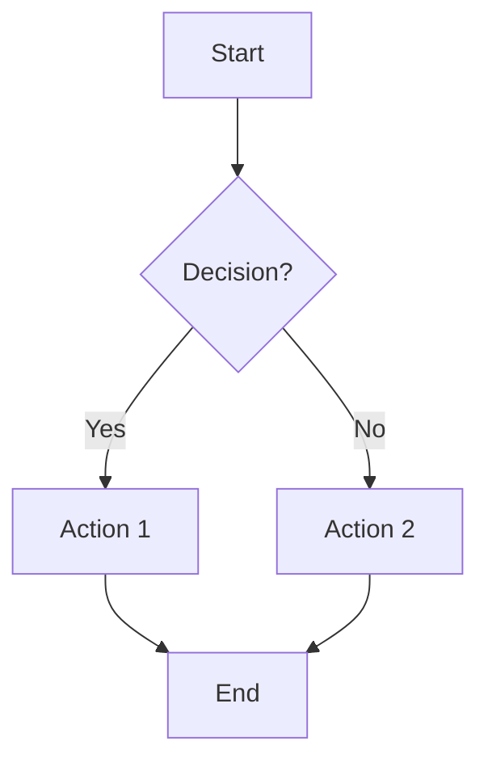

| Rule ID | Category | Rule Description | Purpose | Examples | Applies To | Enforcement |
|---|---|---|---|---|---|---|
| DOC-DIAG-FC-001 | Flowchart | Use top-to-bottom flow | Readability | `flowchart TD` | Flowcharts | **Required** |
| DOC-DIAG-FC-002 | Flowchart | Use clear node labels | Clarity | Descriptive labels | Flowcharts | **Required** |
| DOC-DIAG-FC-003 | Flowchart | Use diamond for decisions | Standard | `{Decision?}` | Flowcharts | **Required** |
| DOC-DIAG-FC-004 | Flowchart | Use rectangle for actions | Standard | `[Action]` | Flowcharts | **Required** |
| DOC-DIAG-FC-005 | Flowchart | Use rounded rectangle for start/end | Standard | `([Start])` | Flowcharts | **Required** |
| DOC-DIAG-FC-006 | Flowchart | Label edges | Clarity | `-->|Yes|` | Flowcharts | **Required** |
| DOC-DIAG-FC-007 | Flowchart | Avoid crossing lines | Readability | Simple flow | Flowcharts | **Recommended** |
| DOC-DIAG-FC-008 | Flowchart | Limit to 15 nodes | Readability | Break into subgraphs | Flowcharts | **Recommended** |

### 7.2 Sequence Diagrams

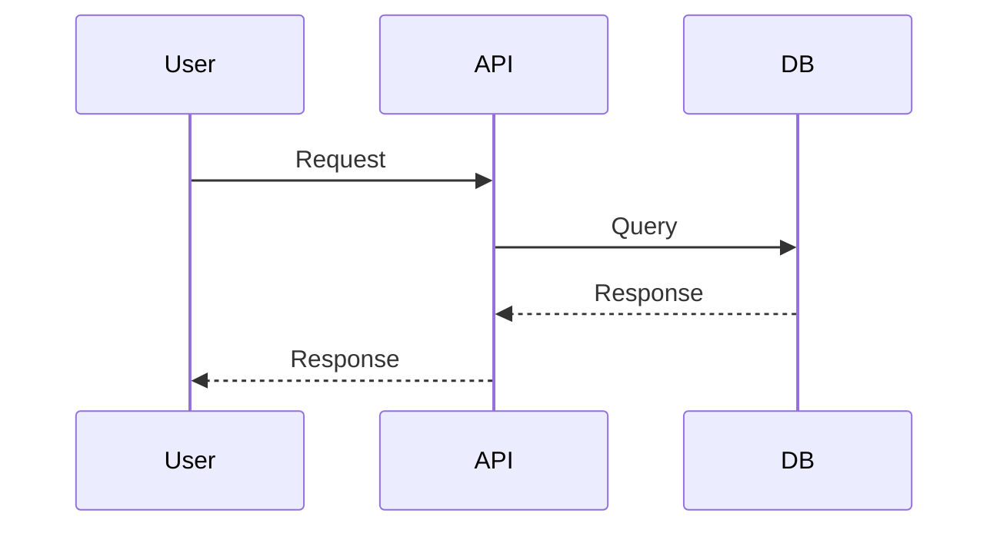

| Rule ID | Category | Rule Description | Purpose | Examples | Applies To | Enforcement |
|---|---|---|---|---|---|---|
| DOC-DIAG-SEQ-001 | Sequence | Use left-to-right flow | Readability | Standard sequence | Sequence diagrams | **Required** |
| DOC-DIAG-SEQ-002 | Sequence | Use clear participant names | Clarity | `User`, `API`, `DB` | Sequence diagrams | **Required** |
| DOC-DIAG-SEQ-003 | Sequence | Use `->>` for requests | Standard | `User->>API` | Sequence diagrams | **Required** |
| DOC-DIAG-SEQ-004 | Sequence | Use `-->>` for responses | Standard | `API-->>User` | Sequence diagrams | **Required** |
| DOC-DIAG-SEQ-005 | Sequence | Label messages | Clarity | `User->>API: Request` | Sequence diagrams | **Required** |
| DOC-DIAG-SEQ-006 | Sequence | Include activation | Clarity | `activate DB` | Sequence diagrams | **Recommended** |
| DOC-DIAG-SEQ-007 | Sequence | Limit to 10 participants | Readability | Break into sub-sequences | Sequence diagrams | **Recommended** |
| DOC-DIAG-SEQ-008 | Sequence | Include time notes | Clarity | `Note over API,DB: Processing` | Sequence diagrams | **Recommended** |

### 7.3 ER Diagrams

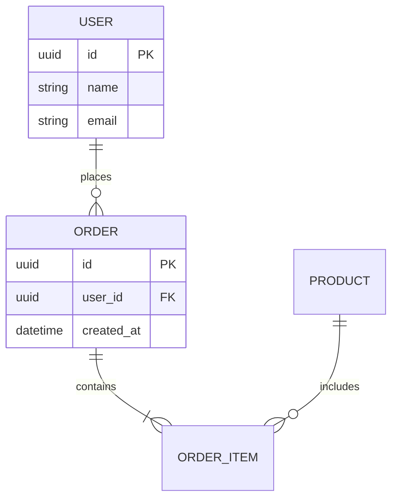

| Rule ID | Category | Rule Description | Purpose | Examples | Applies To | Enforcement |
|---|---|---|---|---|---|---|
| DOC-DIAG-ER-001 | ER | Use standard cardinality | Clarity | `||--o{`, `||--|{` | ER diagrams | **Required** |
| DOC-DIAG-ER-002 | ER | Use uppercase for table names | Standard | `USER`, `ORDER` | ER diagrams | **Required** |
| DOC-DIAG-ER-003 | ER | Mark primary keys | Clarity | `PK` | ER diagrams | **Required** |
| DOC-DIAG-ER-004 | ER | Mark foreign keys | Clarity | `FK` | ER diagrams | **Required** |
| DOC-DIAG-ER-005 | ER | Include data types | Clarity | `uuid`, `string`, `datetime` | ER diagrams | **Required** |
| DOC-DIAG-ER-006 | ER | Use descriptive names | Clarity | `USER`, not `U` | ER diagrams | **Required** |
| DOC-DIAG-ER-007 | ER | Limit to 15 tables | Readability | Break into sub-diagrams | ER diagrams | **Recommended** |
| DOC-DIAG-ER-008 | ER | Include relationship labels | Clarity | `places`, `contains` | ER diagrams | **Required** |

### 7.4 Architecture Diagrams

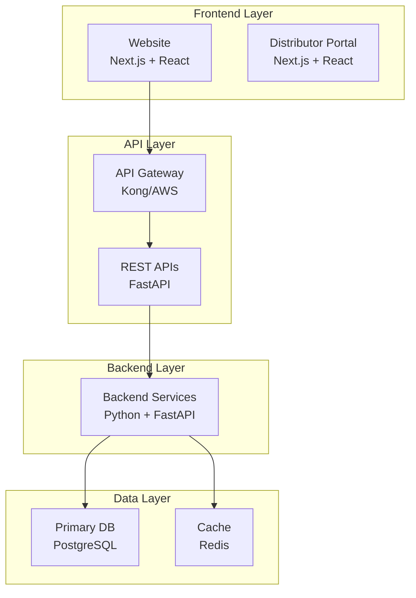

| Rule ID | Category | Rule Description | Purpose | Examples | Applies To | Enforcement |
|---|---|---|---|---|---|---|
| DOC-DIAG-ARCH-001 | Architecture | Use layered architecture | Clarity | Frontend, API, Backend, Data | Architecture diagrams | **Required** |
| DOC-DIAG-ARCH-002 | Architecture | Use subgraphs for layers | Organization | `subgraph "Frontend Layer"` | Architecture diagrams | **Required** |
| DOC-DIAG-ARCH-003 | Architecture | Label components | Clarity | `Website<br/>Next.js + React` | Architecture diagrams | **Required** |
| DOC-DIAG-ARCH-004 | Architecture | Use consistent colors | Clarity | Same color for same layer | Architecture diagrams | **Recommended** |
| DOC-DIAG-ARCH-005 | Architecture | Show data flow | Understanding | Arrows between components | Architecture diagrams | **Required** |
| DOC-DIAG-ARCH-006 | Architecture | Include technology | Clarity | `FastAPI`, `PostgreSQL` | Architecture diagrams | **Required** |
| DOC-DIAG-ARCH-007 | Architecture | Limit to 20 components | Readability | Break into sub-diagrams | Architecture diagrams | **Recommended** |
| DOC-DIAG-ARCH-008 | Architecture | Include legend | Understanding | Explain symbols/colors | Architecture diagrams | **Recommended** |

### 7.5 BPMN Diagrams

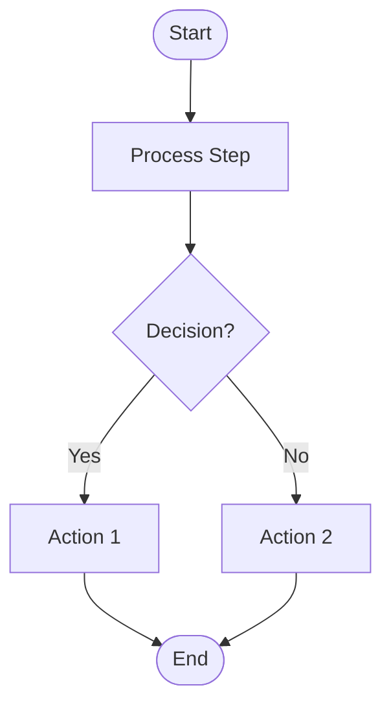

| Rule ID | Category | Rule Description | Purpose | Examples | Applies To | Enforcement |
|---|---|---|---|---|---|---|
| DOC-DIAG-BPMN-001 | BPMN | Use standard BPMN symbols | Standard | Circle start/end, rectangle process, diamond decision | BPMN diagrams | **Required** |
| DOC-DIAG-BPMN-002 | BPMN | Use swimlanes for actors | Clarity | `subgraph "User"` | BPMN diagrams | **Recommended** |
| DOC-DIAG-BPMN-003 | BPMN | Label all elements | Clarity | Descriptive labels | BPMN diagrams | **Required** |
| DOC-DIAG-BPMN-004 | BPMN | Show flow direction | Clarity | Top-to-bottom or left-to-right | BPMN diagrams | **Required** |
| DOC-DIAG-BPMN-005 | BPMN | Include gateways | Clarity | Decision points | BPMN diagrams | **Required** |
| DOC-DIAG-BPMN-006 | BPMN | Include events | Clarity | Start, end, intermediate | BPMN diagrams | **Required** |
| DOC-DIAG-BPMN-007 | BPMN | Limit to 20 elements | Readability | Break into sub-processes | BPMN diagrams | **Recommended** |
| DOC-DIAG-BPMN-008 | BPMN | Include legend | Understanding | Explain symbols | BPMN diagrams | **Recommended** |

---

## 8. Markdown Standards

| Rule ID | Category | Rule Description | Purpose | Examples | Applies To | Enforcement |
|---|---|---|---|---|---|---|
| DOC-MD-001 | Markdown | Use `#` for H1 | Standard | `# Title` | All docs | **Required** |
| DOC-MD-002 | Markdown | Use `##` for H2 | Standard | `## Section` | All docs | **Required** |
| DOC-MD-003 | Markdown | Use `###` for H3 | Standard | `### Subsection` | All docs | **Required** |
| DOC-MD-004 | Markdown | Avoid H4+ | Readability | Use lists instead | All docs | **Recommended** |
| DOC-MD-005 | Markdown | Use tables for data | Structure | Markdown tables | All docs | **Required** |
| DOC-MD-006 | Markdown | Use lists for items | Readability | Bullet or numbered lists | All docs | **Required** |
| DOC-MD-007 | Markdown | Use callouts for notes | Emphasis | `> **Note:** ...` | All docs | **Recommended** |
| DOC-MD-008 | Markdown | Use code blocks for code | Clarity | Triple backticks | All docs | **Required** |
| DOC-MD-009 | Markdown | Use syntax highlighting | Readability | ` ```python ` | All docs | **Required** |
| DOC-MD-010 | Markdown | Use relative links | Portability | `./related.md` | All docs | **Required** |
| DOC-MD-011 | Markdown | Use descriptive link text | Clarity | `[Order Policy](05_Policies.md)` not `[click here]` | All docs | **Required** |
| DOC-MD-012 | Markdown | Avoid images for text | Accessibility | Use text, not images of text | All docs | **Required** |
| DOC-MD-013 | Markdown | Use alt text for images | Accessibility | `` | All docs | **Required** |
| DOC-MD-014 | Markdown | Use bold for emphasis | Emphasis | `**important**` | All docs | **Recommended** |
| DOC-MD-015 | Markdown | Use italics for terms | Emphasis | `*term*` | All docs | **Recommended** |
| DOC-MD-016 | Markdown | Use horizontal rules sparingly | Readability | `---` between major sections | All docs | **Recommended** |
| DOC-MD-017 | Markdown | Use blockquotes for citations | Clarity | `> Quote` | All docs | **Recommended** |
| DOC-MD-018 | Markdown | Use footnotes for references | Clarity | `[^1]` | All docs | **Recommended** |
| DOC-MD-019 | Markdown | Use YAML frontmatter | Metadata | `---\ntitle: ...\n---` | All docs | **Required** |
| DOC-MD-020 | Markdown | Validate markdown | Correctness | Use markdown linter | All docs | **Required** |

### 8.1 Good vs. Poor Formatting Examples

**Good Heading:**
```markdown
## Order Placement
```

**Poor Heading:**
```markdown
## ORDER PLACEMENT  (all caps)
```

**Good Table:**
```markdown
| Feature | Description | Priority |
|---|---|---|
| AI Chat | Conversational support | High |
| Order Tracking | Track order status | High |
```

**Poor Table:**
```markdown
| Feature | Description | Priority |
| --- | --- | --- |
| AI Chat | Conversational support | High |
| Order Tracking | Track order status | High |
```
(Note: inconsistent spacing)

**Good List:**
```markdown
### Prerequisites
- Valid user account
- Active internet connection
- Updated browser
```

**Poor List:**
```markdown
### Prerequisites
- valid user account
-   active internet connection
- Updated browser
```
(Note: inconsistent indentation)

**Good Callout:**
```markdown
> **Note:** This feature requires authentication.
```

**Poor Callout:**
```markdown
> note: this feature requires authentication.
```
(Note: lowercase, no emphasis)

**Good Code Block:**
```markdown
```python
def get_user(user_id: int) -> User:
    """Get user by ID."""
    return db.get_user(user_id)
```
```

**Poor Code Block:**
```markdown
def get_user(user_id):
    return db.get_user(user_id)
```
(Note: no language, no type hints, no docstring)

**Good Cross-Reference:**
```markdown
See also: [Order Policy](05_Policies.md#order-placement)
```

**Poor Cross-Reference:**
```markdown
See also: click here
```
(Note: unclear link text)

---

## 9. Folder Organization

### 9.1 Documentation Folder Hierarchy

```
docs/
├── project/
│   ├── 00_MASTER_CONTEXT.md
│   ├── 01_PROJECT_INDEX.md
│   ├── 02_KNOWN_FACTS.md
│   └── ...
├── business/
│   ├── 02_Business_Model.md
│   ├── 04_Distributor_System.md
│   └── ...
├── product/
│   ├── 03_Product_Research.md
│   ├── 06_FAQs.md
│   └── ...
├── technical/
│   ├── 09_TECH_STACK.md
│   ├── 10_CODING_STANDARDS.md
│   └── ...
├── api/
│   ├── openapi.yaml
│   ├── endpoints/
│   └── webhooks/
├── architecture/
│   ├── overview.md
│   ├── decisions/
│   └── diagrams/
├── infrastructure/
│   ├── deployment.md
│   └── monitoring.md
├── security/
│   ├── policies.md
│   └── procedures.md
├── knowledge-base/
│   ├── articles/
│   ├── faqs/
│   ├── policies/
│   ├── sops/
│   └── troubleshooting/
├── ai/
│   ├── prompts/
│   ├── agents/
│   ├── workflows/
│   └── evaluations/
├── templates/
│   ├── technical-doc.md
│   ├── business-doc.md
│   ├── kb-article.md
│   └── api-spec.md
└── archive/
    └── deprecated/
```

| Rule ID | Category | Rule Description | Purpose | Examples | Applies To | Enforcement |
|---|---|---|---|---|---|---|
| DOC-FOLD-001 | Folders | Use descriptive folder names | Clarity | `knowledge-base/`, not `kb/` | All folders | **Required** |
| DOC-FOLD-002 | Folders | Use lowercase with hyphens | Consistency | `knowledge-base/`, `tech-stack/` | All folders | **Required** |
| DOC-FOLD-003 | Folders | Group by domain | Organization | `business/`, `product/`, `technical/` | All folders | **Required** |
| DOC-FOLD-004 | Folders | Use numbered prefix for ordering | Sequence | `00_`, `01_`, `02_` | Project docs | **Required** |
| DOC-FOLD-005 | Folders | Create index files | Navigation | `README.md` in each folder | All folders | **Required** |
| DOC-FOLD-006 | Folders | Archive deprecated docs | Organization | `archive/deprecated/` | All folders | **Required** |
| DOC-FOLD-007 | Folders | Use templates folder | Reusability | `templates/` | All folders | **Required** |
| DOC-FOLD-008 | Folders | Separate AI documentation | Organization | `ai/` folder | All folders | **Required** |
| DOC-FOLD-009 | Folders | Separate knowledge base | Organization | `knowledge-base/` | All folders | **Required** |
| DOC-FOLD-010 | Folders | Document folder structure | Clarity | `docs/README.md` | All folders | **Required** |

### 9.2 File Naming Conventions

| Rule ID | Category | Rule Description | Purpose | Examples | Applies To | Enforcement |
|---|---|---|---|---|---|---|
| DOC-FILE-001 | Files | Use descriptive file names | Clarity | `order-placement.md`, not `op.md` | All files | **Required** |
| DOC-FILE-002 | Files | Use lowercase with underscores | Consistency | `order_placement.md` | All files | **Required** |
| DOC-FILE-003 | Files | Use numbered prefix for ordering | Sequence | `00_MASTER_CONTEXT.md` | Project docs | **Required** |
| DOC-FILE-004 | Files | Use `.md` extension | Standard | `README.md` | All files | **Required** |
| DOC-FILE-005 | Files | Avoid spaces in file names | Portability | `order-placement.md`, not `order placement.md` | All files | **Required** |
| DOC-FILE-006 | Files | Avoid special characters | Portability | No `@`, `#`, `$`, etc. | All files | **Required** |
| DOC-FILE-007 | Files | Use version suffix if needed | Versioning | `api-spec.v1.md` | All files | **Recommended** |
| DOC-FILE-008 | Files | Use date suffix for reports | Organization | `evaluation-2024-01-01.md` | All files | **Recommended** |
| DOC-FILE-009 | Files | Keep file names short | Readability | Max 50 characters | All files | **Recommended** |
| DOC-FILE-010 | Files | Document file naming | Clarity | Explain in `docs/README.md` | All files | **Required** |

### 9.3 Archive Strategy

| Rule ID | Category | Rule Description | Purpose | Examples | Applies To | Enforcement |
|---|---|---|---|---|---|---|
| DOC-ARCH-001 | Archive | Archive deprecated docs | Organization | `archive/deprecated/` | All docs | **Required** |
| DOC-ARCH-002 | Archive | Mark as deprecated | Clarity | `Status: Deprecated` | All docs | **Required** |
| DOC-ARCH-003 | Archive | Include deprecation date | Clarity | `Deprecated: 2024-01-01` | All docs | **Required** |
| DOC-ARCH-004 | Archive | Include replacement | Navigation | `Replaced by: [new-doc.md]` | All docs | **Required** |
| DOC-ARCH-005 | Archive | Include reason | Understanding | `Reason: Outdated` | All docs | **Recommended** |
| DOC-ARCH-006 | Archive | Keep for 1 year | Traceability | 1-year retention | All docs | **Required** |
| DOC-ARCH-007 | Archive | Delete after retention | Storage | Automated deletion | All docs | **Recommended** |
| DOC-ARCH-008 | Archive | Document archive process | Clarity | `docs/archive.md` | All docs | **Required** |
| DOC-ARCH-009 | Archive | Update links | Navigation | Update links to archived docs | All docs | **Required** |
| DOC-ARCH-010 | Archive | Review quarterly | Maintenance | Quarterly review | All docs | **Required** |

### 9.4 Shared Templates

| Rule ID | Category | Rule Description | Purpose | Examples | Applies To | Enforcement |
|---|---|---|---|---|---|---|
| DOC-TEMP-001 | Templates | Create reusable templates | Consistency | `templates/` | All docs | **Required** |
| DOC-TEMP-002 | Templates | Use templates for new docs | Consistency | Copy from template | All docs | **Required** |
| DOC-TEMP-003 | Templates | Update templates | Maintenance | Update when needed | All docs | **Required** |
| DOC-TEMP-004 | Templates | Document template usage | Clarity | `templates/README.md` | All docs | **Required** |
| DOC-TEMP-005 | Templates | Include metadata | Standard | YAML frontmatter | All docs | **Required** |
| DOC-TEMP-006 | Templates | Include sections | Structure | Standard sections | All docs | **Required** |
| DOC-TEMP-007 | Templates | Include examples | Clarity | Example content | All docs | **Recommended** |
| DOC-TEMP-008 | Templates | Review templates | Maintenance | Quarterly review | All docs | **Required** |
| DOC-TEMP-009 | Templates | Version templates | Versioning | `template.v1.md` | All docs | **Required** |
| DOC-TEMP-010 | Templates | Link to templates | Navigation | Link in `docs/README.md` | All docs | **Required** |

### 9.5 Index Files

| Rule ID | Category | Rule Description | Purpose | Examples | Applies To | Enforcement |
|---|---|---|---|---|---|---|
| DOC-IDX-001 | Index | Create index file per folder | Navigation | `README.md` | All folders | **Required** |
| DOC-IDX-002 | Index | List all files | Discoverability | Table of contents | All folders | **Required** |
| DOC-IDX-003 | Index | Include descriptions | Clarity | Brief description | All folders | **Required** |
| DOC-IDX-004 | Index | Include status | Workflow | `Status: Draft/Approved` | All folders | **Recommended** |
| DOC-IDX-005 | Index | Include last updated | Freshness | `Last updated: 2024-01-01` | All folders | **Recommended** |
| DOC-IDX-006 | Index | Include owner | Accountability | `Owner: Team` | All folders | **Recommended** |
| DOC-IDX-007 | Index | Update on changes | Accuracy | Keep up-to-date | All folders | **Required** |
| DOC-IDX-008 | Index | Link to related indexes | Navigation | Links to other indexes | All folders | **Recommended** |
| DOC-IDX-009 | Index | Use consistent format | Consistency | Standard format | All folders | **Required** |
| DOC-IDX-010 | Index | Review quarterly | Maintenance | Quarterly review | All folders | **Required** |

---

## 10. Metadata Standards

### 10.1 Standard Metadata Template

Every document must include the following YAML frontmatter:

```yaml
---
id: DOC-001
title: Document Title
version: 1.0.0
status: Draft  # Draft, Review, Approved, Published, Archived
author: Author Name
reviewer: Reviewer Name
last_updated: 2024-01-01
created: 2024-01-01
related:
  - ./related-doc-1.md
  - ./related-doc-2.md
tags:
  - tag1
  - tag2
category: Category
subcategory: Subcategory
---
```

| Rule ID | Category | Rule Description | Purpose | Examples | Applies To | Enforcement |
|---|---|---|---|---|---|---|
| DOC-META-001 | Metadata | Include document ID | Identification | `id: DOC-001` | All docs | **Required** |
| DOC-META-002 | Metadata | Include title | Clarity | `title: Document Title` | All docs | **Required** |
| DOC-META-003 | Metadata | Include version | Versioning | `version: 1.0.0` | All docs | **Required** |
| DOC-META-004 | Metadata | Include status | Workflow | `status: Draft` | All docs | **Required** |
| DOC-META-005 | Metadata | Include author | Accountability | `author: Author Name` | All docs | **Required** |
| DOC-META-006 | Metadata | Include reviewer | Governance | `reviewer: Reviewer Name` | All docs | **Required** |
| DOC-META-007 | Metadata | Include last updated | Freshness | `last_updated: 2024-01-01` | All docs | **Required** |
| DOC-META-008 | Metadata | Include created date | Traceability | `created: 2024-01-01` | All docs | **Required** |
| DOC-META-009 | Metadata | Include related documents | Navigation | `related: [./doc1.md]` | All docs | **Required** |
| DOC-META-010 | Metadata | Include tags | Searchability | `tags: [tag1, tag2]` | All docs | **Required** |
| DOC-META-011 | Metadata | Include category | Organization | `category: Category` | All docs | **Required** |
| DOC-META-012 | Metadata | Include subcategory | Organization | `subcategory: Subcategory` | All docs | **Recommended** |
| DOC-META-013 | Metadata | Use ISO date format | Standard | `2024-01-01` | All docs | **Required** |
| DOC-META-014 | Metadata | Use semantic versioning | Standard | `1.0.0` | All docs | **Required** |
| DOC-META-015 | Metadata | Validate metadata | Correctness | YAML validation | All docs | **Required** |
| DOC-META-016 | Metadata | Update on changes | Accuracy | Update version, date | All docs | **Required** |
| DOC-META-017 | Metadata | Use consistent IDs | Standard | `DOC-001`, `DOC-002` | All docs | **Required** |
| DOC-META-018 | Metadata | Document ID scheme | Clarity | Explain in `docs/README.md` | All docs | **Required** |
| DOC-META-019 | Metadata | Use lowercase tags | Consistency | `tag1`, not `Tag1` | All docs | **Required** |
| DOC-META-020 | Metadata | Limit to 10 tags | Focus | Max 10 tags | All docs | **Recommended** |

---

## 11. Version Control

### 11.1 Semantic Versioning for Documents

| Rule ID | Category | Rule Description | Purpose | Examples | Applies To | Enforcement |
|---|---|---|---|---|---|---|
| DOC-VER-001 | Versioning | Use semantic versioning | Standard | `MAJOR.MINOR.PATCH` | All docs | **Required** |
| DOC-VER-002 | Versioning | Increment MAJOR for breaking changes | Standard | `1.0.0` → `2.0.0` | All docs | **Required** |
| DOC-VER-003 | Versioning | Increment MINOR for new content | Standard | `1.0.0` → `1.1.0` | All docs | **Required** |
| DOC-VER-004 | Versioning | Increment PATCH for fixes | Standard | `1.0.0` → `1.0.1` | All docs | **Required** |
| DOC-VER-005 | Versioning | Use pre-release tags | Clarity | `1.0.0-alpha`, `1.0.0-beta` | All docs | **Recommended** |
| DOC-VER-006 | Versioning | Tag releases | Traceability | Git tags | All docs | **Required** |
| DOC-VER-007 | Versioning | Document version changes | Changelog | Changelog entry | All docs | **Required** |
| DOC-VER-008 | Versioning | Keep old versions | Traceability | Archive old versions | All docs | **Required** |
| DOC-VER-009 | Versioning | Link to old versions | Navigation | Links in changelog | All docs | **Recommended** |
| DOC-VER-010 | Versioning | Review versioning | Maintenance | Quarterly review | All docs | **Required** |

### 11.2 Draft Workflow

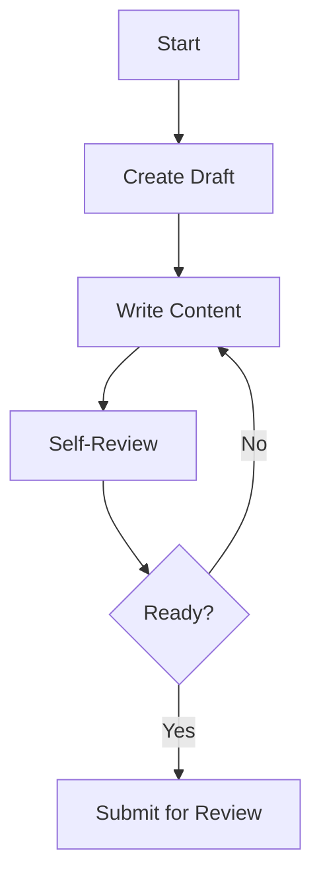

| Rule ID | Category | Rule Description | Purpose | Examples | Applies To | Enforcement |
|---|---|---|---|---|---|---|
| DOC-DRAFT-001 | Draft | Mark as draft | Status | `status: Draft` | Draft docs | **Required** |
| DOC-DRAFT-002 | Draft | Include work in progress | Clarity | `WIP` label | Draft docs | **Required** |
| DOC-DRAFT-003 | Draft | Include intended audience | Clarity | `Audience: Developers` | Draft docs | **Recommended** |
| DOC-DRAFT-004 | Draft | Include completion criteria | Clarity | What is needed to complete | Draft docs | **Recommended** |
| DOC-DRAFT-005 | Draft | Include blockers | Clarity | What is blocking | Draft docs | **Recommended** |
| DOC-DRAFT-006 | Draft | Self-review before submit | Quality | Author review | Draft docs | **Required** |
| DOC-DRAFT-007 | Draft | Submit for review | Workflow | PR or review request | Draft docs | **Required** |
| DOC-DRAFT-008 | Draft | Update on feedback | Iteration | Incorporate feedback | Draft docs | **Required** |
| DOC-DRAFT-009 | Draft | Mark ready for review | Status | `status: Review` | Draft docs | **Required** |
| DOC-DRAFT-010 | Draft | Delete abandoned drafts | Maintenance | Delete after 30 days | Draft docs | **Recommended** |

### 11.3 Review Workflow

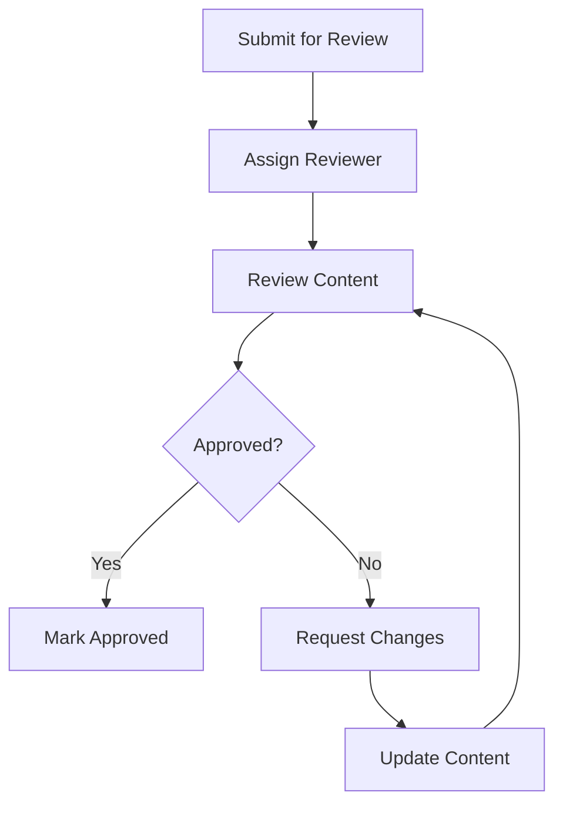

| Rule ID | Category | Rule Description | Purpose | Examples | Applies To | Enforcement |
|---|---|---|---|---|---|---|
| DOC-REV-001 | Review | Assign reviewer | Governance | At least 1 reviewer | Review docs | **Required** |
| DOC-REV-002 | Review | Use review checklist | Completeness | Section 12 checklists | Review docs | **Required** |
| DOC-REV-003 | Review | Document review comments | Clarity | Comments in PR | Review docs | **Required** |
| DOC-REV-004 | Review | Address all comments | Quality | Respond to comments | Review docs | **Required** |
| DOC-REV-005 | Review | Update on feedback | Iteration | Incorporate feedback | Review docs | **Required** |
| DOC-REV-006 | Review | Re-review after changes | Quality | Second review | Review docs | **Required** |
| DOC-REV-007 | Review | Mark approved | Status | `status: Approved` | Review docs | **Required** |
| DOC-REV-008 | Review | Include reviewer name | Accountability | `reviewer: Name` | Review docs | **Required** |
| DOC-REV-009 | Review | Include review date | Freshness | `reviewed: 2024-01-01` | Review docs | **Required** |
| DOC-REV-010 | Review | Document decisions | Traceability | Review notes | Review docs | **Recommended** |

### 11.4 Approval Workflow

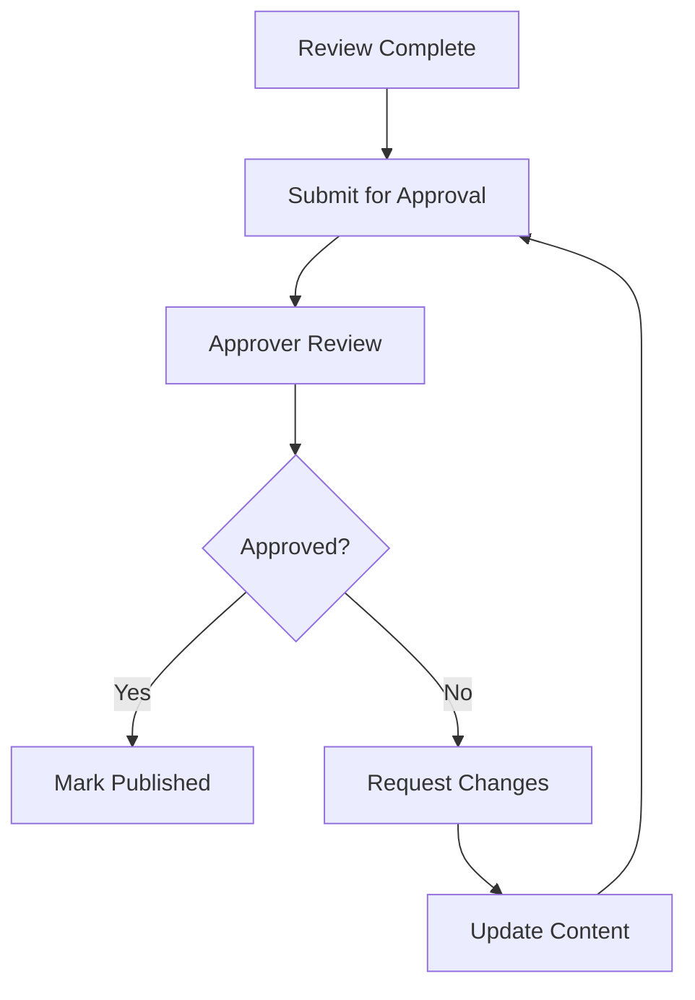

| Rule ID | Category | Rule Description | Purpose | Examples | Applies To | Enforcement |
|---|---|---|---|---|---|---|
| DOC-APP-001 | Approval | Assign approver | Governance | Designated approver | Approved docs | **Required** |
| DOC-APP-002 | Approval | Use approval checklist | Completeness | Section 12 checklists | Approved docs | **Required** |
| DOC-APP-003 | Approval | Document approval | Clarity | `approved_by: Name` | Approved docs | **Required** |
| DOC-APP-004 | Approval | Include approval date | Freshness | `approved: 2024-01-01` | Approved docs | **Required** |
| DOC-APP-005 | Approval | Mark as published | Status | `status: Published` | Approved docs | **Required** |
| DOC-APP-006 | Approval | Publish to appropriate location | Distribution | Move to `docs/` | Approved docs | **Required** |
| DOC-APP-007 | Approval | Notify stakeholders | Communication | Email/Slack notification | Approved docs | **Recommended** |
| DOC-APP-008 | Approval | Update index | Navigation | Update index files | Approved docs | **Required** |
| DOC-APP-009 | Approval | Update changelog | Traceability | Changelog entry | Approved docs | **Required** |
| DOC-APP-010 | Approval | Archive old version | Organization | Move to archive | Approved docs | **Required** |

### 11.5 Change Log Requirements

| Rule ID | Category | Rule Description | Purpose | Examples | Applies To | Enforcement |
|---|---|---|---|---|---|---|
| DOC-CL-001 | Changelog | Maintain changelog | Traceability | `CHANGELOG.md` | All docs | **Required** |
| DOC-CL-002 | Changelog | Include version | Versioning | `## [1.0.0]` | All docs | **Required** |
| DOC-CL-003 | Changelog | Include date | Freshness | `2024-01-01` | All docs | **Required** |
| DOC-CL-004 | Changelog | Group by type | Organization | `### Added`, `### Changed`, `### Fixed` | All docs | **Required** |
| DOC-CL-005 | Changelog | Include breaking changes | Migration | `### Breaking Changes` | All docs | **Required** |
| DOC-CL-006 | Changelog | Include migration notes | Migration | How to migrate | All docs | **Required** |
| DOC-CL-007 | Changelog | Link to related issues | Traceability | `[#123]` | All docs | **Recommended** |
| DOC-CL-008 | Changelog | Update on every change | Accuracy | Every change | All docs | **Required** |
| DOC-CL-009 | Changelog | Include author | Accountability | `by: Author` | All docs | **Recommended** |
| DOC-CL-010 | Changelog | Review changelog | Maintenance | Quarterly review | All docs | **Required** |

---

## 12. Review Process

### 12.1 Review Checklist

#### Accuracy

- [ ] All facts are verified
- [ ] All claims are cited
- [ ] No outdated information
- [ ] All links are valid
- [ ] All diagrams are accurate

#### Completeness

- [ ] All sections are complete
- [ ] All examples are included
- [ ] All edge cases are covered
- [ ] All error cases are covered
- [ ] All related docs are linked

#### Business Alignment

- [ ] Aligns with business goals
- [ ] Follows business rules
- [ ] No conflicting information
- [ ] Stakeholder needs met
- [ ] Business value clear

#### Technical Correctness

- [ ] Technical content is accurate
- [ ] Code examples work
- [ ] API examples are valid
- [ ] Diagrams are accurate
- [ ] No technical errors

#### AI Compatibility

- [ ] RAG-friendly structure
- [ ] Clear headings
- [ ] Metadata included
- [ ] Tags included
- [ ] Citations included

#### Grammar and Formatting

- [ ] No spelling errors
- [ ] No grammar errors
- [ ] Consistent formatting
- [ ] Follows markdown standards
- [ ] Readable and clear

#### Link Validation

- [ ] All internal links work
- [ ] All external links work
- [ ] Links use descriptive text
- [ ] Links are up-to-date
- [ ] No broken links

#### Diagram Validation

- [ ] All diagrams render
- [ ] Diagrams are accurate
- [ ] Diagrams are up-to-date
- [ ] Diagrams are clear
- [ ] Diagrams are labeled

### 12.2 Review Scorecard

| Criteria | Score (1-5) | Notes |
|---|---|---|
| Accuracy |  |  |
| Completeness |  |  |
| Business Alignment |  |  |
| Technical Correctness |  |  |
| AI Compatibility |  |  |
| Grammar and Formatting |  |  |
| Link Validation |  |  |
| Diagram Validation |  |  |
| **Overall** |  |  |

**Score:** 1 = Poor, 2 = Fair, 3 = Good, 4 = Very Good, 5 = Excellent

**Recommendation:** Approve / Revise / Reject

**Reviewer:** ________________

**Date:** ________________

---

## 13. AI Documentation Guidelines

**Permanent instructions for AI assistants:**

### 1. Never Overwrite Verified Information

- Check existing documents before writing
- Preserve verified facts
- Do not contradict existing docs
- Mark assumptions clearly

### 2. Preserve Document Structure

- Follow existing templates
- Use standard sections
- Maintain metadata
- Keep consistent formatting

### 3. Cross-Reference Existing Documents

- Link to related docs
- Use relative links
- Update index files
- Maintain document graph

### 4. Clearly Mark Assumptions

- Use `[Assumption]` tag
- Document uncertainty
- Mark as `[Needs Validation]`
- Escalate if critical

### 5. Keep Content Modular

- Small, focused documents
- One topic per document
- Clear headings
- Reusable sections

### 6. Avoid Duplicate Information

- Check for existing content
- Link instead of duplicating
- Use single source of truth
- Update existing docs

### 7. Update Changelogs After Major Edits

- Document changes
- Include version
- Include date
- Link to related issues

### 8. Use RAG-Friendly Formatting

- Clear headings
- Short paragraphs
- Metadata included
- Tags included

### 9. Cite Sources

- Use `[source: ...]` tags
- Link to source docs
- Mark verified vs. unverified
- Avoid hallucination

### 10. Follow All Standards in This Document

- Read this document first
- Follow all rules
- Use templates
- Include metadata

---

## 14. Documentation Lifecycle

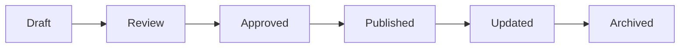

### Stage 1: Draft

**Entry Criteria:**
- New document needed
- Author assigned
- Template selected

**Exit Criteria:**
- Content complete
- Self-review done
- Ready for review

**Actions:**
- Write content
- Include metadata
- Self-review
- Mark `status: Draft`

### Stage 2: Review

**Entry Criteria:**
- Draft complete
- Reviewer assigned
- Review requested

**Exit Criteria:**
- All comments addressed
- Reviewer approved
- Ready for approval

**Actions:**
- Review content
- Provide feedback
- Update content
- Mark `status: Review`

### Stage 3: Approved

**Entry Criteria:**
- Review complete
- Approver assigned
- Approval requested

**Exit Criteria:**
- Approver approved
- Ready to publish
- Changelog updated

**Actions:**
- Approver review
- Mark `status: Approved`
- Update changelog
- Prepare for publication

### Stage 4: Published

**Entry Criteria:**
- Approved
- Ready to publish
- Index updated

**Exit Criteria:**
- Published
- Stakeholders notified
- Index updated

**Actions:**
- Publish to `docs/`
- Update index
- Notify stakeholders
- Mark `status: Published`

### Stage 5: Updated

**Entry Criteria:**
- Change needed
- Update requested
- Author assigned

**Exit Criteria:**
- Update complete
- Review complete
- Approved

**Actions:**
- Update content
- Review update
- Approve update
- Update changelog
- Increment version

### Stage 6: Archived

**Entry Criteria:**
- Deprecated
- Replaced
- Obsolete

**Exit Criteria:**
- Archived
- Links updated
- Retention period started

**Actions:**
- Move to `archive/`
- Mark `status: Archived`
- Update links
- Set retention period

---

## 15. Templates

### 15.1 Technical Document Template

```markdown
---
id: DOC-TECH-001
title: Technical Document Title
version: 1.0.0
status: Draft
author: Author Name
reviewer: Reviewer Name
last_updated: 2024-01-01
created: 2024-01-01
related:
  - ./related-doc-1.md
  - ./related-doc-2.md
tags:
  - technical
  - architecture
category: Technical
subcategory: Architecture
---

# Technical Document Title

> **Purpose:** Brief purpose statement.

## Overview

2-3 sentence overview.

## Architecture

### High-Level Design

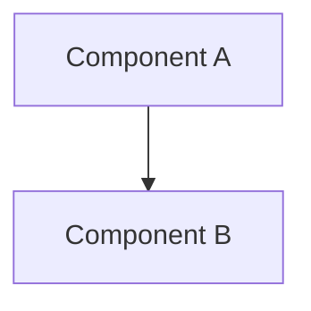

### Components

| Component | Purpose | Technology |
|---|---|---|
| Component A | Purpose | Technology |

## Implementation

### Setup

1. Step 1
2. Step 2
3. Step 3

### Configuration

```yaml
# Example configuration
key: value
```

## API Reference

### Endpoints

| Method | Endpoint | Description |
|---|---|---|
| GET | `/api/v1/endpoint` | Description |

## Security

### Authentication

Description.

### Authorization

Description.

## Testing

### Unit Tests

Description.

### Integration Tests

Description.

## Deployment

### Prerequisites

- Prerequisite 1
- Prerequisite 2

### Steps

1. Step 1
2. Step 2
3. Step 3

## Monitoring

### Metrics

- Metric 1
- Metric 2

### Alerts

- Alert 1
- Alert 2

## Troubleshooting

### Common Issues

| Issue | Cause | Solution |
|---|---|---|
| Issue | Cause | Solution |

## Related Documents

- [Related Doc 1](./related-doc-1.md)
- [Related Doc 2](./related-doc-2.md)

## Changelog

| Version | Date | Author | Changes |
|---|---|---|---|
| 1.0.0 | 2024-01-01 | Author | Initial version |
```

### 15.2 Business Document Template

```markdown
---
id: DOC-BUS-001
title: Business Document Title
version: 1.0.0
status: Draft
author: Author Name
reviewer: Reviewer Name
last_updated: 2024-01-01
created: 2024-01-01
related:
  - ./related-doc-1.md
  - ./related-doc-2.md
tags:
  - business
  - policy
category: Business
subcategory: Policy
---

# Business Document Title

> **Purpose:** Brief purpose statement.

## Overview

2-3 sentence overview.

## Scope

Who/what this applies to.

## Policy

### Policy Statement

Policy statement.

### Requirements

- Requirement 1
- Requirement 2
- Requirement 3

## Procedures

### Procedure 1

1. Step 1
2. Step 2
3. Step 3

### Procedure 2

1. Step 1
2. Step 2
3. Step 3

## Exceptions

When policy doesn't apply.

## Definitions

| Term | Definition |
|---|---|
| Term | Definition |

## Contact Information

- Email: email@example.com
- Phone: +91-123-456-7890

## Related Documents

- [Related Doc 1](./related-doc-1.md)
- [Related Doc 2](./related-doc-2.md)

## Changelog

| Version | Date | Author | Changes |
|---|---|---|---|
| 1.0.0 | 2024-01-01 | Author | Initial version |
```

### 15.3 Knowledge Base Article Template

```markdown
---
id: DOC-KB-001
title: Knowledge Base Article Title
version: 1.0.0
status: Draft
author: Author Name
reviewer: Reviewer Name
last_updated: 2024-01-01
created: 2024-01-01
related:
  - ./related-doc-1.md
  - ./related-doc-2.md
tags:
  - kb
  - article
category: Knowledge Base
subcategory: Articles
---

# Knowledge Base Article Title

> **Summary:** 1-2 sentence summary.

## Overview

Brief overview.

## Prerequisites

- Prerequisite 1
- Prerequisite 2

## Steps

1. Step 1
2. Step 2
3. Step 3

## Examples

### Example 1

Example content.

### Example 2

Example content.

## Troubleshooting

### Issue 1

**Cause:** Cause.

**Solution:** Solution.

### Issue 2

**Cause:** Cause.

**Solution:** Solution.

## Frequently Asked Questions

### Question 1?

Answer.

### Question 2?

Answer.

## Related Articles

- [Related Article 1](./related-article-1.md)
- [Related Article 2](./related-article-2.md)

## Changelog

| Version | Date | Author | Changes |
|---|---|---|---|
| 1.0.0 | 2024-01-01 | Author | Initial version |
```

### 15.4 API Specification Template

```markdown
---
id: DOC-API-001
title: API Specification Title
version: 1.0.0
status: Draft
author: Author Name
reviewer: Reviewer Name
last_updated: 2024-01-01
created: 2024-01-01
related:
  - ./related-doc-1.md
  - ./related-doc-2.md
tags:
  - api
  - specification
category: API
subcategory: Specification
---

# API Specification Title

> **Purpose:** Brief purpose statement.

## Overview

Brief overview.

## Authentication

### Method

Method (e.g., JWT, OAuth2).

### Requirements

- Requirement 1
- Requirement 2

## Endpoints

### GET /api/v1/endpoint

**Description:** Description.

**Parameters:**

| Name | Type | Required | Description |
|---|---|---|---|
| param | string | Yes | Description |

**Request Example:**

```json
{
  "key": "value"
}
```

**Response Example:**

```json
{
  "data": {
    "key": "value"
  }
}
```

**Error Responses:**

| Status Code | Error Code | Description |
|---|---|---|
| 400 | BAD_REQUEST | Description |
| 404 | NOT_FOUND | Description |
| 500 | INTERNAL_ERROR | Description |

## Rate Limits

| Limit | Value |
|---|---|
| Requests/minute | 100 |
| Requests/hour | 1000 |

## Webhooks

### Event

**Description:** Description.

**Payload:**

```json
{
  "event": "event_name",
  "data": {
    "key": "value"
  }
}
```

## Related Documents

- [Related Doc 1](./related-doc-1.md)
- [Related Doc 2](./related-doc-2.md)

## Changelog

| Version | Date | Author | Changes |
|---|---|---|---|
| 1.0.0 | 2024-01-01 | Author | Initial version |
```

### 15.5 SOP Template

```markdown
---
id: DOC-SOP-001
title: Standard Operating Procedure Title
version: 1.0.0
status: Draft
author: Author Name
reviewer: Reviewer Name
last_updated: 2024-01-01
created: 2024-01-01
related:
  - ./related-doc-1.md
  - ./related-doc-2.md
tags:
  - sop
  - procedure
category: SOP
subcategory: Procedure
---

# Standard Operating Procedure Title

> **Purpose:** Brief purpose statement.

## Scope

Who/what this applies to.

## Responsibilities

| Role | Responsibility |
|---|---|
| Role | Responsibility |

## Prerequisites

- Prerequisite 1
- Prerequisite 2

## Procedure

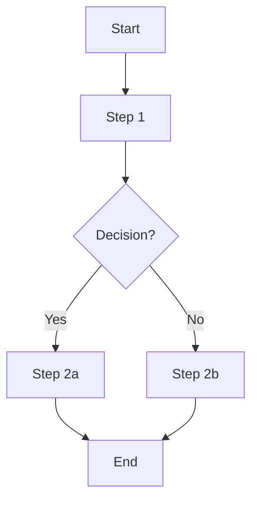

### Step-by-Step Instructions

1. Step 1
2. Step 2
3. Step 3

## Decision Points

| Decision | Criteria | Action |
|---|---|---|
| Decision | Criteria | Action |

## Escalation

| Issue | Contact | Method |
|---|---|---|
| Issue | Contact | Method |

## Definitions

| Term | Definition |
|---|---|
| Term | Definition |

## Related Documents

- [Related Doc 1](./related-doc-1.md)
- [Related Doc 2](./related-doc-2.md)

## Changelog

| Version | Date | Author | Changes |
|---|---|---|---|
| 1.0.0 | 2024-01-01 | Author | Initial version |
```

### 15.6 ADR (Architecture Decision Record) Template

```markdown
---
id: DOC-ADR-001
title: Architecture Decision Record Title
version: 1.0.0
status: Draft
author: Author Name
reviewer: Reviewer Name
last_updated: 2024-01-01
created: 2024-01-01
related:
  - ./related-doc-1.md
  - ./related-doc-2.md
tags:
  - adr
  - architecture
category: ADR
subcategory: Decision
---

# Architecture Decision Record: Title

## Status

`Proposed` / `Accepted` / `Rejected` / `Deprecated`

## Context

What is the issue that we're seeing that is motivating this decision or change?

## Decision

What is the change that we're proposing and/or doing?

## Alternatives Considered

| Alternative | Pros | Cons |
|---|---|---|
| Alternative 1 | Pros | Cons |
| Alternative 2 | Pros | Cons |

## Consequences

### Positive

- Consequence 1
- Consequence 2

### Negative

- Consequence 1
- Consequence 2

### Neutral

- Consequence 1
- Consequence 2

## Compliance

- [ ] Follows security standards
- [ ] Follows performance standards
- [ ] Follows scalability standards

## Related Documents

- [Related Doc 1](./related-doc-1.md)
- [Related Doc 2](./related-doc-2.md)

## Changelog

| Version | Date | Author | Changes |
|---|---|---|---|
| 1.0.0 | 2024-01-01 | Author | Initial version |
```

### 15.7 Prompt Documentation Template

```markdown
---
id: DOC-PROMPT-001
title: Prompt Documentation Title
version: 1.0.0
status: Draft
author: Author Name
reviewer: Reviewer Name
last_updated: 2024-01-01
created: 2024-01-01
related:
  - ./related-doc-1.md
  - ./related-doc-2.md
tags:
  - prompt
  - ai
category: AI
subcategory: Prompt
---

# Prompt Documentation: Title

> **Purpose:** Brief purpose statement.

## Overview

Brief overview.

## Prompt

```
# Role
You are a helpful assistant.

# Task
Your task is to...

# Context
Context information...

# Instructions
1. Instruction 1
2. Instruction 2
3. Instruction 3

# Guardrails
- Do not...
- Always...

# Examples
Example 1:
Input: ...
Output: ...

Example 2:
Input: ...
Output: ...
```

## Version History

| Version | Date | Author | Changes |
|---|---|---|---|
| 1.0.0 | 2024-01-01 | Author | Initial version |

## Evaluation

### Metrics

| Metric | Score |
|---|---|
| Accuracy | 95% |
| Hallucination Rate | 1% |

### Test Cases

| Input | Expected Output | Actual Output | Pass/Fail |
|---|---|---|---|
| Input | Output | Output | Pass |

## Related Documents

- [Related Doc 1](./related-doc-1.md)
- [Related Doc 2](./related-doc-2.md)

## Changelog

| Version | Date | Author | Changes |
|---|---|---|---|
| 1.0.0 | 2024-01-01 | Author | Initial version |
```

---

## 16. Documentation Quality Metrics

| Metric | Description | Target | Measurement |
|---|---|---|---|
| Documentation Coverage | % of features documented | 100% | Audit |
| Accuracy | % of accurate information | 100% | Review |
| Freshness | % of docs updated in last 6 months | 80% | Audit |
| Cross-Reference Completeness | % of docs with related links | 100% | Audit |
| Broken Links | % of broken links | 0% | Automated check |
| Review Compliance | % of docs with reviewer | 100% | Audit |
| AI Retrieval Quality | % of successful RAG retrievals | 95% | Evaluation |
| Readability | Flesch-Kincaid score | Grade 8-10 | Automated check |
| Completeness | % of required sections | 100% | Audit |
| Consistency | % of docs following standards | 100% | Audit |

### Measurement Frequency

- **Weekly:** Broken links, AI retrieval quality
- **Monthly:** Documentation coverage, freshness, cross-reference completeness
- **Quarterly:** Accuracy, review compliance, readability, completeness, consistency

### Reporting

- **Weekly:** Report to team
- **Monthly:** Report to management
- **Quarterly:** Report to stakeholders

---

## Related Documents

- `Project_Context/00_MASTER_CONTEXT.md`
- `Project_Context/01_PROJECT_INDEX.md`
- `Project_Context/10_CODING_STANDARDS.md`
- `Project_Context/11_ARCHITECTURE.md` (future)

---

**END OF DOCUMENT**