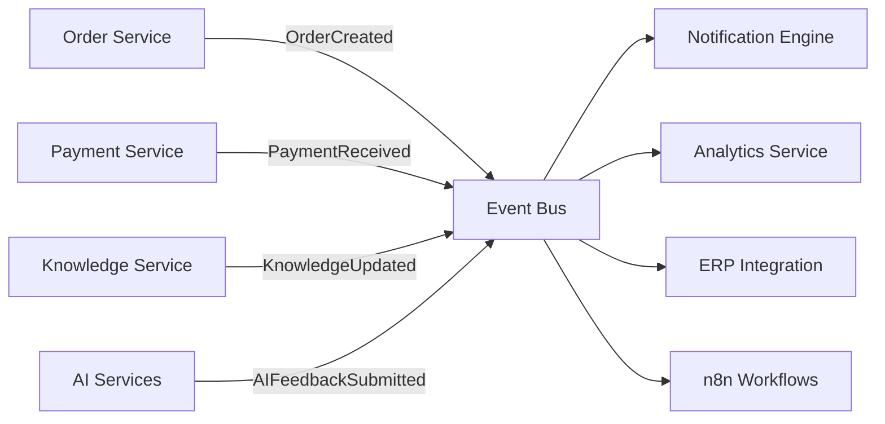

# Project_Context/14_FUTURE_INTEGRATIONS.md

# Dayjoy Enterprise AI Platform — Integration Strategy & Future Blueprint

> **Purpose:** Official integration blueprint for the Dayjoy Enterprise AI Platform.
>
> **Scope:** Defines internal and external systems that can integrate with the platform today and in the future, focusing on architecture, business value, security, dependencies, and long-term expansion.
>
> **Note:** This document is architectural and strategic. It does **not** contain implementation code.

---

## Table of Contents

1. [Integration Overview](#1-integration-overview)
2. [Communication Platforms](#2-communication-platforms)
3. [Voice & Telephony Integrations](#3-voice--telephony-integrations)
4. [CRM Integrations](#4-crm-integrations)
5. [ERP & Business System Integrations](#5-erp--business-system-integrations)
6. [Payment System Integrations](#6-payment-system-integrations)
7. [Knowledge System Integrations](#7-knowledge-system-integrations)
8. [Productivity Tool Integrations](#8-productivity-tool-integrations)
9. [Marketing Platform Integrations](#9-marketing-platform-integrations)
10. [Analytics Platform Integrations](#10-analytics-platform-integrations)
11. [Identity & Security Integrations](#11-identity--security-integrations)
12. [Automation Platform Integrations](#12-automation-platform-integrations)
13. [AI Service Integrations](#13-ai-service-integrations)
14. [Developer Service Integrations](#14-developer-service-integrations)
15. [Integration Architecture Diagrams](#15-integration-architecture-diagrams)
16. [Integration Dependency Matrix](#16-integration-dependency-matrix)
17. [Security Model](#17-security-model)
18. [Error Handling & Failure Strategy](#18-error-handling--failure-strategy)
19. [Integration Roadmap](#19-integration-roadmap)
20. [Future Expansion Integrations](#20-future-expansion-integrations)

---

## 1. Integration Overview

The Dayjoy Enterprise AI Platform is designed as an **API-first, AI-first, event-driven, modular** ecosystem.

Integrations serve three primary purposes:

- **Customer & Distributor Experience:** Multi-channel communication, support, onboarding, training.
- **Operational Efficiency:** Automation of workflows, data synchronization, reporting.
- **AI Enablement:** Access to data, tools, and external AI services to power intelligent behaviors.

### Integration Principles

- **IP-001 – API-First:** All integrations must be exposed and consumed via well-defined APIs.
- **IP-002 – Loose Coupling:** External systems must integrate via abstraction layers, not direct tight coupling.
- **IP-003 – Security-by-Design:** Authentication, authorization, encryption, and audit logging are mandatory.
- **IP-004 – Event-Driven:** Key business events trigger integrations (webhooks, message queues).
- **IP-005 – RAG-Friendly:** Knowledge-related integrations must support RAG and metadata.
- **IP-006 – Phased Rollout:** Integrations are prioritized by business value and complexity.

---

## 2. Communication Platforms

### INT-COMM-001: WhatsApp Business Platform

- **Category:** Communication
- **Business Purpose:** Primary customer and distributor support, notifications, and engagement channel.
- **Description:** Integrates WhatsApp Business API (direct or via Twilio) for 2-way messaging, templates, and notifications.
- **Data Exchanged:** Messages, templates, media (images, docs), delivery status.
- **Trigger Events:** Order updates, distributor support queries, training reminders, payout notifications, complaint status.
- **Authentication Method:** OAuth/API keys with WhatsApp Business provider.
- **Communication Protocol:** HTTPS REST APIs, webhooks.
- **Related AI Modules:** WhatsApp AI, Distributor AI, Support AI, Notification AI.
- **Business Priority:** **Critical (Phase 1)**
- **Technical Complexity:** Medium–High (template policies, webhooks, scaling).
- **Security Considerations:** Message encryption in transit, template approval, rate limiting, consent management.
- **Dependencies:** WhatsApp Business API provider, API Gateway, Auth service, Notification engine.
- **Current Status:** Recommended (MVP integration required).

### INT-COMM-002: Email Services (e.g., SendGrid, AWS SES)

- **Category:** Communication
- **Business Purpose:** Official communication, order confirmations, policy updates, internal notifications.
- **Description:** Integrates transactional email provider for system-generated emails.
- **Data Exchanged:** Email content, recipient addresses, delivery/open events.
- **Trigger Events:** Order confirmation, refund status, distributor payout statements, internal alerts.
- **Authentication Method:** API keys.
- **Communication Protocol:** HTTPS REST API.
- **Related AI Modules:** Notification AI, Internal AI, Admin AI.
- **Business Priority:** **High (Phase 1)**
- **Technical Complexity:** Low–Medium.
- **Security Considerations:** DKIM/SPF, API key management, unsubscribe handling for bulk emails.
- **Dependencies:** Notification engine, email provider.
- **Current Status:** Recommended.

### INT-COMM-003: SMS Providers (e.g., Exotel, local SMS gateways)

- **Category:** Communication
- **Business Purpose:** OTPs, critical alerts, fallback channel for notifications.
- **Description:** SMS gateway integration for short messages.
- **Data Exchanged:** SMS content, recipient numbers, delivery receipts.
- **Trigger Events:** OTP verification, urgent alerts, fallback when WhatsApp/email not reachable.
- **Authentication Method:** API keys.
- **Communication Protocol:** HTTPS REST API.
- **Related AI Modules:** Notification AI, Security AI (OTP), Internal AI.
- **Business Priority:** **Medium (Phase 2)**
- **Technical Complexity:** Low.
- **Security Considerations:** Protect phone numbers, rate limiting, OTP reuse prevention.
- **Dependencies:** Auth service, notification engine.
- **Current Status:** Future/Optional.

### INT-COMM-004: Push Notifications (Mobile Apps – Future)

- **Category:** Communication
- **Business Purpose:** Real-time engagement on mobile (orders, payouts, training, alerts).
- **Description:** FCM/APNs integration for mobile app push.
- **Data Exchanged:** Notification payloads, device tokens.
- **Trigger Events:** App-level events (order status, new training, payout updates).
- **Authentication Method:** Service keys, certificates.
- **Communication Protocol:** HTTPS.
- **Related AI Modules:** Mobile AI, Notification AI.
- **Business Priority:** **Medium (Phase 3/4)**
- **Technical Complexity:** Medium.
- **Security Considerations:** Token management, opt-in/out, privacy.
- **Dependencies:** Mobile apps, notification engine.
- **Current Status:** Future.

### INT-COMM-005: Live Chat (Website Live Agent Integration)

- **Category:** Communication
- **Business Purpose:** Human support on website for escalations.
- **Description:** Integration with live chat provider (e.g., Intercom, Freshchat) for human handoff.
- **Data Exchanged:** Chat transcripts, user data, escalation context.
- **Trigger Events:** AI escalation, user request for human.
- **Authentication Method:** API keys/OAuth.
- **Communication Protocol:** Web SDK, HTTPS APIs.
- **Related AI Modules:** Website AI, Support AI.
- **Business Priority:** **High (Phase 2)**
- **Technical Complexity:** Medium.
- **Security Considerations:** PII handling, chat logging, consent.
- **Dependencies:** Website, support systems.
- **Current Status:** Future/Recommended.

---

## 3. Voice & Telephony Integrations

### INT-VOICE-001: Vapi Voice AI Platform

- **Category:** Voice & Telephony
- **Business Purpose:** Core Voice AI telephony layer for incoming/outgoing calls.
- **Description:** Integrates Vapi for telephony, STT, TTS, and low-latency LLM orchestration.
- **Data Exchanged:** Audio streams, call metadata, transcripts, intent data.
- **Trigger Events:** Incoming customer/distributor calls, scheduled outbound calls.
- **Authentication Method:** API keys, secret tokens.
- **Communication Protocol:** HTTPS, WebSockets.
- **Related AI Modules:** Voice AI, Knowledge AI, Support AI.
- **Business Priority:** **Critical (Phase 1)**
- **Technical Complexity:** High.
- **Security Considerations:** Call recording consent, encryption, PII in transcripts, access control.
- **Dependencies:** LLM providers, Deepgram STT, ElevenLabs TTS, backend APIs.
- **Current Status:** Planned/Recommended.

### INT-VOICE-002: SIP Providers (Future)

- **Category:** Voice & Telephony
- **Business Purpose:** Flexible telephony connectivity (e.g., PSTN, call centers).
- **Description:** SIP trunk integration via Vapi or direct SIP providers.
- **Data Exchanged:** Call signaling, audio streams.
- **Trigger Events:** High-volume call flows, call center integration.
- **Authentication Method:** SIP authentication.
- **Communication Protocol:** SIP/RTP.
- **Related AI Modules:** Voice AI, Call Analytics AI.
- **Business Priority:** **Medium (Phase 3/4)**
- **Technical Complexity:** High.
- **Security Considerations:** Secure SIP, call recording compliance.
- **Dependencies:** Telephony infrastructure, Vapi.
- **Current Status:** Future.

### INT-VOICE-003: Twilio / Exotel Telephony

- **Category:** Voice & Telephony
- **Business Purpose:** Alternative telephony provider for calls and SMS.
- **Description:** Integrates Twilio/Exotel for numbers, call routing, SMS.
- **Data Exchanged:** Call events, SMS, transcripts (optional).
- **Trigger Events:** Incoming/outgoing calls, OTP SMS.
- **Authentication Method:** API keys.
- **Communication Protocol:** HTTPS, Webhooks, SIP (optional).
- **Related AI Modules:** Voice AI, Notification AI.
- **Business Priority:** **High (Phase 2)**
- **Technical Complexity:** Medium–High.
- **Security Considerations:** Data residency, call recording consent.
- **Dependencies:** Telephony routing, API gateway.
- **Current Status:** Recommended/Future.

### INT-VOICE-004: Voice Analytics Platform

- **Category:** Voice & Telephony
- **Business Purpose:** Analyze call performance, sentiment, topics.
- **Description:** Integration with analytics or in-house voice analytics (via Vapi logs).
- **Data Exchanged:** Call metadata, transcripts, sentiment scores.
- **Trigger Events:** Completed calls.
- **Authentication Method:** API keys.
- **Communication Protocol:** HTTPS.
- **Related AI Modules:** Analytics AI, Support AI, Management AI.
- **Business Priority:** **Medium (Phase 3)**
- **Technical Complexity:** Medium.
- **Security Considerations:** Transcript privacy, access control.
- **Dependencies:** Vapi, logging.
- **Current Status:** Future.

---

## 4. CRM Integrations

### INT-CRM-001: Core CRM (Future – generic)

- **Category:** CRM
- **Business Purpose:** Centralize customer, distributor, and lead data.
- **Description:** Integration with CRM (e.g., HubSpot, Zoho, Salesforce) to sync contacts, leads, pipelines.
- **Data Exchanged:** Customer/distributor profiles, leads, activities, notes.
- **Trigger Events:** New lead captured, distributor registered, order placed, support interactions.
- **Authentication Method:** OAuth 2.0.
- **Communication Protocol:** REST APIs, webhooks.
- **Related AI Modules:** Sales AI, Distributor AI, Analytics AI, Website/WhatsApp AI.
- **Business Priority:** **High (Phase 2)**
- **Technical Complexity:** Medium–High.
- **Security Considerations:** PII protection, role-based access, consent.
- **Dependencies:** Identity system, lead capture flows.
- **Current Status:** Future/Recommended.

### INT-CRM-002: Lead Management Integration

- **Category:** CRM
- **Business Purpose:** Track and nurture leads across channels.
- **Description:** Sync lead data from Website AI, WhatsApp AI, Voice AI to CRM.
- **Data Exchanged:** Lead details, source, intent, interactions.
- **Trigger Events:** Lead qualification, form submission, high-intent behaviors.
- **Authentication Method:** OAuth 2.0 / API keys.
- **Communication Protocol:** REST APIs, webhooks.
- **Related AI Modules:** Sales AI, Website AI, WhatsApp AI, Voice AI.
- **Business Priority:** **High (Phase 2)**
- **Technical Complexity:** Medium.
- **Security Considerations:** Data minimization, consent.
- **Dependencies:** CRM, lead capture flows.
- **Current Status:** Future.

---

## 5. ERP & Business System Integrations

### INT-ERP-001: Order & Inventory System

- **Category:** ERP
- **Business Purpose:** Sync orders and inventory for accurate tracking and AI support.
- **Description:** Integration with ERP or order/inventory module (internal or external).
- **Data Exchanged:** Orders, inventory levels, fulfillment status.
- **Trigger Events:** Order created, updated, canceled, shipped, delivered.
- **Authentication Method:** OAuth 2.0 / API keys.
- **Communication Protocol:** REST APIs, webhooks.
- **Related AI Modules:** Website AI, WhatsApp AI, Voice AI, Analytics AI.
- **Business Priority:** **Critical (Phase 1/2)**
- **Technical Complexity:** High.
- **Security Considerations:** Data integrity, access control, audit.
- **Dependencies:** Order service, logistics.
- **Current Status:** Planned/Recommended.

### INT-ERP-002: Logistics & Shipping

- **Category:** ERP
- **Business Purpose:** Provide shipping updates and delivery tracking.
- **Description:** Courier/logistics integration (e.g., Shiprocket, Delhivery APIs) for tracking.
- **Data Exchanged:** Tracking IDs, status, delivery events.
- **Trigger Events:** Shipment created, in transit, delivered, failed.
- **Authentication Method:** API keys.
- **Communication Protocol:** REST APIs, webhooks.
- **Related AI Modules:** Order Tracking AI, Notification AI.
- **Business Priority:** **High (Phase 2)**
- **Technical Complexity:** Medium.
- **Security Considerations:** Address privacy, tracking exposure.
- **Dependencies:** Order system, logistics provider.
- **Current Status:** Future.

### INT-ERP-003: Finance & Accounting

- **Category:** ERP
- **Business Purpose:** Sync financial transactions for reporting and payouts.
- **Description:** Integration with accounting systems (e.g., Tally, Zoho Books) for invoices, payouts.
- **Data Exchanged:** Invoices, payouts, refunds, ledger entries.
- **Trigger Events:** Payment, refund, monthly payout cycle.
- **Authentication Method:** API keys/OAuth.
- **Communication Protocol:** REST APIs.
- **Related AI Modules:** Finance AI, Analytics AI.
- **Business Priority:** **Medium (Phase 3)**
- **Technical Complexity:** High.
- **Security Considerations:** Financial data protection.
- **Dependencies:** Payment gateway, compensation module.
- **Current Status:** Future.

---

## 6. Payment System Integrations

### INT-PAY-001: Razorpay

- **Category:** Payments
- **Business Purpose:** Core online payment processing.
- **Description:** Razorpay integration for cards, net banking, UPI.
- **Data Exchanged:** Payment intents, transaction status, refund requests.
- **Trigger Events:** Order payment, refund initiation, payout-related flows.
- **Authentication Method:** API keys.
- **Communication Protocol:** REST APIs, webhooks.
- **Related AI Modules:** Website AI, WhatsApp AI, Payment Assistant AI, Finance AI.
- **Business Priority:** **Critical (Phase 1)**
- **Technical Complexity:** Medium–High.
- **Security Considerations:** PCI-DSS compliance, no card storage, encryption.
- **Dependencies:** Order system, refund workflows.
- **Current Status:** Recommended.

### INT-PAY-002: UPI Providers (PhonePe, Google Pay, etc.)

- **Category:** Payments
- **Business Purpose:** Popular payment methods for Indian customers.
- **Description:** UPI integration via payment gateway or direct provider.
- **Data Exchanged:** Payment requests, status.
- **Trigger Events:** Order payments.
- **Authentication Method:** Payment gateway mechanisms.
- **Communication Protocol:** REST APIs.
- **Related AI Modules:** Website AI, Payment AI.
- **Business Priority:** **High (Phase 1/2)**
- **Technical Complexity:** Medium.
- **Security Considerations:** Transaction verification.
- **Dependencies:** Payment gateway.
- **Current Status:** Recommended/Future.

### INT-PAY-003: Stripe (Future)

- **Category:** Payments
- **Business Purpose:** International expansion and global payment support.
- **Description:** Stripe integration for global cards and wallets.
- **Data Exchanged:** Payment intents, charges, refunds.
- **Trigger Events:** International orders.
- **Authentication Method:** API keys.
- **Communication Protocol:** REST APIs, webhooks.
- **Related AI Modules:** Website AI (global), Finance AI.
- **Business Priority:** **Medium (Phase 3/4)**
- **Technical Complexity:** Medium.
- **Security Considerations:** PCI-DSS, currency handling.
- **Dependencies:** International business expansion.
- **Current Status:** Future.

---

## 7. Knowledge System Integrations

### INT-KB-001: Knowledge Repository (Git + Markdown)

- **Category:** Knowledge
- **Business Purpose:** Central knowledge source for RAG.
- **Description:** Git-based repository (GitHub) storing Markdown docs (policies, FAQs, product knowledge, SOPs).
- **Data Exchanged:** Documents, metadata (tags, categories, versions).
- **Trigger Events:** Document updates, new docs, approvals.
- **Authentication Method:** Git access (SSH/OAuth).
- **Communication Protocol:** Git, API (GitHub).
- **Related AI Modules:** Knowledge AI, Website/WhatsApp/Voice AI.
- **Business Priority:** **Critical (Phase 1)**
- **Technical Complexity:** Medium.
- **Security Considerations:** Repo access control, secrets in docs.
- **Dependencies:** Documentation process.
- **Current Status:** Confirmed (project files).

### INT-KB-002: Vector Database (PGVector)

- **Category:** Knowledge
- **Business Purpose:** Store embeddings for RAG.
- **Description:** PGVector integration for semantic search.
- **Data Exchanged:** Embeddings, document references, metadata.
- **Trigger Events:** Document ingestion, updates.
- **Authentication Method:** DB credentials.
- **Communication Protocol:** SQL.
- **Related AI Modules:** Knowledge AI, RAG Engine.
- **Business Priority:** **Critical (Phase 1)**
- **Technical Complexity:** Medium.
- **Security Considerations:** DB access control, encryption.
- **Dependencies:** PostgreSQL, embedding models.
- **Current Status:** Planned.

### INT-KB-003: Object Storage (S3)

- **Category:** Knowledge
- **Business Purpose:** Store PDFs, images, large docs.
- **Description:** S3 integration for document and media storage.
- **Data Exchanged:** Document files, metadata.
- **Trigger Events:** Document upload, update, delete.
- **Authentication Method:** IAM roles/keys.
- **Communication Protocol:** HTTPS.
- **Related AI Modules:** Knowledge AI, Marketing AI.
- **Business Priority:** **High (Phase 1/2)**
- **Technical Complexity:** Medium.
- **Security Considerations:** Bucket policies, encryption, access control.
- **Dependencies:** Cloud provider.
- **Current Status:** Recommended.

### INT-KB-004: Search Engine (Optional – ElasticSearch/OpenSearch)

- **Category:** Knowledge
- **Business Purpose:** Full-text search and analytics.
- **Description:** Search engine integration for knowledge and logs.
- **Data Exchanged:** Indexed documents, logs.
- **Trigger Events:** Document changes, log ingestion.
- **Authentication Method:** API keys.
- **Communication Protocol:** REST APIs.
- **Related AI Modules:** Internal AI, Knowledge AI, Analytics AI.
- **Business Priority:** **Medium (Phase 2/3)**
- **Technical Complexity:** Medium–High.
- **Security Considerations:** Access control, index-level permissions.
- **Dependencies:** Logging, knowledge pipeline.
- **Current Status:** Future/Optional.

---

## 8. Productivity Tool Integrations

### INT-PROD-001: Calendar (Google/Outlook)

- **Category:** Productivity
- **Business Purpose:** Scheduling calls, trainings, and reminders.
- **Description:** Calendar integration for booking and reminders.
- **Data Exchanged:** Events, availability, attendee info.
- **Trigger Events:** Appointment booking, meeting scheduling, training sessions.
- **Authentication Method:** OAuth 2.0.
- **Communication Protocol:** REST APIs.
- **Related AI Modules:** Voice AI (callbacks), Internal AI, Distributor AI.
- **Business Priority:** **Medium (Phase 2/3)**
- **Technical Complexity:** Medium.
- **Security Considerations:** Calendar privacy.
- **Dependencies:** Identity system.
- **Current Status:** Future.

### INT-PROD-002: Document Storage (Google Drive/OneDrive)

- **Category:** Productivity
- **Business Purpose:** Store and reference shared docs (presentations, training materials).
- **Description:** Drive integration for doc access.
- **Data Exchanged:** Files, metadata.
- **Trigger Events:** Training updates, document sharing.
- **Authentication Method:** OAuth 2.0.
- **Communication Protocol:** REST APIs.
- **Related AI Modules:** Internal AI, Training AI.
- **Business Priority:** **Medium (Phase 3)**
- **Technical Complexity:** Medium.
- **Security Considerations:** Access scopes, shared links.
- **Dependencies:** Identity.
- **Current Status:** Future.

### INT-PROD-003: Task Management (e.g., Asana/Jira/Trello)

- **Category:** Productivity
- **Business Purpose:** Track tasks created by AI suggestions.
- **Description:** Integration for creating and updating tasks.
- **Data Exchanged:** Task details, status, assignees.
- **Trigger Events:** AI-generated action items, escalations.
- **Authentication Method:** OAuth/API keys.
- **Communication Protocol:** REST APIs.
- **Related AI Modules:** Internal AI, Admin AI.
- **Business Priority:** **Low–Medium (Phase 3/4)**
- **Technical Complexity:** Medium.
- **Security Considerations:** Access control.
- **Dependencies:** Project management tooling.
- **Current Status:** Future.

---

## 9. Marketing Platform Integrations

### INT-MKT-001: Meta Ads

- **Category:** Marketing
- **Business Purpose:** Run and optimize campaigns.
- **Description:** Integration with Meta Ads (Facebook/Instagram) for campaign management.
- **Data Exchanged:** Campaign settings, performance metrics, audience segments.
- **Trigger Events:** Campaign creation/updates, performance analysis.
- **Authentication Method:** OAuth.
- **Communication Protocol:** REST APIs.
- **Related AI Modules:** Marketing AI, Analytics AI.
- **Business Priority:** **Medium (Phase 3)**
- **Technical Complexity:** Medium–High.
- **Security Considerations:** Token scopes, ad spend control.
- **Dependencies:** Marketing strategy.
- **Current Status:** Future.

### INT-MKT-002: Google Ads

- **Category:** Marketing
- **Business Purpose:** Search and display campaigns.
- **Description:** Google Ads integration.
- **Data Exchanged:** Campaigns, keywords, performance metrics.
- **Trigger Events:** Campaign management, analytics.
- **Authentication Method:** OAuth.
- **Communication Protocol:** REST APIs.
- **Related AI Modules:** Marketing AI, Analytics AI.
- **Business Priority:** **Medium (Phase 3)**
- **Technical Complexity:** Medium.
- **Security Considerations:** Token scopes, budget control.
- **Dependencies:** Marketing.
- **Current Status:** Future.

### INT-MKT-003: Email Marketing (e.g., Mailchimp/Sendinblue)

- **Category:** Marketing
- **Business Purpose:** Campaign email marketing.
- **Description:** Integration for mailing lists and campaigns.
- **Data Exchanged:** Subscriber lists, campaign content, engagement metrics.
- **Trigger Events:** Campaign launches, subscription changes.
- **Authentication Method:** API keys.
- **Communication Protocol:** REST APIs.
- **Related AI Modules:** Marketing AI.
- **Business Priority:** **Medium (Phase 3)**
- **Technical Complexity:** Medium.
- **Security Considerations:** Consent, unsubscribe handling.
- **Dependencies:** CRM.
- **Current Status:** Future.

---

## 10. Analytics Platform Integrations

### INT-ANL-001: Google Analytics

- **Category:** Analytics
- **Business Purpose:** Track website usage and funnel performance.
- **Description:** GA integration for traffic, conversions, events.
- **Data Exchanged:** Usage metrics, events.
- **Trigger Events:** Page views, conversion events.
- **Authentication Method:** Service accounts.
- **Communication Protocol:** REST APIs.
- **Related AI Modules:** Analytics AI, Website AI.
- **Business Priority:** **High (Phase 2)**
- **Technical Complexity:** Medium.
- **Security Considerations:** Data anonymization.
- **Dependencies:** Website.
- **Current Status:** Recommended.

### INT-ANL-002: AI Analytics (Internal)

- **Category:** Analytics
- **Business Purpose:** Track AI performance and usage.
- **Description:** Integration between logging and dashboards for AI metrics.
- **Data Exchanged:** AI usage logs, metrics, evaluation results.
- **Trigger Events:** AI calls, tool usage.
- **Authentication Method:** Internal auth.
- **Communication Protocol:** REST, message queues.
- **Related AI Modules:** Analytics AI, AI Governance.
- **Business Priority:** **Critical (Phase 1/2)**
- **Technical Complexity:** Medium.
- **Security Considerations:** PII in logs.
- **Dependencies:** Logging, monitoring.
- **Current Status:** Planned.

### INT-ANL-003: Business Intelligence (e.g., Power BI, Looker) – Future

- **Category:** Analytics
- **Business Purpose:** Advanced BI and dashboards.
- **Description:** BI integration for cross-system reporting.
- **Data Exchanged:** Aggregated metrics from ERP, CRM, AI.
- **Trigger Events:** Periodic refresh.
- **Authentication Method:** OAuth.
- **Communication Protocol:** REST, SQL connectors.
- **Related AI Modules:** Analytics AI.
- **Business Priority:** **Medium (Phase 3/4)**
- **Technical Complexity:** High.
- **Security Considerations:** Data governance.
- **Dependencies:** Data warehouse.
- **Current Status:** Future.

---

## 11. Identity & Security Integrations

### INT-ID-001: OAuth / SSO (Google, Microsoft)

- **Category:** Identity & Security
- **Business Purpose:** SSO for employees and possibly customers.
- **Description:** OAuth/SSO integration for login.
- **Data Exchanged:** Identity tokens, profile info.
- **Trigger Events:** Login, session creation.
- **Authentication Method:** OAuth 2.0 / OpenID Connect.
- **Communication Protocol:** HTTPS.
- **Related AI Modules:** Internal AI, Admin AI.
- **Business Priority:** **High (Phase 2)**
- **Technical Complexity:** Medium.
- **Security Considerations:** Token validation, scopes.
- **Dependencies:** Auth service.
- **Current Status:** Future.

### INT-ID-002: MFA

- **Category:** Identity & Security
- **Business Purpose:** Multi-factor authentication for sensitive operations.
- **Description:** SMS/OTP/email/push-based MFA integration.
- **Data Exchanged:** OTP codes, verification results.
- **Trigger Events:** Login, critical actions.
- **Authentication Method:** OTP/MFA flows.
- **Communication Protocol:** HTTPS.
- **Related AI Modules:** Internal AI, Admin AI.
- **Business Priority:** **High (Phase 2/3)**
- **Technical Complexity:** Medium.
- **Security Considerations:** OTP expiry, brute-force protection.
- **Dependencies:** SMS/email providers.
- **Current Status:** Future.

### INT-ID-003: RBAC & Policy Engine

- **Category:** Identity & Security
- **Business Purpose:** Central role-based access control and permission checks.
- **Description:** Policy engine integration (e.g., OPA or custom) for RBAC.
- **Data Exchanged:** Roles, permissions, policy decisions.
- **Trigger Events:** Every protected action.
- **Authentication Method:** Internal.
- **Communication Protocol:** REST APIs.
- **Related AI Modules:** All AI agents, Admin AI.
- **Business Priority:** **Critical (Phase 1/2)**
- **Technical Complexity:** Medium–High.
- **Security Considerations:** Policy correctness.
- **Dependencies:** Auth service.
- **Current Status:** Planned.

---

## 12. Automation Platform Integrations

### INT-AUTO-001: n8n

- **Category:** Automation
- **Business Purpose:** Orchestrate workflows and automations.
- **Description:** n8n integration for building event-driven workflows.
- **Data Exchanged:** Workflow events, payloads.
- **Trigger Events:** Business events (order, refund, training, notifications).
- **Authentication Method:** Internal.
- **Communication Protocol:** REST APIs, webhooks.
- **Related AI Modules:** Automation AI, Internal AI, Admin AI.
- **Business Priority:** **High (Phase 2)**
- **Technical Complexity:** Medium.
- **Security Considerations:** Access control for workflow actions.
- **Dependencies:** Event bus, APIs.
- **Current Status:** Recommended.

### INT-AUTO-002: Zapier / Make (Optional)

- **Category:** Automation
- **Business Purpose:** Quick integrations with third-party tools.
- **Description:** Zapier/Make integration for non-critical workflows.
- **Data Exchanged:** Events, payloads.
- **Trigger Events:** Business events.
- **Authentication Method:** API keys/OAuth.
- **Communication Protocol:** Webhooks.
- **Related AI Modules:** Internal AI.
- **Business Priority:** **Low–Medium (Optional)**
- **Technical Complexity:** Low.
- **Security Considerations:** Data exposure to third-party.
- **Dependencies:** APIs.
- **Current Status:** Optional/Future.

---

## 13. AI Service Integrations

### INT-AI-001: LLM Providers (OpenAI, Anthropic)

- **Category:** AI Services
- **Business Purpose:** Core reasoning and language generation.
- **Description:** Integration with OpenAI/Anthropic for LLMs.
- **Data Exchanged:** Prompts, responses, tool calls.
- **Trigger Events:** AI queries.
- **Authentication Method:** API keys.
- **Communication Protocol:** HTTPS APIs.
- **Related AI Modules:** All AI agents.
- **Business Priority:** **Critical (Phase 1)**
- **Technical Complexity:** Medium.
- **Security Considerations:** Prompt content privacy, rate limits.
- **Dependencies:** AI orchestration.
- **Current Status:** Confirmed/Planned.

### INT-AI-002: Embedding Models (OpenAI, Voyage)

- **Category:** AI Services
- **Business Purpose:** Document and query embeddings for RAG.
- **Description:** Embedding API integration.
- **Data Exchanged:** Text, embeddings.
- **Trigger Events:** Document ingestion, RAG queries.
- **Authentication Method:** API keys.
- **Communication Protocol:** HTTPS APIs.
- **Related AI Modules:** Knowledge AI, RAG Engine.
- **Business Priority:** **Critical (Phase 1)**
- **Technical Complexity:** Medium.
- **Security Considerations:** Data minimization (no PII in embeddings when avoidable).
- **Dependencies:** Knowledge repository.
- **Current Status:** Planned.

### INT-AI-003: OCR (e.g., Tesseract, external OCR APIs)

- **Category:** AI Services
- **Business Purpose:** Extract text from documents.
- **Description:** OCR integration for scanned docs.
- **Data Exchanged:** Images/PDFs, extracted text.
- **Trigger Events:** Document ingestion.
- **Authentication Method:** API keys (external) or internal.
- **Communication Protocol:** HTTPS / local.
- **Related AI Modules:** Knowledge AI.
- **Business Priority:** **Medium (Phase 2/3)**
- **Technical Complexity:** Medium.
- **Security Considerations:** Document privacy.
- **Dependencies:** Object storage.
- **Current Status:** Future.

### INT-AI-004: Translation Services (e.g., Google Translate/AWS Translate)

- **Category:** AI Services
- **Business Purpose:** Multilingual support.
- **Description:** Translation API integration.
- **Data Exchanged:** Text, translated text.
- **Trigger Events:** Multilingual conversations, knowledge translation.
- **Authentication Method:** API keys.
- **Communication Protocol:** HTTPS APIs.
- **Related AI Modules:** Voice AI, WhatsApp AI, Website AI.
- **Business Priority:** **Medium (Phase 3)**
- **Technical Complexity:** Medium.
- **Security Considerations:** PII in translation.
- **Dependencies:** Language strategy.
- **Current Status:** Future.

### INT-AI-005: Speech Models (Deepgram, ElevenLabs)

- **Category:** AI Services
- **Business Purpose:** STT and TTS for Voice AI.
- **Description:** Already covered via Vapi, but may have direct integration.
- **Data Exchanged:** Audio, text.
- **Trigger Events:** Calls.
- **Authentication Method:** API keys.
- **Communication Protocol:** HTTPS/WebSockets.
- **Related AI Modules:** Voice AI.
- **Business Priority:** **Critical (Phase 1)**
- **Technical Complexity:** Medium.
- **Security Considerations:** Audio privacy.
- **Dependencies:** Telephony.
- **Current Status:** Planned.

### INT-AI-006: Image Models (Future)

- **Category:** AI Services
- **Business Purpose:** Product imagery, marketing creatives.
- **Description:** Image generation for marketing assets.
- **Data Exchanged:** Prompts, images.
- **Trigger Events:** Marketing content creation.
- **Authentication Method:** API keys.
- **Communication Protocol:** HTTPS.
- **Related AI Modules:** Marketing AI.
- **Business Priority:** **Low–Medium (Phase 3/4)**
- **Technical Complexity:** Medium.
- **Security Considerations:** Content safety.
- **Dependencies:** Marketing processes.
- **Current Status:** Future.

---

## 14. Developer Service Integrations

### INT-DEV-001: GitHub

- **Category:** Developer
- **Business Purpose:** Source control, documentation storage, issue tracking.
- **Description:** GitHub integration for code and docs.
- **Data Exchanged:** Repos, files, issues.
- **Trigger Events:** Code changes, doc updates.
- **Authentication Method:** SSH/OAuth.
- **Communication Protocol:** Git, REST APIs.
- **Related AI Modules:** Internal AI (code assist), Knowledge AI.
- **Business Priority:** **High (Phase 1)**
- **Technical Complexity:** Low–Medium.
- **Security Considerations:** Repo access, secret handling.
- **Dependencies:** DevOps.
- **Current Status:** Confirmed (github_mcp_direct).

### INT-DEV-002: CI/CD (GitHub Actions)

- **Category:** Developer
- **Business Purpose:** Automated builds, tests, deployments.
- **Description:** CI/CD integration for automation.
- **Data Exchanged:** Build logs, test results.
- **Trigger Events:** Push, PR, release.
- **Authentication Method:** Internal.
- **Communication Protocol:** GitHub APIs.
- **Related AI Modules:** None directly (but supports platform).
- **Business Priority:** **High (Phase 1)**
- **Technical Complexity:** Medium.
- **Security Considerations:** Secrets in CI.
- **Dependencies:** GitHub.
- **Current Status:** Confirmed.

### INT-DEV-003: Monitoring & Logging (Prometheus, Grafana, ELK)

- **Category:** Developer
- **Business Purpose:** Observability.
- **Description:** Integration for metrics and logs.
- **Data Exchanged:** Logs, metrics.
- **Trigger Events:** All service operations.
- **Authentication Method:** Internal.
- **Communication Protocol:** HTTP, exporters.
- **Related AI Modules:** Analytics AI, AI Governance.
- **Business Priority:** **Critical (Phase 1/2)**
- **Technical Complexity:** Medium–High.
- **Security Considerations:** Sensitive data in logs.
- **Dependencies:** Services.
- **Current Status:** Planned.

### INT-DEV-004: API Gateway (Kong/AWS API Gateway)

- **Category:** Developer
- **Business Purpose:** Unified API entry, security, rate limiting.
- **Description:** Gateway integration for API management.
- **Data Exchanged:** API requests/responses.
- **Trigger Events:** All external API calls.
- **Authentication Method:** JWT/OAuth.
- **Communication Protocol:** HTTP.
- **Related AI Modules:** All external-facing AI.
- **Business Priority:** **Critical (Phase 1)**
- **Technical Complexity:** Medium–High.
- **Security Considerations:** Auth, rate limiting, WAF.
- **Dependencies:** Backend services.
- **Current Status:** Planned.

### INT-DEV-005: Secrets Management (AWS Secrets Manager/Vault)

- **Category:** Developer
- **Business Purpose:** Secure secret storage.
- **Description:** Secret manager integration.
- **Data Exchanged:** Secrets.
- **Trigger Events:** Service start, secret usage.
- **Authentication Method:** IAM/roles.
- **Communication Protocol:** HTTPS.
- **Related AI Modules:** All.
- **Business Priority:** **Critical (Phase 1)**
- **Technical Complexity:** Medium.
- **Security Considerations:** Access policies.
- **Dependencies:** Cloud provider.
- **Current Status:** Planned.

---

## 15. Integration Architecture Diagrams

### 15.1 High-Level Integration Architecture

```mermaid
flowchart TB
    subgraph "Users"
        CUST[Customers]
        DIST[Distributors]
        EMP[Employees]
        MGMT[Management]
    end

    subgraph "Channels"
        WEB[Website]
        WA[WhatsApp]
        VOICE[Voice Calls]
        EMAIL[Email]
        SMS[SMS]
        LIVE[Live Chat]
    end

    subgraph "AI Layer"
        WAI[Website AI]
        WAAI[WhatsApp AI]
        VAI[Voice AI]
        KAI[Knowledge AI]
        SAI[Sales AI]
        MAI[Marketing AI]
        AAI[Analytics AI]
        IAI[Internal AI]
        AADMIN[Admin AI]
    end

    subgraph "Core Services"
        API[API Gateway]
        AUTH[Auth & RBAC]
        ORD[Order Service]
        DISTSRV[Distributor Service]
        PROD[Product Service]
        PAY[Payment Service]
        KB[Knowledge Service]
        AUTO[n8n Automation]
    end

    subgraph "Data & Infra"
        DB[PostgreSQL]
        VEC[PGVector]
        CACHE[Redis]
        S3[Object Storage]
        LOGS[Logging/ELK]
        METRICS[Prometheus/Grafana]
    end

    subgraph "External Integrations"
        WABA[WhatsApp Business API]
        RAZOR[Razorpay]
        GA[Google Analytics]
        CRM[CRM (Future)]
        ERP[ERP/Inventory (Future)]
        VAPI[Vapi]
        EMAILP[Email Provider]
    end

    CUST --> WEB
    CUST --> WA
    CUST --> VOICE
    DIST --> WEB
    DIST --> WA
    DIST --> VOICE
    EMP --> WEB
    EMP --> IAI
    MGMT --> WEB
    MGMT --> AAI

    WEB --> WAI
    WA --> WAAI
    VOICE --> VAPI --> VAI
    EMAILP --> EMAIL

    WAI --> API
    WAAI --> API
    VAI --> API
    IAI --> API

    API --> AUTH
    API --> ORD
    API --> DISTSRV
    API --> PROD
    API --> PAY
    API --> KB
    API --> AUTO

    ORD --> DB
    DISTSRV --> DB
    PROD --> DB
    PAY --> DB
    KB --> DB
    KB --> VEC
    CACHE --> API

    API --> LOGS
    API --> METRICS

    WA --> WABA
    PAY --> RAZOR
    WEB --> GA
    API --> CRM
    API --> ERP
```

### 15.2 Event Flow



### 15.3 AI Interaction Flow

```mermaid
flowchart LR
    USER[User] --> CHAN[Channel (Web/WhatsApp/Voice)]
    CHAN --> AIAG[AI Agent]
    AIAG --> RAG[RAG Engine]
    RAG --> VEC[PGVector]
    RAG --> KB[Knowledge Base]
    AIAG --> TOOLS[Tool/Function Layer]
    TOOLS --> API[Backend APIs]
    API --> DB[PostgreSQL]
    API --> EXT[External Integrations]
```

---

## 16. Integration Dependency Matrix

| Integration | Depends On | Used By | Priority | Phase |
|---|---|---|---|---|
| INT-COMM-001 WhatsApp Business | API Gateway, Auth, Notification Engine | WhatsApp AI, Distributor AI, Support AI | Critical | Phase 1 |
| INT-VOICE-001 Vapi | LLM Providers, STT/TTS, API Gateway | Voice AI, Support AI | Critical | Phase 1 |
| INT-PAY-001 Razorpay | Order Service, Auth, API Gateway | Website AI, Payment AI | Critical | Phase 1 |
| INT-KB-001 GitHub Knowledge Repo | Git, Documentation Process | Knowledge AI, all RAG-based AI | Critical | Phase 1 |
| INT-KB-002 PGVector | PostgreSQL, Embedding Models | Knowledge AI, RAG Engine | Critical | Phase 1 |
| INT-ANL-002 AI Analytics | Logging, Metrics | Analytics AI, AI Governance | Critical | Phase 1/2 |
| INT-DEV-004 API Gateway | Auth, Backend Services | All external-facing AI and integrations | Critical | Phase 1 |
| INT-DEV-005 Secrets Manager | Cloud Infra | All services | Critical | Phase 1 |
| INT-ERP-001 Order/Inventory | Order Service, DB | Website AI, WhatsApp AI, Analytics AI | High | Phase 1/2 |
| INT-CRM-001 CRM | Auth, API Gateway | Sales AI, Distributor AI | High | Phase 2 |
| INT-ANL-001 Google Analytics | Website | Analytics AI, Product team | High | Phase 2 |
| INT-AUTO-001 n8n | Event Bus, APIs | Automation AI, Internal AI | High | Phase 2 |
| INT-ID-001 OAuth/SSO | Auth | Internal AI, Admin AI | High | Phase 2 |
| INT-PAY-002 UPI Providers | Payment Gateway | Website AI, Payment AI | High | Phase 1/2 |
| INT-VOICE-003 Twilio/Exotel | Telephony Config | Voice AI, SMS flows | High | Phase 2 |
| INT-KB-003 S3 Storage | Cloud Infra | Knowledge AI, Marketing AI | High | Phase 1/2 |

---

## 17. Security Model

For every integration, the following security requirements apply:

### 17.1 Authentication

- Use **OAuth 2.0/OpenID Connect** wherever supported (CRM, calendars, SSO).
- Use **API keys** for providers that don’t support OAuth (WhatsApp, Razorpay, email, SMS, STT/TTS).
- Rotate keys regularly and store them in **Secrets Manager**.

### 17.2 Authorization

- Enforce **RBAC** on all integration actions (who can trigger workflows, access data).
- Use a **policy engine** for fine-grained authorization on internal APIs.

### 17.3 Encryption

- All integrations must use **TLS/HTTPS**.
- Sensitive data in transit and at rest must be encrypted (e.g., S3 server-side encryption, encrypted DB).

### 17.4 Secret Storage

- Secrets stored in **AWS Secrets Manager/Vault**, never in code or plain config.
- Access via IAM roles with least privilege.

### 17.5 Rate Limiting

- Implement rate limiting via API Gateway and Redis.
- Respect provider-specific rate limits; implement backoff.

### 17.6 Retry Strategy

- Use exponential backoff for transient errors.
- Cap retries to avoid provider abuse.
- Do not retry on permanent errors (e.g., 4xx indicating invalid input).

### 17.7 Audit Logging

- Log all integration calls with:
  - Timestamp
  - Actor (user/service)
  - Integration ID
  - Action summary
  - Result (success/failure)

### 17.8 Error Handling Strategy

- For user-facing flows, provide clear non-technical messages.
- For internal logs, include detailed error information.
- Distinguish between:
  - Transient (retryable) errors.
  - Permanent (non-retryable) errors.
  - Security-related errors (unauthorized, forbidden).

---

## 18. Error Handling & Failure Strategy

For each integration, define:

### Failure Scenarios

- Provider downtime.
- Network issues.
- Authentication/authorization errors.
- Rate limit exceeded.
- Invalid payloads.

### Retry Logic

- Transient errors: retry with backoff (e.g., 3 attempts: 1s, 4s, 10s).
- Permanent errors: no retry; require correction.

### Timeout Strategy

- Use reasonable timeouts (e.g., 3–5s for web APIs, 10–20s for payment/voice operations).
- Circuit breakers for repeated failures.

### Fallback Process

- For critical operations (payments, order status):
  - Offer manual alternative (call support, email confirmation).
- For non-critical operations (analytics, marketing):
  - Defer tasks and notify internal teams.

### Human Escalation

- Trigger escalation when:
  - Repeated failures occur.
  - Critical integrations (payment, voice, WhatsApp) fail.
- Notify appropriate team (Support, IT, Finance).

---

## 19. Integration Roadmap

### Phase 1 – MVP (Essential Integrations)

- INT-COMM-001: WhatsApp Business Platform
- INT-VOICE-001: Vapi Voice AI Platform
- INT-PAY-001: Razorpay
- INT-KB-001: GitHub Knowledge Repository
- INT-KB-002: PGVector
- INT-KB-003: S3 Storage
- INT-ANL-002: AI Analytics (Internal)
- INT-DEV-004: API Gateway
- INT-DEV-005: Secrets Management
- INT-DEV-003: Monitoring & Logging

**Why:** These are mandatory for Dayjoy’s AI-first, multi-channel MVP (voice, WhatsApp, website, RAG, payments, observability, security).

### Phase 2 – Core Business Integrations

- INT-ANL-001: Google Analytics
- INT-AUTO-001: n8n Automation
- INT-ID-001: OAuth/SSO
- INT-ID-003: RBAC & Policy Engine
- INT-ERP-001: Order & Inventory System Integration
- INT-PAY-002: UPI Providers
- INT-VOICE-003: Twilio/Exotel (optional backup/alternative)
- INT-COMM-002: Email Services

**Why:** These integrations deepen business capabilities (analytics, automation, identity, ERP) and improve UX and governance.

### Phase 3 – Growth & Optimization Integrations

- INT-CRM-001: CRM Integration
- INT-CRM-002: Lead Management
- INT-ERP-002: Logistics & Shipping
- INT-ANL-003: BI Platforms (Power BI/Looker)
- INT-PROD-001: Calendar
- INT-PROD-002: Document Storage (Drive/OneDrive)
- INT-MKT-001: Meta Ads
- INT-MKT-002: Google Ads
- INT-MKT-003: Email Marketing
- INT-AI-003: OCR
- INT-AI-004: Translation Services

**Why:** These support growth, better sales/marketing, logistics, and advanced analytics.

### Phase 4 – Enterprise-Scale Integrations

- INT-ERP-003: Finance & Accounting
- INT-PAY-003: Stripe
- INT-VOICE-002: SIP Providers
- INT-DEV-008: Advanced Orchestration (Kubernetes/ECS with integration focus)
- INT-ANL-003: Full BI/Data Warehouse integration

**Why:** These prepare for multi-region, multi-business-unit, and international expansion.

---

## 20. Future Expansion Integrations

Speculative, long-term opportunities:

### INT-FUT-001: Marketplace APIs

- **Idea:** Integrate with e-commerce marketplaces (Amazon, Flipkart) for cross-channel sales.
- **Benefits:** Extended reach, consolidated order management.
- **Status:** Future Consideration.

### INT-FUT-002: Mobile App APIs

- **Idea:** Dedicated mobile APIs and push integrations.
- **Benefits:** Better mobile UX, deeper engagement.
- **Status:** Future Consideration.

### INT-FUT-003: IoT Devices

- **Idea:** Integrations with health or home devices for wellness insights (only with strict compliance).
- **Benefits:** Personalized recommendations.
- **Status:** Future Consideration.

### INT-FUT-004: AI-to-AI Collaboration Across Vendors

- **Idea:** Cross-platform AI collaboration (e.g., Dayjoy AI interacting with partner AI systems).
- **Benefits:** Ecosystem intelligence.
- **Status:** Future Consideration.

### INT-FUT-005: Wearables

- **Idea:** Integrate with fitness wearables for wellness insights.
- **Benefits:** Enhanced personalization.
- **Status:** Future Consideration.

### INT-FUT-006: International Payment Providers

- **Idea:** Additional gateways (Adyen, PayPal) for global reach.
- **Benefits:** International expansion.
- **Status:** Future Consideration.

### INT-FUT-007: Regional Communication Platforms

- **Idea:** Integrate with region-specific messaging apps (e.g., Telegram, regional SMS hubs).
- **Benefits:** Better local reach.
- **Status:** Future Consideration.

### INT-FUT-008: Advanced Business Intelligence Platforms

- **Idea:** Deep integration with enterprise BI (Snowflake, Looker, Power BI) and AI analytics.
- **Benefits:** Rich decision support.
- **Status:** Future Consideration.

---

## Related Documents

- `Project_Context/00_MASTER_CONTEXT.md`
- `Project_Context/04_AI_VISION.md`
- `Project_Context/06_FEATURE_WISHLIST.md`
- `Project_Context/07_BUSINESS_PROCESSES.md`
- `Project_Context/08_CONSTRAINTS.md`
- `Project_Context/09_TECH_STACK.md`
- `Project_Context/12_ARCHITECTURE_PRINCIPLES.md`
- `Project_Context/13_AI_BEHAVIOR.md`

---

**END OF DOCUMENT**