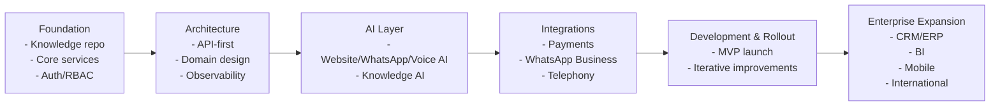

# 02_System_Architecture/00_SYSTEM_OVERVIEW.md

# Dayjoy Enterprise AI Platform — System Overview

> **Purpose (Verified):** This document is the master architectural overview of the Dayjoy Enterprise AI Platform, describing what the system is, why it exists, how it is organized, how major subsystems interact, and how it delivers business value.
>
> **Audience (Verified):** Architects, developers, AI engineers, business stakeholders, operations, support teams, and AI coding assistants.
>
> **Scope:** High-level architecture only — no low-level implementation, APIs, database schemas, or code.

---

## Table of Contents

1. [Executive Summary](#1-executive-summary)
2. [System Vision](#2-system-vision)
3. [System Scope](#3-system-scope)
4. [Platform Overview](#4-platform-overview)
5. [High-Level Platform Capabilities](#5-high-level-platform-capabilities)
6. [Stakeholders](#6-stakeholders)
7. [System Context](#7-system-context)
8. [Major Subsystems](#8-major-subsystems)
9. [AI Ecosystem Overview](#9-ai-ecosystem-overview)
10. [Enterprise Knowledge Flow](#10-enterprise-knowledge-flow)
11. [Communication Channels](#11-communication-channels)
12. [Core Business Workflows](#12-core-business-workflows)
13. [Non-Functional Goals](#13-non-functional-goals)
14. [Project Phases](#14-project-phases)
15. [Architecture Documentation Map](#15-architecture-documentation-map)
16. [Risks & Assumptions](#16-risks--assumptions)
17. [Glossary](#17-glossary)
18. [Summary](#18-summary)

---

## 1. Executive Summary

### 1.1 Platform Purpose (Verified)

The Dayjoy Enterprise AI Platform is being designed as a **unified, AI-first, multi-channel enterprise system** that supports Dayjoy’s customers, distributors, employees, and management across support, sales, training, operations, and knowledge management.[Project_Context/00_MASTER_CONTEXT.md][Project_Context/04_AI_VISION.md]

### 1.2 Business Objectives (Verified)

- Improve **customer and distributor experience** via fast, accurate, multi-channel support.[07_Customer_Journey.md][10_Pain_Points.md]
- Increase **sales and distributor productivity** via AI-assisted product discovery, recommendations, and business coaching.[11_AI_Opportunities.md]
- Reduce **support and operational costs** via self-service AI, automation, and better knowledge access.[08_Business_Processes.md][10_Pain_Points.md]
- Strengthen **governance and compliance** via centralized knowledge, policies, and AI guardrails.[05_Policies.md][08_CONSTRAINTS.md]

### 1.3 Enterprise Vision (Recommendations)

Architecturally, the platform is envisioned as a **modular, domain-driven, event-driven, cloud-native, AI-first ecosystem** where each business domain is supported by dedicated services, AI agents, and knowledge flows, integrated via APIs and events.[Project_Context/12_ARCHITECTURE_PRINCIPLES.md]

### 1.4 AI-First Strategy (Verified + Recommendations)

- **Verified:** AI is a core focus; the project aims to deploy Voice AI, WhatsApp AI, Website AI, Internal AI, and Knowledge AI as core capabilities.[Project_Context/04_AI_VISION.md][Project_Context/06_FEATURE_WISHLIST.md]
- **Recommendation:** All future features and services should be designed with AI orchestration, RAG compatibility, and tool-based AI interactions as first-class architectural concerns.

### 1.5 Expected Business Impact (Recommendations)

- Higher **self-service resolution** for customers and distributors.
- Faster **decision-making** for employees and management.
- Improved **revenue, retention, and network growth** driven by AI-assisted experiences.[Project_Context/15_SUCCESS_METRICS.md]

---

## 2. System Vision

### 2.1 Why the Platform Is Being Built (Verified)

Dayjoy operates a consumer and distributor network that spans products, direct selling, policies, and complex compensation structures, with pain points around support, training, knowledge access, and operational efficiency.[02_Business_Model.md][04_Distributor_System.md][10_Pain_Points.md]

The platform is being built to:

- Reduce friction in **customer and distributor journeys**.
- Make **policies, product knowledge, and compensation rules** easily accessible.
- Enable **scalable support and operations** without linear headcount growth.

### 2.2 Problems It Solves (Verified + Recommendations)

- **Verified:**
  - Repetitive support queries about orders, returns, refunds, policies.[06_FAQs.md][10_Pain_Points.md]
  - Distributor confusion about compensation, training, and business processes.[04_Distributor_System.md][10_Pain_Points.md]
  - Fragmented internal knowledge and processes.[08_Business_Processes.md]

- **Recommendations:**
  - Provide a single AI layer that understands Dayjoy’s business and can support all personas (customers, distributors, employees, management).
  - Replace fragmented, manual processes with orchestrated, AI-assisted workflows.

### 2.3 Long-Term Goals (Recommendations)

- Become the **central digital nervous system** for Dayjoy’s business operations and experiences.
- Support **international expansion**, new product lines, and new channels with minimal rework.[Project_Context/12_ARCHITECTURE_PRINCIPLES.md][Project_Context/14_FUTURE_INTEGRATIONS.md]
- Enable **continuous improvement** via analytics, AI evaluation, and knowledge audits.[Project_Context/15_SUCCESS_METRICS.md]

### 2.4 Success Expectations (Verified + Recommendations)

- **Verified:** Success is measured by business KPIs, CX metrics, distributor success, employee productivity, AI quality, and financial metrics.[Project_Context/15_SUCCESS_METRICS.md]
- **Recommendations:** Use a balanced scorecard across business, user experience, operations, AI performance, and financial outcomes.

### 2.5 Digital Transformation Strategy (Recommendations)

The platform is a key driver of Dayjoy’s digital transformation, shifting from manual, document-centric operations to **API-driven, AI-orchestrated, knowledge-first workflows**, with clear governance and security.[Project_Context/08_CONSTRAINTS.md][Project_Context/12_ARCHITECTURE_PRINCIPLES.md]

---

## 3. System Scope

### 3.1 In Scope (Verified + Recommendations)

**Version 1 (MVP) — Verified from features and processes:**[Project_Context/06_FEATURE_WISHLIST.md][Project_Context/07_BUSINESS_PROCESSES.md]

- AI-powered **customer support** via Website AI, WhatsApp AI, Voice AI.
- **Product discovery and recommendations** for customers and distributors.
- **Order status, returns, and refund support** (querying existing systems).
- **Distributor onboarding, KYC guidance, and compensation explanation**.
- **Internal knowledge search** for employees (policies, SOPs, product knowledge).
- **Central knowledge platform** for RAG (docs, metadata, versioning).
- **Admin dashboard** for user, role, knowledge, and AI configuration.
- **Core analytics** for AI performance, knowledge usage, and basic business metrics.

**Planned Phases (Recommendations):**

- Deeper **ERP, CRM, and marketing integrations**.[Project_Context/14_FUTURE_INTEGRATIONS.md]
- Expanded **automation workflows** (n8n, background jobs).
- Enhanced **BI and predictive analytics**.

### 3.2 Out of Scope (Current Project)

**Verified / Explicitly Out-of-Scope Now:**

- Building a full ERP or CRM from scratch (focus is on integration with existing/future systems).[Project_Context/08_CONSTRAINTS.md][Project_Context/14_FUTURE_INTEGRATIONS.md]
- Direct consumer mobile apps as primary channel (mobile-first web and WhatsApp are prioritized; native apps are future considerations).[Project_Context/14_FUTURE_INTEGRATIONS.md]
- AI making **final financial/legal decisions** without human approval (AI can recommend, humans approve).[Project_Context/13_AI_BEHAVIOR.md]
- Multi-tenant support for other companies (platform is Dayjoy-only).[Project_Context/08_CONSTRAINTS.md]

**Recommendations — Not in current scope:**

- Full-fledged marketplace integrations.
- IoT/wearable integrations.
- Fully autonomous operations without human oversight.

---

## 4. Platform Overview

### 4.1 Major Platform Domains (Verified + Recommendations)

Based on research and architecture documents, the platform is organized into the following **high-level domains**:[Project_Context/05_PERSONAS.md][Project_Context/06_FEATURE_WISHLIST.md][Project_Context/12_ARCHITECTURE_PRINCIPLES.md]

1. **Customer Experience Domain (Verified)**
   - Supports customers and prospects with product discovery, order support, returns/refunds, FAQs, and feedback.

2. **Distributor Management Domain (Verified)**
   - Supports distributor onboarding, KYC, business performance visibility, compensation understanding, training, and support.

3. **Product Knowledge Domain (Verified)**
   - Centralizes product information, benefits, usage, certifications, and related FAQs.

4. **AI Channels & Assistants Domain (Verified + Recommendations)**
   - **Voice AI:** Phone-based support and automation.
   - **WhatsApp AI:** Chat-based support, notifications.
   - **Website AI:** Web chatbot, smart navigation, product assistance.
   - **Internal AI:** Employee-facing assistant for knowledge and processes.
   - **Admin AI:** Assist admins with configuration and governance.

5. **Knowledge Platform Domain (Verified)**
   - Central knowledge repository, RAG integration, metadata, validation, and governance.

6. **Analytics & Reporting Domain (Verified + Recommendations)**
   - Provides dashboards and insights for business, AI performance, knowledge usage, and operations.[Project_Context/15_SUCCESS_METRICS.md]

7. **Administration & Security Domain (Verified)**
   - User management, role management, permissions, audit logging, AI configuration, and monitoring.[Project_Context/08_CONSTRAINTS.md]

8. **Automation & Workflow Domain (Recommendations)**
   - Orchestrates business workflows (order flows, refunds, notifications, approvals) via n8n/Celery and event-driven patterns.[Project_Context/07_BUSINESS_PROCESSES.md][Project_Context/14_FUTURE_INTEGRATIONS.md]

---

## 5. High-Level Platform Capabilities

### 5.1 Primary Capabilities (Verified)

Without detailing implementation, the platform aims to provide:[Project_Context/06_FEATURE_WISHLIST.md][Project_Context/07_BUSINESS_PROCESSES.md][Project_Context/11_AI_BEHAVIOR.md]

- **AI-Powered Customer & Distributor Support:**
  - Website, WhatsApp, and Voice AI answering FAQs, handling order queries, and guiding returns/refunds.

- **Enterprise Knowledge Retrieval:**
  - Unified search and RAG-based access to policies, product docs, FAQs, SOPs, and business rules.

- **Voice Automation:**
  - Automated call handling for common queries, with human handoff for complex cases.

- **WhatsApp Assistance:**
  - Structured support, order updates, distributor support, and notifications.

- **Workflow Automation:**
  - Automated processes for notifications, approvals, and routine operations (e.g., training reminders, payout notices).

- **Reporting & Business Intelligence (Recommendations):**
  - Dashboards for business KPIs, AI metrics, support metrics, and distributor performance.

- **AI Content Assistance (Recommendations):**
  - Drafting marketing content, product descriptions, and internal documentation under governance.

---

## 6. Stakeholders

### 6.1 Stakeholder Overview (Verified)

| Stakeholder | Responsibilities | Objectives | Expected Benefits | Primary Interactions |
|---|---|---|---|---|
| Customers | Purchase and use products, seek support | Find products easily, get fast support | Faster answers, transparent policies, reliable delivery | Website, WhatsApp, Voice |
| Distributors | Build business network, sell products | Understand compensation, grow business, support customers | Clear business guidance, training, visibility, support | Distributor portal, WhatsApp, Voice, internal tools |
| Employees | Support, sales, marketing, operations | Resolve cases faster, access knowledge | Time savings, reduced effort, better tools | Internal AI, dashboards, admin portals |
| Administrators | Manage users, permissions, knowledge, AI settings | Governance, compliance, stability | Central control, audit trails, configuration tools | Admin dashboard, Admin AI |
| Management/Executives | Strategic decisions, oversight | Increase revenue, reduce cost, manage risk | Analytics, executive summaries, alerts | Management dashboards, Analytics AI |
| AI Systems | Assist human users and automate workflows | Provide accurate, safe, helpful assistance | Shared knowledge, orchestration, governance | Interact via tools, APIs, events |

---

## 7. System Context

### 7.1 Narrative System Context (Verified + Recommendations)

The Dayjoy Enterprise AI Platform sits at the center of multiple **user groups**, **internal services**, **external systems**, **AI providers**, and **communication channels**.[Project_Context/09_TECH_STACK.md][Project_Context/14_FUTURE_INTEGRATIONS.md]

- **Users:** Customers, distributors, employees, administrators, management.
- **Channels:** Website, WhatsApp, Voice, internal portal, admin dashboard.
- **Internal Services:** Order, Distributor, Product, Knowledge, Auth/RBAC, Automation, Analytics.
- **External Services:** WhatsApp Business API, Vapi, payment gateways, email/SMS providers, ERP/CRM (future).
- **AI Providers:** LLMs, embeddings, STT/TTS providers.
- **Knowledge Systems:** Git-based documentation, knowledge service, RAG infrastructure.

### 7.2 System Context Diagram (Mermaid)

```mermaid
flowchart TB
    subgraph Users
        CUST[Customers]
        DIST[Distributors]
        EMP[Employees]
        ADMIN[Administrators]
        MGMT[Management]
    end

    subgraph Channels
        WEB[Website]
        WA[WhatsApp]
        VOICE[Voice Calls]
        INT[Internal Portal]
        ADM[Admin Dashboard]
    end

    subgraph Dayjoy_AI_Platform
        subgraph AI_Layer
            WAI[Website AI]
            WAAI[WhatsApp AI]
            VAI[Voice AI]
            IAI[Internal AI]
            KAI[Knowledge AI]
            SAI[Sales AI]
            MAI[Marketing AI]
            AAI[Analytics AI]
            AADMIN[Admin AI]
        end
        subgraph Core_Services
            AUTH[Auth & RBAC]
            ORD[Order Service]
            DISTSRV[Distributor Service]
            PROD[Product Service]
            KB[Knowledge Service]
            AUTO[Automation/Workflow]
            ANL[Analytics Service]
        end
    end

    subgraph External_Systems
        WABA[WhatsApp Business API]
        VAPI[Vapi Voice]
        PAY[Payment Gateway]
        EMAILP[Email Provider]
        ERP[ERP/Inventory (Future)]
        CRM[CRM (Future)]
        LLM[LLM Providers]
    end

    CUST --> WEB
    CUST --> WA
    CUST --> VOICE
    DIST --> WEB
    DIST --> WA
    DIST --> VOICE
    EMP --> INT
    ADMIN --> ADM
    MGMT --> INT

    WEB --> WAI
    WA --> WAAI
    VOICE --> VAI
    INT --> IAI
    ADM --> AADMIN

    WAI --> Core_Services
    WAAI --> Core_Services
    VAI --> Core_Services
    IAI --> Core_Services

    KAI --> KB

    Core_Services --> AUTH
    Core_Services --> ORD
    Core_Services --> DISTSRV
    Core_Services --> PROD
    Core_Services --> KB
    Core_Services --> AUTO
    Core_Services --> ANL

    WAAI --> WABA
    VAI --> VAPI
    PAY --> ORD
    EMAILP --> AUTO
    Core_Services --> ERP
    Core_Services --> CRM
    AI_Layer --> LLM
```

---

## 8. Major Subsystems

Below is a **high-level overview** of major subsystems. Internal implementation details are intentionally omitted.

### 8.1 Customer Experience Subsystem

- **Purpose (Verified):** Support customers and prospects across product discovery, orders, returns, and support.[07_Customer_Journey.md]
- **Responsibilities:**
  - Present website and WhatsApp experiences.
  - Route queries to AI and human support.
- **Main Users:** Customers, prospects.
- **Related Documents:** `Project_Context/05_PERSONAS.md`, `Project_Context/06_FEATURE_WISHLIST.md`, `Project_Context/07_BUSINESS_PROCESSES.md`.
- **Planned Architecture Document:** `02_System_Architecture/01_CX_ARCHITECTURE.md` (future).

### 8.2 Distributor Management Subsystem

- **Purpose (Verified):** Support distributors from registration to business growth and compensation.[04_Distributor_System.md]
- **Responsibilities:**
  - Enable registration, KYC guidance.
  - Provide dashboards for performance and earnings.
- **Main Users:** Distributors, distributor management.
- **Related Documents:** `04_Distributor_System.md`, `Project_Context/05_PERSONAS.md`, `Project_Context/07_BUSINESS_PROCESSES.md`.
- **Planned Architecture Document:** `02_System_Architecture/02_DISTRIBUTOR_ARCHITECTURE.md` (future).

### 8.3 Product Knowledge Subsystem

- **Purpose (Verified):** Centralize product information for customers, distributors, and internal staff.[03_Product_Research.md]
- **Responsibilities:**
  - Provide structured product knowledge.
  - Feed AI and search systems.
- **Main Users:** Customers, distributors, employees, AI services.
- **Related Documents:** `03_Product_Research.md`, `06_FAQs.md`, `Project_Context/11_DOCUMENTATION_RULES.md`.
- **Planned Architecture Document:** `02_System_Architecture/03_PRODUCT_KNOWLEDGE_ARCHITECTURE.md` (future).

### 8.4 AI Channels & Assistants Subsystem

- **Purpose (Verified):** Provide AI interfaces across voice, WhatsApp, web, and internal portals.[Project_Context/04_AI_VISION.md][Project_Context/13_AI_BEHAVIOR.md]
- **Responsibilities:**
  - Handle conversations, tool calls, and handoffs.
- **Main Users:** All user personas.
- **Related Documents:** `Project_Context/04_AI_VISION.md`, `Project_Context/13_AI_BEHAVIOR.md`, `Project_Context/06_FEATURE_WISHLIST.md`.
- **Planned Architecture Document:** `02_System_Architecture/04_AI_LAYER_OVERVIEW.md` (future).

### 8.5 Knowledge Platform Subsystem

- **Purpose (Verified):** Manage Dayjoy’s enterprise knowledge for RAG and search.[Project_Context/11_DOCUMENTATION_RULES.md][Project_Context/12_ARCHITECTURE_PRINCIPLES.md]
- **Responsibilities:**
  - Ingest, validate, store, and serve knowledge.
- **Main Users:** AI services, internal users.
- **Related Documents:** `Project_Context/11_DOCUMENTATION_RULES.md`, `Project_Context/06_FEATURE_WISHLIST.md`, `Project_Context/07_BUSINESS_PROCESSES.md`.
- **Planned Architecture Document:** `02_System_Architecture/05_KNOWLEDGE_PLATFORM_ARCHITECTURE.md` (future).

### 8.6 Analytics & Reporting Subsystem

- **Purpose (Verified + Recommendations):** Provide dashboards and insights across business, AI, operations, and knowledge.[Project_Context/15_SUCCESS_METRICS.md]
- **Responsibilities:**
  - Aggregate metrics, visualize KPIs.
- **Main Users:** Management, operations, AI teams.
- **Related Documents:** `Project_Context/15_SUCCESS_METRICS.md`, `Project_Context/14_FUTURE_INTEGRATIONS.md`.
- **Planned Architecture Document:** `02_System_Architecture/06_ANALYTICS_ARCHITECTURE.md` (future).

### 8.7 Administration & Security Subsystem

- **Purpose (Verified):** Manage identities, roles, permissions, logs, configuration, and monitoring.[Project_Context/08_CONSTRAINTS.md][Project_Context/12_ARCHITECTURE_PRINCIPLES.md]
- **Responsibilities:**
  - RBAC, audit, system health.
- **Main Users:** Admins, IT.
- **Related Documents:** `Project_Context/08_CONSTRAINTS.md`, `Project_Context/10_CODING_STANDARDS.md`.
- **Planned Architecture Document:** `02_System_Architecture/07_ADMIN_SECURITY_ARCHITECTURE.md` (future).

### 8.8 Automation & Workflow Subsystem

- **Purpose (Recommendations):** Orchestrate business workflows and automations.[Project_Context/07_BUSINESS_PROCESSES.md][Project_Context/14_FUTURE_INTEGRATIONS.md]
- **Responsibilities:**
  - Run event-driven workflows.
- **Main Users:** Internal operations, AI orchestration.
- **Related Documents:** `Project_Context/07_BUSINESS_PROCESSES.md`, `Project_Context/14_FUTURE_INTEGRATIONS.md`.
- **Planned Architecture Document:** `02_System_Architecture/08_AUTOMATION_ARCHITECTURE.md` (future).

---

## 9. AI Ecosystem Overview

### 9.1 AI Systems (Verified)

The platform includes multiple AI systems:[Project_Context/04_AI_VISION.md][Project_Context/13_AI_BEHAVIOR.md]

- **Website AI:** Web chatbot for product and support.
- **WhatsApp AI:** Chat-based support and workflows.
- **Voice AI:** Call-handling assistant.
- **Knowledge AI:** RAG-based retrieval and knowledge grounding.
- **Sales AI:** Sales support and recommendations.
- **Marketing AI:** Content assistance and campaign support.
- **Analytics AI:** Summaries and insights.
- **Admin AI:** Admin and configuration assistance.
- **Internal AI:** Employee-facing assistant.

### 9.2 AI Responsibilities (Verified + Recommendations)

- Understand user intent across personas and channels.
- Retrieve and ground information via the knowledge platform.
- Call tools and APIs to act (e.g., lookup orders, create workflows).
- Coordinate between agents (e.g., Website AI ↔ Sales AI ↔ Knowledge AI).[Project_Context/13_AI_BEHAVIOR.md]

### 9.3 High-Level AI Interaction (Mermaid)

```mermaid
flowchart LR
    USER[User] --> CHAN[Channel (Web/WhatsApp/Voice/Internal)]
    CHAN --> AGENT[Primary AI Agent]
    AGENT --> KAI[Knowledge AI]
    AGENT --> TOOLS[Tool/Function Layer]
    TOOLS --> CORE[Core Services]
    AGENT --> OTHER[Other AI Agents]
    KAI --> KB[Knowledge Platform]
```

---

## 10. Enterprise Knowledge Flow

### 10.1 Knowledge Lifecycle (Verified + Recommendations)

High-level flow:[Project_Context/11_DOCUMENTATION_RULES.md][Project_Context/12_ARCHITECTURE_PRINCIPLES.md]

1. **Source Documents (Verified):**
   - Policies, product docs, distributor system docs, FAQs, SOPs, research, decisions.
   - Stored primarily as Markdown and related files in a Git-based repository.

2. **Validation (Verified + Recommendations):**
   - Content is reviewed, approved, and versioned.
   - Labeled as VERIFIED / PARTIALLY VERIFIED / UNKNOWN.[Project_Context/02_KNOWN_FACTS.md][Project_Context/03_UNKNOWN_INFORMATION.md]

3. **Knowledge Repository (Verified):**
   - Central knowledge platform indexes and organizes documents.

4. **Retrieval (Verified):**
   - Knowledge AI and other agents use retrieval to fetch relevant content (RAG).

5. **AI Responses (Verified):**
   - AI uses retrieved knowledge to answer queries, always avoiding fabrication.[Project_Context/13_AI_BEHAVIOR.md]

6. **Continuous Improvement (Recommendations):**
   - Feedback and unknown queries trigger documentation and knowledge updates.[Project_Context/15_SUCCESS_METRICS.md]

---

## 11. Communication Channels

### 11.1 Supported Channels (Verified)

- **Website (Verified):**
  - Main digital touchpoint for customers and distributors.
  - Hosts Website AI chatbot and navigation assistance.[Project_Context/04_AI_VISION.md]

- **WhatsApp (Verified):**
  - Key support and engagement channel.
  - Used for product queries, order updates, distributor support.

- **Voice Calls (Verified):**
  - Phone support channel via Voice AI and human agents.

- **Internal Portal (Recommendations):**
  - Employee-facing portal for internal AI, knowledge search, SOPs.

- **Admin Dashboard (Verified):**
  - Admin-facing portal for configuration, user/role management, knowledge governance.[Project_Context/06_FEATURE_WISHLIST.md]

- **Future Mobile App (Recommendations):**
  - Native apps for deeper engagement; out of current scope but planned in future vision.

### 11.2 Interaction Summary

Each channel delegates complex reasoning and knowledge retrieval to AI agents and core services, providing consistent behavior across channels with channel-appropriate interaction styles.[Project_Context/13_AI_BEHAVIOR.md]

---

## 12. Core Business Workflows

### 12.1 High-Level Workflow Summary (Verified)

The platform supports key workflows documented in `Project_Context/07_BUSINESS_PROCESSES.md`.

**Customer Workflows (Verified):**

- Product Discovery.
- Product Inquiry.
- AI Recommendation.
- Order Placement.
- Payment, Confirmation, Shipping, Delivery.
- Return & Refund Requests.
- Complaint Resolution.
- Customer Support.

**Distributor Workflows (Verified):**

- Registration & KYC.
- Approval & Onboarding.
- Product Purchase.
- Commission Calculation & Payout.
- Training & Performance Tracking.
- Distributor Support.

**Employee Workflows (Verified):**

- Customer Support handling.
- Sales follow-up.
- Marketing campaign creation.
- Knowledge base update.
- Complaint escalation.

**Administrative Workflows (Verified):**

- User & Role Management.
- Knowledge Governance.
- Prompt Management.
- AI Configuration.
- Analytics & Audit Review.

### 12.2 Workflow References

For details, see:

- `Project_Context/07_BUSINESS_PROCESSES.md`
- `Project_Context/06_FEATURE_WISHLIST.md`
- `Project_Context/13_AI_BEHAVIOR.md`

---

## 13. Non-Functional Goals

### 13.1 Architectural Qualities (Verified + Recommendations)

Non-functional goals derived from constraints and architecture principles:[Project_Context/08_CONSTRAINTS.md][Project_Context/12_ARCHITECTURE_PRINCIPLES.md]

- **Scalability (Verified/Recommended):**
  - Horizontal scaling, stateless services, independent modules.

- **Security (Verified):**
  - Authentication, RBAC, encryption, secret management, auditability.

- **Reliability (Verified/Recommended):**
  - Graceful degradation, retry strategies, circuit breakers, failover, disaster recovery.

- **Performance (Recommended):**
  - Low-latency responses across APIs, AI, and channels.

- **Availability (Recommended):**
  - High uptime for core services and channels.

- **Maintainability (Recommended):**
  - Modular architecture, clear boundaries, coding standards, documentation rules.[Project_Context/10_CODING_STANDARDS.md][Project_Context/11_DOCUMENTATION_RULES.md]

- **Extensibility (Recommended):**
  - Ability to add new domains, channels, AI agents, integrations.

- **Observability (Verified/Recommended):**
  - Logging, metrics, tracing, monitoring, AI observability.[Project_Context/12_ARCHITECTURE_PRINCIPLES.md]

---

## 14. Project Phases

### 14.1 High-Level Roadmap (Recommendations)



### 14.2 Phase Narrative (Recommendations)

1. **Foundation:**
   - Establish documentation, knowledge platform, auth, core services.

2. **Architecture:**
   - Define domain boundaries, APIs, non-functional requirements.

3. **AI Layer:**
   - Deploy core AI agents (Website, WhatsApp, Voice, Knowledge, Internal).

4. **Integrations:**
   - Integrate payments, WhatsApp Business, telephony, analytics.

5. **Development & Rollout:**
   - MVP launch, gather feedback, iterate.

6. **Enterprise Expansion:**
   - Add CRM/ERP, BI, advanced automation, mobile, and international capabilities.

---

## 15. Architecture Documentation Map

### 15.1 System Architecture Folder Documents

| Document | Purpose | Status |
|---|---|---|
| `02_System_Architecture/00_SYSTEM_OVERVIEW.md` | High-level system overview (this document) | Completed |
| `02_System_Architecture/01_CX_ARCHITECTURE.md` | Customer Experience architecture | Planned |
| `02_System_Architecture/02_DISTRIBUTOR_ARCHITECTURE.md` | Distributor domain architecture | Planned |
| `02_System_Architecture/03_PRODUCT_KNOWLEDGE_ARCHITECTURE.md` | Product knowledge subsystem | Planned |
| `02_System_Architecture/04_AI_LAYER_OVERVIEW.md` | AI ecosystem architecture | Planned |
| `02_System_Architecture/05_KNOWLEDGE_PLATFORM_ARCHITECTURE.md` | Knowledge platform and RAG | Planned |
| `02_System_Architecture/06_ANALYTICS_ARCHITECTURE.md` | Analytics and BI | Planned |
| `02_System_Architecture/07_ADMIN_SECURITY_ARCHITECTURE.md` | Admin, security, governance | Planned |
| `02_System_Architecture/08_AUTOMATION_ARCHITECTURE.md` | Automation and workflow orchestration | Planned |

### 15.2 Cross-References

- `Project_Context/09_TECH_STACK.md` — Technology stack.
- `Project_Context/12_ARCHITECTURE_PRINCIPLES.md` — Architecture principles.
- `Project_Context/13_AI_BEHAVIOR.md` — AI behavior.
- `Project_Context/11_DOCUMENTATION_RULES.md` — Documentation standards.
- `Project_Context/14_FUTURE_INTEGRATIONS.md` — Integration strategy.

---

## 16. Risks & Assumptions

### 16.1 Verified Assumptions

- Platform is **Dayjoy-only**, not multi-tenant.[Project_Context/08_CONSTRAINTS.md]
- AI must **not fabricate business facts** and must use verified knowledge.[Project_Context/02_KNOWN_FACTS.md][Project_Context/13_AI_BEHAVIOR.md]
- Distributor compensation and policies are **core business rules** that must be reflected accurately.[04_Distributor_System.md][05_Policies.md]

### 16.2 Business Risks (Recommendations)

| Risk | Description | Mitigation |
|---|---|---|
| Adoption risk | AI not adopted by distributors/employees | Strong training, gradual rollout, measure adoption (MET-EMP-004) |
| Misalignment with strategy | Platform features diverge from business priorities | Regular strategy reviews, KPI governance |

### 16.3 Technical Risks (Recommendations)

| Risk | Description | Mitigation |
|---|---|---|
| Integration complexity | ERP/CRM integrations more complex than expected | Phased integrations, API-first design |
| Scalability issues | High load from voice and WhatsApp | Horizontal scaling, stateless services, caching |

### 16.4 AI Risks (Verified + Recommendations)

| Risk | Description | Mitigation |
|---|---|---|
| Hallucination | AI invents facts | RAG-first design, evaluation, guardrails.[Project_Context/13_AI_BEHAVIOR.md] |
| Safety | AI gives unsafe advice | AI guardrails, human oversight, escalation.[Project_Context/13_AI_BEHAVIOR.md] |

### 16.5 Operational Risks (Recommendations)

| Risk | Description | Mitigation |
|---|---|---|
| Support overload | Transition period increases support load | Pilot rollouts, dual support channels |
| Documentation gaps | Missing knowledge affects AI quality | Knowledge audits, gap tracking (unknowns).[Project_Context/03_UNKNOWN_INFORMATION.md] |

---

## 17. Glossary

| Term | Definition |
|---|---|
| AI Agent | A specialized AI system designed for a particular channel or domain (e.g., Voice AI, Website AI). |
| RAG (Retrieval-Augmented Generation) | Pattern where AI retrieves relevant knowledge and uses it to ground responses. |
| Domain | A business area (Customer, Distributor, Products, Knowledge, AI, Analytics). |
| RBAC | Role-Based Access Control for permissions. |
| Tier-1 Support | First-line, basic support questions and tasks. |
| Self-Service | Users resolving their issues via AI/knowledge without human agents. |
| Knowledge Base | Central repository of policies, FAQs, product docs, SOPs, etc. |
| Workflow | A sequence of steps to complete a business process (e.g., refund). |
| KPI | Key Performance Indicator used to measure success. |
| Persona | A defined user type with specific goals and behaviors (Customer, Distributor, Employee, etc.). |
| Voice AI | AI system handling telephony-based conversations. |
| WhatsApp AI | AI system handling WhatsApp chat interactions. |
| Website AI | AI system embedded in Dayjoy’s website for chat and assistance. |
| Internal AI | AI assistant for employees. |
| Admin Dashboard | Interface for administrators to manage users, roles, knowledge, and AI settings. |
| Event-Driven | Architecture where events trigger downstream actions and workflows. |

---

## 18. Summary

The Dayjoy Enterprise AI Platform is an **AI-first, domain-driven, API-first, knowledge-centric ecosystem** designed to support Dayjoy’s customers, distributors, employees, and management across channels and workflows.[Project_Context/04_AI_VISION.md][Project_Context/12_ARCHITECTURE_PRINCIPLES.md]

Key architectural goals include **scalability, security, reliability, maintainability, extensibility, and observability**, with AI behavior and knowledge governance as first-class concerns.[Project_Context/08_CONSTRAINTS.md][Project_Context/13_AI_BEHAVIOR.md]

This document should be read before diving into more detailed architecture documents in `02_System_Architecture/`, as it establishes the **context, domains, subsystems, and non-functional goals** that guide all technical decisions.

**Next Documents (Recommended Reading Order):**

1. `Project_Context/12_ARCHITECTURE_PRINCIPLES.md` — Architectural principles.
2. `Project_Context/09_TECH_STACK.md` — Technology stack.
3. `Project_Context/13_AI_BEHAVIOR.md` — AI behavior.
4. `02_System_Architecture/04_AI_LAYER_OVERVIEW.md` (future) — AI ecosystem architecture.
5. `02_System_Architecture/05_KNOWLEDGE_PLATFORM_ARCHITECTURE.md` (future) — Knowledge platform.

---

**END OF DOCUMENT**