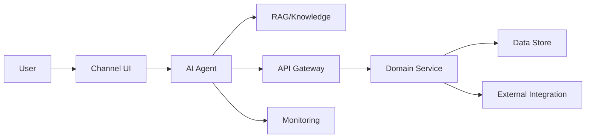
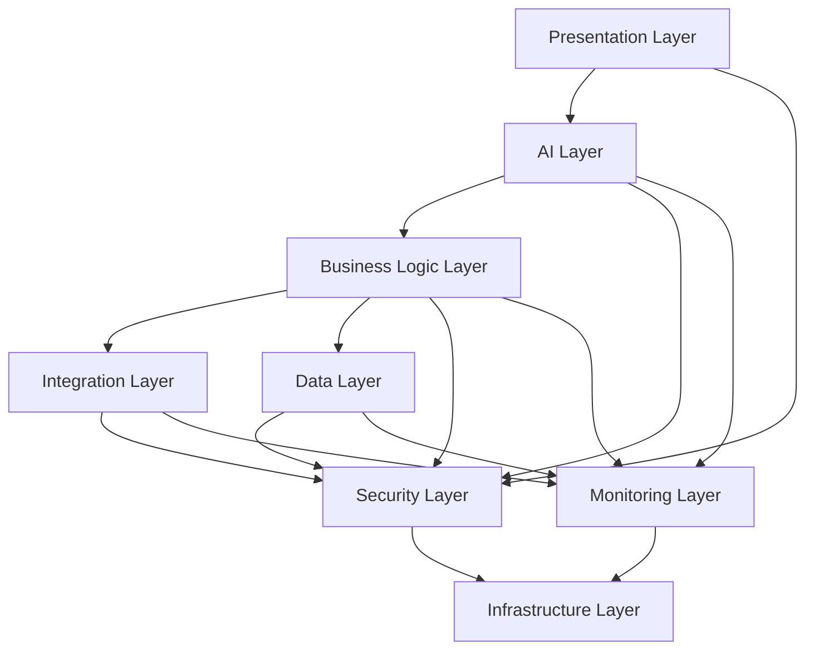
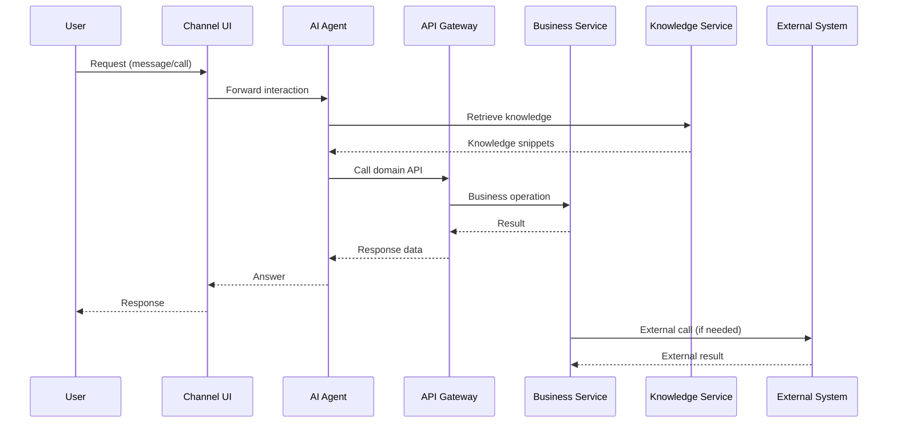
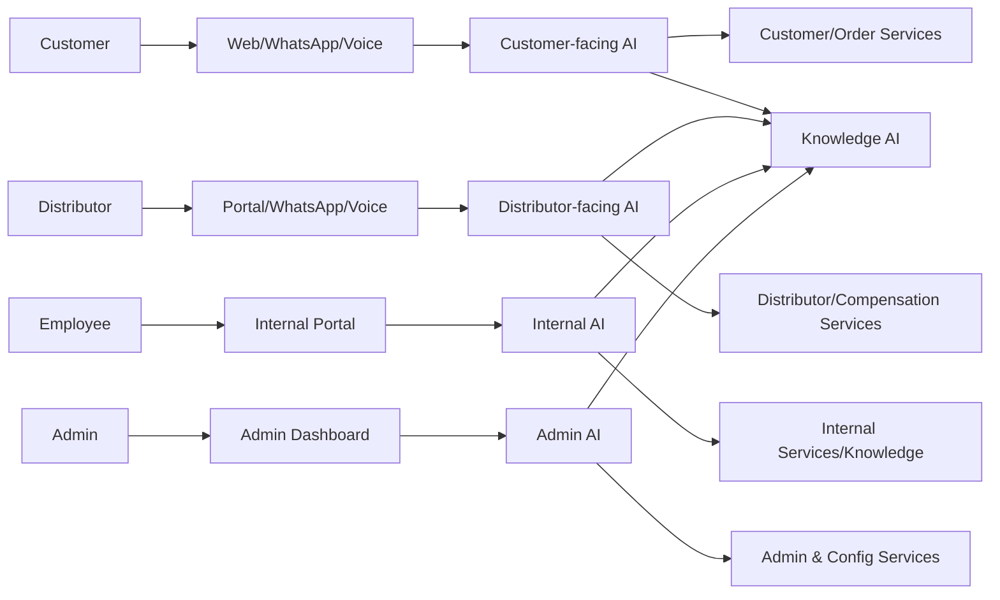

# 02_System_Architecture/01_HIGH_LEVEL_ARCHITECTURE.md

# Dayjoy Enterprise AI Platform — High-Level Architecture

> **Purpose:** Describe the overall architecture of the Dayjoy Enterprise AI Platform, identifying major layers, core components, and their interactions.
>
> **Scope:** High-level architecture only — no implementation details, code, or low-level API/database design.
>
> **Audience:** Solution architects, developers, AI engineers, DevOps, security teams, business stakeholders, and AI coding assistants.

---

## Table of Contents

1. [Platform Architecture Overview](#1-platform-architecture-overview)
2. [Architecture Layers](#2-architecture-layers)
3. [Major Components](#3-major-components)
4. [Component Communication](#4-component-communication)
5. [User Interaction Flow](#5-user-interaction-flow)
6. [External Systems](#6-external-systems)
7. [System Boundaries](#7-system-boundaries)
8. [Data Flow](#8-data-flow)
9. [Architecture Principles Applied](#9-architecture-principles-applied)
10. [Architecture Diagrams](#10-architecture-diagrams)

---

## 1. Platform Architecture Overview

The Dayjoy Enterprise AI Platform is a **multi-layer, AI-first, API-first, domain-driven system** that orchestrates customer, distributor, employee, and management experiences across Web, WhatsApp, Voice, internal portals, and admin dashboards.[Project_Context/00_MASTER_CONTEXT.md][02_System_Architecture/00_SYSTEM_OVERVIEW.md]

At a high level the platform consists of:

- **Presentation Layer:** User-facing interfaces (website, portals, chat widgets, voice entry points).
- **AI Layer:** Channel-specific and domain-specific AI agents orchestrating conversations and actions.
- **Business Logic Layer:** Domain services implementing Dayjoy’s business rules and workflows.
- **Integration Layer:** Connectors and gateways to external systems (telephony, messaging, payments, ERP/CRM, AI providers).
- **Data Layer:** Core data stores for transactional records, knowledge, and analytics.
- **Infrastructure Layer:** Cloud hosting, containerization, networking, and runtime services.
- **Monitoring Layer:** Logging, metrics, tracing, analytics.
- **Security Layer:** Authentication, authorization, secrets, audit, and policy enforcement.

The architecture is designed to support **multi-channel AI experiences** backed by **centralized knowledge**, **event-driven workflows**, and **scalable services**.[Project_Context/12_ARCHITECTURE_PRINCIPLES.md]

---

## 2. Architecture Layers

### 2.1 Presentation Layer

**Purpose:** Provide user-facing interfaces for all personas.

**Responsibilities:**

- Render web pages, dashboards, and portals.
- Host chat widgets and voice entry points.
- Manage user interactions and basic input validation.

**Core Components:**

- Website (public site).
- Distributor Portal (web-based interface for distributors).
- Internal Portal (employee tools and dashboards).
- Admin Dashboard (administration and governance UI).
- Voice Entry Points (phone numbers/IVR integrated via telephony).
- WhatsApp Conversations (conversation UI via WhatsApp client).

---

### 2.2 AI Layer

**Purpose:** Orchestrate AI-driven interactions and reasoning.

**Responsibilities:**

- Understand user intent and context.
- Retrieve knowledge and ground responses.
- Call tools and APIs to act.
- Coordinate multi-agent flows, handoffs, and escalations.

**Core Components:**

- Website AI.
- WhatsApp AI.
- Voice AI.
- Internal AI.
- Admin AI.
- Knowledge AI (RAG retrieval and grounding).
- Sales AI.
- Marketing AI.
- Analytics AI.

---

### 2.3 Business Logic Layer

**Purpose:** Implement Dayjoy’s core business rules and workflows.

**Responsibilities:**

- Handle domain logic for customers, distributors, products, orders, returns, refunds, and support.
- Execute compensation calculations, training flows, and performance tracking.
- Support approval workflows and administrative operations.

**Core Components:**

- Customer Service (customer domain logic).
- Distributor Service (distributor domain logic).
- Product Service (product catalog and attributes).
- Order Service (order lifecycle).
- Returns & Refund Service.
- Compensation/Commission Service.
- Support/Ticketing Service (high-level; may integrate with external tools).
- Admin & Configuration Service.

---

### 2.4 Integration Layer

**Purpose:** Connect internal services with external platforms and providers.

**Responsibilities:**

- Manage external APIs and webhooks.
- Abstract external systems for internal services/AI.
- Handle authentication, error handling, and rate limiting for external calls.

**Core Components:**

- API Gateway (entry point, routing, rate limiting).
- WhatsApp Business Integration.
- Voice Telephony Integration (Vapi/Twilio/Exotel).
- Payment Gateway Integration (e.g., Razorpay).
- Email/SMS Providers.
- ERP/Order/Inventory Integrations (future).
- CRM Integrations (future).
- Marketing Platform Integrations (Meta, Google Ads, email marketing; future).
- AI Provider Integrations (LLMs, embeddings, STT/TTS).

---

### 2.5 Data Layer

**Purpose:** Store and manage data for transactions, knowledge, and analytics.

**Responsibilities:**

- Persist core entities (customers, distributors, orders, products, policies).
- Store knowledge documents and metadata.
- Maintain embeddings and indexes for retrieval.

**Core Components:**

- Primary Relational Database (e.g., PostgreSQL) for transactional data.
- Knowledge Repository (Git-based content, metadata).
- Vector Store (e.g., PGVector) for embeddings.
- Object Storage (e.g., S3) for large documents/media.
- Analytics Data Stores (logs, metrics; internal).

---

### 2.6 Infrastructure Layer

**Purpose:** Provide runtime environment and platform services.

**Responsibilities:**

- Host microservices and AI components.
- Manage networking, load balancing, and scaling.
- Support CI/CD and deployment pipelines.

**Core Components:**

- Container Runtime (e.g., Docker).
- Orchestration (e.g., managed services, future Kubernetes/ECS).
- Load Balancers.
- CI/CD Pipelines.
- Cloud Infrastructure (compute, storage, networking).

---

### 2.7 Monitoring Layer

**Purpose:** Provide observability across the platform.

**Responsibilities:**

- Collect logs, metrics, and traces.
- Visualize performance and reliability.
- Support AI-specific monitoring.

**Core Components:**

- Logging Platform (e.g., ELK).
- Metrics Platform (e.g., Prometheus + Grafana).
- AI Observability Tools (e.g., AI evaluation dashboards).

---

### 2.8 Security Layer

**Purpose:** Enforce identity, access, and data protection across all layers.

**Responsibilities:**

- Authenticate users and services.
- Authorize actions based on roles and policies.
- Protect data via encryption and secure secret management.
- Log and audit security-relevant events.

**Core Components:**

- Authentication Service.
- RBAC/Policy Engine.
- Secrets Management.
- Audit Logging.
- Web Application Firewall (WAF) and API security.

---

## 3. Major Components

### 3.1 Component Table

| Component | Purpose | Responsibilities | Inputs | Outputs | Dependencies |
|---|---|---|---|---|---|
| Website | Public-facing web interface | Display content, host web chatbot, capture leads | HTTP requests, user input | Web pages, chat events | Website AI, API Gateway, Auth |
| Distributor Portal | Distributor self-service portal | Show performance, orders, training, earnings | Distributor login, profile data | Dashboards, actions (orders, training) | Auth, Distributor Service, Analytics |
| Admin Portal | Admin configuration UI | Manage users, roles, knowledge, AI config | Admin login, admin actions | Configuration changes, audit logs | Auth, Admin & Configuration Service |
| Internal Portal | Employee-facing UI | Knowledge search, SOP access, internal tools | Employee login, queries | Internal AI responses, actions | Auth, Knowledge Service, Internal AI |
| Website AI | Web chatbot | Handle customer/distributor queries, navigation | User messages, context | Answers, actions (API/tool calls) | Knowledge AI, Business Services, Tools |
| WhatsApp AI | WhatsApp chatbot | Handle chat support, notifications, workflows | WhatsApp messages, templates | Replies, workflow triggers | WhatsApp Business API, Knowledge AI, Business Services |
| Voice AI | Voice assistant | Handle calls, route, provide spoken answers | Audio, telephony events | Spoken responses, call transfers | Vapi/Telephony, Knowledge AI, Business Services |
| Internal AI | Employee assistant | Help employees find knowledge and perform tasks | Internal queries, context | Answers, internal actions | Knowledge Service, Business Services |
| Admin AI | Admin assistant | Help admins with config and governance | Admin queries | Suggestions, config actions | Admin Service, Knowledge Service |
| Knowledge Service | Knowledge management | Manage documents, metadata, validation | Docs, metadata, updates | Knowledge views for RAG/search | Knowledge Repository, Vector Store |
| RAG Service | Retrieval-augmented generation orchestrator | Retrieve relevant knowledge, provide context for AI | Query, embeddings | Ranked snippets, context | Knowledge Service, Vector Store |
| API Gateway | Unified API entry point | Route requests, enforce auth, rate limits | HTTP requests | Responses, routing to services | Auth, Business Services |
| Authentication Service | Identity and auth | Authenticate users, issue tokens | Credentials | Auth tokens | User directory, RBAC |
| Distributor Service | Distributor domain logic | Registration, KYC, performance, compensation | Requests from AI/UI | Distributor data, decisions | DB, ERP/Compensation logic |
| Customer Service | Customer domain logic | Profiles, orders, support flows | Requests from AI/UI | Customer data, decisions | DB, Order Service |
| Product Service | Product catalog logic | Manage products, attributes, categories | Product updates, queries | Product lists, details | DB, Knowledge Service |
| Order Service | Order lifecycle logic | Create, update, track orders | Order requests, payment results | Order status, events | DB, Payment Gateway, Logistics |
| Returns & Refund Service | Reverse logistics logic | Handle returns and refunds | Return/refund requests | Eligibility, status | DB, Finance, Order Service |
| Compensation Service | Incentive logic | Calculate commissions and payouts | BV/PV, distributor data | Incentive amounts | DB, Distributor Service, Finance |
| Analytics Service | Metrics and dashboards | Aggregate metrics, serve dashboards | Events, logs, data | KPI views, reports | Data stores, BI tools |
| Notification Service | Notification orchestration | Send email, SMS, WhatsApp, push | Events, messages | Notifications | Email/SMS providers, WhatsApp API |
| Automation Engine | Workflow orchestration | Run event-driven automations | Events, workflow definitions | Executed workflows, status | n8n, Business Services, API Gateway |

---

## 4. Component Communication

### 4.1 Communication Types

- **Internal APIs:**
  - Services communicate via RESTful APIs exposed behind the API Gateway.
- **External APIs:**
  - Integrations with WhatsApp Business, Vapi, payment gateways, email/SMS, ERP, CRM, AI providers.
- **Events:**
  - Core events like `OrderCreated`, `PaymentReceived`, `DistributorRegistered`, `KnowledgeUpdated`, `AIFeedbackSubmitted` propagate via an event bus or automation engine.[Project_Context/07_BUSINESS_PROCESSES.md][Project_Context/12_ARCHITECTURE_PRINCIPLES.md]
- **Webhooks:**
  - External systems (WhatsApp, payments, telephony) send webhooks to the platform for status updates.
- **AI Requests:**
  - AI agents send requests to the RAG Service, Business Services, and external providers.
- **Database Access:**
  - Business Services access the Data Layer via ORM/queries; AI agents do not directly access databases (they call services).

### 4.2 Communication Matrix (High-Level)

| From | To | Type | Purpose |
|---|---|---|---|
| Website | Website AI | Internal event / API | Forward user messages to AI |
| Website AI | API Gateway | Internal API | Call domain services and tools |
| WhatsApp AI | API Gateway | Internal API | Call domain services from chat flows |
| Voice AI | Vapi / Telephony | External API | Telephony and audio streaming |
| Voice AI | API Gateway | Internal API | Order status, knowledge, workflows |
| Internal AI | Knowledge Service | Internal API | Internal knowledge search |
| Knowledge AI | Knowledge Service | Internal API | Retrieve documents for RAG |
| Knowledge Service | Vector Store | Internal data access | Embedding queries and updates |
| API Gateway | Distributor Service | Internal API | Distributor operations |
| API Gateway | Order Service | Internal API | Order operations |
| API Gateway | Payment Gateway | External API | Process payments |
| Payment Gateway | API Gateway | Webhook | Payment status updates |
| WhatsApp Business API | WhatsApp AI/Webhook Handler | Webhook | Incoming messages and delivery receipts |
| Vapi | Voice AI Backend | Webhook/API | Call events and audio streams |
| Order Service | Automation Engine/Event Bus | Event | OrderCreated, OrderUpdated |
| Knowledge Service | Automation Engine/Event Bus | Event | KnowledgeUpdated |
| AI Agents | Analytics Service | Event/API | AI usage and evaluation logs |

---

## 5. User Interaction Flow

### 5.1 Customer Flow (High-Level)

1. Customer visits **Website** or contacts via **WhatsApp**/**Voice**.
2. Presentation Layer forwards the interaction to **Website AI**, **WhatsApp AI**, or **Voice AI**.
3. AI agent:
   - Identifies intent (e.g., "order status", "product info").
   - Calls **Knowledge AI** or **Business Services** via API Gateway.
4. Response is generated and returned via the original channel.
5. For complex cases, AI escalates to human support via ticketing or live chat.

### 5.2 Distributor Flow

1. Distributor logs into **Distributor Portal** or uses **WhatsApp/Voice**.
2. Interactions go to **Website AI**, **WhatsApp AI**, or **Internal AI** (depending on context).
3. AI and services handle registration, KYC, performance views, and compensation queries.
4. Training and coaching flows may be triggered via the Automation Engine.

### 5.3 Employee Flow

1. Employee accesses **Internal Portal**.
2. Queries go to **Internal AI**, which calls **Knowledge Service** and **Business Services**.
3. Internal AI provides SOP guidance, knowledge, and action suggestions.
4. Automation and analytics may be triggered for internal processes.

### 5.4 Administrator Flow

1. Admin uses **Admin Dashboard**.
2. Actions go to **Admin AI** or directly to **Admin & Configuration Service** via API Gateway.
3. Admin AI assists with configuration, user/role management, knowledge governance, and monitoring views.

---

## 6. External Systems

### 6.1 High-Level External Integrations (Architecture View)

- **WhatsApp Business Platform:** Messaging gateway for WhatsApp AI.
- **Vapi Voice Platform / Telephony Providers:** Telephony, STT/TTS, call routing and analytics for Voice AI.
- **Payment Gateways (e.g., Razorpay):** Secure payment processing.
- **Email Providers (e.g., SendGrid/SES):** Transactional emails.
- **SMS Providers:** OTPs and critical alerts.
- **Cloud Storage (e.g., S3):** Document and media storage for knowledge and assets.
- **AI Providers (OpenAI, Anthropic, embeddings, STT/TTS):** Core AI capabilities.
- **ERP/Inventory Systems (Future):** Order and inventory synchronization.
- **CRM Systems (Future):** Customer and distributor relationship management.
- **Marketing Platforms (Future):** Ads and campaigns.

These integrations are abstracted by the **Integration Layer** and governed by the **Security Layer**.[Project_Context/14_FUTURE_INTEGRATIONS.md]

---

## 7. System Boundaries

### 7.1 Internal Systems

- Dayjoy Enterprise AI Platform core:
  - Presentation Layer components (Website, Portals).
  - AI Layer agents.
  - Business Services.
  - Knowledge Service and repository.
  - Automation Engine.
  - Analytics Service.
  - Auth/RBAC.

### 7.2 External Systems

- WhatsApp Business API.
- Vapi and/or telephony providers.
- Payment gateways.
- Email/SMS providers.
- Cloud storage provider (if external).
- AI providers (LLMs, embeddings, STT/TTS).
- ERP/CRM/Marketing platforms.

### 7.3 Third-Party Services

- All external systems run outside Dayjoy’s direct control and are accessed via APIs/webhooks.
- The platform must handle failures, rate limits, and changes gracefully.

---

## 8. Data Flow

### 8.1 High-Level Data Flow Narrative

1. **User Request:**
   - User interacts via a channel (Web, WhatsApp, Voice, Portal).

2. **AI Processing:**
   - Channel forwards request to appropriate AI agent.
   - AI agent performs intent recognition and context analysis.[Project_Context/13_AI_BEHAVIOR.md]

3. **Knowledge Retrieval:**
   - AI calls Knowledge AI/RAG Service to fetch relevant knowledge.

4. **Business Logic:**
   - AI calls Business Services via API Gateway for live data or actions (orders, compensation, support tickets).

5. **Response Generation:**
   - AI combines knowledge and business data.
   - Formats response appropriately for the channel.

6. **Delivery & Logging:**
   - Response returned to the user.
   - Interaction logged for analytics, AI evaluation, and continuous improvement.[Project_Context/15_SUCCESS_METRICS.md]

---

## 9. Architecture Principles Applied

The high-level architecture applies the principles defined in `Project_Context/12_ARCHITECTURE_PRINCIPLES.md`.

### 9.1 Scalability

- **Horizontal scaling** of stateless services and AI agents.
- **Independent modules** for domains (Customer, Distributor, Products, Knowledge, AI, Analytics).
- **Queue-based processing** and background jobs for heavy tasks.[Project_Context/12_ARCHITECTURE_PRINCIPLES.md]

### 9.2 Modularity

- Domain-driven separation of services.
- Loose coupling via APIs and events.
- Shared utilities and services for cross-cutting concerns.

### 9.3 Security

- Auth & RBAC for all protected operations.
- Secure defaults, encryption, secret management, audit logging.[Project_Context/08_CONSTRAINTS.md]

### 9.4 Reliability

- Graceful degradation when dependencies fail.
- Retry strategies and circuit breakers.
- Health checks and failover for services.

### 9.5 Maintainability

- Clear layering and boundaries.
- Coding and documentation standards.[Project_Context/10_CODING_STANDARDS.md][Project_Context/11_DOCUMENTATION_RULES.md]

### 9.6 Extensibility

- Pluggable AI providers and channels.
- Integration layer for future ERP/CRM/marketing platforms.
- Architecture designed for new domains and features.

---

## 10. Architecture Diagrams

### 10.1 High-Level Architecture

```mermaid
flowchart TB
    subgraph Presentation_Layer
        WEB[Website]
        DISTPORT[Distributor Portal]
        INTPORT[Internal Portal]
        ADMPORT[Admin Dashboard]
        VOICECHAN[Voice Entry Points]
        WACHAN[WhatsApp Client]
    end

    subgraph AI_Layer
        WAI[Website AI]
        WAAI[WhatsApp AI]
        VAI[Voice AI]
        IAI[Internal AI]
        AADMIN[Admin AI]
        KAI[Knowledge AI]
        SAI[Sales AI]
        MAI[Marketing AI]
        AAI[Analytics AI]
    end

    subgraph Business_Logic_Layer
        CUSTSRV[Customer Service]
        DISTSRV[Distributor Service]
        PRODSRV[Product Service]
        ORDERSRV[Order Service]
        RETREF[Returns & Refund Service]
        COMPSRV[Compensation Service]
        ADMSRV[Admin & Config Service]
        SUPPSRV[Support/Ticketing]
    end

    subgraph Integration_Layer
        APIGW[API Gateway]
        WABA[WhatsApp Integration]
        VAPI[Vapi/Telephony]
        PAYINT[Payment Gateway Integration]
        EMAILINT[Email/SMS Integration]
        ERPINT[ERP Integration (Future)]
        CRMINT[CRM Integration (Future)]
        AIPROV[LLM/AI Providers]
    end

    subgraph Data_Layer
        DB[Transactional DB]
        KBREPO[Knowledge Repository]
        VECDB[Vector Store]
        OBJSTOR[Object Storage]
        ANLDATA[Analytics Data]
    end

    subgraph Infrastructure_Layer
        RUNTIME[Compute/Containers]
        LB[Load Balancers]
        CI[CI/CD Pipelines]
    end

    subgraph Monitoring_Layer
        LOGS[Logging]
        METRICS[Metrics]
        TRACES[Tracing]
    end

    subgraph Security_Layer
        AUTH[Auth Service]
        RBAC[RBAC/Policy Engine]
        SECRETS[Secrets Manager]
        AUDIT[Audit Logging]
    end

    WEB --> WAI
    DISTPORT --> WAI
    INTPORT --> IAI
    ADMPORT --> AADMIN
    VOICECHAN --> VAI
    WACHAN --> WAAI

    WAI --> APIGW
    WAAI --> APIGW
    VAI --> APIGW
    IAI --> APIGW
    AADMIN --> APIGW
    SAI --> APIGW
    MAI --> APIGW
    AAI --> APIGW

    WAI --> KAI
    WAAI --> KAI
    VAI --> KAI
    IAI --> KAI

    APIGW --> CUSTSRV
    APIGW --> DISTSRV
    APIGW --> PRODSRV
    APIGW --> ORDERSRV
    APIGW --> RETREF
    APIGW --> COMPSRV
    APIGW --> ADMSRV
    APIGW --> SUPPSRV

    CUSTSRV --> DB
    DISTSRV --> DB
    PRODSRV --> DB
    ORDERSRV --> DB
    RETREF --> DB
    COMPSRV --> DB

    KAI --> KBREPO
    KAI --> VECDB
    KBREPO --> OBJSTOR

    APIGW --> WABA
    APIGW --> VAPI
    APIGW --> PAYINT
    APIGW --> EMAILINT
    APIGW --> ERPINT
    APIGW --> CRMINT

    AI_Layer --> AIPROV

    Business_Logic_Layer --> LOGS
    AI_Layer --> LOGS
    Integration_Layer --> LOGS

    Business_Logic_Layer --> METRICS
    AI_Layer --> METRICS
    Integration_Layer --> METRICS

    Business_Logic_Layer --> TRACES
    AI_Layer --> TRACES

    APIGW --> AUTH
    APIGW --> RBAC
    APIGW --> AUDIT
    Business_Logic_Layer --> RBAC
    AI_Layer --> RBAC
    RUNTIME --> SECRETS
```

### 10.2 Component Relationship (Simplified)



### 10.3 Layered Architecture



### 10.4 System Communication



### 10.5 User Interaction Flow Diagram



---

**END OF DOCUMENT**