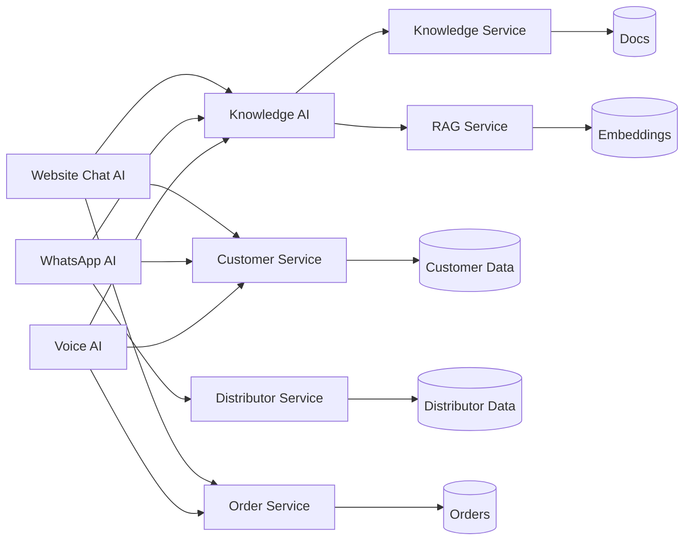
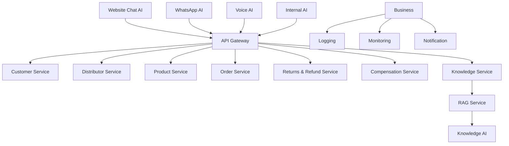
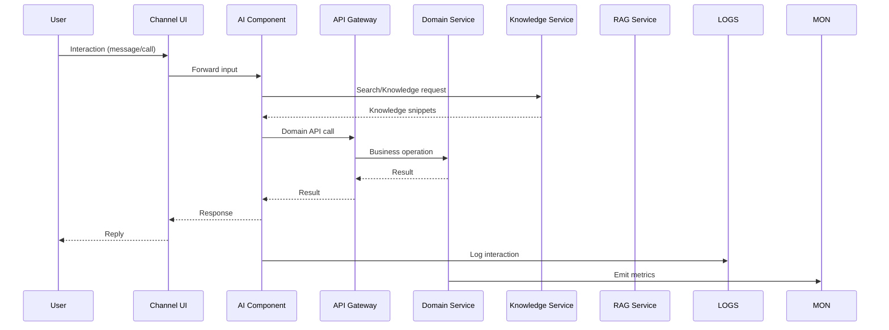

# 02_System_Architecture/02_COMPONENT_ARCHITECTURE.md

# Dayjoy Enterprise AI Platform — Component Architecture

> **Purpose:** Document the logical component architecture of the Dayjoy Enterprise AI Platform, defining each major component’s purpose, responsibilities, interfaces, dependencies, ownership, and interactions.
>
> **Scope:** Logical architecture only — no implementation code, low-level API schemas, or database details.
>
> **Audience:** Solution architects, developers, AI engineers, DevOps, security teams, and AI coding assistants.

---

## Table of Contents

1. [Component Catalog](#1-component-catalog)
2. [Component Specifications](#2-component-specifications)
3. [Component Relationships](#3-component-relationships)
4. [Component Boundaries](#4-component-boundaries)
5. [Shared Services](#5-shared-services)
6. [Component Lifecycle](#6-component-lifecycle)
7. [Component Communication](#7-component-communication)
8. [Cross-Cutting Components](#8-cross-cutting-components)
9. [Scalability Strategy](#9-scalability-strategy)
10. [Architecture Diagrams](#10-architecture-diagrams)

---

## 1. Component Catalog

This catalog lists the major logical components of the Dayjoy Enterprise AI Platform, aligned with the high-level architecture and system overview.[02_System_Architecture/00_SYSTEM_OVERVIEW.md][02_System_Architecture/01_HIGH_LEVEL_ARCHITECTURE.md]

### 1.1 Component List

| Component ID | Component Name | Purpose | Owner | Priority | Status |
|---|---|---|---|---|---|
| CMP-PRES-001 | Website | Public-facing web interface for customers and distributors | Product / Web Team | Critical | Planned/Existing |
| CMP-PRES-002 | Customer Portal | Authenticated portal for customers (where applicable) | Product / CX | High | Future |
| CMP-PRES-003 | Distributor Portal | Authenticated portal for distributors | Distributor Management / Product | Critical | Planned |
| CMP-PRES-004 | Internal Portal | Employee-facing UI for internal tools and AI | Operations / IT | High | Planned |
| CMP-PRES-005 | Admin Dashboard | Admin UI for configuration, users, roles, knowledge, AI | Admin / IT | Critical | Planned |
| CMP-AI-001 | Website Chat AI | AI agent for website chat | AI Team | Critical | Planned |
| CMP-AI-002 | WhatsApp AI | AI agent for WhatsApp interactions | AI Team | Critical | Planned |
| CMP-AI-003 | Voice AI | AI agent for voice calls via telephony | AI Team / Voice Ops | Critical | Planned |
| CMP-AI-004 | Internal AI | AI assistant for employees | AI Team / Operations | High | Planned |
| CMP-AI-005 | Admin AI | AI assistant for administrators | AI Team / Admin | High | Future |
| CMP-AI-006 | Knowledge AI | Retrieval and grounding AI for all agents | AI Team / Knowledge Team | Critical | Planned |
| CMP-AI-007 | Sales AI | AI for sales support (leads, recommendations) | Sales / AI Team | High | Future |
| CMP-AI-008 | Marketing AI | AI for marketing content and campaigns | Marketing / AI Team | High | Future |
| CMP-AI-009 | Analytics AI | AI for summaries and insights | Analytics / AI Team | High | Future |
| CMP-BIZ-001 | Authentication Service | Identity and authentication | Security / IT | Critical | Planned |
| CMP-BIZ-002 | User Management Service | User profiles and basic attributes | Admin / IT | Critical | Planned |
| CMP-BIZ-003 | Product Service | Product catalog and attributes | Product Team | Critical | Planned/Existing |
| CMP-BIZ-004 | Customer Service | Customer domain logic | CX / Product | Critical | Planned |
| CMP-BIZ-005 | Distributor Service | Distributor domain logic | Distributor Management | Critical | Existing/Planned |
| CMP-BIZ-006 | Order Service | Order lifecycle (create, update, track) | Operations / Product | Critical | Planned/Existing |
| CMP-BIZ-007 | Returns & Refund Service | Returns/refund logic | Operations / Finance | High | Planned |
| CMP-BIZ-008 | Compensation Service | Distributor incentive and commission logic | Finance / Distributor Management | Critical | Existing/Planned |
| CMP-BIZ-009 | Support/Ticketing Service | Support case and complaint management | Support / CX | High | Planned |
| CMP-BIZ-010 | Admin & Configuration Service | System and AI configuration management | Admin / IT | Critical | Planned |
| CMP-KB-001 | Knowledge Service | Enterprise knowledge management | Knowledge Team | Critical | Planned |
| CMP-KB-002 | RAG Service | Retrieval-augmented generation orchestration | AI Team / Knowledge Team | Critical | Planned |
| CMP-ANL-001 | Analytics Service | Metrics and dashboards | Analytics / Management | Critical | Planned |
| CMP-NOTIF-001 | Notification Service | Multi-channel notification orchestration | Operations / CX | Critical | Planned |
| CMP-AUTO-001 | Automation Engine | Workflow and event orchestration | Operations / IT | High | Planned |
| CMP-PROMPT-001 | Prompt Management Service | Prompt storage, versioning, governance | AI Governance | High | Planned |
| CMP-MEM-001 | Memory Service | Session and preference memory store | AI Team / Ops | High | Future |
| CMP-MON-001 | Monitoring Service | Central metrics and dashboards | DevOps / IT | Critical | Planned |
| CMP-LOG-001 | Logging Service | Central structured logging | DevOps / IT | Critical | Planned |
| CMP-CONF-001 | Configuration Service | Central configuration management | DevOps / IT | High | Planned |

---

## 2. Component Specifications

Below are high-level specifications for each component. Internal implementation details (frameworks, DB schemas) are not included.

### 2.1 Presentation Components

#### CMP-PRES-001 – Website

- **Purpose:** Public-facing digital entry point for customers and distributors.
- **Responsibilities:**
  - Render product information, policies, and marketing content.
  - Host website chat widget (Website Chat AI).
  - Capture leads and direct users to portals.
- **Inputs:**
  - HTTP requests, user interactions, content from Product Service and Knowledge Service.
- **Outputs:**
  - HTML/JSON responses, chat events, lead capture events.
- **Public Interfaces:**
  - Web URLs (customer-facing site).
  - Embedded chat interface events to Website Chat AI.
- **Dependencies:**
  - Website Chat AI, API Gateway, Authentication Service (for logged-in pages), Product Service, Knowledge Service.
- **Internal Modules:**
  - Landing pages, product pages, help center, chat widget.
- **Security Requirements:**
  - HTTPS, secure cookies for authenticated areas, CSRF protection, content security policies.
- **Failure Handling:**
  - Show friendly error pages, degrade to static content if AI/unified APIs unavailable.
- **Scalability Considerations:**
  - Serve statically where possible, use CDN, horizontally scale frontend.
- **Future Enhancements:**
  - Personalization by role and history; richer interactions (guided flows).

#### CMP-PRES-003 – Distributor Portal

- **Purpose:** Self-service portal for distributors.
- **Responsibilities:**
  - Display rank, BV/PV, commissions, orders, team performance.
  - Provide links to training and AI coaching.
- **Inputs:**
  - Authenticated distributor context, data from Distributor Service, Compensation Service.
- **Outputs:**
  - Dashboards, reports, actions (order initiations, training enrollments).
- **Public Interfaces:**
  - Authenticated web portal.
- **Dependencies:**
  - Authentication Service, Distributor Service, Compensation Service, Analytics Service, Internal/Distributor AI.
- **Internal Modules:**
  - Dashboard, reports, profile, team view.
- **Security Requirements:**
  - Strong auth, RBAC, privacy of distributor data.
- **Failure Handling:**
  - Graceful degradation, offline status for non-critical widgets.
- **Scalability Considerations:**
  - Page-level caching; paginate heavy views.
- **Future Enhancements:**
  - AI-powered business coaching, alerts, and insights.

#### CMP-PRES-005 – Admin Dashboard

- **Purpose:** Administration and governance UI.
- **Responsibilities:**
  - Manage users, roles, permissions.
  - Configure AI behavior, prompts, and knowledge states.
  - Review logs and metrics.
- **Inputs:**
  - Admin login, data from Admin & Configuration Service, Monitoring, Logging.
- **Outputs:**
  - Configuration changes, audit events.
- **Public Interfaces:**
  - Admin-only web portal.
- **Dependencies:**
  - Authentication Service, RBAC, Admin & Configuration Service, Monitoring Service, Logging Service.
- **Internal Modules:**
  - User/role management UI, knowledge governance UI, AI config UI, audit views.
- **Security Requirements:**
  - Strict RBAC, MFA (recommended), audit logging of all changes.
- **Failure Handling:**
  - Fail closed — no partial configuration changes; rollbacks via config snapshots.
- **Scalability Considerations:**
  - Low user volume; focus on consistency and safety.
- **Future Enhancements:**
  - AI-assisted admin actions (Admin AI).

*(Customer Portal, Internal Portal are similar at high level and omitted for brevity, but follow the same pattern.)*

---

### 2.2 AI Components

#### CMP-AI-001 – Website Chat AI

- **Purpose:** Primary AI agent for web-based interactions.
- **Responsibilities:**
  - Understand customer/distributor queries.
  - Retrieve knowledge and call domain services.
  - Guide flows (product search, order tracking, returns, FAQs).
- **Inputs:**
  - Messages from Website chat widget, session context, user role.
- **Outputs:**
  - Responses to users, tool/API calls, escalation triggers.
- **Public Interfaces:**
  - Conversational interface via Website.
- **Dependencies:**
  - Knowledge AI, RAG Service, API Gateway, Business Services, Notification Service.
- **Internal Modules:**
  - Intent recognition, dialogue manager, tool invocation, escalation logic.
- **Security Requirements:**
  - Respect user permissions; no direct DB access; sanitized inputs to tools.
- **Failure Handling:**
  - If tool or knowledge fails, explain the issue, offer human support or fallback content.
- **Scalability Considerations:**
  - Horizontal scaling (stateless), rate limiting, caching of FAQs.
- **Future Enhancements:**
  - Deeper personalization, multi-agent collaboration with Sales AI/Marketing AI.

#### CMP-AI-002 – WhatsApp AI

- **Purpose:** AI agent for WhatsApp-based interactions.
- **Responsibilities:**
  - Handle customer and distributor support via WhatsApp.
  - Drive workflows (order updates, distributor support, notifications).
- **Inputs:**
  - WhatsApp messages, session context, templates.
- **Outputs:**
  - WhatsApp replies, workflow triggers, escalation.
- **Public Interfaces:**
  - WhatsApp chat.
- **Dependencies:**
  - WhatsApp Business Integration, Knowledge AI, API Gateway, Business Services, Notification Service.
- **Internal Modules:**
  - Message parsing, conversational flows, template management, tool calls.
- **Security Requirements:**
  - Verify identities where needed; avoid exposing sensitive data in chat.
- **Failure Handling:**
  - Clear error messages, fallback to simple replies, escalate when necessary.
- **Scalability Considerations:**
  - Handle high message volume; respect WhatsApp rate limits.
- **Future Enhancements:**
  - Rich interactive flows, deeper distributor coaching.

#### CMP-AI-003 – Voice AI

- **Purpose:** AI agent for voice calls via Vapi/telephony.
- **Responsibilities:**
  - Answer calls, route, provide spoken answers.
  - Support order tracking, product FAQs, distributor questions.[Project_Context/04_AI_VISION.md]
- **Inputs:**
  - Audio streams, telephony events, transcripts.
- **Outputs:**
  - Spoken responses, call transfers, call logs.
- **Public Interfaces:**
  - Phone numbers/IVR entry points.
- **Dependencies:**
  - Vapi/telephony integration, Knowledge AI, API Gateway, Business Services.
- **Internal Modules:**
  - STT/TTS handling, call control, conversation manager.
- **Security Requirements:**
  - Identity verification for sensitive actions, call recording consent.
- **Failure Handling:**
  - If AI or integrations fail, transfer to human or provide fallback.
- **Scalability Considerations:**
  - Handle concurrent calls; optimize latency.
- **Future Enhancements:**
  - Multilingual support, sentiment analysis.

*(Internal AI, Admin AI, Sales AI, Marketing AI, Analytics AI follow similar patterns with tailored responsibilities.)*

---

### 2.3 Business Logic Components

#### CMP-BIZ-001 – Authentication Service

- **Purpose:** Provide identity and authentication for all users.
- **Responsibilities:**
  - Authenticate users via credentials/SSO.
  - Issue and validate tokens.
- **Inputs:**
  - Login requests, OAuth tokens.
- **Outputs:**
  - Auth tokens, auth errors.
- **Public Interfaces:**
  - Auth API endpoints (login, logout, token refresh).
- **Dependencies:**
  - User Management Service, RBAC/Policy Engine, Secrets.
- **Internal Modules:**
  - Credential validation, token creation, SSO integration.
- **Security Requirements:**
  - Strong password policies, secure token storage, MFA support.
- **Failure Handling:**
  - Clear error messages, lockouts on repeated failures, alerting on suspicious activity.
- **Scalability Considerations:**
  - Stateless token validation, caching.
- **Future Enhancements:**
  - Expanded SSO providers, risk-based auth.

#### CMP-BIZ-003 – Product Service

- **Purpose:** Manage Dayjoy product catalog.
- **Responsibilities:**
  - Store product data, categories, pricing.
  - Provide product queries for AI and UIs.
- **Inputs:**
  - Product updates, queries.
- **Outputs:**
  - Product details, lists.
- **Public Interfaces:**
  - Product API endpoints.
- **Dependencies:**
  - DB (product tables), Knowledge Service.
- **Internal Modules:**
  - Product catalog management, search filters.
- **Security Requirements:**
  - Controlled updates, audit logging for changes.
- **Failure Handling:**
  - If queries fail, AI falls back to limited knowledge or error.
- **Scalability Considerations:**
  - Indexing and caching for high-read workloads.
- **Future Enhancements:**
  - Product relationships for recommendations.

#### CMP-BIZ-005 – Distributor Service

- **Purpose:** Implement distributor domain logic (registration, KYC, business metrics, compensation inputs).[04_Distributor_System.md]
- **Responsibilities:**
  - Manage distributor profiles, status, BV/PV metrics.
  - Provide data for compensation and training.
- **Inputs:**
  - Distributor registration and updates, activity events.
- **Outputs:**
  - Distributor data, eligibility decisions.
- **Public Interfaces:**
  - Distributor API endpoints.
- **Dependencies:**
  - DB, Compensation Service, Auth, ERP/CRM (future).
- **Internal Modules:**
  - Registration logic, KYC rules, activity aggregation.
- **Security Requirements:**
  - Protect distributor PII, enforce uniqueness (PAN), RBAC.
- **Failure Handling:**
  - Clear error and manual review for KYC issues.
- **Scalability Considerations:**
  - Efficient aggregation; asynchronous processing of heavy tasks.
- **Future Enhancements:**
  - Advanced performance analytics, AI coaching integration.

*(Order Service, Returns & Refund Service, Compensation Service, Support/Ticketing, Admin & Config follow similar patterns.)*

---

### 2.4 Knowledge & Analytics Components

#### CMP-KB-001 – Knowledge Service

- **Purpose:** Centralize and manage Dayjoy’s enterprise knowledge.
- **Responsibilities:**
  - Ingest, validate, version, and serve documents.
  - Provide APIs for RAG and search.
- **Inputs:**
  - Document uploads/updates, metadata, validation flags.
- **Outputs:**
  - Document views, search results, knowledge events.
- **Public Interfaces:**
  - Knowledge APIs (search, get-doc, metadata).
- **Dependencies:**
  - Knowledge Repository (Git), Vector Store, Object Storage.
- **Internal Modules:**
  - Validation pipeline, indexing pipeline, metadata manager.
- **Security Requirements:**
  - Access control by role/context; audit changes.
- **Failure Handling:**
  - Fallback to limited search or manual references.
- **Scalability Considerations:**
  - Background indexing; caching for hot documents.
- **Future Enhancements:**
  - Multi-language and advanced metadata support.

#### CMP-KB-002 – RAG Service

- **Purpose:** Orchestrate retrieval-augmented generation.
- **Responsibilities:**
  - Receive queries from AI agents.
  - Retrieve relevant chunks and pass to LLM.
- **Inputs:**
  - Query, context, metadata filters.
- **Outputs:**
  - Ranked snippets and context.
- **Public Interfaces:**
  - RAG API (retrieve, rerank).
- **Dependencies:**
  - Knowledge Service, Vector Store, AI Providers.
- **Internal Modules:**
  - Retrieval pipeline, ranking, filter logic.
- **Security Requirements:**
  - Filter by access; avoid exposing restricted docs.
- **Failure Handling:**
  - Return “no result” with clear handling.
- **Scalability Considerations:**
  - Efficient vector queries; horizontal scaling.
- **Future Enhancements:**
  - Hybrid (keyword + semantic) retrieval.

#### CMP-ANL-001 – Analytics Service

- **Purpose:** Aggregate metrics and power dashboards.
- **Responsibilities:**
  - Ingest events and metrics from AI, services, and integrations.
  - Provide KPI views to dashboards.[Project_Context/15_SUCCESS_METRICS.md]
- **Inputs:**
  - Logs, events, counters.
- **Outputs:**
  - Aggregated metrics, dashboards.
- **Public Interfaces:**
  - Analytics APIs and reporting endpoints.
- **Dependencies:**
  - Logging Service, Monitoring Service, data stores.
- **Internal Modules:**
  - Aggregation, KPI calculators, dashboards.
- **Security Requirements:**
  - Role-based access to sensitive metrics.
- **Failure Handling:**
  - If data incomplete, mark metrics as partial.
- **Scalability Considerations:**
  - Batch processing; partitioned data.
- **Future Enhancements:**
  - Predictive analytics, AI-driven insights.

---

### 2.5 Shared Services

See Section 5 for deeper description; core shared services are:

- Authentication Service (CMP-BIZ-001).
- User Management Service (CMP-BIZ-002).
- Notification Service (CMP-NOTIF-001).
- Automation Engine (CMP-AUTO-001).
- Prompt Management Service (CMP-PROMPT-001).
- Memory Service (CMP-MEM-001).
- Monitoring Service (CMP-MON-001).
- Logging Service (CMP-LOG-001).
- Configuration Service (CMP-CONF-001).

---

## 3. Component Relationships

### 3.1 Parent/Child and Shared Services

**Examples:**

- **Website** (parent) → uses **Website Chat AI** (child) and shared **Notification Service**.
- **Distributor Portal** → uses **Distributor Service**, **Compensation Service**, **Analytics Service**.
- **AI Agents** → depend on **Knowledge Service**, **RAG Service**, **Business Services**, **Prompt Management**, **Memory Service**.
- **Business Services** → share **Authentication**, **Logging**, **Monitoring**, **Configuration**, **Notification**.

### 3.2 Dependency Matrix (Simplified)

| Component | Depends On | Shared Services | External Dependencies |
|---|---|---|---|
| Website | Website Chat AI, API Gateway | Auth, Logging, Monitoring | — |
| Distributor Portal | Distributor Service, Compensation Service, Analytics Service | Auth, Logging, Monitoring | — |
| Admin Dashboard | Admin & Config Service, Monitoring, Logging | Auth, RBAC, Configuration | — |
| Website Chat AI | Knowledge AI, RAG Service, Business Services | Prompt Mgmt, Memory, Logging | LLM Providers |
| WhatsApp AI | Knowledge AI, Business Services | Notification, Logging | WhatsApp Business API, LLM Providers |
| Voice AI | Knowledge AI, Business Services | Logging | Vapi/Telephony, STT/TTS, LLM Providers |
| Knowledge Service | Knowledge Repo, Vector Store | Logging, Monitoring | GitHub, S3 |
| RAG Service | Knowledge Service, Vector Store | Logging, Monitoring | LLM Providers |
| Authentication Service | User Management, RBAC | Logging, Monitoring | SSO/OAuth Providers (future) |
| Distributor Service | DB, Compensation Service | Logging, Monitoring | ERP/CRM (future) |
| Order Service | DB, Payment Integration | Logging, Monitoring | Payment Gateway, Logistics (future) |
| Notification Service | Business Services, Automation | Logging, Monitoring | Email/SMS/WhatsApp APIs |
| Automation Engine | Event Bus, Business Services | Logging, Monitoring | n8n or similar |

---

## 4. Component Boundaries

### 4.1 Ownership and Non-Responsibilities

**Examples:**

- **Authentication Service:**
  - Owns authentication logic and token issuance.
  - Does **not** own business rules for user roles (RBAC/Policy Engine handles role semantics).

- **Distributor Service:**
  - Owns distributor data and business rules (registration, KYC, BV/PV aggregation).
  - Does **not** directly manage AI prompts or UI; it provides APIs.

- **Knowledge Service:**
  - Owns content, metadata, validation states.
  - Does **not** generate AI answers; it only serves content.

- **Website Chat AI:**
  - Owns conversation orchestration for web.
  - Does **not** own underlying knowledge or business rules; it uses services.

### 4.2 Data Ownership

- Customer data → Customer Service.
- Distributor data → Distributor Service.
- Product data → Product Service.
- Orders, returns, refunds → Order Service + Returns & Refund Service.
- Compensation records → Compensation Service.
- Knowledge docs & metadata → Knowledge Service.
- Logs & metrics → Logging & Monitoring Services.

### 4.3 API Ownership

- Each domain service owns its public APIs (Customer, Distributor, Product, Order, Knowledge).
- API Gateway owns routing and external API surface.

### 4.4 Business Responsibility

- Domain services implement business rules.
- AI agents implement user-facing behavior aligned with business rules and AI behavior specs.[Project_Context/13_AI_BEHAVIOR.md]

---

## 5. Shared Services

### 5.1 Authentication (CMP-BIZ-001)

- Shared across all UIs and services.
- Provides unified login and token validation.

### 5.2 Logging (CMP-LOG-001)

- Central structured logging.
- Used by all components for observability and audit.

### 5.3 Configuration (CMP-CONF-001)

- Central configuration for services and AI.
- Enables environment-specific behavior.

### 5.4 Notifications (CMP-NOTIF-001)

- Abstracts email, SMS, WhatsApp, push.
- Shared by AI agents and services.

### 5.5 File Storage (Object Storage)

- Shared storage for docs and media.

### 5.6 Search (Knowledge + RAG)

- Shared search and retrieval capabilities.

### 5.7 Audit Logging (part of CMP-LOG-001 / Security layer)

- Shared audit logging of security and admin actions.

### 5.8 Metrics (CMP-MON-001)

- Shared metrics for system health and performance.

### 5.9 Caching (Memory/Cache layer)

- Shared caching for responses and data.

---

## 6. Component Lifecycle

### 6.1 Generic Lifecycle Stages

For each component, lifecycle stages are similar conceptually:

- **Initialization:**
  - Load configuration.
  - Establish connections to dependencies (DB, APIs, queues).

- **Normal Operation:**
  - Receive inputs (requests/events).
  - Perform responsibilities (logic, AI, retrieval).
  - Produce outputs (responses, events, logs).

- **Error State:**
  - Encounter errors (dependencies, data, logic).
  - Switch to fallback behavior (degraded mode).

- **Recovery:**
  - Retry transient operations.
  - Reconnect to dependencies.
  - Clear local error state.

- **Shutdown:**
  - Finish in-flight tasks.
  - Flush logs and metrics.
  - Release resources.

### 6.2 Example: Website Chat AI Lifecycle

- **Initialization:** Load prompts, connect to RAG Service and Business Services.
- **Normal Operation:** Handle chats, call tools, retrieve knowledge.
- **Error State:** If RAG or APIs fail, switch to FAQ-only content and offer human support.
- **Recovery:** Resume normal mode once dependencies recover.
- **Shutdown:** Stop accepting new messages, complete in-flight responses.

---

## 7. Component Communication

### 7.1 Communication Mechanisms

- **REST APIs:** Primary mechanism between AI agents, API Gateway, and domain services.
- **Internal Services:** Domain services interact via APIs behind the gateway.
- **Events & Queues:** Event bus or messaging for `OrderCreated`, `PaymentReceived`, `KnowledgeUpdated`, `AIFeedbackSubmitted`.
- **Webhooks:** External systems (WhatsApp, payment gateway, telephony) call back into platform.
- **AI Requests:** AI agents call RAG Service and external AI providers.

### 7.2 Communication Rules

- AI agents **never** access databases directly — they always use services.
- External integrations **never** bypass the API Gateway.
- All calls must be authenticated and authorized as per Security Layer.
- Sensitive operations must be logged and auditable.

---

## 8. Cross-Cutting Components

### 8.1 Security

- Auth, RBAC, secrets, audit logs — apply across all components.

### 8.2 Monitoring & Logging

- Logging and metrics integrated into each component.

### 8.3 Configuration Management

- Central config service controlling behavior per environment.

### 8.4 Error Handling & Observability

- Standard error patterns and observability across services.

These cross-cutting components enable consistent behavior and governance across the platform.[Project_Context/12_ARCHITECTURE_PRINCIPLES.md]

---

## 9. Scalability Strategy

### 9.1 High-Level Approaches

For major components:

- **Stateless AI agents and services:** Horizontally scale using load balancers.
- **Caching:** Use Redis/cache for read-heavy workloads.
- **Queues:** Use automation/queues for background tasks.
- **Shard or partition data** for high-volume domains where needed.

### 9.2 Availability Considerations

- AI channels (Website, WhatsApp, Voice) must have high availability.
- Core services (Order, Distributor, Auth) require strong uptime.
- Knowledge and RAG services should degrade gracefully if unavailable (fallback to static FAQs).

### 9.3 Resource Optimization

- Monitor AI costs per interaction.[Project_Context/15_SUCCESS_METRICS.md]
- Use appropriate models and caching for frequently asked questions.

---

## 10. Architecture Diagrams

### 10.1 Component Diagram

```mermaid
flowchart TB
    subgraph Presentation
        WEB[Website]
        DISTPORT[Distributor Portal]
        INTPORT[Internal Portal]
        ADMPORT[Admin Dashboard]
        VOICECHAN[Voice Entry Points]
        WACHAN[WhatsApp Client]
    end

    subgraph AI
        WAI[Website Chat AI]
        WAAI[WhatsApp AI]
        VAI[Voice AI]
        IAI[Internal AI]
        AADMIN[Admin AI]
        KAI[Knowledge AI]
        SAI[Sales AI]
        MAI[Marketing AI]
        AAI[Analytics AI]
    end

    subgraph Business
        AUTH[Authentication Service]
        USR[User Management]
        CUSTSRV[Customer Service]
        DISTSRV[Distributor Service]
        PRODSRV[Product Service]
        ORDERSRV[Order Service]
        RETREF[Returns & Refund Service]
        COMPSRV[Compensation Service]
        SUPPSRV[Support/Ticketing]
        ADMSRV[Admin & Config Service]
    end

    subgraph Knowledge
        KBSRV[Knowledge Service]
        RAG[RAG Service]
    end

    subgraph Shared
        NOTIF[Notification Service]
        AUTO[Automation Engine]
        ANL[Analytics Service]
        LOGS[Logging Service]
        MON[Monitoring Service]
        CONF[Configuration Service]
    end

    WEB --> WAI
    DISTPORT --> WAI
    INTPORT --> IAI
    ADMPORT --> AADMIN
    VOICECHAN --> VAI
    WACHAN --> WAAI

    WAI --> AUTH
    WAAI --> AUTH
    VAI --> AUTH
    IAI --> AUTH
    AADMIN --> AUTH

    WAI --> KAI
    WAAI --> KAI
    VAI --> KAI
    IAI --> KAI

    WAI --> CUSTSRV
    WAAI --> CUSTSRV
    VAI --> CUSTSRV

    WAI --> ORDERSRV
    WAAI --> ORDERSRV
    VAI --> ORDERSRV

    DISTPORT --> DISTSRV
    DISTPORT --> COMPSRV

    KAI --> KBSRV
    KAI --> RAG

    Business --> LOGS
    AI --> LOGS
    Knowledge --> LOGS

    Business --> MON
    AI --> MON
    Knowledge --> MON

    Business --> NOTIF
    AI --> NOTIF
    Business --> AUTO
    AI --> AUTO

    Business --> ANL
    AI --> ANL
    Knowledge --> ANL

    Business --> CONF
    AI --> CONF
    Knowledge --> CONF
```

### 10.2 Dependency Diagram

### 10.3 Service Relationship Diagram

### 10.4 Component Communication Diagram

---

**END OF DOCUMENT**