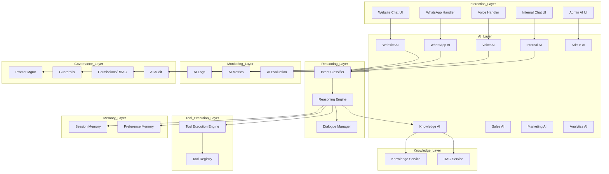
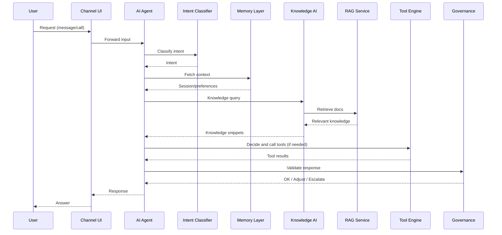
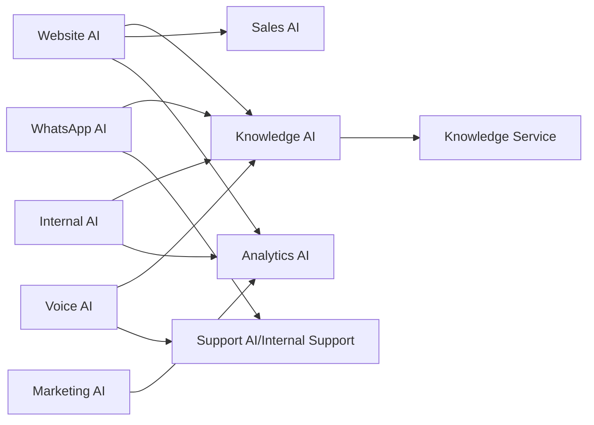
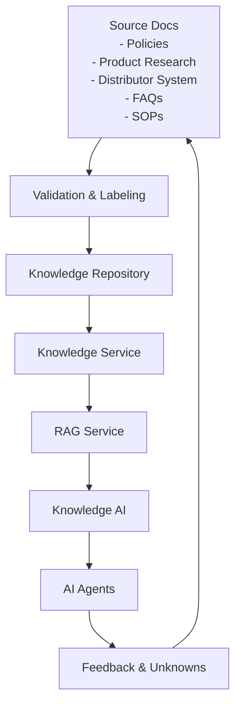
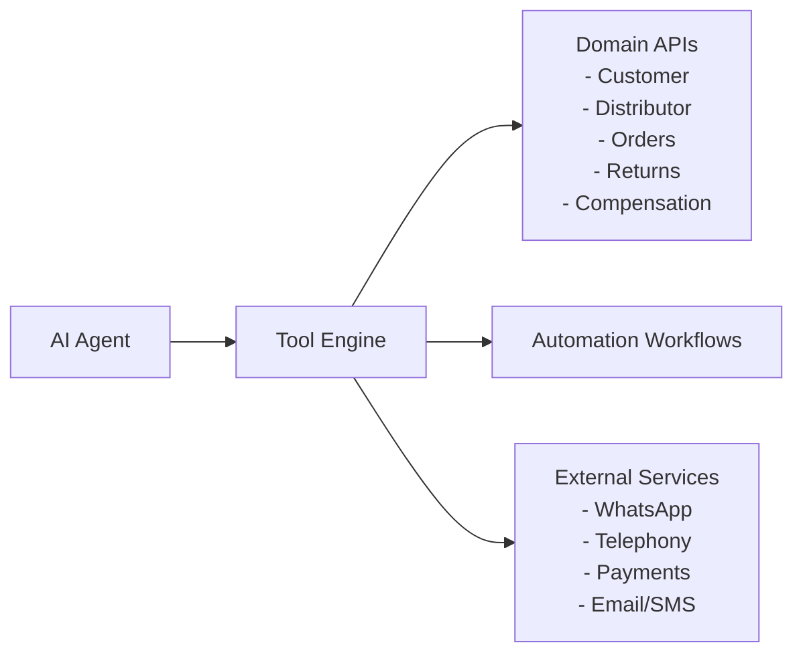
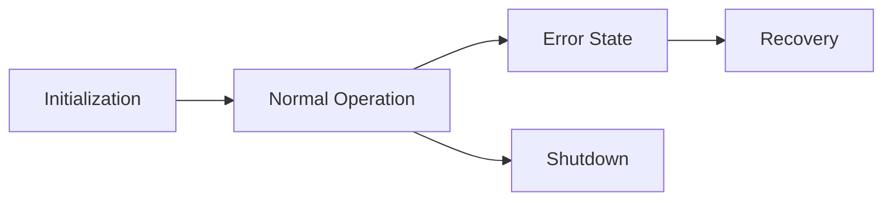

# 02_System_Architecture/03_AI_ARCHITECTURE.md

# Dayjoy Enterprise AI Platform — AI Architecture

> **Purpose:** Define the logical AI architecture of the Dayjoy Enterprise AI Platform, including AI systems, layers, responsibilities, interactions, data flows, lifecycle, and governance.
>
> **Scope:** Logical AI architecture only — no implementation code, low-level API schemas, or provider-specific details.
>
> **Audience:** AI architects, engineers, solution architects, developers, DevOps, security teams, and AI coding assistants.

---

## Table of Contents

1. [AI Architecture Overview](#1-ai-architecture-overview)
2. [AI Layer Structure](#2-ai-layer-structure)
3. [AI Systems Catalog](#3-ai-systems-catalog)
4. [AI Request Lifecycle](#4-ai-request-lifecycle)
5. [AI Collaboration](#5-ai-collaboration)
6. [AI Knowledge Flow](#6-ai-knowledge-flow)
7. [AI Tool Integration](#7-ai-tool-integration)
8. [AI Decision Framework](#8-ai-decision-framework)
9. [AI Governance](#9-ai-governance)
10. [Scalability & Reliability](#10-scalability--reliability)
11. [Future AI Expansion](#11-future-ai-expansion)
12. [Architecture Diagrams](#12-architecture-diagrams)

---

## 1. AI Architecture Overview

The Dayjoy Enterprise AI Platform implements a **multi-agent, layered AI ecosystem** that serves customers, distributors, employees, administrators, and management across Website, WhatsApp, Voice, internal portals, and admin dashboards.[Project_Context/04_AI_VISION.md][02_System_Architecture/00_SYSTEM_OVERVIEW.md]

From a business perspective:

- **Customers** receive AI-assisted product discovery, order support, return/refund guidance, and policy explanations.
- **Distributors** receive AI-assisted onboarding, compensation explanations, training guidance, and business coaching.
- **Employees** receive AI-assisted knowledge search, SOP guidance, analytics summaries, and internal automation suggestions.
- **Administrators and Management** receive AI-assisted configuration, governance, and analytics/insights.

From a technical perspective:

- Channel-specific AI agents (Website AI, WhatsApp AI, Voice AI, Internal AI, Admin AI) orchestrate interactions.
- Core AI services (Knowledge AI, Analytics AI, Sales/Marketing AI) provide domain-specific reasoning and support.
- AI relies on a **Knowledge Layer** (knowledge service + RAG), **Tool Execution Layer** (domain APIs, workflows), and **Governance Layer** (permissions, validation, logging) to ensure safe, accurate behavior.[Project_Context/13_AI_BEHAVIOR.md][Project_Context/12_ARCHITECTURE_PRINCIPLES.md]

---

## 2. AI Layer Structure

### 2.1 AI Layers Overview

The AI architecture is divided into logical layers:

1. **Interaction Layer**
2. **Orchestration Layer**
3. **Reasoning Layer**
4. **Knowledge Layer**
5. **Tool Execution Layer**
6. **Memory Layer**
7. **Monitoring Layer**
8. **Governance Layer**

### 2.2 Interaction Layer

**Purpose:** Handle user interactions across channels.

**Responsibilities:**

- Receive messages or voice input from Website, WhatsApp, Voice, internal portal, and admin dashboards.
- Manage channel-specific formatting and UX (web chat, rich WhatsApp messages, voice prompts).
- Forward structured interaction events to AI agents.

**Components:**

- Website Chat UI.
- WhatsApp message handler.
- Voice call handler (telephony front-end via Vapi/Twilio/etc.).
- Internal chat/query UI.
- Admin AI UI.

---

### 2.3 Orchestration Layer

**Purpose:** Coordinate AI agents, tools, and workflows.

**Responsibilities:**

- Route interactions to appropriate AI agent based on channel and persona.
- Coordinate multi-agent collaboration (e.g., Website AI → Sales AI → Knowledge AI).
- Manage tool calls, workflow triggers, and escalations.

**Components:**

- Agent router/orchestrator.
- Tool/Function invocation manager.
- Workflow/automation invoker.

---

### 2.4 Reasoning Layer

**Purpose:** Perform language understanding, reasoning, and response planning.

**Responsibilities:**

- Intent detection and classification.
- Context analysis (persona, session, domain).
- Multi-step reasoning for complex tasks.[Project_Context/13_AI_BEHAVIOR.md]
- Confidence scoring and decision-making.

**Components:**

- Intent classifier.
- Dialogue/state manager.
- Reasoning engine (LLM + orchestration logic).

---

### 2.5 Knowledge Layer

**Purpose:** Provide grounded information for AI responses.

**Responsibilities:**

- Manage knowledge sources (docs, policies, product info, SOPs).[Project_Context/11_DOCUMENTATION_RULES.md]
- Provide RAG-style retrieval for AI agents.
- Handle conflicting information and freshness.

**Components:**

- Knowledge Service (document management).
- RAG Service (retrieval orchestration).
- Metadata and validation logic.

---

### 2.6 Tool Execution Layer

**Purpose:** Execute actions and queries in business systems.

**Responsibilities:**

- Call domain APIs (orders, distributors, products, returns/refunds, compensation).
- Trigger automation workflows (n8n, background jobs).
- Interact with external services (WhatsApp, payments, telephony, email).

**Components:**

- Tool registry and schemas.
- Tool/Function execution engine (via API Gateway).

---

### 2.7 Memory Layer

**Purpose:** Maintain short-term and long-term context for AI interactions.

**Responsibilities:**

- Store session context (current workflow, parameters, persona).
- Store long-term preferences where allowed (language, typical queries).
- Respect privacy and expiry rules.[Project_Context/13_AI_BEHAVIOR.md]

**Components:**

- Session memory store.
- Preference memory store.

---

### 2.8 Monitoring Layer

**Purpose:** Provide observability for AI behavior and performance.[Project_Context/15_SUCCESS_METRICS.md]

**Responsibilities:**

- Collect AI usage logs, metrics, and evaluation results.
- Track accuracy, hallucination rate, retrieval quality, escalation rate.

**Components:**

- AI logging.
- AI metrics collection.
- AI evaluation dashboards.

---

### 2.9 Governance Layer

**Purpose:** Enforce AI safety, compliance, and consistent behavior.[Project_Context/13_AI_BEHAVIOR.md]

**Responsibilities:**

- Validate responses, check permissions, enforce guardrails.
- Manage prompts and versions.
- Audit AI actions and decisions.

**Components:**

- Prompt Management Service.
- Response validation and guardrails.
- Permission/role checks (RBAC/policy engine).
- Audit logging.

---

## 3. AI Systems Catalog

### 3.1 AI Systems Table

| AI ID | AI System | Purpose | Users | Responsibilities | Dependencies |
|---|---|---|---|---|---|
| AI-WEB-001 | Website AI | Web-based support and assistance | Customers, distributors | Product discovery, FAQs, order tracking, returns/refunds, distributor queries | Knowledge AI, Business Services, Tool Execution Layer |
| AI-WA-001 | WhatsApp AI | WhatsApp-based support and workflows | Customers, distributors | Chat support, notifications, simple workflows (order status, distributor support) | WhatsApp Integration, Knowledge AI, Business Services |
| AI-VOICE-001 | Voice AI | Voice call handling | Customers, distributors | Answer calls, support queries, route to humans | Telephony/Vapi, Knowledge AI, Business Services |
| AI-INT-001 | Internal Assistant | Employee-facing AI | Employees | Knowledge search, SOP guidance, internal workflows | Knowledge AI, Domain Services |
| AI-ADM-001 | Admin AI | Admin-facing AI | Administrators | Assist with user/role/knowledge/AI configuration | Admin & Config Service, Knowledge AI |
| AI-KB-001 | Knowledge AI | Retrieval and grounding engine | All AI agents | RAG, knowledge filtering, citation support | Knowledge Service, RAG Service |
| AI-SALES-001 | Sales AI | Sales support AI | Distributors, sales team | Lead follow-up, recommendations, sales insights | Product Service, CRM (future), Knowledge AI |
| AI-MKT-001 | Marketing AI | Marketing content AI | Marketing team | Draft content, campaign ideas, messaging variants | Knowledge Service (brand rules), Marketing platforms (future) |
| AI-ANL-001 | Analytics AI | Analytics and insight AI | Management, operations | Summarize metrics and trends | Analytics Service, logs/metrics |

### 3.2 Example AI System Specification — Website AI (AI-WEB-001)

- **Purpose:** Provide intelligent assistance on Dayjoy’s website for customers and distributors.
- **Users:** Customers, prospects, distributors.
- **Responsibilities:**
  - Understand queries related to products, orders, policies, distributor business.
  - Retrieve knowledge and call business services.
  - Guide users through workflows (order tracking, returns).
- **Inputs:**
  - Chat messages, session context, user role, channel metadata.
- **Outputs:**
  - Chat responses, tool/API calls, escalation triggers, feedback signals.
- **Dependencies:**
  - Knowledge AI, RAG Service, Customer/Order/Distributor/Product Services, Notification Service, Automation Engine.

*(Each AI system can be further documented similarly; details here remain logical rather than implementation.)*

---

## 4. AI Request Lifecycle

### 4.1 Lifecycle Stages

The AI request lifecycle is consistent across channels and AI agents:[Project_Context/13_AI_BEHAVIOR.md]

1. **User Request:**
   - User sends a message (Web/WhatsApp/Internal) or speaks on a voice call.

2. **Intent Detection:**
   - Interaction Layer forwards input to AI agent.
   - AI Reasoning Layer performs intent classification (e.g., "order status", "refund", "join as distributor", "product info", "policy question").

3. **Context Collection:**
   - AI collects context from Memory Layer and user data:
   - Persona (customer, distributor, employee, admin).
   - Session context (current workflow, previous messages).
   - Relevant identifiers (order ID, distributor ID).

4. **Knowledge Retrieval:**
   - AI calls Knowledge Layer (Knowledge AI/RAG Service).
   - Retrieves relevant documents/snippets from Knowledge Service.

5. **Reasoning:**
   - AI Reasoning Layer combines user input, context, and knowledge.
   - Performs multi-step reasoning for complex tasks (e.g., checking policy, applying compensation rules conceptually).

6. **Tool Selection:**
   - AI decides whether tools (APIs/workflows) are needed.
   - Selects appropriate tool and constructs arguments (e.g., `get_order_status`, `check_return_eligibility`, `calculate_commission`).

7. **Response Generation:**
   - AI composes a response that:
   - Answers the query.
   - Explains decisions or steps.
   - Suggests next actions.

8. **Validation:**
   - Governance Layer checks:
   - Response structure (fields present).
   - Permissions (user allowed to see/act).
   - Safety (no prohibited content or claims).

9. **Delivery:**
   - Response sent via the original channel.
   - Channel-specific formatting applied (speech, chat text, lists, templates).

10. **Feedback Collection:**
   - User may provide feedback (rating, comment).
   - Feedback and outcomes logged for AI evaluation and continuous improvement.

### 4.2 Lifecycle Responsibilities

- **Interaction Layer:** Steps 1 and 10.
- **Reasoning Layer:** Steps 2, 3, 5.
- **Knowledge Layer:** Step 4.
- **Tool Execution Layer:** Step 6.
- **Governance Layer:** Step 8.
- **Monitoring Layer:** Logs and metrics across all steps.

---

## 5. AI Collaboration

### 5.1 Collaboration Concepts

AI collaboration is critical for complex workflows (e.g., a customer asking for product advice, order status, and business opportunity in the same conversation).[Project_Context/13_AI_BEHAVIOR.md]

Key collaboration features:

- **Context Sharing:** AI agents share session and user context through the Memory Layer and orchestration.
- **Task Delegation:** One agent may delegate tasks to another (e.g., Website AI delegating to Sales AI for deeper sales guidance).
- **Shared Memory:** Agents use shared session memory in the AI layer.
- **Shared Knowledge:** All agents use the same Knowledge Layer; differences are in filters and permissions.
- **Agent Coordination:** Orchestration layer manages which agent leads and which supports.

### 5.2 Examples

- **Website AI ↔ Knowledge AI:** Website AI calls Knowledge AI for retrieval; Knowledge AI does not interact directly with users.
- **Website AI ↔ Sales AI:** For sales-specific advice, Website AI asks Sales AI to propose recommendations using product and CRM data.
- **WhatsApp AI ↔ Support AI:** WhatsApp AI handles Tier-1 queries; for complex cases, it escalates and passes context to internal Support AI.
- **Marketing AI ↔ Analytics AI:** Marketing AI queries Analytics AI for performance data before suggesting campaign changes.

---

## 6. AI Knowledge Flow

### 6.1 Knowledge Flow Overview

1. **Knowledge Sources:**
   - Verified docs: policies, product research, distributor system docs, FAQs, SOPs.[05_Policies.md][03_Product_Research.md][04_Distributor_System.md][06_FAQs.md]

2. **Validation:**
   - Documentation and knowledge teams validate and label content (VERIFIED / PARTIALLY VERIFIED / UNKNOWN).[Project_Context/02_KNOWN_FACTS.md][Project_Context/03_UNKNOWN_INFORMATION.md][Project_Context/11_DOCUMENTATION_RULES.md]

3. **Knowledge Repository:**
   - Documents stored in Git-based repository and managed by Knowledge Service.

4. **Indexing & Metadata (Logical View):**
   - Knowledge Service organizes content by domains, tags, and metadata.

5. **Retrieval:**
   - Knowledge AI/RAG Service receives queries from AI agents.
   - Retrieves relevant pieces using metadata and semantics.

6. **Response Generation:**
   - AI agents use retrieved content to form grounded responses.

7. **Continuous Improvement:**
   - Feedback and "no info" cases are logged.
   - Documentation and knowledge teams update content accordingly.

---

## 7. AI Tool Integration

### 7.1 Tool Categories

AI integrates with tools across domains:

- **Domain APIs:** Customer, Distributor, Product, Order, Returns/Refund, Compensation.
- **Automation Workflows:** Notifications, approvals, reminders, training triggers.
- **External Services:** WhatsApp Business, Vapi/telephony, payment gateways, email/SMS providers.
- **Business Systems:** ERP/inventory, CRM, analytics platforms.

### 7.2 Tool Interaction Matrix (Logical)

| Tool Category | Example Tools | Used By AI Systems | Typical Use Cases |
|---|---|---|---|
| Customer APIs | `get_customer_profile`, `get_order_status` | Website AI, WhatsApp AI, Voice AI | Order tracking, profile queries |
| Distributor APIs | `get_distributor_profile`, `get_compensation_summary` | WhatsApp AI, Voice AI, Sales AI | Earnings explanation, rank progression |
| Product APIs | `search_products`, `get_product_details` | Website AI, Sales AI, Marketing AI | Product discovery, recommendations |
| Returns/Refund APIs | `check_return_eligibility`, `create_return_request` | Website AI, WhatsApp AI | Returns workflow |
| Compensation APIs | `calculate_commission`, `get_payout_history` | Distributor AI, Internal AI | Incentive guidance |
| Automation Workflows | `trigger_training_reminder`, `send_notification` | WhatsApp AI, Internal AI, Notification AI | Training, reminders, alerts |
| Payment Gateway Tools | `initiate_payment`, `query_payment_status` | Website AI | Payment flows |
| Telephony Tools | `start_call`, `transfer_call`, `get_call_status` | Voice AI | Call handling |
| WhatsApp Tools | `send_template_message`, `get_message_status` | WhatsApp AI | Notifications, broadcast (within policy) |
| Analytics Tools | `get_kpi_summary`, `get_ai_metrics` | Analytics AI | Reporting and insights |

### 7.3 Tool Interaction Rules

- All tool calls go through the **Tool Execution Layer** and **API Gateway**.
- AI must validate arguments before calling tools.
- Critical actions (refund initiation, payout changes) require extra governance checks and human confirmation.[Project_Context/13_AI_BEHAVIOR.md]

---

## 8. AI Decision Framework

### 8.1 Intent Classification

- Identify primary and secondary intents.
- Use domain and persona context (customer vs. distributor vs. employee).[Project_Context/13_AI_BEHAVIOR.md]

### 8.2 Confidence Scoring

- Each AI response and decision should have an internal confidence score.
- Low confidence triggers:
  - Clarifying questions.
  - Explicit uncertainty statements.
  - Potential escalation.

### 8.3 Clarification Strategy

- If user input is ambiguous or incomplete:
  - Ask **1–2 focused clarifying questions**.
  - Use multiple choice options for clarity.

### 8.4 Escalation Criteria

- Escalate when:
  - Confidence is below threshold for impactful decisions.
  - Policy exceptions are requested.
   - Legal/compliance issues arise.
   - Financial approvals required.
   - Serious complaints or technical failures occur.[Project_Context/13_AI_BEHAVIOR.md]

### 8.5 Human Handoff

- Handoff must:
  - Preserve context (summary, key data, user identifiers).
  - Inform the user what is happening and expected timelines.

---

## 9. AI Governance

### 9.1 Response Validation

- Check responses against:
  - Structural requirements (fields, formats).
  - Safety checks (no prohibited content).
  - Business rules (no policy violations).

### 9.2 Permission Checks

- AI must respect RBAC for data and actions.
- Sensitive operations require explicit permission confirmation.

### 9.3 Security Controls

- No direct access to sensitive DBs.
- No exposure of secrets or internal identifiers beyond allowed.

### 9.4 Audit Logging

- Log AI actions, tool calls, escalations, and sensitive decisions.

### 9.5 Explainability

- AI must provide concise reasoning or citations for important decisions.

### 9.6 Ethical Guidelines (Logical)

- Avoid discrimination, offensive content.
- Avoid encouraging unsafe or non-compliant behavior.
- Clearly represent limitations (no medical/legal professional advice).

---

## 10. Scalability & Reliability

### 10.1 Stateless AI Services

- Channel AI agents (Website AI, WhatsApp AI, Voice AI, Internal AI, Admin AI) should be stateless.
- Session context stored in Memory Layer.

### 10.2 Load Distribution

- Use load balancing and horizontal scaling for AI agents.
- Use caching for frequently accessed knowledge and responses.

### 10.3 Fault Tolerance

- Graceful degradation when:
  - Knowledge layers are partially available.
  - Tool execution fails.
  - External providers are down.

### 10.4 Retry Strategy

- Retry external calls on transient errors with backoff.
- Limit retries to prevent cascading failures.

### 10.5 Service Isolation

- Isolate AI services to avoid one failing agent affecting others.
- Use circuit breakers for problematic dependencies.

---

## 11. Future AI Expansion

### 11.1 Multi-Agent Workflows (Future Vision)

- More complex workflows where multiple agents coordinate autonomously.

### 11.2 Autonomous Task Execution (Future Vision)

- AI initiating certain low-risk workflows autonomously (e.g., sending reminders), with governance.

### 11.3 Predictive AI (Future Vision)

- AI forecasting sales, churn, distributor performance.

### 11.4 AI Personalization (Future Vision)

- Deeper personalization of content and flows based on behavior and preferences.

### 11.5 Additional Communication Channels (Future Vision)

- Support for new channels (Telegram, mobile apps, regional messaging platforms).

All future capabilities must be designed within the same layered AI architecture and governance model.

---

## 12. Architecture Diagrams

### 12.1 AI Layer Architecture

### 12.2 AI Request Flow

### 12.3 AI Collaboration

### 12.4 Knowledge Flow

### 12.5 Tool Interaction

### 12.6 AI Lifecycle (Component View)

---

**END OF DOCUMENT**