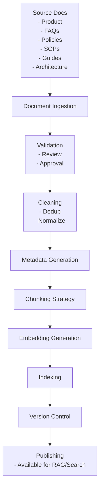
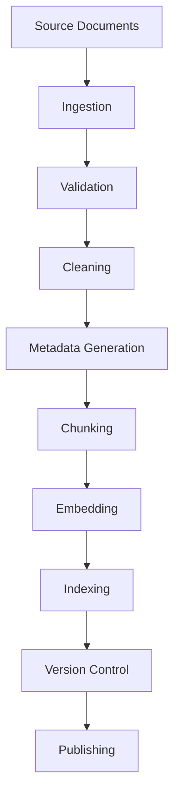
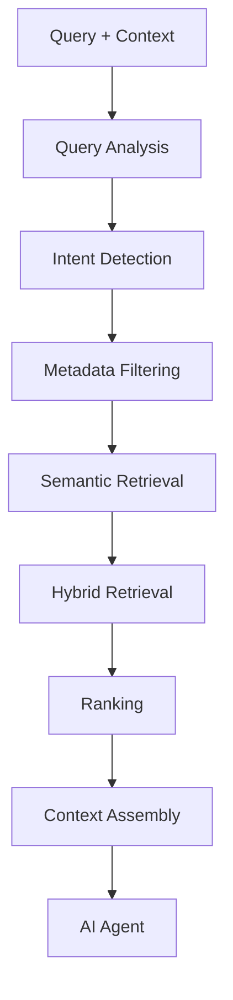
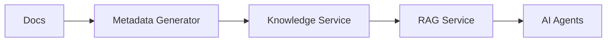
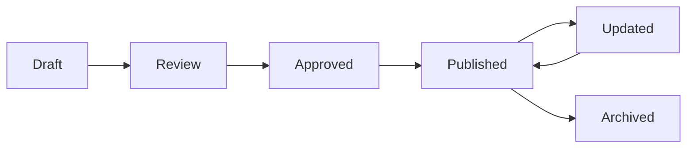
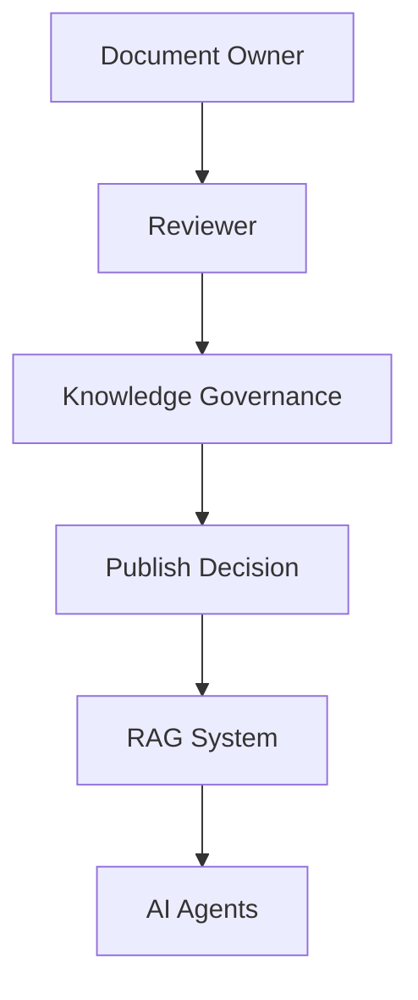
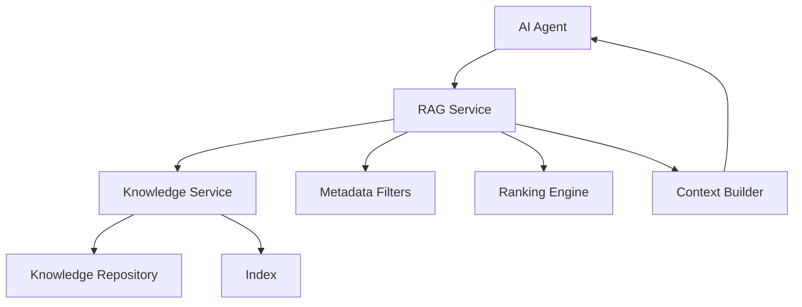

# 02_System_Architecture/04_RAG_ARCHITECTURE.md

# Dayjoy Enterprise AI Platform — RAG Architecture

> **Purpose:** Define the enterprise Retrieval-Augmented Generation (RAG) architecture that powers AI systems in the Dayjoy Enterprise AI Platform.
>
> **Scope:** Logical RAG architecture — knowledge flow, retrieval strategy, indexing, governance, security, scalability, and retrieval quality. No implementation code or model-specific prompts.
>
> **Audience:** AI architects, knowledge engineers, developers, documentation leads, security and governance teams, and AI coding assistants.

---

## Table of Contents

1. [RAG Overview](#1-rag-overview)
2. [Knowledge Sources](#2-knowledge-sources)
3. [Knowledge Processing Pipeline](#3-knowledge-processing-pipeline)
4. [Retrieval Pipeline](#4-retrieval-pipeline)
5. [Metadata Architecture](#5-metadata-architecture)
6. [Knowledge Governance](#6-knowledge-governance)
7. [Access Control](#7-access-control)
8. [Retrieval Quality](#8-retrieval-quality)
9. [Failure Handling](#9-failure-handling)
10. [Performance & Scalability](#10-performance--scalability)
11. [Security](#11-security)
12. [Future Enhancements](#12-future-enhancements)
13. [Architecture Diagrams](#13-architecture-diagrams)

---

## 1. RAG Overview

### 1.1 Purpose of the RAG System

The RAG system provides **grounded, knowledge-based responses** for all AI agents by retrieving relevant information from Dayjoy’s enterprise knowledge sources and using it to guide AI reasoning and answer generation.[Project_Context/11_DOCUMENTATION_RULES.md][Project_Context/13_AI_BEHAVIOR.md]

The goals are to:

- Prevent hallucinations and invented business facts.
- Ensure AI responses reflect **verified Dayjoy knowledge**.
- Enable flexible, multi-domain knowledge retrieval (products, policies, distributor system, SOPs, architecture).

### 1.2 Business Value

- **Accuracy & Trust:** Customers, distributors, and employees receive answers consistent with official documents.[Project_Context/02_KNOWN_FACTS.md][05_Policies.md]
- **Scalability:** Support and internal teams rely on AI to access knowledge quickly, reducing manual effort.[Project_Context/07_BUSINESS_PROCESSES.md]
- **Governance:** Centralized knowledge and retrieval make policy changes easier to propagate.[Project_Context/11_DOCUMENTATION_RULES.md]

### 1.3 Supported AI Systems (Verified)

- Website AI.
- WhatsApp AI.
- Voice AI.
- Internal Assistant.
- Admin AI.
- Sales AI.
- Marketing AI.
- Analytics AI.

Each AI agent calls the RAG layer for factual queries and policy-based decisions.[02_System_Architecture/03_AI_ARCHITECTURE.md]

### 1.4 Supported Document Types (Verified + Recommendations)

- Product documents (specs, benefits, usage).[03_Product_Research.md]
- FAQs (customer, distributor, support).[06_FAQs.md]
- Policies (orders, returns, refunds, shipping, compensation).[05_Policies.md][04_Distributor_System.md]
- SOPs (customer support, internal processes).[Project_Context/07_BUSINESS_PROCESSES.md]
- Distributor guides and training content.
- Marketing guidelines and brand rules.[Project_Context/11_DOCUMENTATION_RULES.md]
- Research documents (product, market).
- AI documentation (behavior, prompts, guardrails).[Project_Context/13_AI_BEHAVIOR.md]
- Architecture and technical documents.[02_System_Architecture/00_SYSTEM_OVERVIEW.md][Project_Context/09_TECH_STACK.md]

---

## 2. Knowledge Sources

### 2.1 Knowledge Source Catalog

| Source ID | Source Name | Owner | Update Frequency | Trust Level | Access Permissions |
|---|---|---|---|---|---|
| KS-PROD-001 | Product Research Documents | Product Team | As needed (new products/updates) | High (Verified) | All AI, Employees, Distributors, Customers (filtered by channel) |
| KS-FAQ-001 | Customer FAQs | CX / Support | Regular (monthly/quarterly) | High (Verified) | All AI, Customers |
| KS-FAQ-002 | Distributor FAQs | Distributor Management | Regular | High (Verified) | All AI, Distributors |
| KS-POL-001 | Customer Policies (Orders, Returns, Refunds, Shipping) | Legal/Compliance / CX | Controlled (policy changes) | Very High (Official) | AI, Employees, Distributors; public subsets for Customers |
| KS-POL-002 | Distributor Policies & Compensation Plan | Legal/Compliance / Distributor Management | Controlled | Very High (Official) | AI, Distributors, Employees |
| KS-SOP-001 | Customer Support SOPs | Support Management | Regular | High (Verified) | Internal AI, Employees |
| KS-SOP-002 | Internal Process SOPs | Operations | Regular | High | Internal AI, Employees |
| KS-DIST-001 | Distributor Guides & Training Content | Training / Distributor Management | Regular training cycles | High | Distributors, Distributor AI |
| KS-MKT-001 | Marketing Guidelines & Brand Rules | Marketing / Brand | Controlled | High | Marketing AI, Employees |
| KS-RES-001 | Research Documents (Product & Market) | Product / Research | As available | Medium–High | Internal AI, Knowledge AI |
| KS-AI-001 | AI Behavior & Guardrail Docs | AI Governance | Controlled | Very High | All AI engineers, Admin AI |
| KS-ARCH-001 | Architecture & Tech Documents | Architecture / Engineering | Controlled | High | Internal AI, Engineering users |

- **Trust Level:** indicates how strongly RAG should favor content (Official policy > Verified product docs > research).
- **Access Permissions:** apply RBAC and persona filters in retrieval.[Project_Context/08_CONSTRAINTS.md]

---

## 3. Knowledge Processing Pipeline

### 3.1 Pipeline Stages (Logical)

1. **Document Ingestion:** New or updated documents are added from source systems (Git repo, uploads, CMS).
2. **Validation:** Owners review content for correctness, compliance, and clarity.[Project_Context/11_DOCUMENTATION_RULES.md]
3. **Cleaning:** Remove duplicates, outdated sections, and irrelevant content.
4. **Metadata Generation:** Assign metadata (IDs, categories, tags, permissions).
5. **Chunking Strategy:** Break documents into meaningful sections (logical topics, headings).
6. **Embedding Generation:** Produce semantic representations of chunks for retrieval.
7. **Indexing:** Store chunks and embeddings in the knowledge index.
8. **Version Control:** Track versions and changes in documents and indexes.
9. **Publishing:** Mark content as available for RAG and search based on status (Draft, Approved, Published).

### 3.2 Pipeline Diagram



### 3.3 Chunking Strategy (Logical Guidelines)

- Chunk by **semantic section** (heading + paragraphs) rather than fixed size.
- Ensure each chunk:
  - Answers a coherent question.
  - Contains enough context but is not overly long.
- Maintain links between chunks and full documents for traceability.

---

## 4. Retrieval Pipeline

### 4.1 Retrieval Stages

1. **Query Analysis:**
   - AI agent sends query with context (persona, channel, language, domain hint).
   - RAG service analyzes query type (product, policy, SOP, distributor, tech).

2. **Intent Detection (Logical within RAG):**
   - Classify query to select appropriate source(s) and filters.

3. **Metadata Filtering:**
   - Apply metadata filters (domain, category, language, access level).
   - Restrict by persona and role (e.g., distributors see distributor docs).

4. **Semantic Retrieval:**
   - Use embeddings to retrieve top-N semantically similar chunks.

5. **Hybrid Retrieval (Recommended):**
   - Combine semantic retrieval with keyword/phrase search for precision.

6. **Ranking:**
   - Rank chunks by relevance, trust, freshness, and access level.

7. **Context Assembly:**
   - Assemble a set of chunks for AI to use (e.g., top 3–5 relevant sections).

8. **Response Generation (Outside RAG):**
   - AI agent uses assembled context to generate response.

### 4.2 Retrieval Flow Diagram

```mermaid
flowchart TB
    Q[AI Query
    + Context] --> QA[Query Analysis]
    QA --> INTENT[Intent Detection]
    INTENT --> FILTER[Metadata Filtering]
    FILTER --> SEM[Semantic Retrieval]
    SEM --> HYBRID[Hybrid Retrieval
    (Optional Keyword Search)]
    HYBRID --> RANK[Ranking
    - Relevance
    - Trust
    - Freshness]
    RANK --> CTX[Context Assembly]
    CTX --> AGENT[AI Agent
    Uses Context]
```

---

## 5. Metadata Architecture

### 5.1 Metadata Fields

Each document and chunk should have standardized metadata:[Project_Context/11_DOCUMENTATION_RULES.md]

| Field | Description |
|---|---|
| `doc_id` | Unique document identifier (e.g., `DOC-POL-001`) |
| `chunk_id` | Unique identifier for each chunk |
| `category` | High-level category (Product, FAQ, Policy, SOP, Guide, Research, AI, Architecture) |
| `product` | Associated product or category (if applicable) |
| `department` | Owning department (Product, CX, Distributor Mgmt, Marketing, AI Governance, Architecture) |
| `language` | Language code (e.g., `en`, `hi`) |
| `version` | Semantic version of the document (e.g., `1.0.0`) |
| `status` | Document status (Draft, Review, Approved, Published, Archived) |
| `author` | Author or owner of content |
| `last_updated` | Date of last update (ISO format) |
| `created` | Creation date |
| `tags` | Tags for topic/domain (e.g., `returns`, `compensation`, `shipping`) |
| `access_level` | Access level (Public, Customer, Distributor, Employee, Admin, AI-only) |
| `trust_level` | Trust indicator (Official, Verified, Partially Verified, Unknown) |
| `confidence_score` | Optional score indicating retrieval confidence |

### 5.2 Metadata Usage

- **Filtering:** Use `category`, `department`, `access_level`, and `language` in retrieval.
- **Ranking:** Use `trust_level`, `last_updated`, `version`, and `tags` to influence ranking.
- **Governance:** Use `status` and `version` for workflow and approvals.

---

## 6. Knowledge Governance

### 6.1 Approval Workflow (Logical)

1. Draft created (status = Draft).
2. Owner reviews and updates.
3. Reviewer approves content (status = Approved).
4. Knowledge team publishes to RAG (status = Published).
5. Old versions archived as needed.

### 6.2 Document Ownership

- Each source has a documented owner:
  - Product Team for product docs.
  - CX/Support for FAQs.
  - Legal/Compliance for policies.
  - Distributor Management for distributor guides.
  - Marketing for brand rules.
  - AI Governance for AI behavior docs.
  - Architecture/Engineering for tech docs.

### 6.3 Version Management

- Use semantic versioning.
- Keep version history and changelog.[Project_Context/11_DOCUMENTATION_RULES.md]

### 6.4 Review Schedule

- Policies: at least annually.
- FAQs: monthly/quarterly.
- Product docs: on product changes.
- SOPs: annually or when processes change.
- AI docs and architecture: on major releases.

### 6.5 Archive Policy

- Archived documents (status = Archived) remain in repository but excluded from default retrieval.

### 6.6 Change Tracking

- Track changes via Git history and metadata.
- Use changelogs per document.[Project_Context/11_DOCUMENTATION_RULES.md]

---

## 7. Access Control

### 7.1 Role-Based Retrieval Permissions

High-level access control:

| Persona | Access Level | Examples |
|---|---|---|
| Customer | Public, Customer | Customer FAQs, product docs, customer policies |
| Distributor | Public, Distributor | Distributor FAQs, guides, distributor policies, compensation docs |
| Employee | Employee, Public, Customer, Distributor | SOPs, internal docs, policies, knowledge articles |
| Administrator | Admin, All | Governance docs, AI behavior, architecture, internal and external policy views |
| AI Agents | AI-only + persona-specific | AI behavior docs, internal knowledge not directly shown to users |

### 7.2 Principles

- AI retrieval must **respect persona and role** — no cross-role leaking (e.g., distributor-only docs to customers).[Project_Context/08_CONSTRAINTS.md]
- The Knowledge Layer enforces filters based on `access_level` and RBAC.

---

## 8. Retrieval Quality

### 8.1 Quality Standards

- **Precision:** High proportion of retrieved chunks are relevant.
- **Recall:** Relevant chunks are rarely missed.
- **Relevance:** Content is directly useful to answer the query.
- **Freshness:** Retrieved content is up-to-date.
- **Source Reliability:** Official/trusted sources are prioritized.
- **Confidence Thresholds:** Only high-confidence retrieval contexts used for strong assertions.

### 8.2 KPIs (Logical Targets)[Project_Context/15_SUCCESS_METRICS.md]

| Metric | Description | Target |
|---|---|---|
| RAG Precision | % of top-N chunks judged relevant | ≥ 90% |
| RAG Recall | % of relevant chunks found | ≥ 85% |
| Retrieval Relevance Score | Human-rated relevance | ≥ 4.5/5 |
| Knowledge Freshness | % docs updated within freshness window | ≥ 80% |
| Trust Alignment | % responses using highest-trust sources when available | ≥ 95% |
| Low-Confidence Retrieval Rate | % queries flagged as low-confidence | Monitored, used to improve sources |

---

## 9. Failure Handling

### 9.1 Missing Documents

- Behavior:
  - AI states "I don't have information about this".
  - Suggests contacting support or relevant team.
  - Logs gap for documentation team.

### 9.2 Conflicting Information

- Behavior:
  - Prefer latest Approved/Official docs.
  - If conflict remains, AI indicates "conflicting information" and suggests human review.

### 9.3 Low-Confidence Retrieval

- Behavior:
  - AI expresses uncertainty.
  - Offers clarifying questions or escalation.

### 9.4 Outdated Knowledge

- Behavior:
  - AI notes last updated date.
  - Suggests verifying with current policy or human.

### 9.5 Empty Search Results

- Behavior:
  - AI says "No matching information found".
  - Suggests alternate queries or support.
  - Logs for knowledge gap analysis.

---

## 10. Performance & Scalability

### 10.1 Large Knowledge Repositories

- Design for many documents and chunks across domains.
- Use efficient indexing and retrieval mechanisms.

### 10.2 Fast Retrieval

- Optimize retrieval latency for interactive AI use:
  - Caching of embeddings and frequent queries.
  - Pre-computed indexes.[Project_Context/12_ARCHITECTURE_PRINCIPLES.md]

### 10.3 Caching Strategy

- Cache:
  - Common FAQ contexts.
  - Frequently used policy sections.

### 10.4 Incremental Indexing

- New or updated docs should be indexed incrementally.
- Avoid full re-indexing for small changes.

### 10.5 Multi-Language Support

- Metadata includes language; retrieval filters by language when needed.
- Use language-specific indexing strategies.

### 10.6 Future Scalability

- Support new domains and larger corpora.
- Allow for distributed indexing and retrieval.

---

## 11. Security

### 11.1 Encryption

- All RAG-related APIs must use HTTPS.
- Sensitive content and indexes must be stored in encrypted storage.

### 11.2 Access Control

- Enforce RBAC and `access_level` at the Knowledge Layer.

### 11.3 Audit Logs

- Log:
  - Document changes.
  - Publishing/unpublishing.
  - Admin actions on knowledge settings.

### 11.4 Secure Indexing

- Index only content permitted for retrieval.
- Ensure indexes do not expose secrets or sensitive identifiers.

### 11.5 Data Privacy

- Avoid indexing personal data where possible.
- Apply privacy rules per document type and region.

### 11.6 Sensitive Document Handling

- Tag sensitive documents.
- Restrict retrieval to specific roles.

---

## 12. Future Enhancements

### 12.1 Multi-Modal RAG (Future)

- Add support for image, video, and audio documents.

### 12.2 Image Retrieval (Future)

- Use image metadata and visual embeddings for product/marketing images.

### 12.3 Video Knowledge (Future)

- Extract transcripts and key frames from training/marketing videos.

### 12.4 Structured Database Retrieval (Future)

- Integrate RAG with structured query mechanisms for combining doc and data answers.

### 12.5 Knowledge Graph Integration (Future)

- Represent entities and relationships to improve retrieval and reasoning.

### 12.6 Personalized Retrieval (Future)

- Adapt retrieval based on role, preferences, and historical interactions within privacy constraints.

### 12.7 Continuous Learning (Future)

- Use feedback signals to prioritize and refine indexes and content.

All future features must respect existing **governance, security, and access control models**.

---

## 13. Architecture Diagrams

### 13.1 Knowledge Processing Pipeline



### 13.2 Retrieval Pipeline



### 13.3 Metadata Flow



### 13.4 Document Lifecycle



### 13.5 Knowledge Governance



### 13.6 RAG System Architecture



---

**END OF DOCUMENT**