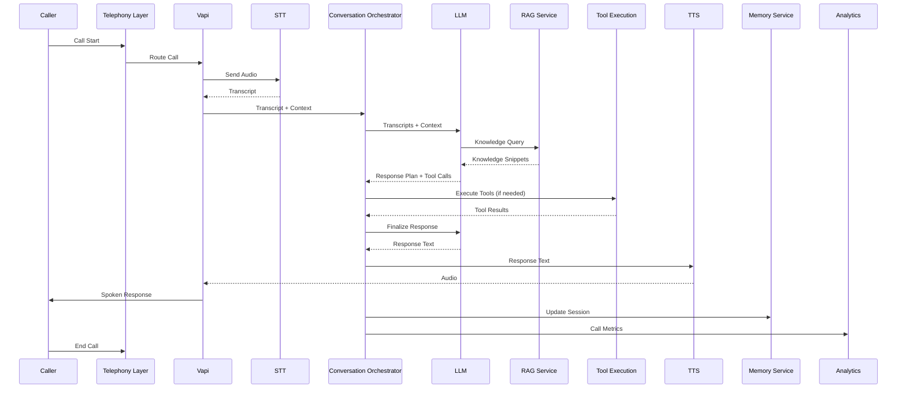
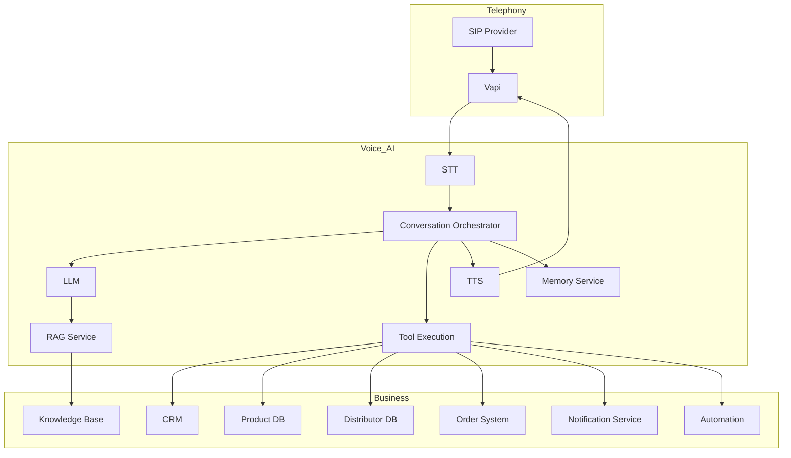
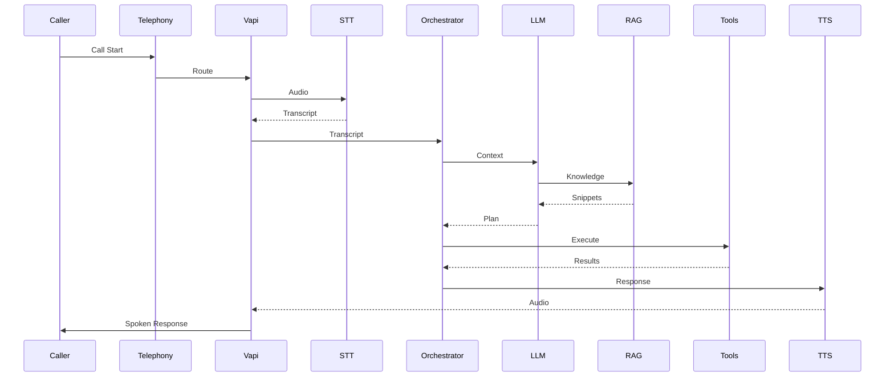
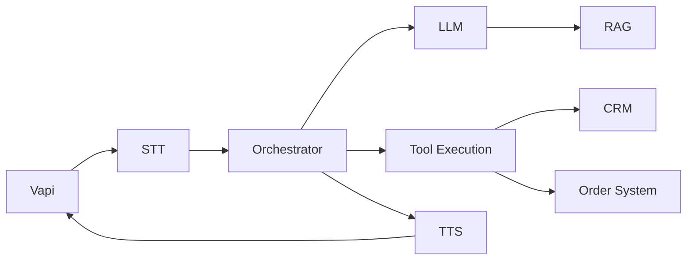
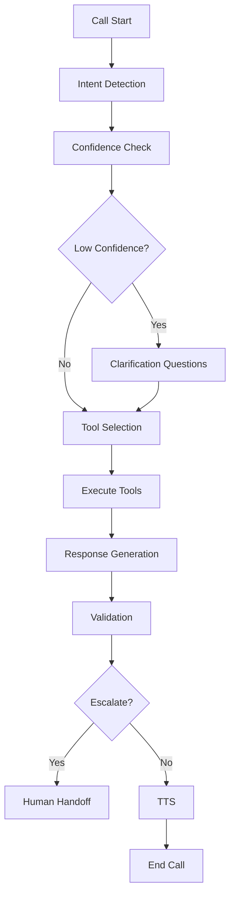
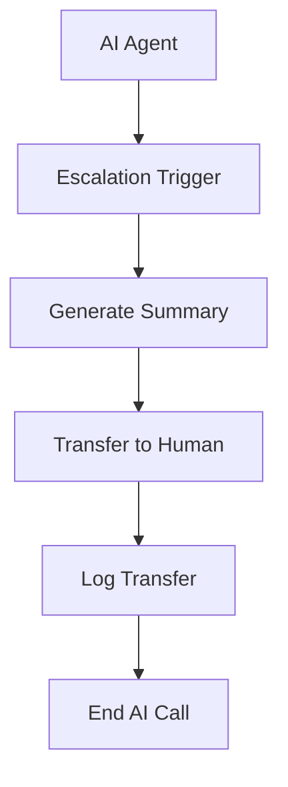
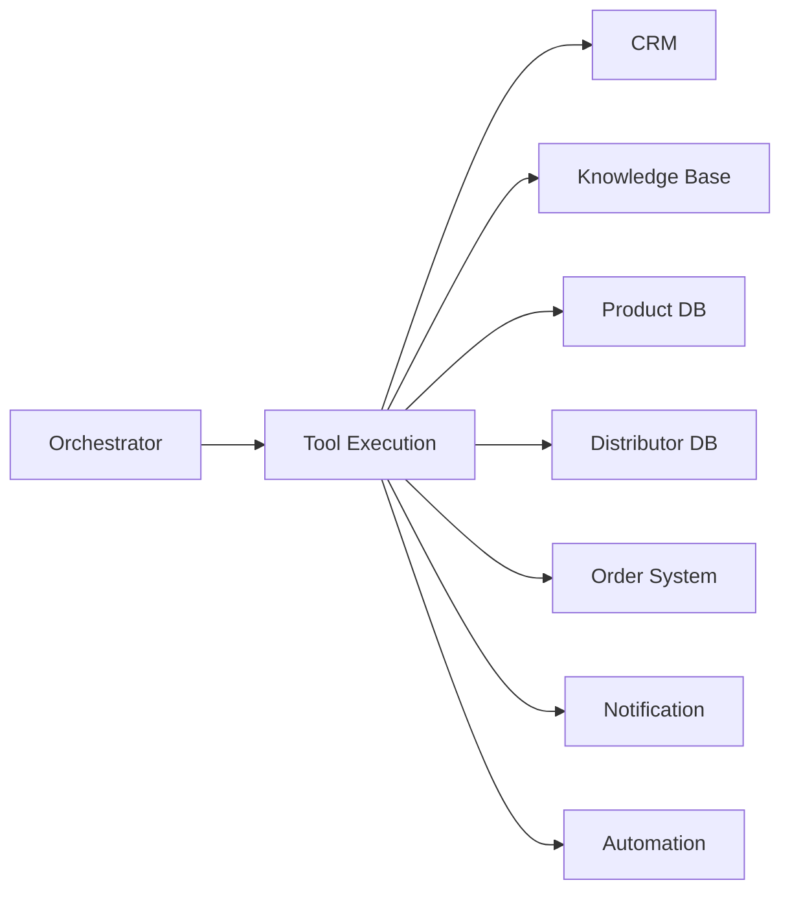

# 02_System_Architecture/05_VOICE_AI_ARCHITECTURE.md

# Dayjoy Enterprise AI Platform — Voice AI Architecture

> **Purpose:** Define the logical architecture for the Dayjoy Voice AI system, covering inbound and outbound calls, AI conversation flow, telephony integration, knowledge retrieval, tool execution, and escalation.
>
> **Scope:** Enterprise Voice AI architecture — business objectives, components, workflows, system interactions, security, performance, and monitoring. No implementation code or low-level API schemas.
>
> **Audience:** AI architects, voice/telephony engineers, DevOps, security teams, and AI coding assistants.

---

## Table of Contents

1. [Voice AI Overview](#1-voice-ai-overview)
2. [Voice AI Components](#2-voice-ai-components)
3. [Call Lifecycle](#3-call-lifecycle)
4. [Supported Call Scenarios](#4-supported-call-scenarios)
5. [AI Decision Flow](#5-ai-decision-flow)
6. [Tool Integration](#6-tool-integration)
7. [Human Handoff](#7-human-handoff)
8. [Security & Privacy](#8-security--privacy)
9. [Performance Requirements](#9-performance-requirements)
10. [Error Handling](#10-error-handling)
11. [Monitoring & Analytics](#11-monitoring--analytics)
12. [Future Enhancements](#12-future-enhancements)
13. [Architecture Diagrams](#13-architecture-diagrams)

---

## 1. Voice AI Overview

### 1.1 Business Objectives

The Dayjoy Voice AI system provides **intelligent, conversational voice support** for customers and distributors, improving accessibility, reducing call center load, and standardizing support quality.[Project_Context/04_AI_VISION.md][Project_Context/07_BUSINESS_PROCESSES.md]

Objectives:

- Offer 24/7 voice support for common queries.
- Reduce average handling time and escalations.
- Provide consistent, knowledge-grounded answers for products, orders, and distributor policies.[05_Policies.md][03_Product_Research.md][04_Distributor_System.md]

### 1.2 Supported Use Cases (Logical)

- Product inquiry (features, usage, benefits).
- Order status and tracking.
- Returns and refunds guidance.
- Distributor assistance (compensation, rank, onboarding).
- Registration support (customer and distributor).
- Complaint intake and routing.
- General FAQ assistance.
- Human agent transfer when needed.[Project_Context/13_AI_BEHAVIOR.md]

### 1.3 User Types

- **Customers:** Product/order/return queries.
- **Distributors:** Business, compensation, training queries.
- **Internal Teams:** Limited support queries (e.g., verifying caller identity, routing).

### 1.4 Expected Business Outcomes

- Higher call resolution rate without human agents.
- Shorter call durations for routine topics.
- Improved user satisfaction and consistency.
- Centralized, auditable call intelligence for quality and process improvement.[Project_Context/15_SUCCESS_METRICS.md]

---

## 2. Voice AI Components

### 2.1 Component Catalog

| Component ID | Component Name | Purpose | Responsibilities | Inputs | Outputs | Dependencies |
|---|---|---|---|---|---|---|
| COMP-TEL-001 | Telephony Layer | Manage call routing and telephony interfaces | Inbound/outbound call routing, call ID management, DTMF handling | SIP/VoIP events, call setup requests | Call events, call control | SIP Provider, Vapi/telephony platform |
| COMP-SIP-001 | SIP Provider | Provide telephony connectivity | Inbound/outbound call termination, number management | Call requests, routing config | Call events | Telecom carriers |
| COMP-TEL-002 | Vapi (Voice Platform) | Host and orchestrate voice agents | Agent lifecycle, call control, STT/TTS integration | Call events, agent config | Call events, audio streams | Telephony, LLM, STT/TTS |
| COMP-STT-001 | Speech-to-Text (STT) | Convert speech to text | Real-time transcription | Audio stream | Transcripts | Vapi/telephony platform |
| COMP-ORCH-001 | Conversation Orchestrator | Manage conversation flow | Dialogue management, tool coordination, escalation | Transcripts, context, knowledge | AI decisions, tool calls, TTS prompts | LLM, RAG Service, Tool Execution Service |
| COMP-LLM-001 | LLM | Language understanding and generation | Intent detection, reasoning, response planning | Transcripts, context, knowledge | Response text, tool decisions | Conversation Orchestrator |
| COMP-RAG-001 | RAG Service | Knowledge retrieval | Retrieve relevant knowledge for responses | Queries, context | Knowledge snippets | Knowledge Service, Vector Store |
| COMP-MEM-001 | Memory Service | Maintain session and preference memory | Store/retrieve call session context and preferences | Session IDs, context | Session data | Database/Cache |
| COMP-TOOL-001 | Tool Execution Service | Execute actions in business systems | Call domain APIs, trigger workflows | Tool requests | Tool results | Domain APIs, Automation Platform |
| COMP-TTS-001 | Text-to-Speech (TTS) | Convert text to speech | Synthesize natural speech responses | Response text | Audio stream | Vapi/telephony platform |
| COMP-ANL-001 | Analytics | Collect and analyze call metrics | Metrics, dashboards, reports | Call logs, events | Dashboards, reports | Logging Service, Monitoring |
| COMP-REC-001 | Call Recording | Record and store calls | Capture and store audio | Audio stream | Recording files | Storage, Security |
| COMP-MON-001 | Monitoring | Monitor system health | Track latency, errors, availability | Metrics, logs | Alerts, dashboards | Logging Service, Metrics |

---

## 3. Call Lifecycle

### 3.1 Call Flow Stages

1. **Incoming/Outgoing Call:**
   - Caller dials Dayjoy number or system initiates outbound call.

2. **Authentication (if required):**
   - For sensitive actions, verify identity (e.g., order number, distributor ID, phone number).

3. **Intent Detection:**
   - Voice AI transcribes speech and classifies intent (product inquiry, order status, complaint, etc.).

4. **Context Collection:**
   - Retrieve session context and caller profile (if known).

5. **Knowledge Retrieval:**
   - Call RAG Service for relevant knowledge snippets.

6. **Tool Execution:**
   - If needed, call domain APIs (order status, distributor profile, etc.).

7. **Response Generation:**
   - LLM generates response text based on context and knowledge.

8. **Voice Synthesis:**
   - TTS converts response to speech.

9. **Conversation Memory Update:**
   - Store conversation context and outcomes.

10. **Call Summary:**
   - Generate structured summary for analytics and support.

11. **End Call:**
   - Call ends; recording and logs finalized.

### 3.2 End-to-End Call Flow Diagram

---

## 4. Supported Call Scenarios

### 4.1 Product Inquiry

- **Trigger:** Caller asks about product features, benefits, usage.
- **Flow:**
  - Detect product inquiry intent.
  - Retrieve product knowledge via RAG.
  - Provide summary and guidance.
  - Offer additional help or transfer if needed.

### 4.2 Distributor Assistance

- **Trigger:** Caller asks about compensation, rank, onboarding.
- **Flow:**
  - Verify distributor identity (if sensitive).
  - Retrieve distributor docs and policy knowledge.
  - Optionally call Distributor Service for profile/compensation summaries.
  - Explain results and next steps.

### 4.3 Order Status

- **Trigger:** Caller asks about order status.
- **Flow:**
  - Verify order identifier (order ID/phone/email).
  - Call Order Service for status.
  - Provide status and expected delivery.
  - Offer escalation for issues.

### 4.4 Complaint Handling

- **Trigger:** Caller expresses complaint or dissatisfaction.
- **Flow:**
  - Detect complaint intent.
  - Collect key details (order, product, issue).
  - Create support ticket via Support/Ticketing Service.
  - Provide ticket reference and next steps.
  - Offer human follow-up if needed.

### 4.5 Registration Support

- **Trigger:** Caller asks about becoming customer or distributor.
- **Flow:**
  - Provide registration steps and requirements.
  - Retrieve relevant policy and onboarding docs.
  - Offer links via SMS/WhatsApp or transfer to human.

### 4.6 FAQ Assistance

- **Trigger:** General policy or process questions.
- **Flow:**
  - Retrieve FAQ and policy knowledge.
  - Provide concise answers.
  - Offer escalation for complex cases.

### 4.7 Human Agent Transfer

- **Trigger:** Complex, sensitive, or escalated cases.
- **Flow:**
  - Detect escalation need.
  - Prepare call summary and context.
  - Transfer to human agent queue.
  - Log transfer and reason.

---

## 5. AI Decision Flow

### 5.1 Decision Steps

1. **Intent Classification:**
   - Classify caller intent (product, order, distributor, complaint, FAQ, etc.).

2. **Confidence Evaluation:**
   - Evaluate confidence in intent and response.

3. **Clarification Questions:**
   - Ask 1–2 focused questions if intent or data is unclear.

4. **Tool Selection:**
   - Decide whether to call domain APIs (order status, distributor profile, etc.).

5. **Escalation Rules:**
   - Escalate when:
     - Low confidence on critical decisions.
     - Policy exceptions requested.
     - Serious complaints or technical failures.
     - Sensitive financial or legal issues.

6. **Response Validation:**
   - Validate responses against guardrails and permissions.

---

## 6. Tool Integration

### 6.1 Tool Categories

Voice AI interacts with:

- **CRM:** Caller profiles, history.
- **Knowledge Base:** Policies, product docs, SOPs.
- **Product Database:** Product details.
- **Distributor Database:** Distributor profiles and compensation.
- **Order System:** Order status and tracking.
- **Notification Service:** SMS/WhatsApp follow-ups.
- **Automation Platform:** Workflows (reminders, training).
- **Calendar:** Appointment scheduling (future).
- **Payment Status APIs:** Payment verification (future).

### 6.2 Tool Interaction Matrix

| Tool Category | Example Tools | Used By Voice AI | Typical Use Cases |
|---|---|---|---|
| CRM | `get_caller_profile`, `get_interaction_history` | All | Personalization, context |
| Knowledge Base | `search_knowledge`, `get_policy` | All | Answering questions |
| Product DB | `get_product_details`, `search_products` | Product Inquiry | Product info |
| Distributor DB | `get_distributor_profile`, `get_compensation_summary` | Distributor Assistance | Earnings, rank |
| Order System | `get_order_status`, `track_order` | Order Status | Order tracking |
| Notification Service | `send_sms`, `send_whatsapp` | All | Follow-ups, links |
| Automation Platform | `create_ticket`, `trigger_reminder` | Complaint, Registration | Workflows |
| Calendar | `schedule_appointment` | Future | Appointments |
| Payment APIs | `check_payment_status` | Future | Payment verification |

---

## 7. Human Handoff

### 7.1 Escalation Triggers

- Low-confidence responses on critical topics.
- Sensitive or complex complaints.
- Policy exceptions or disputes.
- Repeated failed AI attempts.
- Caller explicitly requests human.

### 7.2 Context Transfer

- Transfer includes:
  - Caller identity and profile.
  - Call summary and key data.
  - Relevant tool results and knowledge used.

### 7.3 Call Notes

- AI logs structured notes for support agent.

### 7.4 Conversation Summary

- Summary includes:
  - Caller intent.
  - Key details (order, product, issue).
  - Actions taken.

### 7.5 Rejoin Strategy

- If human agent needs AI assistance, Voice AI can rejoin as a support tool.

### 7.6 Failure Recovery

- If handoff fails, AI informs caller and offers callback or alternative contact.

---

## 8. Security & Privacy

### 8.1 Caller Verification

- Verify identity for sensitive actions (order changes, compensation details).

### 8.2 Authentication

- Use phone number, order ID, or distributor ID as needed.

### 8.3 Role-Based Access

- Restrict access to sensitive data based on caller role.

### 8.4 Encryption

- Use encrypted telephony (TLS/SRTP) where possible.

### 8.5 Recording Policies

- Record calls with consent and compliance.
- Inform callers of recording at start.

### 8.6 Sensitive Information Handling

- Do not expose sensitive data unnecessarily.
- Mask or summarize sensitive details.

### 8.7 Audit Logging

- Log authentication, tool calls, escalations, and sensitive actions.

---

## 9. Performance Requirements

### 9.1 Call Setup Time

- Target: < 3 seconds for initial greeting.

### 9.2 Speech Recognition Latency

- Target: < 1 second for initial transcript.

### 9.3 Response Latency

- Target: < 2–3 seconds for AI response.

### 9.4 Voice Quality

- High-quality, natural-sounding TTS.

### 9.5 Availability

- High availability for 24/7 support.

### 9.6 Scalability

- Support peak call volumes.

### 9.7 Concurrent Call Support

- Scale to handle simultaneous calls without degradation.

---

## 10. Error Handling

### 10.1 STT Failures

- If transcription fails:
  - Ask caller to repeat.
  - Offer alternative channels (SMS/WhatsApp).

### 10.2 TTS Failures

- If speech synthesis fails:
  - Use fallback TTS voice.
  - Offer text-based follow-up.

### 10.3 API Failures

- If domain APIs fail:
  - Inform caller of temporary issue.
  - Offer escalation or callback.

### 10.4 RAG Failures

- If knowledge retrieval fails:
  - Use cached or general knowledge.
  - Offer escalation.

### 10.5 Network Interruptions

- Detect and handle call drops.
- Offer callback or retry.

### 10.6 Call Drops

- Log and attempt recovery.

### 10.7 Low-Confidence Responses

- Express uncertainty and offer human support.

---

## 11. Monitoring & Analytics

### 11.1 Key Metrics

| Metric | Description |
|---|---|
| Call Volume | Number of calls handled |
| Average Call Duration | Average length of calls |
| AI Resolution Rate | % calls resolved by AI |
| Escalation Rate | % calls escalated to human |
| User Satisfaction | Caller ratings or feedback |
| STT Accuracy | Transcription accuracy |
| TTS Quality | Naturalness and clarity |
| Response Time | Time to first AI response |

---

## 12. Future Enhancements

### 12.1 Multilingual Voice AI (Future)

- Support for multiple languages and dialects.

### 12.2 Emotion Detection (Future)

- Detect caller sentiment and adjust responses.

### 12.3 Voice Biometrics (Future)

- Use voice for identity verification.

### 12.4 Real-time Translation (Future)

- Translate between languages in real-time.

### 12.5 Predictive Assistance (Future)

- Proactively suggest actions based on history.

### 12.6 Proactive Outbound Campaigns (Future)

- Initiate calls for reminders, updates, promotions.

### 12.7 Multi-agent Voice Collaboration (Future)

- Multiple AI agents collaborating on complex calls.

All future features must integrate with existing security, governance, and performance models.

---

## 13. Architecture Diagrams

### 13.1 Voice AI Architecture

### 13.2 End-to-End Call Flow

### 13.3 Component Interaction

### 13.4 AI Decision Flow

### 13.5 Human Escalation Flow

### 13.6 Tool Integration

---

**END OF DOCUMENT**