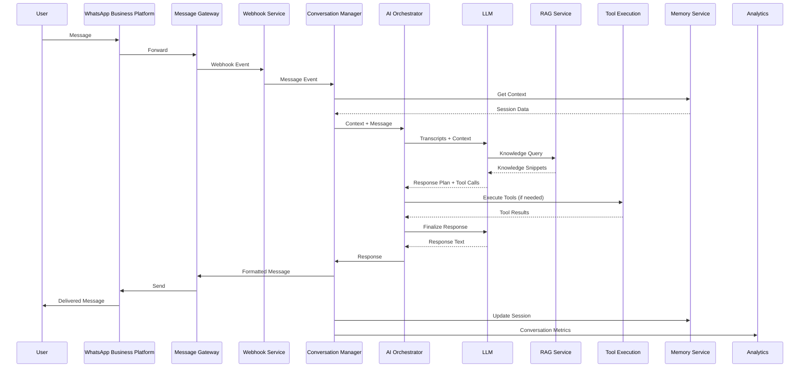
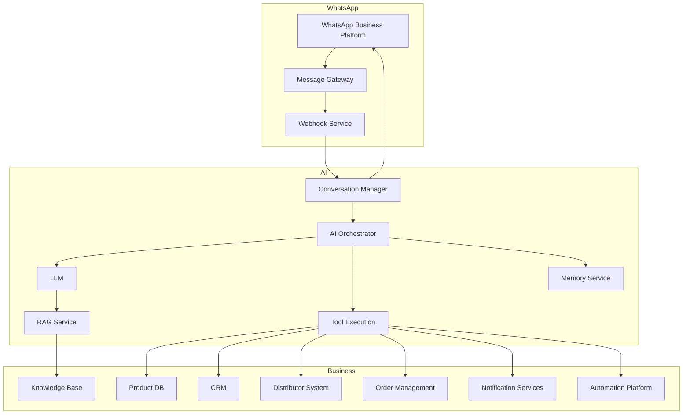
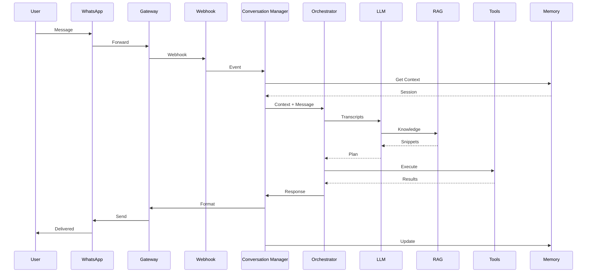
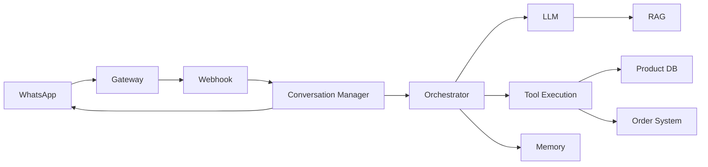
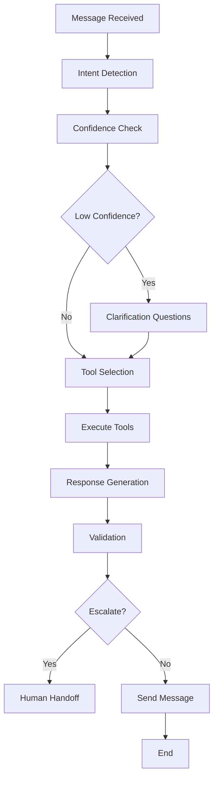
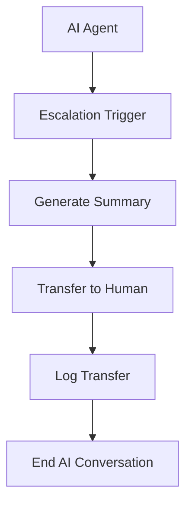
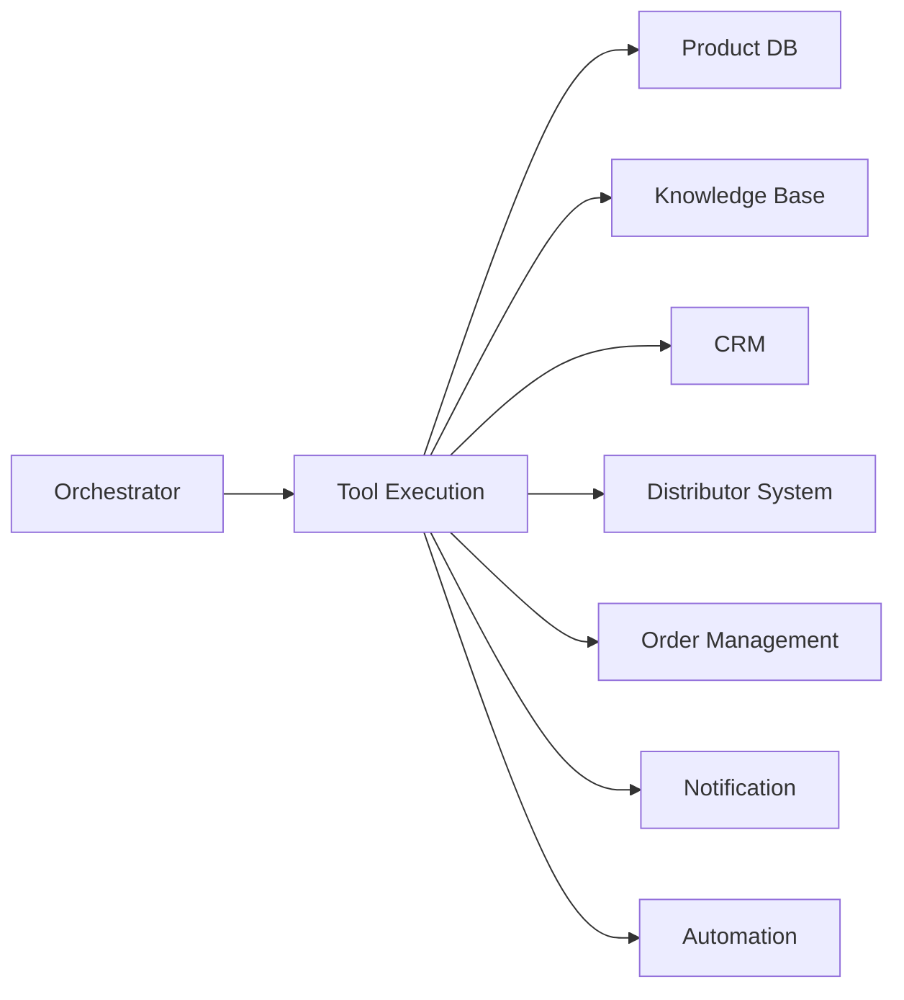

# 02_System_Architecture/06_WHATSAPP_AI_ARCHITECTURE.md

# Dayjoy Enterprise AI Platform — WhatsApp AI Architecture

> **Purpose:** Define the logical architecture for the Dayjoy WhatsApp AI Assistant, covering messaging workflows, AI orchestration, knowledge retrieval, backend integrations, automation, security, and human escalation.
>
> **Scope:** Enterprise WhatsApp AI architecture — business objectives, components, workflows, system interactions, security, performance, and monitoring. No implementation code or low-level API schemas.
>
> **Audience:** AI architects, messaging/automation engineers, DevOps, security teams, and AI coding assistants.

---

## Table of Contents

1. [WhatsApp AI Overview](#1-whatsapp-ai-overview)
2. [Architecture Components](#2-architecture-components)
3. [Message Lifecycle](#3-message-lifecycle)
4. [Conversation Scenarios](#4-conversation-scenarios)
5. [AI Decision Flow](#5-ai-decision-flow)
6. [Tool Integration](#6-tool-integration)
7. [Rich Messaging](#7-rich-messaging)
8. [Human Handoff](#8-human-handoff)
9. [Security & Privacy](#9-security--privacy)
10. [Performance Requirements](#10-performance-requirements)
11. [Error Handling](#11-error-handling)
12. [Monitoring & Analytics](#12-monitoring--analytics)
13. [Future Enhancements](#13-future-enhancements)
14. [Architecture Diagrams](#14-architecture-diagrams)

---

## 1. WhatsApp AI Overview

### 1.1 Business Objectives

The Dayjoy WhatsApp AI Assistant provides **intelligent, conversational support** for customers and distributors via WhatsApp, improving accessibility, reducing support load, and standardizing response quality.[Project_Context/04_AI_VISION.md][Project_Context/07_BUSINESS_PROCESSES.md]

Objectives:

- Offer 24/7 support for common queries.
- Reduce average handling time and escalations.
- Provide consistent, knowledge-grounded answers for products, orders, and distributor policies.[05_Policies.md][03_Product_Research.md][04_Distributor_System.md]

### 1.2 Supported Users

- **Customers:** Product/order/return queries, complaints, registration interest.
- **Distributors:** Business, compensation, training, order support.
- **Internal Teams:** Support and operations for escalations and follow-ups.

### 1.3 Primary Use Cases (Logical)

- Product information and recommendations.
- Order status and tracking.
- Returns and refunds guidance.
- Distributor registration and onboarding.
- Distributor support (compensation, rank, training).
- Complaint handling and ticket creation.
- FAQ resolution (policies, processes).
- Marketing campaign responses (opt-in, content requests).
- Human agent request.

### 1.4 Business Value

- Higher resolution rate without human agents.
- Faster responses and shorter resolution times.
- Improved user satisfaction and consistency.
- Centralized, auditable conversation intelligence for quality and process improvement.[Project_Context/15_SUCCESS_METRICS.md]

---

## 2. Architecture Components

### 2.1 Component Catalog

| Component ID | Component Name | Purpose | Responsibilities | Inputs | Outputs | Dependencies |
|---|---|---|---|---|---|---|
| COMP-WA-001 | WhatsApp Business Platform | Provide WhatsApp messaging channel | Manage WhatsApp Business API, templates, sessions | Message requests, template configs | Messages, delivery status | Meta/WhatsApp |
| COMP-WA-002 | Message Gateway | Bridge WhatsApp and internal services | Route messages, normalize formats | WhatsApp events, internal messages | Normalized events, API calls | WhatsApp Business Platform |
| COMP-WA-003 | Webhook Service | Receive incoming messages | Handle webhooks from WhatsApp, validate, dispatch | Webhook events | Internal message events | WhatsApp Business Platform |
| COMP-WA-004 | Conversation Manager | Manage conversation state and flow | Track sessions, threads, context | Message events, session data | Conversation state, next actions | Memory Service, AI Orchestrator |
| COMP-WA-005 | AI Orchestrator | Coordinate AI and tools | Intent routing, tool coordination, escalation | Transcripts, context, knowledge | AI decisions, tool calls, response content | LLM, RAG Service, Tool Execution |
| COMP-LLM-001 | LLM | Language understanding and generation | Intent detection, reasoning, response planning | Transcripts, context, knowledge | Response text, tool decisions | AI Orchestrator |
| COMP-RAG-001 | RAG Service | Knowledge retrieval | Retrieve relevant knowledge for responses | Queries, context | Knowledge snippets | Knowledge Service, Vector Store |
| COMP-MEM-001 | Memory Service | Maintain session and preference memory | Store/retrieve conversation context and preferences | Session IDs, context | Session data | Database/Cache |
| COMP-TOOL-001 | Tool Execution Engine | Execute actions in business systems | Call domain APIs, trigger workflows | Tool requests | Tool results | Domain APIs, Automation Platform |
| COMP-NOTIF-001 | Notification Service | Multi-channel notification orchestration | Send notifications via WhatsApp, SMS, email | Notification requests | Delivery status | WhatsApp Business Platform, Email/SMS providers |
| COMP-ANL-001 | Analytics | Collect and analyze conversation metrics | Metrics, dashboards, reports | Conversation logs, events | Dashboards, reports | Logging Service, Monitoring |
| COMP-MON-001 | Monitoring | Monitor system health | Track latency, errors, availability | Metrics, logs | Alerts, dashboards | Logging Service, Metrics |

---

## 3. Message Lifecycle

### 3.1 Lifecycle Stages

1. **Message Received:**
   - User sends a message via WhatsApp.

2. **User Identification:**
   - Identify user by phone number and link to profile (customer, distributor, unknown).

3. **Intent Detection:**
   - AI Orchestrator classifies intent (product inquiry, order status, distributor support, complaint, etc.).

4. **Context Collection:**
   - Retrieve session context and user profile from Memory Service.

5. **Knowledge Retrieval:**
   - Call RAG Service for relevant knowledge snippets.

6. **Tool Execution:**
   - If needed, call domain APIs (order status, distributor profile, etc.).

7. **AI Response:**
   - LLM generates response text based on context and knowledge.

8. **Message Formatting:**
   - Format response as appropriate WhatsApp message type (text, list, buttons, etc.).

9. **Delivery:**
   - Send message via WhatsApp Business Platform.

10. **Conversation Memory Update:**
   - Store conversation context and outcomes.

### 3.2 Message Lifecycle Diagram

---

## 4. Conversation Scenarios

### 4.1 Product Information

- **Trigger:** User asks about product features, benefits, usage.
- **Flow:**
  - Detect product inquiry intent.
  - Retrieve product knowledge via RAG.
  - Provide summary and guidance.
  - Offer additional help or transfer if needed.

### 4.2 Product Recommendation

- **Trigger:** User asks for product suggestions.
- **Flow:**
  - Understand user needs and preferences.
  - Retrieve product knowledge and recommendations.
  - Provide tailored suggestions.
  - Offer links or follow-up.

### 4.3 Order Status

- **Trigger:** User asks about order status.
- **Flow:**
  - Verify order identifier (order ID/phone/email).
  - Call Order Service for status.
  - Provide status and expected delivery.
  - Offer escalation for issues.

### 4.4 Distributor Registration

- **Trigger:** User expresses interest in becoming a distributor.
- **Flow:**
  - Provide registration steps and requirements.
  - Retrieve relevant policy and onboarding docs.
  - Offer links via WhatsApp or transfer to human.

### 4.5 Distributor Support

- **Trigger:** Distributor asks about compensation, rank, training.
- **Flow:**
  - Verify distributor identity (if sensitive).
  - Retrieve distributor docs and policy knowledge.
  - Optionally call Distributor Service for profile/compensation summaries.
  - Explain results and next steps.

### 4.6 Complaint Handling

- **Trigger:** User expresses complaint or dissatisfaction.
- **Flow:**
  - Detect complaint intent.
  - Collect key details (order, product, issue).
  - Create support ticket via Support/Ticketing Service.
  - Provide ticket reference and next steps.
  - Offer human follow-up if needed.

### 4.7 FAQ Resolution

- **Trigger:** General policy or process questions.
- **Flow:**
  - Retrieve FAQ and policy knowledge.
  - Provide concise answers.
  - Offer escalation for complex cases.

### 4.8 Marketing Campaign Responses

- **Trigger:** User responds to marketing campaign.
- **Flow:**
  - Detect campaign intent.
  - Provide relevant content or offers.
  - Capture interest and follow-up.

### 4.9 Human Agent Request

- **Trigger:** User explicitly requests human or escalation needed.
- **Flow:**
  - Detect escalation need.
  - Prepare conversation summary and context.
  - Transfer to human agent queue.
  - Log transfer and reason.

---

## 5. AI Decision Flow

### 5.1 Decision Steps

1. **Intent Classification:**
   - Classify user intent (product, order, distributor, complaint, FAQ, marketing, etc.).

2. **Context Evaluation:**
   - Evaluate session context and user profile.

3. **Confidence Scoring:**
   - Evaluate confidence in intent and response.

4. **Clarification Strategy:**
   - Ask 1–2 focused questions if intent or data is unclear.

5. **Tool Selection:**
   - Decide whether to call domain APIs (order status, distributor profile, etc.).

6. **Response Validation:**
   - Validate responses against guardrails and permissions.

7. **Escalation Rules:**
   - Escalate when:
     - Low confidence on critical decisions.
     - Policy exceptions requested.
     - Serious complaints or technical failures.
     - Sensitive financial or legal issues.

---

## 6. Tool Integration

### 6.1 Tool Categories

WhatsApp AI interacts with:

- **Product Database:** Product details and recommendations.
- **Knowledge Base:** Policies, product docs, SOPs.
- **CRM:** User profiles, history.
- **Distributor System:** Distributor profiles and compensation.
- **Order Management:** Order status and tracking.
- **Payment Status:** Payment verification (future).
- **Calendar:** Appointment scheduling (future).
- **Notification Services:** SMS/WhatsApp follow-ups.
- **Automation Platform:** Workflows (reminders, training, tickets).

### 6.2 Tool Interaction Matrix

| Tool Category | Example Tools | Used By WhatsApp AI | Typical Use Cases |
|---|---|---|---|
| Product DB | `get_product_details`, `search_products` | Product Info, Recommendations | Product info |
| Knowledge Base | `search_knowledge`, `get_policy` | All | Answering questions |
| CRM | `get_user_profile`, `get_interaction_history` | All | Personalization, context |
| Distributor System | `get_distributor_profile`, `get_compensation_summary` | Distributor Support | Earnings, rank |
| Order Management | `get_order_status`, `track_order` | Order Status | Order tracking |
| Payment Status | `check_payment_status` | Future | Payment verification |
| Calendar | `schedule_appointment` | Future | Appointments |
| Notification Services | `send_sms`, `send_whatsapp` | All | Follow-ups, links |
| Automation Platform | `create_ticket`, `trigger_reminder` | Complaint, Registration | Workflows |

---

## 7. Rich Messaging

### 7.1 Supported Message Types

| Message Type | When to Use |
|---|---|
| Text | Simple answers, explanations, confirmations |
| Images | Product images, marketing visuals |
| Documents | Policies, guides, forms |
| Audio | Voice notes (future), audio guides |
| Videos | Product demos, training clips |
| Interactive Buttons | Quick actions (e.g., "Check Order", "Talk to Human") |
| List Messages | Product lists, options |
| Quick Replies | Fast responses to common queries |
| Templates | Structured notifications (order updates, reminders) |

### 7.2 Usage Guidelines

- Use **text** for most conversational responses.
- Use **images/videos** for product demos and marketing.
- Use **documents** for policies and detailed guides.
- Use **interactive buttons/lists** for structured choices.
- Use **templates** for notifications and reminders.

---

## 8. Human Handoff

### 8.1 Escalation Criteria

- Low-confidence responses on critical topics.
- Sensitive or complex complaints.
- Policy exceptions or disputes.
- Repeated failed AI attempts.
- User explicitly requests human.

### 8.2 Context Transfer

- Transfer includes:
  - User identity and profile.
  - Conversation summary and key data.
  - Relevant tool results and knowledge used.

### 8.3 Conversation Summary

- Summary includes:
  - User intent.
  - Key details (order, product, issue).
  - Actions taken.

### 8.4 Agent Assignment

- Assign to appropriate support agent or queue.

### 8.5 Resume Workflow

- If human agent needs AI assistance, AI can rejoin as a support tool.

---

## 9. Security & Privacy

### 9.1 User Verification

- Verify identity for sensitive actions (order changes, compensation details).

### 9.2 Authentication

- Use phone number, order ID, or distributor ID as needed.

### 9.3 Authorization

- Restrict access to sensitive data based on user role.

### 9.4 Data Encryption

- Use encrypted channels (HTTPS) for all API calls.

### 9.5 Consent Management

- Manage user consent for notifications and data usage.

### 9.6 Audit Logs

- Log authentication, tool calls, escalations, and sensitive actions.

### 9.7 Sensitive Data Protection

- Do not expose sensitive data unnecessarily.
- Mask or summarize sensitive details.

---

## 10. Performance Requirements

### 10.1 Response Time

- Target: < 2–3 seconds for AI response.

### 10.2 Message Delivery Success

- High delivery success rate (> 95%).

### 10.3 AI Accuracy

- High accuracy in intent detection and response quality.

### 10.4 System Availability

- High availability for 24/7 support.

### 10.5 Scalability

- Support peak message volumes.

### 10.6 Concurrent Conversations

- Scale to handle simultaneous conversations without degradation.

---

## 11. Error Handling

### 11.1 Message Delivery Failures

- Retry failed messages.
- Offer alternative channels (SMS/email).

### 11.2 AI Errors

- Handle AI errors gracefully.
- Offer human support if needed.

### 11.3 API Failures

- If domain APIs fail:
  - Inform user of temporary issue.
  - Offer escalation or callback.

### 11.4 Missing Knowledge

- If knowledge retrieval fails:
  - Use cached or general knowledge.
  - Offer escalation.

### 11.5 Invalid Requests

- Handle malformed or unsupported requests.
- Provide guidance or alternative actions.

### 11.6 Integration Failures

- Handle integration failures gracefully.
- Log and alert for investigation.

### 11.7 Timeout Scenarios

- Handle timeouts with retries or fallbacks.
- Inform user of delays.

---

## 12. Monitoring & Analytics

### 12.1 Key Metrics

| Metric | Description |
|---|---|
| Active Conversations | Number of ongoing conversations |
| Resolution Rate | % conversations resolved by AI |
| Escalation Rate | % conversations escalated to human |
| Average Response Time | Time to first AI response |
| Customer Satisfaction | User ratings or feedback |
| AI Accuracy | Intent detection and response accuracy |
| Tool Success Rate | % successful tool calls |
| Conversation Completion Rate | % conversations completed successfully |

---

## 13. Future Enhancements

### 13.1 Voice Notes Understanding (Future)

- Understand and respond to voice notes.

### 13.2 Image Recognition (Future)

- Analyze images sent by users (e.g., receipts, products).

### 13.3 Document Analysis (Future)

- Extract information from documents sent by users.

### 13.4 Multilingual Conversations (Future)

- Support for multiple languages and dialects.

### 13.5 Proactive Notifications (Future)

- Initiate conversations for reminders, updates, promotions.

### 13.6 Personalized Recommendations (Future)

- Tailor recommendations based on user history and preferences.

### 13.7 Multi-Agent Collaboration (Future)

- Multiple AI agents collaborating on complex conversations.

All future features must integrate with existing security, governance, and performance models.

---

## 14. Architecture Diagrams

### 14.1 WhatsApp AI Architecture

### 14.2 Message Lifecycle

### 14.3 Component Interaction

### 14.4 AI Decision Flow

### 14.5 Human Escalation Flow

### 14.6 Tool Integration

### 14.7 Conversation State Flow

```mermaid
flowchart LR
    START[Start] --> IDENTIFY[User Identification]
    IDENTIFY --> CONTEXT[Context Collection]
    CONTEXT --> INTENT[Intent Detection]
    INTENT --> KNOWLEDGE[Knowledge Retrieval]
    KNOWLEDGE --> TOOLS[Tool Execution]
    TOOLS --> RESPONSE[Response Generation]
    RESPONSE --> SEND[Send Message]
    SEND --> UPDATE[Update Memory]
    UPDATE --> END[End]
```

---

**END OF DOCUMENT**