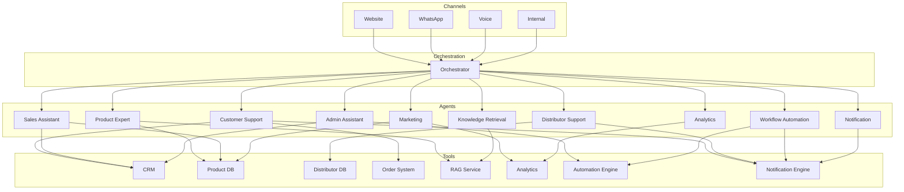
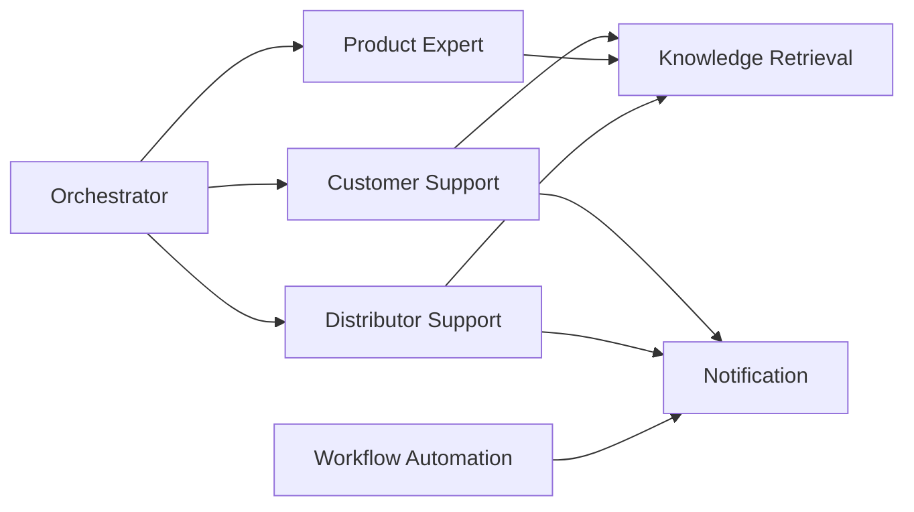
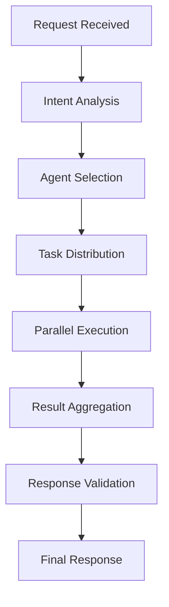
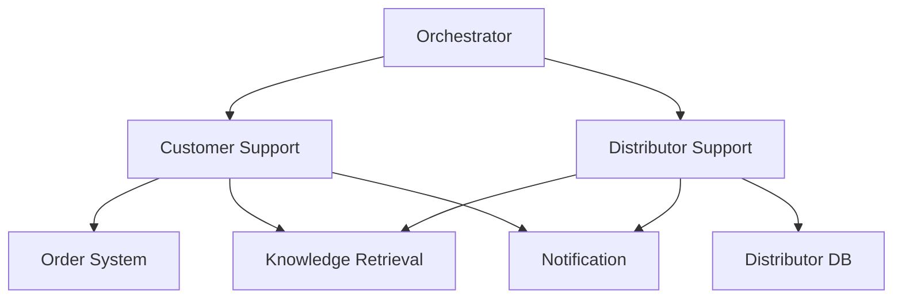
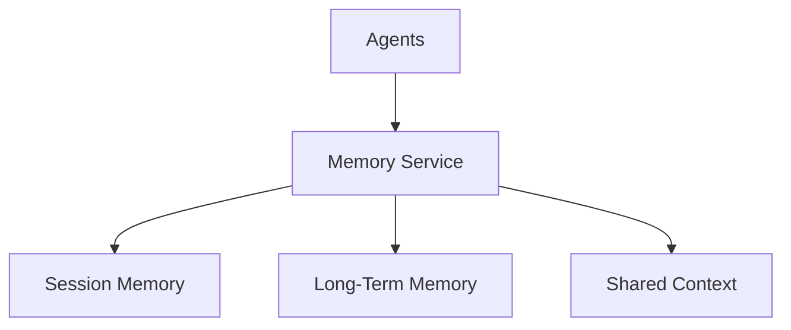
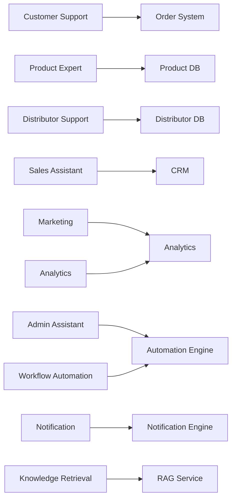
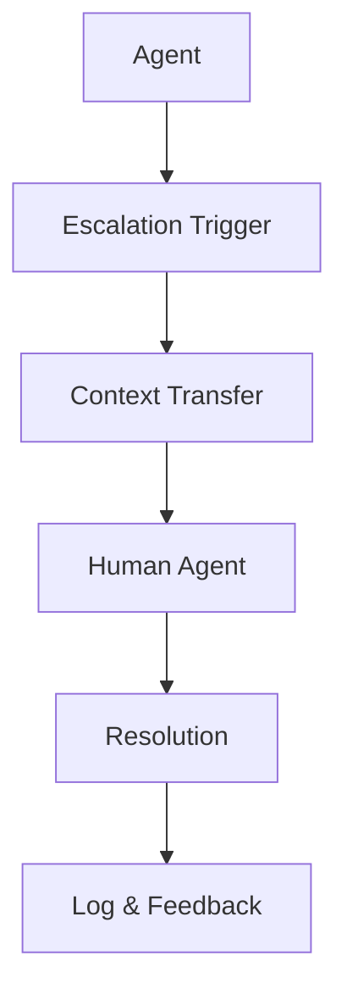

# 02_System_Architecture/07_AGENT_ARCHITECTURE.md

# Dayjoy Enterprise AI Platform — Multi-Agent Architecture

> **Purpose:** Define the logical multi-agent architecture for the Dayjoy Enterprise AI Platform, describing specialized AI agents, their responsibilities, communication, orchestration, governance, and lifecycle.
>
> **Scope:** Enterprise multi-agent architecture — agent roles, boundaries, communication patterns, orchestration, shared context, tool access, security, reliability, and scalability. No implementation code or low-level API schemas.
>
> **Audience:** AI architects, solution architects, developers, DevOps, security teams, and AI coding assistants.

---

## Table of Contents

1. [Multi-Agent Overview](#1-multi-agent-overview)
2. [Agent Catalog](#2-agent-catalog)
3. [Agent Roles & Boundaries](#3-agent-roles--boundaries)
4. [Agent Communication](#4-agent-communication)
5. [Orchestration Layer](#5-orchestration-layer)
6. [Shared Context & Memory](#6-shared-context--memory)
7. [Tool Access Model](#7-tool-access-model)
8. [Knowledge Access](#8-knowledge-access)
9. [Human Collaboration](#9-human-collaboration)
10. [Security & Governance](#10-security--governance)
11. [Reliability & Fault Tolerance](#11-reliability--fault-tolerance)
12. [Performance & Scalability](#12-performance--scalability)
13. [Future Agent Expansion](#13-future-agent-expansion)
14. [Architecture Diagrams](#14-architecture-diagrams)

---

## 1. Multi-Agent Overview

### 1.1 Why a Multi-Agent Architecture

The Dayjoy Enterprise AI Platform uses a **multi-agent architecture** to support diverse business domains (customer support, distributor operations, sales, marketing, analytics, admin) while maintaining security, context integrity, and operational reliability.[Project_Context/04_AI_VISION.md][Project_Context/13_AI_BEHAVIOR.md]

A single monolithic assistant would:

- Struggle to encode specialized domain knowledge and behaviors.
- Be harder to secure and govern.
- Be more brittle and difficult to scale or evolve.

### 1.2 Benefits Over a Single Assistant

- **Specialization:** Each agent focuses on a specific domain (e.g., Product Expert, Distributor Support).
- **Security & Governance:** Agents operate within defined permission and knowledge boundaries.
- **Scalability:** Agents can be scaled and updated independently.
- **Reliability:** Failures in one agent do not cascade to others.
- **Maintainability:** Easier to update, test, and govern specialized agents.

### 1.3 Business Value

- **Improved Accuracy:** Domain-specific agents provide more accurate, context-aware responses.[03_Product_Research.md][04_Distributor_System.md][05_Policies.md]
- **Faster Resolution:** Specialized agents reduce handling time for common scenarios.
- **Better Governance:** Clear ownership and audit trails per agent and domain.
- **Flexibility:** Easier to add new agents or channels without disrupting existing ones.

### 1.4 Design Goals

- **Modularity:** Clear separation of concerns and responsibilities.
- **Security:** Enforce RBAC and least privilege per agent.
- **Governance:** Centralized logging, audit, and policy enforcement.
- **Scalability:** Support concurrent agent execution and high load.
- **Reliability:** Graceful degradation and recovery from failures.

---

## 2. Agent Catalog

### 2.1 Agent List

| Agent ID | Agent Name | Purpose | Responsibilities | Users | Inputs | Outputs | Available Tools | Knowledge Access | Permissions | Owner |
|---|---|---|---|---|---|---|---|---|---|---|
| AGT-CS-001 | Customer Support Agent | Handle customer support queries | Order status, returns/refunds, complaints, FAQs | Customers | Chat/voice messages, user context | Responses, tool calls, escalations | Order, Returns, Support, Notification | Customer FAQs, Policies, SOPs | Customer data access | CX / Support |
| AGT-PROD-001 | Product Expert Agent | Provide product information and recommendations | Product details, comparisons, recommendations | Customers, Distributors | Product queries, user preferences | Product info, recommendations | Product DB, Notification | Product docs, research | Product catalog access | Product Team |
| AGT-DIST-001 | Distributor Support Agent | Assist distributors with business queries | Compensation, rank, onboarding, training | Distributors | Distributor queries, identity | Guidance, summaries, escalations | Distributor, Compensation, Notification | Distributor guides, policies | Distributor data access | Distributor Mgmt |
| AGT-SALES-001 | Sales Assistant Agent | Support sales and lead conversion | Lead follow-up, recommendations, sales insights | Distributors, Sales | Lead data, product queries | Recommendations, summaries | CRM, Product, Notification | Sales docs, product info | Sales data access | Sales Team |
| AGT-VOICE-001 | Voice AI Agent | Handle voice calls | Inbound/outbound call handling | Customers, Distributors | Voice transcripts, call context | Spoken responses, tool calls | Telephony, Order, Distributor, Notification | FAQs, policies, product docs | Role-based access | AI / Voice Ops |
| AGT-WA-001 | WhatsApp AI Agent | Handle WhatsApp conversations | Chat support, notifications, workflows | Customers, Distributors | WhatsApp messages, user context | Responses, tool calls, notifications | WhatsApp, Order, Distributor, Notification | FAQs, policies, product docs | Role-based access | AI / CX |
| AGT-WEB-001 | Website Chat Agent | Handle website chat interactions | Website-based support and guidance | Customers, Distributors | Chat messages, session context | Responses, tool calls, escalations | Website, Order, Product, Notification | FAQs, policies, product docs | Role-based access | AI / Web Team |
| AGT-KB-001 | Knowledge Retrieval Agent | Provide knowledge retrieval for other agents | RAG orchestration, knowledge filtering | Other AI agents | Knowledge queries, context | Knowledge snippets, citations | RAG, Knowledge Service | All knowledge (filtered) | Read-only knowledge | Knowledge Team |
| AGT-MKT-001 | Marketing Agent | Support marketing content and campaigns | Draft content, campaign ideas, messaging | Marketing team | Campaign briefs, brand rules | Content drafts, suggestions | Notification, Analytics | Brand rules, marketing docs | Marketing data access | Marketing Team |
| AGT-ANL-001 | Analytics Agent | Provide analytics summaries and insights | KPI summaries, trend analysis | Management, Operations | Metrics queries, filters | Summaries, insights | Analytics, Logging | Analytics docs, metrics | Analytics data access | Analytics Team |
| AGT-ADM-001 | Admin Assistant Agent | Assist administrators with configuration and governance | User/role management, AI config, knowledge governance | Administrators | Admin queries, config requests | Config changes, summaries | Admin, User Mgmt, Knowledge | Admin docs, AI behavior | Admin access | Admin / IT |
| AGT-AUTO-001 | Workflow Automation Agent | Orchestrate automation workflows | Trigger workflows, monitor status | Other AI agents, internal users | Workflow requests | Workflow results, status | Automation Engine, Notification | SOPs, workflow docs | Workflow access | Operations / IT |
| AGT-NOTIF-001 | Notification Agent | Manage notifications across channels | Send notifications, track delivery | Other AI agents, internal users | Notification requests | Delivery status | Email, SMS, WhatsApp | Notification templates | Notification access | Operations / CX |

---

## 3. Agent Roles & Boundaries

### 3.1 Responsibility Examples

| Agent | Responsible For | Must Never Do | Permission Boundaries | Business Ownership | Escalation Authority |
|---|---|---|---|---|---|
| Customer Support Agent | Order status, returns, complaints, FAQs | Modify orders or financial data | Customer data only | CX / Support | Support Manager |
| Product Expert Agent | Product info, recommendations | Promise pricing or guarantees | Product catalog only | Product Team | Product Manager |
| Distributor Support Agent | Compensation, rank, onboarding | Approve exceptions or payouts | Distributor data only | Distributor Mgmt | Distributor Manager |
| Sales Assistant Agent | Lead follow-up, recommendations | Commit to deals or pricing | Sales data only | Sales Team | Sales Manager |
| Voice AI Agent | Voice call handling | Access unauthorized data | Role-based access | AI / Voice Ops | Voice Ops Manager |
| WhatsApp AI Agent | WhatsApp conversations | Expose sensitive data | Role-based access | AI / CX | CX Manager |
| Website Chat Agent | Website chat interactions | Bypass authentication | Role-based access | AI / Web Team | Web Manager |
| Knowledge Retrieval Agent | Knowledge retrieval | Modify knowledge | Read-only knowledge | Knowledge Team | Knowledge Lead |
| Marketing Agent | Marketing content | Publish without approval | Marketing data only | Marketing Team | Marketing Manager |
| Analytics Agent | Analytics summaries | Expose sensitive metrics | Analytics data only | Analytics Team | Analytics Manager |
| Admin Assistant Agent | Admin configuration | Approve risky changes | Admin access only | Admin / IT | IT Manager |
| Workflow Automation Agent | Workflow orchestration | Execute unauthorized actions | Workflow access only | Operations / IT | Ops Manager |
| Notification Agent | Notification delivery | Send unauthorized messages | Notification access only | Operations / CX | Ops Manager |

---

## 4. Agent Communication

### 4.1 Communication Patterns

- **Direct Requests:** One agent calls another for specific data or action (e.g., Website Chat → Knowledge Retrieval).
- **Shared Context:** Agents share session and user context via Memory Service.
- **Event-Based Communication:** Agents publish/subscribe to events (e.g., OrderCreated, ComplaintRaised).
- **Task Delegation:** Orchestrator delegates tasks to specialized agents.
- **Result Sharing:** Agents share results back to orchestrator or calling agent.
- **Failure Notifications:** Agents notify orchestrator of failures for recovery or escalation.

### 4.2 Communication Matrix (Simplified)

| From Agent | To Agent | Communication Type | Purpose |
|---|---|---|---|
| Website Chat | Knowledge Retrieval | Direct Request | Retrieve knowledge |
| WhatsApp AI | Knowledge Retrieval | Direct Request | Retrieve knowledge |
| Voice AI | Knowledge Retrieval | Direct Request | Retrieve knowledge |
| Customer Support | Order System (via Tool) | Tool Call | Order status |
| Distributor Support | Distributor System (via Tool) | Tool Call | Distributor profile |
| Sales Assistant | CRM (via Tool) | Tool Call | Lead data |
| Marketing | Analytics | Direct Request | Campaign metrics |
| Admin Assistant | User Mgmt (via Tool) | Tool Call | User/role config |
| Workflow Automation | Notification | Direct Request | Trigger notification |
| Any Agent | Orchestrator | Event | Status, failure, escalation |

---

## 5. Orchestration Layer

### 5.1 Orchestration Process

1. **Request Reception:**
   - Receive user request from channel (Website, WhatsApp, Voice, Internal).

2. **Intent Analysis:**
   - Analyze intent and domain (customer, distributor, product, sales, etc.).

3. **Agent Selection:**
   - Select primary agent (e.g., Customer Support, Distributor Support).

4. **Task Distribution:**
   - Distribute tasks to specialized agents (e.g., Knowledge Retrieval, Workflow Automation).

5. **Parallel Execution:**
   - Execute independent tasks in parallel where possible.

6. **Result Aggregation:**
   - Aggregate results from multiple agents.

7. **Response Validation:**
   - Validate responses against guardrails and permissions.

8. **Final Response:**
   - Send consolidated response to user.

---

## 6. Shared Context & Memory

### 6.1 Context Types

- **Conversation Context:** Current conversation state, messages, intents.
- **Business Context:** Domain-specific data (order, product, distributor).
- **User Context:** User identity, role, preferences.
- **Shared Memory:** Common data accessible to all agents (e.g., session ID).
- **Session Memory:** Short-term memory for current session.
- **Long-Term Memory:** Persistent preferences and history (where allowed).

### 6.2 Safe Context Sharing

- Context is shared via Memory Service with RBAC.
- Agents only access context they are authorized for.
- Sensitive data is masked or restricted.

---

## 7. Tool Access Model

### 7.1 Agent × Tool Access Matrix

| Agent | RAG | CRM | Product DB | Distributor DB | Order System | Calendar | Notification | Analytics | Automation |
|---|---|---|---|---|---|---|---|---|---|
| Customer Support | ✅ | ✅ | ✅ | ❌ | ✅ | ❌ | ✅ | ❌ | ✅ |
| Product Expert | ✅ | ❌ | ✅ | ❌ | ❌ | ❌ | ✅ | ❌ | ❌ |
| Distributor Support | ✅ | ❌ | ❌ | ✅ | ❌ | ❌ | ✅ | ❌ | ✅ |
| Sales Assistant | ✅ | ✅ | ✅ | ❌ | ❌ | ✅ | ✅ | ❌ | ✅ |
| Voice AI | ✅ | ✅ | ✅ | ✅ | ✅ | ❌ | ✅ | ❌ | ✅ |
| WhatsApp AI | ✅ | ✅ | ✅ | ✅ | ✅ | ❌ | ✅ | ❌ | ✅ |
| Website Chat | ✅ | ✅ | ✅ | ✅ | ✅ | ❌ | ✅ | ❌ | ✅ |
| Knowledge Retrieval | ✅ | ❌ | ❌ | ❌ | ❌ | ❌ | ❌ | ❌ | ❌ |
| Marketing | ✅ | ❌ | ✅ | ❌ | ❌ | ❌ | ✅ | ✅ | ✅ |
| Analytics | ✅ | ❌ | ❌ | ❌ | ❌ | ❌ | ❌ | ✅ | ❌ |
| Admin Assistant | ✅ | ❌ | ❌ | ❌ | ❌ | ❌ | ✅ | ✅ | ✅ |
| Workflow Automation | ❌ | ❌ | ❌ | ❌ | ❌ | ❌ | ✅ | ❌ | ✅ |
| Notification | ❌ | ❌ | ❌ | ❌ | ❌ | ❌ | ✅ | ❌ | ❌ |

---

## 8. Knowledge Access

### 8.1 Knowledge Categories

- **Shared Knowledge:** FAQs, policies, product docs (accessible to all agents with filters).
- **Private Knowledge:** Internal SOPs, admin docs (restricted access).
- **Department-Specific Knowledge:** Distributor guides, sales docs (role-based access).
- **Permission-Based Retrieval:** RAG filters by access level and role.
- **Knowledge Validation Rules:** Only Approved/Verified knowledge used for critical responses.[Project_Context/11_DOCUMENTATION_RULES.md]

---

## 9. Human Collaboration

### 9.1 Human Approval Points

- Sensitive actions (refunds, compensation changes).
- Policy exceptions.
- High-value transactions.

### 9.2 Escalation Workflow

- Agent detects need for human.
- Context and summary transferred.
- Human agent assigned.
- AI logs and monitors.

### 9.3 Human Override

- Humans can override AI decisions.
- AI logs override for audit.

### 9.4 Manual Review

- Periodic review of AI actions and escalations.

### 9.5 Feedback Loop

- Human feedback used to improve AI behavior and knowledge.

---

## 10. Security & Governance

### 10.1 Authentication

- All agents authenticate via central Auth Service.

### 10.2 Authorization

- RBAC enforces agent permissions.

### 10.3 Role-Based Permissions

- Agents have least-privilege access.

### 10.4 Audit Logging

- All agent actions logged for audit.

### 10.5 Action Validation

- Critical actions validated against policies.

### 10.6 Sensitive Operations

- Sensitive operations require extra checks and human approval.

### 10.7 Compliance Requirements

- Agents comply with data privacy and regulatory requirements.

---

## 11. Reliability & Fault Tolerance

### 11.1 Agent Failure

- If agent fails, orchestrator retries or delegates to backup agent.

### 11.2 Timeout

- Timeouts trigger retries or fallback responses.

### 11.3 Retry

- Transient failures retried with backoff.

### 11.4 Backup Agent

- Backup agents handle critical functions if primary fails.

### 11.5 Partial Completion

- Partial results returned with clear messaging.

### 11.6 Recovery Workflow

- Failed tasks logged and recovered asynchronously.

---

## 12. Performance & Scalability

### 12.1 Concurrent Agent Execution

- Agents execute concurrently for parallel tasks.

### 12.2 Load Distribution

- Load balancers distribute agent requests.

### 12.3 Response Time Targets

- Target: < 2–3 seconds for most responses.

### 12.4 Resource Optimization

- Cache frequently used knowledge and data.

### 12.5 Future Scaling Strategy

- Horizontal scaling of agents and services.
- Add new agents without disrupting existing ones.

---

## 13. Future Agent Expansion

### 13.1 Future Specialized Agents

| Agent ID | Agent Name | Purpose | Status |
|---|---|---|---|
| AGT-FIN-001 | Finance Agent | Financial queries, reporting | Future |
| AGT-HR-001 | HR Agent | HR queries, employee support | Future |
| AGT-INV-001 | Inventory Agent | Inventory status, alerts | Future |
| AGT-TRN-001 | Training Agent | Training content, progress | Future |
| AGT-DOC-001 | Document Processing Agent | Document analysis, extraction | Future |
| AGT-IMG-001 | Image Analysis Agent | Image recognition, analysis | Future |
| AGT-PRED-001 | Predictive Analytics Agent | Predictive insights | Future |
| AGT-EXEC-001 | Executive Assistant Agent | Executive support | Future |

All future agents must integrate with existing orchestration, security, and governance models.

---

## 14. Architecture Diagrams

### 14.1 Multi-Agent Architecture

### 14.2 Agent Communication Flow

### 14.3 Orchestration Workflow

### 14.4 Task Delegation Flow

### 14.5 Shared Memory Architecture

### 14.6 Tool Access Relationships

### 14.7 Human Escalation Flow

---

**END OF DOCUMENT**