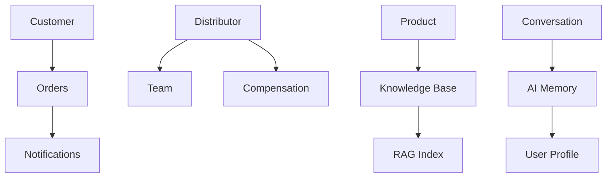
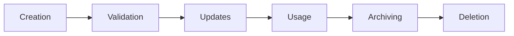
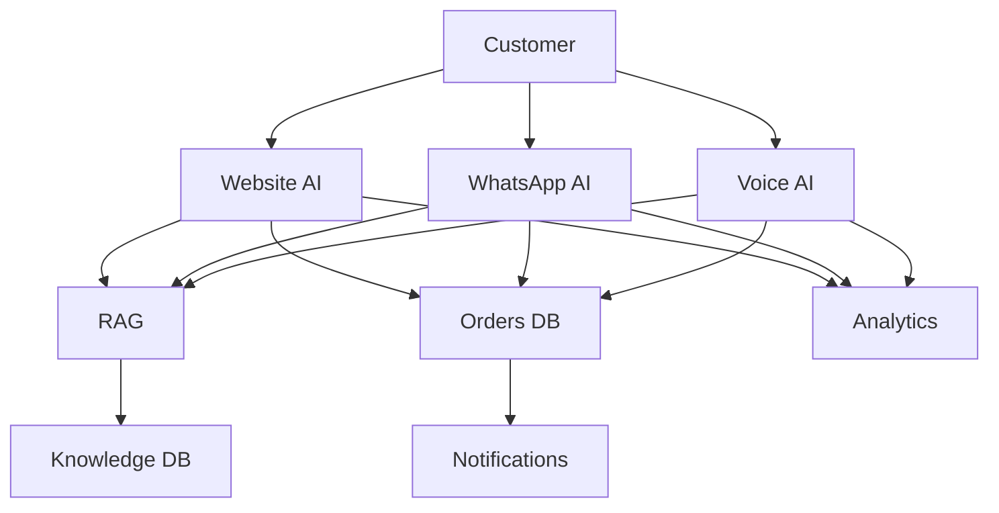
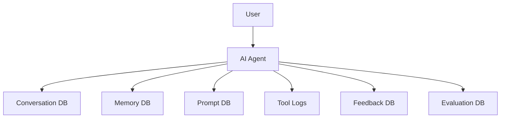
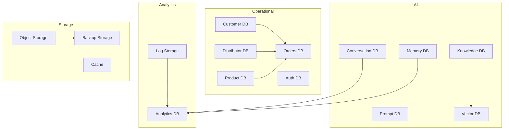
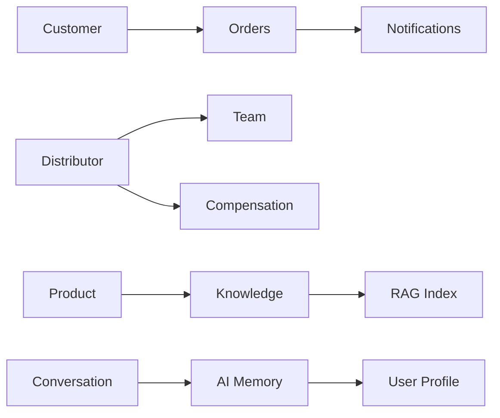
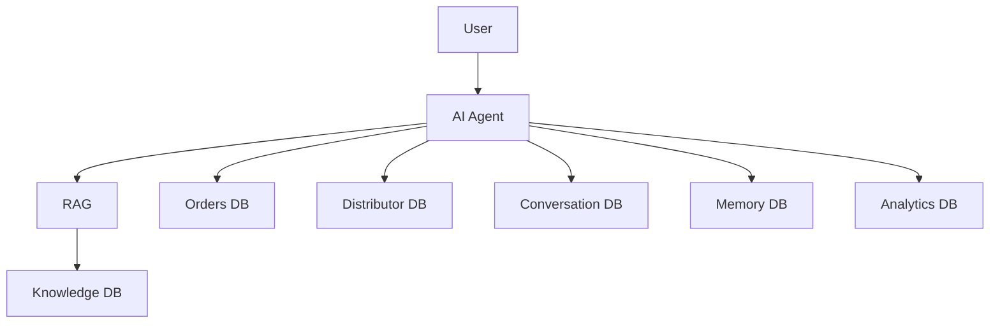
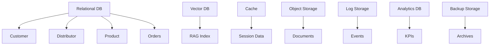
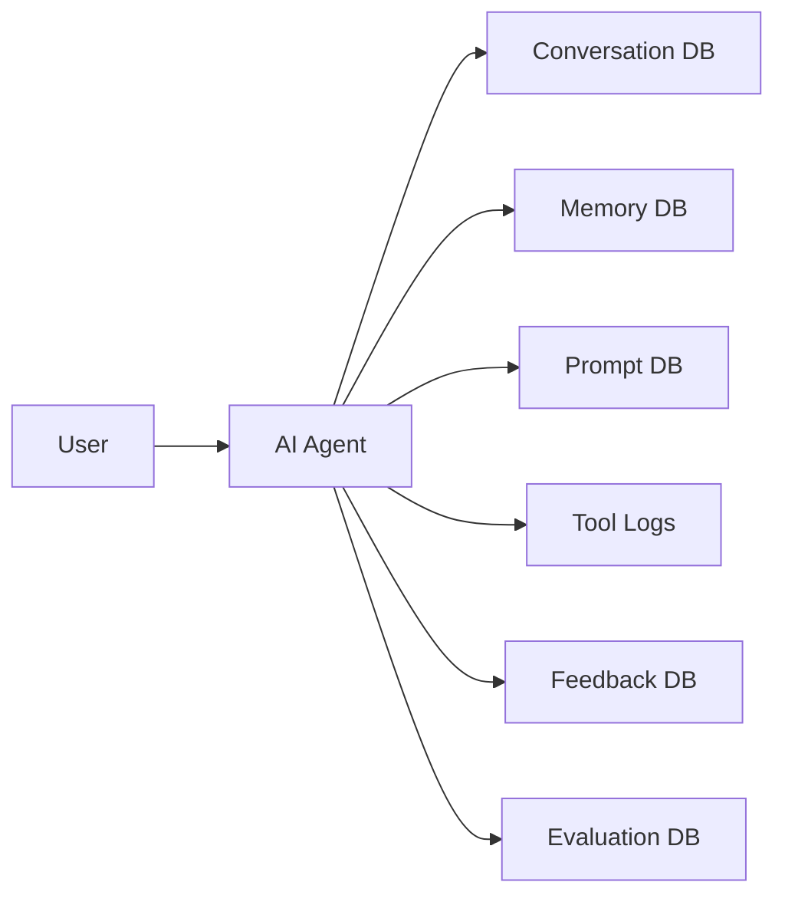

# 02_System_Architecture/08_DATABASE_ARCHITECTURE.md

# Dayjoy Enterprise AI Platform — Database Architecture

> **Purpose:** Define the logical database architecture for the Dayjoy Enterprise AI Platform, covering data domains, storage systems, ownership, relationships, governance, security, and lifecycle.
>
> **Scope:** Logical data architecture and data organization only — no SQL schemas, table definitions, or implementation code.
>
> **Audience:** Data architects, solution architects, backend engineers, AI engineers, DevOps, security and governance teams.

---

## Table of Contents

1. [Database Architecture Overview](#1-database-architecture-overview)
2. [Data Domains](#2-data-domains)
3. [Data Stores](#3-data-stores)
4. [Data Ownership](#4-data-ownership)
5. [Data Relationships](#5-data-relationships)
6. [Data Lifecycle](#6-data-lifecycle)
7. [Data Flow](#7-data-flow)
8. [AI Data Architecture](#8-ai-data-architecture)
9. [Security & Privacy](#9-security--privacy)
10. [Scalability Strategy](#10-scalability-strategy)
11. [Data Governance](#11-data-governance)
12. [Future Expansion](#12-future-expansion)
13. [Architecture Diagrams](#13-architecture-diagrams)

---

## 1. Database Architecture Overview

### 1.1 Purpose of the Data Architecture

The database architecture provides a **structured, secure, and scalable foundation** for all Dayjoy business operations and AI systems. It ensures data consistency, integrity, and accessibility while supporting AI-driven interactions across Website, WhatsApp, Voice, and internal channels.[02_System_Architecture/00_SYSTEM_OVERVIEW.md][02_System_Architecture/01_HIGH_LEVEL_ARCHITECTURE.md]

### 1.2 Business Objectives

- **Single Source of Truth:** Clear ownership and authoritative sources for each data domain.
- **AI-Ready Data:** Structured, validated data for RAG, analytics, and AI reasoning.[02_System_Architecture/04_RAG_ARCHITECTURE.md]
- **Operational Efficiency:** Support for orders, distributors, products, customers, and support workflows.[04_Distributor_System.md][05_Policies.md]
- **Governance & Compliance:** Audit trails, access control, and data lifecycle management.

### 1.3 Design Principles

- **Domain-Driven Design:** Data organized by business domains (Customer, Distributor, Product, Orders, etc.).
- **Separation of Concerns:** Operational data vs. analytical data vs. AI memory.
- **Security by Design:** RBAC, encryption, and audit logging at all layers.
- **Scalability & Availability:** Horizontal scaling, replication, and disaster recovery.
- **Data Quality:** Validation, versioning, and metadata standards.

### 1.4 Data Ownership Strategy

- Each domain has a **business owner** responsible for data accuracy and lifecycle.
- **Source of Truth** clearly defined for each dataset.
- **Read/Write access** governed by RBAC and least privilege.
- **Validation rules** enforced at creation and update.

### 1.5 High-Level Storage Architecture

- **Relational Database:** Core business data (customers, distributors, products, orders).
- **Vector Database:** Embeddings for RAG and semantic search.
- **Cache:** Session data, frequently accessed data.
- **Object Storage:** Documents, media, recordings.
- **Log Storage:** System and AI logs.
- **Analytics Storage:** Aggregated metrics and dashboards.
- **Backup Storage:** Disaster recovery and archival.

---

## 2. Data Domains

### 2.1 Domain Catalog

| Domain ID | Domain Name | Purpose | Business Owner | Primary Data | Related Modules |
|---|---|---|---|---|---|
| DOM-CUST-001 | Customer | Manage customer profiles and interactions | CX / Customer Management | Customer profiles, contact info, preferences | Orders, Support, Notifications |
| DOM-DIST-001 | Distributor | Manage distributor profiles, teams, and business metrics | Distributor Management | Distributor profiles, team structure, BV/PV, compensation | Compensation, Training, Orders |
| DOM-PROD-001 | Product | Manage product catalog and attributes | Product Team | Product details, categories, pricing, images | Orders, Marketing, Knowledge |
| DOM-ORD-001 | Orders | Manage order lifecycle | Operations / Order Management | Orders, line items, status, tracking, payments | Customer, Distributor, Logistics |
| DOM-KB-001 | Knowledge Base | Manage enterprise knowledge | Knowledge Team | Documents, policies, FAQs, SOPs, guides | RAG, AI Agents, Search |
| DOM-CONV-001 | Conversations | Store conversation history | AI / CX | Conversation transcripts, metadata | AI Memory, Analytics |
| DOM-AIMEM-001 | AI Memory | Store AI session and preference memory | AI Team | Session context, preferences, feedback | AI Agents, Analytics |
| DOM-MKT-001 | Marketing | Manage marketing campaigns and content | Marketing Team | Campaigns, content, templates, performance | Notifications, Analytics |
| DOM-NOTIF-001 | Notifications | Manage notification delivery and tracking | Operations / CX | Notification requests, delivery status | All AI Agents, CRM |
| DOM-ANL-001 | Analytics | Store aggregated metrics and insights | Analytics Team | KPIs, dashboards, reports | All Domains |
| DOM-AUTH-001 | Authentication | Manage user identities and credentials | Security / IT | Users, roles, tokens, sessions | All Modules |
| DOM-AUDIT-001 | Audit Logs | Store audit trails for compliance | Security / IT | Audit events, admin actions | All Modules |
| DOM-CONF-001 | System Configuration | Manage system and AI configuration | Admin / IT | Config settings, feature flags | All Modules |

---

## 3. Data Stores

### 3.1 Storage Catalog

| Storage ID | Storage Type | Purpose | Stored Data | Access Pattern | Scalability Considerations |
|---|---|---|---|---|---|
| STOR-REL-001 | Relational Database | Core business data | Customers, Distributors, Products, Orders, Users | Read/Write, transactional | Horizontal scaling, partitioning |
| STOR-VEC-001 | Vector Database | Semantic search and RAG | Embeddings, metadata | Read-heavy, vector search | Horizontal scaling, sharding |
| STOR-CACHE-001 | Cache | Fast access to frequently used data | Sessions, hot data | Read/Write, low latency | In-memory scaling |
| STOR-OBJ-001 | Object Storage | Documents and media | Knowledge docs, recordings, images | Write-once, read-many | Unlimited scaling |
| STOR-LOG-001 | Log Storage | System and AI logs | Logs, events | Append-only | Time-based partitioning |
| STOR-ANL-001 | Analytics Storage | Aggregated metrics | KPIs, dashboards | Read-heavy | Columnar storage, partitioning |
| STOR-BKP-001 | Backup Storage | Disaster recovery | Backups, archives | Write-once, read-rare | Immutable, geo-redundant |

---

## 4. Data Ownership

### 4.1 Ownership Matrix

| Domain | Owner | Source of Truth | Read Access | Write Access | Update Rules | Validation Rules |
|---|---|---|---|---|---|---|
| Customer | CX / Customer Mgmt | Customer DB | Authenticated users, AI agents | CX, Admin | Controlled updates | Email/phone validation |
| Distributor | Distributor Mgmt | Distributor DB | Distributors, Admin, AI | Distributor Mgmt, Admin | Controlled updates | KYC, uniqueness checks |
| Product | Product Team | Product DB | All, AI | Product Team | Controlled updates | Price, category validation |
| Orders | Order Mgmt | Order DB | Customers, Distributors, Admin | Order Mgmt, System | Status transitions | Order, payment validation |
| Knowledge Base | Knowledge Team | Knowledge Repo | All, AI | Knowledge Team | Versioning, approval | Validation, trust levels |
| Conversations | AI / CX | Conversation DB | AI, Admin, Support | AI, System | Append-only | Schema validation |
| AI Memory | AI Team | Memory DB | AI agents | AI, System | Session-based | Context validation |
| Marketing | Marketing Team | Marketing DB | Marketing, Admin | Marketing Team | Campaign lifecycle | Content approval |
| Notifications | Operations / CX | Notification DB | All modules | Notification Service | Delivery tracking | Template validation |
| Analytics | Analytics Team | Analytics DB | Management, Admin | Analytics, System | Aggregation rules | KPI validation |
| Authentication | Security / IT | Auth DB | All modules | Auth Service | Secure updates | Password, token validation |
| Audit Logs | Security / IT | Audit DB | Security, Admin | System | Append-only | Event validation |
| System Configuration | Admin / IT | Config DB | Admin, AI | Admin, System | Controlled updates | Schema validation |

---

## 5. Data Relationships

### 5.1 Key Relationships

- **Customer ↔ Orders:** One customer has many orders.
- **Distributor ↔ Team:** One distributor has many team members (downline).
- **Distributor ↔ Compensation:** One distributor has many compensation records.
- **Product ↔ Knowledge Base:** Products linked to product docs and FAQs.
- **Conversation ↔ AI Memory:** Conversations linked to session memory.
- **AI Memory ↔ User Profile:** Memory linked to user/distributor profiles.
- **Orders ↔ Notifications:** Orders trigger notifications.
- **Knowledge Base ↔ RAG:** Knowledge docs indexed for retrieval.

### 5.2 Relationship Diagram

---

## 6. Data Lifecycle

### 6.1 Lifecycle Stages

1. **Data Creation:**
   - Data created via validated forms, APIs, or imports.

2. **Validation:**
   - Data validated against business rules and schemas.

3. **Updates:**
   - Controlled updates with versioning where applicable.

4. **Usage:**
   - Data accessed by authorized users and AI agents.

5. **Archiving:**
   - Inactive data archived based on retention policy.

6. **Deletion:**
   - Data deleted per compliance and retention rules.

7. **Retention Policy:**
   - Defined per domain (e.g., orders retained for X years).

### 6.2 Lifecycle Diagram

---

## 7. Data Flow

### 7.1 End-to-End Flows

- **Customer Interactions:**
  - Customer → Website/WhatsApp/Voice → AI → Orders/Support → Notifications.

- **Voice AI:**
  - Call → Voice AI → RAG → Order/Distributor DB → Response → Recording/Logs.

- **WhatsApp AI:**
  - Message → WhatsApp AI → RAG → Order/Distributor DB → Response → Notifications.

- **Website AI:**
  - Chat → Website AI → RAG → Product/Order DB → Response → Analytics.

- **Knowledge Retrieval:**
  - AI Query → RAG → Knowledge DB → Snippets → AI Response.

- **Analytics:**
  - Logs/Events → Analytics DB → Dashboards → Management.

- **Notifications:**
  - Trigger → Notification Service → Email/SMS/WhatsApp → Delivery Status.

### 7.2 Data Flow Diagram

---

## 8. AI Data Architecture

### 8.1 AI Data Stores

| Data Type | Storage | Purpose | Access | Lifecycle |
|---|---|---|---|---|
| Conversation History | Conversation DB | Store transcripts | AI, Support, Analytics | Retained per policy |
| AI Memory | Memory DB | Session and preference memory | AI agents | Session-based, expiry |
| Prompts | Prompt DB | Store and version prompts | AI, Admin | Versioned, audited |
| Tool Execution Logs | Log Storage | Log tool calls | AI, DevOps | Retained per policy |
| Feedback | Feedback DB | Store user feedback | AI, Analytics | Retained per policy |
| AI Evaluations | Evaluation DB | Store evaluation results | AI, Analytics | Retained per policy |
| Context Data | Memory DB | Store conversation context | AI agents | Session-based |

### 8.2 AI Data Flow

---

## 9. Security & Privacy

### 9.1 Encryption

- **At Rest:** All databases and storage encrypted.
- **In Transit:** TLS for all API calls.

### 9.2 Access Control

- **RBAC:** Role-based access to all data domains.
- **Least Privilege:** Minimum access required.

### 9.3 Sensitive Data Classification

- **PII:** Customer and distributor personal data.
- **Financial:** Compensation, payment data.
- **Confidential:** Internal docs, AI configs.

### 9.4 Audit Logs

- All access and changes logged for audit.

### 9.5 Backup Strategy

- Regular backups to immutable storage.
- Geo-redundant for disaster recovery.

### 9.6 Compliance Considerations

- GDPR, local data privacy laws.
- Data retention and deletion policies.

---

## 10. Scalability Strategy

### 10.1 Data Growth

- Plan for exponential growth in conversations, logs, and AI memory.

### 10.2 Partitioning Strategy

- Partition by domain, time, and user/distributor ID.

### 10.3 Replication

- Read replicas for high read workloads.

### 10.4 Read/Write Scaling

- Horizontal scaling for read-heavy and write-heavy workloads.

### 10.5 High Availability

- Multi-region deployment for critical data.

### 10.6 Disaster Recovery Considerations

- Regular backups and tested recovery procedures.

---

## 11. Data Governance

### 11.1 Data Quality Standards

- Accuracy, completeness, consistency, timeliness.

### 11.2 Validation

- Schema and business rule validation at creation and update.

### 11.3 Versioning

- Versioned data for knowledge, prompts, and configurations.

### 11.4 Metadata Standards

- Standard metadata for all domains (owner, status, version, tags).

### 11.5 Master Data Management

- Single source of truth for customers, distributors, products.

### 11.6 Change Tracking

- Audit trails for all changes.

---

## 12. Future Expansion

### 12.1 Future Recommendations

| Feature | Purpose | Status |
|---|---|---|
| Multi-region deployment | Global availability | Future |
| Multi-tenant architecture | Support multiple organizations | Future |
| Internationalization | Multi-language, multi-currency | Future |
| Additional AI services | New AI agents and channels | Future |
| Business Intelligence | Advanced analytics and BI | Future |
| Data Lake | Centralized data for analytics | Future |
| Knowledge Graph | Structured knowledge for AI | Future |

All future features must integrate with existing governance, security, and scalability models.

---

## 13. Architecture Diagrams

### 13.1 Database Architecture

### 13.2 Data Domain Relationships

### 13.3 Data Flow

### 13.4 Storage Architecture

### 13.5 AI Data Flow

### 13.6 Data Lifecycle

---

**END OF DOCUMENT**