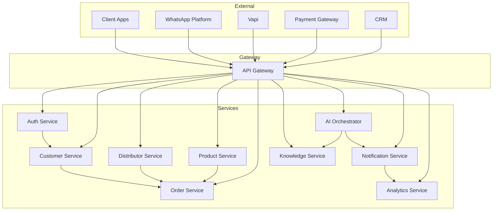
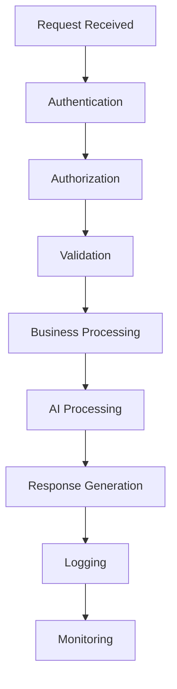
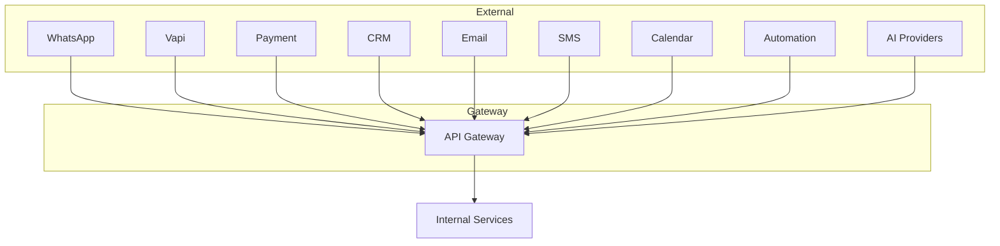
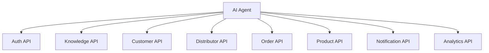
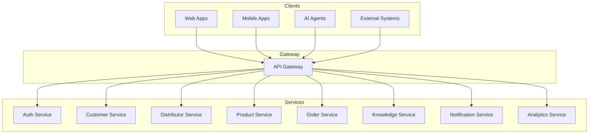
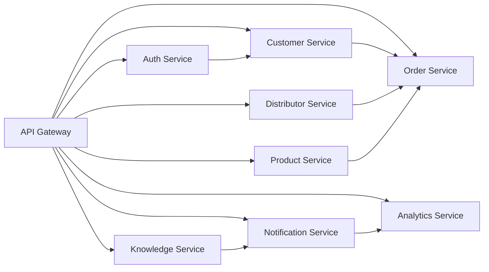
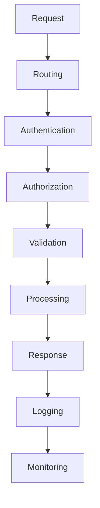
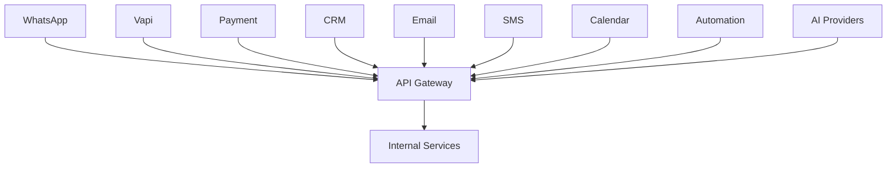

# 02_System_Architecture/09_API_ARCHITECTURE.md

# Dayjoy Enterprise AI Platform — API Architecture

> **Purpose:** Define the logical API architecture for the Dayjoy Enterprise AI Platform, covering communication standards, service interactions, governance, security, versioning, and integration strategy.
>
> **Scope:** Logical API architecture only — no endpoint definitions, request/response schemas, or implementation code.
>
> **Audience:** Solution architects, backend engineers, AI engineers, integration teams, DevOps, and security teams.

---

## Table of Contents

1. [API Architecture Overview](#1-api-architecture-overview)
2. [API Categories](#2-api-categories)
3. [Service Communication](#3-service-communication)
4. [API Gateway](#4-api-gateway)
5. [API Lifecycle](#5-api-lifecycle)
6. [Security Architecture](#6-security-architecture)
7. [API Governance](#7-api-governance)
8. [External Integrations](#8-external-integrations)
9. [AI API Integration](#9-ai-api-integration)
10. [Reliability & Performance](#10-reliability--performance)
11. [Monitoring & Observability](#11-monitoring--observability)
12. [Future API Strategy](#12-future-api-strategy)
13. [Architecture Diagrams](#13-architecture-diagrams)

---

## 1. API Architecture Overview

### 1.1 Purpose of the API Layer

The API layer provides a **unified, secure, and governed interface** for all system interactions, enabling AI agents, frontend applications, and external integrations to access business capabilities consistently and safely.[02_System_Architecture/00_SYSTEM_OVERVIEW.md][02_System_Architecture/01_HIGH_LEVEL_ARCHITECTURE.md]

### 1.2 Business Objectives

- **Unified Access:** Single entry point for all services and AI agents.
- **Security & Governance:** Centralized authentication, authorization, and audit.
- **Scalability:** Support high-volume AI and user interactions.
- **Integration:** Seamless connectivity with external platforms (WhatsApp, Vapi, payments, CRM).
- **Maintainability:** Clear versioning, deprecation, and change management.

### 1.3 API-First Strategy

- All business capabilities exposed as APIs.
- AI agents interact exclusively via APIs (no direct database access).[02_System_Architecture/03_AI_ARCHITECTURE.md]
- External integrations use standardized API patterns.

### 1.4 Design Principles

- **Consistency:** Uniform patterns across all API groups.
- **Security:** Authentication, authorization, and encryption by default.
- **Idempotency:** Safe retries for critical operations.
- **Observability:** Comprehensive logging, metrics, and tracing.
- **Versioning:** Clear versioning and backward compatibility.

### 1.5 Service Communication Model

- **Synchronous:** REST APIs for request/response.
- **Asynchronous:** Events and webhooks for notifications and background processing.
- **Internal:** Service-to-service APIs behind the gateway.

---

## 2. API Categories

### 2.1 API Group Catalog

| API Group ID | API Group Name | Purpose | Consumers | Business Owner | Related Components |
|---|---|---|---|---|---|
| API-AUTH-001 | Authentication APIs | Manage user authentication and tokens | All services, AI agents | Security / IT | Auth Service, RBAC |
| API-CUST-001 | Customer APIs | Manage customer data and interactions | AI agents, Portals | CX / Customer Mgmt | Customer Service, CRM |
| API-DIST-001 | Distributor APIs | Manage distributor data and business logic | AI agents, Portals | Distributor Mgmt | Distributor Service |
| API-PROD-001 | Product APIs | Manage product catalog | AI agents, Portals | Product Team | Product Service |
| API-ORD-001 | Order APIs | Manage order lifecycle | AI agents, Portals | Order Mgmt | Order Service |
| API-KB-001 | Knowledge APIs | Access knowledge and RAG | AI agents, Internal | Knowledge Team | Knowledge Service, RAG |
| API-AI-001 | AI APIs | AI orchestration and tool execution | AI agents, Internal | AI Team | AI Orchestrator |
| API-VOICE-001 | Voice AI APIs | Voice call handling and telephony | Voice AI, Telephony | AI / Voice Ops | Voice AI, Vapi |
| API-WA-001 | WhatsApp AI APIs | WhatsApp messaging and workflows | WhatsApp AI | AI / CX | WhatsApp AI, WhatsApp Platform |
| API-NOTIF-001 | Notification APIs | Send notifications across channels | AI agents, Services | Operations / CX | Notification Service |
| API-ANL-001 | Analytics APIs | Access analytics and metrics | AI agents, Dashboards | Analytics Team | Analytics Service |
| API-ADM-001 | Administration APIs | Admin and configuration management | Admin Dashboard, Admin AI | Admin / IT | Admin Service |
| API-INT-001 | Internal Service APIs | Internal service-to-service communication | Services, AI agents | Engineering | All Services |

---

## 3. Service Communication

### 3.1 Communication Patterns

- **REST APIs:** Synchronous request/response for most operations.
- **Internal APIs:** Service-to-service communication behind the gateway.
- **Webhooks:** External platforms notify Dayjoy of events (e.g., WhatsApp messages, payment confirmations).
- **Event-Based Messaging:** Asynchronous events for notifications, workflows, and analytics.
- **Background Jobs:** Long-running tasks (e.g., batch processing, indexing).

### 3.2 Service Communication Diagram

---

## 4. API Gateway

### 4.1 Responsibilities

- **Routing:** Direct requests to appropriate services.
- **Authentication:** Validate JWT/OAuth tokens.
- **Authorization:** Enforce RBAC and permissions.
- **Rate Limiting:** Protect services from overload.
- **Request Validation:** Validate request structure and schema.
- **Logging:** Log all requests and responses.
- **Monitoring:** Track metrics, latency, and errors.
- **API Version Management:** Route requests to correct API versions.

---

## 5. API Lifecycle

### 5.1 Lifecycle Stages

1. **Request Reception:**
   - Gateway receives request from client or external system.

2. **Authentication:**
   - Validate JWT/OAuth token or API key.

3. **Authorization:**
   - Check user/agent permissions for the requested operation.

4. **Validation:**
   - Validate request structure, schema, and business rules.

5. **Business Processing:**
   - Service executes business logic.

6. **AI Processing (if applicable):**
   - AI agents retrieve knowledge, execute tools, and generate responses.

7. **Response Generation:**
   - Service returns response to gateway.

8. **Logging:**
   - Request, response, and metadata logged.

9. **Monitoring:**
   - Metrics updated, alerts triggered if thresholds exceeded.

### 5.2 API Lifecycle Diagram

---

## 6. Security Architecture

### 6.1 Authentication

- **JWT/OAuth:** Token-based authentication for users and AI agents.
- **API Keys:** For service-to-service and external integrations.

### 6.2 Authorization

- **RBAC:** Role-based access control for all API operations.
- **Least Privilege:** Minimum permissions required.

### 6.3 Encryption

- **In Transit:** TLS for all API calls.
- **At Rest:** Encrypted storage for sensitive data.

### 6.4 Rate Limiting

- Per-user, per-service, and global rate limits.

### 6.5 Input Validation

- Schema validation, sanitization, and business rule checks.

### 6.6 Audit Logging

- All API calls logged for audit and compliance.

### 6.7 Secret Management

- Centralized secret storage (e.g., API keys, tokens).

---

## 7. API Governance

### 7.1 Naming Conventions

- Consistent, descriptive names (e.g., `customer`, `order`, `knowledge`).
- Versioned paths (e.g., `/v1/customer`).

### 7.2 Versioning Strategy

- Semantic versioning (e.g., `v1`, `v2`).
- Backward compatibility for minor versions.

### 7.3 Error Handling

- Standard error codes and messages.
- Clear error categories (client, server, validation).

### 7.4 Deprecation Policy

- Deprecation notices with migration guides.
- Sunset periods for old versions.

### 7.5 Backward Compatibility

- Maintain compatibility for existing clients.
- New features in new versions.

### 7.6 Documentation Requirements

- All APIs documented with purpose, consumers, and examples.
- Auto-generated API docs where possible.

### 7.7 Change Management

- Change requests reviewed and approved.
- Breaking changes require version bump.

---

## 8. External Integrations

### 8.1 Integration Catalog

| Integration | Purpose | Data Exchange |
|---|---|---|
| WhatsApp Business Platform | WhatsApp messaging | Messages, templates, delivery status |
| Vapi | Voice call handling | Call events, audio streams, transcripts |
| Payment Gateway | Payment processing | Payment requests, status, confirmations |
| CRM | Customer relationship management | Customer profiles, interactions |
| Email Provider | Email notifications | Email requests, delivery status |
| SMS Provider | SMS notifications | SMS requests, delivery status |
| Calendar Services | Appointment scheduling | Calendar events, availability |
| Automation Platform | Workflow orchestration | Workflow triggers, status |
| AI Providers | LLM and AI services | Prompts, responses, embeddings |

### 8.2 External Integration Flow

---

## 9. AI API Integration

### 9.1 AI-to-API Interactions

- **Knowledge Retrieval:** AI agents call Knowledge APIs and RAG Service.
- **Tool Execution:** AI agents call domain APIs (Customer, Distributor, Order, Product).
- **User Authentication:** AI agents verify user identity via Auth APIs.
- **Business Operations:** AI agents execute business logic via domain APIs.
- **Notifications:** AI agents trigger notifications via Notification APIs.
- **Analytics:** AI agents log interactions and retrieve metrics via Analytics APIs.

### 9.2 AI-to-API Flow

---

## 10. Reliability & Performance

### 10.1 Retry Strategy

- Exponential backoff for transient failures.
- Idempotent operations for safe retries.

### 10.2 Timeout Handling

- Configurable timeouts per API.
- Graceful degradation on timeout.

### 10.3 Circuit Breakers

- Prevent cascading failures by isolating unhealthy services.

### 10.4 Idempotency

- Critical operations (e.g., payments, orders) are idempotent.

### 10.5 Load Distribution

- Load balancers distribute API traffic.
- Horizontal scaling for high-traffic APIs.

### 10.6 High Availability

- Multi-region deployment for critical APIs.
- Redundant gateways and services.

### 10.7 Scalability

- Stateless services for horizontal scaling.
- Caching for read-heavy workloads.

---

## 11. Monitoring & Observability

### 11.1 API Metrics

- Request volume, latency, error rates.
- Per-API, per-client, and per-user metrics.

### 11.2 Request Logging

- All requests and responses logged with metadata.

### 11.3 Error Tracking

- Centralized error tracking and alerting.

### 11.4 Latency Monitoring

- Track P50, P95, P99 latencies.

### 11.5 Usage Analytics

- Track API usage patterns and trends.

### 11.6 Health Checks

- Periodic health checks for all services.

### 11.7 Alerting

- Alerts for errors, latency spikes, and availability issues.

---

## 12. Future API Strategy

### 12.1 Future Recommendations

| Feature | Purpose | Status |
|---|---|---|
| GraphQL | Flexible queries for complex data | Future |
| gRPC | High-performance internal communication | Future |
| Public APIs | Partner and developer access | Future |
| Partner APIs | B2B integrations | Future |
| Mobile APIs | Optimized for mobile apps | Future |
| Event Streaming APIs | Real-time event streaming | Future |

All future features must integrate with existing governance, security, and monitoring models.

---

## 13. Architecture Diagrams

### 13.1 API Architecture

### 13.2 Service Communication

### 13.3 API Gateway Flow

### 13.4 External Integration Flow

### 13.5 API Lifecycle

### 13.6 AI-to-API Interaction

---

**END OF DOCUMENT**