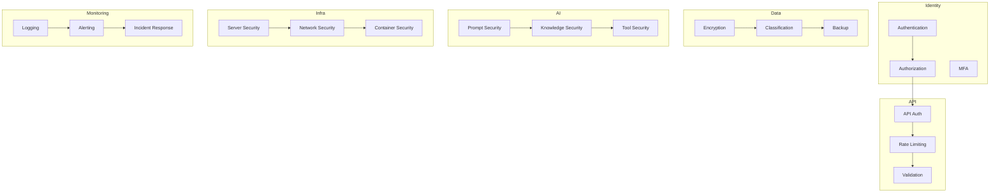
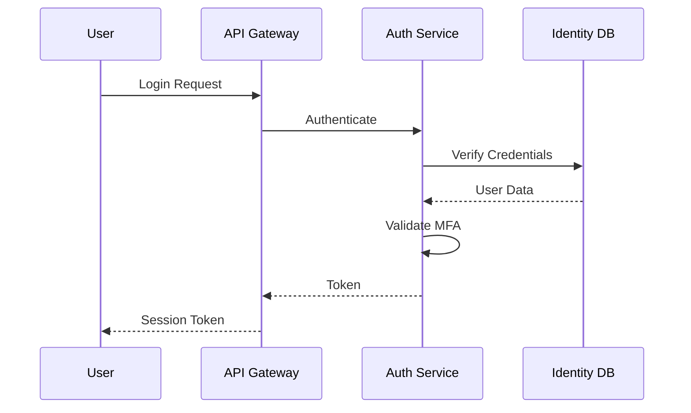
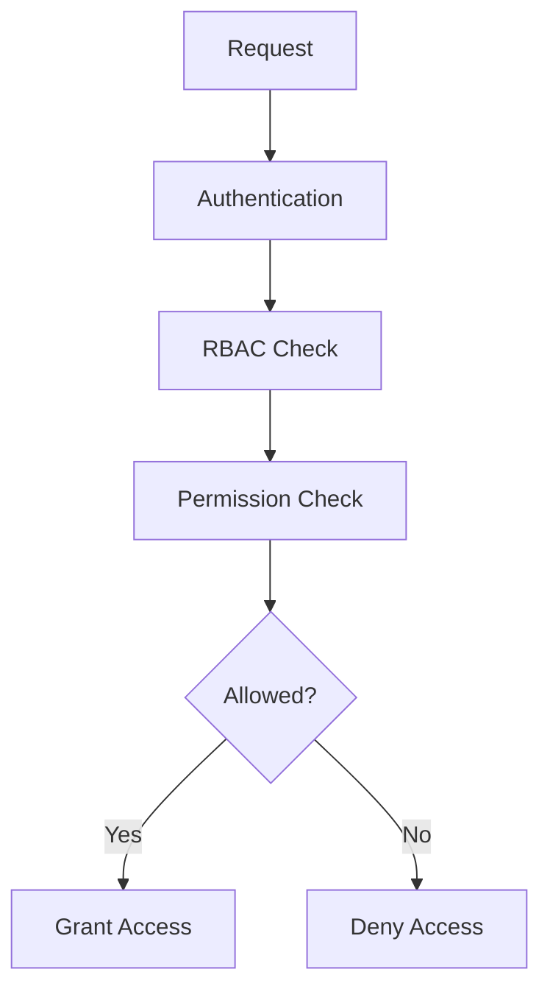
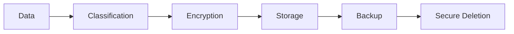
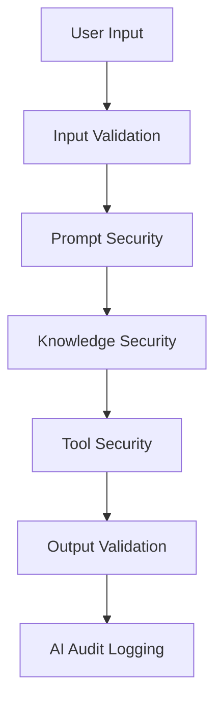
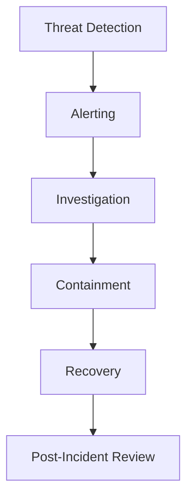

# 02_System_Architecture/10_SECURITY_ARCHITECTURE.md

# Dayjoy Enterprise AI Platform — Security Architecture

> **Purpose:** Define the complete enterprise security architecture for the Dayjoy Enterprise AI Platform, protecting users, AI systems, business data, APIs, infrastructure, integrations, and knowledge assets.
>
> **Scope:** Security architecture, governance, and risk management only — no implementation code or low-level configurations.
>
> **Audience:** Security architects, solution architects, DevOps, backend engineers, AI engineers, compliance teams, and management.

---

## Table of Contents

1. [Security Overview](#1-security-overview)
2. [Security Domains](#2-security-domains)
3. [Identity & Access Management](#3-identity--access-management)
4. [Authorization Model](#4-authorization-model)
5. [Data Security](#5-data-security)
6. [AI Security](#6-ai-security)
7. [API Security](#7-api-security)
8. [Infrastructure Security](#8-infrastructure-security)
9. [Third-Party Integration Security](#9-third-party-integration-security)
10. [Monitoring & Incident Response](#10-monitoring--incident-response)
11. [Compliance & Governance](#11-compliance--governance)
12. [Business Continuity](#12-business-continuity)
13. [Future Security Roadmap](#13-future-security-roadmap)
14. [Architecture Diagrams](#14-architecture-diagrams)

---

## 1. Security Overview

### 1.1 Security Objectives

The Dayjoy security architecture aims to:

- **Protect Users:** Secure customer, distributor, and employee data and interactions.
- **Secure AI Systems:** Prevent prompt injection, knowledge poisoning, and unauthorized AI actions.[02_System_Architecture/03_AI_ARCHITECTURE.md][02_System_Architecture/07_AGENT_ARCHITECTURE.md]
- **Protect Data:** Ensure confidentiality, integrity, and availability of business and personal data.[02_System_Architecture/08_DATABASE_ARCHITECTURE.md]
- **Secure APIs & Infrastructure:** Defend against external and internal threats.
- **Ensure Compliance:** Meet regulatory and business compliance requirements.

### 1.2 Design Principles

- **Security-by-Design:** Security integrated into all layers from the start.
- **Defense in Depth:** Multiple layers of security controls.
- **Least Privilege:** Minimum access required for all users and services.
- **Zero Trust:** Verify every request, regardless of origin.
- **Continuous Monitoring:** Real-time detection and response.

### 1.3 Security Scope

- **Users:** Customers, distributors, employees, administrators.
- **AI Systems:** AI agents, prompts, knowledge, tool execution.
- **Data:** Business data, personal data, knowledge assets.
- **APIs:** Internal and external APIs.
- **Infrastructure:** Servers, networks, containers, cloud services.
- **Integrations:** Third-party platforms (WhatsApp, Vapi, payments, etc.).

### 1.4 Threat Model

Key threats include:

- **Unauthorized Access:** Compromised credentials, privilege escalation.
- **Data Breach:** Theft or exposure of sensitive data.
- **AI Attacks:** Prompt injection, knowledge poisoning, hallucination exploitation.
- **API Attacks:** Injection, replay, DDoS, unauthorized access.
- **Infrastructure Attacks:** Server compromise, network intrusion, container escape.
- **Insider Threats:** Malicious or negligent employees.

### 1.5 Security-by-Design Approach

- Security requirements defined for all features.
- Threat modeling for new capabilities.
- Security reviews and penetration testing.
- Automated security checks in CI/CD.

---

## 2. Security Domains

### 2.1 Security Domain Catalog

| Domain ID | Domain Name | Purpose | Scope | Business Impact | Owner |
|---|---|---|---|---|---|
| SEC-IDM-001 | Identity Security | Protect user identities and authentication | All users, services | Critical | Security / IT |
| SEC-APP-001 | Application Security | Secure application code and logic | All applications | High | Engineering |
| SEC-AI-001 | AI Security | Secure AI systems and outputs | AI agents, prompts, knowledge | Critical | AI / Security |
| SEC-API-001 | API Security | Secure API access and usage | All APIs | Critical | Security / Engineering |
| SEC-DATA-001 | Data Security | Protect data at rest and in transit | All data | Critical | Security / IT |
| SEC-INFRA-001 | Infrastructure Security | Secure servers, networks, containers | All infrastructure | Critical | DevOps / Security |
| SEC-NET-001 | Network Security | Secure network communications | All networks | High | DevOps / Security |
| SEC-END-001 | Endpoint Security | Secure user and admin devices | All endpoints | High | IT / Security |
| SEC-OPS-001 | Operational Security | Secure operations and processes | All operations | High | Operations / Security |

---

## 3. Identity & Access Management

### 3.1 Authentication

- **User Authentication:**
  - Email/phone and password.
  - MFA for sensitive actions.

- **Employee Authentication:**
  - Corporate credentials.
  - MFA required.

- **Distributor Authentication:**
  - Distributor ID and password.
  - MFA for sensitive actions (e.g., compensation changes).

- **Administrator Authentication:**
  - Admin credentials.
  - MFA required.

- **Service-to-Service Authentication:**
  - API keys or JWT tokens.
  - Mutual TLS for critical services.

- **Single Sign-On (Future):**
  - SSO for employees and administrators.

- **Multi-Factor Authentication:**
  - Required for admin and sensitive operations.
  - Optional for customers and distributors.

- **Password Policy:**
  - Minimum length, complexity, and rotation.
  - No password reuse.

- **Session Management:**
  - Secure session tokens.
  - Session timeout and revocation.

---

## 4. Authorization Model

### 4.1 Role-Based Access Control (RBAC)

| Role | Permissions | Restricted Actions | Accessible Resources | Approval Requirements |
|---|---|---|---|---|
| Customer | View own profile, orders, products | Modify others' data, admin actions | Own data, product catalog | None |
| Distributor | View own profile, team, compensation, orders | Modify others' data, admin actions | Own data, team data, product catalog | None |
| Employee | View customer/distributor data, internal tools | Admin actions, config changes | Customer, distributor, product, order data | Manager approval for sensitive actions |
| Manager | Employee permissions + approvals | Admin actions, config changes | All business data | Director approval for critical actions |
| Administrator | Full system access | None | All resources | Security review for critical changes |
| AI Agent | Contextual permissions per agent | Admin actions, sensitive data | Role-based data access | Governance approval for new agents |
| System Service | Service-to-service permissions | User data access without authorization | Service-specific data | Security review for new services |

### 4.2 Role × Permission Matrix (Simplified)

| Permission | Customer | Distributor | Employee | Manager | Admin | AI Agent | System Service |
|---|---|---|---|---|---|---|---|
| View Own Data | ✅ | ✅ | ✅ | ✅ | ✅ | ❌ | ❌ |
| View Others' Data | ❌ | ✅ (team) | ✅ | ✅ | ✅ | ✅ (contextual) | ❌ |
| Modify Own Data | ✅ | ✅ | ✅ | ✅ | ✅ | ❌ | ❌ |
| Modify Others' Data | ❌ | ❌ | ✅ (limited) | ✅ | ✅ | ❌ | ❌ |
| Admin Actions | ❌ | ❌ | ❌ | ❌ | ✅ | ❌ | ❌ |
| AI Tool Execution | ❌ | ❌ | ❌ | ❌ | ❌ | ✅ | ✅ |
| Service-to-Service | ❌ | ❌ | ❌ | ❌ | ❌ | ❌ | ✅ |

---

## 5. Data Security

### 5.1 Data Classification

- **Public:** Product info, marketing content.
- **Internal:** SOPs, internal docs.
- **Confidential:** Customer/distributor PII, compensation data.
- **Restricted:** Admin configs, security logs.

### 5.2 Encryption

- **At Rest:** All databases and storage encrypted.
- **In Transit:** TLS for all communications.

### 5.3 Sensitive Data Handling

- Mask or tokenize sensitive data where possible.
- Limit access to authorized users and services.

### 5.4 Personal Data Protection

- Comply with GDPR and local privacy laws.
- Consent management for data collection.

### 5.5 Backup Encryption

- All backups encrypted.

### 5.6 Data Retention

- Retention policies per data type.
- Automated deletion after retention period.

### 5.7 Secure Deletion

- Secure deletion for sensitive data.

---

## 6. AI Security

### 6.1 AI Security Controls

- **Prompt Injection Prevention:**
  - Validate and sanitize all inputs to AI.
  - Use system prompts and guardrails.[02_System_Architecture/03_AI_ARCHITECTURE.md]

- **Prompt Validation:**
  - Validate prompts against allowed patterns.

- **Knowledge Poisoning Prevention:**
  - Only use verified knowledge sources.
  - Validate knowledge updates.[02_System_Architecture/04_RAG_ARCHITECTURE.md]

- **Hallucination Mitigation:**
  - Ground AI responses in retrieved knowledge.
  - Validate AI outputs against known facts.

- **Output Validation:**
  - Validate AI responses for safety and accuracy.

- **Tool Permission Control:**
  - AI agents have least-privilege tool access.
  - Sensitive tools require human approval.

- **Agent Isolation:**
  - AI agents isolated from each other and critical systems.

- **AI Audit Logging:**
  - All AI actions logged for audit.

---

## 7. API Security

### 7.1 API Security Controls

- **Authentication:** JWT/OAuth, API keys.
- **Authorization:** RBAC for all API operations.
- **API Keys:** For service-to-service and external integrations.
- **JWT/OAuth:** Token-based authentication.
- **Rate Limiting:** Per-user, per-service, and global limits.
- **Input Validation:** Schema and business rule validation.
- **Output Sanitization:** Sanitize responses to prevent data leakage.
- **Webhook Verification:** Verify webhook signatures.
- **Replay Attack Prevention:** Use timestamps and nonces.

---

## 8. Infrastructure Security

### 8.1 Infrastructure Controls

- **Server Hardening:** Minimal OS, regular patching.
- **Network Segmentation:** Separate networks for different tiers.
- **Firewall Strategy:** Allow only necessary traffic.
- **Secret Management:** Centralized secret storage (e.g., Vault).
- **Container Security:** Secure images, runtime protection.
- **Environment Isolation:** Separate dev, staging, production.
- **Backup Security:** Encrypted, immutable backups.
- **Patch Management:** Regular patching of all systems.

---

## 9. Third-Party Integration Security

### 9.1 Integration Security Requirements

| Integration | Trust Boundary | Data-Sharing Principles |
|---|---|---|
| WhatsApp Business Platform | External | Share only necessary data, encrypt in transit |
| Vapi | External | Share only call data, encrypt in transit |
| AI Providers | External | Share only necessary prompts, no PII |
| Payment Gateway | External | Share only payment data, PCI-DSS compliant |
| Email Services | External | Share only email data, encrypt in transit |
| SMS Providers | External | Share only phone numbers, encrypt in transit |
| Cloud Storage | External | Encrypt data at rest and in transit |
| Automation Platforms | External | Share only necessary data, encrypt in transit |

### 9.2 Trust Boundaries

- **Internal:** Dayjoy infrastructure and services.
- **External:** Third-party platforms and providers.

---

## 10. Monitoring & Incident Response

### 10.1 Security Logging

- All security events logged (auth, access, changes).

### 10.2 Audit Trails

- Complete audit trails for all actions.

### 10.3 Threat Detection

- Real-time threat detection and alerting.

### 10.4 Alerting

- Alerts for security events and anomalies.

### 10.5 Incident Classification

- Classify incidents by severity and impact.

### 10.6 Investigation Workflow

- Investigate, contain, recover, and review.

### 10.7 Containment

- Isolate affected systems.

### 10.8 Recovery

- Restore systems and data.

### 10.9 Post-Incident Review

- Review and improve security controls.

---

## 11. Compliance & Governance

### 11.1 Security Policies

- Documented security policies and procedures.

### 11.2 Access Review Process

- Regular access reviews and recertification.

### 11.3 Key Rotation

- Regular rotation of API keys and secrets.

### 11.4 Compliance Objectives

- GDPR, local privacy laws, industry standards.

### 11.5 Documentation Requirements

- All security controls documented.

### 11.6 Security Reviews

- Regular security reviews and audits.

### 11.7 Risk Assessments

- Periodic risk assessments and threat modeling.

---

## 12. Business Continuity

### 12.1 Availability Targets

- High availability for critical systems.

### 12.2 Disaster Recovery Coordination

- Coordinated DR plans with security controls.

### 12.3 Backup Verification

- Regular backup verification and testing.

### 12.4 Security During Outages

- Maintain security controls during outages.

### 12.5 Recovery Priorities

- Prioritize critical systems and data.

---

## 13. Future Security Roadmap

### 13.1 Future Enhancements

| Enhancement | Purpose | Status |
|---|---|---|
| Zero Trust Architecture | Verify every request | Future |
| Hardware Security Modules (HSM) | Secure key storage | Future |
| Passkeys | Passwordless authentication | Future |
| Continuous Risk Assessment | Real-time risk monitoring | Future |
| AI Threat Detection | Detect AI-specific threats | Future |
| Behavioral Analytics | Detect anomalous behavior | Future |
| Security Operations Center (SOC) | Centralized security monitoring | Future |
| Compliance Automation | Automated compliance checks | Future |

All future enhancements must integrate with existing security architecture and governance.

---

## 14. Architecture Diagrams

### 14.1 Security Architecture



### 14.2 Authentication Flow



### 14.3 Authorization Flow



### 14.4 Data Protection Flow



### 14.5 AI Security Model



### 14.6 Incident Response Workflow



### 14.7 Trust Boundary Diagram

```mermaid
flowchart TB
    subgraph Internal
        USER[Users]
        AI[AI Systems]
        DATA[Data]
        API[APIs]
        INFRA[Infrastructure]
    end

    subgraph External
        WA[WhatsApp]
        VAPI[Vapi]
        PAY[Payment]
        AI PROV[AI Providers]
    end

    USER --> API
    AI --> API
    DATA --> API
    API --> INFRA

    WA -.-> API
    VAPI -.-> API
    PAY -.-> API
    AI PROV -.-> API
```

---

**END OF DOCUMENT**