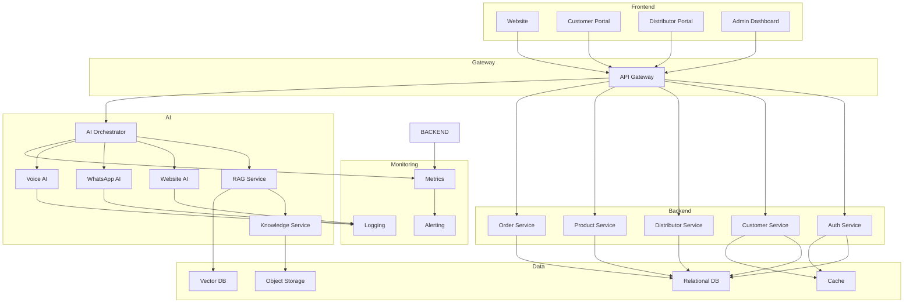
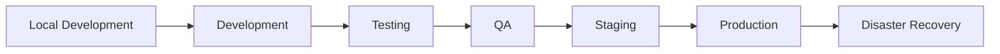
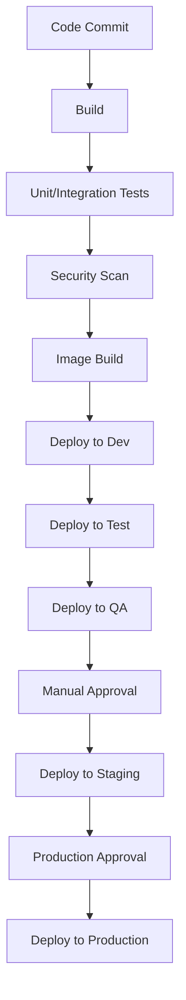
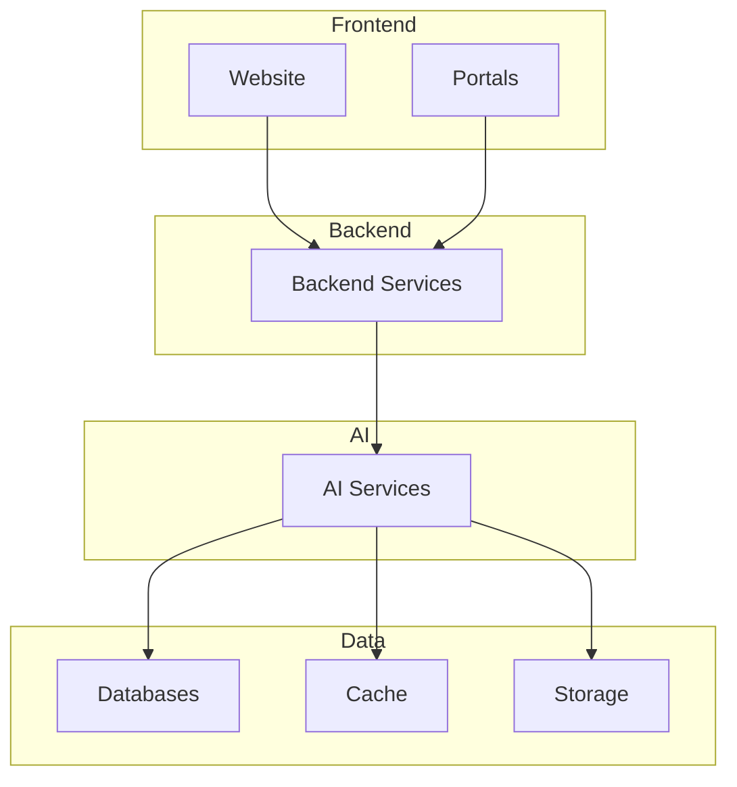
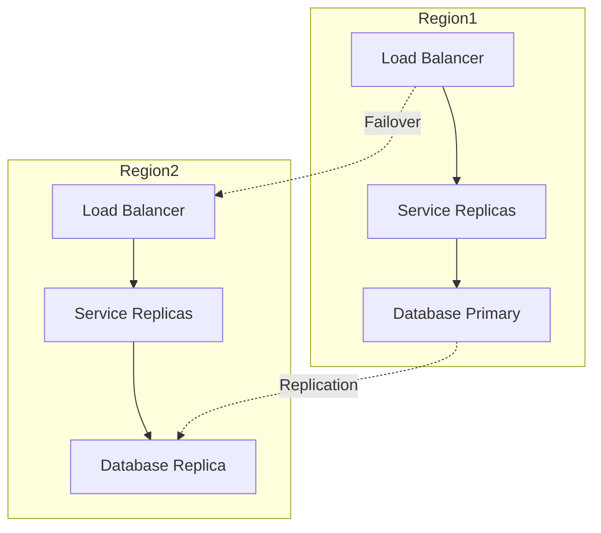
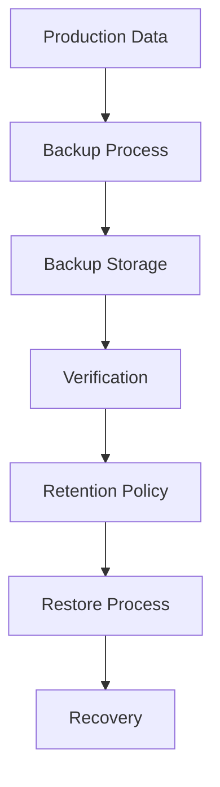

# 02_System_Architecture/11_DEPLOYMENT_ARCHITECTURE.md

# Dayjoy Enterprise AI Platform — Deployment Architecture

> **Purpose:** Define the deployment architecture for the Dayjoy Enterprise AI Platform, covering environments, deployment strategy, infrastructure topology, release workflow, scaling, operational readiness, and disaster resilience.
>
> **Scope:** Deployment architecture only — no cloud-specific commands, infrastructure scripts, or implementation code.
>
> **Audience:** DevOps engineers, solution architects, platform engineers, security teams, and operations.

---

## Table of Contents

1. [Deployment Overview](#1-deployment-overview)
2. [Environment Strategy](#2-environment-strategy)
3. [Deployment Topology](#3-deployment-topology)
4. [Release Strategy](#4-release-strategy)
5. [Configuration Management](#5-configuration-management)
6. [Scalability Strategy](#6-scalability-strategy)
7. [High Availability](#7-high-availability)
8. [Backup & Recovery](#8-backup--recovery)
9. [Security During Deployment](#9-security-during-deployment)
10. [Monitoring During Deployment](#10-monitoring-during-deployment)
11. [Operational Readiness](#11-operational-readiness)
12. [Future Deployment Roadmap](#12-future-deployment-roadmap)
13. [Architecture Diagrams](#13-architecture-diagrams)

---

## 1. Deployment Overview

### 1.1 Deployment Goals

The deployment architecture ensures the Dayjoy Enterprise AI Platform is **reliable, scalable, secure, and maintainable** across all environments, from development to production and disaster recovery.[02_System_Architecture/00_SYSTEM_OVERVIEW.md][02_System_Architecture/01_HIGH_LEVEL_ARCHITECTURE.md]

Key goals:

- **Consistency:** Same deployment patterns across all environments.
- **Reliability:** High availability and fault tolerance.
- **Scalability:** Support growing users, AI interactions, and data.
- **Security:** Secure pipelines, secrets, and environment isolation.
- **Observability:** Comprehensive monitoring and alerting.

### 1.2 Business Requirements

- **24/7 Availability:** AI channels (Website, WhatsApp, Voice) must be highly available.
- **Rapid Iteration:** Frequent releases for AI improvements and features.
- **Compliance:** Secure handling of customer, distributor, and business data.
- **Disaster Resilience:** Backup and recovery for business continuity.

### 1.3 Availability Objectives

- **Production:** 99.9%+ availability for critical services.
- **AI Services:** 99.5%+ availability for AI agents.
- **Databases:** 99.9%+ availability with replication.

### 1.4 Deployment Principles

- **Infrastructure as Code:** All infrastructure defined and versioned.
- **Immutable Infrastructure:** Replace, don't modify, running instances.
- **Automated Deployments:** CI/CD for all services.
- **Environment Isolation:** Strict separation between environments.
- **Security-by-Design:** Security integrated into all deployment stages.

---

## 2. Environment Strategy

### 2.1 Environment Matrix

| Environment ID | Environment Name | Purpose | Users | Data Policy | Deployment Frequency |
|---|---|---|---|---|---|
| ENV-LOCAL-001 | Local Development | Local development and testing | Developers | Synthetic/mock data | Continuous |
| ENV-DEV-001 | Development | Integrated development environment | Developers, QA | Synthetic data | Daily |
| ENV-TEST-001 | Testing | Automated testing environment | QA, CI/CD | Synthetic data | Per commit |
| ENV-QA-001 | QA | Quality assurance and validation | QA, Product | Masked production-like data | Weekly |
| ENV-STG-001 | Staging | Pre-production validation | Product, Ops | Masked production data | Per release |
| ENV-PROD-001 | Production | Live production environment | All users | Real user data | Per approved release |
| ENV-DR-001 | Disaster Recovery | Disaster recovery environment | Ops, DR team | Replicated production data | Synced with production |

---

## 3. Deployment Topology

### 3.1 Logical Deployment Topology

The platform is deployed across multiple logical tiers:

- **Frontend:**
  - Website, Customer Portal, Distributor Portal, Admin Dashboard.
  - Deployed as static assets or containerized web servers.

- **Backend APIs:**
  - All domain services (Customer, Distributor, Product, Order, etc.).
  - Deployed as containerized services behind API Gateway.

- **AI Services:**
  - AI agents (Website, WhatsApp, Voice, Internal, Admin).
  - AI Orchestrator, RAG Service, Knowledge Service.
  - Deployed as containerized services.

- **Voice AI:**
  - Voice AI agents integrated with telephony (Vapi).
  - Deployed as containerized services.

- **WhatsApp AI:**
  - WhatsApp AI agents integrated with WhatsApp Business Platform.
  - Deployed as containerized services.

- **Databases:**
  - Relational databases for business data.
  - Deployed as managed database services or containerized databases.

- **Vector Database:**
  - For RAG and semantic search.
  - Deployed as managed service or containerized.

- **Cache:**
  - Redis or similar for session and hot data.
  - Deployed as managed service or containerized.

- **Storage:**
  - Object storage for documents, media, recordings.
  - Deployed as managed cloud storage.

- **Monitoring Stack:**
  - Logging, metrics, tracing, alerting.
  - Deployed as managed services or containerized.

### 3.2 Deployment Topology Diagram

---

## 4. Release Strategy

### 4.1 Development Workflow

- **Feature Branches:** Developers work on feature branches.
- **Pull Requests:** Code reviewed and merged via PRs.
- **Automated Tests:** CI runs tests on every PR.

### 4.2 Continuous Integration

- **Build:** Automated build on every commit.
- **Test:** Unit, integration, and end-to-end tests.
- **Security Scan:** Static analysis and dependency checks.
- **Image Build:** Container images built and scanned.

### 4.3 Continuous Deployment

- **Automated Deployment:** Deploy to Dev/Test on every successful build.
- **Manual Approval:** QA and Staging require manual approval.
- **Production Deployment:** Requires explicit approval from Product/Ops.

### 4.4 Manual Approval Gates

- **QA:** QA team validates features.
- **Staging:** Product/Ops validate release readiness.
- **Production:** Release manager approves production deployment.

### 4.5 Version Promotion

- **Dev → Test → QA → Staging → Production:** Versions promoted through environments.
- **Semantic Versioning:** Clear version numbers for releases.

### 4.6 Rollback Strategy

- **Automated Rollback:** Rollback on critical failures.
- **Manual Rollback:** Ops can manually rollback if needed.
- **Version History:** All previous versions retained for rollback.

### 4.7 Release Validation

- **Health Checks:** Automated health checks post-deployment.
- **Smoke Tests:** Critical workflows tested post-deployment.
- **Monitoring:** Metrics and errors monitored for anomalies.

---

## 5. Configuration Management

### 5.1 Environment Variables

- Per-environment configuration (e.g., DB URLs, API endpoints).
- Managed via environment-specific config files or secret managers.

### 5.2 Secrets

- All secrets (API keys, DB passwords) stored in secret manager.
- Never hardcoded or committed to version control.

### 5.3 Feature Flags

- Feature flags for gradual rollouts and A/B testing.
- Managed via feature flag service.

### 5.4 Runtime Configuration

- Dynamic configuration for AI behavior, prompts, and guardrails.
- Stored in configuration service or database.

### 5.5 Service Configuration

- Service-specific configuration (e.g., timeouts, retries).
- Managed via config files or environment variables.

---

## 6. Scalability Strategy

### 6.1 Horizontal Scaling

- Stateless services scaled horizontally (multiple replicas).
- Load balancers distribute traffic.

### 6.2 Vertical Scaling

- Stateful services (databases) scaled vertically (more resources).

### 6.3 Auto Scaling

- Auto-scaling based on CPU, memory, and request volume.
- Scale up during peak, scale down during low traffic.

### 6.4 Stateless Services

- All AI and backend services designed to be stateless.
- Session state stored in cache or database.

### 6.5 Load Balancing

- Load balancers for all services.
- Health checks ensure traffic only to healthy instances.

### 6.6 Capacity Planning

- Regular capacity planning based on usage trends.
- Proactive scaling before peak periods.

---

## 7. High Availability

### 7.1 Redundancy

- Multiple replicas for all critical services.
- Multi-AZ or multi-region for databases and storage.

### 7.2 Failover

- Automatic failover for databases and critical services.
- DNS failover for frontend services.

### 7.3 Health Checks

- Periodic health checks for all services.
- Unhealthy instances removed from load balancer.

### 7.4 Service Recovery

- Automatic restart of failed services.
- Alerts for repeated failures.

### 7.5 Database Availability

- Read replicas for read-heavy workloads.
- Synchronous/asynchronous replication for high availability.

### 7.6 AI Service Availability

- Multiple replicas for AI agents.
- Graceful degradation if AI services unavailable.

---

## 8. Backup & Recovery

### 8.1 Backup Scope

- All databases (relational, vector).
- Object storage (documents, recordings).
- Configuration and secrets.

### 8.2 Backup Schedule

- **Databases:** Daily full backups, hourly incremental.
- **Object Storage:** Continuous versioning.
- **Configuration:** Per-change backup.

### 8.3 Retention Policy

- **Databases:** 30 days for daily backups, 1 year for monthly.
- **Object Storage:** Indefinite versioning.
- **Configuration:** All versions retained.

### 8.4 Restore Process

- **Database Restore:** Point-in-time recovery.
- **Object Storage Restore:** Version-based restore.
- **Configuration Restore:** Version-based restore.

### 8.5 Recovery Objectives

- **RTO (Recovery Time Objective):** < 4 hours for critical services.
- **RPO (Recovery Point Objective):** < 1 hour for databases.

### 8.6 Data Verification

- Regular backup verification and restore testing.
- Automated checksums for backup integrity.

---

## 9. Security During Deployment

### 9.1 Secure Pipelines

- All CI/CD pipelines secured and access-controlled.
- Pipelines run in isolated environments.

### 9.2 Secret Protection

- Secrets injected at runtime, not in images.
- Secrets rotated regularly.

### 9.3 Image Verification

- All container images scanned for vulnerabilities.
- Only verified images deployed.

### 9.4 Deployment Approval

- Production deployments require manual approval.
- Security review for critical changes.

### 9.5 Environment Isolation

- Strict isolation between environments.
- No cross-environment access.

### 9.6 Access Control

- RBAC for all deployment operations.
- Audit logs for all deployment actions.

---

## 10. Monitoring During Deployment

### 10.1 Deployment Monitoring

- Monitor deployment progress and status.
- Alerts for deployment failures.

### 10.2 Health Verification

- Automated health checks post-deployment.
- Verify all services are healthy.

### 10.3 Error Detection

- Monitor logs and metrics for errors.
- Alerts for error spikes.

### 10.4 Rollback Triggers

- Automatic rollback on critical errors.
- Manual rollback for non-critical issues.

### 10.5 Success Validation

- Smoke tests for critical workflows.
- Verify metrics and logs are normal.

---

## 11. Operational Readiness

### 11.1 Deployment Readiness Checklist

- **Infrastructure:**
  - [ ] All services deployed and healthy.
  - [ ] Load balancers configured.
  - [ ] Databases and storage ready.

- **Security:**
  - [ ] Secrets configured and rotated.
  - [ ] RBAC and access control enforced.
  - [ ] Security scans passed.

- **AI Services:**
  - [ ] AI agents deployed and healthy.
  - [ ] RAG and Knowledge services ready.
  - [ ] AI prompts and guardrails configured.

- **APIs:**
  - [ ] All APIs deployed and healthy.
  - [ ] API Gateway configured.
  - [ ] Rate limiting and auth enabled.

- **Databases:**
  - [ ] Databases deployed and replicated.
  - [ ] Backups configured.
  - [ ] Monitoring enabled.

- **Integrations:**
  - [ ] External integrations configured.
  - [ ] Webhooks and APIs tested.
  - [ ] Error handling verified.

- **Monitoring:**
  - [ ] Logging, metrics, and alerting enabled.
  - [ ] Dashboards configured.
  - [ ] Health checks passing.

- **Documentation:**
  - [ ] Deployment docs updated.
  - [ ] Runbooks and SOPs available.
  - [ ] Contact list updated.

---

## 12. Future Deployment Roadmap

### 12.1 Future Recommendations

| Capability | Purpose | Status |
|---|---|---|
| Multi-region deployment | Global availability and failover | Future |
| Blue-Green deployment | Zero-downtime deployments | Future |
| Canary releases | Gradual rollouts with monitoring | Future |
| Edge deployment | Low-latency edge computing | Future |
| Multi-cloud support | Avoid vendor lock-in | Future |
| Global failover | Automatic failover across regions | Future |

All future capabilities must integrate with existing security, monitoring, and deployment models.

---

## 13. Architecture Diagrams

### 13.1 Deployment Topology

### 13.2 Environment Promotion Flow

### 13.3 CI/CD Pipeline

### 13.4 Service Deployment Architecture

### 13.5 High Availability Architecture

### 13.6 Backup & Recovery Flow

---

**END OF DOCUMENT**