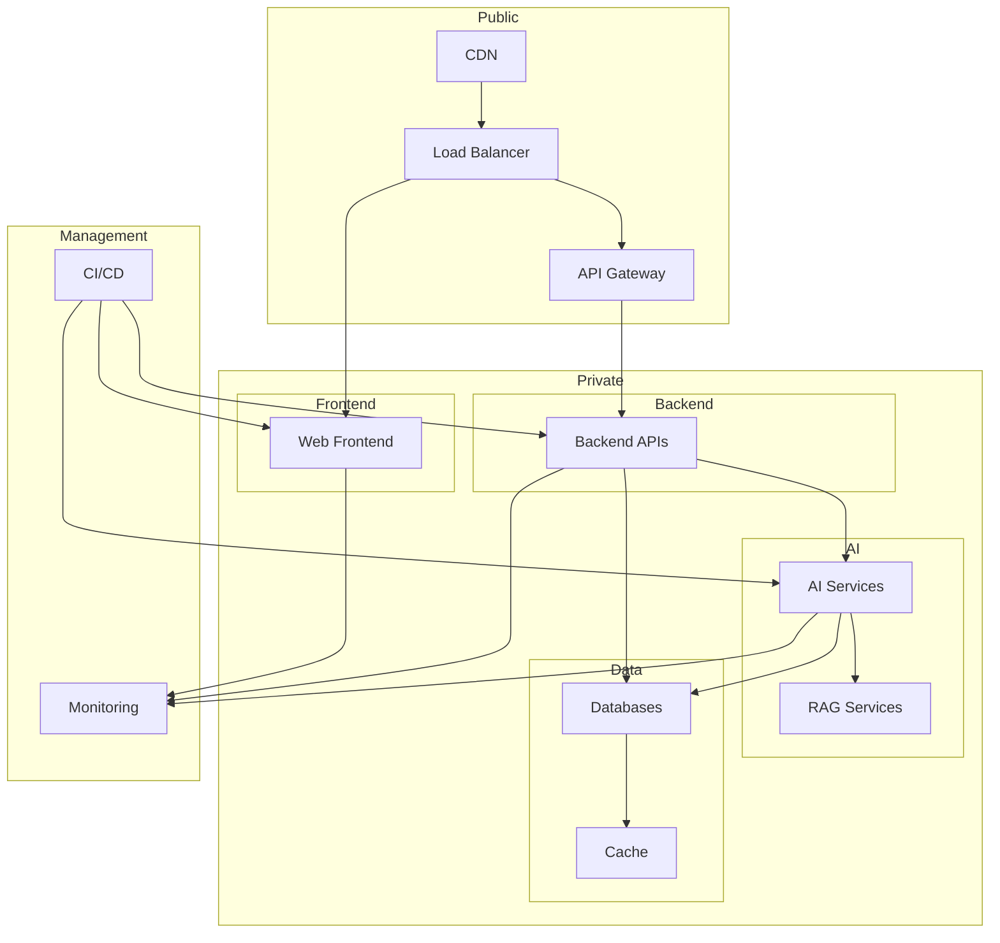
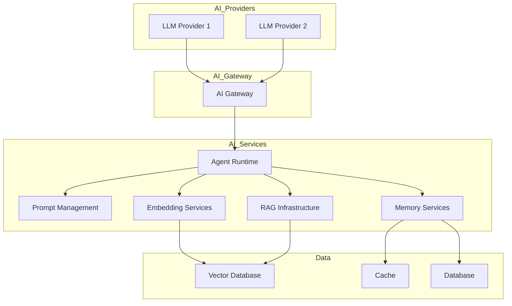
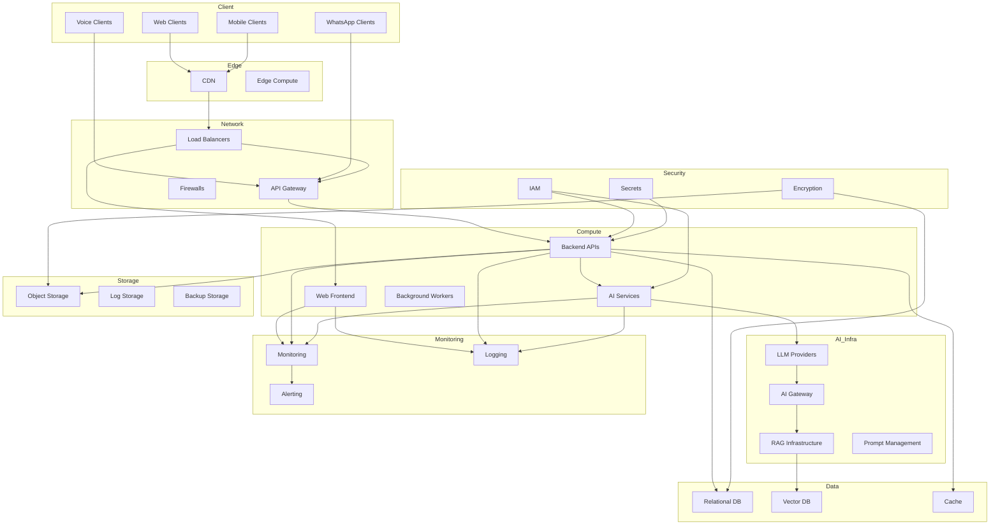
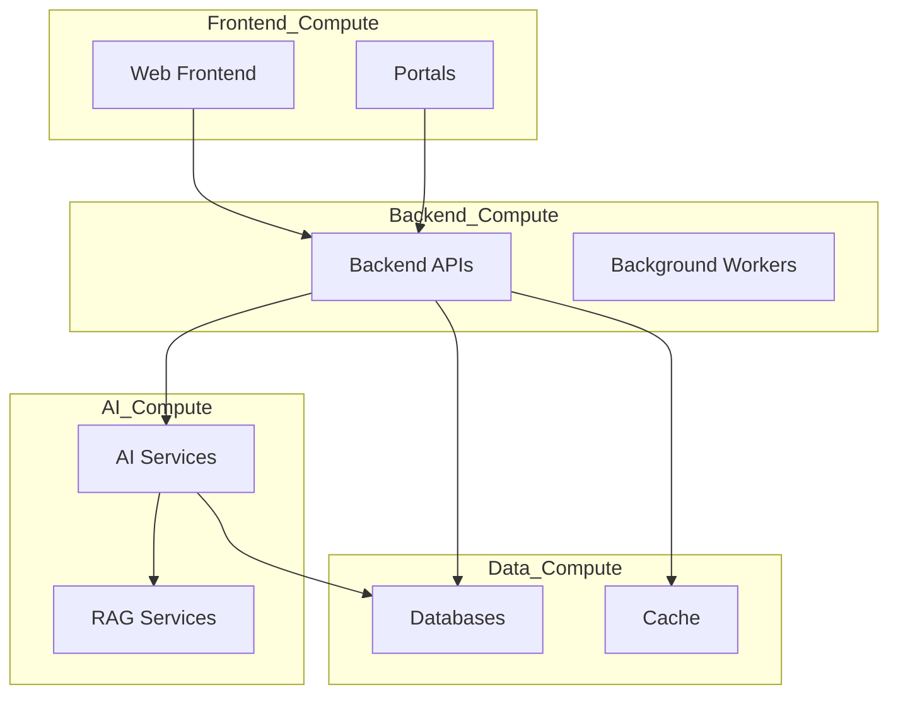
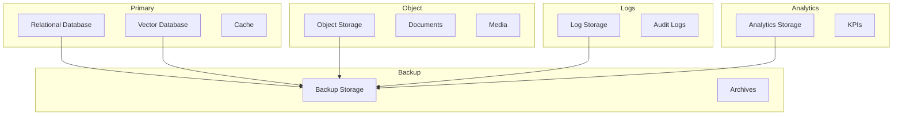
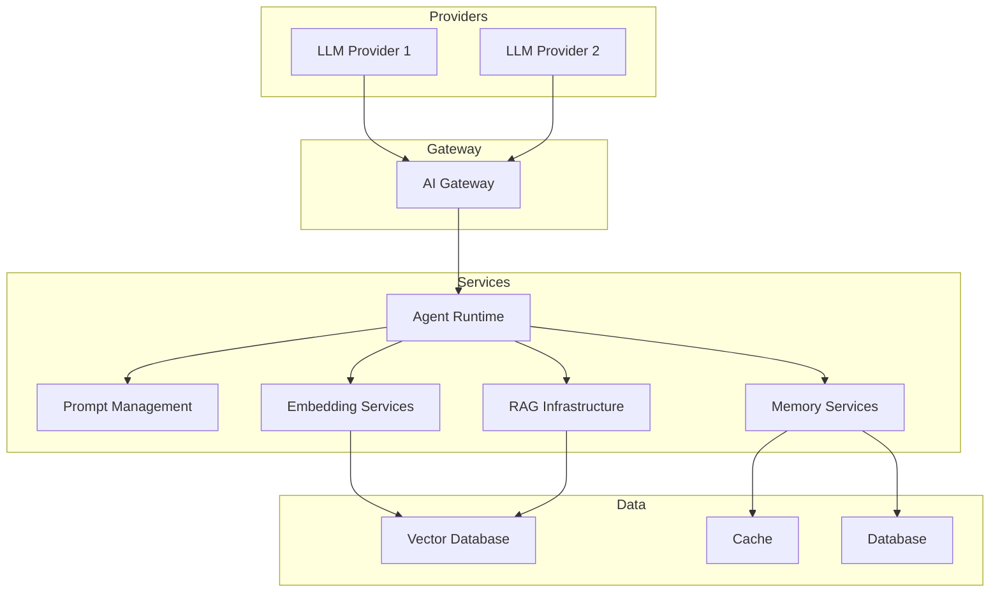
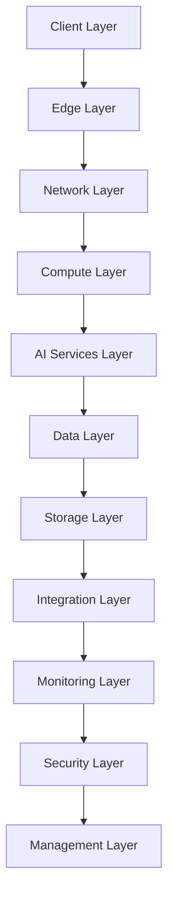
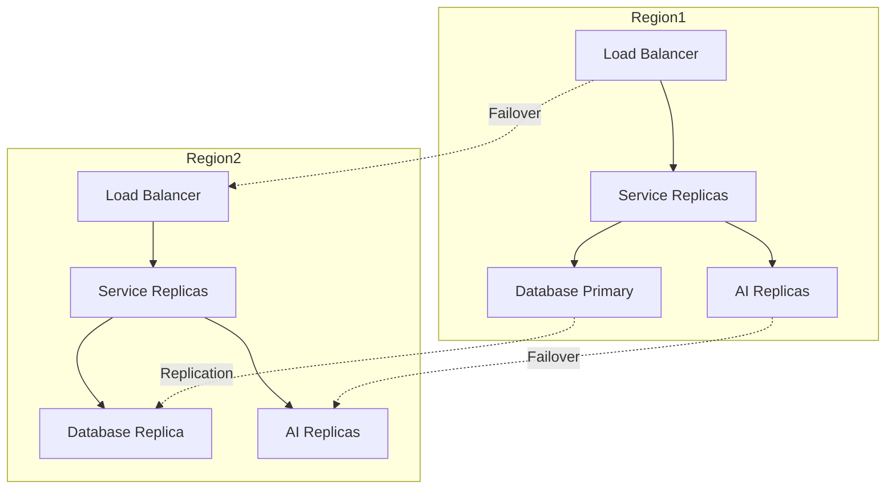

# 02_System_Architecture/12_INFRASTRUCTURE_ARCHITECTURE.md

# Dayjoy Enterprise AI Platform — Infrastructure Architecture

> **Purpose:** Define the logical infrastructure architecture for the Dayjoy Enterprise AI Platform, covering compute resources, networking, storage, AI infrastructure, monitoring infrastructure, security boundaries, scalability, resilience, and operational services.
>
> **Scope:** Logical infrastructure architecture only — no cloud-specific commands, Terraform, Kubernetes manifests, or implementation details.
>
> **Audience:** Infrastructure architects, DevOps engineers, platform engineers, security teams, and operations.

---

## Table of Contents

1. [Infrastructure Overview](#1-infrastructure-overview)
2. [Infrastructure Layers](#2-infrastructure-layers)
3. [Compute Architecture](#3-compute-architecture)
4. [Network Architecture](#4-network-architecture)
5. [Storage Architecture](#5-storage-architecture)
6. [AI Infrastructure](#6-ai-infrastructure)
7. [Scalability & Resilience](#7-scalability--resilience)
8. [Infrastructure Security](#8-infrastructure-security)
9. [Operations Infrastructure](#9-operations-infrastructure)
10. [Infrastructure Governance](#10-infrastructure-governance)
11. [Future Infrastructure Roadmap](#11-future-infrastructure-roadmap)
12. [Architecture Diagrams](#12-architecture-diagrams)

---

## 1. Infrastructure Overview

### 1.1 Infrastructure Objectives

The Dayjoy infrastructure architecture provides a **scalable, secure, resilient, and observable foundation** for all platform services, AI systems, and business operations.[02_System_Architecture/00_SYSTEM_OVERVIEW.md][02_System_Architecture/01_HIGH_LEVEL_ARCHITECTURE.md]

Key objectives:

- **Scalability:** Support growing users, AI interactions, and data volumes.
- **Reliability:** High availability and fault tolerance for critical services.
- **Security:** Secure infrastructure with clear boundaries and access controls.
- **Observability:** Comprehensive monitoring, logging, and alerting.
- **Efficiency:** Optimized resource utilization and cost management.

### 1.2 Design Principles

- **Modularity:** Logical separation of concerns across layers.
- **Automation:** Infrastructure as code and automated operations.
- **Security-by-Design:** Security integrated at all layers.
- **Resilience:** Fault isolation, redundancy, and recovery.
- **Observability:** Metrics, logs, and traces for all components.

### 1.3 Business Requirements

- **24/7 Availability:** AI channels (Website, WhatsApp, Voice) always available.
- **Performance:** Low-latency responses for AI interactions.
- **Compliance:** Secure handling of customer, distributor, and business data.
- **Cost Efficiency:** Optimized infrastructure costs.

### 1.4 High-Level Infrastructure Strategy

- **Cloud-Native:** Leverage managed services where possible.
- **Containerized:** All services containerized for portability.
- **Microservices:** Modular services for scalability and maintainability.
- **Multi-Layer:** Clear separation of client, edge, network, compute, data, and security layers.

### 1.5 Operational Goals

- **Automated Operations:** Minimal manual intervention.
- **Proactive Monitoring:** Detect and resolve issues before impact.
- **Continuous Improvement:** Regular optimization and upgrades.

---

## 2. Infrastructure Layers

### 2.1 Layer Catalog

| Layer ID | Layer Name | Purpose | Responsibilities | Dependencies | High Availability Considerations |
|---|---|---|---|---|---|
| LAYER-CLIENT-001 | Client Layer | User and system access points | Web browsers, mobile apps, voice calls, WhatsApp clients | Edge Layer | CDN, multiple endpoints |
| LAYER-EDGE-001 | Edge Layer | Edge processing and caching | CDN, edge compute, DDoS protection | Client, Network | Multi-edge locations |
| LAYER-NET-001 | Network Layer | Network communication | VPC, subnets, routing, firewalls, load balancers | All layers | Redundant networks, multi-AZ |
| LAYER-COMP-001 | Compute Layer | Compute resources | VMs, containers, serverless for all services | Network, Storage | Auto scaling, multiple replicas |
| LAYER-AI-001 | AI Services Layer | AI infrastructure | LLM providers, AI gateway, RAG, agents | Compute, Data, Storage | Multiple AI providers, fallback |
| LAYER-DATA-001 | Data Layer | Data storage and processing | Databases, vector DB, cache | Compute, Storage | Replication, backups |
| LAYER-STOR-001 | Storage Layer | Persistent storage | Object storage, log storage, backup storage | Data, Network | Versioning, geo-redundancy |
| LAYER-INT-001 | Integration Layer | External integrations | API gateways, webhooks, event buses | Network, AI, Data | Redundant integrations |
| LAYER-MON-001 | Monitoring Layer | Observability | Logging, metrics, tracing, alerting | All layers | Redundant monitoring |
| LAYER-SEC-001 | Security Layer | Security controls | IAM, encryption, secrets, firewalls | All layers | Multi-layer security |
| LAYER-MGMT-001 | Management Layer | Infrastructure management | IaC, config management, CI/CD | All layers | Versioned infrastructure |

---

## 3. Compute Architecture

### 3.1 Compute Resources

| Component | Purpose | Resource Type | Scaling Strategy | Availability Requirements |
|---|---|---|---|---|
| Web Frontend | Serve website and portals | Containers/VMs | Horizontal auto scaling | 99.9%+ |
| Backend APIs | Business logic and data access | Containers | Horizontal auto scaling | 99.9%+ |
| AI Services | AI agents and orchestration | Containers | Horizontal auto scaling | 99.5%+ |
| Voice AI | Voice call handling | Containers | Horizontal auto scaling | 99.5%+ |
| WhatsApp AI | WhatsApp messaging | Containers | Horizontal auto scaling | 99.5%+ |
| RAG Services | Retrieval and embeddings | Containers | Horizontal auto scaling | 99.5%+ |
| Automation Engine | Workflow orchestration | Containers/Serverless | Horizontal auto scaling | 99.5%+ |
| Background Workers | Async tasks | Containers/Serverless | Horizontal auto scaling | 99%+ |
| Scheduled Jobs | Periodic tasks | Serverless/Containers | Fixed capacity | 99%+ |

---

## 4. Network Architecture

### 4.1 Logical Network Design

- **Internal Communication:**
  - Services communicate via internal network (VPC).
  - Service mesh or internal load balancers for service-to-service.

- **External Communication:**
  - API Gateway for all external traffic.
  - Load balancers for frontend services.

- **API Traffic:**
  - All API traffic through API Gateway.
  - Rate limiting and auth at gateway.

- **AI Service Communication:**
  - AI services communicate via internal network.
  - AI Gateway for external AI provider calls.

- **Network Segmentation:**
  - Separate subnets for frontend, backend, AI, data, and management.
  - Security groups/firewalls between segments.

- **Trust Boundaries:**
  - Public zone (frontend, API Gateway).
  - Private zone (backend, AI, data).
  - Management zone (monitoring, CI/CD).

- **Secure Communication Channels:**
  - TLS for all external and internal communication.
  - mTLS for service-to-service (future).

### 4.2 Logical Network Diagram

---

## 5. Storage Architecture

### 5.1 Storage Systems

| Storage Type | Purpose | Role | Availability Requirements |
|---|---|---|---|
| Relational Database | Core business data | Customer, distributor, product, order data | 99.9%+ |
| Vector Database | Embeddings and semantic search | RAG and AI retrieval | 99.5%+ |
| Object Storage | Documents, media, recordings | Knowledge docs, call recordings, images | 99.9%+ |
| Cache | Session and hot data | Fast access to frequently used data | 99.5%+ |
| Log Storage | System and AI logs | Centralized logging | 99.9%+ |
| Analytics Storage | Aggregated metrics | Dashboards and reports | 99.5%+ |
| Backup Storage | Disaster recovery | Backups and archives | 99.9%+ |

---

## 6. AI Infrastructure

### 6.1 AI Infrastructure Components

- **LLM Providers:**
  - External LLM providers for language understanding and generation.
  - Multiple providers for redundancy.

- **AI Gateway:**
  - Central gateway for all AI provider calls.
  - Rate limiting, auth, and monitoring.

- **Prompt Management:**
  - Centralized prompt storage and versioning.
  - Dynamic prompt configuration.

- **Embedding Services:**
  - Generate embeddings for RAG and semantic search.
  - Cached embeddings for performance.

- **RAG Infrastructure:**
  - Vector database for embeddings.
  - Retrieval and ranking services.

- **Agent Runtime:**
  - Containerized AI agents.
  - Auto scaling for AI workloads.

- **Memory Services:**
  - Session and preference memory.
  - Cache and database for memory storage.

### 6.2 AI Infrastructure Diagram

---

## 7. Scalability & Resilience

### 7.1 Scalability Strategies

- **Horizontal Scaling:**
  - Stateless services scaled horizontally.
  - Load balancers distribute traffic.

- **Vertical Scaling:**
  - Stateful services (databases) scaled vertically.

- **Auto Scaling:**
  - Auto scaling based on CPU, memory, and request volume.

- **Load Balancing:**
  - Load balancers for all services.
  - Health checks ensure traffic to healthy instances.

### 7.2 Resilience Strategies

- **Fault Isolation:**
  - Services isolated to prevent cascading failures.
  - Circuit breakers for external calls.

- **Redundancy:**
  - Multiple replicas for all critical services.
  - Multi-AZ or multi-region for databases and storage.

- **High Availability:**
  - Automatic failover for databases and critical services.
  - DNS failover for frontend services.

- **Capacity Planning:**
  - Regular capacity planning based on usage trends.
  - Proactive scaling before peak periods.

---

## 8. Infrastructure Security

### 8.1 Security Controls

- **Network Security:**
  - Firewalls and security groups.
  - Network segmentation and isolation.

- **Infrastructure Access Control:**
  - RBAC for all infrastructure access.
  - MFA for administrative access.

- **Secret Management:**
  - Centralized secret storage (e.g., Vault).
  - Regular secret rotation.

- **Encryption:**
  - TLS for all communication.
  - Encryption at rest for all data.

- **Firewall Strategy:**
  - Allow only necessary traffic.
  - Default deny all.

- **Service Isolation:**
  - Separate networks for different tiers.
  - Container isolation for services.

- **Administrative Access:**
  - Limited administrative access.
  - Audit logs for all admin actions.

- **Security Boundaries:**
  - Clear boundaries between public, private, and management zones.

---

## 9. Operations Infrastructure

### 9.1 Operational Services

- **Logging:**
  - Centralized logging for all services.
  - Log aggregation and search.

- **Monitoring:**
  - Metrics for all services.
  - Dashboards and alerts.

- **Alerting:**
  - Alerts for errors, latency, and availability.
  - Escalation policies.

- **Configuration Management:**
  - Centralized configuration for all services.
  - Versioned configuration.

- **Secrets Management:**
  - Centralized secret storage.
  - Secret rotation and audit.

- **Backup Services:**
  - Automated backups for all data.
  - Regular backup verification.

- **Time Synchronization:**
  - NTP for all systems.
  - Consistent time across infrastructure.

- **Audit Logging:**
  - Audit logs for all infrastructure changes.
  - Compliance and security reviews.

---

## 10. Infrastructure Governance

### 10.1 Governance Standards

- **Infrastructure Standards:**
  - Standardized infrastructure patterns.
  - Approved services and configurations.

- **Naming Conventions:**
  - Consistent naming for all resources.
  - Environment and service prefixes.

- **Environment Separation:**
  - Strict separation between environments.
  - No cross-environment access.

- **Resource Ownership:**
  - Clear ownership for all resources.
  - Tagging for cost tracking.

- **Change Management:**
  - All changes via IaC.
  - Change approval process.

- **Documentation Standards:**
  - All infrastructure documented.
  - Runbooks and SOPs available.

- **Review Process:**
  - Regular infrastructure reviews.
  - Security and compliance audits.

---

## 11. Future Infrastructure Roadmap

### 11.1 Future Recommendations

| Capability | Purpose | Status |
|---|---|---|
| Multi-Region Deployment | Global availability and failover | Future |
| Multi-Cloud Architecture | Avoid vendor lock-in | Future |
| Edge AI | Low-latency AI at edge | Future |
| GPU Clusters | AI model training and inference | Future |
| Global Load Balancing | Global traffic distribution | Future |
| CDN Integration | Edge caching and delivery | Future |
| AI Accelerator Infrastructure | Specialized AI hardware | Future |
| Hybrid Cloud | On-prem and cloud integration | Future |

All future capabilities must integrate with existing security, monitoring, and governance models.

---

## 12. Architecture Diagrams

### 12.1 Infrastructure Architecture

### 12.2 Logical Network Architecture

### 12.3 Compute Architecture

### 12.4 Storage Architecture

### 12.5 AI Infrastructure

### 12.6 Infrastructure Layer Diagram

### 12.7 High Availability Architecture

---

**END OF DOCUMENT**