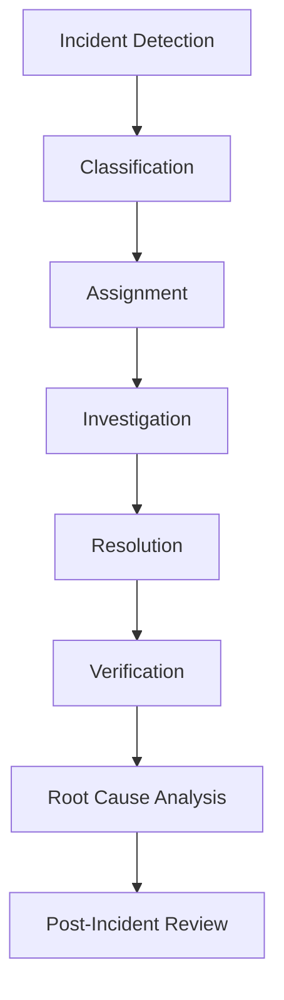
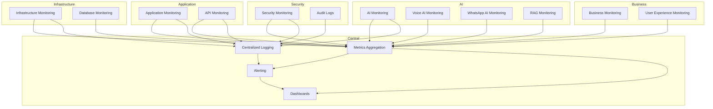
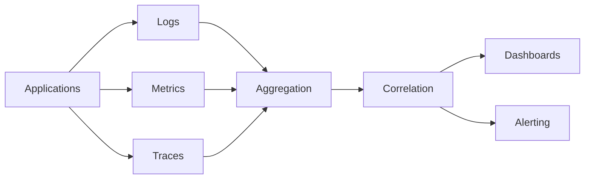
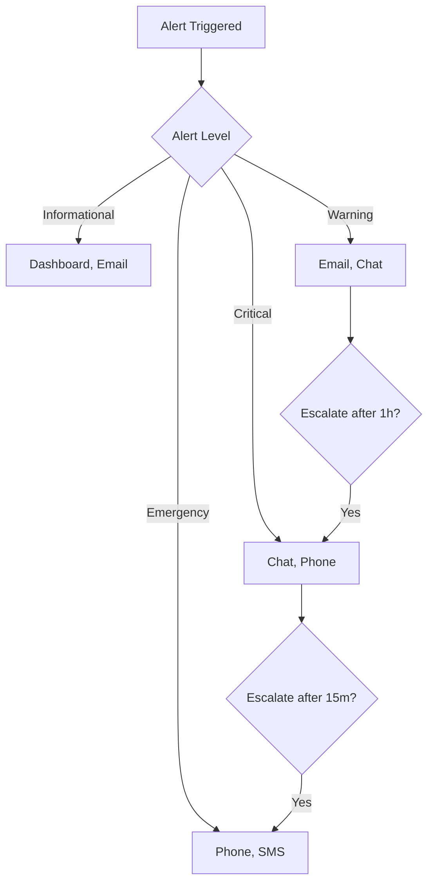
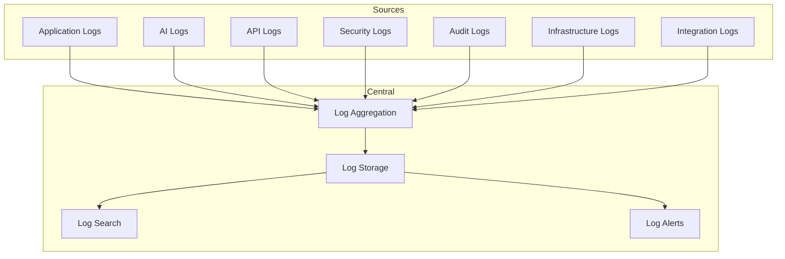
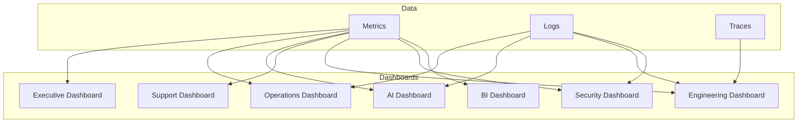
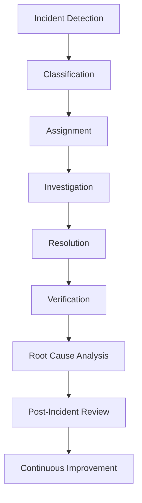

# 02_System_Architecture/13_MONITORING_ARCHITECTURE.md

# Dayjoy Enterprise AI Platform — Monitoring & Observability Architecture

> **Purpose:** Define the complete monitoring and observability architecture for the Dayjoy Enterprise AI Platform, ensuring proactive monitoring, rapid issue detection, business visibility, AI performance measurement, and operational excellence.
>
> **Scope:** Monitoring architecture, governance, KPIs, and observability only — no implementation code or vendor-specific monitoring tools.
>
> **Audience:** Operations teams, DevOps, SRE, AI engineers, security teams, management, and business stakeholders.

---

## Table of Contents

1. [Monitoring Overview](#1-monitoring-overview)
2. [Monitoring Domains](#2-monitoring-domains)
3. [Metrics Architecture](#3-metrics-architecture)
4. [Logging Architecture](#4-logging-architecture)
5. [Alerting Strategy](#5-alerting-strategy)
6. [AI Monitoring](#6-ai-monitoring)
7. [Business Monitoring](#7-business-monitoring)
8. [Incident Management](#8-incident-management)
9. [Dashboards](#9-dashboards)
10. [Monitoring Governance](#10-monitoring-governance)
11. [Future Monitoring Roadmap](#11-future-monitoring-roadmap)
12. [Architecture Diagrams](#12-architecture-diagrams)

---

## 1. Monitoring Overview

### 1.1 Monitoring Objectives

The Dayjoy monitoring and observability architecture ensures **proactive detection, rapid resolution, and continuous improvement** of all platform components, AI systems, and business processes.[02_System_Architecture/00_SYSTEM_OVERVIEW.md][02_System_Architecture/01_HIGH_LEVEL_ARCHITECTURE.md]

Key objectives:

- **Proactive Monitoring:** Detect issues before they impact users.
- **Rapid Issue Detection:** Fast identification of failures and anomalies.
- **Business Visibility:** Clear view of business KPIs and AI performance.
- **AI Performance Measurement:** Monitor AI accuracy, retrieval quality, and user satisfaction.
- **Operational Excellence:** Continuous improvement through metrics and insights.

### 1.2 Business Goals

- **24/7 Availability:** AI channels (Website, WhatsApp, Voice) always available.
- **High Quality:** AI responses accurate and helpful.
- **User Satisfaction:** High customer and distributor satisfaction.
- **Efficiency:** Automated operations with minimal manual intervention.

### 1.3 Observability Principles

- **Metrics:** Quantitative measurements of system health and performance.
- **Logs:** Detailed records of events and errors.
- **Traces:** End-to-end request tracking across services.
- **Correlation:** Link metrics, logs, and traces for root cause analysis.

### 1.4 Monitoring Strategy

- **Layered Monitoring:** Infrastructure, application, AI, business, and security monitoring.
- **Automated Alerting:** Alerts for anomalies and threshold breaches.
- **Dashboards:** Role-based dashboards for different stakeholders.
- **Continuous Improvement:** Regular review and optimization of metrics and alerts.

### 1.5 Success Criteria

- **MTTD (Mean Time to Detect):** < 5 minutes for critical issues.
- **MTTR (Mean Time to Resolve):** < 1 hour for critical issues.
- **Alert Accuracy:** > 95% of alerts are actionable.
- **User Satisfaction:** > 90% positive feedback.

---

## 2. Monitoring Domains

### 2.1 Domain Catalog

| Domain ID | Domain Name | Purpose | Scope | Business Owner | Criticality |
|---|---|---|---|---|---|
| MON-INFRA-001 | Infrastructure Monitoring | Monitor servers, networks, storage | All infrastructure | DevOps / SRE | Critical |
| MON-APP-001 | Application Monitoring | Monitor application health and performance | All applications | Engineering | Critical |
| MON-API-001 | API Monitoring | Monitor API availability and performance | All APIs | Engineering | Critical |
| MON-AI-001 | AI Monitoring | Monitor AI agents and performance | All AI services | AI Team | Critical |
| MON-VOICE-001 | Voice AI Monitoring | Monitor Voice AI calls and quality | Voice AI | AI / Voice Ops | High |
| MON-WA-001 | WhatsApp AI Monitoring | Monitor WhatsApp AI conversations | WhatsApp AI | AI / CX | High |
| MON-RAG-001 | RAG Monitoring | Monitor RAG retrieval quality | RAG Service | AI / Knowledge | High |
| MON-DB-001 | Database Monitoring | Monitor database health and performance | All databases | DevOps / DBA | Critical |
| MON-SEC-001 | Security Monitoring | Monitor security events and threats | All security | Security Team | Critical |
| MON-BIZ-001 | Business Monitoring | Monitor business KPIs and metrics | All business | Management | High |
| MON-UX-001 | User Experience Monitoring | Monitor user satisfaction and UX | All user-facing | CX / Product | High |

---

## 3. Metrics Architecture

### 3.1 Metrics Catalog

| Metric ID | Metric Name | Description | Unit | Collection Frequency | Target Value | Warning Threshold | Critical Threshold |
|---|---|---|---|---|---|---|---|
| MET-AVAIL-001 | System Availability | Percentage of time system is available | % | 1 minute | 99.9% | 99.5% | 99% |
| MET-RESP-001 | API Response Time | Average API response time | ms | 1 minute | < 200ms | 500ms | 1000ms |
| MET-THRU-001 | Throughput | Requests per second | req/s | 1 minute | Based on capacity | 80% capacity | 95% capacity |
| MET-ERR-001 | Error Rate | Percentage of failed requests | % | 1 minute | < 0.1% | 1% | 5% |
| MET-RES-001 | Resource Utilization | CPU/Memory usage | % | 1 minute | < 70% | 80% | 90% |
| MET-AI-ACC-001 | AI Accuracy | Percentage of accurate AI responses | % | Per conversation | > 90% | 85% | 80% |
| MET-RAG-QUAL-001 | RAG Quality | Relevance of retrieved knowledge | Score 1-5 | Per query | > 4.5 | 4.0 | 3.5 |
| MET-USAT-001 | User Satisfaction | User satisfaction score | Score 1-5 | Per conversation | > 4.5 | 4.0 | 3.5 |
| MET-BIZ-001 | Business KPIs | Business-specific metrics | Varies | Hourly/Daily | Based on goals | 80% of goal | 60% of goal |

---

## 4. Logging Architecture

### 4.1 Log Categories

- **Application Logs:**
  - Application events, errors, and warnings.
  - Retention: 30 days.
  - Owner: Engineering.
  - Access: Engineering, DevOps.

- **AI Logs:**
  - AI interactions, prompts, responses, tool calls.
  - Retention: 90 days.
  - Owner: AI Team.
  - Access: AI Team, Security.

- **API Logs:**
  - API requests, responses, errors.
  - Retention: 30 days.
  - Owner: Engineering.
  - Access: Engineering, Security.

- **Security Logs:**
  - Security events, auth failures, access logs.
  - Retention: 1 year.
  - Owner: Security Team.
  - Access: Security, Admin.

- **Audit Logs:**
  - Audit trails for all changes.
  - Retention: 7 years.
  - Owner: Security / Compliance.
  - Access: Security, Compliance, Admin.

- **Infrastructure Logs:**
  - Server, network, storage logs.
  - Retention: 30 days.
  - Owner: DevOps.
  - Access: DevOps, Security.

- **Integration Logs:**
  - External integration logs (WhatsApp, Vapi, payments).
  - Retention: 30 days.
  - Owner: Engineering.
  - Access: Engineering, Security.

### 4.2 Log Management

- **Centralized Logging:** All logs aggregated in central logging system.
- **Log Levels:** DEBUG, INFO, WARN, ERROR, CRITICAL.
- **Log Search:** Full-text search and filtering.
- **Log Alerts:** Alerts for error spikes and critical events.

---

## 5. Alerting Strategy

### 5.1 Alert Levels

| Alert Level | Trigger Conditions | Notification Channels | Escalation Rules | Response Expectations |
|---|---|---|---|---|
| Informational | Non-critical events | Dashboard, Email | None | Review during business hours |
| Warning | Potential issues | Email, Chat | Escalate after 1 hour | Respond within 4 hours |
| Critical | Service degradation | Chat, Phone | Escalate after 15 minutes | Respond within 1 hour |
| Emergency | Service outage | Phone, SMS | Immediate escalation | Respond immediately |

### 5.2 Alert Management

- **Alert Deduplication:** Avoid duplicate alerts.
- **Alert Suppression:** Suppress alerts during maintenance.
- **Alert Routing:** Route alerts to appropriate teams.
- **Alert Review:** Regular review of alert effectiveness.

---

## 6. AI Monitoring

### 6.1 AI Metrics

- **AI Availability:**
  - Percentage of time AI services are available.
  - Target: > 99.5%.

- **Hallucination Rate:**
  - Percentage of AI responses with hallucinations.
  - Target: < 5%.

- **Response Accuracy:**
  - Percentage of accurate AI responses.
  - Target: > 90%.

- **Confidence Scores:**
  - Average AI confidence score.
  - Target: > 0.8.

- **Tool Success Rate:**
  - Percentage of successful tool calls.
  - Target: > 99%.

- **Prompt Performance:**
  - Prompt effectiveness and consistency.
  - Target: > 90% consistency.

- **Context Quality:**
  - Quality of AI context and memory.
  - Target: > 90% relevance.

- **Human Escalation Rate:**
  - Percentage of conversations escalated to human.
  - Target: < 10%.

---

## 7. Business Monitoring

### 7.1 Business Metrics

- **Customer Satisfaction:**
  - Average customer satisfaction score.
  - Target: > 4.5/5.

- **Distributor Activity:**
  - Active distributors, team growth.
  - Target: Based on goals.

- **AI Adoption:**
  - Percentage of interactions handled by AI.
  - Target: > 80%.

- **Automation Success:**
  - Percentage of successful automations.
  - Target: > 95%.

- **Sales Support:**
  - Sales assisted by AI.
  - Target: Based on goals.

- **Knowledge Usage:**
  - Knowledge base usage and retrieval.
  - Target: Increasing trend.

- **Productivity Improvements:**
  - Time saved through automation.
  - Target: Measurable improvement.

---

## 8. Incident Management

### 8.1 Incident Workflow

1. **Incident Detection:**
   - Automated alerts or manual reporting.

2. **Classification:**
   - Classify by severity (Informational, Warning, Critical, Emergency).

3. **Assignment:**
   - Assign to appropriate team or on-call.

4. **Investigation:**
   - Investigate root cause using metrics, logs, and traces.

5. **Resolution:**
   - Implement fix or workaround.

6. **Verification:**
   - Verify resolution and monitor for recurrence.

7. **Root Cause Analysis:**
   - Conduct RCA for critical incidents.

8. **Post-Incident Review:**
   - Review and document lessons learned.

### 8.2 Incident Management Diagram

---

## 9. Dashboards

### 9.1 Dashboard Catalog

| Dashboard Name | Audience | Metrics | Update Frequency | Primary Decisions Supported |
|---|---|---|---|---|
| Executive Dashboard | Executive Management | Business KPIs, AI Adoption, User Satisfaction | Hourly | Strategic decisions, resource allocation |
| Operations Dashboard | Operations | System Availability, Error Rates, Resource Utilization | Real-time | Operational decisions, incident response |
| AI Dashboard | AI Team | AI Accuracy, Hallucination Rate, RAG Quality | Real-time | AI improvements, prompt tuning |
| Support Dashboard | Support Team | User Satisfaction, Escalation Rate, Resolution Time | Real-time | Support staffing, training needs |
| Engineering Dashboard | Engineering | API Response Time, Throughput, Error Rate | Real-time | Performance optimization, bug fixes |
| Security Dashboard | Security | Security Events, Auth Failures, Threat Detection | Real-time | Security response, threat mitigation |
| BI Dashboard | Business Intelligence | Sales, Distributor Activity, Productivity | Daily | Business strategy, performance tracking |

---

## 10. Monitoring Governance

### 10.1 Governance Standards

- **Metric Ownership:**
  - Each metric has a clear owner responsible for accuracy and relevance.

- **Dashboard Ownership:**
  - Each dashboard has an owner responsible for maintenance and updates.

- **Review Schedule:**
  - Monthly review of metrics, alerts, and dashboards.
  - Quarterly review of monitoring strategy.

- **KPI Validation:**
  - Regular validation of KPIs against business goals.

- **Reporting Standards:**
  - Standardized reporting formats and frequency.

- **Continuous Improvement Process:**
  - Regular optimization of metrics, alerts, and dashboards.
  - Feedback loop from operations and business teams.

---

## 11. Future Monitoring Roadmap

### 11.1 Future Recommendations

| Capability | Purpose | Status |
|---|---|---|
| Predictive Monitoring | Predict issues before they occur | Future |
| AI-Based Anomaly Detection | Detect anomalies using AI | Future |
| Automated Root Cause Analysis | Automatically identify root causes | Future |
| Self-Healing Infrastructure | Automatic remediation of issues | Future |
| Capacity Forecasting | Predict capacity needs | Future |
| Intelligent Alert Prioritization | Prioritize alerts using AI | Future |

All future capabilities must integrate with existing monitoring, alerting, and governance models.

---

## 12. Architecture Diagrams

### 12.1 Monitoring Architecture

### 12.2 Observability Flow

### 12.3 Alert Escalation Workflow

### 12.4 Logging Architecture

### 12.5 Dashboard Architecture

### 12.6 Incident Management Workflow

---

**END OF DOCUMENT**