# 02_System_Architecture/14_DISASTER_RECOVERY.md

# Dayjoy Enterprise AI Platform — Disaster Recovery & Business Continuity Architecture

> **Purpose:** Define the enterprise disaster recovery and business continuity architecture for the Dayjoy Enterprise AI Platform, ensuring business continuity, rapid service restoration, data protection, infrastructure resilience, AI service recovery, and operational continuity during unexpected failures.
>
> **Scope:** Disaster recovery architecture, governance, recovery planning, and resilience only — no implementation code or cloud-specific recovery procedures.
>
> **Audience:** Operations teams, DevOps, SRE, security teams, management, and business stakeholders.

---

## Table of Contents

1. [Disaster Recovery Overview](#1-disaster-recovery-overview)
2. [Business Impact Analysis](#2-business-impact-analysis)
3. [Recovery Objectives](#3-recovery-objectives)
4. [Disaster Scenarios](#4-disaster-scenarios)
5. [Backup Strategy](#5-backup-strategy)
6. [Service Recovery Workflow](#6-service-recovery-workflow)
7. [AI Recovery Strategy](#7-ai-recovery-strategy)
8. [Communication Plan](#8-communication-plan)
9. [Disaster Recovery Governance](#9-disaster-recovery-governance)
10. [Disaster Recovery Testing](#10-disaster-recovery-testing)
11. [Continuous Improvement](#11-continuous-improvement)
12. [Future Resilience Roadmap](#12-future-resilience-roadmap)
13. [Architecture Diagrams](#13-architecture-diagrams)

---

## 1. Disaster Recovery Overview

### 1.1 Recovery Objectives

The Dayjoy disaster recovery (DR) architecture ensures **rapid recovery, minimal data loss, and continuous business operations** during unexpected failures, outages, or disasters.[02_System_Architecture/00_SYSTEM_OVERVIEW.md][02_System_Architecture/01_HIGH_LEVEL_ARCHITECTURE.md]

Key objectives:

- **Rapid Recovery:** Restore critical services within defined RTOs.
- **Minimal Data Loss:** Recover data within defined RPOs.
- **Business Continuity:** Maintain essential business functions during recovery.
- **Infrastructure Resilience:** Design for fault tolerance and failover.
- **AI Service Recovery:** Ensure AI agents and knowledge services recover quickly.

### 1.2 Business Continuity Goals

- **24/7 Availability:** AI channels (Website, WhatsApp, Voice) always available.
- **Critical Functions:** Authentication, APIs, customer/distributor support always operational.
- **Data Protection:** All data backed up and recoverable.
- **Operational Continuity:** Operations teams can continue critical work during recovery.

### 1.3 Recovery Principles

- **Prioritized Recovery:** Critical services recovered first.
- **Automated Recovery:** Automated failover and restore where possible.
- **Tested Procedures:** All recovery procedures regularly tested.
- **Documented Processes:** Clear, accessible documentation for all scenarios.
- **Continuous Improvement:** Regular reviews and updates based on lessons learned.

### 1.4 Critical Business Services

- **Voice AI:** Inbound/outbound voice calls.
- **WhatsApp AI:** WhatsApp messaging and support.
- **Website AI:** Website chat and support.
- **Customer Support:** Order tracking, returns, complaints.
- **Distributor Support:** Compensation, rank, onboarding.
- **Knowledge Platform:** Knowledge base and RAG.
- **Authentication:** User, distributor, employee authentication.
- **APIs:** All business and AI APIs.
- **Administration:** Admin and configuration management.

### 1.5 Recovery Scope

- **Infrastructure:** Servers, networks, storage, databases.
- **Applications:** All frontend, backend, and AI services.
- **Data:** All business data, knowledge, AI memory, configurations.
- **Integrations:** External integrations (WhatsApp, Vapi, payments).
- **Operations:** Monitoring, alerting, support operations.

---

## 2. Business Impact Analysis

### 2.1 Critical Business Functions

| Business Function ID | Function Name | Criticality Level | Business Impact | Maximum Acceptable Downtime | Recovery Priority |
|---|---|---|---|---|---|
| BIZ-VOICE-001 | Voice AI | Critical | Complete loss of voice support | 15 minutes | 1 |
| BIZ-WA-001 | WhatsApp AI | Critical | Complete loss of WhatsApp support | 15 minutes | 1 |
| BIZ-WEB-001 | Website AI | Critical | Complete loss of website support | 15 minutes | 1 |
| BIZ-CUST-001 | Customer Support | Critical | Inability to support customers | 30 minutes | 2 |
| BIZ-DIST-001 | Distributor Support | Critical | Inability to support distributors | 30 minutes | 2 |
| BIZ-KB-001 | Knowledge Platform | High | Knowledge retrieval unavailable | 1 hour | 3 |
| BIZ-AUTH-001 | Authentication | Critical | No user/distributor login | 15 minutes | 1 |
| BIZ-API-001 | APIs | Critical | All API access lost | 15 minutes | 1 |
| BIZ-ADM-001 | Administration | Medium | Admin operations limited | 4 hours | 4 |

---

## 3. Recovery Objectives

### 3.1 RTO/RPO Matrix

| System | RTO (Recovery Time Objective) | RPO (Recovery Point Objective) | Service Availability Target | Recovery Priority |
|---|---|---|---|---|
| Voice AI | 15 minutes | 5 minutes | 99.5% | 1 |
| WhatsApp AI | 15 minutes | 5 minutes | 99.5% | 1 |
| Website AI | 15 minutes | 5 minutes | 99.5% | 1 |
| Customer Support | 30 minutes | 15 minutes | 99% | 2 |
| Distributor Support | 30 minutes | 15 minutes | 99% | 2 |
| Knowledge Platform | 1 hour | 30 minutes | 99% | 3 |
| Authentication | 15 minutes | 5 minutes | 99.9% | 1 |
| APIs | 15 minutes | 5 minutes | 99.9% | 1 |
| Administration | 4 hours | 1 hour | 95% | 4 |
| Databases | 30 minutes | 15 minutes | 99.9% | 1 |
| AI Services | 30 minutes | 15 minutes | 99.5% | 2 |
| Monitoring | 1 hour | 30 minutes | 99% | 3 |

---

## 4. Disaster Scenarios

### 4.1 Disaster Scenario Catalog

#### Server Failure

- **Impact:** Services on failed server unavailable.
- **Detection:** Monitoring alerts, health check failures.
- **Immediate Response:** Failover to healthy replicas.
- **Recovery Process:** Replace failed server, restore from backup.
- **Validation:** Health checks, smoke tests.
- **Preventive Measures:** Redundant servers, auto healing.

#### Database Failure

- **Impact:** Data access lost, services degraded.
- **Detection:** Database monitoring alerts, connection failures.
- **Immediate Response:** Failover to replica.
- **Recovery Process:** Restore from backup, repair primary.
- **Validation:** Data integrity checks, query tests.
- **Preventive Measures:** Replication, regular backups.

#### Network Failure

- **Impact:** Network connectivity lost, services unreachable.
- **Detection:** Network monitoring, connectivity tests.
- **Immediate Response:** Route traffic via alternate paths.
- **Recovery Process:** Repair network, restore connectivity.
- **Validation:** Connectivity tests, latency checks.
- **Preventive Measures:** Redundant networks, multi-AZ.

#### AI Provider Outage

- **Impact:** AI services unavailable or degraded.
- **Detection:** AI monitoring, error rate spikes.
- **Immediate Response:** Failover to alternate AI provider.
- **Recovery Process:** Restore primary provider, validate.
- **Validation:** AI accuracy tests, response checks.
- **Preventive Measures:** Multiple AI providers, fallback strategies.

#### Cloud Service Failure

- **Impact:** Cloud services unavailable.
- **Detection:** Cloud provider alerts, service health.
- **Immediate Response:** Failover to alternate region/cloud.
- **Recovery Process:** Restore services, validate.
- **Validation:** Service health checks, functionality tests.
- **Preventive Measures:** Multi-region, multi-cloud strategy.

#### Storage Failure

- **Impact:** Data access lost, services degraded.
- **Detection:** Storage monitoring, access errors.
- **Immediate Response:** Failover to alternate storage.
- **Recovery Process:** Restore from backup, repair storage.
- **Validation:** Data integrity checks, access tests.
- **Preventive Measures:** Redundant storage, geo-replication.

#### Power Failure

- **Impact:** Infrastructure offline, services unavailable.
- **Detection:** Power monitoring, infrastructure alerts.
- **Immediate Response:** Failover to backup power/region.
- **Recovery Process:** Restore power, bring services online.
- **Validation:** Infrastructure health, service tests.
- **Preventive Measures:** UPS, generators, multi-region.

#### Internet Connectivity Loss

- **Impact:** External access lost, services unreachable.
- **Detection:** Network monitoring, connectivity tests.
- **Immediate Response:** Route via alternate ISPs/paths.
- **Recovery Process:** Restore connectivity, validate.
- **Validation:** Connectivity tests, latency checks.
- **Preventive Measures:** Multiple ISPs, redundant paths.

#### Cybersecurity Incident

- **Impact:** Data breach, service compromise.
- **Detection:** Security monitoring, intrusion detection.
- **Immediate Response:** Isolate affected systems, contain.
- **Recovery Process:** Eradicate threat, restore from clean backup.
- **Validation:** Security scans, penetration testing.
- **Preventive Measures:** Security controls, regular audits.

#### Data Corruption

- **Impact:** Data integrity compromised, services degraded.
- **Detection:** Data validation, integrity checks.
- **Immediate Response:** Isolate corrupted data, failover.
- **Recovery Process:** Restore from clean backup.
- **Validation:** Data integrity checks, validation tests.
- **Preventive Measures:** Regular backups, validation.

#### Human Error

- **Impact:** Accidental changes/deletions, service degradation.
- **Detection:** Audit logs, change monitoring.
- **Immediate Response:** Rollback changes, restore from backup.
- **Recovery Process:** Validate restoration, review changes.
- **Validation:** Functionality tests, data checks.
- **Preventive Measures:** Access control, change management.

---

## 5. Backup Strategy

### 5.1 Backup Catalog

| Backup Type | Scope | Frequency | Retention Policy | Recovery Method | Ownership |
|---|---|---|---|---|---|
| Data Backup | All business data | Daily full, hourly incremental | 30 days daily, 1 year monthly | Point-in-time restore | DevOps / DBA |
| Database Backup | All databases | Daily full, hourly incremental | 30 days daily, 1 year monthly | Point-in-time restore | DevOps / DBA |
| Knowledge Base Backup | Knowledge docs, RAG | Daily | 1 year | Restore from backup | Knowledge Team |
| AI Configuration Backup | AI prompts, configs | Per change | All versions | Version-based restore | AI Team |
| Infrastructure Config Backup | IaC, configs | Per change | All versions | Version-based restore | DevOps |
| Application Backup | All applications | Per release | All versions | Version-based restore | Engineering |

---

## 6. Service Recovery Workflow

### 6.1 Website Recovery

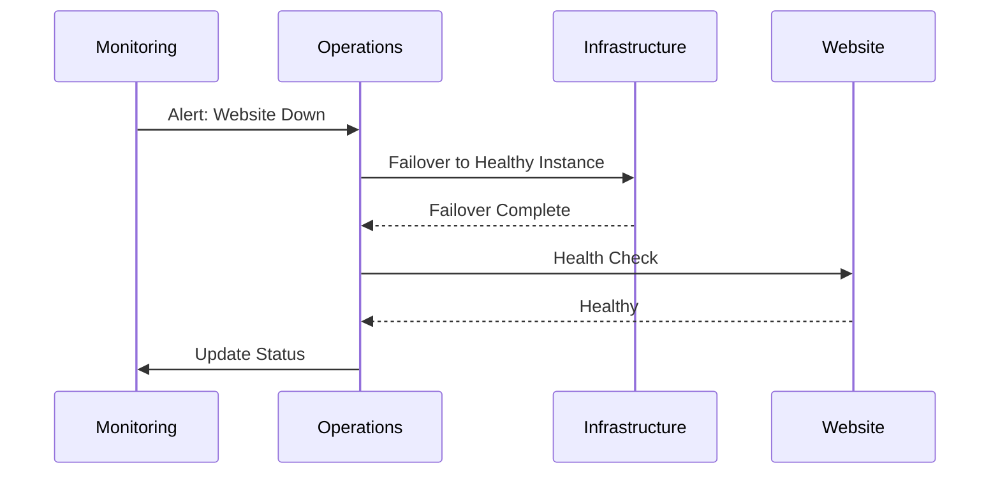

### 6.2 API Recovery

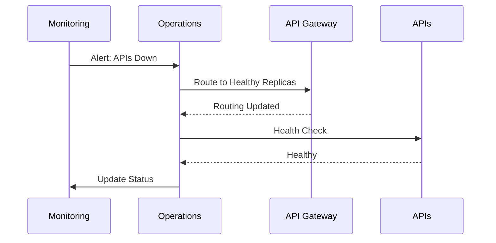

### 6.3 Voice AI Recovery

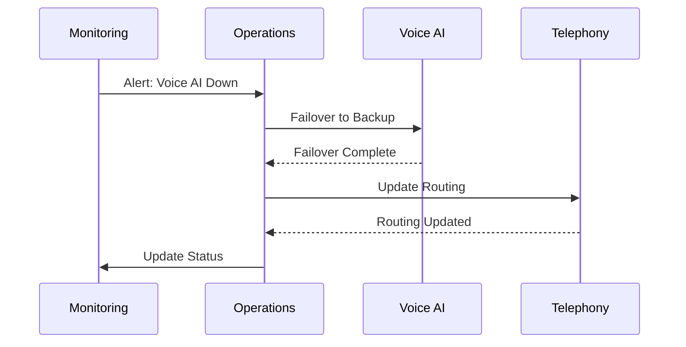

### 6.4 WhatsApp AI Recovery

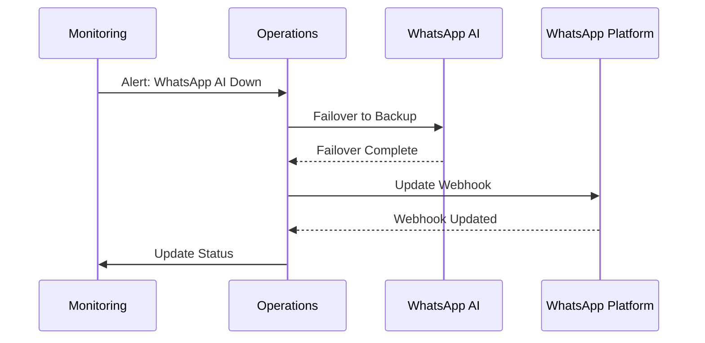

### 6.5 Authentication Recovery

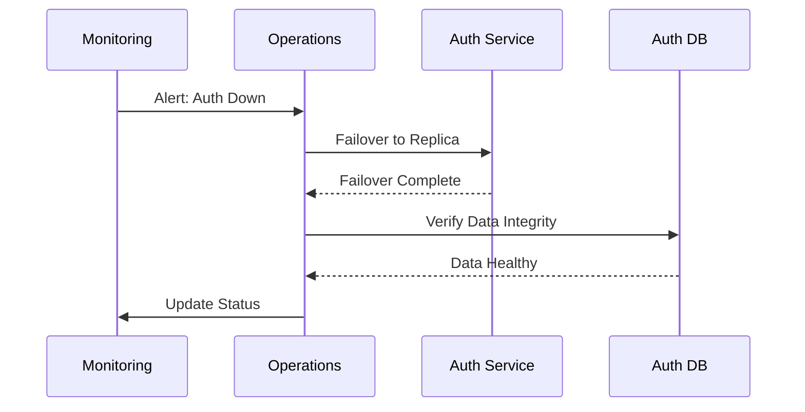

### 6.6 Knowledge Platform Recovery

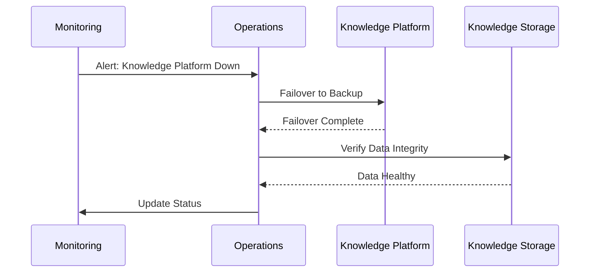

### 6.7 Monitoring Services Recovery

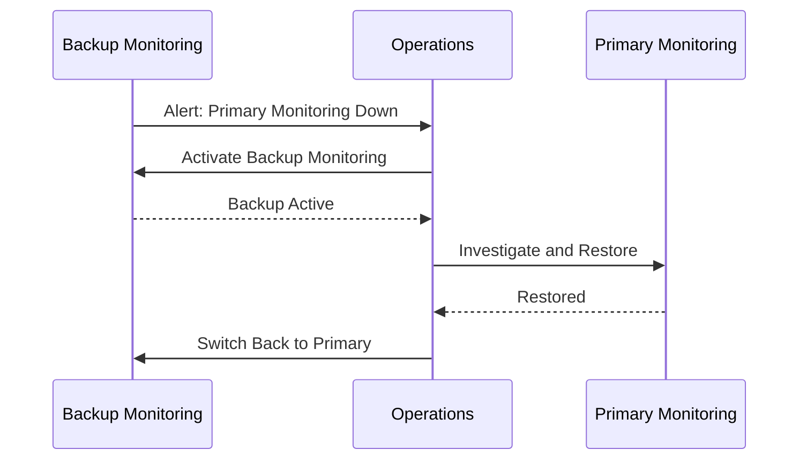

---

## 7. AI Recovery Strategy

### 7.1 LLM Service Failure

- **Impact:** AI responses unavailable or degraded.
- **Recovery:** Failover to alternate LLM provider.
- **Fallback:** Use cached responses, simplify AI behavior.
- **Degradation:** Limit AI capabilities, use rule-based responses.

### 7.2 RAG Failure

- **Impact:** Knowledge retrieval unavailable.
- **Recovery:** Failover to backup RAG service.
- **Fallback:** Use cached knowledge, general knowledge.
- **Degradation:** AI operates without retrieval, limited accuracy.

### 7.3 Memory Service Failure

- **Impact:** Session and preference memory lost.
- **Recovery:** Failover to backup memory service.
- **Fallback:** Use temporary memory, degrade personalization.
- **Degradation:** AI operates without long-term memory.

### 7.4 Agent Failure

- **Impact:** AI agents unavailable.
- **Recovery:** Failover to backup agents.
- **Fallback:** Use alternate agents, simplify workflows.
- **Degradation:** Limit agent capabilities, escalate to human.

### 7.5 Tool Execution Failure

- **Impact:** AI tool calls fail.
- **Recovery:** Retry, failover to backup tools.
- **Fallback:** Inform user, offer alternate actions.
- **Degradation:** Limit tool usage, escalate to human.

### 7.6 Prompt Repository Failure

- **Impact:** Prompts unavailable.
- **Recovery:** Failover to backup prompt repository.
- **Fallback:** Use default prompts, cached prompts.
- **Degradation:** AI uses generic prompts, reduced quality.

---

## 8. Communication Plan

### 8.1 Communication Workflow

1. **Internal Notifications:**
   - Alert operations and technical teams immediately.

2. **Management Escalation:**
   - Escalate to management for critical incidents.

3. **Technical Team Coordination:**
   - Coordinate recovery efforts across teams.

4. **Customer Communication:**
   - Inform customers of service degradation/outage.

5. **Distributor Communication:**
   - Inform distributors of service degradation/outage.

6. **Status Updates:**
   - Regular updates on recovery progress.

7. **Recovery Confirmation:**
   - Confirm recovery and service restoration.

---

## 9. Disaster Recovery Governance

### 9.1 Roles & Responsibilities

| Role | Responsibilities | Owner |
|---|---|---|
| Incident Commander | Overall incident management, decision-making | Operations Lead |
| Technical Lead | Technical recovery, coordination | Engineering Lead |
| Business Owner | Business impact assessment, priorities | Business Lead |
| Communication Lead | Internal/external communication | CX / Marketing |
| Approval Authority | Approve recovery actions, escalations | Management |

### 9.2 Responsibility Matrix

| Activity | Incident Commander | Technical Lead | Business Owner | Communication Lead | Approval Authority |
|---|---|---|---|---|---|
| Incident Detection | ✅ | ✅ | ❌ | ❌ | ❌ |
| Impact Assessment | ✅ | ✅ | ✅ | ❌ | ❌ |
| Recovery Planning | ✅ | ✅ | ✅ | ❌ | ✅ |
| Recovery Execution | ❌ | ✅ | ❌ | ❌ | ❌ |
| Communication | ❌ | ❌ | ❌ | ✅ | ❌ |
| Escalation | ✅ | ❌ | ✅ | ❌ | ✅ |
| Validation | ✅ | ✅ | ✅ | ❌ | ❌ |
| Post-Incident Review | ✅ | ✅ | ✅ | ✅ | ❌ |

---

## 10. Disaster Recovery Testing

### 10.1 Testing Schedule

| Test Type | Frequency | Owner |
|---|---|---|
| Backup Validation | Monthly | DevOps |
| Restore Testing | Quarterly | DevOps |
| Failover Testing | Quarterly | DevOps / SRE |
| Recovery Drills | Bi-annually | Operations |
| AI Recovery Testing | Quarterly | AI Team |
| Documentation Reviews | Quarterly | All Teams |

### 10.2 Testing Process

- **Backup Validation:** Verify backup integrity and completeness.
- **Restore Testing:** Test restore from backups.
- **Failover Testing:** Test failover to backup systems.
- **Recovery Drills:** Simulate disaster scenarios and recovery.
- **AI Recovery Testing:** Test AI service recovery and fallback.
- **Documentation Reviews:** Review and update all DR documentation.

---

## 11. Continuous Improvement

### 11.1 Improvement Process

- **Lessons Learned:** Document lessons from every incident and test.
- **Root Cause Analysis:** Conduct RCA for all critical incidents.
- **Recovery Metrics:** Track MTTD, MTTR, recovery success rate.
- **Process Improvements:** Update processes based on lessons learned.
- **Architecture Updates:** Update architecture to address vulnerabilities.
- **Risk Reviews:** Regular risk reviews and threat modeling.

---

## 12. Future Resilience Roadmap

### 12.1 Future Recommendations

| Capability | Purpose | Status |
|---|---|---|
| Multi-Region Failover | Automatic failover across regions | Future |
| Active-Active Architecture | Simultaneous multi-region operation | Future |
| Self-Healing Infrastructure | Automatic detection and recovery | Future |
| AI-Based Failure Prediction | Predict failures before they occur | Future |
| Automated Disaster Recovery | Automated recovery workflows | Future |
| Cross-Cloud Recovery | Recovery across different cloud providers | Future |
| Global Business Continuity | Global DR and continuity | Future |

All future capabilities must integrate with existing DR, security, and governance models.

---

## 13. Architecture Diagrams

### 13.1 Disaster Recovery Architecture

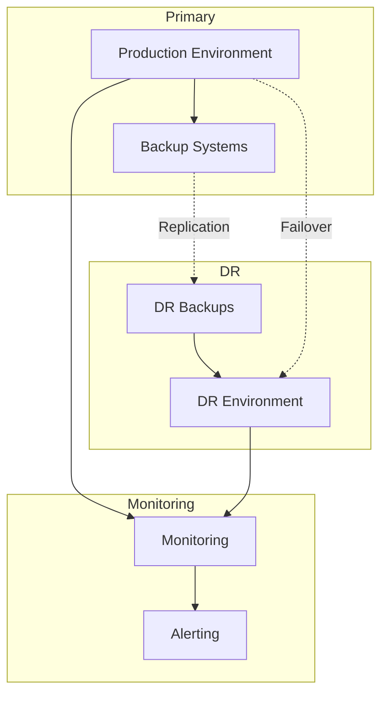

### 13.2 Backup Architecture

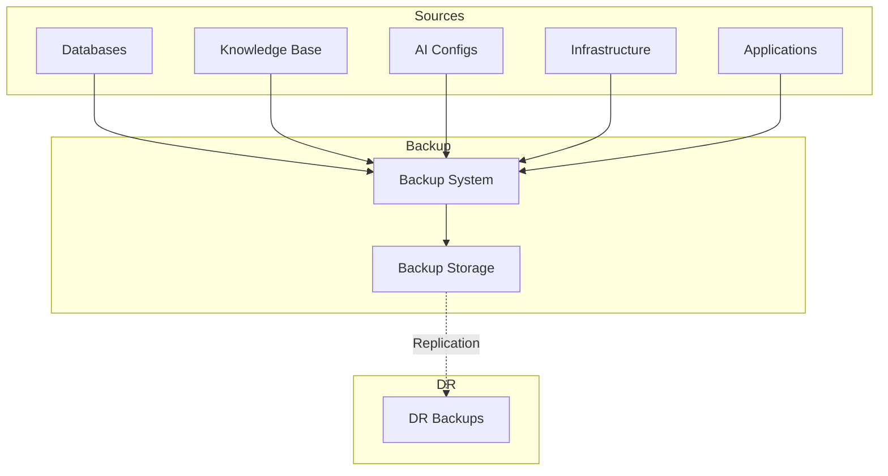

### 13.3 Recovery Workflow

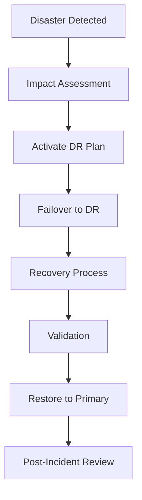

### 13.4 Failover Process

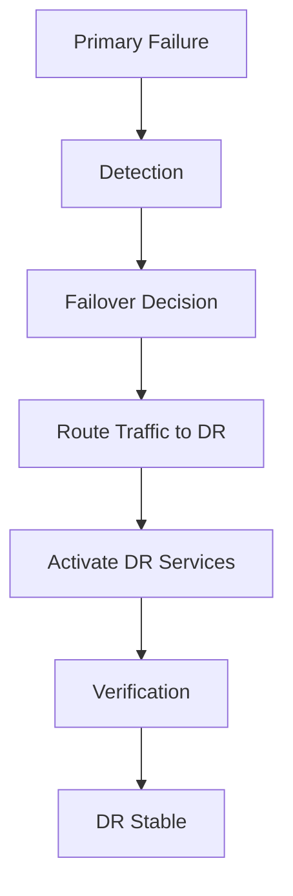

### 13.5 Incident Escalation

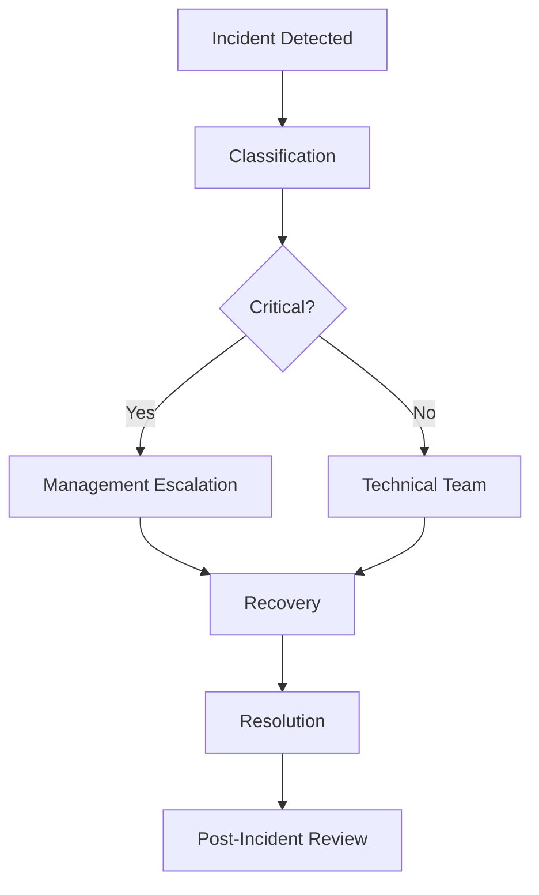

### 13.6 Business Continuity Workflow

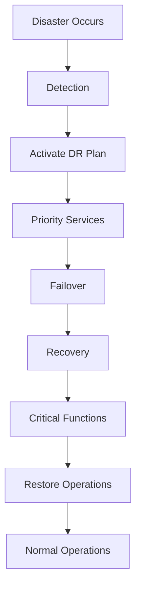

---

**END OF DOCUMENT**