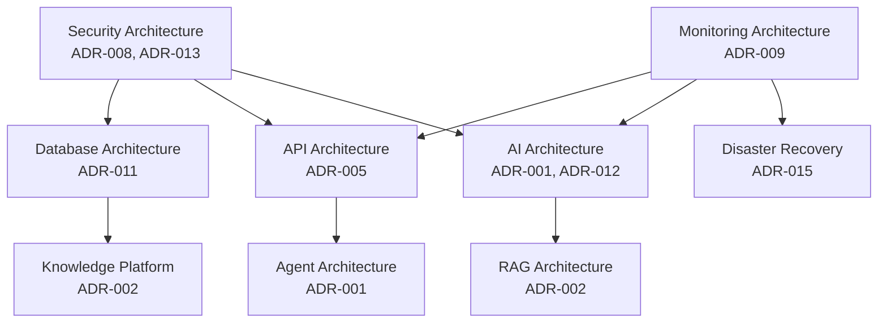
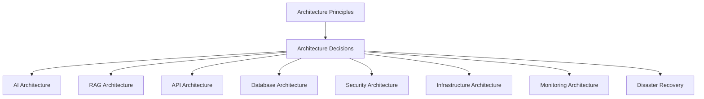
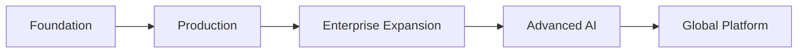
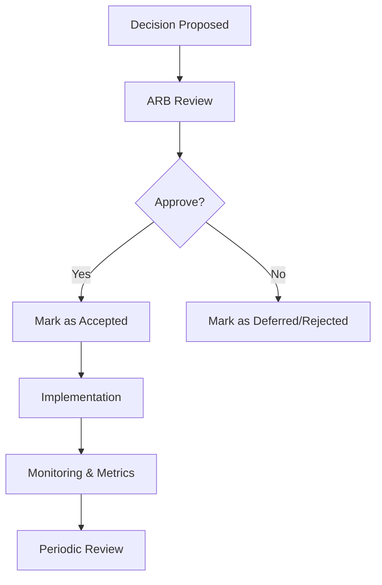
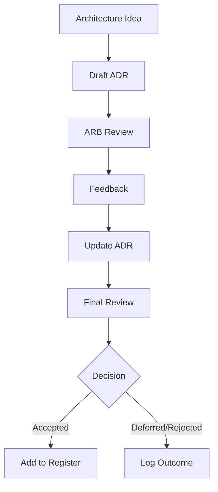
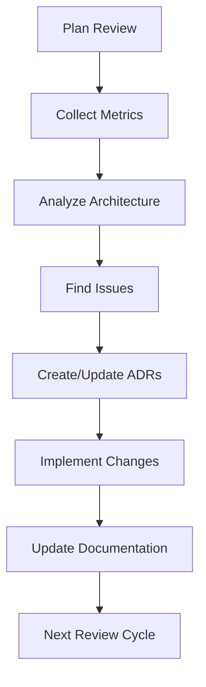

# 02_System_Architecture/15_ARCHITECTURE_DECISIONS.md

# Dayjoy Enterprise AI Platform — Architecture Decision Records (ADR)

> **Purpose:** Provide a master Architecture Decision Record (ADR) document for the Dayjoy Enterprise AI Platform, capturing all significant architectural decisions, their rationale, alternatives, trade-offs, risks, and future review criteria.
>
> **Scope:** Logical architecture decisions for the Dayjoy Enterprise AI Platform — no implementation code, vendor-specific details, or low-level configuration.
>
> **Audience:** Architects, senior engineers, AI teams, DevOps, security teams, product owners, business stakeholders, and AI assistants.

---

## Table of Contents

1. [ADR Overview](#1-adr-overview)
2. [Architecture Principles](#2-architecture-principles)
3. [Decision Register](#3-decision-register)
4. [Architecture Decision Records](#4-architecture-decision-records)
5. [Assumptions Register](#5-assumptions-register)
6. [Risk Register](#6-risk-register)
7. [Decision Dependencies](#7-decision-dependencies)
8. [Architecture Governance](#8-architecture-governance)
9. [Future Decisions](#9-future-decisions)
10. [Architecture Evolution Roadmap](#10-architecture-evolution-roadmap)
11. [Architecture Review Checklist](#11-architecture-review-checklist)
12. [Architecture Diagrams](#12-architecture-diagrams)

---

## 1. ADR Overview

### 1.1 Purpose of Architecture Decision Records

Architecture Decision Records (ADRs) document **why** specific architectural choices were made, how they align with business goals, and what trade-offs were accepted.[02_System_Architecture/00_SYSTEM_OVERVIEW.md][02_System_Architecture/01_HIGH_LEVEL_ARCHITECTURE.md]

ADRs serve to:

- Provide a permanent reference for future architects, developers, and AI assistants.
- Ensure transparency and traceability of major decisions.
- Enable consistent governance and change management.

### 1.2 Scope

This ADR document covers:

- Platform-wide architecture decisions.
- AI and multi-agent architecture.
- RAG and knowledge architecture.
- API, database, security, deployment, infrastructure, monitoring, and DR decisions.

### 1.3 Decision Lifecycle

- **Proposed:** Decision drafted and under review.
- **Accepted:** Decision approved and in effect.
- **Deferred:** Decision postponed for future phases.
- **Rejected:** Decision considered but not chosen.

### 1.4 Governance Process

- Decisions proposed by architects or domain leads.
- Reviewed by Architecture Review Board (ARB).
- Approved by ARB and relevant business owners.
- Documented in ADR register and linked to implementation.

### 1.5 Review Policy

- Critical decisions reviewed annually or after major incidents.
- Non-critical decisions reviewed every 2–3 years or during relevant changes.

---

## 2. Architecture Principles

### 2.1 Principle Catalog

| Principle ID | Principle Name | Description | Business Justification | Technical Impact |
|---|---|---|---|---|
| PRINC-AI-001 | AI-first Architecture | AI is a core capability, not an add-on. | Differentiates Dayjoy with intelligent experiences.[Project_Context/04_AI_VISION.md] | Requires robust AI, RAG, and multi-agent architecture. |
| PRINC-MOD-001 | Modular Design | Decompose platform into modular services and agents. | Enables faster change, clearer ownership. | Encourages microservices and multi-agent design. |
| PRINC-API-001 | API-first Approach | All business capabilities exposed via APIs. | Facilitates integrations and multi-channel support. | Requires robust API gateway and governance.[02_System_Architecture/09_API_ARCHITECTURE.md] |
| PRINC-SEC-001 | Security by Design | Security integrated into every layer. | Protects data, users, and brand reputation.[02_System_Architecture/10_SECURITY_ARCHITECTURE.md] | Requires RBAC, encryption, secure pipelines. |
| PRINC-SCAL-001 | Scalability | Architecture must scale with demand. | Supports growth in users and AI usage. | Requires stateless services, auto scaling. |
| PRINC-REUSE-001 | Reusability | Shared services and components reused across channels. | Reduces duplication and maintenance.[02_System_Architecture/02_COMPONENT_ARCHITECTURE.md] | Encourages shared services (Auth, RAG, Notification). |
| PRINC-OBS-001 | Observability | Comprehensive monitoring and logging. | Enables operational excellence.[02_System_Architecture/13_MONITORING_ARCHITECTURE.md] | Requires metrics, logs, traces, dashboards. |
| PRINC-HA-001 | High Availability | Critical services must be highly available. | Ensures business continuity.[02_System_Architecture/11_DEPLOYMENT_ARCHITECTURE.md] | Requires redundancy, failover, DR. |
| PRINC-MAINT-001 | Maintainability | Architecture should be maintainable and evolvable. | Reduces long-term cost and risk. | Encourages clean boundaries, documentation, ADRs. |

---

## 3. Decision Register

### 3.1 Master ADR Register

| ADR ID | Decision Title | Status | Decision Date | Related Documents | Owner | Review Date |
|---|---|---|---|---|---|---|
| ADR-001 | Multi-Agent Architecture | Accepted | 2026-08-05 | 02_System_Architecture/07_AGENT_ARCHITECTURE.md | Chief Architect | 2027-08-05 |
| ADR-002 | RAG-based Knowledge System | Accepted | 2026-08-05 | 02_System_Architecture/04_RAG_ARCHITECTURE.md | AI Lead | 2027-08-05 |
| ADR-003 | Voice AI Architecture | Accepted | 2026-08-05 | 02_System_Architecture/05_VOICE_AI_ARCHITECTURE.md | AI Voice Lead | 2027-08-05 |
| ADR-004 | WhatsApp AI Architecture | Accepted | 2026-08-05 | 02_System_Architecture/06_WHATSAPP_AI_ARCHITECTURE.md | AI CX Lead | 2027-08-05 |
| ADR-005 | API-first Design | Accepted | 2026-08-05 | 02_System_Architecture/09_API_ARCHITECTURE.md | Backend Lead | 2027-08-05 |
| ADR-006 | Modular Services Architecture | Accepted | 2026-08-05 | 02_System_Architecture/02_COMPONENT_ARCHITECTURE.md | Chief Architect | 2027-08-05 |
| ADR-007 | Centralized Knowledge Repository | Accepted | 2026-08-05 | 02_System_Architecture/04_RAG_ARCHITECTURE.md | Knowledge Lead | 2027-08-05 |
| ADR-008 | Role-Based Access Control (RBAC) | Accepted | 2026-08-05 | 02_System_Architecture/10_SECURITY_ARCHITECTURE.md | Security Lead | 2027-08-05 |
| ADR-009 | Monitoring & Observability Strategy | Accepted | 2026-08-05 | 02_System_Architecture/13_MONITORING_ARCHITECTURE.md | SRE Lead | 2027-08-05 |
| ADR-010 | Deployment Strategy (CI/CD, Environments) | Accepted | 2026-08-05 | 02_System_Architecture/11_DEPLOYMENT_ARCHITECTURE.md | DevOps Lead | 2027-08-05 |
| ADR-011 | Database Strategy & Data Domains | Accepted | 2026-08-05 | 02_System_Architecture/08_DATABASE_ARCHITECTURE.md | Data Architect | 2027-08-05 |
| ADR-012 | AI Memory Strategy | Accepted | 2026-08-05 | 02_System_Architecture/03_AI_ARCHITECTURE.md | AI Lead | 2027-08-05 |
| ADR-013 | Security Model & Layers | Accepted | 2026-08-05 | 02_System_Architecture/10_SECURITY_ARCHITECTURE.md | Security Lead | 2027-08-05 |
| ADR-014 | Infrastructure Layered Architecture | Accepted | 2026-08-05 | 02_System_Architecture/12_INFRASTRUCTURE_ARCHITECTURE.md | Infra Architect | 2027-08-05 |
| ADR-015 | Disaster Recovery & Business Continuity | Accepted | 2026-08-05 | 02_System_Architecture/14_DISASTER_RECOVERY.md | Operations Lead | 2027-08-05 |

---

## 4. Architecture Decision Records

### 4.1 ADR Template

**ADR ID:**

**Title:**

**Status:** (Proposed / Accepted / Deferred / Rejected)

**Context:**

**Problem Statement:**

**Decision:**

**Business Justification:**

**Technical Justification:**

**Alternatives Considered:**

**Why Alternatives Were Rejected:**

**Benefits:**

**Trade-offs:**

**Risks:**

**Constraints:**

**Dependencies:**

**Impact on Other Systems:**

**Success Criteria:**

**Future Review Criteria:**

---

### 4.2 ADR-001 – Multi-Agent Architecture

**ADR ID:** ADR-001

**Title:** Multi-Agent Architecture

**Status:** Accepted

**Context:**

Dayjoy requires AI support across multiple channels (Website, WhatsApp, Voice, internal tools) and domains (customer, distributor, sales, marketing, analytics, admin).[02_System_Architecture/03_AI_ARCHITECTURE.md][02_System_Architecture/07_AGENT_ARCHITECTURE.md]

**Problem Statement:**

A single monolithic AI assistant would be difficult to maintain, secure, and scale for diverse use cases and business rules.

**Decision:**

Adopt a **multi-agent architecture** with specialized agents (Customer Support, Product Expert, Distributor Support, Sales Assistant, Voice AI, WhatsApp AI, Website Chat, Knowledge Retrieval, Marketing, Analytics, Admin Assistant, Workflow Automation, Notification).

**Business Justification:**

- Better alignment with business domains and teams.
- Clear ownership and accountability per agent.
- Improved accuracy and relevance for domain-specific queries.

**Technical Justification:**

- Enables modular design and independent scaling.[02_System_Architecture/07_AGENT_ARCHITECTURE.md]
- Easier to enforce permissions and guardrails.
- Facilitates future expansion (new agents) without disrupting existing ones.

**Alternatives Considered:**

- Single monolithic AI assistant.
- Channel-specific but non-specialized AI.

**Why Alternatives Were Rejected:**

- Monolithic AI too complex and risky to maintain.
- Channel-only specialization lacks domain-specific expertise.

**Benefits:**

- High accuracy in domain-specific tasks.
- Better security and governance.
- Improved maintainability and scalability.

**Trade-offs:**

- Increased orchestration complexity.
- Requires robust shared context and tool management.

**Risks:**

- Mis-coordination between agents.
- Overlapping responsibilities if not clearly defined.

**Constraints:**

- Requires strong orchestration and memory services.

**Dependencies:**

- AI Orchestration, RAG, Memory, Tool Execution, Monitoring.[02_System_Architecture/03_AI_ARCHITECTURE.md]

**Impact on Other Systems:**

- Influences API, RAG, monitoring, and security architectures.

**Success Criteria:**

- High agent-specific accuracy (> 90%).
- Reduced handling time for domain tasks.
- Clear ownership and low cross-agent conflict.

**Future Review Criteria:**

- Review when adding new agents or major domains.
- Review after significant AI provider changes.

---

### 4.3 ADR-002 – RAG-based Knowledge System

**ADR ID:** ADR-002

**Title:** RAG-based Knowledge System

**Status:** Accepted

**Context:**

Dayjoy’s AI must rely on verified knowledge (policies, product docs, FAQs) to avoid hallucinations and incorrect business facts.[02_System_Architecture/04_RAG_ARCHITECTURE.md][Project_Context/11_DOCUMENTATION_RULES.md]

**Problem Statement:**

Pure LLM-based responses without retrieval risk hallucinations and inconsistent answers.

**Decision:**

Implement a **Retrieval-Augmented Generation (RAG)** architecture with a central Knowledge Service, vector database, and RAG orchestration layer used by all AI agents.

**Business Justification:**

- Ensures responses are grounded in official Dayjoy knowledge.
- Supports governance and compliance.

**Technical Justification:**

- Enables semantic search and metadata-based retrieval.
- Scales across growing knowledge corpora.

**Alternatives Considered:**

- Pure LLM responses without retrieval.
- Simple keyword search integrated in AI.

**Why Alternatives Were Rejected:**

- Pure LLM too risky for business-critical answers.
- Keyword search insufficient for complex queries.

**Benefits:**

- Reduced hallucinations.
- Consistent, verifiable answers.

**Trade-offs:**

- Requires indexing, metadata, and RAG orchestration.
- Higher operational complexity.

**Risks:**

- Retrieval quality issues could affect AI accuracy.

**Constraints:**

- Knowledge must be validated and structured.

**Dependencies:**

- Knowledge Service, vector DB, AI agents, security.[02_System_Architecture/04_RAG_ARCHITECTURE.md]

**Impact on Other Systems:**

- Influences AI, database, security, and monitoring.

**Success Criteria:**

- High retrieval precision and recall.
- Low hallucination rates.

**Future Review Criteria:**

- Review with new knowledge sources or retrieval technologies.

---

### 4.4 ADR-005 – API-first Design

**ADR ID:** ADR-005

**Title:** API-first Design

**Status:** Accepted

**Context:**

Dayjoy must support multiple channels (web, WhatsApp, voice, internal tools) and external integrations (CRM, payments).[02_System_Architecture/09_API_ARCHITECTURE.md]

**Problem Statement:**

Without a consistent API layer, services and AI agents would have fragmented access patterns and limited integration capabilities.

**Decision:**

Adopt an **API-first** architecture with a central API Gateway and consistent REST APIs for all domain services.

**Business Justification:**

- Enables multi-channel experiences and integrations.
- Provides a clear integration surface for partners.

**Technical Justification:**

- Promotes consistency, security, and observability.
- Simplifies AI-to-tool integration.

**Alternatives Considered:**

- Direct DB access from frontends/AI.
- Ad-hoc APIs per service.

**Why Alternatives Were Rejected:**

- Direct DB access violates security and governance.
- Ad-hoc APIs lead to fragmentation and maintenance issues.

**Benefits:**

- Secure, consistent access to business capabilities.
- Easier monitoring and governance.

**Trade-offs:**

- Requires robust gateway and governance.

**Risks:**

- Gateway becomes a critical dependency.

**Constraints:**

- All services must expose APIs.

**Dependencies:**

- API Gateway, Auth, RBAC, monitoring.[02_System_Architecture/09_API_ARCHITECTURE.md]

**Impact on Other Systems:**

- Shapes AI integration, security, and deployment.

**Success Criteria:**

- All services accessible via APIs.
- Low API error rates and high availability.

**Future Review Criteria:**

- Review when adding GraphQL/gRPC or public APIs.

---

### 4.5 ADR-008 – Role-Based Access Control (RBAC)

**ADR ID:** ADR-008

**Title:** Role-Based Access Control (RBAC)

**Status:** Accepted

**Context:**

Dayjoy serves multiple personas (customers, distributors, employees, admins, AI agents) with different data and action permissions.[02_System_Architecture/10_SECURITY_ARCHITECTURE.md]

**Problem Statement:**

Without a robust authorization model, sensitive data and operations could be exposed improperly.

**Decision:**

Implement **RBAC** with roles (Customer, Distributor, Employee, Manager, Administrator, AI Agent, System Service) and least-privilege permissions.

**Business Justification:**

- Protects sensitive data and operations.
- Supports compliance and audit.

**Technical Justification:**

- Centralizes authorization checks.
- Integrates with API, AI, and data layers.

**Alternatives Considered:**

- Simple role flags per user.
- Hard-coded permissions in services.

**Why Alternatives Were Rejected:**

- Too rigid and error-prone.

**Benefits:**

- Clear permission boundaries.
- Easier governance and audits.

**Trade-offs:**

- Requires policy management and enforcement.

**Risks:**

- Misconfigured roles can break access.

**Constraints:**

- Requires central Auth and RBAC services.

**Dependencies:**

- Auth, API Gateway, AI agents, databases.[02_System_Architecture/10_SECURITY_ARCHITECTURE.md]

**Impact on Other Systems:**

- Governs AI, RAG, APIs, and data access.

**Success Criteria:**

- No unauthorized access incidents.

**Future Review Criteria:**

- Review with enterprise SSO or new roles.

---

### 4.6 ADR-010 – Deployment Strategy (CI/CD, Environments)

**ADR ID:** ADR-010

**Title:** Deployment Strategy (CI/CD, Environments)

**Status:** Accepted

**Context:**

Dayjoy requires stable production and frequent changes to AI and services.[02_System_Architecture/11_DEPLOYMENT_ARCHITECTURE.md]

**Problem Statement:**

Manual deployments risk inconsistency, downtime, and errors.

**Decision:**

Implement CI/CD with multiple environments (Local, Dev, Test, QA, Staging, Production, DR) and controlled promotion/approval.

**Business Justification:**

- Faster, safer releases.

**Technical Justification:**

- Ensures repeatable deployments.

**Alternatives Considered:**

- Single environment with manual deployments.

**Why Alternatives Were Rejected:**

- Too risky and inflexible.

**Benefits:**

- Reduced deployment risk.

**Trade-offs:**

- More infrastructure complexity.

**Risks:**

- Misconfigured pipelines can break deployments.

**Constraints:**

- Requires CI/CD tools and governance.

**Dependencies:**

- Deployment, infrastructure, security.[02_System_Architecture/11_DEPLOYMENT_ARCHITECTURE.md]

**Impact on Other Systems:**

- Shapes release and DR processes.

**Success Criteria:**

- Low deployment-related incidents.

**Future Review Criteria:**

- Review with blue-green/canary strategies.

*(Additional ADRs should follow the same template; this document provides representative examples.)*

---

## 5. Assumptions Register

### 5.1 Assumptions Catalog

#### Verified Assumptions

| Assumption ID | Description | Owner | Validation Status | Risk if Incorrect |
|---|---|---|---|---|
| ASM-BIZ-001 | Dayjoy will continue to invest in AI as a core capability. | Management | Verified | Reduced AI funding may limit roadmap. |
| ASM-TECH-001 | Core services can be containerized and run in cloud environments. | Engineering | Verified | Need for on-prem/hybrid support. |

#### Pending Assumptions

| Assumption ID | Description | Owner | Validation Status | Risk if Incorrect |
|---|---|---|---|---|
| ASM-BIZ-002 | Future expansion to multi-region is required. | Management | Pending | Architecture may need rework for global scaling. |
| ASM-AI-001 | A stable set of external LLM providers will be available. | AI Team | Pending | Need in-house models or fallbacks. |

#### Business Assumptions

| Assumption ID | Description | Owner | Validation Status | Risk if Incorrect |
|---|---|---|---|---|
| ASM-BIZ-003 | Distributors and customers will adopt AI channels. | CX / Distributor Mgmt | Pending | Lower adoption may reduce ROI. |

#### Technical Assumptions

| Assumption ID | Description | Owner | Validation Status | Risk if Incorrect |
|---|---|---|---|---|
| ASM-TECH-002 | Chosen data stores can scale with expected load. | Data Architect | Pending | Need alternative storage solutions. |

#### AI Assumptions

| Assumption ID | Description | Owner | Validation Status | Risk if Incorrect |
|---|---|---|---|---|
| ASM-AI-002 | AI can achieve > 90% accuracy with RAG. | AI Lead | Pending | Need more human support and stricter guardrails. |

---

## 6. Risk Register

### 6.1 Architectural Risks

| Risk ID | Description | Probability | Impact | Mitigation Strategy | Owner | Review Frequency |
|---|---|---|---|---|---|---|
| RISK-AI-001 | AI hallucinations causing incorrect business answers. | Medium | High | RAG, output validation, guardrails.[02_System_Architecture/04_RAG_ARCHITECTURE.md][02_System_Architecture/10_SECURITY_ARCHITECTURE.md] | AI Lead | Quarterly |
| RISK-SEC-001 | Unauthorized access due to RBAC misconfiguration. | Low | High | Strict role design, audits, tests. | Security Lead | Quarterly |
| RISK-INF-001 | Single-region deployment causing outages. | Medium | High | DR environment, future multi-region. | Infra Architect | Quarterly |
| RISK-DATA-001 | Data quality issues affecting AI and reporting. | Medium | High | Data validation, governance. | Data Architect | Quarterly |
| RISK-INT-001 | Third-party integration failures (WhatsApp, Vapi, payments). | Medium | Medium | Retry, failover, fallbacks. | Integration Lead | Quarterly |

---

## 7. Decision Dependencies

### 7.1 Dependency Map

- **AI Architecture → RAG Architecture:** AI relies on RAG for knowledge.[02_System_Architecture/03_AI_ARCHITECTURE.md][02_System_Architecture/04_RAG_ARCHITECTURE.md]
- **API Architecture → Agent Architecture:** Agents use APIs for tools.[02_System_Architecture/07_AGENT_ARCHITECTURE.md][02_System_Architecture/09_API_ARCHITECTURE.md]
- **Database Architecture → Knowledge Platform:** Knowledge and RAG rely on data stores.[02_System_Architecture/08_DATABASE_ARCHITECTURE.md][02_System_Architecture/04_RAG_ARCHITECTURE.md]
- **Security Architecture → All Components:** Security influences AI, APIs, data, deployment.[02_System_Architecture/10_SECURITY_ARCHITECTURE.md]
- **Monitoring Architecture → DR & Operations:** Monitoring supports DR and operations.[02_System_Architecture/13_MONITORING_ARCHITECTURE.md][02_System_Architecture/14_DISASTER_RECOVERY.md]

### 7.2 Decision Dependency Diagram

---

## 8. Architecture Governance

### 8.1 Decision Approval Process

- ADRs proposed by domain leads or architects.
- Reviewed by Architecture Review Board (ARB).
- Approved decisions marked as **Accepted**; others as **Deferred** or **Rejected**.

### 8.2 Change Management

- Changes to accepted ADRs require new ADRs or updates.
- Major changes follow full review and approval.

### 8.3 Architecture Review Board

- Composed of Chief Architect, AI Lead, Data Architect, Security Lead, DevOps Lead, and Business Representatives.

### 8.4 Version Control

- ADRs versioned and stored in repository.

### 8.5 Documentation Standards

- All ADRs follow the standard template.
- Related documents linked in ADR register.

### 8.6 Review Schedule

- Annual architecture review.
- Quarterly domain-specific reviews.

---

## 9. Future Decisions

### 9.1 Future Decision Backlog

| Future Decision | Priority | Business Value | Dependencies | Expected Phase |
|---|---|---|---|---|
| Multi-region deployment | High | Global availability, DR | Infra, DR | Enterprise Expansion |
| Multi-cloud strategy | Medium | Vendor risk reduction | Infra | Enterprise Expansion |
| AI model selection (provider mix) | High | AI quality and cost | AI, RAG | Advanced AI |
| Knowledge graph adoption | Medium | Better knowledge representation | DB, RAG | Advanced AI |
| Event-driven architecture | Medium | Scalability, decoupling | API, Infra | Enterprise Expansion |
| Enterprise SSO | High | Security, UX | Auth, Security | Enterprise Expansion |
| Mobile platform architecture | Medium | Mobile user experience | API, Infra | Production / Expansion |

---

## 10. Architecture Evolution Roadmap

### 10.1 Evolution Stages

- **Foundation:**
  - Core services, basic AI, initial RAG, single-region deployment.

- **Production:**
  - Stable AI channels (Website, WhatsApp, Voice), monitoring, DR.

- **Enterprise Expansion:**
  - Multi-region, advanced RBAC, more agents, event-driven patterns.

- **Advanced AI:**
  - Multi-agent orchestration, predictive AI, knowledge graph.

- **Global Platform:**
  - Multi-cloud, global failover, edge AI, global BI.

---

## 11. Architecture Review Checklist

### 11.1 Review Checklist

For each major architecture change or ADR, review:

- **Scalability:**
  - Does it scale with expected load?

- **Security:**
  - Are security principles applied (RBAC, encryption)?

- **Performance:**
  - Are latency and throughput acceptable?

- **Reliability:**
  - Are redundancy and failover considered?

- **Maintainability:**
  - Is the design modular and documented?

- **Cost:**
  - Are costs reasonable and optimized?

- **AI Quality:**
  - Does it improve or maintain AI accuracy and safety?

- **Compliance:**
  - Does it meet regulatory and internal policies?

- **Documentation:**
  - Are ADRs and diagrams updated?

---

## 12. Architecture Diagrams

### 12.1 Decision Dependency Graph

### 12.2 Architecture Evolution Timeline

### 12.3 Governance Workflow

### 12.4 Decision Approval Process

### 12.5 Architecture Review Lifecycle

---

**END OF DOCUMENT**