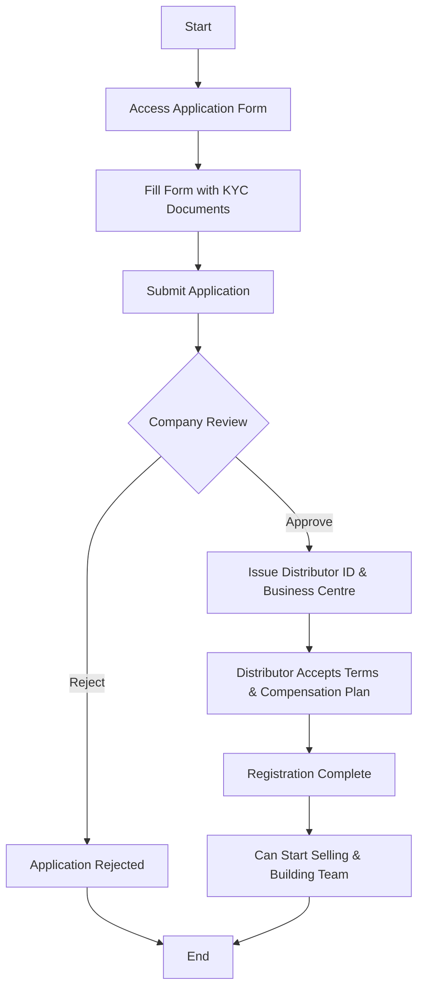
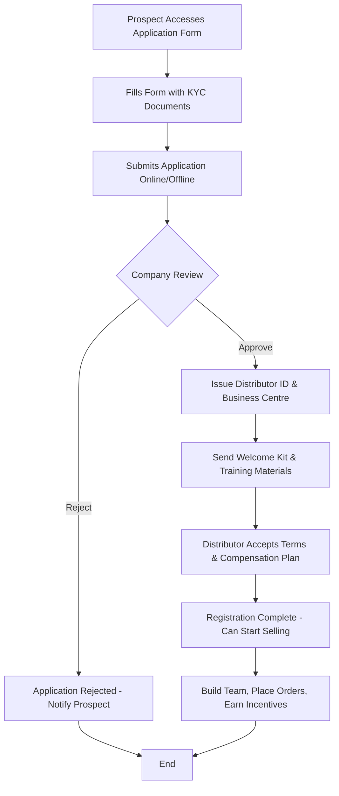
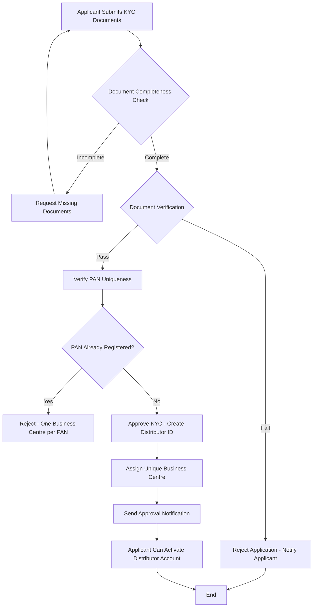
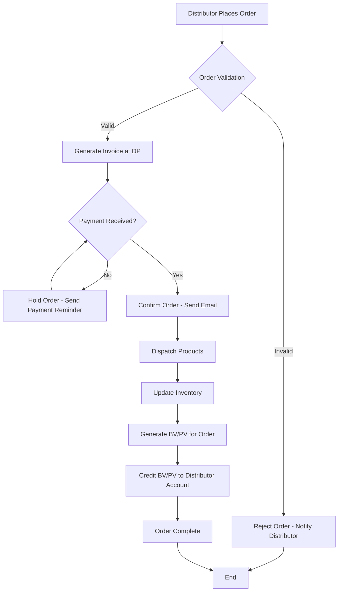
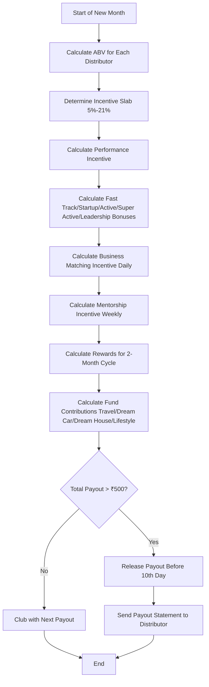
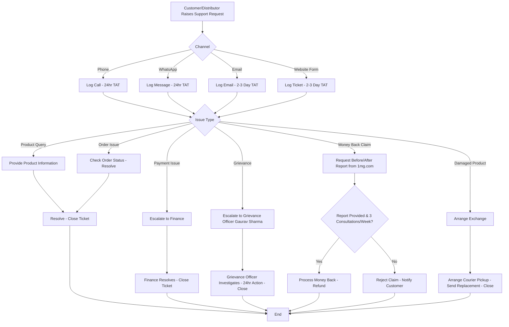
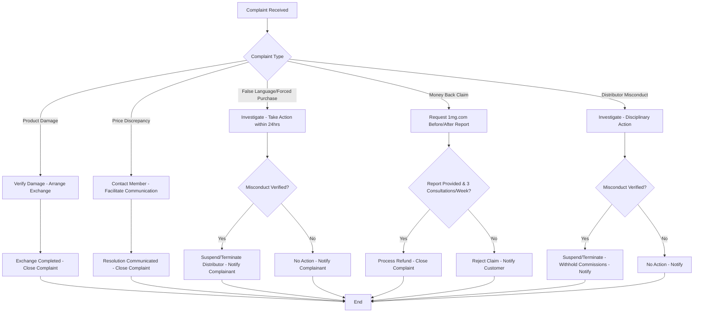
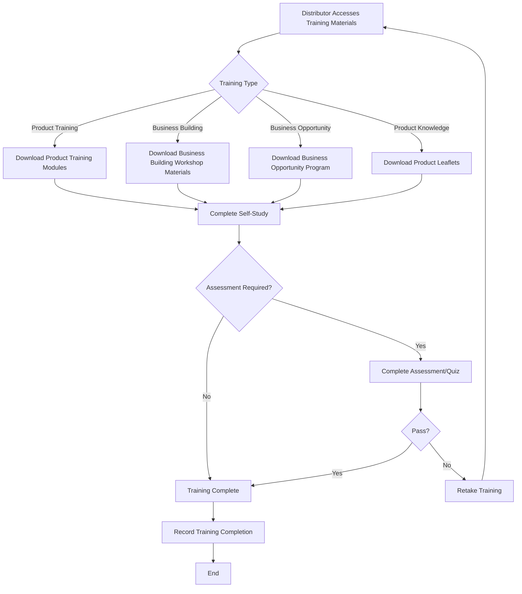
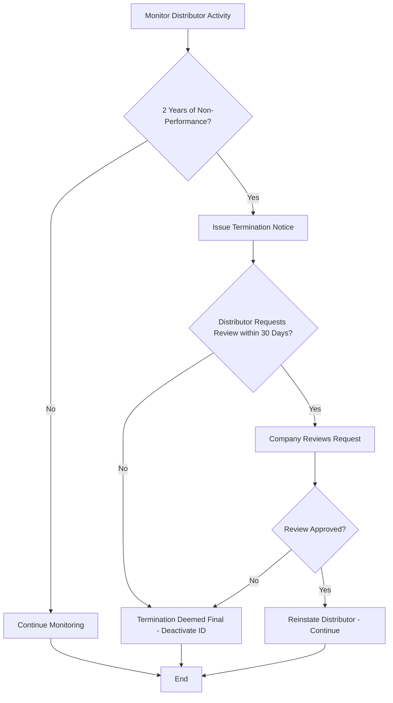

# Dayjoy Distributor System — Enterprise Research Document

> **Status:** VERIFIED / PARTIALLY VERIFIED / UNKNOWN / REQUIRES CLIENT INPUT  
> **Last updated:** 2026-08-04  
> **Purpose:** Comprehensive distributor system documentation for Dayjoy Enterprise AI Platform (Voice AI, WhatsApp AI, Website AI, RAG, CRM, Internal Assistants)  
> **Primary Sources:** Official Dayjoy website, compensation plan PDF, terms and conditions, compliance documents [web:68][web:69][web:67][web:35][web:4][web:14]

---

## 1. Distributor Program Overview

### 1.1 What is the Dayjoy Distributor Program?

**VERIFIED:** Dayjoy operates a **direct selling business model** where customers can purchase products directly from the company or through authorized representatives known as **independent sales consultants or distributors**. [web:14]

**VERIFIED:** The company enables individuals to become **Independent Distributors** at no cost, allowing them to sell products and earn income through retail profits, performance incentives, and various bonuses. [web:68][web:4]

**VERIFIED:** Dayjoy describes itself as a **wellness brand and direct selling organization** that focuses on providing lifestyle products in health, beauty, wellness, and household categories. [web:68]

### 1.2 Purpose

**VERIFIED:** The stated purpose of the Dayjoy distributor program is to:

- Create values for customers through high-quality products backed by satisfaction guarantees [web:68]
- Set a new benchmark in the direct selling segment [web:68]
- Create a world of opportunities so people can live with **economic independence** [web:68]
- Provide complete **backward integration** to business family members, resulting in increased business control, better cost control, reduced loss risk, and healthier competitive advantages [web:68]

### 1.3 Business Model

**VERIFIED:** Dayjoy's business model is based on:

- **Direct selling** of products through independent distributors [web:14][web:68]
- **Retail sales** as the foundation of the compensation plan, where distributors earn the difference between Distributor Price (DP) and Maximum Retail Price (MRP) [web:68]
- **Team building** where distributors introduce more customers/independent distributors and earn incentives based on Business Volume (BV) and Point Value (PV) generated [web:68]
- **Binary structure** for certain incentives requiring two business teams (left and right) [web:68]

### 1.4 Target Audience

**VERIFIED:** The target audience includes:

- Individuals who want to use products for **personal purposes** [web:14]
- Those who want to become **independent distributors** [web:14]
- Individuals seeking to earn **additional income** by selling the products [web:14]
- People interested in **entrepreneurship** without requiring professional degrees or prior experience [web:8]

### 1.5 Benefits of Becoming a Distributor

**VERIFIED:** Benefits include:

- **Free registration** — no additional costs required to become an Independent Distributor [web:68][web:4]
- **Retail profit** up to 30% (MRP minus DP) [web:68]
- **Multiple income streams** including performance incentive, fast track bonus, startup bonus, active bonus, leadership bonus, business matching incentive, mentorship incentive, rewards, travel fund, dream car fund, dream house fund, lifestyle fund, super active bonus, loyalty program [web:68]
- **Training and support** through product training modules, business building workshops, and business opportunity programs [web:35]
- **Recognition** through rank achievements (Silver Executive, Gold Director, Platinum Director, Diamond President, Sapphire Vice President, Emerald Vice President, etc.) [web:68][web:35]

---

## 2. Eligibility

### 2.1 Who Can Join?

**VERIFIED:** According to the Terms and Conditions:

- Must be **18 years and above** [web:69]
- Must be of **sound mind** [web:69]
- Must **not have been convicted by any court of law** [web:69]
- Must furnish correct documentary proof of **personal identification and address proof** as per KYC process [web:69]

### 2.2 Minimum Age

**VERIFIED:** **18 years** [web:69]

### 2.3 Required Documents

**VERIFIED:**

- **Personal identification proof** (KYC process) [web:69]
- **Address proof** (KYC process) [web:69]
- **PAN Number** (unique business centre restricted to single PAN number) [web:69]
- **Application form** (online/offline) available on company website [web:69][web:35]

**UNKNOWN:** Specific document types (Aadhaar, Voter ID, Passport, etc.) are not explicitly listed in the reviewed sources. [web:69]

### 2.4 Geographic Restrictions

**VERIFIED:** Dayjoy has **state registrations** in Consumer Affairs Departments of:

- Tamil Nadu
- Telangana
- Kerala
- Himachal Pradesh
- Punjab
- Rajasthan
- Karnataka
- Andhra Pradesh
- New Delhi [web:68]

**UNKNOWN:** Whether distributors can operate only in registered states or pan-India is not explicitly stated. [web:68]

### 2.5 Other Eligibility Requirements

**VERIFIED:**

- Company reserves the right to **accept or reject applications** at its own discretion [web:69]
- Distributors must agree to **not represent, sell, or distribute products of any other direct selling company** during the tenure of the agreement (non-compete clause) [web:69]
- Must agree to carry **identity cards** and not visit prospective customers without prior appointment [web:69]

---

## 3. Registration Process

### 3.1 Step-by-Step Registration

**VERIFIED:**

1. **Access application form** — available online/offline on company website [web:69][web:35]
2. **Fill application form** with personal details and KYC documents [web:69]
3. **Submit application** through website or offline channels [web:69]
4. **Company review** — company reserves right to accept or reject at its discretion [web:69]
5. **Approval and ID creation** — upon approval, distributor receives unique Independent Distributor Identification Number and Unique Business Centre [web:69]
6. **Agreement acceptance** — distributor must read and agree to Terms and Conditions, Business Plan, and Compensation Plan [web:4][web:69]

**UNKNOWN:** Exact online registration URL, portal access details, and approval timeline are not explicitly stated in the reviewed sources. [web:69][web:4]

### 3.2 Required Documents

**VERIFIED:**

- Personal identification proof [web:69]
- Address proof [web:69]
- PAN Number [web:69]
- Completed application form [web:35][web:69]

### 3.3 Verification Process

**VERIFIED:**

- Company conducts **KYC verification** of submitted documents [web:69]
- Company may **accept or reject** applications at its discretion [web:69]

**UNKNOWN:** Detailed verification workflow, timeline, and rejection criteria are not specified. [web:69]

### 3.4 Approval Process

**VERIFIED:**

- Company issues **unique Independent Distributor Identification Number** upon approval [web:69]
- Company assigns **Unique Business Centre** (restricted to single PAN number, non-transferable) [web:69]
- Distributor must agree to **Terms and Conditions** and **Compensation Plan** [web:4][web:69]

### 3.5 Distributor ID Creation

**VERIFIED:**

- Each distributor receives a **unique Independent Distributor Identification Number** [web:69]
- Each distributor is assigned a **Unique Business Centre** [web:69]
- Business Centre is **restricted to single PAN Number** and is **not transferable** [web:69]

### 3.6 Expected Timelines

**UNKNOWN:** No explicit timeline for approval is mentioned in the reviewed sources. [web:69][web:4]

### 3.7 Registration Workflow Diagram

---

## 4. Distributor Types

### 4.1 Distributor Categories

**VERIFIED:** The compensation plan distinguishes between:

| Type | Description | Eligibility |
|---|---|---|
| **Customer/Consumer** | Register for free, can purchase products | No additional costs, free registration [web:68] |
| **Independent Distributor** | Registered distributor, can sell products and earn incentives | Must complete registration, accept terms [web:68][web:69] |
| **Active Distributor** | Independent distributor who personally purchases and consumes products to enjoy exclusive services | Required to personally purchase and consume products [web:68] |

### 4.2 Rank Levels

**VERIFIED:** The compensation plan references the following rank levels:

| Rank | Minimum BV Requirement |
|---|---|
| Silver Executive | 500 BV [web:68] |
| Gold Director | 1,000 BV [web:68] |
| Platinum Director | 2,000 BV [web:68] |
| Diamond President | 2,000 BV+ (qualified through pins) [web:68] |
| Sapphire Vice President | Pin achieved [web:68] |
| Emerald Vice President | Pin achieved [web:68] |
| Ruby Director | Referenced in honoree gallery [web:35] |
| Crown | Referenced in honoree gallery [web:35] |
| Black Diamond | Referenced in honoree gallery [web:35] |
| Blue Diamond | Referenced in honoree gallery [web:35] |

**UNKNOWN:** Detailed responsibilities, benefits, and requirements for each rank beyond BV thresholds are not fully specified in the reviewed sources. [web:68]

### 4.3 Performance Incentive Slabs

**VERIFIED:**

| Rank | Monthly BV Range | Incentive % |
|---|---|---|
| Distributor | 3,000 - 10,000 BV | 5% [web:68] |
| Star Executive | 10,001 - 40,000 BV | 9% [web:68] |
| Super Star Executive | 40,001 - 80,000 BV | 13% [web:68] |
| Silver Executive | 80,001 - 1,59,999 BV | 17% [web:68] |
| Gold Director | 1,60,000+ BV | 21% [web:68] |

---

## 5. Compensation Plan

### 5.1 Overview

**VERIFIED:** Dayjoy's compensation plan includes multiple income types:

- Retail Profit (up to 30%)
- Performance Incentive (5% - 21%)
- Fast Track Bonus (5%)
- Startup Bonus (8%)
- Active Bonus (6%)
- Super Active Bonus (3%)
- Leadership Bonus (3%)
- Business Matching Incentive (10% of PV matching)
- Mentorship Incentive (100% of direct's Business Matching Incentive)
- Loyalty Program (free products worth 5-month average in 6th month)
- Rewards (₹7,000 - ₹6,00,000 per reward cycle)
- Travel Fund (2%)
- Dream Car Fund (2%)
- Dream House Fund (2%)
- Lifestyle Fund (2%) [web:68]

### 5.2 Retail Profit

**VERIFIED:**

- Retail sales are the **foundation** of the compensation plan [web:68]
- Distributors earn the **difference between Distributor Price (DP) and MRP** [web:68]
- Example: MRP ₹5,000, DP ₹4,000 → Retail Profit = ₹1,000 (20% profit) [web:68]
- Retail profit can be **up to 30%** [web:68]

### 5.3 Performance Incentive

**VERIFIED:**

- Based on **Accumulated Business Volume (ABV)** generated by distributor and their introduced customers/distributors in a month [web:68]
- Incentive slabs range from **5% to 21%** based on BV thresholds [web:68]
- Maximum of **80,000 GBV** counted from any single group [web:68]
- Income calculated as: **BV × (Incentive % - lower team's incentive %)** [web:68]

**Example from PDF:**
- Total ABV = 1,80,000 BV → 21% slab
- Self-purchase = 2,000 BV → Income = 2,000 × 21% = ₹420
- Team A = 55,000 BV at 13% → Income = 55,000 × (21-13)% = ₹4,400
- Team B = 35,000 BV at 9% → Income = 35,000 × (21-9)% = ₹4,200
- Team C = 90,000 BV at 17% → Income = 90,000 × (21-17)% = ₹3,600
- Total Performance Incentive = ₹12,620 [web:68]

### 5.4 Fast Track Bonus

**VERIFIED:**

- **5%** of BV turnover pool [web:68]
- Qualification: **1,20,000 GBV in 60 days** from first billing → qualifies as Fast Start Gold Director (21% Performance Incentive + Gold Director Bonus) [web:68]
- Matching requirement: **10,000 BV matching in 30:70 ratio** (30% from major group, 70% from remaining directly sponsored groups including self-repurchase) [web:68]
- 1 Fast Track Bonus = 3,000:7,000 BV matching, increases in same multiple [web:68]
- Point Value = 5% BV turnover of company / total Fast Track Bonus points generated [web:68]
- Paid only up to **Platinum Directors** [web:68]
- Maximum of **60,000 GBV** counted from any single group [web:68]

### 5.5 Startup Bonus

**VERIFIED:**

- **8%** of BV turnover pool [web:68]
- Matching requirement: **30,000 BV matching in 30:70 ratio** (30% from major group, 70% from remaining directly sponsored groups) [web:68]
- 1 Startup Bonus = 9,000:21,000 BV matching, increases in same multiple [web:68]
- Point Value = 8% BV turnover of company / total Startup Bonus points generated [web:68]
- Maximum threshold: **25 points** [web:68]

### 5.6 Active Bonus

**VERIFIED:**

- **6%** of BV turnover pool [web:68]
- Matching requirement: **1,00,000 BV matching in 30:70 ratio** [web:68]
- 1 Active Bonus = 30,000:70,000 BV matching, increases in same multiple [web:68]
- Point Value = 6% BV turnover of company / total Active Bonus points generated [web:68]

### 5.7 Super Active Bonus

**VERIFIED:**

- **3%** of BV turnover pool [web:68]
- Matching requirement: **3,00,000 BV matching in 30:70 ratio** [web:68]
- 1 Super Active Bonus = 90,000:2,10,000 BV matching, increases in same multiple [web:68]
- Point Value = 3% BV turnover of company / total Super Active Bonus points generated [web:68]

### 5.8 Leadership Bonus

**VERIFIED:**

- **3%** of BV turnover pool [web:68]
- Matching requirement: **7,00,000 BV matching in 30:70 ratio** [web:68]
- 1 Leadership Bonus = 2,10,000:4,90,000 BV matching, increases in same multiple [web:68]
- Point Value = 3% BV turnover of company / total Leadership Bonus points generated [web:68]

### 5.9 Business Matching Incentive

**VERIFIED:**

- **10% of Point Value (PV) matched** [web:68]
- Requires **two business teams** (left and right) [web:68]
- Calculated **daily**, paid **weekly** [web:68]
- Pair structure:
  - 1st Pair: 5,000 PV : 2,500 PV → Income ₹250
  - After 1st Pair: Any PV : Any PV → 10% of PV matching [web:68]
- **Daily maximum threshold:**
  - If Self PV < 5,000 PV → Max ₹1,000/day [web:68]
  - If Self PV = 5,000 PV → Max ₹2,500/day [web:68]

### 5.10 Mentorship Incentive

**VERIFIED:**

- **100% of Business Matching Incentive** paid to directly sponsored distributors [web:68]
- Must have personally referred **2 teams** [web:68]
- Paid **weekly** along with Business Matching Incentive [web:68]

**Example from PDF:**
- If you have 10 directs all earning max ₹2,500/day:
  - All directs: 10 × ₹2,500 = ₹25,000/day
  - Your capping: ₹2,500/day
  - Total: ₹27,500/day → ₹8,25,000/month [web:68]
- If you have 100 directs:
  - All directs: 100 × ₹2,500 = ₹2,50,000/day
  - Your capping: ₹2,500/day
  - Total: ₹2,52,500/day → ₹75,75,000/month [web:68]

### 5.11 Loyalty Program

**VERIFIED:**

- Any distributor who buys minimum products worth **₹3,000 every month** in multiple invoices for **5 consecutive months** gets **free products worth 5-month average** in the 6th month [web:68]
- Loyalty billing: **1st to 30th** of every month [web:68]
- Redemption period: **3rd of every month to month end** [web:68]
- Coupon tiers:
  - ₹3,000 - ₹3,999 average → ₹3,000 coupon
  - ₹4,000 - ₹4,999 average → ₹4,000 coupon
  - ₹5,000 - ₹5,999 average → ₹5,000 coupon
  - ₹6,000+ average → ₹6,000 coupon [web:68]
- **Free products capped at max ₹6,000** (only valid on BV sale) [web:68]
- Certain products have maximum purchase quantity (e.g., Haldi Powder 5, Dhaniya Powder 5, Mirchi Powder 5, Daily Tea 4, Neem Soap 2, Herbosmile Herbal Toothpaste 2, Herbosmile White Toothpaste 2) [web:68]
- **TotalJoy Rice Bran Oil excluded** from this program [web:68]

**Terms & Conditions:**
- Invoice value must be equal or more than loyalty coupon value [web:68]
- Loyalty coupon can be redeemed in **single invoice only** [web:68]
- **No BV** given on purchases made using loyalty coupon [web:68]
- Invoice where coupon used is **not considered** for next loyalty program cycle [web:68]
- **No cancellation** of invoice allowed when coupon is used [web:68]
- Coupon **cannot be clubbed** with other offers [web:68]
- Ongoing program, can be availed multiple times on consecutive purchases every 5 months [web:68]
- Valid only for Dayjoy Distributors [web:68]

### 5.12 Rewards

**VERIFIED:**

| Eligibility (BV) | Reward Amount |
|---|---|
| 1 Lakh BV | ₹7,000 [web:68] |
| 2.5 Lakh BV | ₹17,500 [web:68] |
| 6.25 Lakh BV | ₹37,500 [web:68] |
| 16 Lakh BV | ₹80,000 [web:68] |
| 50 Lakh BV | ₹2,00,000 [web:68] |
| 1.5 Crore BV | ₹6,00,000 [web:68] |

**Terms:**
- Reward cycle: **two months** [web:68]
- Distributor gets **highest reward achieved** in one reward cycle [web:68]
- Must complete **monthly repurchase condition** throughout reward cycle [web:68]
- **30% BV from Major Group, 70% from remaining directly sponsored groups** [web:68]
- **Platinum Directors and above** receive accumulated amount of **6 reward cycles together** [web:68]

### 5.13 Funds (Travel, Dream Car, Dream House, Lifestyle)

**VERIFIED:**

| Fund | Qualification | Payout |
|---|---|---|
| **Travel Fund** | Platinum Director & above, 30K BV matching, 1L BV qualification | 2% of BV turnover, paid before 10th day of corresponding month [web:68] |
| **Dream Car Fund** | Sapphire Vice President & above, 40 Lacs BV qualification, 3L BV matching | 2% of BV turnover, paid before 10th day of corresponding month [web:68] |
| **Dream House Fund** | Emerald Vice President & above, 1.2 Crore BV qualification, 7L BV matching | 2% of BV turnover, paid before 10th day of corresponding month [web:68] |
| **Lifestyle Fund** | Only for Diamond President Pin Achievers, 3 Crore BV qualification | 2% of BV turnover, paid before 10th day of corresponding month [web:68] |

### 5.14 Payout Frequency

**VERIFIED:**

- **Performance Incentive:** Paid before 10th day of every corresponding month of every closing month [web:68]
- **Mentorship Incentive:** Paid **weekly** along with Business Matching Incentive [web:68]
- **Business Matching Incentive:** Calculated **daily**, paid **weekly** [web:68]
- **Travel Fund, Dream Car Fund, Dream House Fund, Lifestyle Fund:** Paid before 10th day of every corresponding month of every closing month [web:68]
- **Minimum payout threshold:** ₹500 (payouts below ₹500 clubbed with next payout) [web:69]
- **Exception:** If distributor resigns, any outstanding amount paid irrespective of ₹500 limit [web:69]

### 5.15 Compensation Plan Summary Table

| Income Type | % / Amount | Matching Requirement | Payout Frequency |
|---|---|---|---|
| Retail Profit | Up to 30% (MRP - DP) | N/A | At time of sale |
| Performance Incentive | 5% - 21% | Based on ABV slabs | Monthly (before 10th) |
| Fast Track Bonus | 5% pool | 10,000 BV (30:70) | Weekly |
| Startup Bonus | 8% pool | 30,000 BV (30:70) | Weekly |
| Active Bonus | 6% pool | 1,00,000 BV (30:70) | Weekly |
| Super Active Bonus | 3% pool | 3,00,000 BV (30:70) | Weekly |
| Leadership Bonus | 3% pool | 7,00,000 BV (30:70) | Weekly |
| Business Matching Incentive | 10% of PV matched | 5,000:2,500 PV (1st pair) | Weekly |
| Mentorship Incentive | 100% of direct's BMI | 2 direct teams required | Weekly |
| Loyalty Program | Free products (₹3,000-₹6,000) | ₹3,000/month for 5 months | 6th month |
| Rewards | ₹7,000 - ₹6,00,000 | 1L - 1.5 Crore BV | Per 2-month cycle |
| Travel Fund | 2% pool | Platinum Director, 30K BV | Monthly |
| Dream Car Fund | 2% pool | Sapphire VP, 40L BV | Monthly |
| Dream House Fund | 2% pool | Emerald VP, 1.2Cr BV | Monthly |
| Lifestyle Fund | 2% pool | Diamond President, 3Cr BV | Monthly |

---

## 6. Business Rules

### 6.1 Code of Conduct

**VERIFIED:** Distributors must:

- Carry **identity cards** and not visit prospective customers without prior appointment [web:69]
- Identify themselves **truthfully** at initiation of representation [web:69]
- Clearly represent the identity of Dayjoy, nature of goods/services, and purpose of solicitation [web:69]
- Render **accurate and complete explanations** of goods/services, prices, credit terms, payment terms, buyback/exchange/refund policies, guarantee, after-sales service [web:69]
- Not make **false, deceptive, or unfair practices** including misrepresentation of actual or potential sales or earnings [web:69]
- Not make factual representations that **cannot be verified** or promises that cannot be fulfilled [web:69]
- Not knowingly make, omit, or permit any **false or misleading representation** relating to direct selling operations, compensation plan, or goods/services [web:69]
- Not provide **unapproved literature or training material** to prospective customers or distributors [web:69]

### 6.2 Compliance Rules

**VERIFIED:**

- Must comply with **Direct Selling Guidelines** issued by Govt. of India, Ministry of Consumer Affairs (F.No. 21/18/2014-IT (Vol-II) dated 9th Sept., 2016) [web:69]
- Must comply with **Indian Contract Act 1872** [web:69]
- Must pay all **government taxes** as applicable [web:69]
- Must not represent, sell, or distribute products of **any other direct selling company** during tenure of agreement (non-compete) [web:69]
- Must not **repack or tamper** with product labels [web:69]
- Company prohibits **bulk purchases** by distributors [web:69]
- Must not list, market, advertise, promote, discuss, or sell products or business opportunity on **any website/online portal/mobile app/online forum** without prior approval [web:69]

### 6.3 Ethical Guidelines

**VERIFIED:**

- Must not **mislead prospective customers** [web:69]
- Must not engage in **false, deceptive, or unfair practices** [web:69]
- Must not make **income claims** beyond what is stated in the official compensation plan [web:69][web:23]
- Must provide **complete details** of Dayjoy to prospective customers at time of representation [web:69]

### 6.4 Sales Restrictions

**VERIFIED:**

- **No bulk purchases** allowed [web:69]
- **No online selling** without prior approval [web:69]
- **No cross-selling** of other direct selling company products [web:69]
- **No repacking or tampering** with product labels [web:69]

### 6.5 Marketing Guidelines

**VERIFIED:**

- Must use only **company-approved literature and training materials** [web:69]
- Must not promote business opportunity on **websites, online portals, mobile apps, or forums** without prior approval [web:69]
- Must clearly identify Dayjoy and nature of goods/services in all representations [web:69]
- Must not make **false or misleading claims** about products or income potential [web:69]

---

## 7. Distributor Benefits

### 7.1 Discounts

**VERIFIED:**

- **Distributor Price (DP)** allows purchase at wholesale rates (typically 20-30% below MRP) [web:68]
- **Loyalty Program** provides free products worth ₹3,000-₹6,000 in 6th month after 5 consecutive months of ₹3,000+ purchases [web:68]

### 7.2 Business Opportunities

**VERIFIED:**

- Multiple income streams: Retail Profit, Performance Incentive, Fast Track Bonus, Startup Bonus, Active Bonus, Super Active Bonus, Leadership Bonus, Business Matching Incentive, Mentorship Incentive, Rewards, Travel Fund, Dream Car Fund, Dream House Fund, Lifestyle Fund [web:68]
- **Rank advancement** from Silver Executive to Emerald Vice President and beyond [web:68][web:35]
- **Binary team structure** for Business Matching Incentive [web:68]

### 7.3 Training

**VERIFIED:**

- **Product Training Modules** (English and Hindi) available for download [web:35]
- **Business Building Workshop** materials available [web:35]
- **Business Opportunity Program** materials available [web:35]
- **Product Leaflets** for key products (Adicardial Syrup, Asthprash, LivEase Syrup, Orthofix Tablet, etc.) [web:35]
- **Research and Development** documents available (Asthprash clinical studies, Certificate of Analysis for Rich Berries and Sea Buckthorn) [web:35]

### 7.4 Recognition

**VERIFIED:**

- **Honoree Gallery** showcases top achievers: Crown, Black Diamond, Blue Diamond, Diamond President, Sapphire Vice President, Emerald Vice President, Platinum Director, Ruby Director, Gold Director [web:35]
- **Rank-based rewards** (₹7,000 - ₹6,00,000 per reward cycle) [web:68]
- **Travel Fund, Dream Car Fund, Dream House Fund, Lifestyle Fund** for high achievers [web:68]

### 7.5 Events

**UNKNOWN:** Specific events, conferences, or conventions are not mentioned in the reviewed sources. [web:35][web:68]

### 7.6 Incentives

**VERIFIED:** (See Section 5 for detailed breakdown)

- Retail Profit up to 30%
- Performance Incentive 5%-21%
- Fast Track Bonus 5%
- Startup Bonus 8%
- Active Bonus 6%
- Super Active Bonus 3%
- Leadership Bonus 3%
- Business Matching Incentive 10%
- Mentorship Incentive 100% of direct's BMI
- Loyalty Program (free products)
- Rewards (₹7,000-₹6,00,000)
- Travel Fund, Dream Car Fund, Dream House Fund, Lifestyle Fund (2% each) [web:68]

### 7.7 Support

**VERIFIED:**

- **Customer Care:** +91-7733990555 [web:3]
- **Business Support:** +91-7412034392 [web:3]
- **WhatsApp Support:** +91-9636074393 [web:3]
- **Dispatch:** +91-7733990555 [web:3]
- **Franchise Manager:** +91-7733990555 [web:3]
- **Grievance Redressal Officer:** Gaurav Sharma, +91-7412034392, vpbdops@dayjoy.in [web:3]
- **Email Support:** support@dayjoy.in [web:4][web:70]
- **Call center consultation services** with 24-hour TAT for lead consultation [web:14]
- **48-hour TAT** for serious patient prescription analysis [web:14]

---

## 8. Training System

### 8.1 Onboarding

**VERIFIED:**

- **Application Form** available for download (English) [web:35]
- **Dayjoy Anthem** (Hindi) available for cultural onboarding [web:35]
- **Dayjoy Compensation Plan** (English and Hindi) available for download [web:35][web:68]
- **Dayjoy Product Recommendation Chart** (English) available [web:35]
- **Franchise Branding** and **Franchise Business Model** documents available [web:35]
- **Online Shopping Module** (English) available [web:35]

**UNKNOWN:** Detailed onboarding workflow, timeline, and mentorship assignment process are not specified. [web:35][web:69]

### 8.2 Product Training

**VERIFIED:**

- **Product Training Modules** (English and Hindi) available for download [web:35]
- **Product Leaflets** for key products available in English and Hindi:
  - Adicardial Syrup
  - Adila Forte Tablet
  - Adilipo Tablet
  - Asthprash
  - Di-Beat Tablet
  - Gas-O-Free
  - HB(Plus) Syrup
  - Hi-Energy
  - Kidney Kawach
  - LivEase Syrup
  - N-Astheal Tablet
  - Orthofix Tablet
  - Rich Berries Juice
  - Sea Buckthorn Juice [web:35]

### 8.3 Sales Training

**VERIFIED:**

- **Business Building Workshop** materials available [web:35]
- **Business Opportunity Program** materials available [web:35]
- **Dayjoy Welcome Banner** available [web:35]

**UNKNOWN:** Detailed sales training curriculum, workshops, or certification programs are not specified. [web:35]

### 8.4 Leadership Training

**UNKNOWN:** Specific leadership training programs are not mentioned in the reviewed sources. [web:35][web:68]

### 8.5 Digital Resources

**VERIFIED:**

- **Downloads section** on website provides access to:
  - Compensation Plan
  - Product Recommendation Chart
  - Franchise Branding and Business Model
  - Online Shopping Module
  - Product Training Modules
  - Product Leaflets
  - Research and Development documents
  - Application Forms
  - Distributor Order Form
  - Banners and promotional materials [web:35]

### 8.6 Certifications

**UNKNOWN:** No specific certification programs for distributors are mentioned in the reviewed sources. [web:35][web:68]

---

## 9. Distributor Portal

### 9.1 Login Process

**VERIFIED:**

- Website has **Login** and **Offer** buttons visible on public pages [web:35]
- **Shopee.dayjoy.in** appears to be a separate portal for shopping/loyalty functions [web:72]

**UNKNOWN:** Exact login URL, authentication process, and portal features are not detailed in the reviewed sources. [web:35][web:72]

### 9.2 Features

**PARTIALLY VERIFIED:**

- **Order placement** (Distributor Order Form available for download) [web:35]
- **Loyalty program tracking** (redemption on shopee.dayjoy.in) [web:72]
- **Compensation plan access** [web:68]
- **Product training modules** [web:35]

**UNKNOWN:** Full feature list, dashboard layout, and portal capabilities are not detailed. [web:35][web:72]

### 9.3 Dashboard

**UNKNOWN:** Dashboard layout and features are not described in the reviewed sources. [web:35][web:72]

### 9.4 Reports

**UNKNOWN:** Specific reports available to distributors are not mentioned. [web:35][web:72]

### 9.5 Orders

**VERIFIED:**

- **Distributor Order Form** available for download (English) [web:35]
- Distributors can place orders through company systems [web:35]

**UNKNOWN:** Online ordering portal, order history, and order tracking features are not detailed. [web:35][web:72]

### 9.6 Wallet

**UNKNOWN:** Wallet functionality is not mentioned in the reviewed sources. [web:35][web:72]

### 9.7 Earnings

**VERIFIED:**

- Payouts released when exceeding **₹500 threshold** (clubbed if below) [web:69]
- **Performance Incentive** paid before 10th day of corresponding month [web:68]
- **Mentorship Incentive** and **Business Matching Incentive** paid weekly [web:68]

**UNKNOWN:** Earnings dashboard, payout history, and real-time earnings tracking are not detailed. [web:68][web:69]

### 9.8 Profile Management

**UNKNOWN:** Profile management features (update KYC, change contact details, etc.) are not described in the reviewed sources. [web:35][web:69]

---

## 10. Ordering Process

### 10.1 How Distributors Place Orders

**VERIFIED:**

- **Distributor Order Form** available for download (English) [web:35]
- Orders can be placed through company systems [web:35]

**UNKNOWN:** Exact ordering workflow (online portal, app, phone, email) is not detailed. [web:35][web:72]

### 10.2 Payment Options

**VERIFIED:**

- Website mentions **Payment Gateway** as official account for money collection [web:4]
- Distributors purchase at **Distributor Price (DP)** [web:68]

**UNKNOWN:** Specific payment methods (credit card, debit card, UPI, net banking, COD) are not listed. [web:4][web:68]

### 10.3 Shipping Process

**VERIFIED:**

- **Dispatch contact:** +91-7733990555 [web:3]
- Orders dispatched after confirmation email [web:4]
- Dispatch times may vary according to availability [web:4]

**UNKNOWN:** Shipping carriers, delivery timelines, and shipping costs are not detailed. [web:3][web:4]

### 10.4 Tracking

**UNKNOWN:** Order tracking system is not described in the reviewed sources. [web:4][web:35]

### 10.5 Returns

**VERIFIED:**

- **30-day cooling-off period** from date of purchase/signing of contract for cancellation and refund [web:69]
- **Buyback/exchange of goods** allowed within 30 days of purchase as per refund policies [web:69]
- **Cooling period for bulk stock:** Generally one month for members/leaders who initiated SOPs or bulk stock but want to return:
  - Refund: **65% of goods amount** (member bears 35% loss) if return initiated within cooling period [web:14]
- **Order cancellation:** Only if not dispatched yet (within 24-hour TAT), refund transferred to member's account in **15 business days** [web:14]
- **Product damage:** Company provides **exchange solution** [web:14]

---

## 11. Customer Support

### 11.1 Support Channels

**VERIFIED:**

| Channel | Contact |
|---|---|
| Customer Care | +91-7733990555 [web:3] |
| Business Support | +91-7412034392 [web:3] |
| WhatsApp Support | +91-9636074393 [web:3] |
| Dispatch | +91-7733990555 [web:3] |
| Franchise Manager | +91-7733990555 [web:3] |
| Grievance Redressal Officer | Gaurav Sharma, +91-7412034392, vpbdops@dayjoy.in [web:3] |
| Email (General) | support@dayjoy.in [web:4][web:70] |
| Email (Grievances) | vpbdops@dayjoy.in [web:3] |

### 11.2 Escalation Process

**VERIFIED:**

- **Grievance Redressal Officer:** Gaurav Sharma (vpbdops@dayjoy.in, +91-7412034392) [web:3]
- **Nodal Officer Appointment** listed in compliance documents [web:67]
- **National Consumer Helpline Registration** [web:67]

**UNKNOWN:** Detailed escalation workflow beyond Grievance Redressal Officer is not specified. [web:3][web:67]

### 11.3 Contact Methods

**VERIFIED:**

- **Phone:** Multiple support numbers [web:3]
- **WhatsApp:** +91-9636074393 [web:3]
- **Email:** support@dayjoy.in, vpbdops@dayjoy.in [web:3][web:4]
- **Website contact form** [web:7]

### 11.4 Complaint Handling

**VERIFIED:**

- **Money Back Claims:** Customer must provide before/after report through diagnosis partner 1mg.com, follow minimum 3 consultations per week [web:14]
- **Product Damage:** Company provides exchange solution [web:14]
- **Price Discrepancy:** If customer complains member sold same product at different prices, company not liable, will help communicate between member and customer [web:14]
- **False Language/Forced Purchase:** Company apologizes, ensures necessary action within 24 hours [web:14]
- **Call back TAT:** 24 hours [web:14]
- **Email TAT:** 2-3 days [web:14]
- **Order cancellation TAT:** Within 24 hours if not dispatched, refund in 15 business days [web:14]

---

## 12. Frequently Asked Questions

### 12.1 Joining

**Q: Who can become a Dayjoy distributor?**  
**A:** Anyone 18 years or above, of sound mind, not convicted by any court, with valid KYC documents (ID and address proof) and PAN number. [web:69]

**Q: Is there a fee to join?**  
**A:** No, becoming an Independent Distributor is **absolutely free**. No additional costs required. [web:68][web:4]

**Q: Can I join if I'm already selling for another direct selling company?**  
**A:** No, distributors must not represent, sell, or distribute products of any other direct selling company during the tenure of the agreement. [web:69]

### 12.2 Registration

**Q: How do I register?**  
**A:** Fill out the application form (available online/offline on the website), submit KYC documents, and wait for company approval. Upon approval, you'll receive a unique Distributor ID and Business Centre. [web:69][web:35]

**Q: What documents are required?**  
**A:** Personal identification proof, address proof, and PAN number. [web:69]

**Q: How long does approval take?**  
**A:** Timeline not specified in official sources. [web:69]

### 12.3 Income

**Q: How much can I earn?**  
**A:** Earnings depend on your sales and team performance. Income sources include Retail Profit (up to 30%), Performance Incentive (5%-21%), and various bonuses (Fast Track, Startup, Active, Leadership, Business Matching, Mentorship, Rewards, Travel Fund, Dream Car Fund, Dream House Fund, Lifestyle Fund). [web:68]

**Q: When do I receive payments?**  
**A:** Performance Incentive paid monthly (before 10th day), Business Matching and Mentorship Incentives paid weekly. Minimum payout threshold is ₹500 (payouts below ₹500 clubbed with next payout). [web:68][web:69]

**Q: Is there a maximum earning limit?**  
**A:** No explicit maximum limit stated, but certain bonuses have daily/monthly thresholds (e.g., Business Matching Incentive max ₹1,000-₹2,500/day depending on self PV, Startup Bonus max 25 points). [web:68]

### 12.4 Products

**Q: What products can I sell?**  
**A:** Dayjoy products across Health Care, Personal Care, Germanium & Magnetic, Color and Cosmetics, Aqua Essentials, Home Care, Food Products, Agriculture & Veterinary, Cloth, Dayjoy Essential, Combo Package, and Skin Care categories. [web:35][web:59]

**Q: Can I sell products online?**  
**A:** No, distributors must not list, market, advertise, promote, discuss, or sell products on any website/online portal/mobile app/online forum without prior approval from the company. [web:69]

### 12.5 Orders

**Q: How do I place an order?**  
**A:** Use the Distributor Order Form (available for download) or through company systems. [web:35]

**Q: What is the Distributor Price?**  
**A:** Distributor Price (DP) is the wholesale price at which distributors purchase products, typically 20-30% below MRP. [web:68]

**Q: Can I cancel an order?**  
**A:** Yes, if not dispatched yet (within 24 hours), refund processed in 15 business days. If dispatched, cancellation not accepted. [web:14]

### 12.6 Payments

**Q: How are payouts processed?**  
**A:** Payouts released only if exceeding ₹500 (below amounts clubbed with next payout). If distributor resigns, any outstanding amount paid irrespective of ₹500 limit. [web:69]

**Q: What payment methods are accepted?**  
**A:** Website mentions Payment Gateway; specific methods not detailed in reviewed sources. [web:4]

### 12.7 Shipping

**Q: How long does shipping take?**  
**A:** Dispatch times may vary according to availability; company not responsible for postal delays or force majeure. [web:4]

**Q: Can I track my order?**  
**A:** Order tracking system not detailed in reviewed sources. [web:4][web:35]

### 12.8 Returns

**Q: What is the return policy?**  
**A:** 30-day cooling-off period from purchase/signing for cancellation and refund. Buyback/exchange allowed within 30 days as per refund policies. [web:69]

**Q: What if I receive a damaged product?**  
**A:** Company provides exchange solution for damaged products. [web:14]

### 12.9 Training

**Q: Is training provided?**  
**A:** Yes, Product Training Modules, Business Building Workshop, Business Opportunity Program, and Product Leaflets available for download. [web:35]

**Q: Are training materials available in Hindi?**  
**A:** Yes, Product Training Modules and Product Leaflets available in English and Hindi. [web:35]

### 12.10 Support

**Q: How do I contact support?**  
**A:** Customer Care (+91-7733990555), Business Support (+91-7412034392), WhatsApp Support (+91-9636074393), Email (support@dayjoy.in), Grievance Redressal Officer (Gaurav Sharma, vpbdops@dayjoy.in, +91-7412034392). [web:3][web:4]

**Q: What is the response time?**  
**A:** Call back TAT: 24 hours, Email TAT: 2-3 days. [web:14]

### 12.11 Policies

**Q: Can I sell products of other direct selling companies?**  
**A:** No, distributors must not represent, sell, or distribute products of any other direct selling company during the tenure of the agreement. [web:69]

**Q: Can I bulk purchase products?**  
**A:** No, company prohibits bulk purchases by distributors. [web:69]

**Q: What happens if I don't perform for 2 years?**  
**A:** Company may issue termination notice. Distributor can request review within 30 days; if no request, termination deemed final. [web:69]

**Q: Is my Distributor ID transferable?**  
**A:** No, Unique Business Centre is restricted to single PAN number and is not transferable under any circumstances. [web:69]

---

## 13. Customer Questions

| Question | Answer |
|---|---|
| How do I contact a distributor? | Customers can reach distributors through their personal networks or contact company support for assistance. [web:3][web:14] |
| How can I become a distributor? | Fill out the application form on the website, submit KYC documents, and await approval. Must be 18+, sound mind, no criminal conviction. [web:69] |
| What benefits do I receive as a customer? | Access to high-quality wellness products, ability to purchase directly from company or through distributors, consultation services. [web:14][web:68] |
| How do I order through a distributor? | Contact your distributor, who will place the order on your behalf or guide you through the ordering process. [web:14][web:35] |
| Can I purchase directly from the website? | Yes, customers can purchase directly from the company or through authorized distributors. [web:14] |
| What if I'm not satisfied with a product? | Company offers 30-day cooling-off period and buyback/exchange policy. Money back claims require before/after reports from 1mg.com. [web:14][web:69] |
| Are products safe to use? | Products are manufactured with necessary certifications (ISO, GMP, FSSAI, etc.) and are backed by research studies. [web:68][web:35] |
| Can I get a consultation before buying? | Yes, company provides call center consultation services with 24-hour TAT for lead consultation, 48-hour TAT for serious patient prescription analysis. [web:14] |

---

## 14. Distributor Questions

| Question | Answer |
|---|---|
| How do I register? | Access application form on website, fill with KYC documents, submit, await approval. Receive Distributor ID and Business Centre upon approval. [web:69][web:35] |
| How are commissions calculated? | Commissions based on Business Volume (BV) and Point Value (PV). Performance Incentive calculated on ABV slabs (5%-21%). Bonuses calculated on matching BV/PV in 30:70 ratio. [web:68] |
| When do I receive payments? | Performance Incentive: monthly (before 10th day). Business Matching & Mentorship: weekly. Minimum payout threshold: ₹500. [web:68][web:69] |
| How do I update my profile? | Profile management process not detailed in reviewed sources. Contact Business Support (+91-7412034392) or support@dayjoy.in. [web:3][web:4] |
| How do I place an order? | Use Distributor Order Form (downloadable) or through company systems. Orders placed at Distributor Price (DP). [web:35][web:68] |
| Can I sell products online? | No, distributors must not list, market, advertise, promote, discuss, or sell products on any website/online portal/mobile app/online forum without prior approval. [web:69] |
| What is the Loyalty Program? | Buy minimum ₹3,000 worth products every month for 5 consecutive months, get free products worth 5-month average in 6th month (capped at ₹6,000). [web:68] |
| How do I qualify for rewards? | Based on accumulated BV (1L-1.5 Crore BV). Reward cycle: 2 months. Must complete monthly repurchase condition. 30% BV from Major Group, 70% from remaining groups. [web:68] |
| What are the rank requirements? | Silver Executive: 500 BV, Gold Director: 1,000 BV, Platinum Director: 2,000 BV. Higher ranks (Diamond President, Sapphire VP, Emerald VP) require specific BV matching and pin achievements. [web:68] |
| Can I have multiple Distributor IDs? | No, Unique Business Centre is restricted to single PAN number and is not transferable. [web:69] |
| What if I want to resign? | Notify company; any outstanding payout will be paid irrespective of ₹500 minimum threshold. [web:69] |
| How do I track my team's performance? | Team performance tracking system not detailed in reviewed sources. Contact Business Support for assistance. [web:3][web:68] |
| What training is available? | Product Training Modules, Business Building Workshop, Business Opportunity Program, Product Leaflets available for download in English and Hindi. [web:35] |
| Can I promote the business on social media? | No, distributors must not promote products or business opportunity on websites/online portals/mobile apps/online forums without prior approval. [web:69] |
| What happens if I violate policies? | Company may investigate complaints, take disciplinary actions including suspension or termination, withhold commissions, or other measures deemed necessary. [web:69] |

---

## 15. AI Knowledge Requirements

### 15.1 Information Suitable for Knowledge Base (Static)

**VERIFIED:**

- Company overview, mission, vision, values [web:68]
- Product categories and brand information [web:35][web:59]
- Compensation plan structure (retail profit, performance incentive, bonuses, funds, rewards) [web:68]
- Eligibility requirements (age, KYC, non-compete) [web:69]
- Registration process overview [web:69]
- Distributor benefits (discounts, training, recognition) [web:68][web:35]
- Support contact information [web:3]
- Terms and conditions, code of conduct, compliance rules [web:69]
- Product training modules and leaflets [web:35]
- FAQs for customers and distributors [web:14][web:68][web:69]

### 15.2 Information Requiring APIs (Dynamic)

**UNKNOWN / REQUIRES CLIENT INPUT:**

- Real-time product inventory and availability
- Live order status and tracking
- Real-time BV/PV accumulation and team performance
- Current payout status and history
- Active distributor list and verification [web:67]
- Terminated distributor list [web:67]
- Real-time rank achievements and progress

### 15.3 Information Requiring CRM Access

**UNKNOWN / REQUIRES CLIENT INPUT:**

- Customer lead management
- Distributor relationship management
- Consultation scheduling and history
- Complaint/grievance tracking and resolution status
- Training completion records
- Loyalty program status and redemption history

### 15.4 Information Requiring Human Verification

**VERIFIED:**

- KYC document verification [web:69]
- Application approval/rejection [web:69]
- Complaint investigation and disciplinary actions [web:69]
- Money back claim validation (before/after reports from 1mg.com) [web:14]
- Prescription analysis for serious patients (48-hour TAT) [web:14]

### 15.5 Information Requiring Authentication

**VERIFIED:**

- Distributor portal login (specific URL not detailed) [web:35][web:72]
- Access to personal earnings, BV/PV data, team performance
- Order placement and history
- Profile management (KYC updates, contact details)

---

## 16. Business Process Mapping

### 16.1 Distributor Registration Workflow

### 16.2 KYC Verification Workflow

### 16.3 Product Ordering Workflow

### 16.4 Commission Processing Workflow

### 16.5 Support Request Workflow

### 16.6 Complaint Resolution Workflow

### 16.7 Training Completion Workflow

### 16.8 Renewal Workflow

**UNKNOWN:** Renewal process not explicitly mentioned in the reviewed sources. [web:69]

**VERIFIED:**

- Non-performance for **continuous 2 years** may result in termination notice [web:69]
- Distributor can request review within **30 days** of termination notice [web:69]

---

## 17. Pain Points

### 17.1 Distributor Pain Points

**VERIFIED / INFERRED:**

- **Complex compensation plan** with multiple income types, BV/PV calculations, and matching ratios may be difficult to understand [web:68]
- **Lack of real-time visibility** into BV/PV accumulation, team performance, and payout status (not detailed in reviewed sources) [web:68][web:72]
- **Online selling restrictions** limit digital marketing opportunities [web:69]
- **Non-compete clause** prevents diversification into other direct selling companies [web:69]
- **Bulk purchase prohibition** may limit stocking for large orders [web:69]
- **Minimum payout threshold** (₹500) delays small earnings [web:69]
- **Termination risk** after 2 years of non-performance [web:69]
- **Lack of detailed portal features** documentation (login, dashboard, reports, wallet, profile management not detailed) [web:35][web:72]

### 17.2 Sales Team Pain Points

**INFERRED:**

- **Explaining complex compensation plan** to prospects may be time-consuming and error-prone [web:68]
- **Manual BV/PV calculations** for team performance may be prone to errors [web:68]
- **Lack of CRM integration** for lead management and follow-up (not detailed in reviewed sources) [web:14]
- **Training material distribution** may be fragmented across multiple downloadable documents [web:35]
- **Complaint handling** requires coordination with multiple support channels [web:3][web:14]

### 17.3 Support Pain Points

**VERIFIED:**

- **Multiple support channels** (phone, WhatsApp, email, website form) may lead to fragmented communication [web:3][web:14]
- **24-hour call back TAT** and **2-3 day email TAT** may be slow for urgent issues [web:14]
- **Money back claim validation** requires manual verification of 1mg.com reports and consultation history [web:14]
- **Grievance redressal** requires investigation and action within 24 hours, which may be resource-intensive [web:14]

### 17.4 Management Pain Points

**VERIFIED:**

- **Compliance monitoring** across large distributor network (Direct Selling Rules 2021, Consumer Protection) [web:67][web:69]
- **Investigating distributor misconduct** complaints requires resources and may lead to suspensions/terminations [web:69]
- **Maintaining active and terminated distributor lists** (published till 31st January 2025) requires ongoing updates [web:67]
- **Ensuring distributors do not sell online** without approval requires monitoring [web:69]
- **Verifying KYC documents** and PAN uniqueness for each new distributor [web:69]

### 17.5 Customer Pain Points Related to Distributors

**VERIFIED:**

- **Price discrepancy** complaints (member sold same product at different prices) create confusion and distrust [web:14]
- **False language or forced purchase** by members damages company reputation [web:14]
- **Product damage** requires exchange process, which may be inconvenient [web:14]
- **Money back claims** require 1mg.com reports and minimum 3 consultations/week, which may be burdensome [web:14]
- **Lack of consultation quality** may lead to incorrect product recommendations [web:14]

---

## 18. AI Opportunities

| Pain Point | AI Feature | Expected Benefit | Priority |
|---|---|---|---|
| Complex compensation plan explanation | **AI-powered compensation plan explainer** (interactive calculator, visual diagrams, step-by-step breakdown) | Reduces confusion, accelerates onboarding, improves distributor confidence | High |
| Lack of real-time BV/PV visibility | **Real-time dashboard with AI insights** (BV/PV tracking, team performance projections, rank advancement predictions) | Improves transparency, motivates distributors, enables proactive planning | High |
| Manual BV/PV calculations | **Automated commission calculator API** (real-time BV/PV accumulation, incentive projections, payout estimates) | Reduces errors, saves time, improves trust in payout accuracy | High |
| Explaining compensation plan to prospects | **AI voice assistant for sales** (Vapi integration: answers compensation questions, generates personalized income projections) | Accelerates sales cycle, improves conversion, reduces training burden | High |
| Online selling restrictions | **AI-powered social media compliance checker** (scans distributor posts for policy violations, suggests compliant alternatives) | Reduces compliance risk, enables safe digital marketing | Medium |
| Fragmented training materials | **AI-powered training recommender** (personalized learning paths based on rank, product knowledge gaps, sales performance) | Improves training effectiveness, accelerates rank advancement | Medium |
| Manual KYC verification | **AI-powered KYC document verification** (OCR, fraud detection, PAN uniqueness check) | Reduces onboarding time, improves accuracy, prevents duplicate IDs | High |
| Complaint handling fragmentation | **AI-powered complaint triage and routing** (NLP classification, automatic assignment to appropriate support channel, priority scoring) | Reduces resolution time, improves customer satisfaction | High |
| Money back claim validation | **AI-powered claim validator** (integrates with 1mg.com API, verifies consultation history, automates approval/rejection) | Reduces manual effort, accelerates refunds, prevents fraud | Medium |
| Distributor misconduct investigation | **AI-powered misconduct detection** (pattern analysis, anomaly detection in sales/complaints, risk scoring) | Proactive risk management, reduces reputational damage | Medium |
| Price discrepancy complaints | **AI-powered price monitoring** (tracks distributor pricing, flags violations, alerts compliance team) | Reduces price wars, protects brand reputation | Medium |
| Lack of portal features documentation | **AI-powered portal assistant** (chatbot guides distributors through portal features, order placement, earnings tracking) | Improves portal adoption, reduces support calls | Medium |
| 24-hour call back TAT | **AI voice agent for Tier-1 support** (handles common queries 24/7, escalates complex issues to humans) | Reduces response time, improves customer satisfaction, reduces support costs | High |
| 2-3 day email TAT | **AI email assistant** (auto-responds to common queries, routes complex issues, drafts responses for human review) | Reduces email backlog, improves response time | High |
| Training completion tracking | **AI-powered learning analytics** (tracks completion rates, identifies knowledge gaps, recommends refresher training) | Improves training effectiveness, ensures compliance | Medium |
| Lead management | **AI-powered CRM integration** (lead scoring, automated follow-up reminders, consultation scheduling) | Improves conversion rates, reduces manual follow-up | High |
| Team performance tracking | **AI-powered team analytics** (BV/PV trends, rank progression predictions, underperforming team alerts) | Enables proactive coaching, improves team performance | High |
| Compliance monitoring | **AI-powered compliance monitor** (scans distributor communications, detects policy violations, generates compliance reports) | Reduces regulatory risk, automates compliance reporting | High |
| Loyalty program tracking | **AI-powered loyalty tracker** (monitors 5-month purchase history, predicts coupon eligibility, sends redemption reminders) | Improves loyalty program participation, reduces manual tracking | Medium |
| Reward cycle tracking | **AI-powered reward tracker** (monitors BV accumulation, predicts reward eligibility, sends progress updates) | Motivates distributors, improves reward program engagement | Medium |
| Fund qualification tracking | **AI-powered fund tracker** (Travel/Dream Car/Dream House/Lifestyle fund progress, qualification predictions) | Improves transparency, motivates high achievers | Medium |

---

## 19. Compliance

### 19.1 Legal Requirements

**VERIFIED:**

- **Direct Selling Guidelines** issued by Govt. of India, Ministry of Consumer Affairs, Food & Public Distribution, Department of Consumer Affairs vide F.No. 21/18/2014-IT (Vol-II) dated 9th Sept., 2016 [web:69]
- **Consumer Protection (Direct Selling) Rules, 2021** - Self Declaration by Dayjoy available in compliance documents [web:67]
- **Indian Contract Act 1872** governs distributor agreement [web:69]
- **Indian Arbitration and Conciliation Act** governs dispute resolution (place of arbitration: Kota, Rajasthan) [web:69]

### 19.2 Direct Selling Regulations

**VERIFIED:**

- **State Registrations** in Consumer Affairs Departments of Tamil Nadu, Telangana, Kerala, Himachal Pradesh, Punjab, Rajasthan, Karnataka, Andhra Pradesh, New Delhi [web:68]
- **Home State Direct Selling Rules Compliance Acknowledgement** [web:67]
- **Direct Selling Rules Compliance Acknowledgement** [web:67]
- **Direct Seller Contract** template available [web:67]
- **List of Active Distributors** and **List of Terminated Distributors** published till 31st January 2025 [web:67]
- **Nodal Officer Appointment** [web:67]
- **National Consumer Helpline Registration** [web:67]

### 19.3 Consumer Protection Considerations

**VERIFIED:**

- **30-day cooling-off period** for cancellation and refund [web:69]
- **Buyback/exchange policy** within 30 days of purchase [web:69]
- **Money back guarantee** with conditions (1mg.com before/after report, minimum 3 consultations/week) [web:14]
- **Product damage exchange** policy [web:14]
- **Grievance Redressal Officer** appointed (Gaurav Sharma, vpbdops@dayjoy.in, +91-7412034392) [web:3]
- **Call back TAT:** 24 hours, **Email TAT:** 2-3 days [web:14]

### 19.4 Marketing Compliance

**VERIFIED:**

- Distributors must not make **false, deceptive, or unfair practices** including misrepresentation of sales or earnings [web:69]
- Distributors must not make **factual representations that cannot be verified** or promises that cannot be fulfilled [web:69]
- Distributors must not knowingly make **false or misleading representations** relating to direct selling operations, compensation plan, or goods/services [web:69]
- Distributors must use only **company-approved literature and training materials** [web:69]
- Distributors must not promote on **websites/online portals/mobile apps/online forums** without prior approval [web:69]

### 19.5 Income Claim Restrictions

**VERIFIED:**

- Company states: **DayJoy Compensation Plan which is shared on the company's website is the only Compensation Plan that is followed by the company** [web:69]
- Company **shall not be responsible for any claims arising out by Independent Distributors for incomes other than the business plan available on the website** [web:69]
- Distributors must not make **misrepresentation of actual or potential sales or earnings** [web:69]

### 19.6 Privacy Considerations

**VERIFIED:**

- **Privacy Policy** available on website [web:73]
- Distributors must furnish **correct documentary proof of personal identification and address proof** as per KYC process [web:69]
- Company reserves right to **investigate complaints** regarding distributor conduct or non-performance [web:69]
- Distributors must maintain **confidentiality** of company information [web:69]

**UNKNOWN:** Specific data retention policies, GDPR compliance, or data sharing practices are not detailed in the reviewed sources. [web:73]

---

## 20. Unknown Information

The following information could not be verified from the reviewed sources and requires confirmation from Dayjoy:

### 20.1 Registration Process

- **Exact online registration URL** and portal access details [web:69]
- **Approval timeline** for distributor applications [web:69]
- **Specific KYC document types** (Aadhaar, Voter ID, Passport, etc.) [web:69]
- **Onboarding workflow** details (mentorship assignment, welcome kit contents) [web:69][web:35]

### 20.2 Distributor Portal

- **Login URL** and authentication process [web:35][web:72]
- **Full feature list** (dashboard, reports, wallet, profile management) [web:35][web:72]
- **Order history** and **order tracking** features [web:35][web:72]
- **Real-time BV/PV tracking** capabilities [web:68][web:72]
- **Payout history** and **earnings dashboard** [web:68][web:72]

### 20.3 Ordering Process

- **Exact ordering workflow** (online portal, app, phone, email) [web:35][web:72]
- **Specific payment methods** (credit card, debit card, UPI, net banking, COD) [web:4][web:68]
- **Shipping carriers** and **delivery timelines** [web:3][web:4]
- **Order tracking system** [web:4][web:35]

### 20.4 Training System

- **Leadership training programs** [web:35][web:68]
- **Certification programs** for distributors [web:35][web:68]
- **Training completion tracking** system [web:35]
- **Detailed sales training curriculum** [web:35]

### 20.5 Events and Conferences

- **Company events, conferences, or conventions** [web:35][web:68]
- **Event participation** requirements and benefits [web:35][web:68]

### 20.6 Support System

- **Detailed escalation workflow** beyond Grievance Redressal Officer [web:3][web:67]
- **Support ticket system** details [web:14]
- **Average resolution times** for different complaint types [web:14]

### 20.7 Compliance

- **Specific data retention policies** [web:73]
- **GDPR compliance** or other data protection measures [web:73]
- **Data sharing practices** [web:73]
- **Renewal process** details (if applicable) [web:69]

### 20.8 Technical Systems

- **CRM system** details and integration capabilities [web:14]
- **API documentation** for BV/PV, earnings, order tracking [web:68][web:72]
- **Database schema** for distributor, customer, order, BV/PV data [web:68]
- **Real-time data synchronization** capabilities [web:68][web:72]

### 20.9 Geographic Restrictions

- **Whether distributors can operate only in registered states** or pan-India [web:68]
- **International operations** (if any) [web:68]

### 20.10 Rank Requirements

- **Detailed responsibilities, benefits, and requirements** for each rank beyond BV thresholds [web:68]
- **Pin achievement criteria** for Diamond President, Sapphire VP, Emerald VP [web:68]

---

## 21. Source Index

### 21.1 Official Website Links

| Source | URL | Description |
|---|---|---|
| Dayjoy Homepage | [https://www.dayjoy.in](https://www.dayjoy.in) | Official website [web:16] |
| Contact Page | [https://www.dayjoy.in/Contact](https://www.dayjoy.in/Contact) | Contact information, support channels [web:3] |
| FAQs | [https://www.dayjoy.in/Faqs](https://www.dayjoy.in/Faqs) | Frequently asked questions [web:14] |
| Terms and Conditions | [https://www.dayjoy.in/TermsandConditions](https://www.dayjoy.in/TermsandConditions) | Distributor terms and conditions [web:69] |
| Terms of Use | [https://www.dayjoy.in/TermsofUse](https://www.dayjoy.in/TermsofUse) | Website terms of use [web:4] |
| Compliance Documents | [https://www.dayjoy.in/ComplianceDocuments](https://www.dayjoy.in/ComplianceDocuments) | List of compliance documents [web:67] |
| Downloads | [https://www.dayjoy.in/Downloads](https://www.dayjoy.in/Downloads) | Training materials, forms, leaflets [web:35] |
| Privacy Policy | [https://www.dayjoy.in/Privacypolicy](https://www.dayjoy.in/Privacypolicy) | Privacy policy [web:73] |
| Product Certificate | [https://www.dayjoy.in/ProductCertificate](https://www.dayjoy.in/ProductCertificate) | Product certifications [web:52] |
| Directors Message | [https://www.dayjoy.in/DirectorsMessage](https://www.dayjoy.in/DirectorsMessage) | Director's message [web:70] |

### 21.2 Compensation Plan

| Source | URL | Description |
|---|---|---|
| Compensation Plan PDF | [https://www.dayjoy.in/MemberPanel/UploadedFiles/SiteDownloads/Business_compensation_plan.pdf](https://www.dayjoy.in/MemberPanel/UploadedFiles/SiteDownloads/Business_compensation_plan.pdf) | Official compensation plan document [web:68] |

### 21.3 Product Pages

| Source | URL | Description |
|---|---|---|
| Orthofix Oil | [https://www.dayjoy.in/Product/ProductDetails/Orthofix-Oil-(100ml)/537](https://www.dayjoy.in/Product/ProductDetails/Orthofix-Oil-(100ml)/537) | Product details [web:37] |
| Asthprash | [https://www.dayjoy.in/Product/ProductDetails/Asthprash-(300-grams)/485](https://www.dayjoy.in/Product/ProductDetails/Asthprash-(300-grams)/485) | Product details [web:39] |
| Super Rich Berry Juice | [https://www.dayjoy.in/Product/ProductDetails/Super-Rich-Berry-Juice-(1-Ltr.)/500](https://www.dayjoy.in/Product/ProductDetails/Super-Rich-Berry-Juice-(1-Ltr.)/500) | Product details [web:40] |
| Seabuckthron Juice | [https://www.dayjoy.in/Product/ProductDetails/Seabuckthron-Juice-(1-Ltr.)/501](https://www.dayjoy.in/Product/ProductDetails/Seabuckthron-Juice-(1-Ltr.)/501) | Product details [web:50] |
| HerboSmile Toothpaste | [https://www.dayjoy.in/Product/ProductDetails/HerboSmile-Toothpaste/519](https://www.dayjoy.in/Product/ProductDetails/HerboSmile-Toothpaste/519) | Product details [web:46] |
| Kesham | [https://www.dayjoy.in/Product/ProductDetails/Kesham-(100ml)/544](https://www.dayjoy.in/Product/ProductDetails/Kesham-(100ml)/544) | Product details [web:47] |
| JuniorJoy | [https://www.dayjoy.in/Product/ProductDetails/JuniorJoy---Kids-Nutritional-Drink-(300g)/397](https://www.dayjoy.in/Product/ProductDetails/JuniorJoy---Kids-Nutritional-Drink-(300g)/397) | Product details [web:51] |
| Happy Soil - Humic | [https://www.dayjoy.in/Product/ProductDetails/Happy-Soil---Humic(500ml)/547](https://www.dayjoy.in/Product/ProductDetails/Happy-Soil---Humic(500ml)/547) | Product details [web:25] |
| Liv-Ease Syrup | [https://www.dayjoy.in/Product/ProductDetails/Liv-Ease-(500ml)/497](https://www.dayjoy.in/Product/ProductDetails/Liv-Ease-(500ml)/497) | Product details [web:63] |
| Orthofix Tablets | [https://www.dayjoy.in/Product/ProductDetails/Orthofix-(60-Tab)/486](https://www.dayjoy.in/Product/ProductDetails/Orthofix-(60-Tab)/486) | Product details [web:65] |
| Adicardial Syrup | [https://www.dayjoy.in/Product/ProductDetails/Adicardial-Syrup-(500ml)/277](https://www.dayjoy.in/Product/ProductDetails/Adicardial-Syrup-(500ml)/277) | Product details [web:62] |
| JoyCalcium | [https://www.dayjoy.in/Product/ProductDetails/JoyCalcium-(2-Litre)/439](https://www.dayjoy.in/Product/ProductDetails/JoyCalcium-(2-Litre)/439) | Product details [web:20] |

### 21.4 Uploaded Documents

| Document | Description |
|---|---|
| Dayjoy AI Ecosystem Enterprise Knowledge Repository & Systems Architecture.docx | Project file: Enterprise knowledge repository [file:27] |
| Dayjoy AI Ecosystem Master Knowledge Base Generation.docx | Project file: Master knowledge base [file:28] |
| Dayjoy GrowthX Plan Presentation_choladeck.pdf | Project file: Growth plan presentation [file:29] |
| Dayjoy Product Brochure - English July2026.pdf | Project file: Product brochure [file:30] |
| India BV Price May 2026.pdf | Project file: BV price list [file:32] |

### 21.5 Public Sources

| Source | Description |
|---|---|
| LinkedIn | Dayjoy Marketing Private Limited company profile [web:1] |
| Company Profile | Dayjoy Marketing Private Limited company details (CIN, incorporation date, etc.) [web:5][web:12] |

---

## 22. Document Metadata

- **Document Name:** 04_Distributor_System.md
- **Version:** 1.0
- **Last Updated:** 2026-08-04
- **Status:** VERIFIED / PARTIALLY VERIFIED / UNKNOWN / REQUIRES CLIENT INPUT
- **Purpose:** Enterprise-grade distributor system documentation for Dayjoy Enterprise AI Platform
- **Intended Use:** Voice AI (Vapi), WhatsApp AI, Website AI, RAG Knowledge Base, CRM, Internal AI Assistants, Sales Automation
- **Primary Sources:** Official Dayjoy website, compensation plan PDF, terms and conditions, compliance documents, product pages
- **Citation Style:** [web:X] references throughout document

---

## 23. Recommendations for Improving the Distributor Knowledge Base

1. **Create Interactive Compensation Plan Calculator**  
   Build a web-based or mobile tool where distributors can input their BV/PV and see real-time income projections across all incentive types.

2. **Develop Comprehensive Distributor Portal**  
   Implement a full-featured portal with real-time BV/PV tracking, team performance dashboards, order history, payout history, profile management, and training completion tracking.

3. **Publish Detailed Onboarding Guide**  
   Create a step-by-step onboarding guide (PDF + video) covering registration, KYC, first order, team building, training, and first payout.

4. **Standardize Training Curriculum**  
   Develop a structured training curriculum with modules for product knowledge, sales skills, team building, compliance, and leadership, with certifications for each level.

5. **Implement AI-Powered Support**  
   Deploy AI voice agents (Vapi) and chatbots for 24/7 Tier-1 support, with automatic escalation to human agents for complex issues.

6. **Create Compliance Monitoring Dashboard**  
   Build a real-time dashboard for compliance team to monitor distributor activities, detect policy violations, and generate compliance reports.

7. **Publish Active Distributor Directory**  
   Create a searchable directory of active distributors (with consent) to help customers find local distributors and verify distributor authenticity.

8. **Develop Mobile App for Distributors**  
   Build a mobile app with order placement, BV/PV tracking, team performance, payout history, training materials, and support ticket creation.

9. **Create Video Library**  
   Produce a comprehensive video library covering compensation plan explanation, product training, sales techniques, compliance guidelines, and success stories.

10. **Implement Real-Time API for AI Integration**  
    Develop APIs for BV/PV data, order status, payout history, team performance, and distributor verification to enable AI-powered assistants and automation.

---

**END OF DOCUMENT**