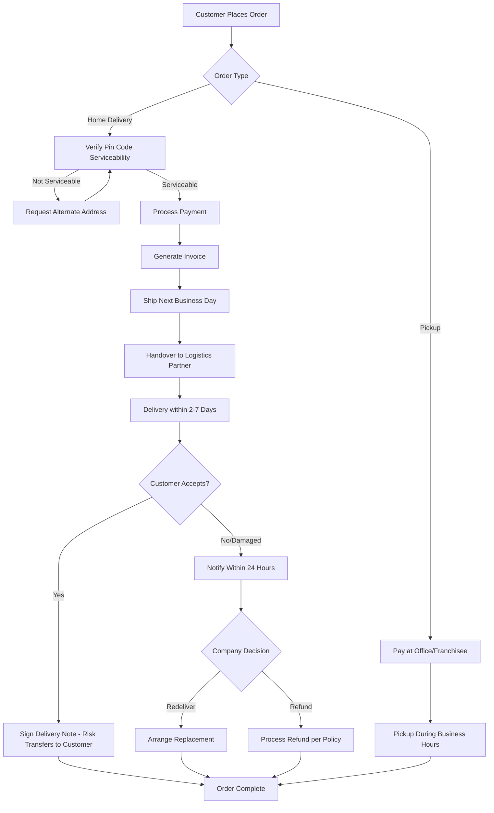
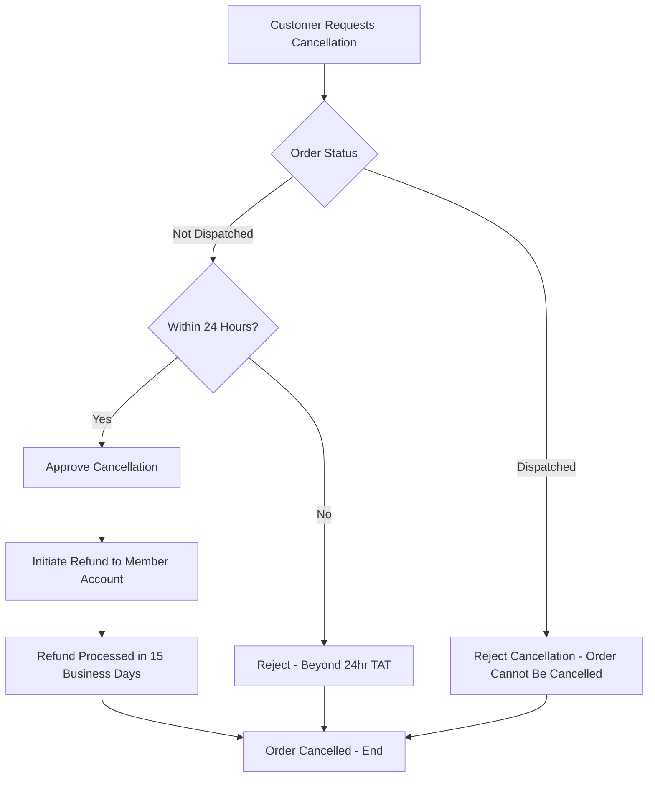
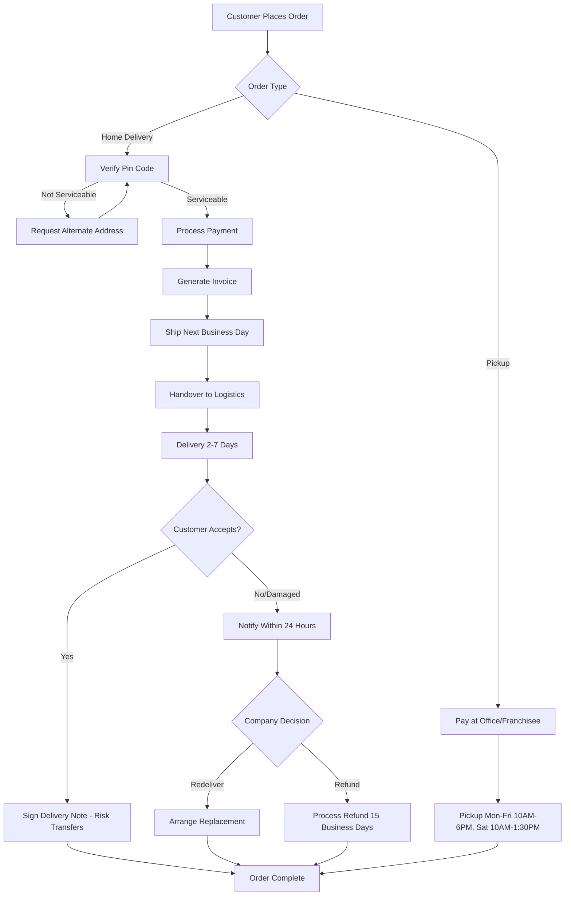
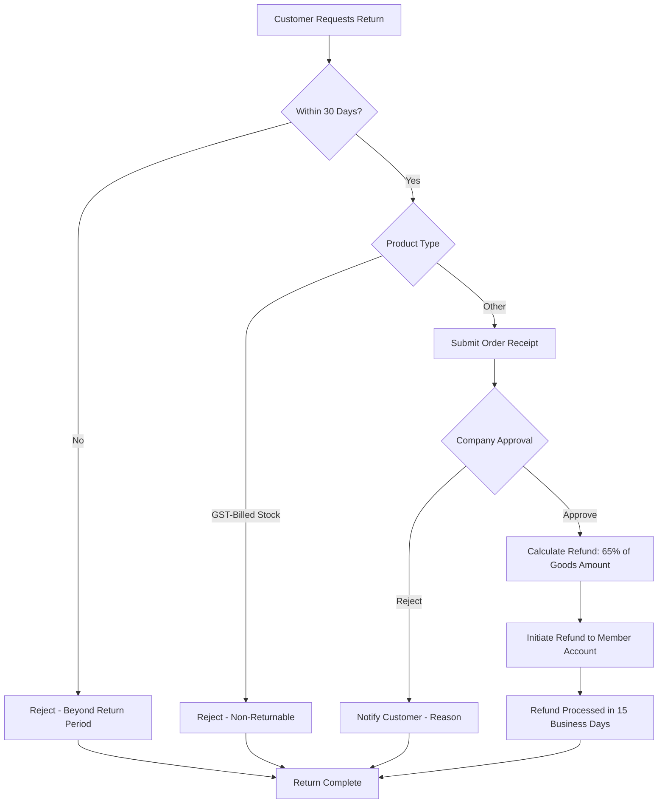
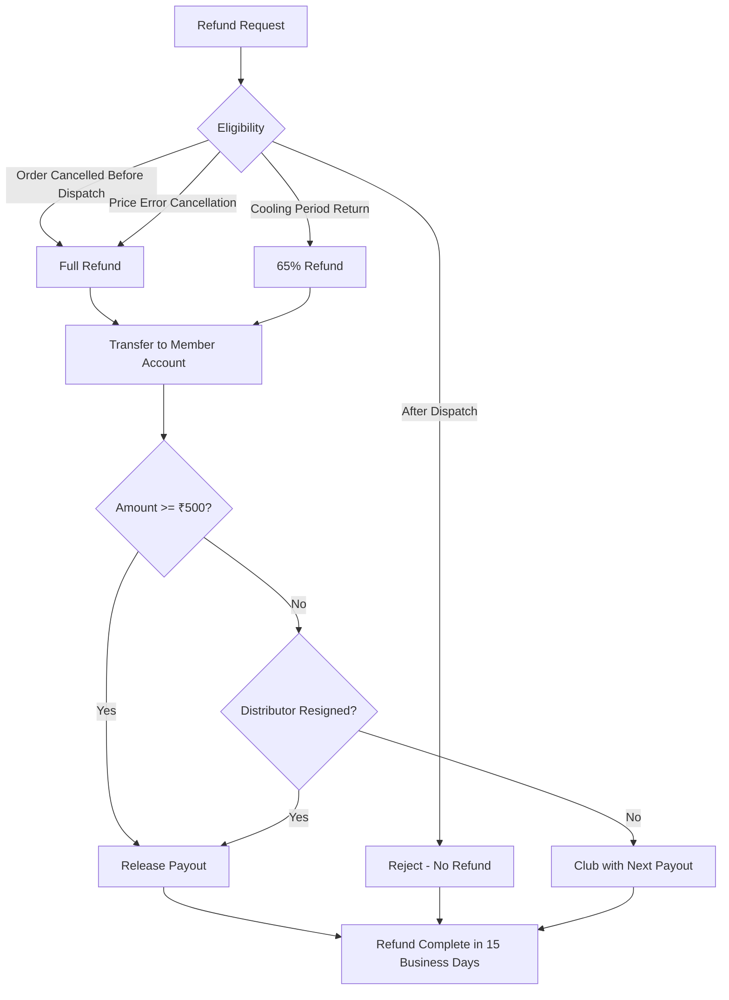
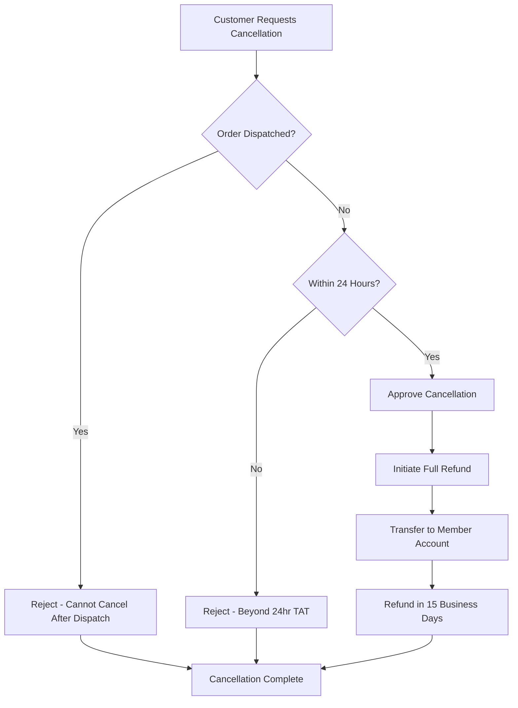
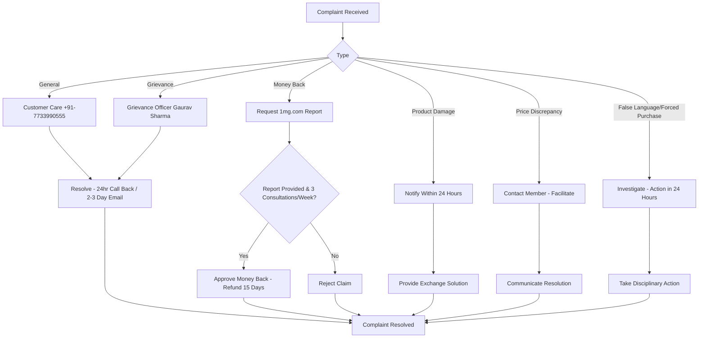

# Dayjoy Policies — Enterprise Research Document

> **Status:** VERIFIED / PARTIALLY VERIFIED / UNKNOWN / REQUIRES CLIENT INPUT  
> **Last updated:** 2026-08-04  
> **Purpose:** Comprehensive policy documentation for Dayjoy Enterprise AI Platform (Voice AI, WhatsApp AI, Website AI, RAG, Customer Support AI, Internal Assistants)  
> **Primary Sources:** Official Dayjoy website — Shipping Policy, Terms of Use, Terms and Conditions, Privacy Policy, FAQs [web:59][web:4][web:69][web:73][web:14]

---

## 1. Policy Overview

### 1.1 Purpose of Dayjoy Policies

**VERIFIED:** Dayjoy's policies are designed to:

- Govern the relationship between Dayjoy Marketing Private Limited and customers, independent distributors, and website users [web:4][web:69]
- Ensure compliance with the **Information Technology Act, 2000**, **Information Technology (Intermediaries Guidelines) Rules, 2011**, and **Direct Selling Guidelines** issued by the Government of India [web:4][web:69][web:73]
- Provide clear guidelines for shipping, returns, refunds, cancellations, payments, privacy, and distributor conduct [web:59][web:4][web:69][web:73]
- Protect consumer rights while maintaining business integrity and regulatory compliance [web:69][web:73]

### 1.2 Scope

**VERIFIED:** Dayjoy policies apply to:

- **Customers** purchasing products for personal use [web:14][web:59]
- **Independent Distributors** (also called "Second Party" in Terms and Conditions) [web:69]
- **Website users** accessing www.dayjoy.in [web:4][web:73]
- **All transactions** conducted through the website, office, or franchisee outlets [web:59]

### 1.3 Who the Policies Apply To

**VERIFIED:**

| Stakeholder | Applicable Policies |
|---|---|
| Customers | Shipping, Return, Refund, Cancellation, Payment, Privacy, Terms of Use [web:59][web:4][web:73] |
| Independent Distributors | All customer policies plus Distributor Policies, Code of Conduct, Compliance Rules [web:69] |
| Website Users | Terms of Use, Privacy Policy, Cookie Policy [web:4][web:73] |
| Employees | Internal policies (not publicly available) |

### 1.4 Last Updated Date

**VERIFIED:**

- **Privacy Policy:** Effective from **12th August, 2019** [web:73]
- **Terms and Conditions:** References Direct Selling Guidelines dated **9th September, 2016** [web:69]
- **Shipping Policy, Terms of Use:** No explicit last updated date mentioned in reviewed sources [web:59][web:4]

**UNKNOWN:** Exact last updated dates for Shipping Policy, Return Policy, Refund Policy, and Cancellation Policy are not specified. [web:59][web:4][web:14]

---

## 2. Shipping Policy

### 2.1 Shipping Process

**VERIFIED:**

| Order Type | Process |
|---|---|
| **Pickup from Office/Franchisee** | Orders can be placed at any outlet. Payment options: Cash, Demand Draft, Credit Card, Debit Card. Pickup hours: Mon-Fri 10:00 AM – 6:00 PM, Sat 10:00 AM – 1:30 PM, Sunday Closed. [web:59] |
| **Home Delivery** | Orders placed on website (www.dayjoy.in) or at office/franchisee outlets. Payment modes vary by channel (see Payment Policy section). [web:59] |

**VERIFIED:**

- Orders placed are typically **shipped the very next business day** [web:59]
- Orders placed on **Saturday after 2:30 PM** will be shipped on the following Monday [web:59]
- **Delivery time:** Average **2–7 days**, varies according to customer location [web:59]
- **No delivery on Sundays or major holidays** as per delivery partner policy [web:59]

### 2.2 Delivery Timelines

**VERIFIED:**

- **Average delivery time:** 2–7 days [web:59]
- **Dispatch time:** Typically next business day [web:59]
- **No guaranteed dispatch time** — time is not the essence of the contract [web:59]

**UNKNOWN:** Specific delivery timelines for different regions (metro, tier-2, tier-3 cities) are not specified. [web:59]

### 2.3 Shipping Charges

**VERIFIED:**

- **Delivery fees:** Refer to website www.dayjoy.in for more details on delivery fees [web:59]
- **Delivery costs charged in addition** to product price and included in 'Total Cost' [web:4]

**UNKNOWN:** Exact shipping charges, free shipping thresholds, and shipping calculators are not detailed in reviewed sources. [web:59][web:4]

### 2.4 Free Shipping Conditions

**UNKNOWN:** Free shipping conditions are not explicitly mentioned in the reviewed sources. [web:59][web:4]

### 2.5 Serviceable Locations

**VERIFIED:**

- Customer/Independent Distributor's **shipping address and pin code will be verified** with the website database before proceeding to payment [web:59]
- If order is **not serviceable** by logistics providers or delivery address is not covered, customer may provide an **alternate shipping address** [web:59]

**UNKNOWN:** Complete list of serviceable pin codes, cities, or states is not provided in reviewed sources. [web:59]

### 2.6 International Shipping

**UNKNOWN:** International shipping availability is not mentioned in the reviewed sources. [web:59][web:4]

### 2.7 Delivery Partners

**VERIFIED:**

- Company uses **logistic service providers** for delivery [web:59]
- Delivery partners have their own policies regarding **Sundays and major holidays** (no delivery) [web:59]

**UNKNOWN:** Names of specific delivery partners (courier companies) are not disclosed. [web:59]

### 2.8 Order Tracking Process

**UNKNOWN:** Order tracking system is not described in the reviewed sources. [web:59][web:4]

### 2.9 Delivery Delays

**VERIFIED:**

- **Dispatch times may vary** according to availability [web:4]
- Company **not responsible for delays** resulting from postal delays or force majeure [web:4]
- **No guaranteed dispatch time** — time is not the essence of the contract [web:59]

### 2.10 Failed Deliveries

**VERIFIED:**

- If customer **neglects or refuses to accept delivery**, they may be liable to Dayjoy for non-acceptance [web:59]
- Company may **call up customer** to evaluate reason for non-acceptance [web:59]
- Company's decision is **final and binding** on whether to redeliver or process refund as per refund policy [web:59]

### 2.11 Lost Shipments

**VERIFIED:**

- **Risk during transit:** On Company, not on customer/Independent Distributor [web:59]
- **Products must not be faulty** and must match descriptions/specifications on website [web:59]
- **Hidden damages** must be notified within **24 hours** of receipt [web:59]
- **Failure to notify within 24 hours** cancels Independent Distributor's right to request correction and is deemed acceptance [web:59]

### 2.12 Shipping Workflow Diagram



---

## 3. Return Policy

### 3.1 Return Eligibility

**VERIFIED:**

- **30-day cooling-off period** from date of purchase/signing of contract for cancellation and refund [web:69]
- **Buyback/exchange allowed within 30 days** of purchase as per refund policies [web:69]
- **Cooling period for bulk stock:** Generally **one month** for members/leaders who initiated SOPs or bulk stock but want to return [web:14]

### 3.2 Return Conditions

**VERIFIED:**

**Within Cooling Period (30 days):**

- Member/Leader can return bulk stock or SOPs within one month [web:14]
- **Refund:** **65% of goods amount** (member bears **35% loss**) [web:14]
- **Order receipt must be handed over/uploaded** positively [web:14]

**General Returns:**

- Products must be in **original condition** (not repacked or tampered) [web:69]
- **Risk of loss/damage** transfers to second party (distributor) immediately after pickup from first party [web:69]

### 3.3 Return Period

**VERIFIED:**

- **30 days** from date of purchase/signing of contract [web:69][web:14]

### 3.4 Non-Returnable Products

**VERIFIED:**

- **GST-billed stock cannot be returned** to the Company under any circumstances [web:81]
- **Products once sold** by distributor will not be taken back under any circumstances other than buyback policy [web:69]

**UNKNOWN:** Specific product categories that are non-returnable (opened personal care items, consumables, etc.) are not detailed. [web:69][web:81]

### 3.5 Return Procedure

**VERIFIED:**

1. **Initiate return** within cooling period (30 days) [web:14][web:69]
2. **Submit order receipt** (handover/upload) [web:14]
3. **Company evaluates** return request [web:14]
4. **Refund processed:** 65% of goods amount (within cooling period) [web:14]

**UNKNOWN:** Exact return submission process (online form, email, phone) is not detailed. [web:14][web:69]

### 3.6 Return Approval Workflow

**VERIFIED:**

- Company has **discretion** to accept or reject returns [web:69]
- Company's decision on **redeliver or refund** is final and binding [web:59]

### 3.7 Return Shipping Responsibility

**VERIFIED:**

- **Risk of loss/damages** sustained by second party (distributor) with their own cost [web:69]
- **Risk transfers** immediately after pickup from first party [web:69]

**UNKNOWN:** Whether customer/distributor bears return shipping costs is not explicitly stated. [web:69][web:59]

### 3.8 Exceptions

**VERIFIED:**

- **GST-billed stock:** Non-returnable under any circumstances [web:81]
- **Products sold by distributors:** Not returnable except under buyback policy [web:69]
- **Hidden damages:** Must be notified within 24 hours, else deemed acceptance [web:59]

---

## 4. Refund Policy

### 4.1 Refund Eligibility

**VERIFIED:**

| Scenario | Refund Eligibility | Refund Amount |
|---|---|---|
| **Order cancellation (before dispatch)** | Yes, if initiated within 24 hours TAT | Full refund [web:14] |
| **Cooling period return (within 30 days)** | Yes | 65% of goods amount (member bears 35% loss) [web:14] |
| **Price error discovered by company** | Yes, if customer cancels | Full refund [web:4] |
| **Order not dispatched** | Yes | Full refund [web:4] |
| **After dispatch** | No | Order cancellation not accepted [web:14] |

### 4.2 Refund Process

**VERIFIED:**

1. **Initiate cancellation/return** within 24 hours (for order cancellation) or 30 days (for cooling period) [web:14][web:69]
2. **Company approves** cancellation/return [web:14]
3. **Refund transferred** to member's account [web:14]
4. **Refund process takes 15 business days** [web:14]

### 4.3 Refund Timeline

**VERIFIED:**

- **Refund process:** **15 business days** [web:14]
- **Payout threshold:** Minimum **₹500** (payouts below ₹500 clubbed with next payout) [web:69]
- **Exception:** If distributor resigns, any outstanding amount paid irrespective of ₹500 limit [web:69]

### 4.4 Refund Methods

**VERIFIED:**

- **Bank transfer** to member's account [web:14]
- **Payment gateway** used for money collection on behalf of company [web:4]

**UNKNOWN:** Specific refund methods (NEFT, IMPS, UPI, cheque) are not detailed. [web:14][web:4]

### 4.5 Partial Refunds

**VERIFIED:**

- **Cooling period returns:** 65% refund (35% deduction) [web:14]
- **Price error cancellation:** Full refund if customer cancels [web:4]

### 4.6 Non-Refundable Situations

**VERIFIED:**

- **Orders already dispatched:** Cancellation not accepted, no refund [web:14]
- **GST-billed stock:** Cannot be returned, no refund [web:81]
- **Products sold by distributors:** Not taken back except under buyback policy [web:69]
- **Failure to notify damage within 24 hours:** Deemed acceptance, no refund [web:59]

### 4.7 Cancellation Refunds

**VERIFIED:**

- **Before dispatch (within 24 hours):** Full refund, transferred in 15 business days [web:14]
- **Price error discovered by company:** Full refund if customer cancels [web:4]
- **After dispatch:** No cancellation, no refund [web:14]

---

## 5. Cancellation Policy

### 5.1 Order Cancellation Rules

**VERIFIED:**

- **Only before dispatch:** Orders can be cancelled if not dispatched yet [web:14]
- **Within 24 hours TAT:** Customer can initiate cancellation within 24-hour turnaround time [web:14]
- **After dispatch:** Cancellation not accepted [web:14]

### 5.2 Cancellation Deadlines

**VERIFIED:**

- **24 hours** from order placement (before dispatch) [web:14]

### 5.3 Cancellation Charges

**VERIFIED:**

- **No cancellation charges** mentioned for orders cancelled before dispatch [web:14][web:4]
- **Cooling period returns:** 35% loss to member (65% refund) [web:14]

### 5.4 Automatic Cancellation Conditions

**VERIFIED:**

- **Price error:** If company discovers price error and cannot contact customer to reconfirm, order treated as cancelled [web:4]
- **Non-performance for 2 years:** Company may issue termination notice; if no review request within 30 days, termination deemed final [web:69]

### 5.5 Cancellation Workflow Diagram



---

## 6. Payment Policy

### 6.1 Accepted Payment Methods

**VERIFIED:**

| Channel | Payment Methods |
|---|---|
| **Pickup Orders (Office/Franchisee)** | Cash, Demand Draft, Credit Card, Debit Card [web:59] |
| **Orders Placed at Office** | Cash, Demand Draft, Debit Card, Credit Card [web:59] |
| **Online Orders** | Credit Card, Debit Card, Net Banking, etc. [web:59] |
| **Payment Gateway** | Official account for money collection on behalf of company [web:4] |

### 6.2 Payment Verification

**VERIFIED:**

- **Standard authorization check** on payment card to ensure sufficient funds [web:4]
- **Card debited upon authorization** received [web:4]
- Amount treated as **deposit** against goods value until dispatch [web:4]
- **Full and final payment required** before product delivery [web:59]

### 6.3 Failed Payments

**UNKNOWN:** Failed payment handling process is not detailed in reviewed sources. [web:4][web:59]

### 6.4 Payment Security

**VERIFIED:**

- **Payment Gateway** is official account for money collection [web:4]
- **Latest encryption technology** used for collecting/transferring sensitive data (bank account information) [web:73]
- **Bank account numbers** used only for payment processing, not retained for other purposes [web:73]

### 6.5 Invoice Generation

**VERIFIED:**

- **Acknowledgement email** sent upon order receipt (not acceptance) [web:4]
- **Confirmation email** sent upon dispatch (constitutes acceptance, forms contract) [web:4]
- **Invoice** generated with product details, price, taxes [web:4]

### 6.6 Tax Information

**VERIFIED:**

- **All taxes included** in MRP (e.g., "Rs. 525.00/- (Incl. Of All Taxes)") [web:37]
- **Distributors responsible** for paying all government taxes as applicable [web:69]
- **GST registration** exists (GSTIN: 08AAGCD8452J1ZA) [web:12]

### 6.7 Currency Support

**VERIFIED:**

- **Indian Rupees (INR/₹)** — all prices listed in INR [web:37][web:25][web:40]

**UNKNOWN:** Support for other currencies (USD, EUR, etc.) is not mentioned. [web:4][web:59]

---

## 7. Privacy Policy

### 7.1 Personal Information Collected

**VERIFIED:**

| Information Type | Collected When |
|---|---|
| **Domain name** | Upon logging onto web server (automatic) [web:73] |
| **Aggregate page access data** | Browsing website [web:73] |
| **User-specific page access data** | Browsing website [web:73] |
| **Survey information** | Voluntary participation [web:73] |
| **Site registration data** | Registering on website [web:73] |
| **Email address** | Contacting by email or volunteering [web:73] |
| **Name** | Ordering products/services, making requests [web:73] |
| **Independent Distributor ID** | Registration [web:73] |
| **Contact and billing information** | Ordering products/services [web:73] |
| **Transaction and credit card information** | Payment processing [web:73] |
| **Personal/professional interests, demographics, experience, contact preferences** | Voluntary provision [web:73] |

### 7.2 Data Usage

**VERIFIED:**

Dayjoy uses collected information to:

- **Better understand needs** and provide better service [web:73]
- **Help complete transactions** [web:73]
- **Communicate back** to customers [web:73]
- **Update on services and benefits** [web:73]
- **Personalize website** experience [web:73]
- **Estimate audience size and usage patterns** [web:73]
- **Store preferences** to customize site and save time [web:73]
- **Increase speed of searches** [web:73]
- **Recognize returning users** [web:73]
- **Tailor communications** and continuously improve products/services [web:73]

### 7.3 Data Sharing

**VERIFIED:**

- **Will NOT sell, rent, or lease** personally identifiable information to others without permission or legal requirement [web:73]
- **May share** with other Dayjoy entities and/or business partners acting on company's behalf [web:73]
- Such entities/partners are **governed by privacy policies** and bound by confidentiality agreements [web:73]
- **Will NOT use or share** in ways unrelated to described uses without first letting user know and offering choice [web:73]
- **Bank account numbers** used only for payment processing, not shared [web:73]

### 7.4 Cookies

**VERIFIED:**

**Purpose of Cookies:**

- Enable sign-in to services [web:73]
- Personalize online experience [web:73]
- Store preferences and other information on user's computer [web:73]
- Save time by eliminating need to repeatedly enter same information [web:73]
- Display personalized content on later visits [web:73]
- Estimate audience size and usage patterns [web:73]
- Customize site according to individual interests [web:73]
- Increase speed of searches [web:73]
- Recognize returning users [web:73]

**Cookie Characteristics:**

- **Tiny text files** stored on hard disk by web page server [web:73]
- **Cannot harm computer** [web:73]
- **Do not contain personally identifiable information** [web:73]

### 7.5 User Rights

**VERIFIED:**

- **Right to access** personally identifiable information [web:73]
- **Right to delete** personal data [web:73]
- **Right to update/correct** information [web:73]
- **Right to opt-out** of unsolicited direct marketing materials [web:73]
- **Right to choose** how information is used for new, unanticipated uses [web:73]

**How to Exercise Rights:**

- Contact Dayjoy directly at **support@dayjoy.in** or **+91-7733990555** [web:73]
- Company will **verify identity** before granting access or enabling corrections [web:73]
- Company will **respond within 10 business days** [web:73]

### 7.6 Data Retention

**VERIFIED:**

- Personally identifiable information kept in active files **as long as needed** to meet purposes for which it was collected [web:73]
- Information retained **as required to perform contractual relationship** with Direct Seller and commercial relationship with Independent Distributor [web:73]
- Company makes **reasonable efforts** to ensure information is accurate and complete [web:73]

**UNKNOWN:** Specific data retention periods (e.g., 3 years, 5 years, indefinite) are not specified. [web:73]

### 7.7 Contact for Privacy Concerns

**VERIFIED:**

- **Grievance Officer:** Contact for privacy policy comments, inquiries, updates, or rights exercise [web:73]
- **Email:** support@dayjoy.in [web:73][web:4]
- **Phone:** +91-7733990555 [web:73][web:3]

**UNKNOWN:** Grievance Officer's name and direct contact details are not provided in Privacy Policy. [web:73]

---

## 8. Terms and Conditions

### 8.1 User Responsibilities

**VERIFIED:**

**Website Users:**

- Must be **over 18 years of age** to contract with Dayjoy [web:4]
- Must provide **true and accurate details** when placing orders [web:4]
- Must be **authorized user** of credit/debit card used [web:4]
- Must ensure **sufficient funds** to cover cost of goods [web:4]
- Must **check Terms of Use regularly** for updates [web:4]
- Must **not misuse website** (no criminal offense, viruses, hacking, spam, etc.) [web:4]

**Independent Distributors:**

- Must be **18 years and above**, of sound mind, not convicted by any court [web:69]
- Must furnish **correct KYC documents** (ID and address proof) [web:69]
- Must **not represent, sell, or distribute** products of other direct selling companies [web:69]
- Must **carry identity cards** and not visit prospects without prior appointment [web:69]
- Must **identify themselves truthfully** and represent Dayjoy accurately [web:69]
- Must provide **accurate explanations** of goods, services, prices, policies [web:69]
- Must **not repack or tamper** with product labels [web:69]
- Must **not make bulk purchases** [web:69]
- Must **not promote online** without prior approval [web:69]
- Must **pay all government taxes** as applicable [web:69]
- Must **not mislead prospects** or make false/deceptive practices [web:69]
- Must **not make unverifiable representations** or promises that cannot be fulfilled [web:69]
- Must **not use unapproved literature/training materials** [web:69]
- Must **defend, indemnify, and hold harmless** Dayjoy against liability/losses [web:69]
- Must maintain **confidentiality** of company information [web:69]

### 8.2 Company Responsibilities

**VERIFIED:**

- Provide **30-day cooling-off period** for cancellation and refund [web:69]
- Allow **buyback/exchange within 30 days** as per refund policies [web:69]
- Provide **incentives as per Compensation Plan** [web:69]
- **Investigate complaints** regarding distributor conduct/non-performance [web:69]
- **Protect products during transit** (risk on company until delivery) [web:59]
- Ensure products are **not faulty** and match descriptions/specifications [web:59]
- **Verify pin codes** before accepting orders [web:59]
- **Send transactional SMS and emails** to keep customers informed [web:4]
- **Operate complaints handling procedure** to resolve disputes [web:4]

### 8.3 Prohibited Activities

**VERIFIED:**

**Website Users:**

- Commit or encourage criminal offense [web:4]
- Transmit/distribute viruses, trojans, worms, logic bombs, malicious material [web:4]
- Hack into any aspect of the Service [web:4]
- Corrupt data [web:4]
- Cause annoyance to other users [web:4]
- Infringe proprietary rights [web:4]
- Send spam [web:4]
- Attempt to affect performance/functionality of computer facilities [web:4]

**Independent Distributors:**

- Represent/sell/distribute products of other direct selling companies [web:69]
- Repack or tamper with product labels [web:69]
- Make bulk purchases [web:69]
- List/market/advertise/promote/discuss/sell products or business opportunity online without approval [web:69]
- Mislead prospects or engage in false/deceptive/unfair practices [web:69]
- Make unverifiable factual representations or unfulfillable promises [web:69]
- Make false/misleading representations about direct selling operations or compensation plan [web:69]
- Provide unapproved literature/training materials [web:69]
- Breach confidentiality [web:69]

### 8.4 Intellectual Property

**VERIFIED:**

- **All software and content** (including photographic images) on website remains property of Dayjoy or its licensors [web:4]
- Protected by **copyright laws and treaties** around the world [web:4]
- Users may **store, print, display** content solely for personal use [web:4]
- Users **NOT permitted** to publish, manipulate, distribute, reproduce, or use content for commercial enterprise [web:4]
- All trademarks/names featured are owned by respective trademark owners [web:4]
- Trademarks used solely to describe/identify products, not endorsement [web:4]

### 8.5 Limitation of Liability

**VERIFIED:**

**Company NOT liable for:**

- Website unavailability at any time/period [web:4]
- Loss/damage from DDoS attacks, viruses, or technologically harmful material [web:4]
- Consequences of using information without verification/confirmation [web:4]
- Time gap in internet posting/transmission vs. browser availability [web:4]
- Direct, indirect, special, consequential, punitive, or incidental damages [web:4]
- Damages for loss of use, profits, data, intangibles, goodwill, reputation [web:4]
- Cost of procurement of substitute goods/services [web:4]
- Postal delays or force majeure [web:4]
- Price fluctuations in foreign products/services [web:4]

**Exceptions (Company IS liable for):**

- Death or personal injury arising from negligence [web:4]
- Fraudulent misrepresentation [web:4]
- Misrepresentation as to fundamental matter [web:4]
- Any liability that cannot be excluded/limited under applicable law [web:4]

### 8.6 Dispute Resolution

**VERIFIED:**

- **Arbitration:** All disputes resolved under **Indian Arbitration and Conciliation Act** [web:69]
- **Place of arbitration:** **Kota (Rajasthan, India) only** [web:69]
- **Sole arbitrator:** Appointed by company [web:59]
- **Jurisdiction:** District Courts in Kota (Rajasthan, India) only [web:59]
- **Final decision:** Binding upon both parties [web:59]
- **Breach costs:** Customer/Independent Distributor liable for damages and legal costs [web:59]

### 8.7 Governing Law

**VERIFIED:**

- **Information Technology Act, 2000** and rules thereunder [web:4][web:73]
- **Information Technology (Intermediaries Guidelines) Rules, 2011** [web:4]
- **Direct Selling Guidelines** issued by Govt. of India, Ministry of Consumer Affairs (F.No. 21/18/2014-IT Vol-II dated 9th Sept., 2016) [web:69]
- **Indian Contract Act, 1872** [web:69]
- **Indian Arbitration and Conciliation Act** [web:69]
- **Laws of India** — all disputes submitted to adequate courts in Kota (Rajasthan, India) [web:4][web:69]

---

## 9. Distributor Policies

### 9.1 Distributor Obligations

**VERIFIED:**

| Obligation | Details |
|---|---|
| **Age & Mental Capacity** | 18+ years, sound mind, no criminal conviction [web:69] |
| **KYC Compliance** | Provide correct ID and address proof [web:69] |
| **Exclusivity** | Not represent/sell/distribute products of other direct selling companies [web:69] |
| **Identity Disclosure** | Carry identity cards, identify truthfully, not visit without appointment [web:69] |
| **Accurate Representation** | Explain goods, services, prices, policies accurately and completely [web:69] |
| **Product Integrity** | Not repack or tamper with labels [web:69] |
| **No Bulk Purchases** | Prohibited [web:69] |
| **No Online Promotion** | Without prior approval [web:69] |
| **Tax Compliance** | Pay all government taxes as applicable [web:69] |
| **Ethical Conduct** | Not mislead, not engage in false/deceptive practices [web:69] |
| **Confidentiality** | Maintain company information confidential [web:69] |
| **Indemnification** | Defend, indemnify, hold harmless Dayjoy [web:69] |

### 9.2 Compliance Rules

**VERIFIED:**

- Comply with **Direct Selling Guidelines 2016** (F.No. 21/18/2014-IT Vol-II dated 9th Sept., 2016) [web:69]
- Comply with **Indian Contract Act, 1872** [web:69]
- Comply with **Information Technology Act, 2000** [web:4][web:73]
- Comply with **Compensation Plan** as published on website [web:69]
- **Unique Business Centre** restricted to single PAN number, not transferable [web:69]
- **Non-performance for 2 years** may result in termination notice [web:69]

### 9.3 Marketing Restrictions

**VERIFIED:**

- **No online promotion** without prior approval (website/portal/mobile app/forum) [web:69]
- **No unapproved literature/training materials** [web:69]
- **No false/misleading representations** about products, compensation plan, or earnings [web:69]
- **Only company-approved Compensation Plan** followed [web:69]
- **No income claims** beyond what is stated in official business plan [web:69]

### 9.4 Ethical Guidelines

**VERIFIED:**

- **Not mislead prospects** [web:69]
- **Not engage in false, deceptive, or unfair practices** [web:69]
- **Not make unverifiable representations** or unfulfillable promises [web:69]
- **Identify truthfully** and represent Dayjoy accurately [web:69]
- **Provide complete details** of Dayjoy to prospects [web:69]
- **Render accurate explanations** of goods, services, prices, policies [web:69]

### 9.5 Code of Conduct

**VERIFIED:**

- Carry **identity cards** at all times [web:69]
- **Not visit prospects without prior appointment** [web:69]
- **Identify themselves truthfully** at initiation [web:69]
- **Clearly represent** Dayjoy, nature of goods/services, purpose of solicitation [web:69]
- **Not make false, deceptive, or unfair practices** [web:69]
- **Not make factual representations that cannot be verified** [web:69]
- **Not knowingly make false/misleading representations** [web:69]
- **Not provide unapproved literature/training materials** [web:69]
- **Maintain confidentiality** of company information [web:69]
- **Defend, indemnify, hold harmless** Dayjoy [web:69]

### 9.6 Account Suspension Conditions

**VERIFIED:**

Company may investigate complaints and take disciplinary actions including:

- **Suspension** of distributorship [web:69]
- **Termination** of distributorship [web:69]
- **Withholding of commissions** [web:69]
- **Other measures** deemed necessary [web:69]

**Triggers:**

- **Misconduct** verified [web:69]
- **Non-compliance** with company policies [web:69]
- **Wrongful practices** engaged [web:69]
- **Representing other direct selling companies** (immediate termination) [web:69]
- **Non-performance for 2 years** (termination notice issued) [web:69]
- **Counterfeiting or acting against Terms of Use** (termination with penalty) [web:4]

### 9.7 Termination Policy

**VERIFIED:**

**Termination Conditions:**

- **Non-performance for 2 years:** Company issues termination notice [web:69]
- **Representing other companies:** Immediate termination [web:69]
- **Counterfeiting/Terms of Use violation:** Termination with penalty [web:4]
- **Misconduct/non-compliance:** Suspension or termination [web:69]

**Review Process:**

- Distributor may **request review within 30 days** of termination notice [web:69]
- If **no request within 30 days**, termination deemed final [web:69]
- Company reviews request and makes final decision [web:69]

**Outstanding Payouts:**

- If distributor **resigns**, any outstanding amount paid **irrespective of ₹500 limit** [web:69]

---

## 10. Warranty Policy

### 10.1 Warranty Coverage

**VERIFIED:**

- **Products not faulty:** Dayjoy represents and warrants that products are not faulty and match descriptions/specifications on website [web:59]
- **Products meet descriptions:** Products meet all descriptions and specifications as provided on website [web:59]

**UNKNOWN:** Specific warranty periods, coverage details, or product-specific warranties are not mentioned in reviewed sources. [web:59]

### 10.2 Warranty Exclusions

**VERIFIED:**

- **Hidden damages not notified within 24 hours:** Deemed acceptance, no warranty claim [web:59]
- **Products repacked or tampered:** Not covered (distributor prohibited from repacking/tampering) [web:69]
- **Risk after delivery:** Risk of loss transfers to Independent Distributor upon delivery [web:59]

### 10.3 Claim Process

**VERIFIED:**

- **Product damage:** Company provides **exchange solution** [web:14]
- **Hidden damages:** Must notify within **24 hours** of receipt [web:59]
- **Failure to notify:** Cancels right to request correction [web:59]

**UNKNOWN:** Detailed warranty claim process (forms, contacts, timelines) is not provided. [web:14][web:59]

### 10.4 Warranty Period

**VERIFIED:**

- **Shelf life:** Some products expire after **24 months** from month of manufacturing (e.g., JoyCalcium, Seabuckthorn Massage Cream) [web:20][web:75]

**UNKNOWN:** Warranty period for non-consumable products is not specified. [web:20][web:75]

---

## 11. Complaint Resolution Policy

### 11.1 Complaint Submission

**VERIFIED:**

| Complaint Type | Submission Method |
|---|---|
| **General complaints** | Contact support@dayjoy.in, +91-7733990555 [web:3][web:4] |
| **Grievances** | Grievance Redressal Officer: Gaurav Sharma, vpbdops@dayjoy.in, +91-7412034392 [web:3] |
| **Money back claims** | Provide before/after report from 1mg.com, follow minimum 3 consultations/week [web:14] |
| **Product damage** | Notify within 24 hours of receipt [web:59] |
| **Price discrepancy** | Contact member, company can facilitate communication [web:14] |
| **False language/forced purchase** | Report to company, action within 24 hours [web:14] |

### 11.2 Escalation Levels

**VERIFIED:**

| Level | Contact |
|---|---|
| **Level 1: Customer Support** | Customer Care: +91-7733990555, support@dayjoy.in [web:3][web:4] |
| **Level 2: Grievance Redressal Officer** | Gaurav Sharma, vpbdops@dayjoy.in, +91-7412034392 [web:3] |
| **Level 3: Arbitration** | Sole arbitrator appointed by company, District Courts Kota (Rajasthan) [web:59][web:69] |

### 11.3 Resolution Timelines

**VERIFIED:**

| Complaint Type | TAT |
|---|---|
| **Call back** | 24 hours [web:14] |
| **Email response** | 2-3 days [web:14] |
| **Money back claim** | After 1mg.com report verification, refund in 15 business days [web:14] |
| **Product damage** | Exchange solution provided [web:14] |
| **False language/forced purchase** | Action within 24 hours [web:14] |
| **Order cancellation refund** | 15 business days [web:14] |
| **Privacy request (access/delete)** | 10 business days [web:73] |

### 11.4 Communication Process

**VERIFIED:**

- **Transactional SMS and emails** sent to keep customers informed [web:4]
- **Acknowledgement email** sent upon order receipt [web:4]
- **Confirmation email** sent upon dispatch [web:4]
- **Company can facilitate communication** between members and customers for price discrepancy complaints [web:14]

### 11.5 Customer Support Channels

**VERIFIED:**

| Channel | Contact |
|---|---|
| **Phone (Customer Care)** | +91-7733990555 [web:3] |
| **Phone (Business Support)** | +91-7412034392 [web:3] |
| **Phone (WhatsApp Support)** | +91-9636074393 [web:3] |
| **Phone (Dispatch)** | +91-7733990555 [web:3] |
| **Phone (Franchise Manager)** | +91-7733990555 [web:3] |
| **Email (General)** | support@dayjoy.in [web:4] |
| **Email (Grievances)** | vpbdops@dayjoy.in [web:3] |
| **Website Contact Form** | Available on www.dayjoy.in/Contact [web:7] |

---

## 12. Customer Support Policy

### 12.1 Support Channels

**VERIFIED:**

| Channel | Contact | Purpose |
|---|---|---|
| **Customer Care** | +91-7733990555 | General inquiries, orders, support [web:3] |
| **Business Support** | +91-7412034392 | Distributor-related queries [web:3] |
| **WhatsApp Support** | +91-9636074393 | Quick support via WhatsApp [web:3] |
| **Dispatch** | +91-7733990555 | Order dispatch inquiries [web:3] |
| **Franchise Manager** | +91-7733990555 | Franchise-related queries [web:3] |
| **Grievance Redressal Officer** | Gaurav Sharma, vpbdops@dayjoy.in, +91-7412034392 | Complaints, grievances [web:3] |
| **Email (General)** | support@dayjoy.in | General inquiries, support [web:4] |
| **Email (Privacy)** | support@dayjoy.in | Privacy requests, data access/deletion [web:73] |

### 12.2 Working Hours

**VERIFIED:**

- **Pickup hours (Office/Franchisee):** Mon-Fri 10:00 AM – 6:00 PM, Sat 10:00 AM – 1:30 PM, Sunday Closed [web:59]

**UNKNOWN:** Customer support phone/email working hours are not explicitly stated. [web:3][web:4]

### 12.3 Response Time Commitments

**VERIFIED:**

| Channel | TAT |
|---|---|
| **Call back** | 24 hours [web:14] |
| **Email response** | 2-3 days [web:14] |
| **Privacy request** | 10 business days [web:73] |
| **False language/forced purchase complaint** | Action within 24 hours [web:14] |

### 12.4 Escalation Procedures

**VERIFIED:**

1. **First contact:** Customer Care (+91-7733990555) or support@dayjoy.in [web:3][web:4]
2. **Escalate to Grievance Officer:** Gaurav Sharma (vpbdops@dayjoy.in, +91-7412034392) for unresolved issues [web:3]
3. **Arbitration:** For disputes, sole arbitrator appointed by company, District Courts Kota (Rajasthan) [web:59][web:69]

---

## 13. Regulatory & Compliance Information

### 13.1 Direct Selling Regulations

**VERIFIED:**

- **Direct Selling Guidelines 2016:** F.No. 21/18/2014-IT (Vol-II) dated 9th Sept., 2016, Ministry of Consumer Affairs, Govt. of India [web:69]
- **State Registrations:** Tamil Nadu, Telangana, Kerala, Himachal Pradesh, Punjab, Rajasthan, Karnataka, Andhra Pradesh, New Delhi [web:68]
- **Consumer Protection (Direct Selling) Rules, 2021:** Self Declaration by Dayjoy available in compliance documents [web:67]
- **Home State Direct Selling Rules Compliance Acknowledgement** [web:67]
- **Direct Selling Rules Compliance Acknowledgement** [web:67]
- **Direct Seller Contract** template available [web:67]
- **List of Active Distributors** and **List of Terminated Distributors** published till 31st January 2025 [web:67]
- **Nodal Officer Appointment** [web:67]
- **National Consumer Helpline Registration** [web:67]

### 13.2 Consumer Protection Obligations

**VERIFIED:**

- **30-day cooling-off period** for cancellation and refund [web:69]
- **Buyback/exchange within 30 days** as per refund policies [web:69]
- **Money back guarantee** with conditions (1mg.com report, 3 consultations/week) [web:14]
- **Product damage exchange** policy [web:14]
- **Grievance Redressal Officer** appointed [web:3]
- **Call back TAT:** 24 hours, **Email TAT:** 2-3 days [web:14]
- **Privacy Policy** compliant with Information Technology Act, 2000 and Rules 2011 [web:73]

### 13.3 Advertising Guidelines

**VERIFIED:**

- **No false/misleading advertisements** [web:69]
- **No unverifiable claims** [web:69]
- **Only company-approved literature/training materials** [web:69]
- **No online promotion without approval** [web:69]

### 13.4 Product Claims

**VERIFIED:**

- **Product descriptions** on website must be accurate [web:4]
- **Errors may occur** — company will inform customers and offer reconfirmation or cancellation [web:4]
- **Products must match descriptions/specifications** on website [web:59]
- **Research and Development** documents available for some products (e.g., Asthprash clinical studies) [web:35]

### 13.5 Privacy Obligations

**VERIFIED:**

- **Information Technology Act, 2000** compliance [web:4][web:73]
- **Information Technology (Reasonable Security Practices and Procedures and Sensitive Personal Data of Information) Rules, 2011** compliance [web:73]
- **Section 43A and Section 72A** of IT Act, 2000 referenced [web:73]
- **Privacy Policy effective from 12th August, 2019** [web:73]
- **Users have right to access and delete personal data** [web:73]
- **Company responds within 10 business days** to privacy requests [web:73]
- **Latest encryption technology** used for sensitive data [web:73]

### 13.6 Applicable Legal Requirements

**VERIFIED:**

| Law/Regulation | Reference |
|---|---|
| **Information Technology Act, 2000** | [web:4][web:73] |
| **IT (Intermediaries Guidelines) Rules, 2011** | [web:4] |
| **IT (Reasonable Security Practices) Rules, 2011** | [web:73] |
| **Direct Selling Guidelines 2016** | F.No. 21/18/2014-IT (Vol-II) dated 9th Sept., 2016 [web:69] |
| **Indian Contract Act, 1872** | [web:69] |
| **Indian Arbitration and Conciliation Act** | [web:69] |
| **Companies Act, 2013** | Dayjoy incorporated under this act [web:4][web:69] |
| **Consumer Protection (Direct Selling) Rules, 2021** | [web:67] |

---

## 14. Frequently Asked Questions

### 14.1 Shipping

**Q: How long does shipping take?**  
**A:** Average delivery time is **2–7 days**, depending on location. Orders are typically shipped the next business day. [web:59]

**Q: What are the shipping charges?**  
**A:** Refer to website www.dayjoy.in for delivery fees details. Delivery costs are charged in addition to product price. [web:59][web:4]

**Q: Is free shipping available?**  
**A:** Free shipping conditions are not explicitly mentioned in reviewed sources. [web:59][web:4]

**Q: Can I track my order?**  
**A:** Order tracking system is not described in reviewed sources. Contact customer care for order status. [web:59][web:3]

**Q: What if my order is damaged during delivery?**  
**A:** Notify company within **24 hours** of receipt. Company will provide exchange solution. [web:59][web:14]

**Q: What if I'm not home during delivery?**  
**A:** Customer may be liable for non-acceptance. Company may call to evaluate reason and decide on redelivery or refund. [web:59]

**Q: Do you deliver on Sundays?**  
**A:** No, delivery does not happen on Sundays or major holidays as per delivery partner policy. [web:59]

### 14.2 Returns

**Q: Can I return a product?**  
**A:** Yes, within **30 days** of purchase (cooling-off period). Returns subject to company approval and buyback policy. [web:69][web:14]

**Q: What is the return period?**  
**A:** **30 days** from date of purchase/signing of contract. [web:69]

**Q: What products cannot be returned?**  
**A:** GST-billed stock cannot be returned under any circumstances. Products once sold by distributors are not returnable except under buyback policy. [web:81][web:69]

**Q: How much refund will I get for a return?**  
**A:** Within cooling period (30 days): **65% refund** (member bears 35% loss). [web:14]

**Q: Do I need to provide order receipt for return?**  
**A:** Yes, member must always handover/upload order receipt positively. [web:14]

### 14.3 Refunds

**Q: How long does a refund take?**  
**A:** **15 business days** for refund processing. [web:14]

**Q: When will I receive my refund?**  
**A:** Refund transferred to member's account within 15 business days after approval. [web:14]

**Q: What if my refund is less than ₹500?**  
**A:** Payouts below ₹500 are clubbed with next payout. Exception: If distributor resigns, any outstanding amount paid irrespective of ₹500 limit. [web:69]

**Q: Can I get a refund if my order is already dispatched?**  
**A:** No, order cancellation not accepted after dispatch. [web:14]

**Q: What if company discovers a price error?**  
**A:** Company will inform you and offer option to reconfirm at correct price or cancel. If cancelled, full refund provided. [web:4]

### 14.4 Cancellation

**Q: How do I cancel my order?**  
**A:** Contact customer care within **24 hours** of order placement (before dispatch). [web:14]

**Q: Can I cancel after 24 hours?**  
**A:** No, cancellation only accepted within 24-hour TAT and before dispatch. [web:14]

**Q: Is there a cancellation charge?**  
**A:** No cancellation charges mentioned for orders cancelled before dispatch within 24 hours. [web:14][web:4]

**Q: What if company cancels my order due to price error?**  
**A:** You will receive full refund if order was already paid. [web:4]

### 14.5 Payments

**Q: Which payment methods are accepted?**  
**A:**  
- **Pickup/Office orders:** Cash, Demand Draft, Credit Card, Debit Card  
- **Online orders:** Credit Card, Debit Card, Net Banking, etc. [web:59]

**Q: Is my payment secure?**  
**A:** Yes, latest encryption technology used for sensitive data. Payment Gateway is official account for money collection. [web:73][web:4]

**Q: What currency do you accept?**  
**A:** Indian Rupees (INR/₹). [web:37][web:25]

**Q: Do I receive an invoice?**  
**A:** Yes, acknowledgement email upon order receipt, confirmation email upon dispatch (forms contract). [web:4]

**Q: Are taxes included in the price?**  
**A:** Yes, MRP includes all taxes (e.g., "Rs. 525.00/- (Incl. Of All Taxes)"). Distributors responsible for paying applicable government taxes. [web:37][web:69]

### 14.6 Privacy

**Q: What personal information do you collect?**  
**A:** Domain name, page access data, survey/registration data, email (if volunteered), name, Distributor ID, contact/billing info, transaction/credit card info, interests/demographics/preferences. [web:73]

**Q: How do you use my information?**  
**A:** To understand needs, complete transactions, communicate back, update on services/benefits, personalize website, estimate audience size, store preferences, improve site. [web:73]

**Q: Do you share my information with third parties?**  
**A:** No, not without permission or legal requirement. May share with Dayjoy entities/business partners acting on company's behalf, governed by privacy policies. [web:73]

**Q: Can I access my personal data?**  
**A:** Yes, contact support@dayjoy.in or +91-7733990555. Company responds within 10 business days. [web:73]

**Q: Can I delete my personal data?**  
**A:** Yes, contact support@dayjoy.in or +91-7733990555 with your name, email, and data type to delete. Company responds within 10 business days. [web:73]

**Q: Do you use cookies?**  
**A:** Yes, cookies enable sign-in, personalize experience, store preferences, estimate audience size, customize site, increase search speed, recognize returning users. [web:73]

### 14.7 Orders

**Q: How do I place an order?**  
**A:** Online on website www.dayjoy.in, or at office/franchisee outlets. [web:59]

**Q: Can I pick up my order from the office?**  
**A:** Yes, pickup available Mon-Fri 10:00 AM – 6:00 PM, Sat 10:00 AM – 1:30 PM, Sunday Closed. Payment: Cash, DD, Credit/Debit Card. [web:59]

**Q: What if my pin code is not serviceable?**  
**A:** You may provide an alternate shipping address covered by logistics providers. [web:59]

**Q: When will my order be dispatched?**  
**A:** Typically next business day. Orders placed Saturday after 2:30 PM shipped on Monday. [web:59]

**Q: What if I don't receive my order?**  
**A:** Contact customer care. Hidden damages must be notified within 24 hours of receipt. [web:59][web:3]

### 14.8 Distributor Policies

**Q: Who can become a distributor?**  
**A:** Anyone 18+ years, sound mind, not convicted by any court, with valid KYC documents and PAN number. [web:69]

**Q: Is distributor registration free?**  
**A:** Yes, becoming an Independent Distributor is absolutely free. [web:68][web:4]

**Q: Can I sell products of other direct selling companies?**  
**A:** No, distributors must not represent, sell, or distribute products of any other direct selling company during tenure of agreement. [web:69]

**Q: Can I promote Dayjoy products online?**  
**A:** No, not without prior approval from company. [web:69]

**Q: What happens if I don't perform for 2 years?**  
**A:** Company may issue termination notice. You can request review within 30 days; if no request, termination deemed final. [web:69]

**Q: Is my Distributor ID transferable?**  
**A:** No, Unique Business Centre is restricted to single PAN number and is not transferable under any circumstances. [web:69]

**Q: When will I receive my payout?**  
**A:** Payouts released only if exceeding ₹500 (below amounts clubbed with next payout). If you resign, any outstanding amount paid irrespective of ₹500 limit. [web:69]

### 14.9 Complaints

**Q: How do I file a complaint?**  
**A:** Contact Customer Care (+91-7733990555), support@dayjoy.in, or Grievance Redressal Officer (Gaurav Sharma, vpbdops@dayjoy.in, +91-7412034392). [web:3][web:4]

**Q: What is the response time for complaints?**  
**A:** Call back TAT: 24 hours, Email TAT: 2-3 days. [web:14]

**Q: How do I claim money back?**  
**A:** Provide before/after report from 1mg.com and follow minimum 3 consultations/week. Company verifies authenticity. [web:14]

**Q: What if I receive a damaged product?**  
**A:** Notify within 24 hours. Company provides exchange solution. [web:14][web:59]

**Q: What if a member sold me a product at a different price?**  
**A:** Company is not liable, but can help communicate between member and customer. [web:14]

**Q: What if a member uses false language or forces me to buy?**  
**A:** Company apologizes and ensures necessary action within 24 hours. [web:14]

### 14.10 Customer Support

**Q: How do I contact customer support?**  
**A:**  
- **Customer Care:** +91-7733990555  
- **Business Support:** +91-7412034392  
- **WhatsApp Support:** +91-9636074393  
- **Email:** support@dayjoy.in  
- **Grievance Officer:** Gaurav Sharma, vpbdops@dayjoy.in, +91-7412034392 [web:3][web:4]

**Q: What are your working hours?**  
**A:** Pickup hours: Mon-Fri 10:00 AM – 6:00 PM, Sat 10:00 AM – 1:30 PM, Sunday Closed. Customer support phone/email hours not explicitly stated. [web:59]

**Q: How quickly will you respond to my email?**  
**A:** Email TAT: 2-3 days. [web:14]

**Q: Will you call me back if I leave a message?**  
**A:** Yes, call back TAT: 24 hours. [web:14]

---

## 15. AI Knowledge Requirements

### 15.1 Static Knowledge (Suitable for RAG Knowledge Base)

**VERIFIED:**

- **Policy overview** — purpose, scope, applicability [web:4][web:69][web:73]
- **Shipping policy** — process, timelines, delivery partners, serviceability [web:59]
- **Return policy** — eligibility, conditions, period, procedure, exceptions [web:69][web:14]
- **Refund policy** — eligibility, process, timeline, methods, non-refundable situations [web:14][web:4]
- **Cancellation policy** — rules, deadlines, charges, automatic cancellation [web:14][web:4]
- **Payment policy** — accepted methods, security, invoice generation, tax information [web:59][web:4][web:73]
- **Privacy policy** — data collection, usage, sharing, cookies, user rights, retention [web:73]
- **Terms and Conditions** — user/company responsibilities, prohibited activities, IP, liability, dispute resolution, governing law [web:4][web:69]
- **Distributor policies** — obligations, compliance, marketing restrictions, ethical guidelines, code of conduct, suspension/termination [web:69]
- **Warranty policy** — coverage, exclusions, claim process, shelf life [web:59][web:20]
- **Complaint resolution** — submission, escalation, timelines, communication [web:14][web:3]
- **Customer support** — channels, working hours, response times, escalation [web:3][web:14]
- **Regulatory compliance** — Direct Selling Guidelines, Consumer Protection, IT Act, Privacy Rules [web:69][web:73][web:67]
- **FAQs** — all 50+ questions and answers [web:14][web:4][web:69][web:73]
- **Support contacts** — phone numbers, emails, Grievance Officer details [web:3]

### 15.2 Dynamic Knowledge (Requires APIs or Internal Systems)

**UNKNOWN / REQUIRES CLIENT INPUT:**

- **Real-time order status** — dispatched, in transit, delivered
- **Real-time pin code serviceability** — check if delivery address is covered
- **Real-time shipping charges** — calculate based on location, weight, value
- **Real-time refund status** — initiated, approved, processed, completed
- **Real-time payout status** — pending, approved, transferred
- **Real-time inventory** — product availability, stock levels
- **Real-time BV/PV accumulation** — for distributor performance tracking
- **Real-time distributor status** — active, suspended, terminated
- **Real-time complaint status** — submitted, in progress, resolved
- **Real-time privacy request status** — received, verified, completed

### 15.3 Authentication Required

**VERIFIED:**

- **Distributor ID and Business Centre** access [web:69]
- **Personal order history** [web:4]
- **Personal payout/earnings history** [web:68]
- **Personal BV/PV data** [web:68]
- **Personal data access/deletion requests** — identity verification required [web:73]
- **Profile updates** (KYC, contact details) — identity verification required [web:73]

### 15.4 Human Escalation

**VERIFIED:**

AI should transfer to human agent for:

- **Money back claims** — requires 1mg.com report verification, consultation history check [web:14]
- **Product damage complaints** — requires visual verification, exchange arrangement [web:14][web:59]
- **Price discrepancy complaints** — requires member communication, investigation [web:14]
- **False language/forced purchase complaints** — requires investigation, disciplinary action within 24 hours [web:14]
- **Distributor misconduct complaints** — requires investigation, potential suspension/termination [web:69]
- **Grievances** — escalate to Grievance Redressal Officer (Gaurav Sharma) [web:3]
- **Arbitration requests** — legal disputes requiring arbitrator appointment [web:59][web:69]
- **Complex privacy requests** — data access/deletion requiring identity verification [web:73]
- **Complaints beyond TAT** — if 24-hour call back or 2-3 day email TAT exceeded
- **Non-performance termination reviews** — 30-day review window after termination notice [web:69]

---

## 16. Business Process Mapping

### 16.1 Shipping Workflow



### 16.2 Returns Workflow



### 16.3 Refunds Workflow



### 16.4 Cancellation Workflow



### 16.5 Complaint Handling Workflow



### 16.6 Customer Support Escalation Workflow

```mermaid
flowchart TD
    A[Customer Contact] --> B{Channel}
    B -->|Phone| C[Customer Care +91-7733990555]
    B -->|Email| D[support@dayjoy.in]
    B -->|WhatsApp| E[+91-9636074393]
    B -->|Website Form| F[Contact Form]
    C --> G{Resolved?}
    D --> G
    E --> G
    F --> G
    G -->|Yes| H[Close Ticket - TAT: 24hr Call / 2-3 Day Email]
    G -->|No| I[Escalate to Grievance Officer]
    I --> J[Gaurav Sharma - vpbdops@dayjoy.in - +91-7412034392]
    J --> K{Resolved?}
    K -->|Yes| H
    K -->|No| L[Arbitration - Sole Arbitrator Appointed by Company]
    L --> M[District Courts Kota Rajasthan]
    M --> N[Final Binding Decision]
    N --> O[End]
    H --> O
```

---

## 17. Customer Questions

| # | Question |
|---|---|
| 1 | Where is my order? |
| 2 | How long does shipping take? |
| 3 | Can I return this product? |
| 4 | How long does a refund take? |
| 5 | How do I cancel my order? |
| 6 | Which payment methods are accepted? |
| 7 | Is shipping free? |
| 8 | What is the return policy? |
| 9 | Can I cancel after 24 hours? |
| 10 | What if my order is damaged? |
| 11 | Do you deliver on Sundays? |
| 12 | Can I track my order? |
| 13 | What are the shipping charges? |
| 14 | Can I pick up my order from the office? |
| 15 | What if my pin code is not serviceable? |
| 16 | What products cannot be returned? |
| 17 | How much refund will I get? |
| 18 | Do I need order receipt for return? |
| 19 | What if refund is less than ₹500? |
| 20 | Can I get refund if order is dispatched? |
| 21 | Is my payment secure? |
| 22 | What currency do you accept? |
| 23 | Do I receive an invoice? |
| 24 | Are taxes included in the price? |
| 25 | What personal information do you collect? |
| 26 | How do you use my information? |
| 27 | Do you share my information with third parties? |
| 28 | Can I access my personal data? |
| 29 | Can I delete my personal data? |
| 30 | Do you use cookies? |
| 31 | How do I place an order? |
| 32 | What if I don't receive my order? |
| 33 | Who can become a distributor? |
| 34 | Is distributor registration free? |
| 35 | Can I sell products of other companies? |
| 36 | Can I promote Dayjoy products online? |
| 37 | What happens if I don't perform for 2 years? |
| 38 | Is my Distributor ID transferable? |
| 39 | When will I receive my payout? |
| 40 | How do I file a complaint? |
| 41 | What is the response time for complaints? |
| 42 | How do I claim money back? |
| 43 | What if a member sold me product at different price? |
| 44 | What if member uses false language or forces me to buy? |
| 45 | How do I contact customer support? |
| 46 | What are your working hours? |
| 47 | Will you call me back if I leave a message? |
| 48 | What is the cooling-off period? |
| 49 | What is the warranty period? |
| 50 | How do I exercise my privacy rights? |

---

## 18. Employee Questions

| # | Question |
|---|---|
| 1 | What is the standard shipping TAT? |
| 2 | What are the return eligibility criteria? |
| 3 | How do I process a refund? |
| 4 | What is the refund timeline? |
| 5 | When can an order be cancelled? |
| 6 | What payment methods are accepted? |
| 7 | How do I verify a customer's identity for privacy requests? |
| 8 | What data can be shared with third parties? |
| 9 | What are the distributor obligations? |
| 10 | When can a distributor account be suspended? |
| 11 | What is the termination process for distributors? |
| 12 | What is the warranty coverage? |
| 13 | How do I handle a product damage complaint? |
| 14 | What is the money back claim process? |
| 15 | How do I escalate a grievance? |
| 16 | What are the response time commitments? |
| 17 | What are the Direct Selling Guidelines compliance requirements? |
| 18 | What privacy obligations must we follow? |
| 19 | How do I handle a price discrepancy complaint? |
| 20 | What is the process for investigating distributor misconduct? |
| 21 | When is arbitration required? |
| 22 | What are the non-returnable products? |
| 23 | How do I calculate the 65% refund for cooling period returns? |
| 24 | What is the payout threshold? |
| 25 | How do I handle a privacy data deletion request? |
| 26 | What are the prohibited activities for distributors? |
| 27 | How do I verify KYC documents? |
| 28 | What is the process for non-performance termination? |
| 29 | How do I handle a false language/forced purchase complaint? |
| 30 | What are the Grievance Redressal Officer's responsibilities? |

---

## 19. AI Opportunities

| Policy Area | AI Feature | Expected Benefit | Priority |
|---|---|---|---|
| **Shipping** | AI-powered order tracking assistant (integrates with logistics API) | Real-time status updates, reduced support calls | High |
| **Shipping** | Pin code serviceability checker (API integration) | Instant verification, reduced failed deliveries | High |
| **Shipping** | AI shipping cost calculator | Instant quotes, improved customer experience | Medium |
| **Returns** | AI return eligibility checker (rules engine) | Instant eligibility determination, reduced manual review | High |
| **Returns** | AI return workflow automation (ticket creation, receipt upload guidance) | Faster processing, reduced errors | Medium |
| **Refunds** | AI refund status tracker (integrates with payment gateway API) | Real-time status, reduced support calls | High |
| **Refunds** | AI refund calculator (65% cooling period, full refund scenarios) | Accurate calculations, transparency | Medium |
| **Cancellation** | AI cancellation eligibility checker (24-hour TAT, dispatch status) | Instant determination, reduced manual review | High |
| **Cancellation** | AI-powered cancellation workflow automation | Faster processing, reduced errors | Medium |
| **Payments** | AI payment security explainer (encryption, PCI-DSS compliance) | Customer confidence, reduced payment anxiety | Medium |
| **Payments** | AI payment method recommender (based on customer profile) | Improved conversion, personalized experience | Low |
| **Privacy** | AI privacy assistant (data access/deletion request automation) | Faster processing, compliance with 10-day TAT | High |
| **Privacy** | AI cookie consent manager | Compliance, user choice management | Medium |
| **Privacy** | AI data usage explainer (plain language summaries) | Transparency, user trust | Medium |
| **Terms** | AI terms explainer (plain language summaries of ToS, T&C) | Improved understanding, reduced disputes | Medium |
| **Terms** | AI prohibited activity detector (scans distributor communications) | Compliance monitoring, risk reduction | High |
| **Distributor** | AI distributor onboarding assistant (KYC guidance, eligibility check) | Faster onboarding, reduced errors | High |
| **Distributor** | AI compliance monitor (scans for policy violations) | Proactive risk management | High |
| **Distributor** | AI payout calculator (BV/PV, incentives, bonuses) | Transparency, trust | High |
| **Warranty** | AI warranty eligibility checker | Instant determination, reduced manual review | Medium |
| **Warranty** | AI warranty claim workflow automation | Faster processing, reduced errors | Medium |
| **Complaints** | AI complaint triage and routing (NLP classification) | Faster resolution, appropriate assignment | High |
| **Complaints** | AI money back claim validator (integrates with 1mg.com API) | Automated verification, reduced fraud | High |
| **Complaints** | AI complaint sentiment analyzer | Proactive escalation, improved satisfaction | Medium |
| **Support** | AI voice agent for Tier-1 support (24/7 availability) | Reduced response time, 24-hour TAT compliance | High |
| **Support** | AI email assistant (auto-respond, route complex issues) | Reduced backlog, 2-3 day TAT compliance | High |
| **Support** | AI support ticket summarizer | Faster human agent onboarding | Medium |
| **Support** | AI escalation predictor (identifies issues needing human intervention) | Improved customer satisfaction | High |
| **Compliance** | AI regulatory compliance monitor (Direct Selling Rules, Consumer Protection) | Automated compliance checking, risk reduction | High |
| **Compliance** | AI privacy compliance checker (IT Act, Privacy Rules) | Automated compliance, reduced legal risk | High |

---

## 20. Unknown Information

The following policy information could not be verified from reviewed sources and requires confirmation from Dayjoy:

### 20.1 Shipping Policy

- **Exact shipping charges** for different regions, weights, and order values [web:59]
- **Free shipping thresholds** or conditions [web:59]
- **Complete list of serviceable pin codes** or regions [web:59]
- **International shipping availability** [web:59]
- **Names of delivery partners** (courier companies) [web:59]
- **Order tracking system** details and URL [web:59]
- **Customer support phone/email working hours** [web:3][web:4]

### 20.2 Return Policy

- **Exact return submission process** (online form, email, phone) [web:14][web:69]
- **Whether customer/distributor bears return shipping costs** [web:69]
- **Specific product categories** that are non-returnable (opened personal care, consumables, etc.) [web:69][web:81]

### 20.3 Refund Policy

- **Specific refund methods** (NEFT, IMPS, UPI, cheque) [web:14][web:4]
- **Refund methods for different payment types** (card, net banking, cash) [web:14]

### 20.4 Cancellation Policy

- **Exact cancellation submission process** (online form, phone, email) [web:14]
- **Whether partial cancellations** (some items in multi-item order) are allowed [web:14]

### 20.5 Payment Policy

- **Failed payment handling process** [web:4][web:59]
- **Support for other currencies** (USD, EUR, etc.) [web:4][web:59]
- **Specific payment gateway provider** name [web:4]

### 20.6 Privacy Policy

- **Grievance Officer's name** and direct contact details in Privacy Policy [web:73]
- **Specific data retention periods** (3 years, 5 years, indefinite) [web:73]
- **Third-party service providers** (payment gateway, logistics, analytics) [web:73]

### 20.7 Warranty Policy

- **Specific warranty periods** for non-consumable products [web:59]
- **Detailed warranty claim process** (forms, contacts, timelines) [web:14][web:59]
- **Product-specific warranty terms** [web:59]

### 20.8 Distributor Policies

- **Detailed KYC verification process** and timeline [web:69]
- **Exact account suspension workflow** and timeline [web:69]
- **Detailed termination review process** [web:69]

### 20.9 Customer Support

- **Exact working hours** for phone and email support [web:3][web:4]
- **Support ticket system** details [web:14]
- **Average resolution times** for different complaint types [web:14]

### 20.10 Regulatory & Compliance

- **Exact compliance documentation** requirements for distributors [web:67]
- **State-specific direct selling regulations** beyond the 9 registered states [web:68]
- **Detailed advertising guidelines** beyond general prohibitions [web:69]

---

## 21. Source Index

### 21.1 Official Dayjoy Website Pages

| Source | URL | Description |
|---|---|---|
| **Shipping Policy** | [https://www.dayjoy.in/ShippingPolicy](https://www.dayjoy.in/ShippingPolicy) | Complete shipping policy [web:59] |
| **Terms of Use** | [https://www.dayjoy.in/TermsofUse](https://www.dayjoy.in/TermsofUse) | Website terms of use [web:4] |
| **Terms and Conditions** | [https://www.dayjoy.in/TermsandConditions](https://www.dayjoy.in/TermsandConditions) | Distributor terms and conditions [web:69] |
| **Privacy Policy** | [https://www.dayjoy.in/Privacypolicy](https://www.dayjoy.in/Privacypolicy) | Privacy policy (effective 12th Aug 2019) [web:73] |
| **FAQs** | [https://www.dayjoy.in/Faqs](https://www.dayjoy.in/Faqs) | Frequently asked questions [web:14] |
| **Contact** | [https://www.dayjoy.in/Contact](https://www.dayjoy.in/Contact) | Contact information, support channels [web:3] |
| **Compliance Documents** | [https://www.dayjoy.in/ComplianceDocuments](https://www.dayjoy.in/ComplianceDocuments) | List of compliance documents [web:67] |
| **Downloads** | [https://www.dayjoy.in/Downloads](https://www.dayjoy.in/Downloads) | Training materials, forms, leaflets [web:35] |
| **Product Certificate** | [https://www.dayjoy.in/ProductCertificate](https://www.dayjoy.in/ProductCertificate) | Product certifications [web:52] |

### 21.2 Product Pages (for Shelf Life References)

| Source | URL | Description |
|---|---|---|
| **JoyCalcium** | [https://www.dayjoy.in/Product/ProductDetails/JoyCalcium-(2-Litre)/439](https://www.dayjoy.in/Product/ProductDetails/JoyCalcium-(2-Litre)/439) | Shelf life: 24 months [web:20] |
| **Seabuckthorn Massage Cream** | [https://www.dayjoy.in/Product/ProductDetails/Seabuckthorn-Massage-Cream-30g/568](https://www.dayjoy.in/Product/ProductDetails/Seabuckthorn-Massage-Cream-30g/568) | Shelf life: 24 months [web:75] |
| **Orthofix Oil** | [https://www.dayjoy.in/Product/ProductDetails/Orthofix-Oil-(100ml)/537](https://www.dayjoy.in/Product/ProductDetails/Orthofix-Oil-(100ml)/537) | Product details [web:37] |
| **Happy Soil - Humic** | [https://www.dayjoy.in/Product/ProductDetails/Happy-Soil---Humic(500ml)/547](https://www.dayjoy.in/Product/ProductDetails/Happy-Soil---Humic(500ml)/547) | Product details [web:25] |
| **Super Rich Berry Juice** | [https://www.dayjoy.in/Product/ProductDetails/Super-Rich-Berry-Juice-(1-Ltr.)/500](https://www.dayjoy.in/Product/ProductDetails/Super-Rich-Berry-Juice-(1-Ltr.)/500) | Product details [web:40] |

### 21.3 Uploaded Project Documents

| Document | Description |
|---|---|
| **Dayjoy AI Ecosystem Enterprise Knowledge Repository & Systems Architecture.docx** | Project file: Enterprise knowledge repository [file:27] |
| **Dayjoy AI Ecosystem Master Knowledge Base Generation.docx** | Project file: Master knowledge base [file:28] |
| **Dayjoy GrowthX Plan Presentation_choladeck.pdf** | Project file: Growth plan presentation [file:29] |
| **Dayjoy Product Brochure - English July2026.pdf** | Project file: Product brochure [file:30] |
| **India BV Price May 2026.pdf** | Project file: BV price list [file:32] |

### 21.4 Public Sources

| Source | Description |
|---|---|
| **Company Profile** | Dayjoy Marketing Private Limited company details (CIN, incorporation date, GST) [web:5][web:12][web:13] |
| **LinkedIn** | Dayjoy Marketing Private Limited company profile [web:1] |
| **Shopee Portal** | Shopee.dayjoy.in — loyalty program, ordering portal [web:81][web:72] |

---

## 22. Document Metadata

- **Document Name:** 05_Policies.md
- **Version:** 1.0
- **Last Updated:** 2026-08-04
- **Status:** VERIFIED / PARTIALLY VERIFIED / UNKNOWN / REQUIRES CLIENT INPUT
- **Purpose:** Enterprise-grade policy documentation for Dayjoy Enterprise AI Platform
- **Intended Use:** Voice AI (Vapi), WhatsApp AI, Website AI, RAG Knowledge Base, Customer Support AI, Internal AI Assistants
- **Primary Sources:** Official Dayjoy website — Shipping Policy [web:59], Terms of Use [web:4], Terms and Conditions [web:69], Privacy Policy [web:73], FAQs [web:14]
- **Citation Style:** [web:X] references throughout document

---

## 23. Recommendations for Improving the Policy Knowledge Base

1. **Create Interactive Policy Calculator**  
   Build a web-based tool where customers can calculate refunds (65% cooling period, full refund scenarios), shipping charges, and payout amounts.

2. **Develop Comprehensive Policy FAQ Page**  
   Create a dedicated FAQ page with all 50+ policy questions, searchable and filterable by category (shipping, returns, refunds, etc.).

3. **Implement Real-Time Order Tracking**  
   Integrate with logistics partners to provide real-time order tracking on website and mobile app.

4. **Publish Detailed Shipping Charges**  
   Create a shipping calculator or table showing exact charges for different regions, weights, and order values.

5. **Create Video Policy Explainer Series**  
   Produce short videos explaining key policies (shipping, returns, refunds, cancellations, privacy) in plain language.

6. **Implement AI-Powered Support**  
   Deploy AI voice agents (Vapi) and chatbots for 24/7 Tier-1 support, with automatic escalation to human agents for complex issues.

7. **Develop Policy Compliance Dashboard**  
   Build a dashboard for compliance team to monitor distributor activities, detect policy violations, and generate compliance reports.

8. **Create Mobile App for Customers**  
   Build a mobile app with order placement, tracking, returns, refunds, complaint submission, and policy access.

9. **Implement Real-Time API for AI Integration**  
   Develop APIs for order status, refund status, payout status, complaint status, and pin code serviceability to enable AI-powered assistants.

10. **Standardize Policy Documentation**  
    Create a single, comprehensive policy document (PDF) with all policies, updated regularly, available for download.

---

**END OF DOCUMENT**